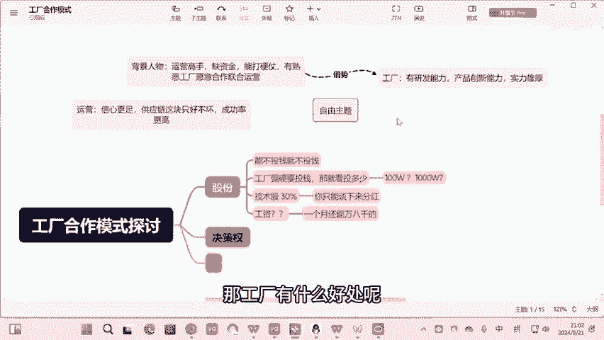
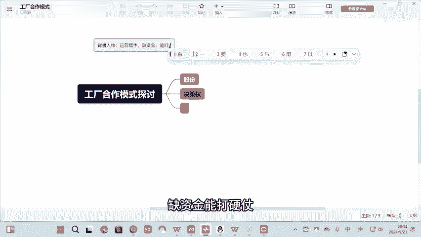
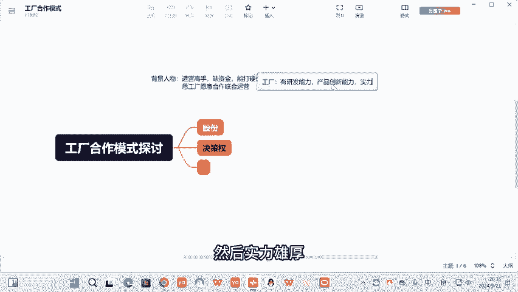
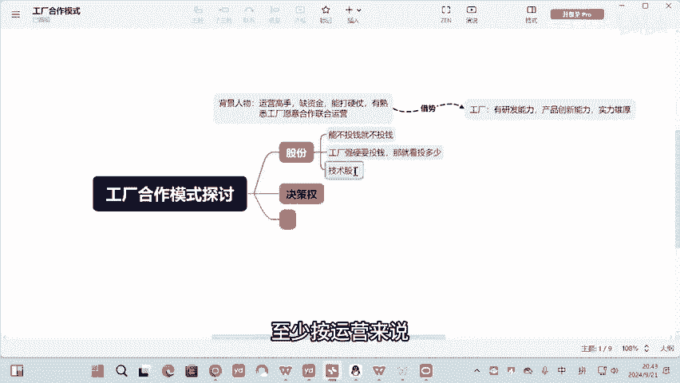
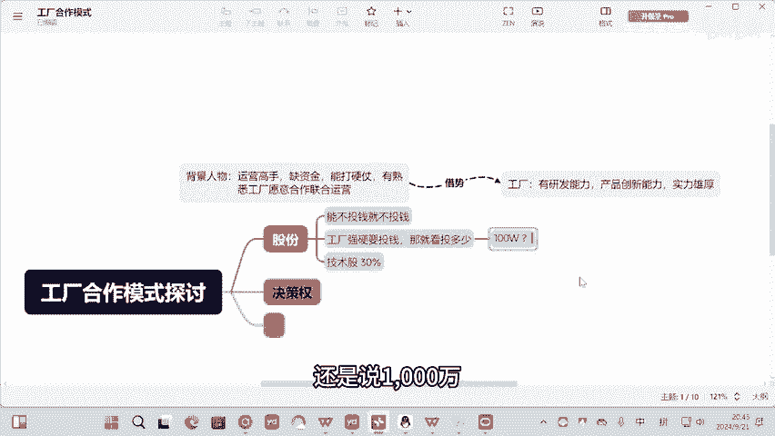
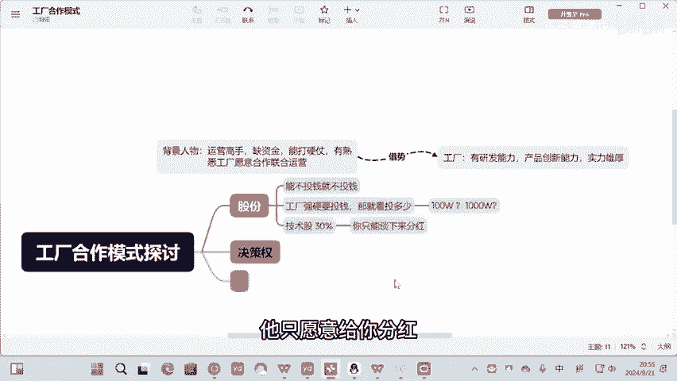
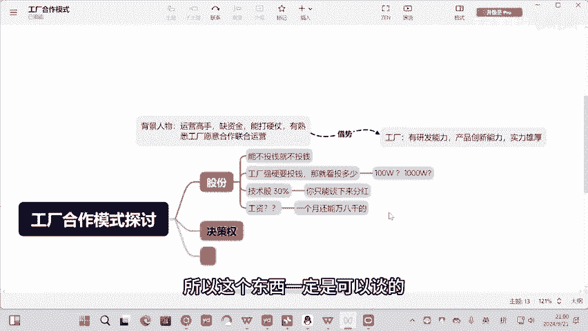
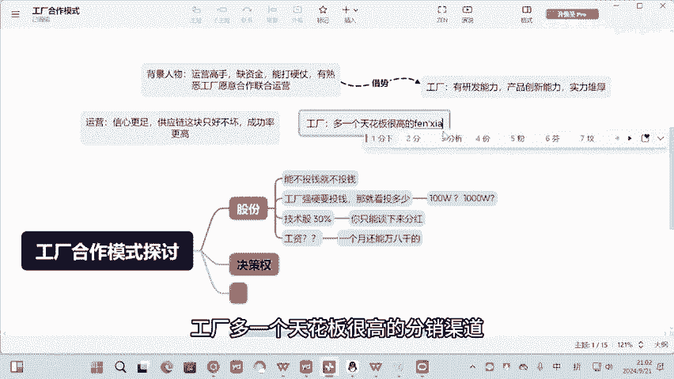
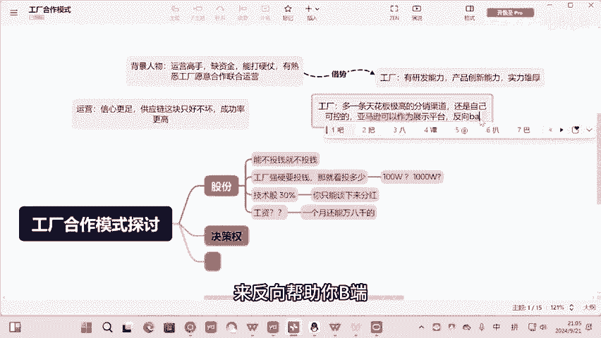

# 工厂合作模式，运营方怎么和工厂共赢？ - P1 - 东子策跨境 - BV1KvsYexEVW

这两点就能让你的成功率更高了，对不对？运营是有这个好处的那工程有什么好处呢？😊。

Nice。跟大家好好聊一下这个话题啊，我觉得这个话题其实挺挺有挺好的。包括每个每个人每个运营，每个公司我觉得都可以一起来聊一下。就背景人物就是运营高手缺资金，能打硬仗，有熟悉工厂愿意合作联合运营啊。

我的观点是联跟工厂联合运营是没毛病的。为什么工厂入局，尤其是什么工厂呢？有研发能力，产品创新能力，然后实力雄厚，我觉得借势没毛病啊，然后我们来讨论一下吧，如果我是一个这样的运营高手。

我会怎么去思考这个问题啊，我觉得跟工厂要怎么谈啊，首先股份这一块啊，我觉得是能不投钱借不投，对吧？我我投技术嘛，因为大家一定要知道一个点啊，我本来就缺钱，对吧？我自己在公司打工肯定也没多少钱。

然后通过做亚马逊还创业也没做起来，那说明我手上没什么太多钱的。亚马逊又是极有风险，会亏很多钱的一个项目。如果。

跟工厂能去谈判，我不能不投钱，我就坚决不投钱。但是这个里头会有一个问题，就是工厂可能会觉得不好意思，你不投钱，我就不跟你玩。那如果工厂强硬要投钱，那就那就看投多少了，对吧？然后因为在这个里头。

我相信正常来说，肯定是有技术股了啊，就像我之前跟大家聊过的。我们的技术股至少按运营来说，技术股至少是10%到30啊，至于投多少钱，就看你们工你们你跟工厂假设如果一定要投钱。

那你看你的启动资金是100万还是说1000万，这个东西也要量力而行。你说太少了，就没意义了。可能技术股是30，就看你怎么谈。有可能你只能谈分红股啊，有可能你只能你只能谈下来分红，对于很多工厂来说。

他不愿意把股份给你，他只愿意给你分红，然后还有一点，你去谈这些东西的时候，要不要谈工资。因为对于我们来说，你如果能谈还能再谈下一些工资出来，例如一个月万八000的，至少能解决我们的生活保。

啊这个模式没问题的，前期可以过渡，后期可以补强产品研发和供应链资源。是的，其实这在这个里头很多时候其实都可以是一个动态的股份技术股，你如前期我这技术股30我都可以拆解掉。如果你工厂要测试我的能力也好。

或者怎么着，对吧？我可以动态我达到一定业绩，我的技术股占多少，我觉得没毛病吧，所以这个东西一定是可以谈的。运营方对吧？它有哪些好处，他是不是信心更足，比你用自己的钱玩是不是信心更足。

然后包括你在产品这端就供应链这块只好不坏，对不对？这两点就能让你的成功率更高了，对不对？运营是有这个好处的。那工厂有什么好处呢？工厂多一个天花板很高的分销渠道出来了呀。

我觉得这个好处就值得所有的工厂去尝试去拼一把，并且这个天花板很高是什么？这一条分销渠道可以打败你之前所有的分销渠道。

嗯，我觉得工厂能能说服他们，或者能跟他们聊这个点的就是你工厂认不认亚马逊这个渠道非常优秀。亚马逊这个渠道利润率非常高。你认那你如果有这种联合运营，相当你是有自己的运营团队在分销你自己的产品。

你自己可以开多少新品给到这些运营去用了，还是自己。可控的这个东西，亚马逊可以作为展示平台反向。其实这个东西是很多工厂没有认识到这个点的。你在亚马逊上能做BS或者你们的工厂的产品。

在亚马逊上面的市场份额占了超过30。很多B端的小小B端的一些人，他们会反向去通过C端的渠道，找到B端的工厂。这个大家认不认。我相信这个点大家是认的吧，对吧？要么就可以作为展示频来反向帮助你B端。

我觉得这就值得工厂去做联合运营了。

