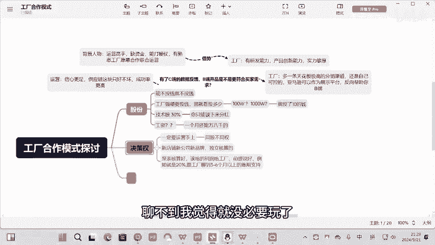
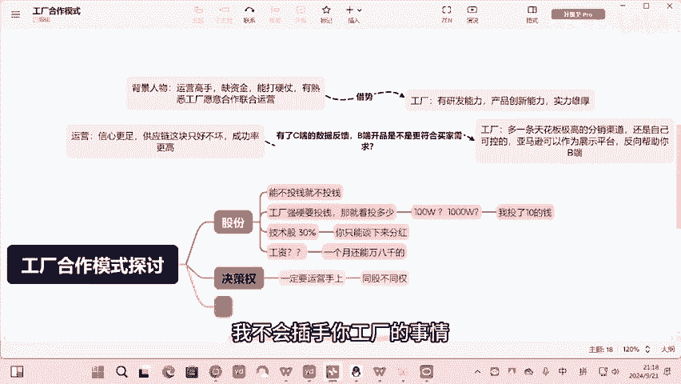
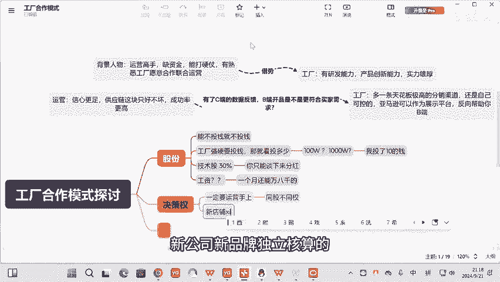
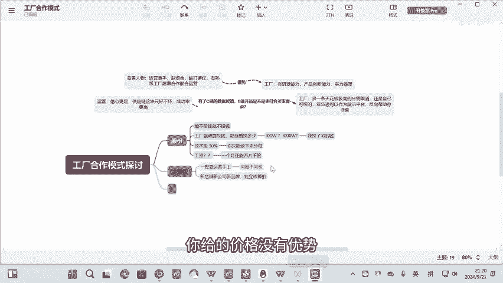
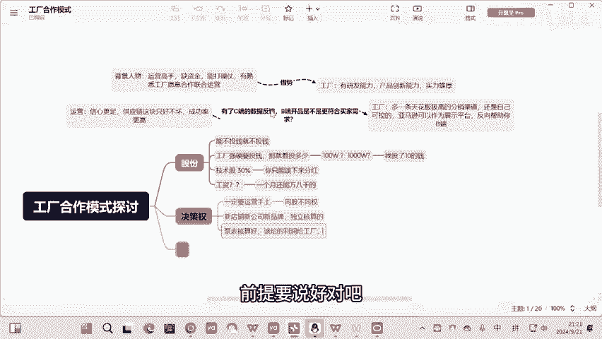
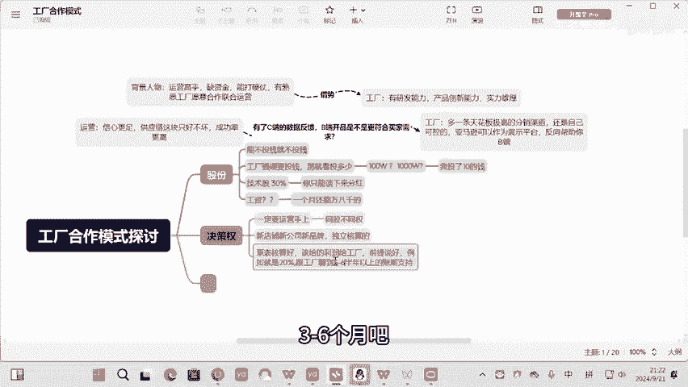
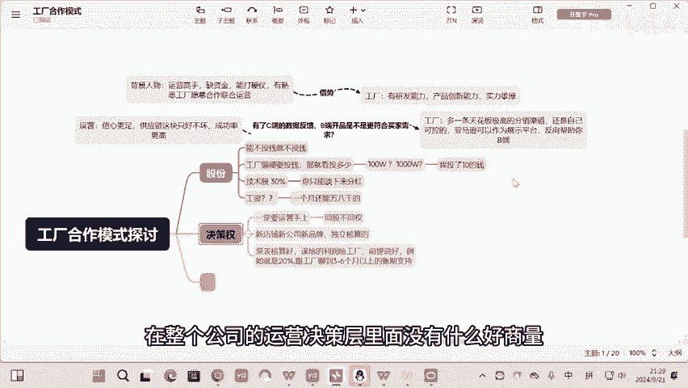
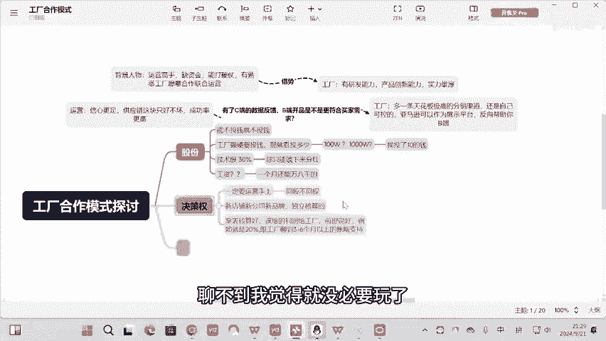

# 工厂合作模式，运营方怎么和工厂共赢？决策权方面 - P1 - 东子策跨境 - BV1fHsreKEkE

在整个公司的运营决策层里面没有什么好商量，聊不到，我觉得就没必要玩了。

Yeahあ。好，聊完股份了。假设我举个例子，我投了20%的钱啊，先不论这个资本是多少啊。我假设我投了十0的钱，然后也有30%的技术股，相当来说我是有40%的股份，聊完这些东西了。

我觉得决策权一定是要在运营手上的。所以这个东西你一定要跟工厂去谈一个什么同股不同权，就是运营上面的事情，一定只有我们能控制，一定我们说了算，这是我们能够在一起前期就能合作的机淀。

就是你认可我的能力认可的人品认可我会把这个事做好。那O专业的事情交给专业的人，我不会插手你工厂的事情，你也不要插手我运营的事情。然后这个里头一定会是什么，一定是新店铺新公司新品牌独立核算的。

这是没毛病的。按我们跟工厂的聊法，就是我一定需要你把泵表给我，但是我们要卡好一个线提前要谈好，对吧？并且你是工厂啊，他妈的你给的价格没有优势。那大家都已经。

就丧失了合作的意义了，你知道吗？对吧？蹦表核算好。对吧该给的利润给工厂前提要说好，对吧？例如就是20%，如果这都做不到，他妈，那这个工厂也太没实力了吧。如果你们工厂对吧？核算好报表之后的利润。

因为正常来说，任何工厂也不可能亏本去卖啊，比你要知道一个点啊。😡。

跟工厂聊到半年以上的账期支持啊，对不对？3个月吧，3到6个月吧，决策权运营这段决策权一定要在运营手上一定要谈好，对吧？运营的权利，可能我至少是要超过50%的。在整个公司的运营决策层里面没有什么好商量。

聊不到，我觉得就没必要玩了。是。

