# 已完结 【小红薯运营实操课 】 手把手教你起号变现 共45节 - P12：12_第11课：小红书站内选品1- - B站学习课堂 - BV1bQveefE17

大家好，这节课给大家讲解小红书站内是怎么选品的，那么小红书站内选品的第一部分给大家讲，就是，如何在小红书的商家管理后台有一个笔记灵感，这样一个数据通过特去选品，那么为什么要通过他去选品比较好呢。

因为它是实时更新的啊，带大家去看一下，那么具体这个笔记灵感怎么去找呀，咱们打开咱们小红书的商家管理后台啊，点击笔记，那么有个笔记管理笔记榜单，笔记灵感点击笔记灵感啊，那么这个笔记灵感你看有个每周热点。

那说明这个每周热点什么意思，就最近一周比较热门的话题，小红书话题，那么这个话题是热门的，那么这个话题背后的背后的笔记，是不是也是比较好的，比较容易爆的，那么这个笔记容易爆。

那么咱们根据这个笔记对应的产品去选品，这个产品是不是也是好的，对不对啊，那么接下来带大家去实操一下啊，啊首先咱们去根据自己类目，如果你类目是女装的话，以女装为例，咱们选一个服装搭配潮流也可以啊。

咱们选服装搭配，服装搭配的话选第五个吧，选个内搭啊，因为现在不是春天吗，秋冬秋季的产品其实就是春装的啊。

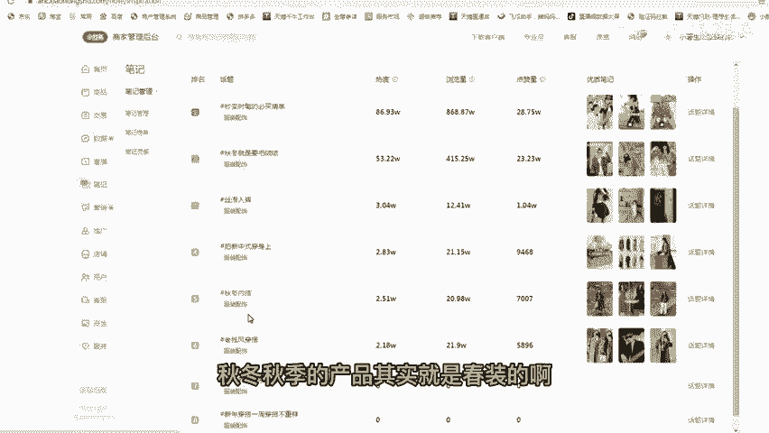

那么秋冬内搭咱们点击话题详情，那么证明你看很多村庄是吧。

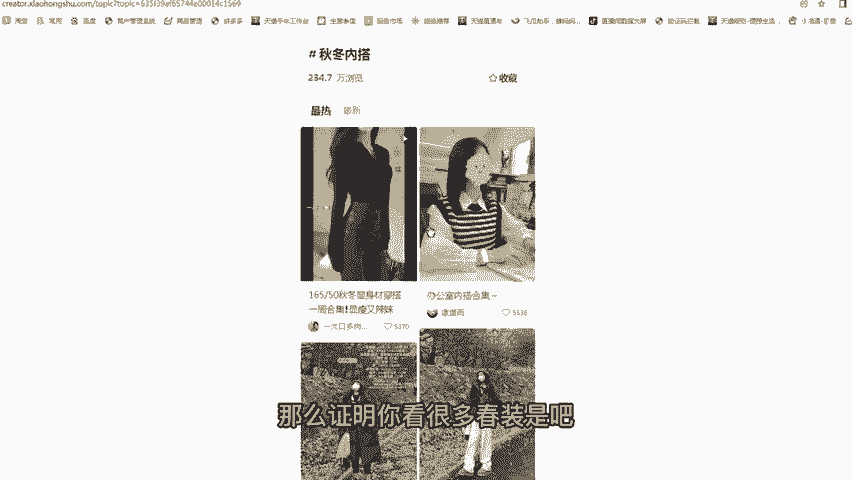

咱们主要选村庄村庄啊，因为现在是春季。

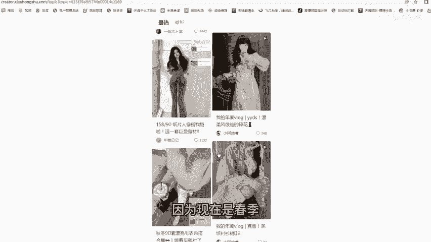

我们村庄的话，哎我觉得这个还不错啊，5000多个点赞啊，这个还不错嗯，还挺好的啊，挺好的，很可以啊，嗯那比如说是第一个，我觉得第一个挺不错的这个产品，那么我是不是可以把这个产品去截图。

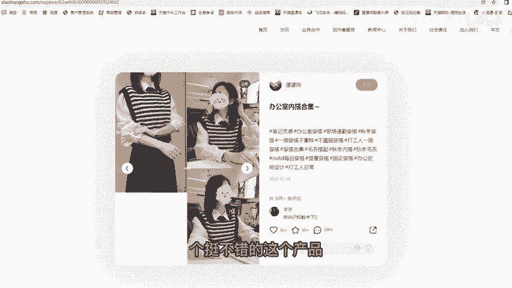

在多多里面搜同款。

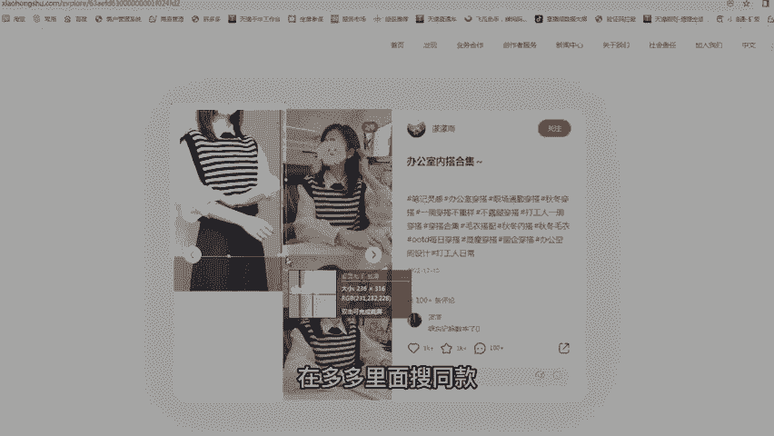

是不是可以找到这样一个商品，对不对，看这我这是第一种啊。

我再看有没有其他的啊，你看这个也可以啊，你看这个啊。

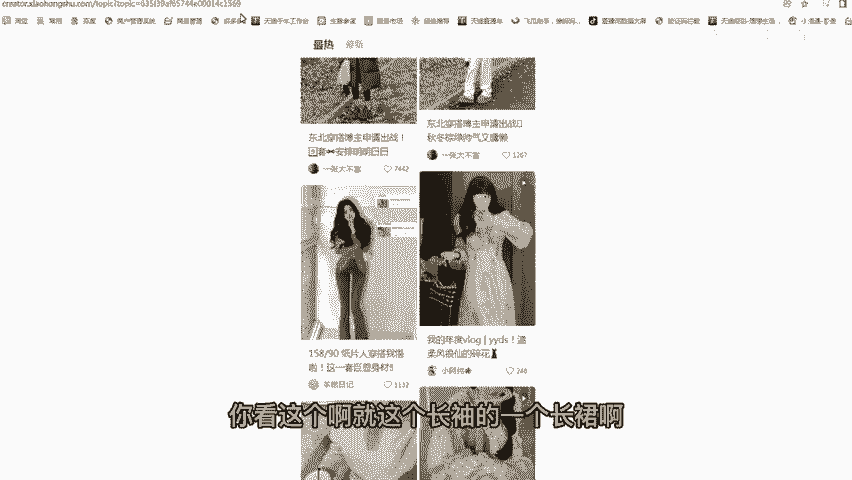

就这个长袖的一个长裙啊，这长裙也可以，你看这个长裙也很简单的，100多个点赞了，然后这评论有有十几个了，也也不错，你看这个长裙全是图片拼接出来的，挺好的啊，嗯再看这个这个74个点赞啊，也还可以啊。

都是图片拼接的啊。

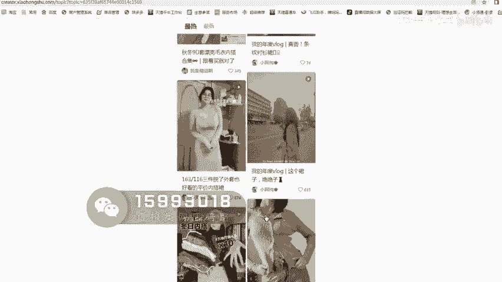

这个615的这个相对来说好一点啊，也是图片拼接的。

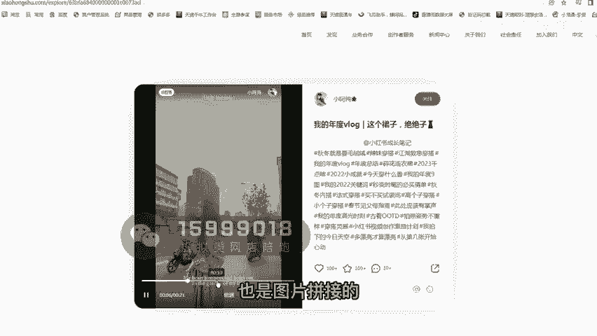

像这种款子大家都可以去跟一下啊，嗯那么带大家演示一下，比如说这样一张图片，咱们拿拿出来咱们的手机，然后打开拼多多。

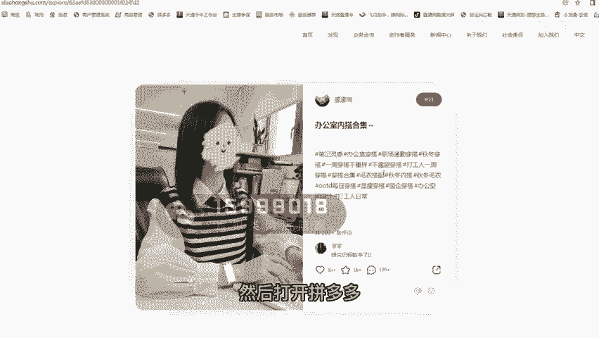

然后去扫码啊，扫这个图片啊，咱们去扫这个图片啊，扫完图片之后，然后出现很多这样一个同款，大家看一下啊，咱们找咱们要找那个源头的一个上上家啊，那咱们肯定要找一个销量比较高的，你看这个一平5万。

咱们点开看一看啊，19块八价格也挺低的啊，像这个款的话，咱们看一下嗯，评价107个。

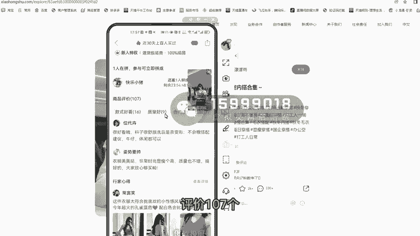

那么这个评价107个，那这个评价是没办法，100多个，相对来说它相对来说比较真实了，他不是那种二道贩子啊，二道贩子，那么这个款就可以用了，而且价格还挺便宜的，19块八啊，不对啊。

这真正的这个款式卖21啊。

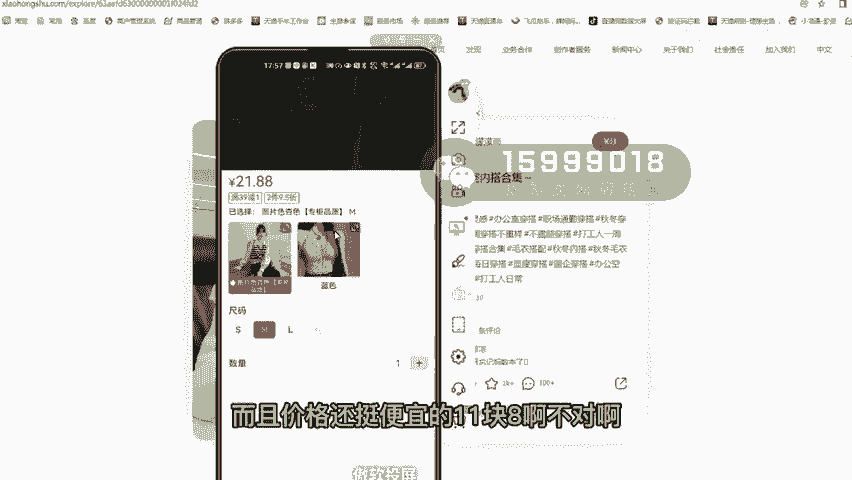

也不贵，那么咱们可以翻倍，可以去卖啊，嗯那么咱们选择这个这个点赞，434个也可以，它也是一个村庄啊。

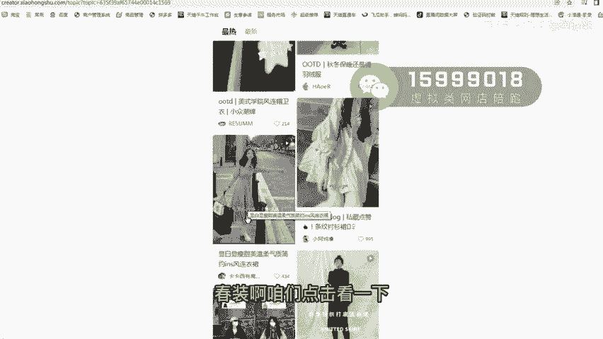

咱们点击看一下啊，然后用那个多多去扫码啊，扫码是这样一个，我看第一个啊，第一个销量挺高的啊，27块钱也不贵，然后是评价152个啊，那么这个评价是100多个，也是真实的，像这个素材也挺多的，它有个主图。

对不对，像主图的话，咱们完全可以去扒下来，然后是传到咱们的小红书店铺里面啊，啊传到咱们小红书的一个笔记里面，主图这个视频可以直接当成一个视笔记，视频去发，那么他的买家秀买家秀也是比较好的。

咱们也可以保存下来。

保存下来，咱们取那个当成一个图文的笔记去发，都是可以的啊，嗯但是那个服装类的，我建议大家如果是图片类型的话，也建议把图片转换成视频。

