# 已完结 【小红薯运营实操课 】 手把手教你起号变现 共45节 - P1：01_{必看}小红书看课指南- - B站学习课堂 - BV1bQveefE17

Hello，宝贝们，感谢大家信任啊，嗯今天这节课呢主要跟大家梳理一下，小红书的一个学习的一个流程，怎么去看课啊，就是你在看课之前必看的一个看课指南，嗯那这里的话首先一个点啊，这套呃小红书的课程呢。

总共是目前是更新到了48节课，后续还是会不断的给你们去进行更新去迭代啊，也会给你们啊出一些最新的玩法啊，包括如果说出现最新规了，也是跟你们同步的更新啊，那这套课程的话是由我本人跟我的运营合伙人。

我们一起共同打造的啊，我们运营合伙人呢啊，都是做了有10年以上的电商运营经验啊，而且也是陶大的一个官方讲师啊，所以呢这里的讲的一些细节呢，会偏详细一点点啊，大家如果说是在在看的过程中。

如果说有重点地方啊，一定要拿本子有笔啊，就好好的给大家去记下来嗯，那包括如果说有什么更新迭代的啊，大家一定要去啊给他去进行一个观看。

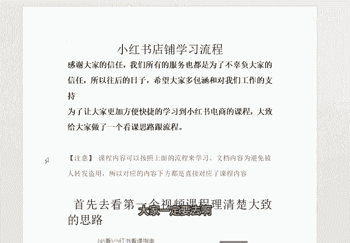

包括到时候呃像软件考古家跟灰豚，一定要找到老师啊，把这个工具呢给到你们去开会员嗯，那以及社群的话，只要你们课程的是看到10%的左右，我们是会把你们直接的拉到社群啊，这个目的呢也是一个点啊。

就是最基本的咱们也得开完店铺啊。

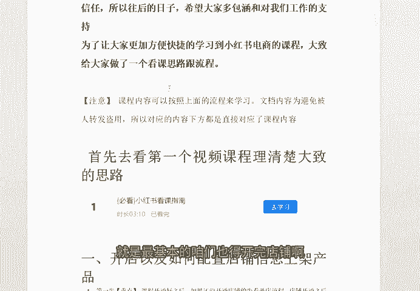

这样的话咱们沟通的会比较稍微顺畅一些，嗯好那这里面首先啊怎么去看课啊。

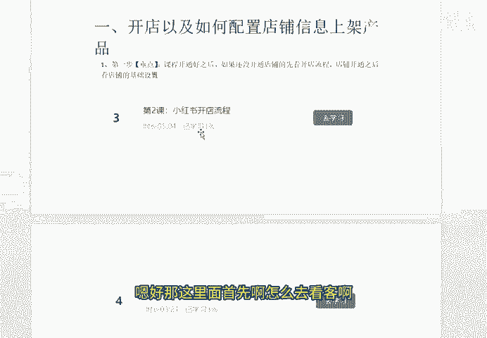

第一个第一个啊，第一个你要干嘛，首先你要把小红书店铺给开通了啊，这个开店流程这是最基本的啊，那这开店的话。

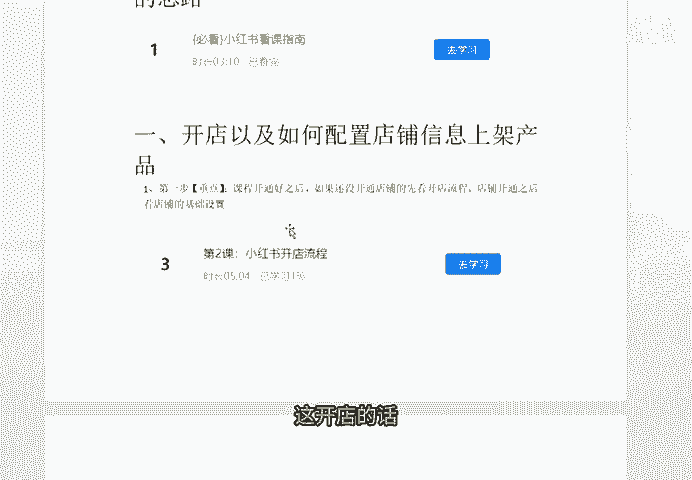

首先啊，到时候你们如果说电脑开跟手机开都可以的啊，然后那接下来你开完店铺之后呢。

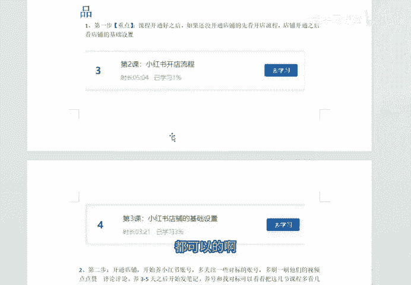

不是万事大吉了，你的店铺的基础设置，什么物流发货，售后啊，一大堆一些可一些基础设置啊，一些小细节你都要给他去设置好啊。

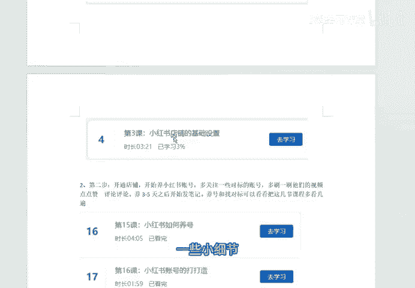

然后呢接下来接下来设置好了之后，接下来你的新号啊，特别是你刚注册好新号，你一定要先去养号啊，养号是怎么养呢，首先多关注啊，一些对标同行，多刷一下他们视频啊，去点赞啊，去评论养号，养了3~5天之后。

你再去开始去发笔记，那这些养号细节的一定要去看啊，因为你没有养号的话，你可能流量是很低的哦，啊那第16节课，第17节课啊。

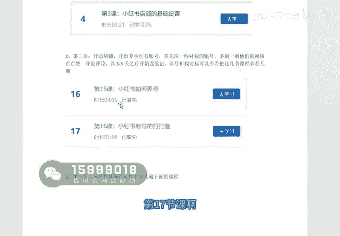

你们可以去把这两节课给多看几遍，那第三步的话，这时候就是我们的一个选品的一个实操了啊。

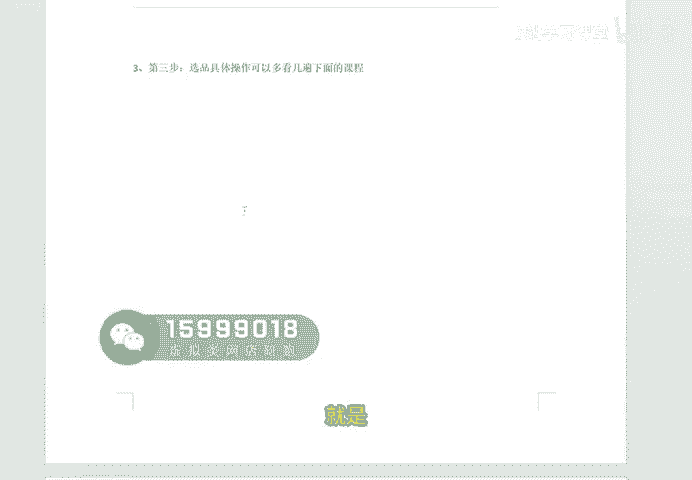

那这里面你就记住我，您就是记住我说的点啊。

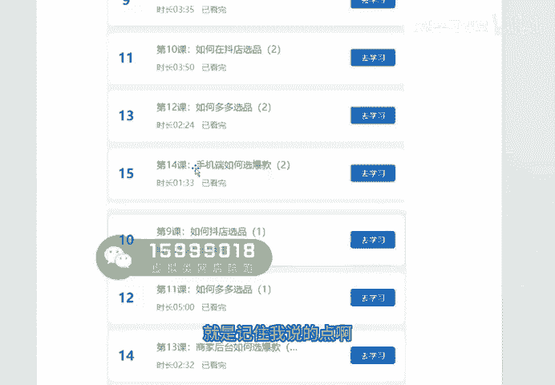

就是做电商七分靠选品，三分靠笔记，选品的话，因为你做的品类不一样。

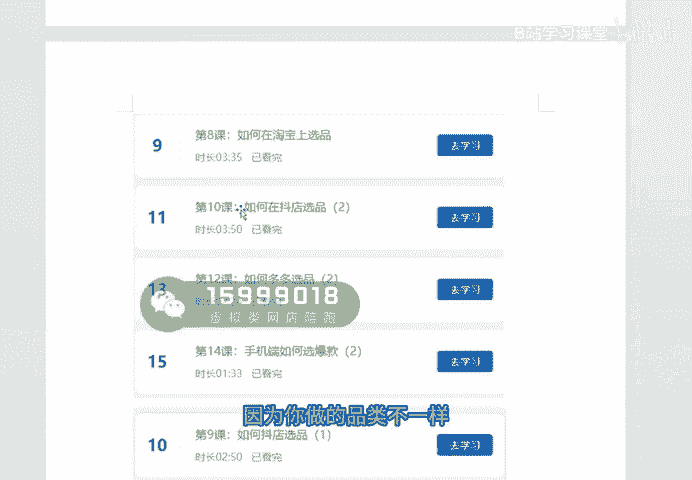

你的选品方式方法完全是不一样的啊，因为你像拼多多也好对吧。

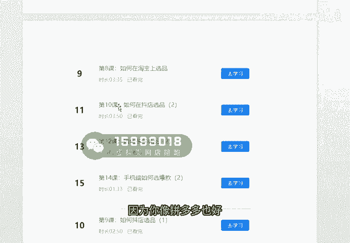

他是专门是针对什么三四线的一些人群，所以说选低客单选百货会比较好选。

所以那这里面有针对性的一些类目去选品，比如说如何嘟嘟选，如何抖店选。

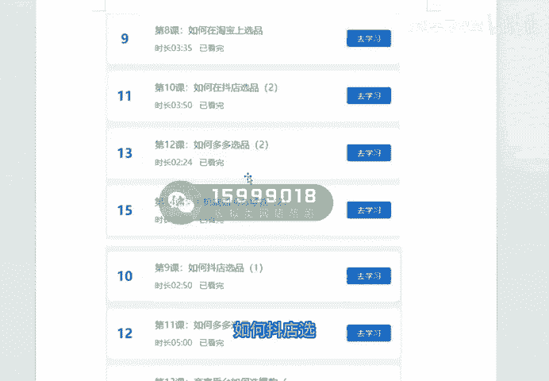

如何某宝选，如何在手机端选品如何在什么呢，在呃用考古家如何用灰豚数据。

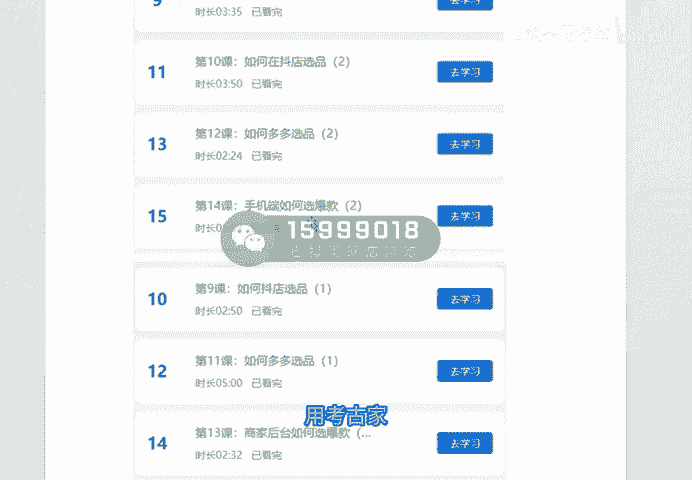

用工具去进行系统去选品啊，那这些选品方法啊。

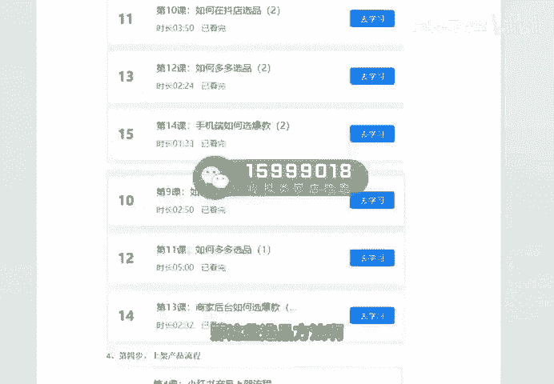

你要看你的一个类目去来啊，到时候也会给你们详细的给你们去啊。

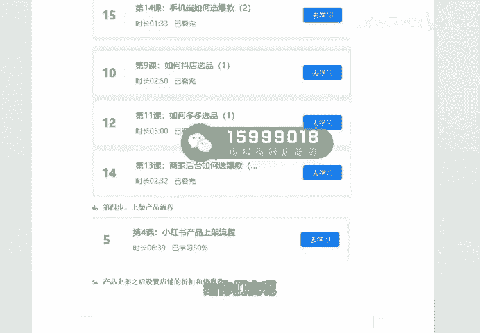

给你们去进行一个解读啊，给你们一个实操啊，好那评选好之后呢。

接下来就是我们就要去上架产品，以及去设置好，我们的一个店铺的产品的优惠券啊。

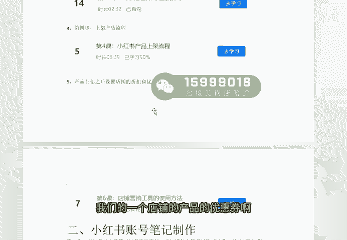

就比如说打折呀对吧，买十减多少。

是这东西，你要去它是可以提高你们店铺转化率的啊，呃也是能提高你们店铺的一个点击率啊。

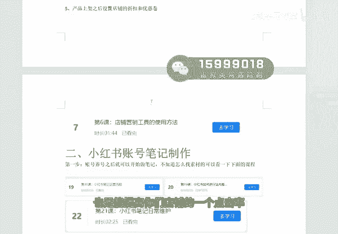

那还有一点就是你的一个定价公式方法啊。

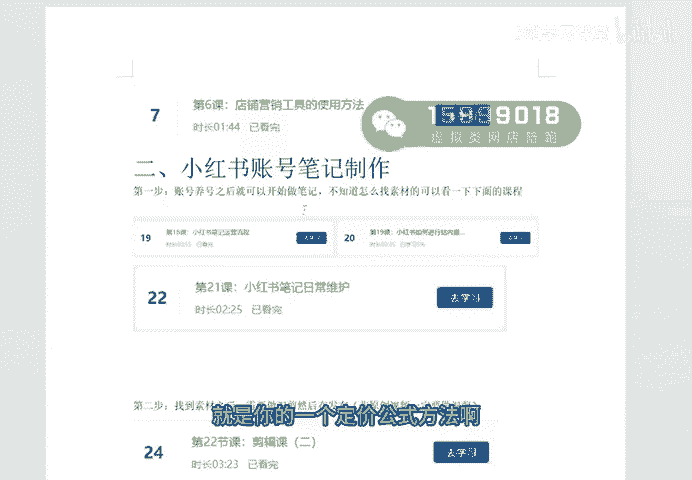

都要去学，都要去看的，嗯他不是说是我简单说两句话啊，你可能就能理解嗯，那这里呢我们产品商量好了之后呢，你要去发笔记，那笔记的话无非就两个点。

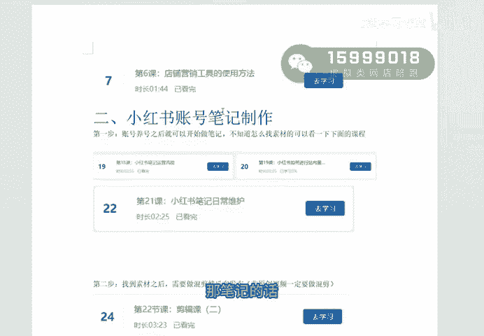

一个是找素材对吧，一个是剪视频好，那找素材怎么去。

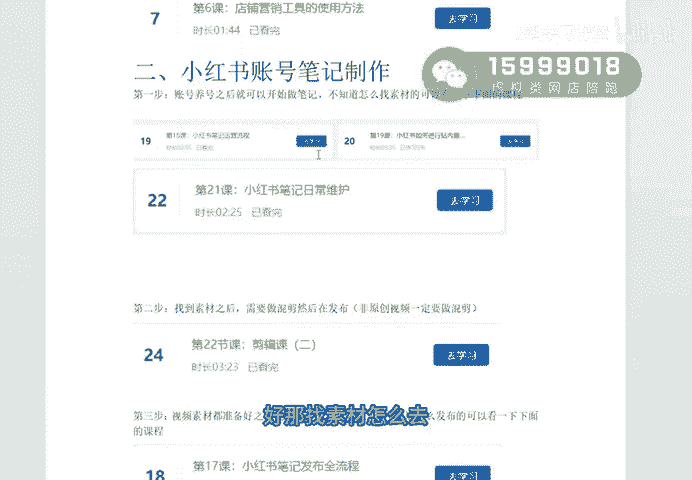

怎么去批量去找素材，如何去进行批量的去搬运啊，以及如何去更加高效率的去剪视频。

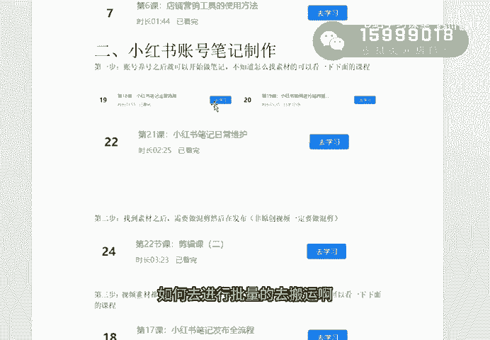

以及怎么用电脑剪，怎么用手上去剪好。

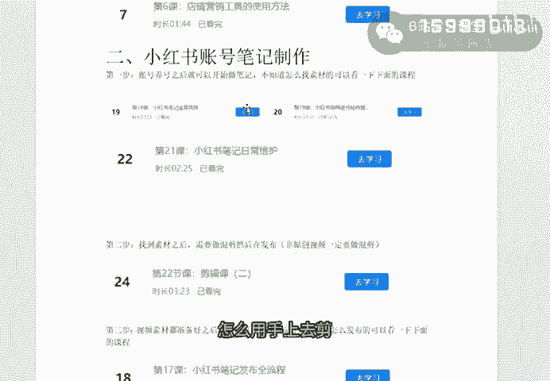

整个流程都会给你们去实操的，就是非常非常的一个详细啊。

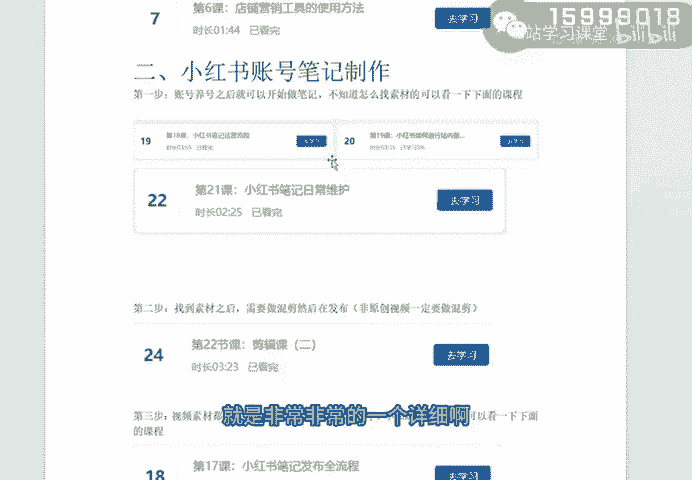

所以剪辑课啊，发布流程还有笔记报了之后，怎么去维护好你笔记。

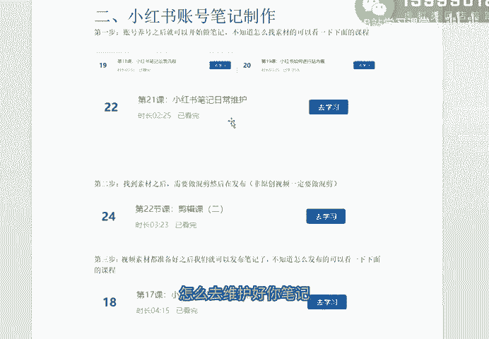

让你出更多订单啊，那这些细节啊就是也就是我们核心了啊。

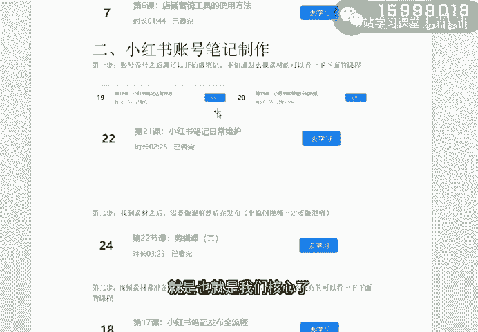

好把这些课程全部给看了啊，我是建议大家课程最好是看三遍，第一遍你先把整个流程大概的给梳理一下。

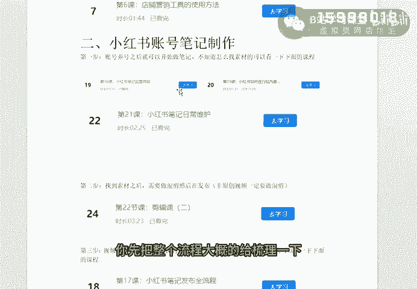

第二遍一边实操一边跟着看，第三遍哪个地方不懂。

你在选择性的针对性的去进行的观看啊，包括到时候如果说出单了对吧好。

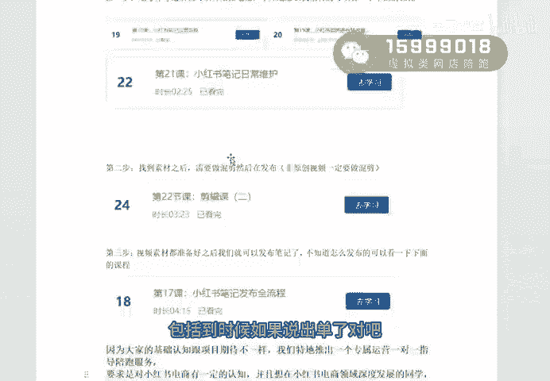

怎么去发货发货，怎么去导表格啊，这些细节啊，这些东西一定一定要把整个流程给他，全部的给他去啊，就是学在你的脑子里面啊，无论是你做任何电商也好，做任何任何电商平台也好。

方法它都是相通的，嗯然后后续如果说是有什么不懂的一些问题啊。

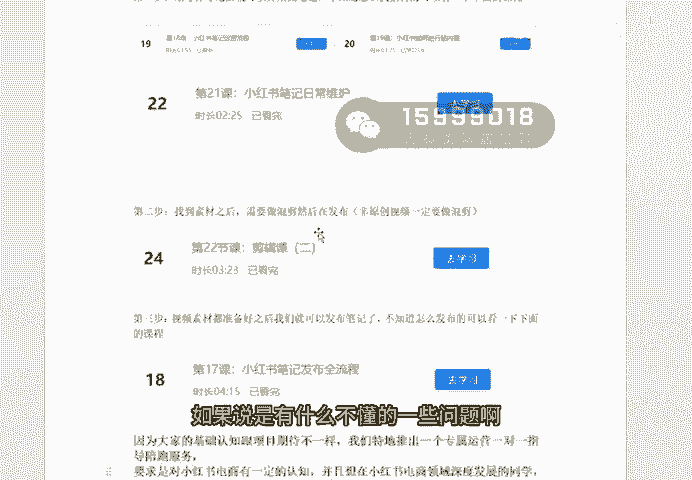

就比如说看多多过程当中诶，哪些点诶你针对性的，你不会，你不懂好。

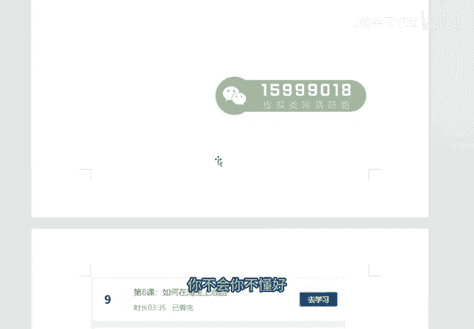

可以提出来啊，在群里面提出来你的问题，然后第二个如果说你在实操过程中对吧。

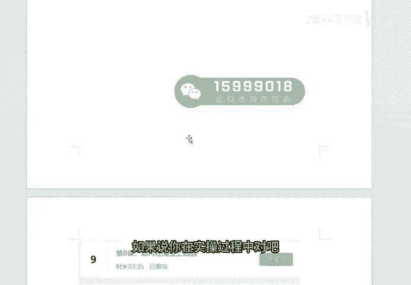

又遇到哪些困难啊，哪些是比较棘手的一些麻烦啊，都可以在群里面啊。

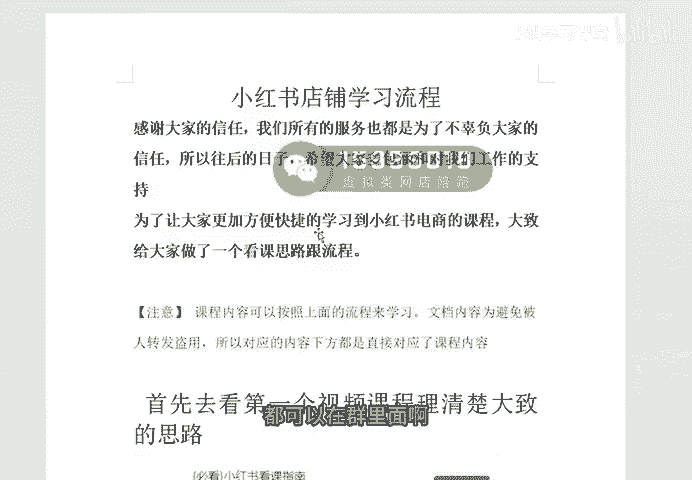

就问我们就好了，嗯好啦，感谢大家嗯，那祝大家早日报单啊。

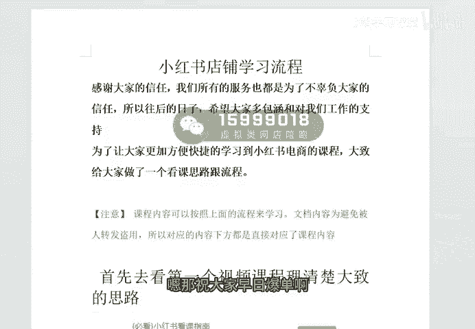

报单之后呢，大家也可以再发个在群里面啊，发一个出单了，发个报喜了啊，就是也会给你们去发个小红包嗯，好就这样了。

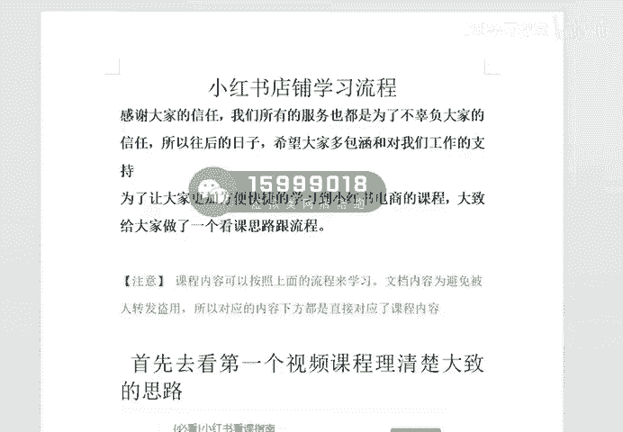