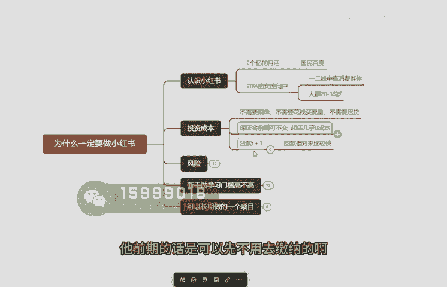
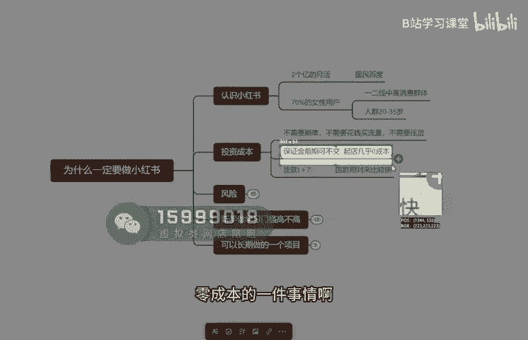
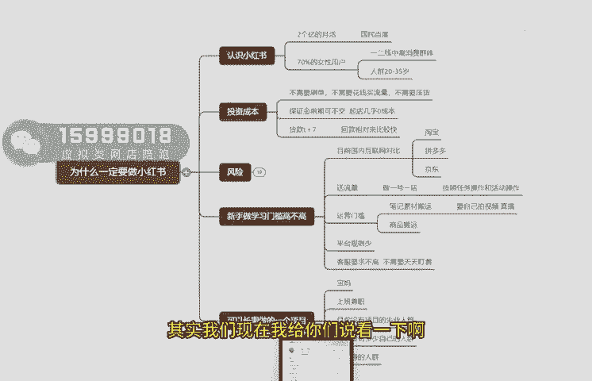
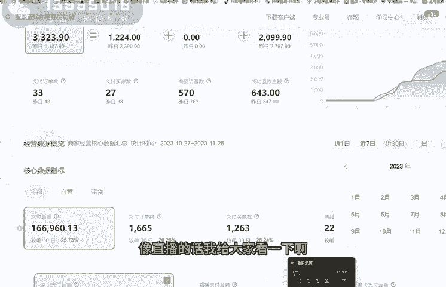
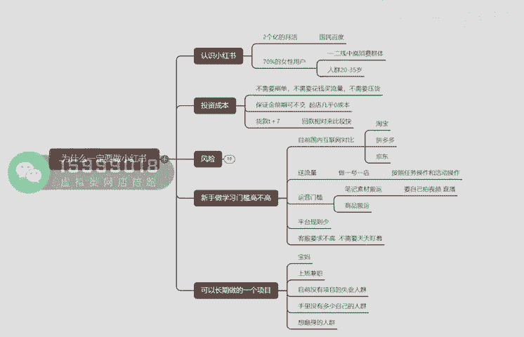

# 已完结 【小红薯运营实操课 】 手把手教你起号变现 共45节 - P2：02_第1课：为什么要做小红书- - B站学习课堂 - BV1bQveefE17

Hello，欢迎大家，这一节课呢就是给大家讲讲，为什么一定要去做小红书带货，首先啊小红书这个平台呢，它目前的一个整体的一个月活的话，它是两个亿的一个月活啊，就是基本上就是咱们熟知的。

就是一个国民的一个小百度，那很多人呢他们啊就是买什么东西呀啊，或者说是准备啊，做攻略之前都会下意识的去打开小红书啊，所以这个平台的话，它的一个种草属性呢是非常强的啊，包括就很多一些素人呢。

他都是能提供一些建议，提供一些帮助，所以这个平台是人人都可以去当博主，人人都可以去进行一个带货的一个平台啊，那这个平台的话，首先说一下啊，这个平台的用户的一个人群画像，这个平台呢嗯。

70%都是一个女性的一个用户，而且都是一二线的中高的一个消费群体，主要的一个人群呢是在20岁到35岁，这个人群啊，你要知道啊，就是但凡是做电商，做电商这个人群是价值非常高的人群，是消费的主力军。

所以这个人群价值是非常非常高的啊，那这里面如果说我们做小红书，他具体该投资多少钱，以及我们成本是多少，来我跟大家说一下啊，首先首先你们去做这个小红书呢，它不像是淘宝，淘宝需要你们补单，那像抖音的话。

你干嘛你需要去做基础销量对吧，他是不需要我们去刷单，也不需要我们花钱去买流量，也不需要我们去压货去囤货，那这个流量我们玩的目前是什么存在流量啊，就跟2020年抖音那一波一样呢。

其实啊就是任何平台刚开始的时候，它的流量成本都很低，但是随着越来越多的人越多，它的流量只会越来越贵啊，那现在这个阶段呢是属于什么平台的，一个早期的一个阶段啊，那你们去做的话，如果说出单之后呢。

你也不需要自己去发货，也不需要去囤货啊，那这个货从哪里来呢，很简单，就是我们可以去干嘛呢，去拼多多去1688，或者说是各大电商平台，然后呢我们出单之后呢，就去找那些商家帮我们去把货给发出去啊。

我们是作为一个中间商的一个角色啊，呃那这个保证金啊，他是干嘛是1000块钱，他前期的话是可以先不用去缴纳的啊。

就是你可以先跳过它，也就是我们做这个事情，几乎是属于一个零成本的一件事情啊。

然后还有就是你们啊货款的一个问题啊，货款的话相对来说嗯，他的风险的话呃就是嗯比较低一点，因为它不像是其他平台，有些平台可能压冠比较周期比较长，像小红书啊，就是7+7啊，T什么意思呢。

就是等用户确认收货那一天，再等个七天时间啊，这个钱就可以直接的从你的账户资金里面，直接给提出来啊，所以说回款相对来说还是比较快的啊，那这个平台有什么风险呢，我来给大家说一下啊，说一下。

首先首先这个平台呢我目前做下来啊，因为我们现在开店也开了有将近60家店了啊，那这项目的话，首先啊很可以确定告诉大家一个事，你什么就是这个项目它是可以长期去做的啊，因为像小红书的话。

首先啊他虽然是个蓝海电商，但是它是国内的唯一一个，能代表种草带货的一个平台啊，你像抖音，其实它的娱乐属性还是比较强的啊，小红书的话呃，整体来说它的一个转化率会比抖音高很多。

那包括像这个平台呢其实有很多玩法啊，不仅说是种草带货啊，B带货，还有什么啊，做IP啊，接广告啊，包括干嘛呢可以去带别人的货啊，也可以干嘛呢，呃也可以直接通过去直播去变现。

或者说是你如果说是中做中高客单的啊，你可以去进行引流啊引流，然后呢去做支付费，那也可以干嘛去做一些同城啊，或者说你想做服务行业的啊，都可以在这个平台呢去进行发展啊，去获客啊，去进行变现。

那这里的话首先啊给大家说一下啊，目前来说呃就是小红书的电商平台的话，它的商品是比较少的啊，你们可以去看一下啊，小红书上你去随便去搜一下，随便去搜一下女装啊，你会发现像女装这个大类里面它销量啊。

第一的一个样板也就才4万多，5万多销量，但是放在任何个电商平台，基本上都是十几万的一个销量打底啊，而且这个商家呢也是干嘛比较少的啊，就是专业的人干嘛会比较少一点，所以说对咱们普通人来说的话。

机会就更加大一点，那目前的话那小红书的话，他是没有什么违规的一些罚款啊，几乎是没有的，我们目前呃做这么多店铺下来啊，就只有一次违规啊，就是在去年的时间就是啊因为啊因为什么。

因为那个啊3分钟回复率的一个问题啊，所以说就被扣钱，但是现在的话已经是不考核了啊，所以呃基本上是没有什么罚款的，那还有什么就是你们担心的一个无货源啊，首先无货源模式呢啊它是什么，它是合法合规的啊。

只不过干嘛呢就是你不要干嘛呢，你不要被他们发现你是做代发的啊，所以我们做的模式呢是干嘛，是自己开店，然后自己去上架产品，然后货源平台呢其实除了像八八，还有拼多多啊，像淘特啊。

还有像是呃比如说各大的一些网站啊，综合拿货网站，或者说是专门的一些呃，有代表性的一些拿货网站啊，那这里这里啊拿货的话呃，如果说在拼多拿货的话，还是要注意点啊，因为呃会有面单的一个问题啊。

这个最好是注意些啊，其他的啊到时候也会详细的啊，在接下来内容也跟大家去分享，具体我们该怎么去对接商家啊，那这个新手做小红书门槛高不高呢，首先啊我给大家讲讲目前的话啊，小红书的话。

目前的话啊就是小红书这个平台他干嘛呢，他是给你们送流量的，就是你们开店他就干嘛呢，他就给你们送流量扶持啊，我们是之前是最高，干嘛是拿到了一个10万的一个曝光啊，就是一个新手一个任务曝光。

那包括像如果说呃有什么节日，比如说双11，双12开学季，520圣诞节，还有像什么啊，春节不打养号，基本上只要是有什么季节性的一些产品，那这个平台呢都会有流量扶持，你要去参加他的一个报名活动啊。

按照他的任务操作啊，即可以去啊拿到官方的流量扶持啊，那这个平台的话，我首先啊给你们去对网，就对比一下这几个平台，首先啊呃淘宝这个平台呢，呃它其实更多什么是一个嗯比较什么。

比较偏什么偏传统的一个电商平台啊，而且他的流量呢已经是到了一个瓶颈期，你如果说你不去烧，是烧直通车，或者说你不是品牌的话，其实很难啊，很难做起来，那拼多的话，其实啊就是打价格战就打的很猛的啊。

特别是像北方那边啊，基本上就是他们都是低价，SKU都是亏钱的一个状态啊，就是为了把销量给做起来，那包括像拼多多的话啊，那仅退款的的话也是比较多啊，所以你的售后量会比较大，那如果说你不是厂家。

不是老板的话，你去做拼多多其实有点难的啊，那京东的话现在是打压无货源很严重的啊，就是你只要被发现了啊，他是干嘛是直接给你封电的啊，所以小红书的话会比较相对来说啊，会比较干嘛啊，比较好做一些。

表示更加适合普通人一些啊，那这个语音门槛呢哈运营门槛的话，跟大家说一下啊，就是小红书的话，它的月门槛是什么，就是无非就两个点，无非两个点就干嘛，你要去干嘛，去搬运素材，搬运笔记啊。

然后代表着你的产品要去干嘛，要去上架，所以你要干嘛，你要花时间，你要花精力啊，每天花个至少要得30分钟以上的这个时间，然后呢这个笔记素材啊，你都不需要自己去拍的啊，不小心约实拍的话。

你知道我之前做过实拍，差不多实拍条视频下来起码两三个小时啊，还得去捡，还得要布置道具，还得干嘛，还得打灯光，还得干嘛，还得布置场景啊，所以比较麻烦啊，尽量的前期啊，前期你先去进行搬运，进行就是混剪。

先去干嘛，把网感给锻炼起来，然后之后找到方向之后呢，你再去干嘛再去做实拍啊，那直播的话啊，他干嘛他就需要什么，需要你们大量的时间，因为在小光直播啊，我们基本上一场直播都不会低于三个小时的啊。

那如果说只想做直播的啊，就适合什么适合你，如果说你每天有三个小时以上的啊，你可以尝试去做小红书直播带货啊，那这里面这里面还有什么，就是目前小红书的话啊，就是你们目前去做的话，他其实平台规则还不算是很多。

还比抖音少很多，你像抖音，我之前动不动就干嘛就被扣钱啊，动不动干嘛就半个月啊，又出了个最新规啊，这个还好一些，那包括像客服要求也是不高的，不用你们说是天天去盯着啊，盯着客服，那包括后面呢也会教大家。

怎么样子去自动的去设置客服回复信息啊，可以去节省你们大量的一个时间跟精力啊，那这里的话首先我跟大家讲啊，小红书的话，它其实是干嘛的，也是你们可以长久长久长期做的一个项目，因为不管是宝妈还是说是上班兼职。

还是说是你们是目前没有相应的一个项目的，一个失业人群，或者说你们手里也没有啊，多少资金对吧，那你们干嘛想通过做电商翻身好，那这个平台的话其实会啊是干嘛，会比较适合你们去做的啊。

那不仅啊不仅去带货这个板块，包括像呃直播的话，其实我们现在我给你们去看一下啊。

这个呢额这个是我们自己的店铺啊，这是我们家纺店，然后这个家纺店的话我们也是从去年开始做的，给你们看一下啊，从去年啊11月份啊开始做，然后呢到啊我们去年我给你看一下，去年我们12月份的时候。

那个时候才卖八十四单，八四代卖8000多，然后到现在啊我们一直都是有在运营啊，也是做的是什么，做的是代发的一个模式啊，已经这个月已经是卖了，有将近现在三四天时间已经是卖了16万了啊，就啊从去年到现在啊。

去年做到现在差不多这家店的话已经干嘛，已经是呃，至少是给我们带来了有将近啊200多万的一个，将近200多万的一个收入了啊，那还有个什么就是直播，像直播的话，我给大家看一下啊。

就是我们现在的话有在做直播，因为直播的话是可以结合你们笔记去做的啊，就你比例爆了，干嘛可以去做直播，这是我们自己直播间啊，一场买了86单啊，一场直播销售额是900多啊啊，然后还有像这些啊，鞋子。

还有包括像裤子啊，女装啊都在做，你看这个是卖了700多单一场直播卖的，那现在小龙直播的话也是零粉丝，就可以直接去卖货的啊，这场直播是卖了500多单，卖7000多啊，而且我们是已经是呃做到了呃。

很多次小红书带货榜第一名啊，我们是8月份开始做的是小红书直播，那去年5月份开的做的什么，做的是小红书带货啊，那你们如果说是今天啊，你们确定好了这个方向之后，一定要去坚持，一定要看准这个市场。

因为这个市场它就是跟2020年抖音。

