# 已完结 【小红薯运营实操课 】 手把手教你起号变现 共45节 - P3：03_第2课：如何开通小红书店铺- - B站学习课堂 - BV1bQveefE17

大家好，这一节课主要跟大家分享一下，小红书的一个开店流程啊，那开店之前呢主要有两个名词给大家先说一下，一个是小红书，一个是小红书店铺，小红书的话啊，就是我们的一个账号啊。

这我们账号小红书的话主要有两种类型的啊，一种类型的就是我这种叫白号啊，就正常来说一个人认证的一个号啊，第二种呢是叫企业认证号，就相当于是抖音来黑，就比如说像这种啊。

这种就如果说是带有这种蓝色这种标识的啊，这种呢就相当于是就这个就是一起认证的号啊，但这个的话是要交600块钱的，我跟他讲这两个区别啊，就是个人认证的话，他只能开一家，个人只能开开一家店铺。

就是一个身份只能开一家啊，一个个人或者说一个个体啊，只能开这两种类型的店铺，那企业认证号就干嘛，他可以开什么呃，它只能看企业，只能开企业店，而且它能干嘛，而且能开两家个体店啊。

就是你如果说呃你拿营业执照的话，你可以开两家个体店嘛啊但是不建议，因为他打假违规比较多，除非说你像我们做举证啊，你多开店呃，你可以去呃，去认证企业好啊，一般来说都是以个人认证的主题比较多一点啊。

那这边的话小红书店铺的话有三种类型啊，一种是个人店，个体店，还有一个是企业店，那个人店铺的话，就是你们拿身份证就可以直接去注册了，而且当天注册当天就能过啊，但是要注意一个点，就是你们在开店之前呢。

你要去看一下你的小红书店铺名次，有没有重名啊，你怎么去看呢，很简单，就是比如说我的名字叫做呃玲玲童装好，你去做零琳童装去看一下啊，这个名字下有没有跟你用一样的名字啊，如果说有他开店好。

你要等七天才能去开，所以要去看看，要去查重，要去看看有没有跟你一样的啊，如果说他开店铺，这会显示一个店铺啊，会显示个店铺啊，你要去看一下啊，而且一般来说的话啊，小红书的个人店铺名字呢很简单。

就是你用什么名字啊，后面就是什么什么的店啊，所以最好就是可以给自己起一个，比较专业的一个名字，比如说你开呃童装店对吧，你就写一个什么，你就写一个呃零零工厂童装对吧，后面就出现一个得电。

就会让人感觉就是你是个嘛。

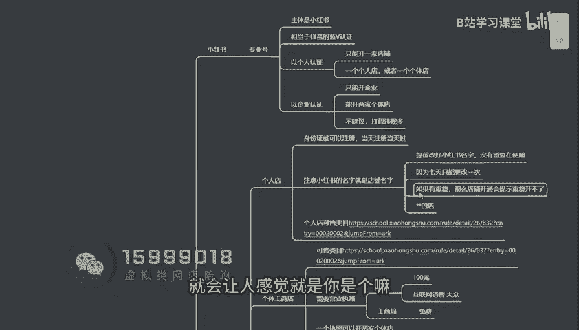

比较专业的一个人设啊，那个人店可售利润的话嗯，就是会相对来说呃，就大部分啊大部分一些基础类目都是有的，什么服饰鞋包日用百货都是可以去做的啊，到时候你们可以点进去查看一下啊，你这个类目能不能去做啊。

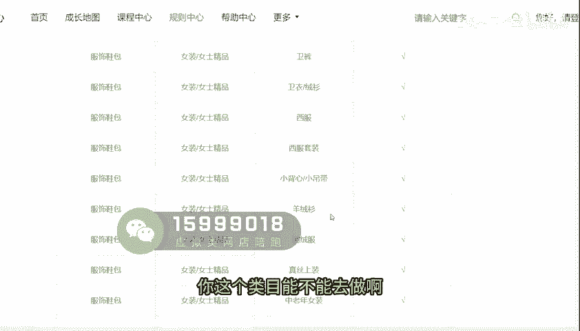

噗好之后呢，在这个地方呢个体店啊，个体店铺的话呃，他可售的类目的话会比个人店比较多一点啊，到时候你们可以自己去看一下啊，那个体店的话，它的一个呃，他的一个门槛就是需要一个营业执照啊。

这个营业执照的话你可以去淘宝上找代卖，就100块钱啊，就搞定了啊，那这个的话你们如果说是经营类目的话，你选一个互联网销售啊，就是大众的一些产品啊，基本上都是可以去做的啊。

那这个营业执照如果说你不想花钱的话，你去工商局啊跑个腿嘛啊，或者说是你去网上自己去办理啊，就比较麻烦一些啊，就是呃看你自己，因为我们我们都是批量在淘宝上去注册的，都是那种虚拟地址嘛，都也不需要花钱啊。

就那个虚拟地址的话也不需要什么，也不需要去注销，然后也不需要做账啊，比较简单啊，那一个营业照的话，他是可以开两家个体店的啊，这个大家应该都知道吧，啊刚刚前面已经讲过了啊，那企业店的话，企业店的话。

它分为普通企业店跟旗舰店跟专卖店啊，这三种类型啊，那呃这三种的话，如果说你有授权的，你有资质的可以去开啊，就会相对来复杂，就比较复杂一点啊，如果说你一很多人会去会去买那种资质啊，我跟大家讲。

如果说买资质，如果说不出现打假还好啊，一旦出现打假的话，你这个嗯比较麻烦啊，但是目前来说，小红书我们所遇到的一些打假会比较少一点，嗯还有就是小红书垫过名字啊，小红书名字怎么去怎么去给他去设置呢。

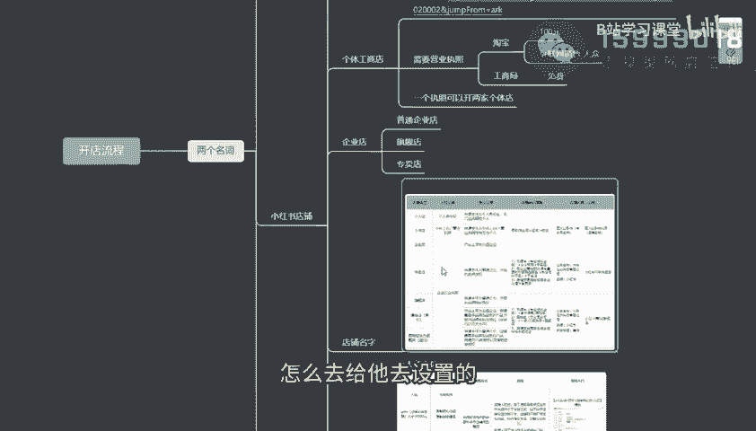

很简单很简单，就是名字啊，这是一个啊官方的一个啊。

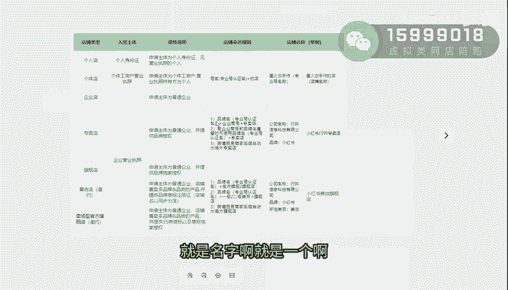

就是名字的一个啊，就是一个名字的一个举例，就是你们如果说个人店个体店啊，跟呃企业店的话啊，如果说你们是开的是这三种店铺的话，那后面的名字就什么，就是你你自己取的，然后再加上什么的店啊。

你自己取的这几个名字的店，一般来说名字是不能超过45个字的啊，不能出现一些logo啊。

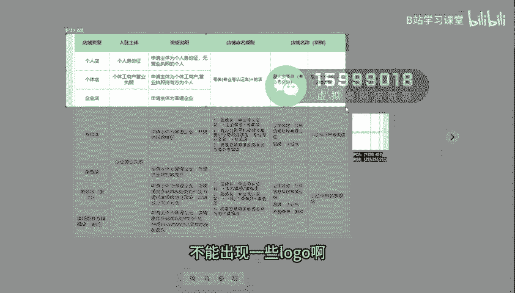

打牌啊，有商标这些东西是不能出现的啊，这个切记了啊，好那专卖店的话就是一般啊。

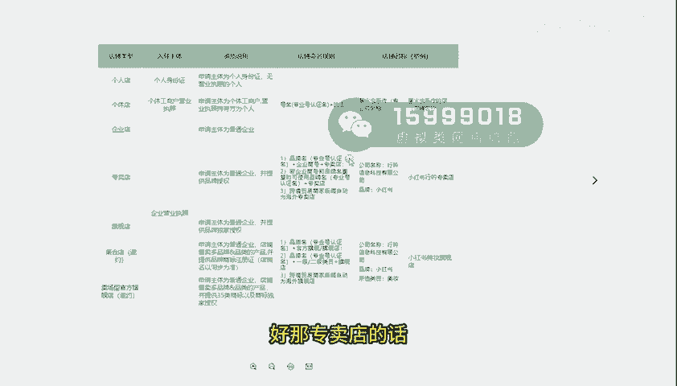

就是你取的那个名字啊，然后呢以公司以公司的名称，然后呢后面干嘛，后面会出现一个专卖店，专卖店啊，你们自己可以去看一下，自己截个图，自己可以看一下啊，这是一个名名字啊，基本上嗯还是这个会比较多一点啊。

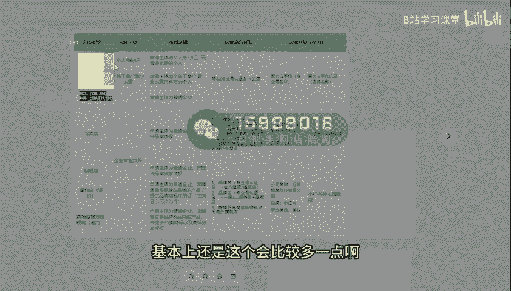

这开的比较多一点嘶好。

然后还有一个啊，还有一个呃，还有一个就是我们的就是保证金这一块啊。

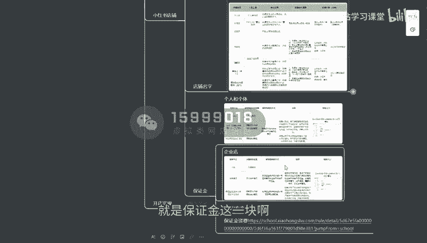

保证金这一块额要交多少，这一块的话啊，主要个人跟个体的话，其实嗯像个人啊，个人店铺的话就是保证金的话呃，跟保证金基本都是1000块钱，但是你如果说开的是个人店，你可以先不用交那个体店的话。

这个1000块钱是可以是一定要去交的，包括保证金啊，一般来说都是浮动的，都是浮动的啊，然后呢呃我给你们看一下啊，就是像企业店铺的话啊，他的话你不交保证计划是限制，是没办法去发布商品的。

所以如果说你们开旗舰店是一定得交的啊，那这个保证金的一个具体的个资费啊，你们可以看一下啊，基本上大部分的品类的话都是1000。

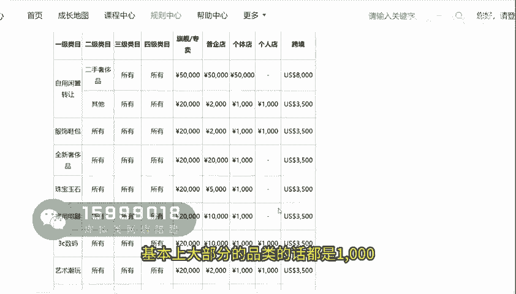

大部分品类都是1000，那开店的一个具体流程怎么去开呢，我给大家演示一下啊，怎么去开通一下啊，自己的一个店铺，用手机去开通就可以了，很简单，首先这里啊你们注册一个小红书账号之后呢，你们点三条杠。

这地方呢有一个创作中心，你们点进去啊，这个的话你选择开店铺，开通店铺，然后这句话你直接点击立即开店啊，这里呢只有店铺类型了，一个是个人跟个体啊，那你们刚开始的话，你们选个人啊，就是就是你们可以看一下嘛。

你们做什么类目的话，你们看看那个就这里这地方有个可收类目啊，你们可以去看一下啊，你们这个类目里面能不能开啊，能开的话，你就你自己去选择好，选择好之后呢，点击好下一步下一步好，那这个地方呢你选择定量商品。

勾选定样商品，那这个经营类目的话啊，精灵梦的话你可以自己先随便选，到时候可以自己后期可以再添加的啊，就比如说辐射细胞啊，你把这些给大家去听好啊，一级二级类目全部给他去填进去啊，家居百货好，你把这个填好。

填进去啊，点确定啊，然后填好之后呢，呃就这个的话啊，你们填好类目之后呢，这个保证金1000块钱，你是可以先不用交的，但是我是建议大家不差钱的，还是交进去，因为你后续的时候你去做运费险设置的时候啊。

包括你支付方式，你想打开那个微信支付的时候，那嗯这个是必须得开通的，不然的话没人家微信支付的时候，是支付支付不了的啊，邀请码可以不用填，然后点到下一步，然后这个干嘛。

这里你再去把你的一个身份的一个信息呢，全部填写好，停下好，然后停下好之后呢，点击我同意，全体叫好，这家店铺呢咱们就开通成功了，然后开发商成功之后呢。

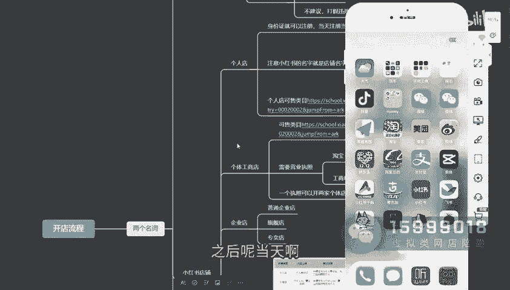

当天啊当天他就能审核下来。

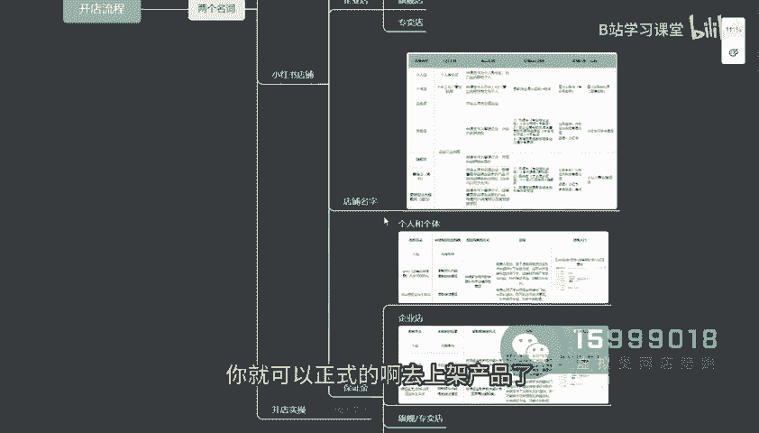