# 已完结 【小红薯运营实操课 】 手把手教你起号变现 共45节 - P4：04_第3课：小红书店铺后台的基础设置- - B站学习课堂 - BV1bQveefE17

大家好，这一节课呢主要跟大家分享一下，小红书店铺的后台的基础设置。

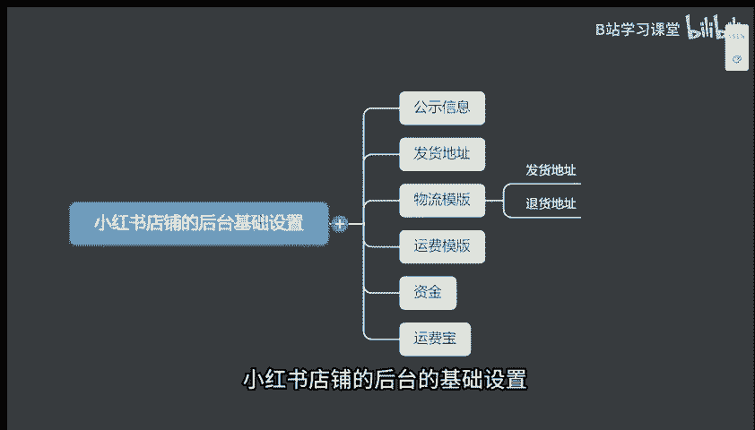

首先我们打开我们小红书店铺后台啊，小红书签到后台，那这个店铺的设置的话啊，在这个地方我们打开小红书，这个地方有个店铺，我们点进去，这地方呢有一个信息公示，那这个联系人呢可以随便写，那手机号的话呃。

你就填你自己的一个号码就可以了啊，然后这里的公式，联系方式最好是连这个有这个手机号啊，然后呢想要地址的话，你就随便填填你的一个家庭住址，或者说是你们公司的地址就可以了啊。

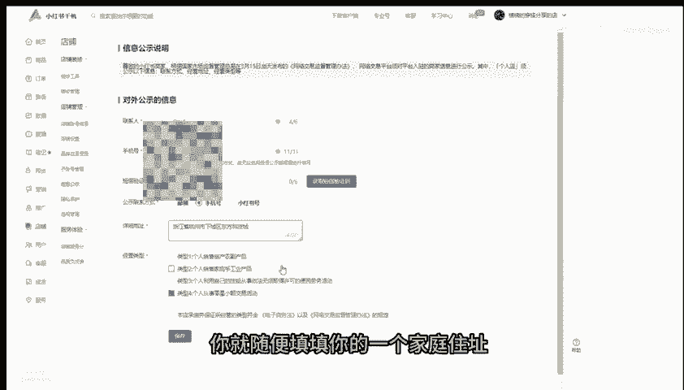

然后这个基因内部呢，我们可以这个地方全部给它勾选好。

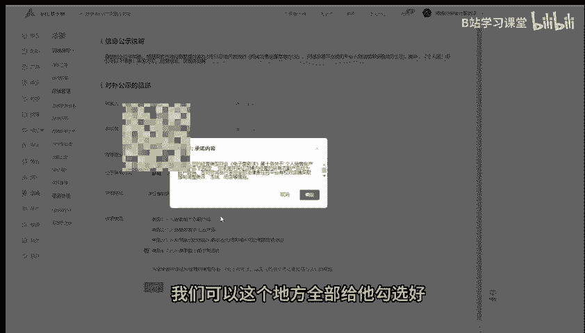

全部给它勾选好四个啊，勾选好点击这个地方点保存就可以了，好这是第一个设置，那第二个设置呢，就是咱们订单的一个物流的一个设置，这地方呢咱们点击这里啊，这有个物流工具，咱们点进去，那这里的话是地址的话。

像这种地址现在已经不能再设置了啊。

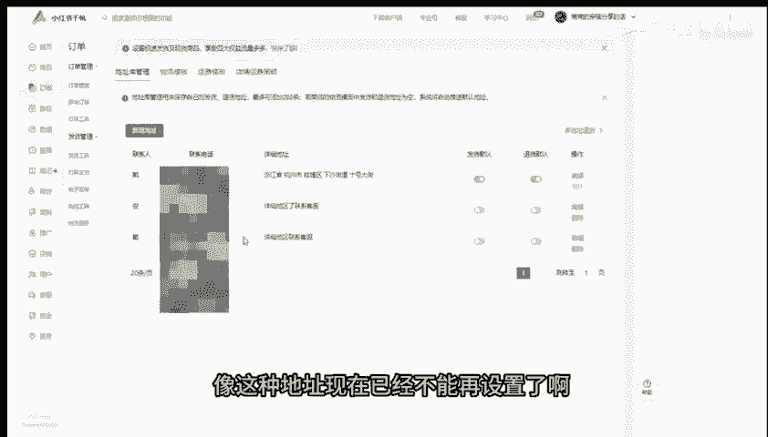

现在我们设置的话，都是要把详细地址给他去填好。

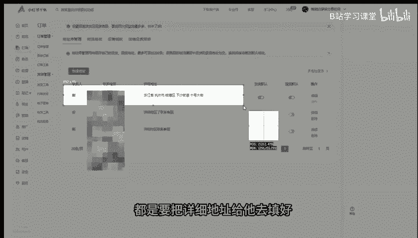

就是呃几幢几单元，几零几门牌号都要写清楚，因为如果说你不写清楚的话，会影响到就是客户确认收货之后的一个，提现的一个周期会变得更加长一些啊，那这这里的啊发货地址和售后地址的话。

这个地方我们可以给大家去设置新建地址啊，就把你的信息手机号，然后呢呃座机号可以不用填，然后呢再把你这个国家地址。

这些地方给他填好啊，填好之后呢，咱们点击提交啊。

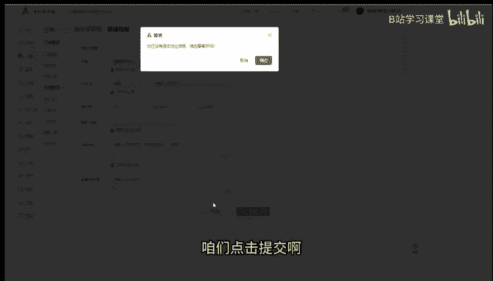

退货地址跟发货地址呢你们可以先填，先先写自己的地址，然后发货地址的话啊，发物大地址的话，你们可以先去填写一个比较热门的一个地区，比如说像呃义乌对吧，或者说是像广州那边，就是发货货会比较多一点啊。

你们可以填一些热门地区啊，呃像退货地址的话，你可以先填你自己的地址，然后后续如果说出现退换货了，你再把厂家地址呢你再改过来。

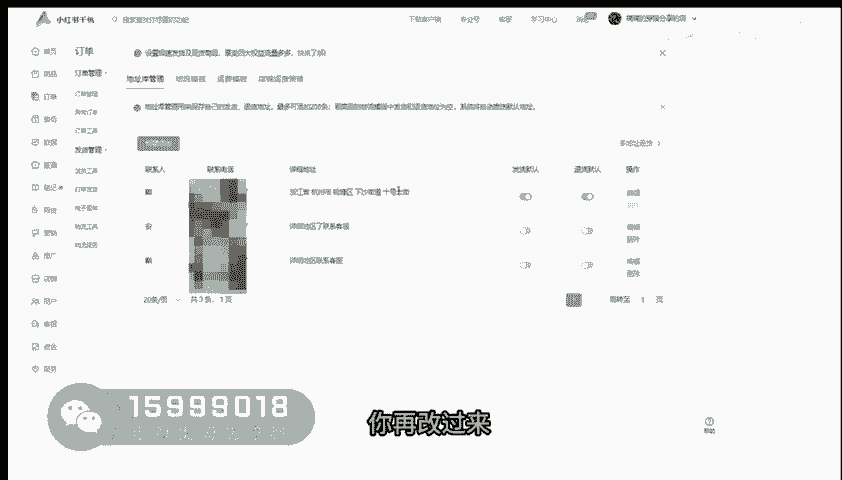

再改成厂家地址，还有一个板块呢就是我们的物理模板，那物流博物馆这个地方呢，我们这个地方啊，一般物流模板名称呢我们可以随便写，写个1234567，这个东西是只有你自己能看到的，别人是看不了的啊。

那发货地址的话，你就把你刚刚的你填小那个地址呢，你给他去填进去，然后点提交就好了，还有一个就是咱们的一个运费模板，的一个设置啊，这里一般我们默认都是选择一个呃系统的一个，非偏远地区报模板。

也就是像这里啊，像一般来说像新疆西藏宁夏青海海南，内蒙甘肃这几个地方，一般我们都是不配送的啊，那如果说你想配送这几个地方啊，你想单独给他们去算运费的话，很简单，就是你们这个地方呢去选择新建运费模板啊。

模板名称随便写，写个1234567，这个无所谓的，因为只有你自己能看到啊，那孕妇类型的选择买家承担运费，然后计费方式的话按键去计费啊，然后运费计算的话，默认运费的话我们是一件啊，一般来说是十块钱。

然后每增加一件的话，我们再增加五块钱，好这个地方你们可以去啊，给它添加上去，然后这个地方呢你们可以点击编辑，然后呢点击确定，然后呢你到时候如果说你们在上架的时候呢，你就可以把那个运费的一个模板的选择。

这个选择你自己设置的这个就可以了。

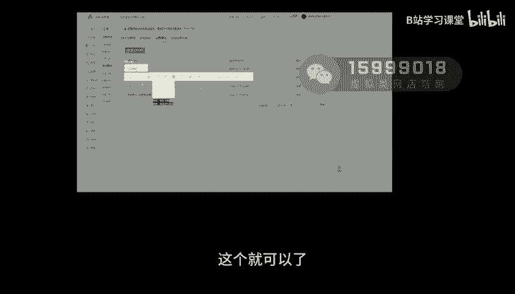

还有一个设置呢是咱们的一个资金设置啊，我们直接干嘛选择资金，然后这个地方呢啊有一个货款的一个资金，那一般来说啊就是你们刚开店的时候呢，像这个银行卡，你们要去给他去设置好，一般来说你拿谁的身份证开店。

那提现的时候是提到谁的银行卡里面啊。

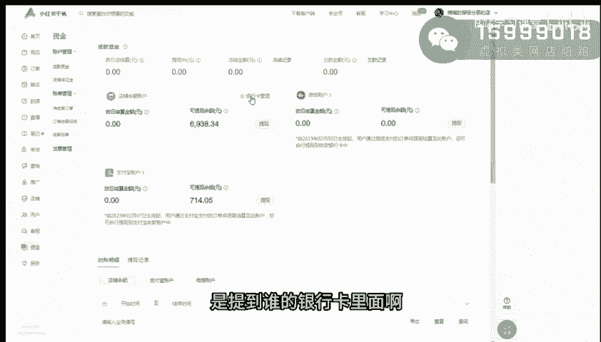

那这个微信账户的话，就是需要你们用实名那个人的微信号。

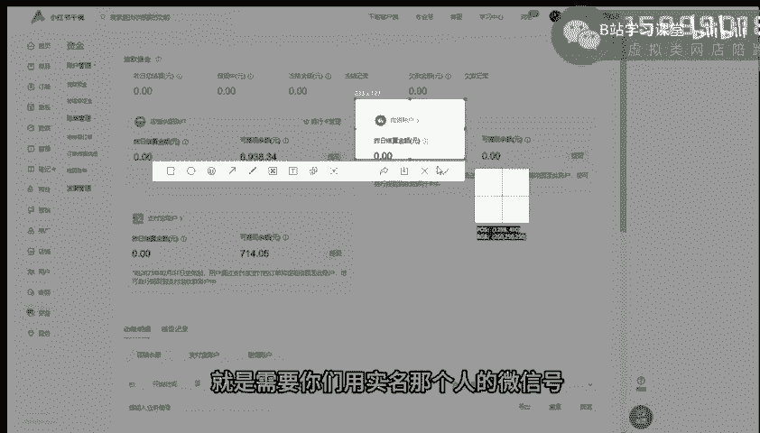

去扫码去认证，包括支付宝一样的，那这里的地方有个点啊。

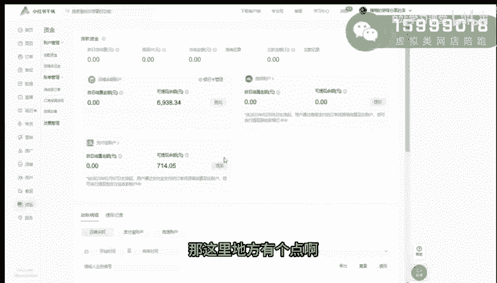

就切记了，如果说你没有交保证金的话，这个微信账户是开通不了的，也就是别人如果说想要微信去购买你家东西，他是买不了的啊。

啊这个大家切记了啊，一般来说我都会把这个钱给交进去的，反正都得交啊，然后还有就是支付宝的话提现跟微信，微信账户提醒啊，这地方有一点，就是你们如果说把微信跟支付宝的时候，提现的时候呢，他会扣你们0。

7%的扣点，那运费险怎么去开通呢，很简单，你们打开售后售后，然后这里的话有个运费保。

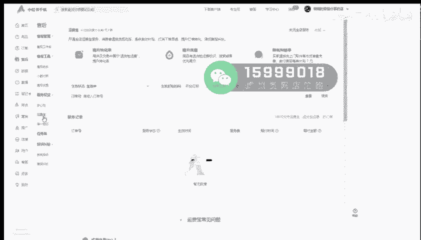

一般来说啊，就是你们如果说是开通成功之后呢，你们每卖出去一单，那平台会自动的扣你四毛六的一个运费的。

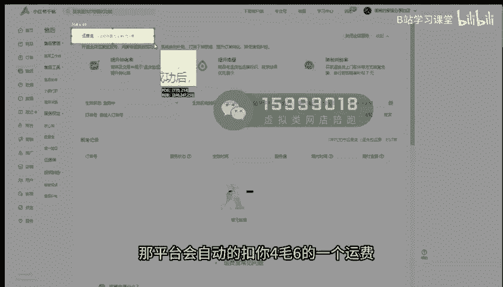

一个费用啊，所以说你们呃如果说你们做的产品是利润高的，本身利润高，然后呢额那你们可以去选择把它给开通，因为它是可以影响到你们店铺转化率的啊，那如果说你们利润低啊，本人就卖个九块九啊，这玩意啊。

这种百货这种产品的话就没必要去开通了。

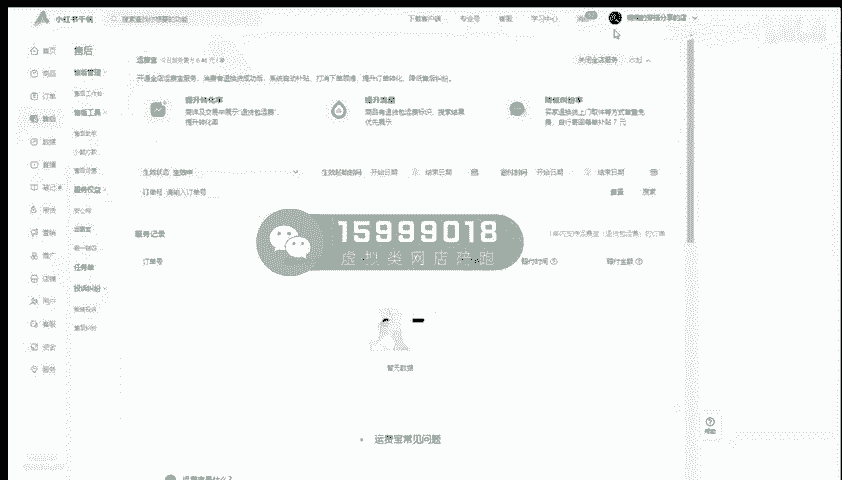

那如果说你想关闭这个运费宝的话，这个地方先关闭。

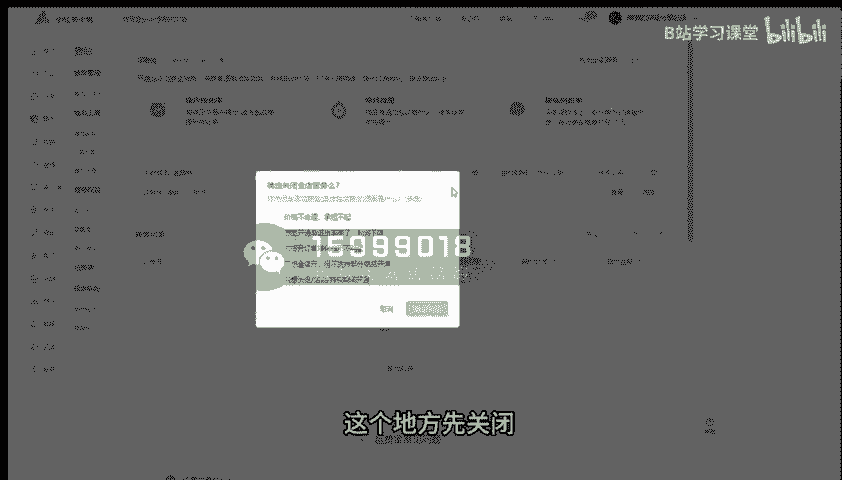

然后这个地方给他去确认，这个地方确认关闭就好了，就可以了，就关闭了，那怎么去设置多地址退换货呢，在这个地方呢你可以选择订单，然后这个地方呢有个物流工具，这里呢有一个多退多地址退换货，你们点进去。

这里呢可以创建策略，那策略名称呢，你就可以把你的产品词给大家写进去，比如说我这个产品呢是做的是呃冬季棉服，棉服棉服啊，就可以写的，越想去也好，把你的产品名给详细写详细，然后退货地址的。

比如说你这家啊是同这家店，这同一批这个产品是一个地址哈，那你要把那个退货地址，就是厂家给你发退货地址呢，你先给大家去填，点到你的地址库里面啊。

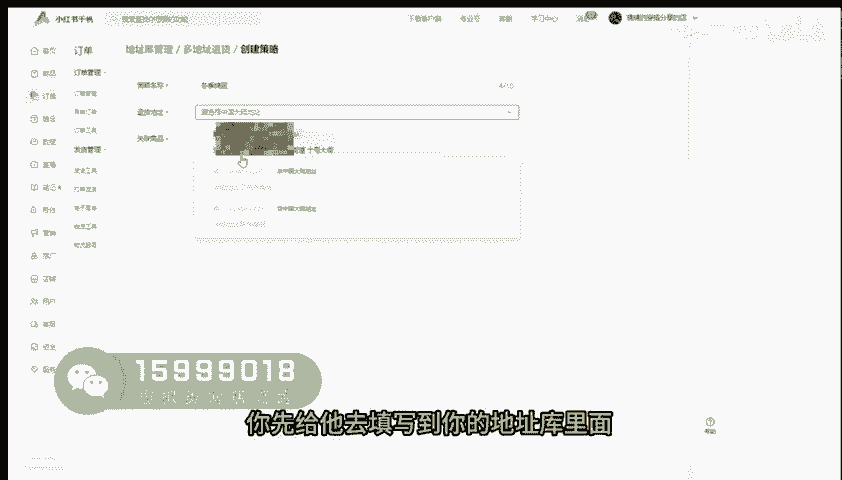

地址库，然后给大家去添加进去，然后填好之后呢，再关联商品，你再去把你们就是退货的这个商品的SKU，就是所有的所有的产品。

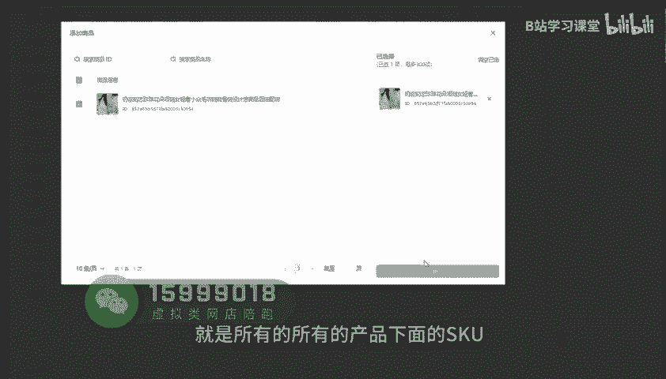

下面的SKU全部的添加好，然后点创建啊，到时候如果说是用户他申请退换货了，他选择一个七天无理退换货，那这边系统自动统一之后呢，那厂家的地址呢就会直接推送给到买家，他就能直接的退回给买家了啊。

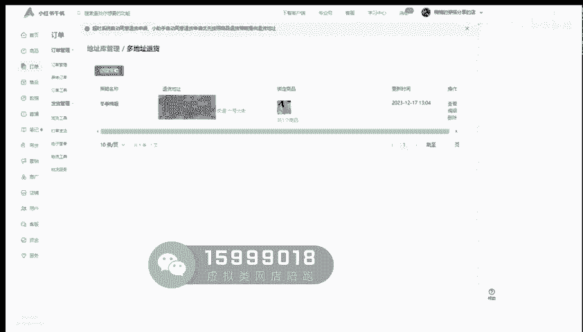