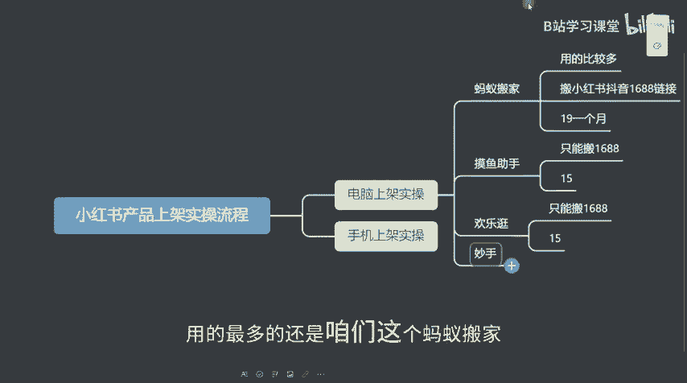
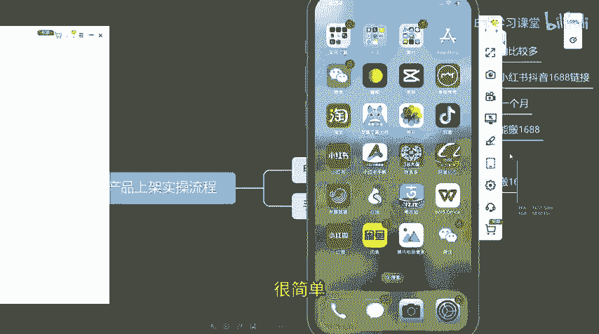
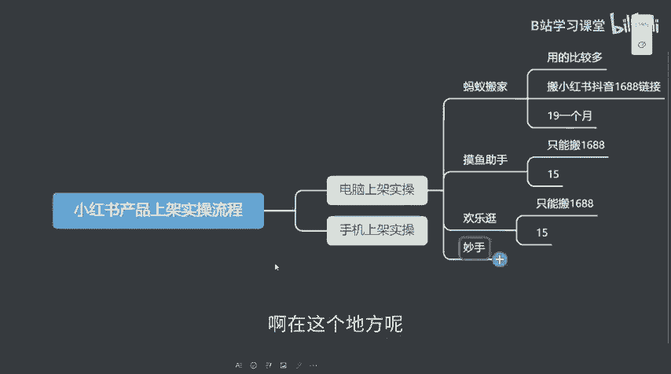
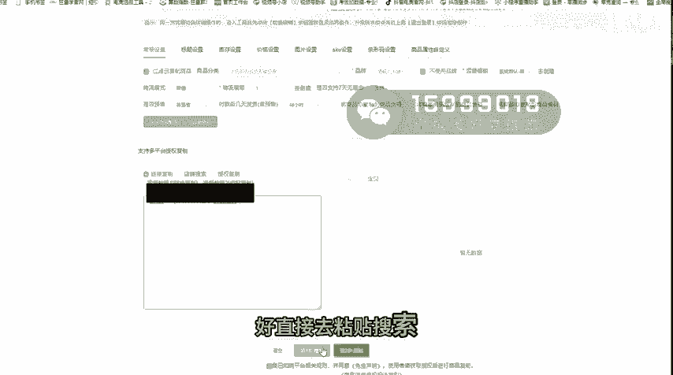
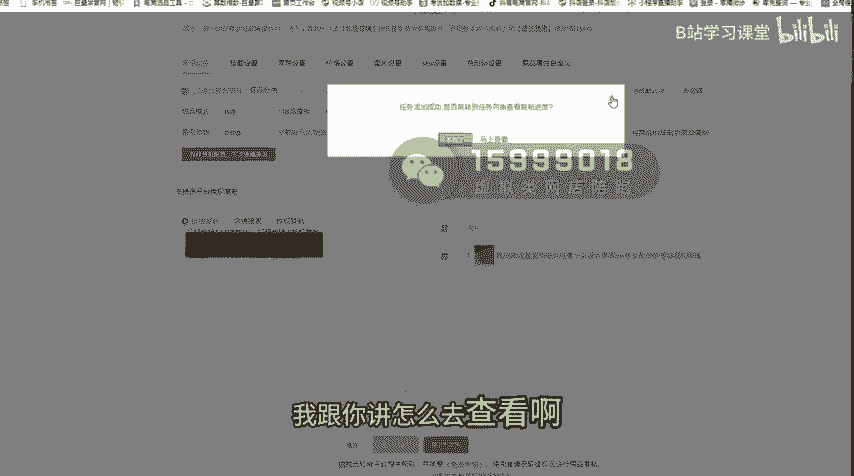
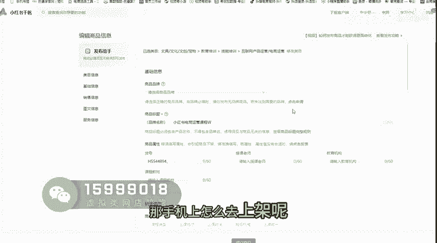

# 已完结 【小红薯运营实操课 】 手把手教你起号变现 共45节 - P5：05_第4课：小红书商品电脑上架实操- - B站学习课堂 - BV1bQveefE17

大家好，这一节课呢主要跟大家分享一下，小红书产品怎么去上架的一个实操流程嗯，那这里如果说我们想做小红书带货的话，呃产品上架呢主要分为两种，一种是电脑上架实操，一个是手机上架实操。

那电脑的话其实会比较方便一点啊，就比较快一点，因为他可以批量上架，比如说十个产品，20产品直接复制到你店铺里面去卖啊，那上架产品的话主要用到这么几个工具啊，首先首先用的比较多的啊，还是蚂蚁搬家呃。

蚂蚁搬家的话啊，他可以搬运，像小红书抖音链接跟1688链接，都是可以直接去搬运的啊，是用的比较多，那蚂蚁搬家的话主要是19块钱一个月啊，一个也也是一个工具啊，那沐浴助手呢它只能搬运1688的。

而且是15块钱一个月，还欢乐逛啊，也是15块一个月，妙水也是的，但是用的最多的还是那个啊，用的最多的还是咱们这个蚂蚁搬家。

会用的比较多一点啊，蚂蚁搬家啊，那怎么去找到这个工具呢，很简单。

我跟你讲怎么去找这个工具啊，啊在这个地方呢。

你们打开小红书的一个后台，打开小红书后台，然后打开这个呃小红书后台之后呢，我跟你讲怎么去找啊，这地方我们点击小红书后台，打开小红书之后呢，这里呢有个服务啊，你点击服务，然后这里呢有个前往服务市场啊。

前后复制啊，你点进去之后呢，这个地方我给你们看一下啊，这个地方啊这有个搜索啊，大家没有看到这个小红书上，这有个搜索，我们点击搜索栏，比如说我们搜蚂蚁搬家好，去搜索，那搜索出来之后呢，咱们点进去点进去。

然后这个地方切换获取，想获取好，获取完之后呢，他要设置登录好，你就登录上去就可以了，那登录之后呢，下次怎么找到他呢，很简单还是一样的啊，打开小红书，然后这里有个服务啊，这里呢有一个我的服务。

就只要你授权好之后呢，你下次可以在这个地方呢直接点击去使用，连续使用，那怎么使用它很简单，就是呃这里呢我们要去做好几个设置，第一个是常规设置，常规设置的话，我们一般都是把这个给打开的，打开过滤商品啊。

点开它品牌之后呢，一般都是选的，我不使用品牌，因为MAD本身就白牌嘛啊，就不用把这个勾起来，然后运费模板呢我们一般都是默认是非片，必须报模板，然后物流模板这个地方啊，打新的部分是一张停的啊。

物流模板的话，你们啊就自己去上节课是有讲的，就是怎么去填物流模板，那如果说你自己还没创建好，你点这个创建的时候，你需要重新退出登录，再重新进入才能再给把这个呢给它添加上去啊。

那这个的话一般来说我们都是选择支持的啊，100你具体的话你还可以看一下你这个类目啊，那好还有像这个库存设置的话，咱们就选择1万个1万个，然后价格设置的话，一般我们都是呃是不管是售卖价。

售卖价格我们都是乘以两倍，然后加五啊，乘以两倍就是200%嘛，200%再加五啊，然后市场价格也是一样的，直接是乘一个200再加五啊，那如果说是其他app也是一样的啊，其他的软件也是一样的。

但是像其他BB他没有百分百，那你就干嘛填个二就可以了啊，填个两倍加五就可以了啊，那这也可以不用填这地方不要去铁牙田的话，到时候就会出现一个小岔子啊，然后还有就是嗯嗯还有就是一个点。

就是为什么要设这么贵啊，因为设这么贵的一个点，就是我们后续要可能要去设置一些店铺的，满减券或者折扣券，或者说是我们店铺的时候，如果说哪些品要参加活动的时候，那我们要保证自己是有一定的利润空间。

至少是不能低于二三十%以上的对吧，不能低于30%啊，然后还有就是图片设置的话啊，然后到时候会教怎么去弄的唉SKU设置条形码，你们到时候可以看一下啊，那如果说呃你有什么特殊要求，觉得可以干嘛。

也可以自己的给他去添加上去啊，那基本上设置好之后呢，怎么去复制链接呢，怎么复制链接很简单，那怎么去复制1688链接呢，很简单，就是嗯我给你们演示一下吧，怎么去演，怎么去复制啊。

就是指比如说你们打开1688，然后你把这个链接呢点击这个啊，就这个路口这个地方这地方点这个地方啊，这地方，然后这地方呢有个复制链接好，你复制啊，然后复制好链接之后呢，呃我先隔空传过去啊，传上去哦。

然后传上去之后呢，嗯就这个地方我们去复制这个链接，只要只要这个链接就可以了啊，只要这个链接给它复制下来，好截取粘贴搜索哦。

然后搜索出来之后呢，我们点第二步点复制啊，然后呢这个呢复制之后呢，我们这个地方可以查看，我给你讲怎么去查看啊。

就是这里有个任务列表啊，你就能看到他有没有上传成功，他现在已经是在处理状态，如果说是呃处理成功之后呢，这是一个绿色的标啊，就处理成功了，那上架成功之后呢，我们还要再去打点击我们商品啊，这个商品列表。

然后你要你要去检查一下啊，怎么检查很简单，因为我家电视主要是呃做培训哪家店啊，然后这个地方的话你可以点击编辑点编辑，然后这边点进去之后呢，呃像这里面啊，这个地方我们主要是看这么几个点。

第一个就是我们这个商品的图片里面，就是你上的时候，那个商品图片里面他有没有第三方平台的水印，或者说是有logo啊，如果有的话，你要把这个图片给删掉，或者说是有其他的一些详细的一些，文字的一些介绍啊。

有是到第三平台的，要要去检查啊，简单删除啊，所谓描述也是一样的啊，然后一般来说如果说你是上架式产品的话，这地方要选择物流配送啊，因为我们是知识付费的，所以是无物流发送啊，那这里的话就是选择默认一啊。

内贸就可以了啊，是否预售呢，我们选择非预售非预售，然后发货时间呢，一般我们都是默认是48小时发货啊，48小时发货，那运费模板呢，你就把刚刚那个啊，运费额外给你填进去就可以了啊，然后没有什么问题之后呢。

好你再去点击提交商品就可以了。

