# 已完结 【小红薯运营实操课 】 手把手教你起号变现 共45节 - P8：08_第7课：小红书发货操作流程- - B站学习课堂 - BV1bQveefE17

好吧，而且淘宝上现在很多商家仍然是走的这个模式，那首先我们就要解决四个问题啊，我们去哪里找工厂，去找供应链呢，啊去哪里找工厂供应链呢，首先首选1688对吧，我这边呢也以1688来去给大家举例子哈。

好我这边打开我的手机给大家看一下哈。

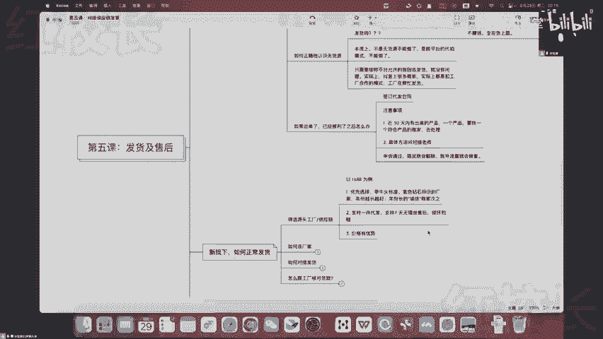

打开1688，比如说你想卖一个卖一个耳钉，对不对，好，你比如说你直接去搜一个耳钉好了对吧，在搜索结果里面，你注意看筛选1688的商家好，给大家讲几个点，首先第一个点，优先去找这种。

紫色钻石跟牛头的标志的一个商家，因为这种的话呢他是源头工厂啊，被1688认证的一个源头工厂好，所以优先找这种，其次呢找哪种呢，其次找那种就是带一个橙字的啊，这里会带一个诚信的橙字这种啊。

其次就找这种带橙子的，但是找带橙子的呢，呃二道贩子可能会多一点，所以你优先去找那种就是年份长的对吧，有些年份67年七八年的啊，然后实在是没有这种橙子的啊，那年份短的也考虑一下对吧。

有的选的时候呢就优先选这种啊，没得选的，那就只能选这种对吧，选这种的话也找这种啊，年份长一点的好，这是第一个点，第二个点呢找168的商家之后，我们直接去看他的代发，看他的代发里面看几个点啊。

如果说是正儿八经都能做代发的，那么基本上它这里边都会满足你的条件，包括像七天无理由退啊，极速退款呀，七天包换呀对吧，少货币赔，破损包赔呀，这个都是支持代发的一些工厂的常规操作啊，并且他要48小时发货啊。

这个跟多多是一样的，懂吧啊。

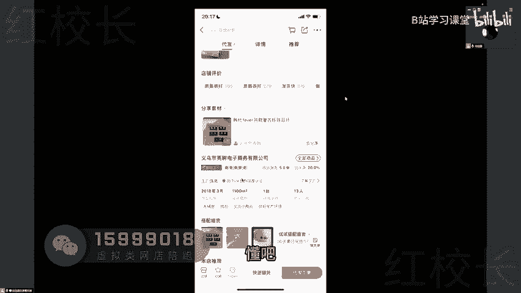

跟多多其实是一样的，来嗯，然后第三个才是去看它价格有没有优势啊，因为你要先确保它能够帮你处理掉，你的售后问题，你才来去找这种价格优势对吧，不然的话你上来就看价格诶，有的他可能72小时发货，是不是啊。

所以这个是筛选源头工厂，供应链的一个粗略的一个办法，然后具体有些类目呢，它不一定1688最适合啊。

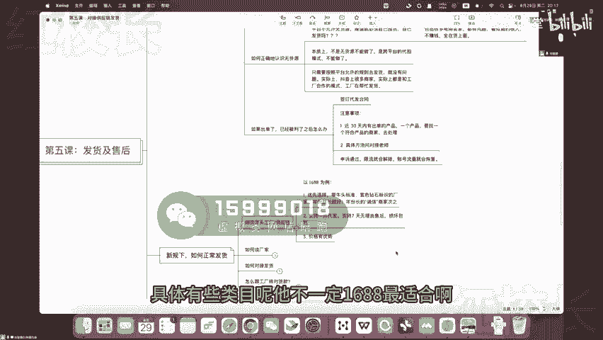

比如说像你卖家纺的话，你就可以去九一家纺网家纺你们要搞清楚哈，你们找货源，找这种货源的话，你们要有一个意识，就是全国的话很多地区它是有产业带的，不同的产业带在不同的地区。

比如说做家访呢最大的一个地区就是在南通，南通有一个全国最大的一个家纺城对吧，在这个九一家纺网里面，你可以找到南通很多的工厂，然后呢这个如果说是做箱包的，那么源头工厂一般集中在两个地方。

一个是河北的保定白沟啊，那个整个的县里面，村里面全部都是做箱包的，各种箱包，拉杆箱，皮包，单肩包，帆布包对吧，河北的保定，然后呢还有就是广州的花都啊，这些都是做箱包的啊，广州华都做那种皮包比较多一点啊。

包括甚至像一些呃国内大牌的一些代工厂，都是在广州那边的工厂啊，然后像鞋子的话呢，就是开山网，女装就有这个pp网，杭州女装网啊，搜款网这些都有，还有就是义乌的一些小商品对吧，比如说饰品啊等等等等。

咳咳然后一些小百货这个都可以去义乌购啊，这都是一些就是根据这个类目，垂类的一些货源网站啊。

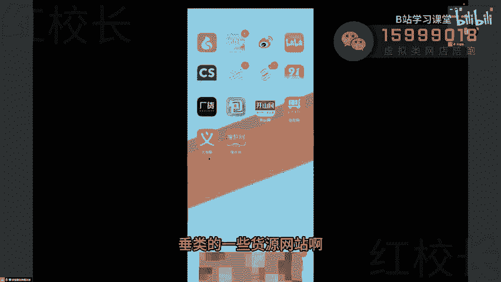

一些常见的，那么这个是找找会员的一些平台，跟筛选的一些方法，那具体比如说要去谈一个厂家的话，应该怎么样子去谈呢，谈厂家这个环节哈，我建议大家可以直接打电话去沟通，啊怎么沟通呢，我我看一看啊，打个电话。

因为效率高一点啊，比如说我们去搜一下视频哈，诶怎么我账号总让我这样子啊，就是这个上面对吧。

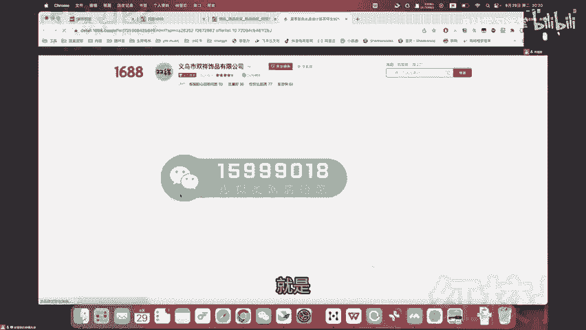

这个牛头工厂的这个商家，然后呢他的页面设是有联留联系方式的啊，大家可以直接的去打他的电话对吧。

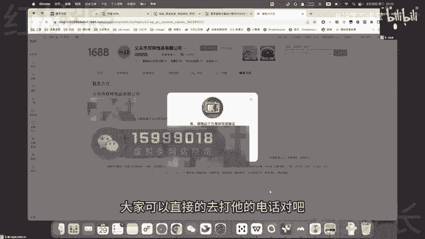

直接打他的电话沟通哈，打电话是比较高效率的一种方式，而且我跟你讲这些厂家的话，他是比较习惯于就是说你去跟他电话沟通的哈，那么打电话的话呢，你可以怎么去跟他沟通呢，我这里面给大家一个就是对话的一个框架啊。

嗯第一个啊就是你们先去问，打电话上去问啊，你先自我介绍吧，你就说诶我是在小红书上的一个博主对吧，你就不要说你是商家了，你说我是小红书上的一个博主，然后呢我是专门卖饰品的啊。

你们这边的耳钉就是店铺里面的耳，然后我是在168上看到你的对吧，你们店铺里面的耳钉能不能去支持的，所有的款式都支持代发吗，对吧好，你先问这样的一个问题，第二个呢你就问一天，我这边如果一两一两百单的话。

能不能正常去发好，基本上都是能正常发的，这个是你是一个试探，懂吗啊，然后第三个你们发什么快递，邮费多少钱，对吧啊，我这边要不我现场给你们实操演示一下吧，哈我随便这边找一个那个商家哈。

我就边随便打个电话给你们演示一下啊，喂老板诶，诶你好呃，是这样，我们是杭州这边做那个小红书带货的，然后我是在1688上看到你的电话啊，我想问一下，就是呃，你们那个店铺里面的那些款式的耳钉，都支持代发吗。

全部都支持，官方都有，我们拍的基本上都有现货，都有现货是吧，打破了一款，我们没有的话，是会经常开办结业证明方向过，生产得快几天就能生产出来的话，可能有的时候会来不及，因为有的时候爆单的话，一两百单。

我们一一两百单，基本上我们都有在最基础的过程，几百单是完全没问题的，中间而且肯定是慢慢增长，嗯看下别的办，报了好几天不到，我发这里，我每一天每一天每一天都有吧，这样哦哦哦行好。

那就是基本上就是每个款式都有一些就几百单，现货都是可以的呗，对基本上都有的，如果你不放心的话，可以在YY上面的客服，然后问一下这个款的库存有多少的，问你哪个款要退货的，说有趋势有趋势要爆的那种感觉。

你赶紧去问一下呃，问下客服，问一下，留点不传或者怎么样，这边也可以放心一点嘛，好好好嗯，那你们那边的话是主要发哪家的快递啊，我们默认都是圆通的圆通是吧，你们对接的这边的圆通邮费多少钱，我们圆通嗯。

你们代发的话应该都是三块五，全国都是三块五，除了新疆西藏啊，行行行行，那我大概了解了故障码，就是带卡片，然后独立包装，然后有那个呃就是外面就是一个盒子嘛，这盒子嗯嗯行行行，那我知道了，好的好的嗯嗯好。

那你有什么事情不清楚的，可以在我公司里留言，这会可能是快下班了啊，那个回复不及时的话，明天也会回复你的，OKOK好好好好懂了哎，好拜拜好好拜拜，额这个是我没有经过任何事先准备的哈。

我是现场给你们找了一个商家，然后打电话啊，给你们演示一下这个流程对吧，那我先给你们拆解一下，我是怎么去谈的这个商家哈，首先你看很多人他会有一个毛病，什么毛病呢，这很多新人小白对吧。

他会很关心就是这个东西的价格啊，就是比如说我找你代发这页面上显示六块五，我一个电话过去，哎，老板那个什么什么耳钉对吧，能不能价格还便宜点啊，我告诉你，基本上像这种，如果说你打通了电话，一上来就问价格的。

那对方就一定会觉得你是小白，为什么，因为只有小白才会最在在意价格啊，供应链大家要知道，有一个潜规则叫做有量才有价，你如果说你上来就谈价格，人家觉得你是小白，那后面就根本就没得谈了，人家就不愿意搭理你了。

人家说你直接找客服就行了，一句话就给你盖过去了对吧，后面就聊不起来了，懂吗啊，这是第一，第二的话，通过我们这种来回的沟通，你听他刚才的那个语气，你是不是能听出来，人家肯定不是一个二道贩子，对不对。

人家或者说是在义乌本地，至少也是一个有实力的一个商家，因为他说他每个款对吧，都至少是铺了几百个，囤了几百个库存，对不对啊，明白吗，所以你看啊你们所以我是这样子去谈的，我说你们产品能不能搞代发。

他们说所有的款式都支持对吧好那就没问题，第二个如果有一两百单能不能正常发，这是我判断他的实力懂吗，因为很多如果说是真正二道贩子的，他自己手里面是不会囤货的，他是你帮他带他找你，你去找他帮他呃。

你去找他帮你代发的时候，他是现拿着你的单子，去找一些那种像他们这样的商家，再来去拿货，再来去发的，懂不这个道理你能听懂吗，好所以他这个问题回答的很坚定，他说你们几百单是没有问题的啊。

如果说你实在是上到几千单了，你要提前去跟客服去确认，对不对，工厂的话生产需要几天时间，基本上都能生产出来，对不对，所以你这话一听诶，你心里面就踏实了对吧，至少踏实是一个有实力的。

你选择到了一个靠谱的商家懂吗，那你们发哪个快递邮费多少，这个只是一个简单的一个试探而已，懂吧，有些有实力的啊，再有实力一点的，基本上邮费能够做到三块钱以内，明白不啊。

所以你看简简单单几个问题其实就能够啊，我去大概的判断出来，哎我们这个商家还是比较有实力的，对不对啊，1688上大部分代发不包邮宝子，你一看你就是没做过生意的啊，你一看你就是没做过生意的，我请问你。

你以为拼多多给你包邮了啊，是真的，他给你掏钱了，对吧，你以为拼多多的商家给你包邮了，这个邮费我请问你是谁在掏，难道不是本身就算在这个价钱里面了吗，对不对啊，我想不明白这回事呢，对了，做电商哪有那种。

就是哪有这种啊，你们在淘宝上也好，在任何平台上看到的包邮的商家，是，因为他人家早就把这个邮费，算到那个最终下单的价格里面了，懂不啊，只是1688，它是因为批发起家的，所以他会把这个邮费单独去算好吧。

OK然后的话呢，你们这个商谈是一开始就要去谈好，一开始就要去谈，这样的话呢，你这样子你后面你出了单，你就知道去找谁帮你发了，知道了吧啊，不要去等出了十单之后再去发啊，别到时候出了十单诶，你没整你。

你现去找对吧，那你有的时候你就会很着急对吧，可能找到一个不靠谱的，那你想想算了，忍了吧，着急发货呢，是不是你就出单之前你才有时间啊，或者就是你如果实在不行，比如说你前期你上架了50个产品。

你每一个都谈下来弹来不及，对不对，好你也可以等到就出单了之后再来去现找好吧，我们之前，总之我们之前呢我们是打的是单品的模式，我们去1688上找商家，都是打的是单品模式，就是我们很确定一个产品。

不管怎么样，我们就去打这个产品，天天围绕他去找达人帮我们带也好，还是去拍视频也好对吧，我们就做这一个产品，所以我们是就是在那个出单之前就去找好对吧，因为当时我们量也比较大嘛啊然后呢。

如果说你们上架的产品比较多，50~100个嘛，你就先上架好，上架好了再去谈好吧啊，出了一单就就可以去谈了，懂不，好这个误区刚才你们已经给你们讲过了哈，这个这个东西你们应该这么实战的话。

你们应该在别的地方听不到的吧，啊这个误区刚才我就跟你们讲过了哈，不要让人觉得你是小白，你看包括我在刚才给的，给整个给人打电话，我也是比较有底气的对吧，我还没抽到一两百单，我就问我就反问他。

我说一天如果一两百单是不是能正常发诶，人家一听觉得你一天一两百单还可以对吧，也不是那种纯纯小白啊，还是有点量的，人家才愿意接你的话是吧，哦所以的话谈判它是它是一门艺术啊，好这个是如何谈厂家。

然后呢接下来就是如何对接发货，对接发货的话就有两种方式，一种的话就是额其实严格来说是有三种方式哈，直接下单，第一种的话呢就是你谈好了厂家，你你你出单了之后，你谈好了厂家。

然后呢你把这个下单的信息导给他对吧，比如说你出个十单八单的，你导个表格出来，然后发给对方，然后对方会返回一个，就是带快递单号的表格给你，你再把这个表格好，你再来去额上传到自己的店铺里面对吧。

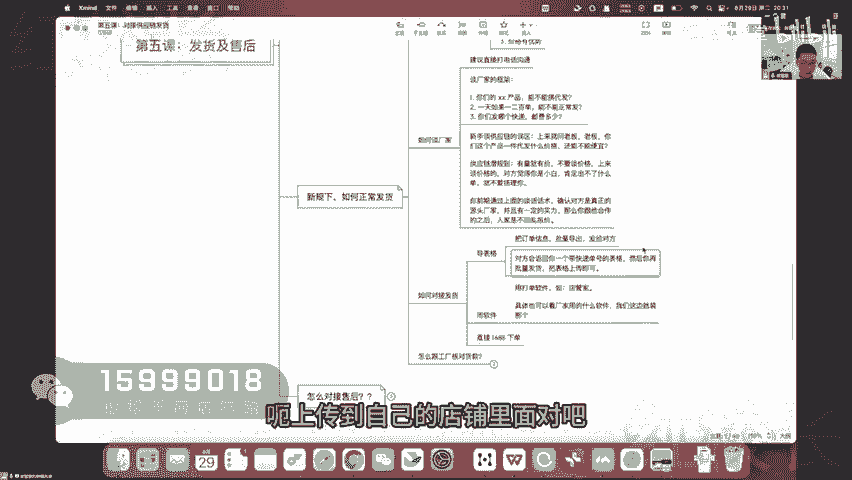

我给你们看一个啊，就我之前找的一些，当然都是我做抖音电商的时候谈的一些厂家哈，来你看一下之前发货的时候呢，就是你把表格发给他，比如说你出了这些单对吧，里面客户收货信息你发给他。

这里客户有也会有客户拍的哪个款啊，拍了多少数量，你发给他，他就会返回给你，然后呢里面就会带有这个快递的单号对吧，运单号圆通也是YT就是圆通，然后呢你再把这个单号上上传到你这店铺里面，对不对，好。

这个是一种方式。

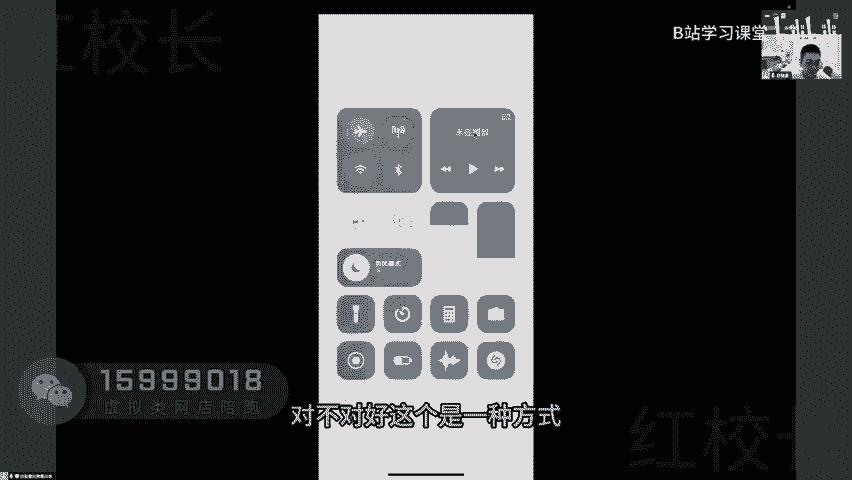

还有一种方式呢就是用那个软件的方式啊，用软件，因为电商里面呢导单，他是都是有一些传统的软件的，我给大家打个比方哈，比如说呃我们店铺后台我切出来一下哈，在服务市场里面对吧，前往服务市场。

其实呢我们之前用的是鲸吞那种叫做拍单软件，对不对，实际上还有很多就是那种，还有那种很多ERP的软件，比如说像聚水潭啊，望电通啊对吧，然后呢UEERP啊，然后包括像那个什么电管家啦，风火地啊啊，都是这种。

就是你可以直接把你的订单，同步到这个厂家那边的后台，然后他直接就打单的机器对吧，给你去打单了啊，然后呢面单往那个快递上一贴啊，这种的话就更高级了啊，基本上就是专业做代发的，他们都是电脑上装很多软件的。

所以我们可以问一下他那边用的是哪个软件，他们那边用的哪个，我们就用那用那个就行了对吧，这样的话双端就能对接起来了啊，具体的操作方法这里就不给大家演示了，这个你们前期能导表格的，就导表格也行啊。

如果后期就是呃拼多呃，小红书像其他平台一样对客户信息进行了加密，然后呢防止你们导出对吧，那导不了了，就到时候就用软件就行了，现在的话抖音电商基本上都是用的软件啊，或者还有什么呢。

如果这个这个如果如果你找了好几家，1688啊，对方都干嘛呢，不给你线下发货好让你去拍，那你就直接去拍吧啊直接去拍吧，什么意思呢，就是我们找到1688厂家，我们我们找到之后呢，我们都是给他打电话。

然后呢加微信的，对不对，加微信呢，你把你的这些东西发给你的厂家是不是好，发给你的厂家之后，让他去给你发货。

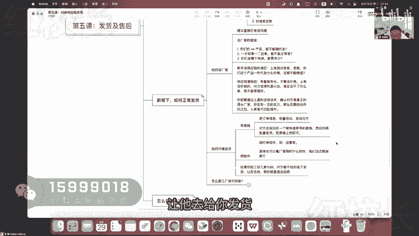

实在不行了，哈哈才是我们去就是在页面上去下单，对不对，好，我给你们看一下，基本上都是这种线下发货，就是你把客户的收货信息发给他对吧，收货信息发给他，然后他去，你看对吧，客户的收货信息发给他。

然后他帮你发货啊，然后有补发的，你也把单独的这种客户信息发给他，懂了吧，然后代发去页面下单是什么意思呢，去页面下单，就是你比如说这个啊，我之前做这个玩具的时候，就是找的168的那边的商家。

直接一个一个下单，一个个下单，对不对啊，实在不行，他不支持，就是说线下给你去打单，你你就一个个下单啊，当然了，这是前期单量小的情况下哈，这是前期单量小的情况下，你这么去做单量大的，他肯定是给你支持的。

懂吧嗯。

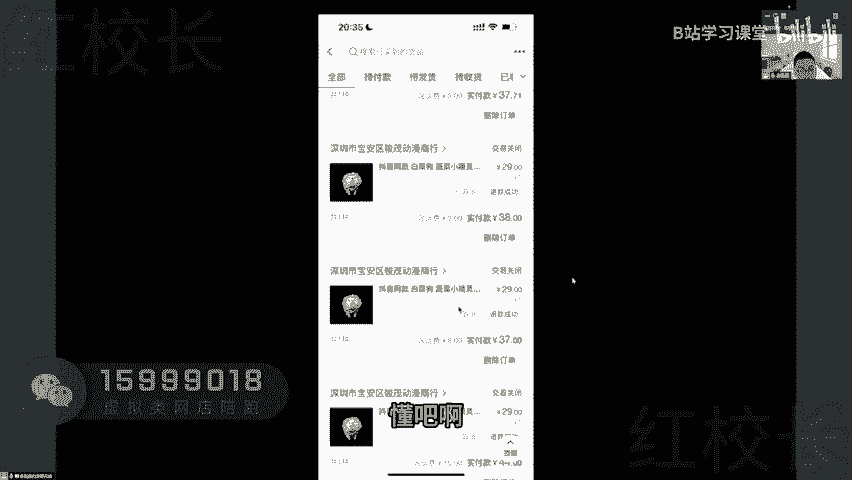

然后呢，这里还涉及到一个怎么跟工厂核对货款啊，就是你们原来去拼多多下单，然后呢是你们要自己去下一单就支付一下了，相当于是要垫付的，对不对好，那现在你去找168，那怎么去给他结算呢，对吧。

你就是人家帮你发了货，你怎么把钱给人家呀，是不是啊，这里面就涉及到两种方式了哈。

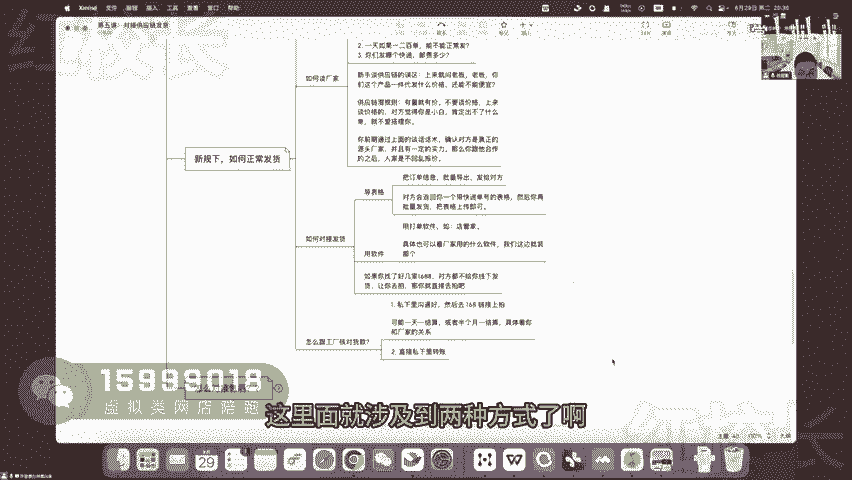

还是一样的，我给大家看一下实例啊，有的呢就是这种啊，他会让你去页面里面，去他的店铺页面里面去下单对吧，比如说他给你算好账了啊，比如这么几天啊，这个过去五天给你发的货，货款是1万1万2000多，然后呢。

他会让你去他的这个页面里面去下单对吧，那我就去他页面里面下单了，是不是，所以你看我这个货款通过这种方式去给他，对不对啊，一次就好几千上万的，是不是，这个就是走平台去结算啊，还有一种呢就是线下结算。

线下结算就是说你发了货，你直接给他转账就行了对吧，你看这个啊，每发一通货啊，货款安排一下，我就给他转一次对吧，然后每发一次货诶，我又给他转一下，是不是，嗯然后这单这单丢了，你看这单的话。

就单独把客户信息发给他，这种就叫做线下发货，懂了吧啊，就你们拿这个客户的收货信息，在微信里面去对接，然后他会返回A1个快递单号啊，在菜鸟发的啥啊，他会告诉你，然后你再把这个快递单号粘贴到那边，对不对。

粘贴到你的这个商家后台。

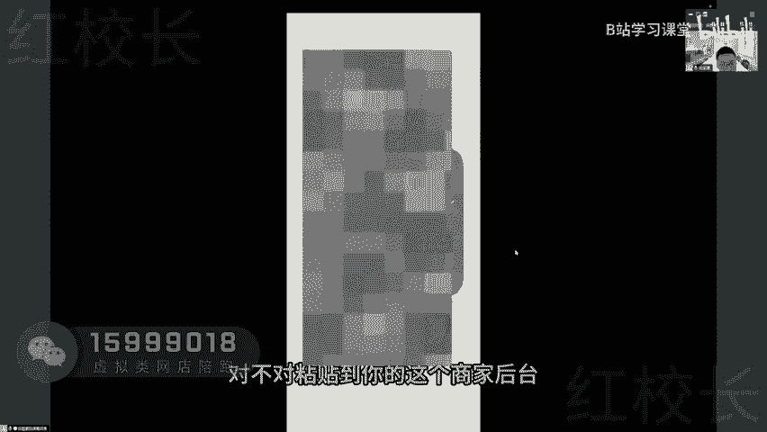

这个就不算无货源了，这个就是帮你合作去代发了，懂了吧啊好。

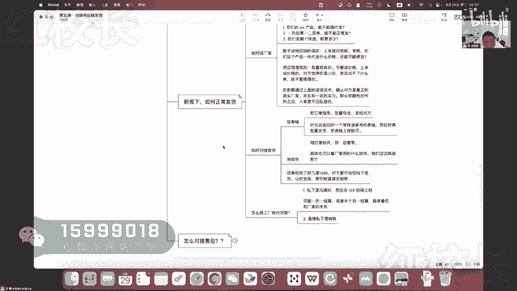