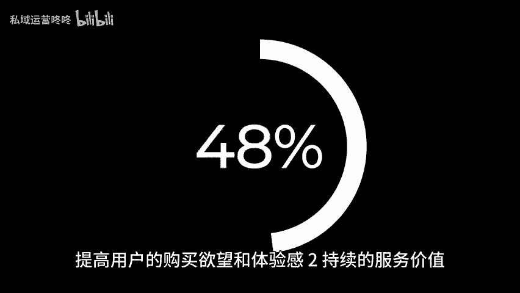
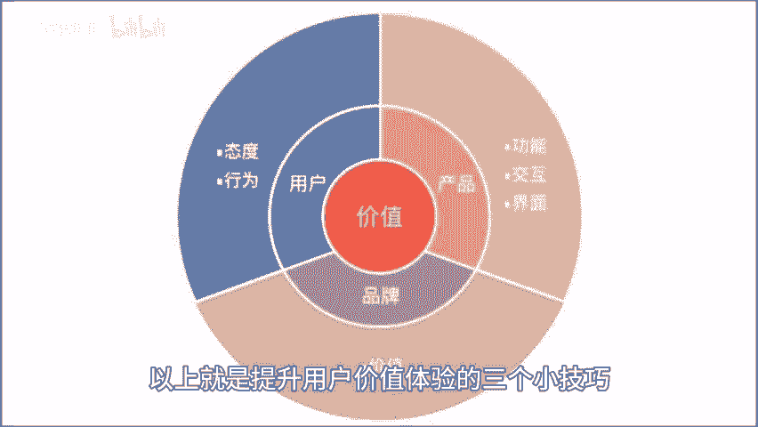

# 干货码住！提升用户价值体验的三个小技巧！ - P1 - 私域运营咚咚 - BV1xM4m1m78W

🎼大家都知道，好的用户体验不仅能够吸引更多的用户，还能够提升用户的满意度和忠诚度。今天就分享三个小技巧，帮助大家提升用户的价值体验，一直观的利益激励，让用户一眼看到产品或服务，对他们的实际利益有何帮助。

无论是在宣传广告中，还是在产品设计中，都需要突出产品的优势和特点，明确告诉用户使用该产品或服务能够获得什么好处。另外，还可以通过精准的推荐系统，根据用户的购买历史和兴趣偏好，向其推送与其相关的商品。

提高用户的购买欲望和体验感二、持续的服务价值，让用户使用产品或服务的整个过程中，都能够感受到我们的关注和贴心的服务。无论是在产品使用过程中遇到问题，还是在需要售后服务时，都能够得到及时专业的支持。

为了提供持续的服务价值。我们可以建立完善的客户服务体系，以及定期收集用户的反馈和建议，并进行改进和优化，让用户感受到我们的真诚观。😊。

🎼怀3、保持与用户互动，保持与用户的互动是建立，良好用户关系的重要环节。通过与用户的互动，可以增加用户的参与感和忠诚度，同时也能够更好的了解用户的需求和偏好，为其提供更符合期待的产品和服务。

我们可以通过回复用户的评论，私信或是定期举办线上线下活动等方式，来保持与用户的互动。以上就是提升用户价值体验的三个小技巧，希望对大家有所帮助。咱们下期再见。😊。

