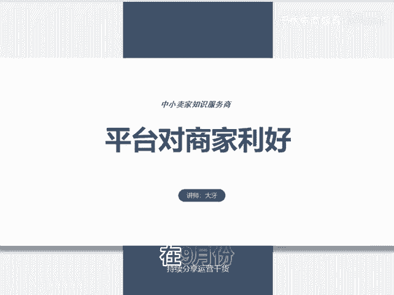
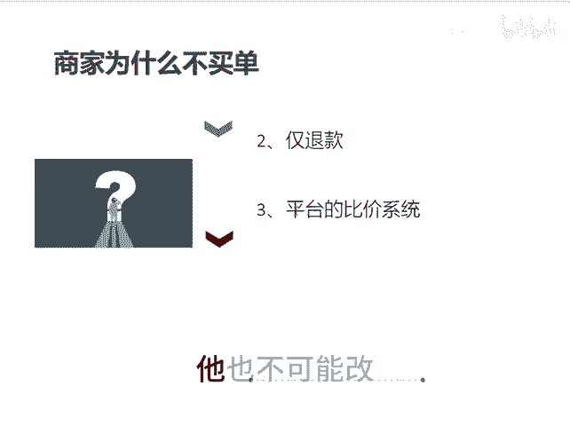

# 平台对商家利好 - P1 - 千优电商教育 - BV1nFx5ehEJV

在9月份，拼多多出席了一系列的对商家所谓利好的政策，像什么保证金减到500块，然后什么售后申诉次数不限制等等啊。其这些呢它没用，为什么呢？你像部分场景退还技术服务费，技术服务费0。6%。

商家呢看中的并不是这些。所以说呢对于这些利好政策呢商家并不买单。其实商家真正需要的是什么开支的大头是什么？像退款率过高，而且呢广告费不退，这是重大的开支，然后还有什么还有仅退款。

其实拼多多它在规则上都在引导用户仅退款啊，你对商品不满意，啪给你过来一个或者是仅退款或者是退货退款。拼多多这套政策它可以激发出人性的恶。再一个呢像拼多多它的立足的根本是平台的比价系统。

我们知道现在的生意它本来很内卷但是呢拼多多呢他又把这比价系统一搞让你搞得更卷，价低者得流量。所以我们说呢拼多多这一次搞的这些东西呢，它看起来没禁，实际上呢也没禁。因为对于一些。😊。

大头真正对商家利好的东西他都没改。当然，像平台的比价系统，他也不可能改，因为这个是他的立足之本。我是讲师大牙，欢迎大家扫码添加我的微信，不方便扫码的朋友可以添加我的微信号，80221430。

在这里给大家准备到了一套新手运营入门的大礼包，希望能够帮助大家。😊。

