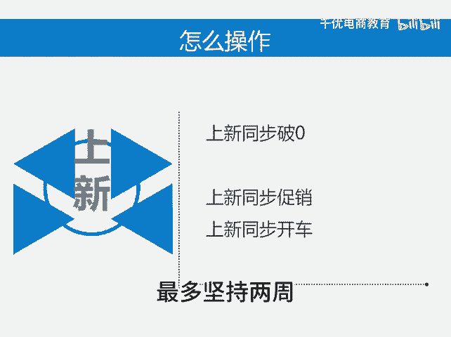

# 店铺数据不好怎么办 - P1 - 千优电商教育 - BV1CE1XY6EZT

很多朋友是新店没流量，老店呢，然后遇到瓶颈。总之呢在店铺发展的过程中很迷茫。在这里告诉大家一个万金油的做法，就是不管什么时候你迷茫啊，不管什么时候店铺遇到瓶颈，有一个非常好的解决这个问题的方式。

那就是上新上新解千愁。因为新品总是容易获取流量。而且新品总是能 get到店铺希望，那怎么操作怎么上的这个新，首先你可以考虑每天上5个链接，上完5个链接同步破零，然后同步促销，就是报上活动啊。

比如说21365或者后台一些呃杂七杂八的大促活动。呃，同时呢你在开车，每个链接限额100块，每个链接保本出价或者是利润出价，当你的店铺出现问题，你只要坚持这个操作不用太长时间，最多坚持两周。

你的店铺肯定能够看到希望。我是讲师大牙，欢迎大家扫码添加我的微信，不方便扫码的朋友可以添加我的微信号，80。😡。

221430在这里给大家准备到了一套新手运营入门的大礼包，希望能够帮助大家。

