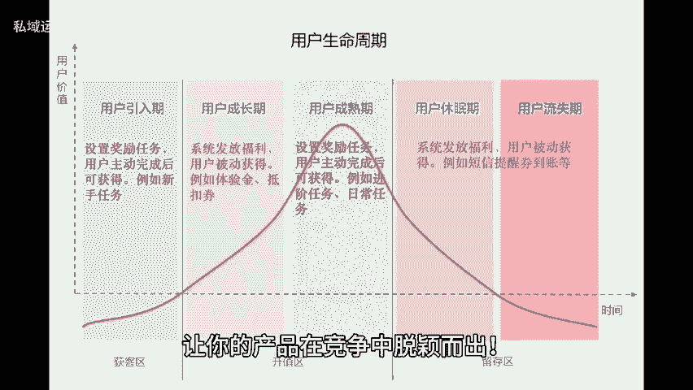
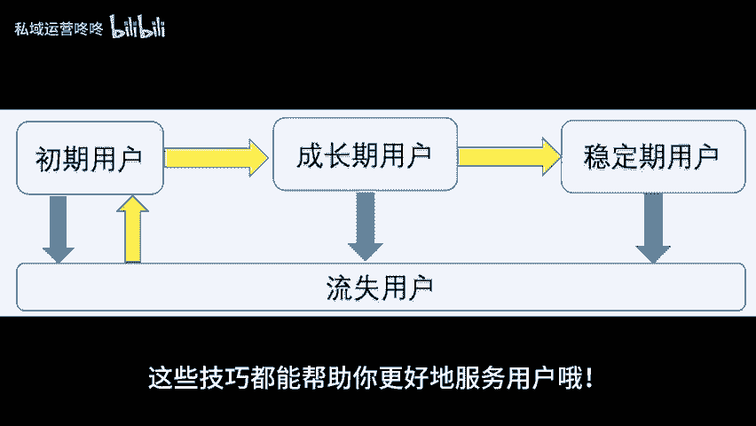
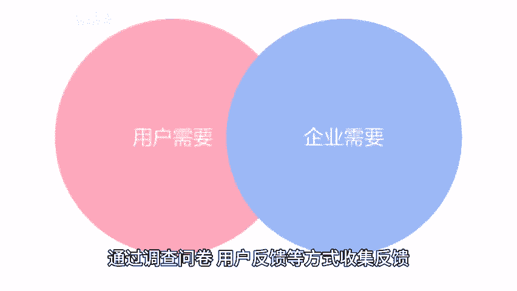
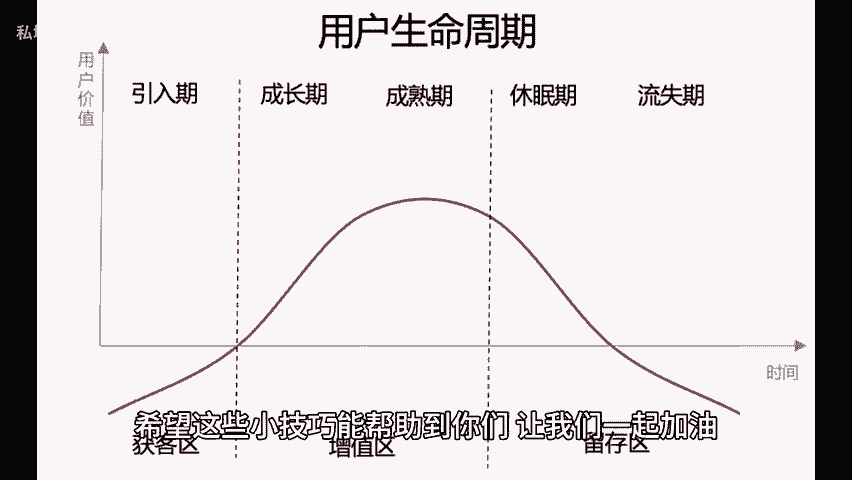

# 延长用户生命周期，运营达人必备技巧分享！ - P1 - 私域运营咚咚 - BV17xY4e2Ew1

🎼嘿小伙伴们，今天来跟大家聊聊如何有效延长用户的生命周期，让你的产品在竞争中脱颖而出。无论你是新手还是资深运营达人，这些技巧都能帮助你更好的服务用户哦。一、产品更加符合用户预期，要让用户爱上你的产品。

第一步就是了解他们的需求。通过调查问卷、用户反馈等方式收集反馈，把用户的想法融入到产品设计中，这样一来推出的每一个产品或服务都能让用户感到，这正是我想要的。2、建立用户激励体系。

建立一个完善的用户激励体系，通过积分优惠券或者专属活动来吸引用户的持续参与，比如推荐好友注册就能获得额外积分，或是首次购买享受折扣，让用户心甘情愿留下来。3、增加用户离开成本。

如果用户觉得转向你的竞争对手，很容易。那么他们就会毫不犹豫的离开。我们可以通过打造独特的社区氛围，提供个性化服务，以及不断更新有价值，有利他性的内容，让用户在这里找到归属感。😊。

🎼增加他们的离开成本，希望这些小技巧能帮助到你们，让我们一起加油，成为运营达人吧。😊。

