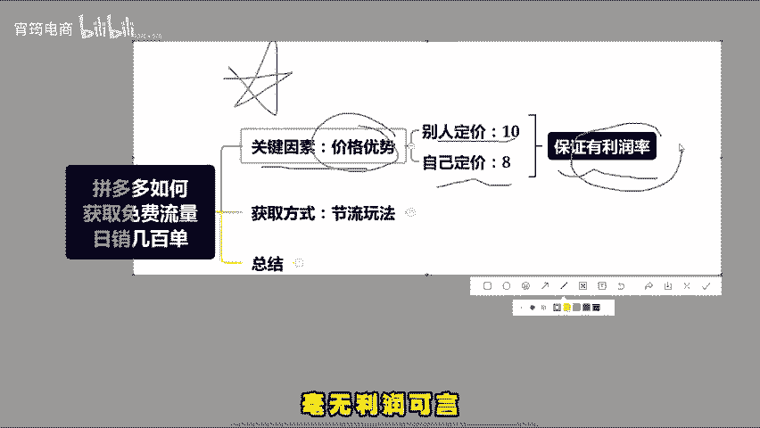
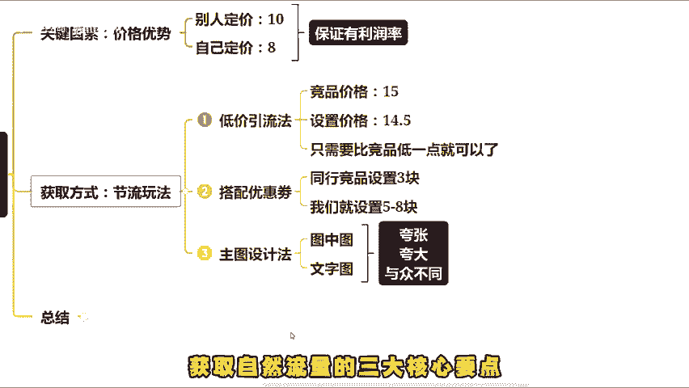
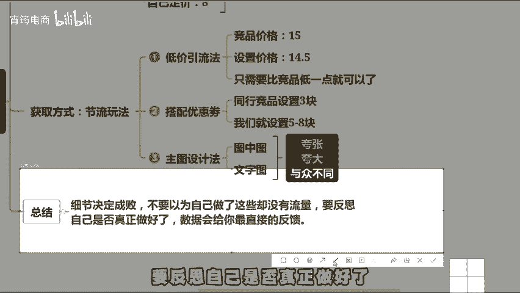
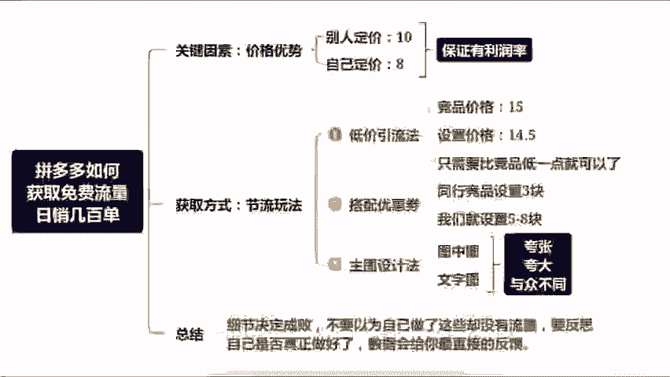

# 开拼多多那么久还不知道怎么获取免费流量，搞懂这些直接日销几百单（拼多多开店｜拼多多运营｜拼多多实操｜拼多多新手） - P1 - 宵筠电商 - BV1FJbFeAEJH

今天我来为大家详细阐述一下今年做拼多多如何获取免费流量的方法，用这个玩法去操作呢？虽不能保证热销千单，但做到热销几百单还是比较轻松的。首先，做免费流量最关键的一点就是必须具备价格优势。如果没有价格优势。

就别指望靠免费流量来发家致富了。比如别人卖某物品价格为10元，你能卖到8元，同时还能保证有利润率。那么这样的产品才适合去做，投入别人卖15元，而你的成本也是15元，毫无利润可言。

那么这种产品就不适合去操作，那我们具备了免费流量的技术条件，及价格有优势后，又该如何获取免费流量呢？通常我们可以通过三种节流方法来截取竞品的流量，第一种，作为常见的就是低价引流法。

如果竞品的低价引流价是15元。那我们就设置为14。5元。第二种就是利用优惠券，如果同行竞品的优惠券是3元，我们就设置为5到8元，可千万不要小看这优惠券的作用。它真的能大大提高我们的转化。

效果第三种就是在主图设计上下功夫，别人的主图都是中规中矩，千篇一律。那我们的拼多多主图可以适当的进行夸大，以上就是获取自然流量的三大核心要点，细节决定成败。不要以为自己做了这些就有流量。

要反思自己是否真正做好了数据会给你最直接的反馈。好了，今天就分享到这。如果看完这个视频，还是不太懂的话，可以找我领取文档，也可以提问。或者说以下我去给你做店铺诊断的，也可以来找我。

最后那就祝各位早日报单。

