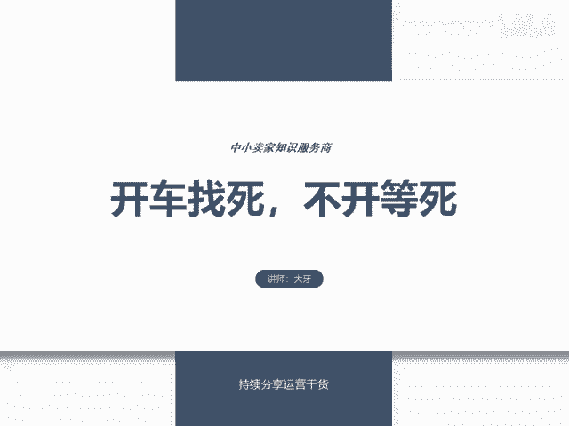
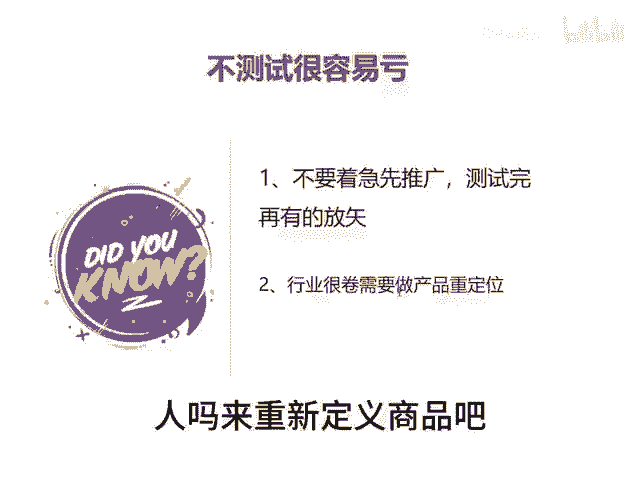

# 开车找死，不开等死 - P1 - 千优电商教育 - BV1AQ2nYQELT

现在的情况是，很多朋友开车是找死不开车等死。他说我开车就亏，不开就没流量，这事儿怎么办啊？首先我们说呢，现在你开店呢基本上都是要购买流量啊，不管是多多还是其他平台。你说我打算做纯自然流。

这玩意儿它有点难度也不太现实，但是开车持续亏，这怎么办啊，给到大家这样的几个建议。第一个就是不建议做很低客单的商品啊，哪怕你是低客单，高利润也很难盈利。比如说你客单就10块钱，你说我50%的利润5块。

但是直通车成交售价最低扣费4块，而且你也优化不到4块，所以说盈利比较难。再一个，如果你没有明显的价格优势，我不建议做利润很低的商品啊，除非你是供应链商家，因为利润低，它本来就不容易盈利嘛。

而且你还要优化直通车。再一个如果你在计划主推哪一个链接之前，我建议呢你一定要测试，不要弄一个链接就过来推，那怎么。😊，测试同样的商品，你要多上几个链接，价格不同。然后呢，SKU不同标题不一样。

轮播图不一样，你测试一下哪一个链接啊，它最容易获得曝光。哪一个链接呢，它的盈利能力最强，就是我们坚持一个原则，没有测试一定不要主推，没有测试，一定不要主推。这样的一个链接就推，它很容易亏啊。

就是你不要着急推广，测试完之后再推。还有一个，如果你的行业的确很卷的话，你需要做产品的重定位。因为你卷来卷去，卷不过别人嘛？来重新定义商品吧。我是讲师大牙，欢迎大家扫码添加我的微信。

不方便扫码的朋友可以添加我的微信号，80221430。在这里给大家准备到了一套新手运营入门的大礼包，希望能够帮助大家。😊。

