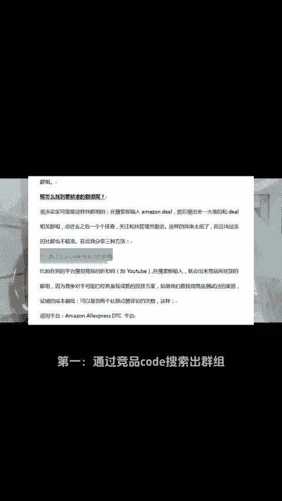
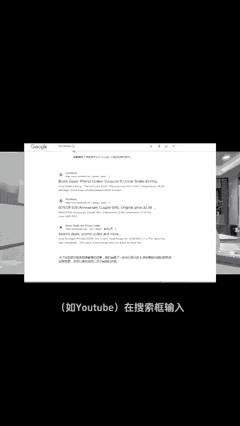
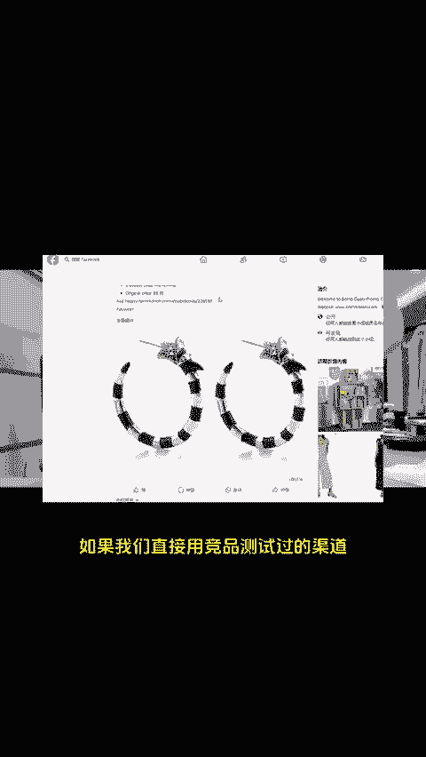
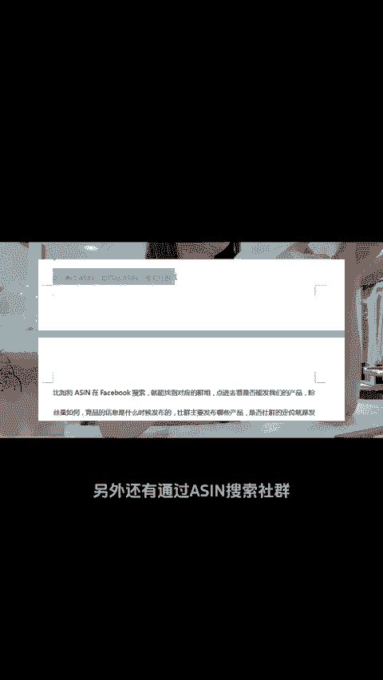
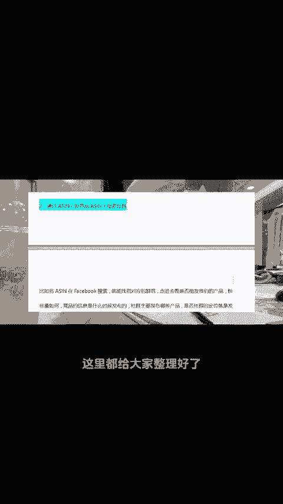
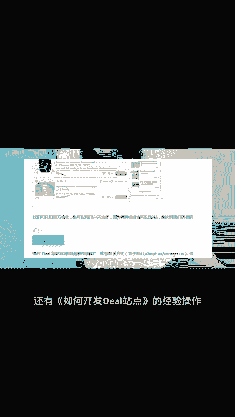

# 弄懂Facebook社群底层逻辑，节省50%推广成本！ - P1 - 小亚跨境研究 - BV1Jn2oYUEEf

想做facebook社群，怎么找到符合我们自己产品的社群群组服务商他们的投放底层逻辑是什么？今天就来跟大家好好聊一聊做亚马逊如何挖掘站外社群资源，分享三种方法。第一，通过竞品code的搜索出群组。

比如在别的平台搜到竞品的折扣码。如右主在搜索框输入，就会出来竞品所投放的群组。因为竞争对手可能已经具备较成熟的投放方案。如果我们直接用竞品测试过的渠道，试做的成本偏低，这是第一种方法。

另外还有通过asin搜索社群和google高级搜索指令，这三种方法，具体怎么操作，有哪些注意事项呢？这里都给大家整理好了完整版需要的后台三个6报走。另外还有如何开发第二站点的经验操作，一起跨进。

一起报付。😊。

