# 引流只是基础，转化才是王牌！ - P1 - 高小飘讲私域ufan68 - BV1tn4y1f7uE

用两个点告诉你啊，如何做情趣私域赛道，私域运营吧，你需要做的无非就是两个点引流和转化。你也可以理解为啊，前端和后端前端吧持续引流后端吧能稳定转化。情趣赛道吧，是真正意义上的不缺流量的一个赛道。

给你们看看我们最近的一个主播领粉丝起号的一个数据啊。

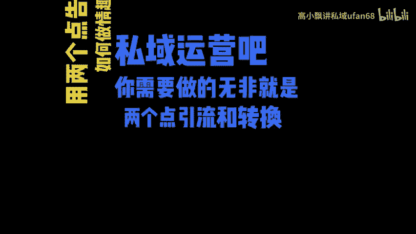

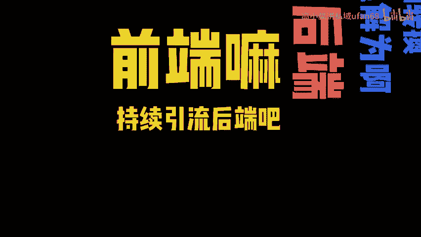

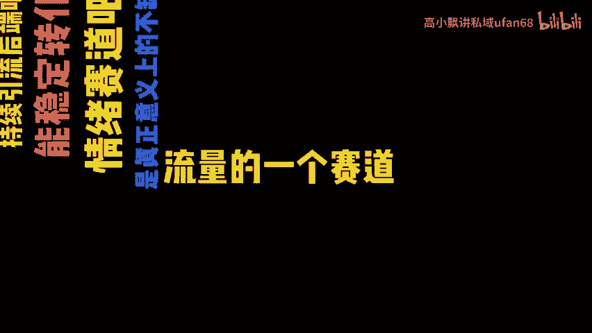

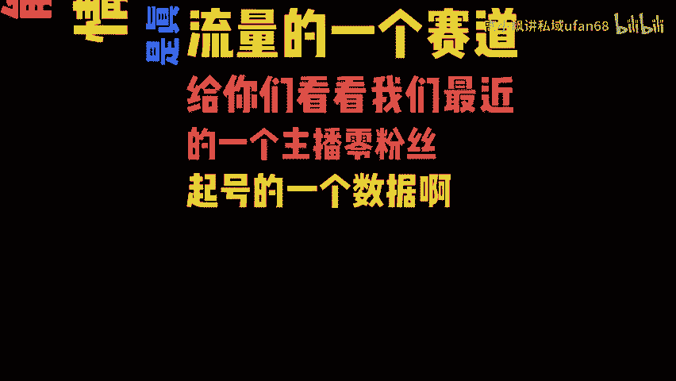

这些吧都是六分几号，我如果现在在教你啊，如何做一个几十万的粉丝，你才能变现，那不就扯淡的吗？我自己也做不到，知道吧？咱们普通人能做的啊，能学习的就是那种低粉丝高变现的模式。

你一天吧也留几十个精神粉做好了吧，就是几千块的收益。我不知道一天几千块啊，在你们看来是一个什么样的水平，可能在抖音里吧连入门都算不上。但是呢在我看来啊，普通人而言已经很不错了。不要把感觉流量越多越好。

流量多了吧，你可能也接不住一个销售员一天正常啊接50到100个流量能聊透就已经很辛苦了。有时候把流量多了也是浪费，他都吃地下了，至于如何获取几千块的收益啊，就是给你们讲的第二个点转化。

就是你需要把你引来的流量进行转化，转化的一个基础的逻辑就是利他思维。你要解决他的问题，从而完成销售。你如果吧就光发个产品就让他掏钱，那未免也太低级了，你转化率不会高。

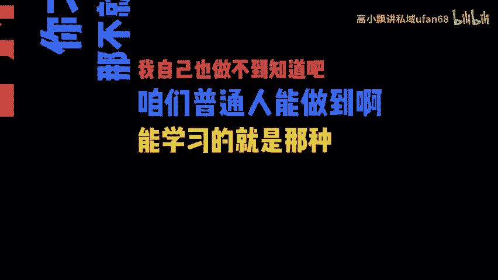

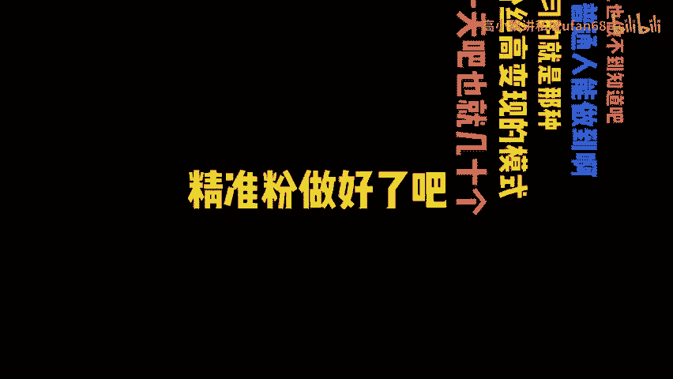

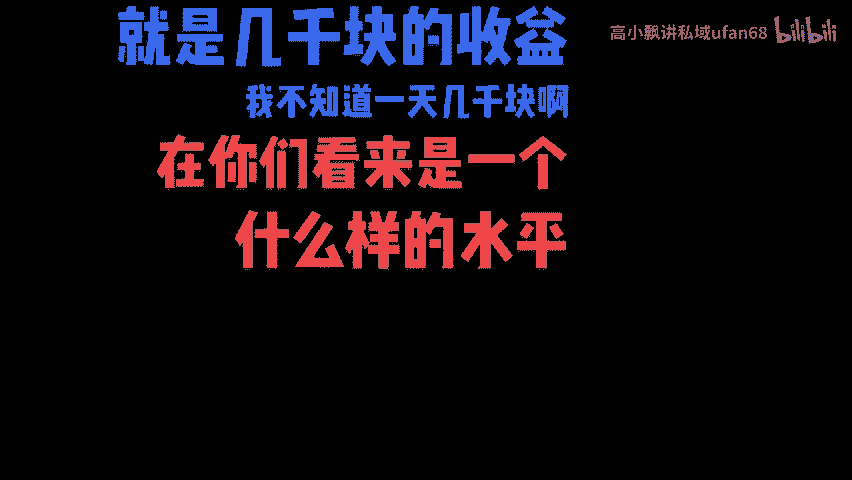

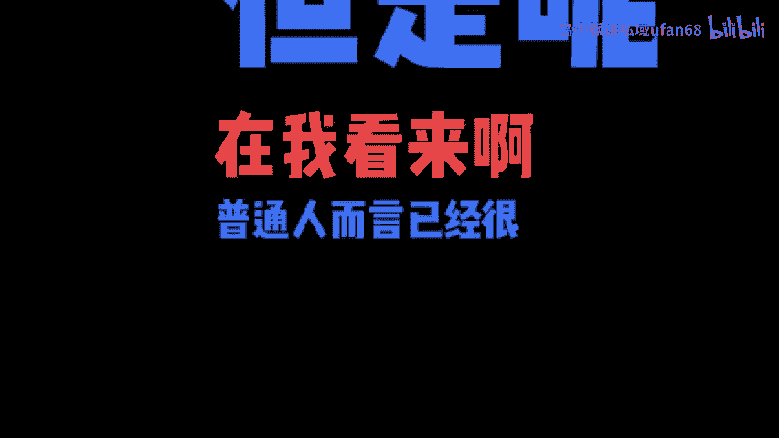

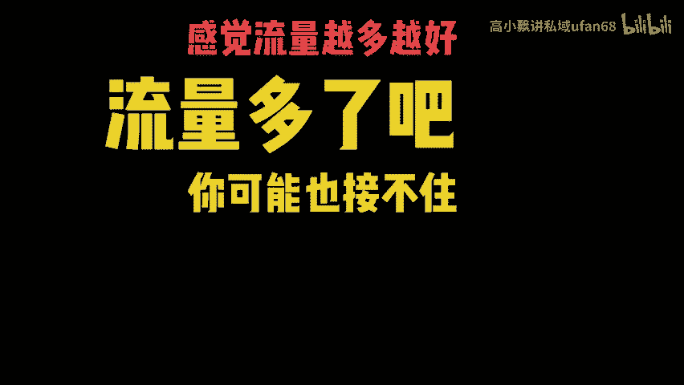

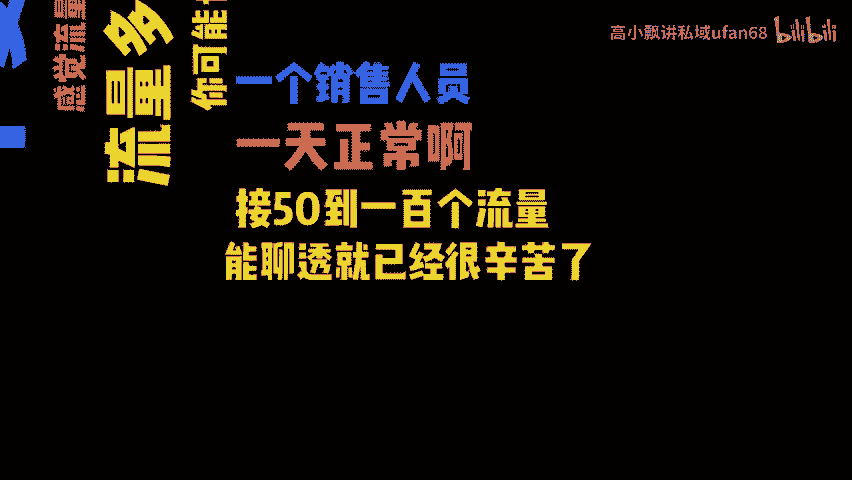

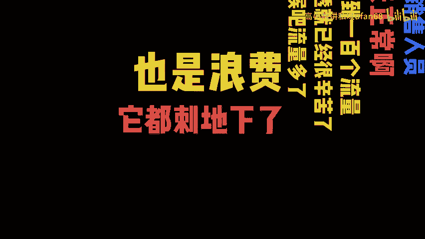

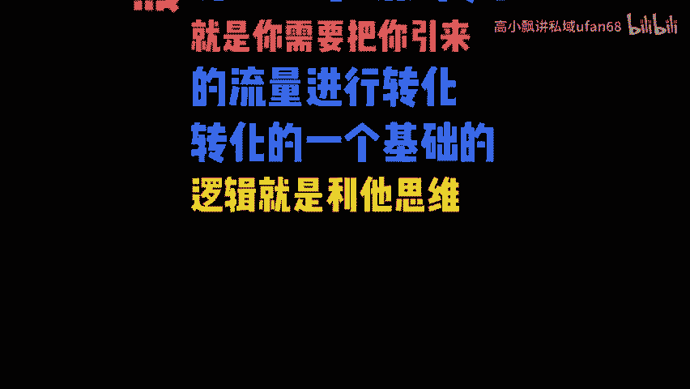

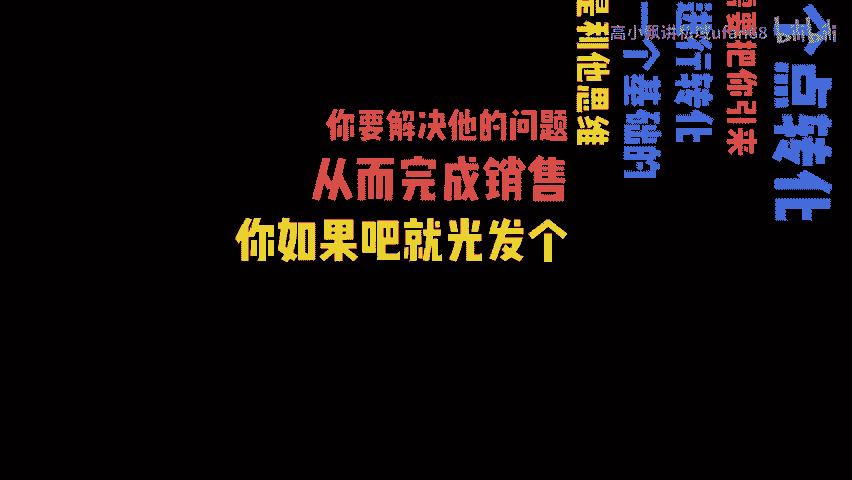

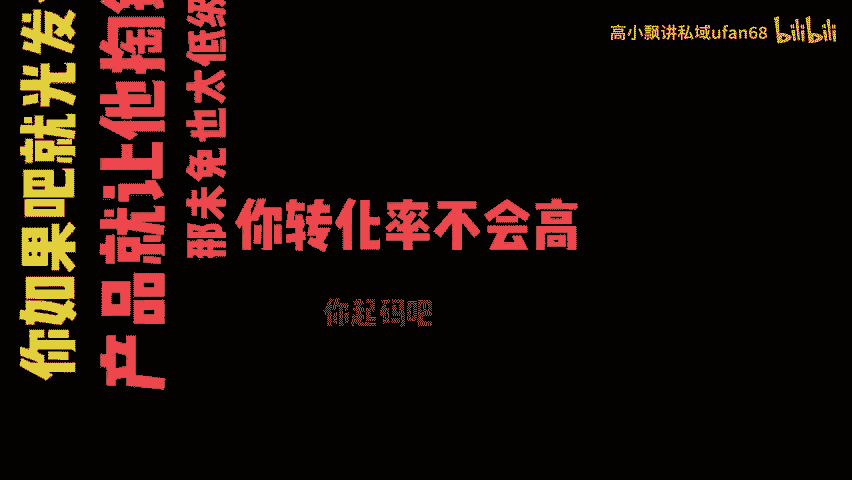

起码吧要把客户当个人，在情趣类目里啊，这个类目里大部分的客户吧他都是小白。如果吧你能根据他的需求给出相应的建议，他不会不乐意买单。甚至吧有的客户需求跟你说完了之后，他不买点啥，他都不好意思。

你可不可以理解这东西吧是隐私品，他买这个东西吧，就会感觉跟买其他的产品不一样。所以吧你要利用他这种思维拿捏他的人性。我们目前吧可以把那种最不值钱的S分，做到转化率17%。

加上我们行业吧本来本身所带的高利润高复购零退货率来算，你的持续收益肯定会越来越好。😊。

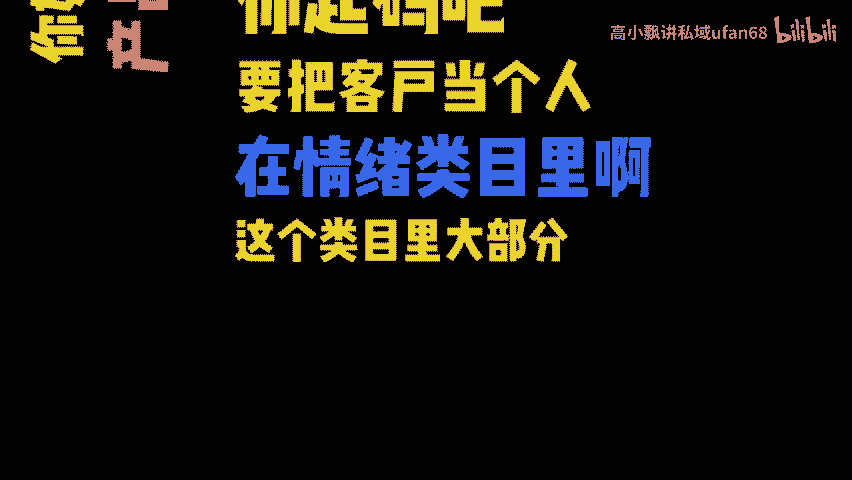

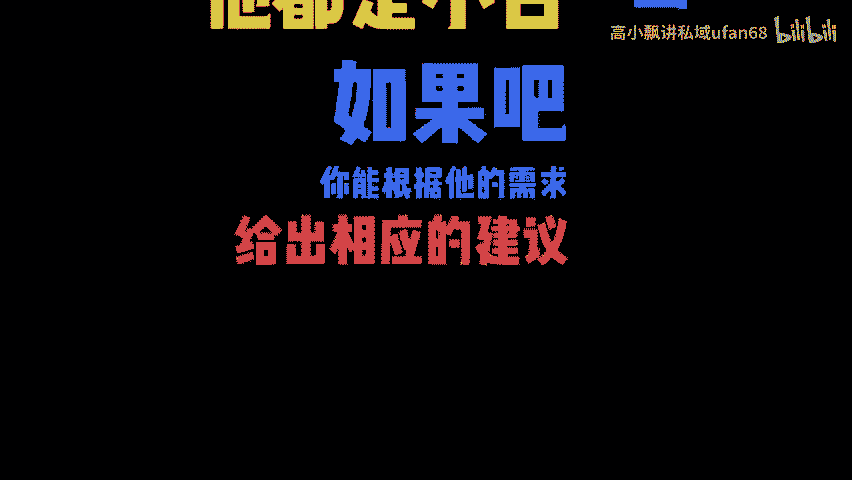

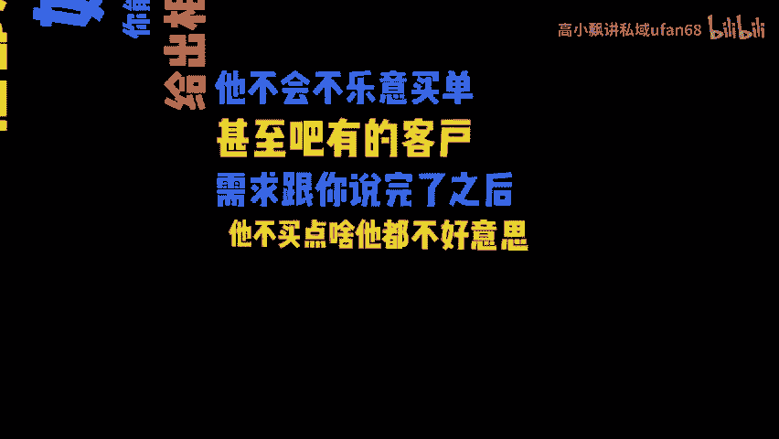

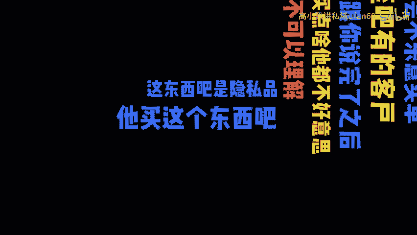

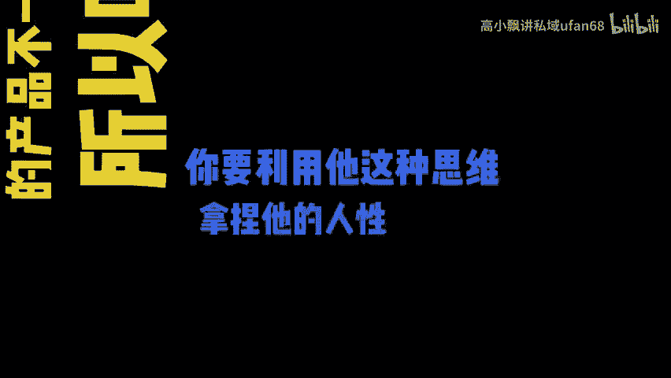

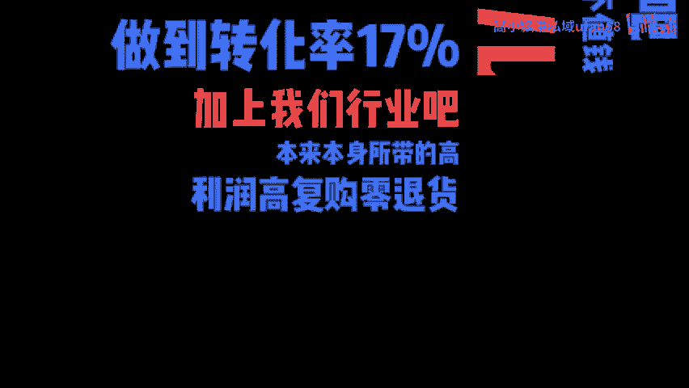