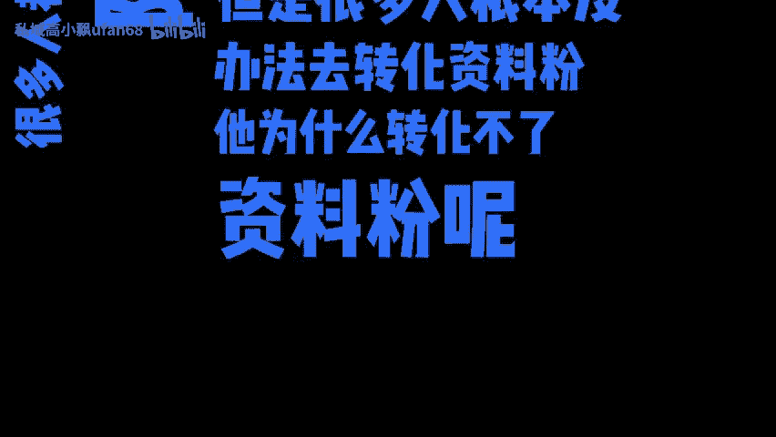
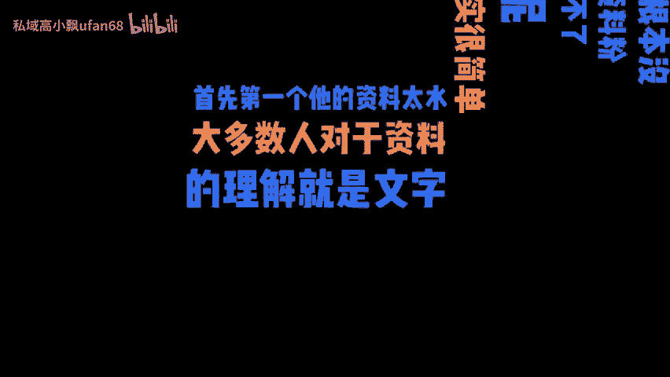
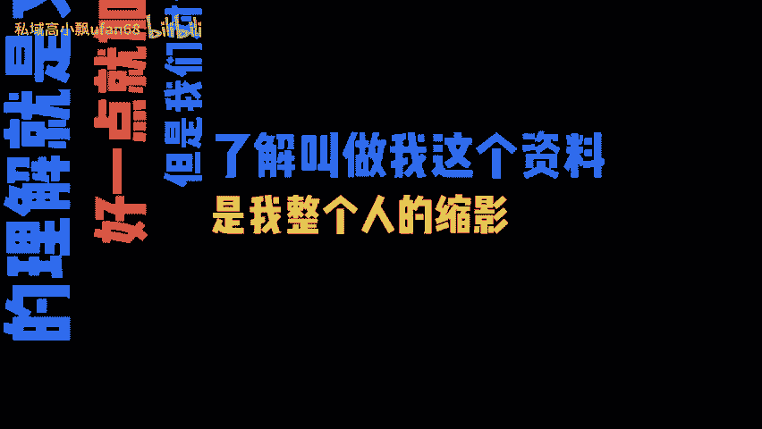
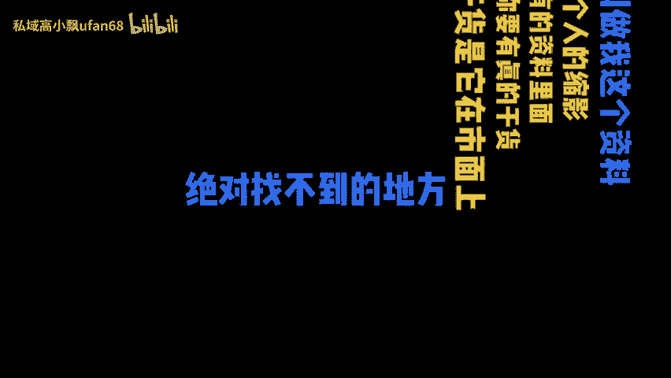
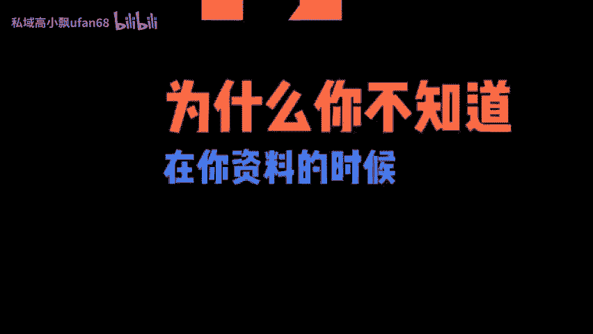
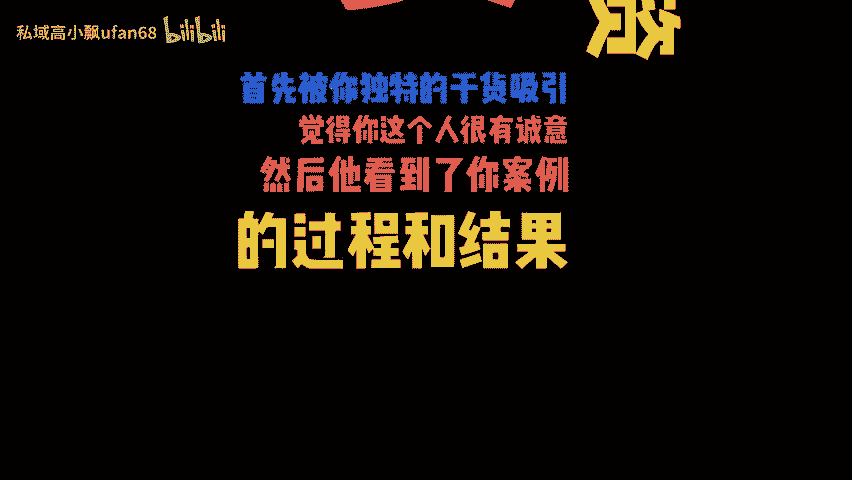
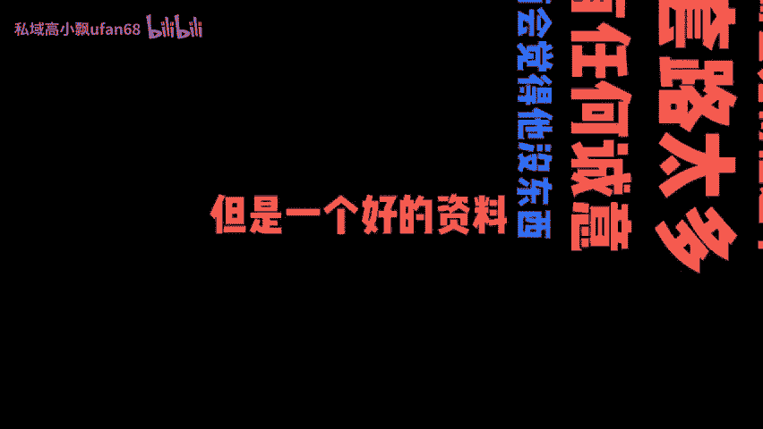
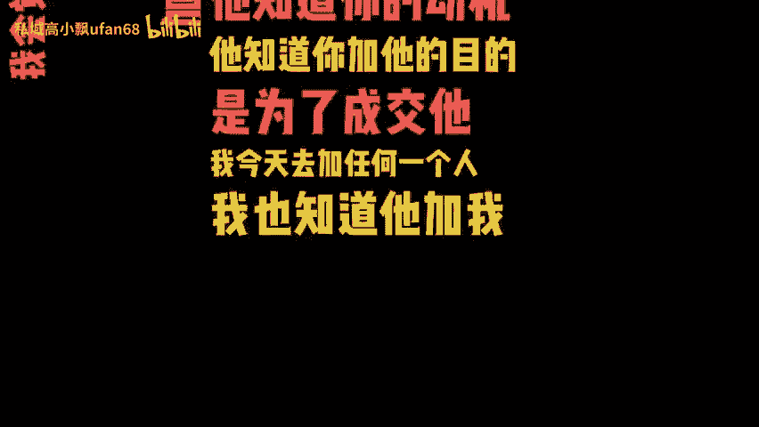
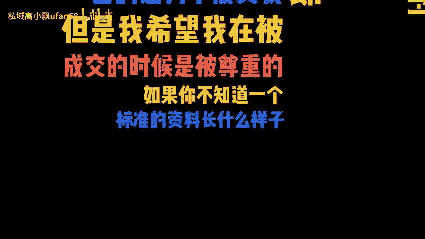

# 引流私域的资料粉如何有效转化？ - P1 - 私域高小飘ufan68 - BV19p12YCEot

🎼很多人都会去送资料隐私域，但是很多人根本没办法去转化资料粉。他为什么转化不了资料粉呢？这个事情其实很简单。首先第一个他的资料太熟，大多数人对于资料的理解就是文字带好一点就加图片。

但是我们对资料的了解叫做我这个资料是我整个人的缩影。我们所有的资料里面，第一个你要有真的干货。这个干货是他在市面上绝对找不到的地方。第二个要有我所有做过的事，我的案例，我的过程，我的结果全部放在里面。

第三，你要知道不同的载体，它是不同的承托力的视频大于图片大于文字。你今天领到的很多资料里面可能会有文字肯定会图片也有链接，但是很少有人会往里面塞视频的。你账号知道要置顶三条视频，让别人快速了解你。

为什么你不知道在你资料的时候，里面要放几条你最难打的视频，让别人快速的知道你的水平。而且一个好的资料一定不是单纯的干货，他是干货加秀肌肉加广告。你想想看，今天如果一个人领了你的资料。

首先被你独特的干货吸引，觉得你这个人很有诚意。然后他看到你案例的过程和结果，他相信你是有实战的。最后在最下面他发现了你的广告，找到了为你付费的方式。

🎼这个时候是不是最容易心动的，哪怕他不心动，他是不是在心里面也会种下一个新毛。我经常会用小号去领很多同行的资料。我对一个同行的判定标准，就是看他的资料水不水。

有的资料一看就是淘宝上面9块9100份的那种，毫无价值，领到这个资料的，我不会对这个博主有任何的好感。我反而会觉得他这个人套路太多，没有任何诚意。我反而会觉得他没东西。但是一个好的资料。

我会觉得这个人是有诚意的。并且你要知道每一个加你私语的人，他知道你的动机，他知道你加他的目的是为了成交他，我今天去加任何一个人，我也知道他加我的目的是为了成交我，但是我希望我在被成交的时候是被尊重。

如果你不知道一个标准的资料长什么样子，你可以来领一份我的操版笔记。但我在里面做了哪些设计买了哪些。

