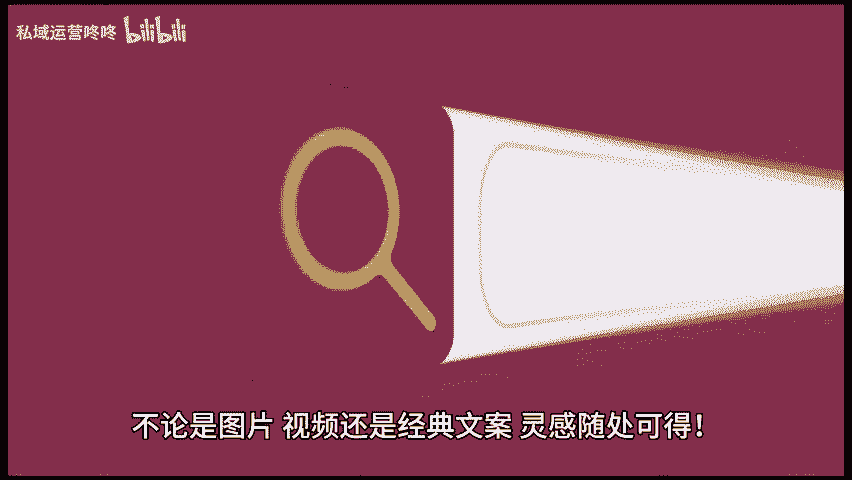
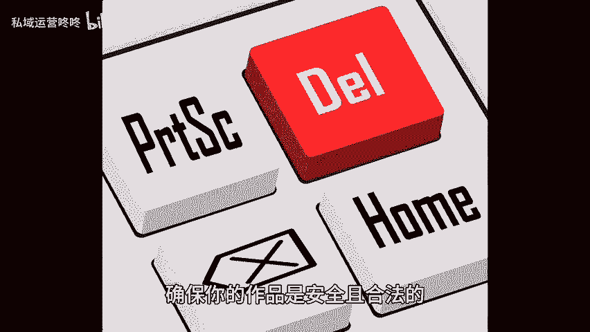

# 引流难？三步教你打造钩子，让客户主动上门！ - P1 - 私域运营咚咚 - BV1itWGe1EnS

🎼想要轻松引流，让客户主动找上门吗？今天分享一个简单又有效的方法，只需三步，让你的内容吸引力满满，以全网搜集素材灵感无限。首先我们要做的就是在全网搜集各种素材。无论是图片视频还是经典文案灵感，随处可得。

多浏览不同平台，记下那些吸引你的内容，整理出一个素材库，让创作变得更加轻松有趣。2、整理填充，打造独特风格。把收集到的素材进行整理和填充，根据你的品牌特色和目标客户进行调整，加入自己的独特见解和风格。

让内容更具魅力，让用户看到你的用心。3、删除侵权内容，确保安全，一定要仔细审查你的内容，删除任何可能，侵犯他人版权的素材，确保你的作品是安全且合法的。保持良好的创作习惯，让你的品牌形象更加专业。

只要你做到这三步，就能轻松打造出吸引客户的钩子，让他们主动上门哦。快来试试吧，运用这些小技巧，提升你的引流效果。😊。

