# 强推！【普通人做小红书】新手小白，普通人做小红书保姆级教程，全程拆解（方法+实操）无需门槛，起号易如反掌！ - P1 - 螺狮粉薯条 - BV1MnW3eaEHZ

牛逼牛逼牛逼，一个新手从零开始做小红书后，30天之后月入5000块钱有可能吗。

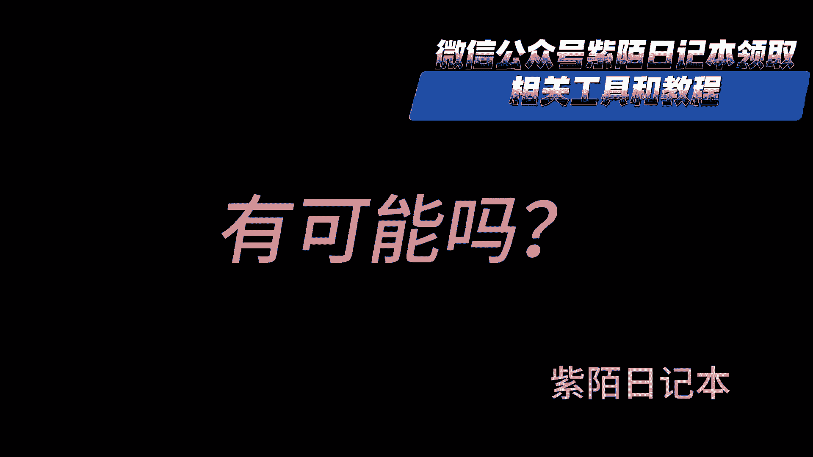

在小红书认真发布帖子的博主里面，月收入超过1000块钱的占到了57%。

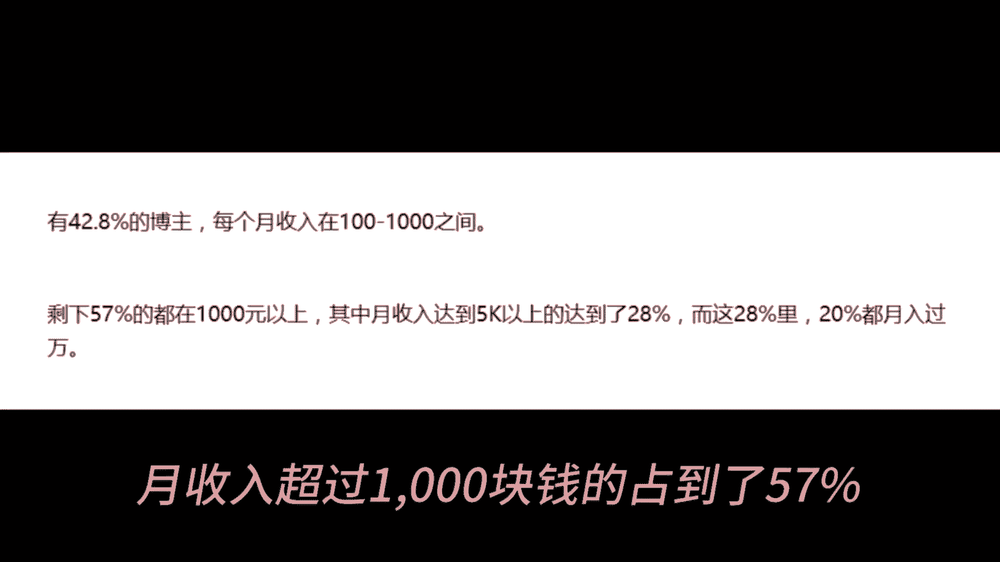

月收入超过5000块钱的占到了28%，也就是说，只要你开始做了小红书，就有28%的概率，纯靠小红书就能养活你自己设置的先驱，我会在接下来的几分钟里，让你获得这28%的入场券。

首先我们要知道小红书是一个什么样的平台，它的本质是一个社交分享型平台，我们要注意里面的社交和分享，所以要为他人提供有价值的内容，是做起来一个小红书号的核心，所以有四类人是不适合做小红书的。

第一不喜欢创作和表达，没有持续输出内容能力的人，第二不善于检索阅读和总结信息的人，第三心理脆弱，容易放弃的人，第四没有执行力的人，这四条只要你占了一条，后面内容你都不用再听了，直接评论区找到我。

先提高你的基础能力再说吧，如果你一条都不占，那么恭喜你，基础能力是没有问题的，接下来我们会手把手教大家解决三个问题，第一如何从零开始起一个号，第二如何保证持续有高质量内容的输出。

第三如何确保内容能够变成收益，这三个问题我会分别分为起号篇和变现篇，两期讲给大家，本期是起号篇，起号第一件事情不是起名。

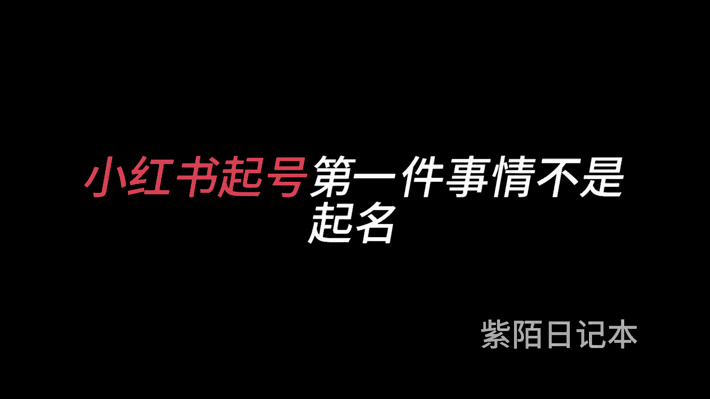

不是搞头像，搞简介，而确定自己到底要卖什么赚钱，它决定了整个号的方向，我们做小红书不是为了做慈善，做分享，我们做小红书的唯一目的就是赚钱。

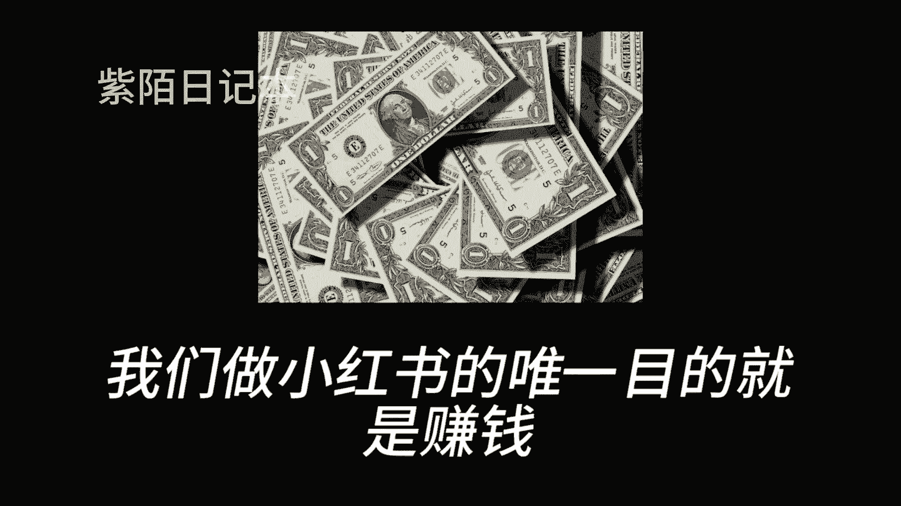

有些人辛辛苦苦运营了半天，有了几千几万粉丝了，然后发现自己的方向赚不来钱。

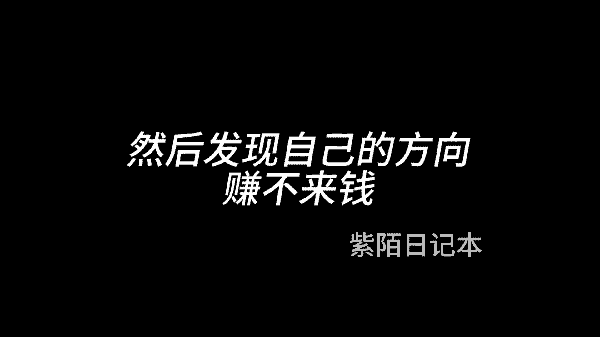

比如有些人喜欢做每日好剧，好剧分享每日读书，打卡的好，热度也很高，但没有什么商业价值，这种核心的问题就在于。

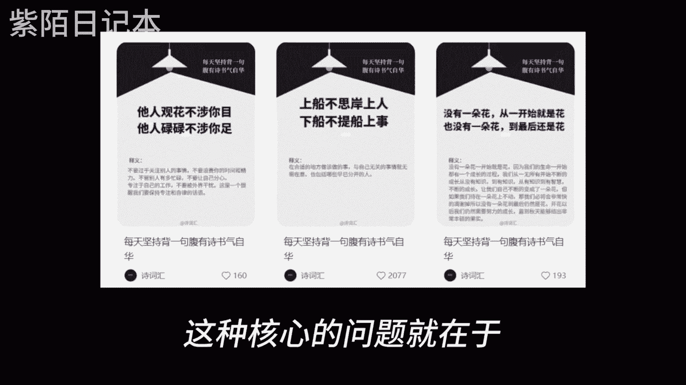

一开始就没有想清楚，自己这个号到底要卖什么东西，所以第一步你要确定的是，自己到底要卖什么产品，然后在这个方向上确定号怎么做，你要卖衣服，你就做穿搭号，你要卖付费课程，你就做培训号，你要卖吃的。

那就做美食好，你自己擅长不擅长某个领域，并不是你选择方向的依据，选择方向的依据是你要在这个方向上，第一能够持续创作内容，第二有产品可以交付，那就可以去做，至于擅长不擅长不擅长，你可以学呀。

所有人刚起号的时候，都不可能比这个领域的大V更加擅长，能力都是做着做着就起来了，就算你刚开始不懂传达，你做上200个传达的帖子出来，你还不能不会吗，如果实在不知道该做什么，这里可以给你一个参考。

小红书里面最赚钱的领域是家居护肤，其次是情感健身健康，母婴和美食，其他领域的收入普遍都没有这些高，所以你在这里面随便挑一个，你可以做的就可以了，确定方向之后是一些基础的工作，第一个是起名。

给你一个万能模板，要做的事情加标签，加个人昵称，要做的事情和标签之间要有一定的反差感，比如卖猪肉的转行医学生余宇，卖烧烤的下岗基金经理曾格，抑郁的心理医生刘六，不会穿搭的女装店主，不会做饭的美食博主。

不会骑自行车的旅行，旅行达人，不会穿越的烧烤摊主，这种反差太好找了，如果不会搞的话，来评论区找我，我给你起都可以。

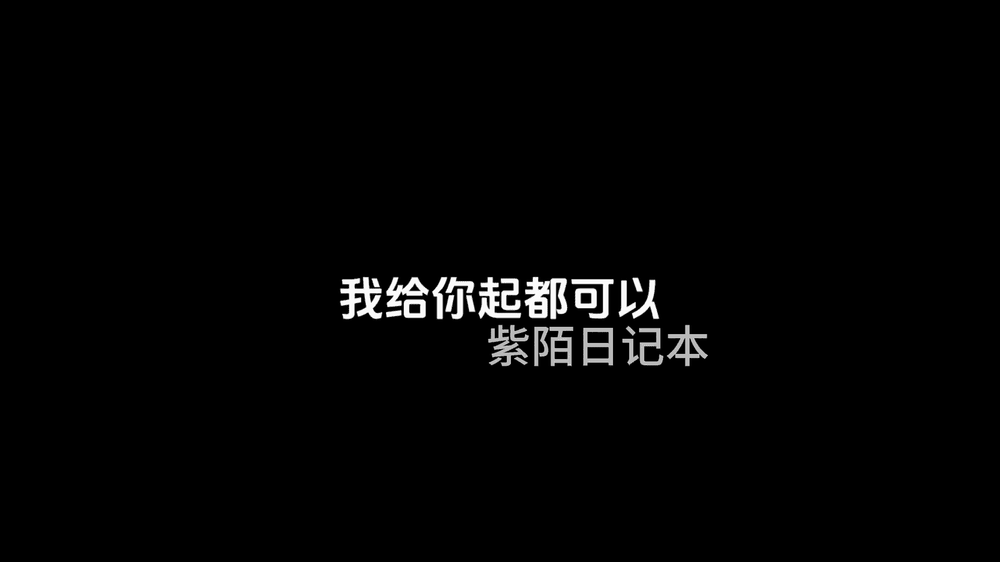

第二头像随便弄，别经常换就行，没有什么讲究，第三把默认小红书改成自己的微信号，这样后面有人私信你，你就可以直接告诉他加我小红书号就可以了。

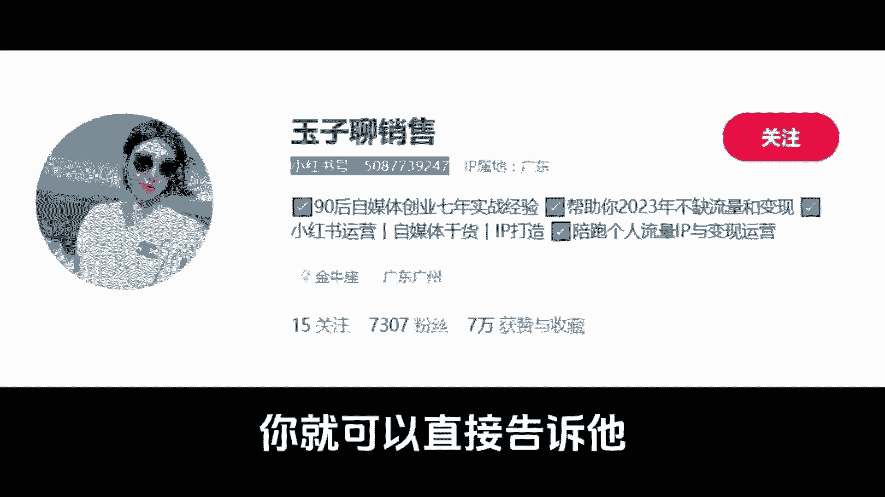

这样可以合规引流，第四简介还是万能模板身份，我是谁加，我在做什么，加这个号会发什么，比如说这个人身份是九零后自媒体创业者。

做什么，帮人搞流量，搞变现，号里面会发什么，会发小红书，运营自媒体干货IP打造。

第五是14下平台规则，第一禁止炫富，不要带给人焦虑，制造焦虑可以短期有流量，但长期来讲既会被平台打压，又不利于人设出塑造，第二禁止直接引流，帖子中间不能出现任何微信和公众号等信息，更不能出现二维码。

合规的引流方式，以后我们会讲，也可以直接看评论区置顶就行，但是在你彻底了解之前，千万不要直接领流，直接引流，对你的负面影响一定会大于你所得的收益，第三不要出现不文明言论，不良言论。

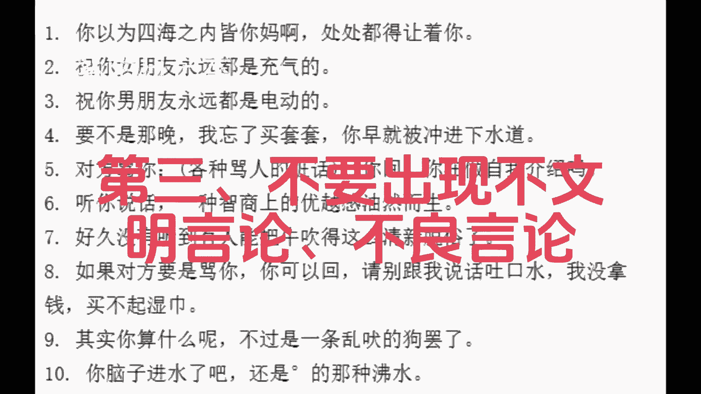

第四不要过度擦边，第五不要抄袭大V的内容，可以借鉴选题，但不能抄写内容，第六可以发泄负能量，但不要宣传负能量，比如你可以说自己心情不好，但不要宣传人就应该抑郁不抑郁，不是正常人这样的观点，到这里。

所有基础工作都做完了，接下来是最重点的部分，如何做出好内容，如何把账号给做起来，做出好内容做起来，账号总共有五个方面，第一找到一个稳定的创作模式，进而找到一个稳定的素材来源，比如这个博主。

他的创作模式就是每次做一道新菜分享给大家，植物的做法显然是无穷无尽的，所以他这个模式可以保证长期持续稳定的更新，再比如这个人，你可以看到他的内容就是不同类型的衣服穿搭，衣服的类型款式。

穿搭的方式是年年都不同，无穷无尽的，所以它也可以保证自己源源不断的，有输出的内容，每一个领域都有类似的创作模式，稍微研究一下对标账号，你就可以把它搞清楚，如果自己只是有感而发，或者根据自己的经验。

人生经历知识去创作，你写个一二十篇恐怕就没东西写了，所以你必须要找到一个稳定的创作模式，和素材的来源，找不到评论区找我，我给你找，第二内容必须有价值，要么能解决需求痛点，要么能引起情绪波动。

如果别人想做红烧肉，但是不知道怎么做，你教会了他，这就是解决了需求，如果他晚上刷了小红书的时候，肚子正在饿着，你给他提供了一个美食视频，这就能引起情绪波动，这二者同时都有算是满足底线要求的合格内容。

只满足了一条属于低质量的内容都不满足，那就是毫无价值，垃圾内容没有发出来，任何必要发出来也没什么用，但是即使是两条都满足了合格的内容，也不一定有什么流量，自媒体发展到了现在，大家已经不是比的。

不是谁能合格了，而是谁能考90分，不说红烧肉了。

就算你想学黄焖大闸蟹，花式小龙虾，网上都有无线的教程给你看。

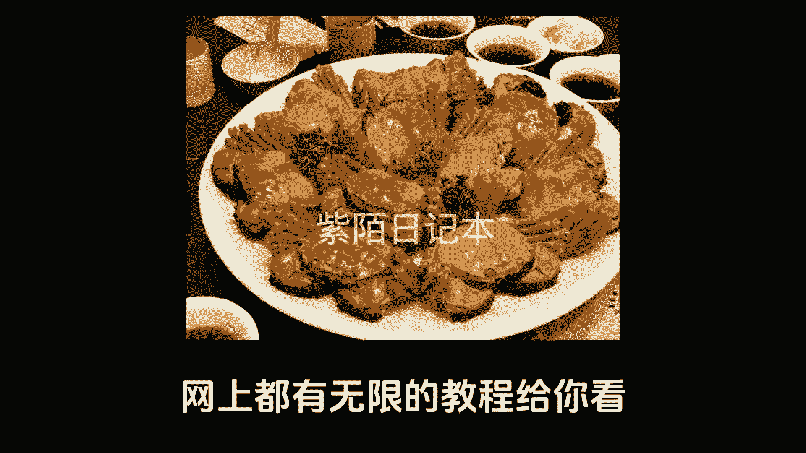

用户晚上刷到的可能是成千上万个美食视频，根本不差你一个。

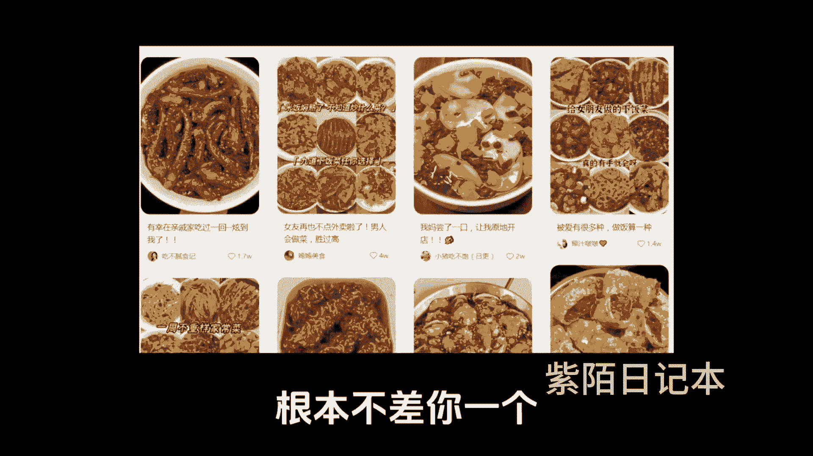

所以如果你要做满足需求的内容，你必须讲得比别人更清楚，更全面，更容易理解，更有帮助，如果你要做让人能情绪共鸣的内容，那你就必须更垂直，更有差异化，曾经你说自己是创业者，就能让人认同。

但现在你必须得说自己是大一在读，创业，985创业辍学创业，有这些标签才可以，曾经只要你的选题是小白，如何从零开始学会创业就可以了，但现在卖创业课的人呢，选题都是负债，如何翻身，穷人如何翻身。

才能引起人的共鸣，在这个内容饱和的年代，情绪价值比内容本身更有价值，别人看见你的选题，至少有点进来的欲望，他才会点进来，比如我这边如果教小红书运营教程，那就没有什么爽点，也没有什么点进来的欲望。

但如果叫做小红书，如何从零开始，30天之后月入5000，看见之后阅读点击欲望会不会就更强一些，但这并不代表只有情绪价值就可以，如果你的内容只是看着爽，但解决不了人的痛点需求，那他可能只是流量比较高。

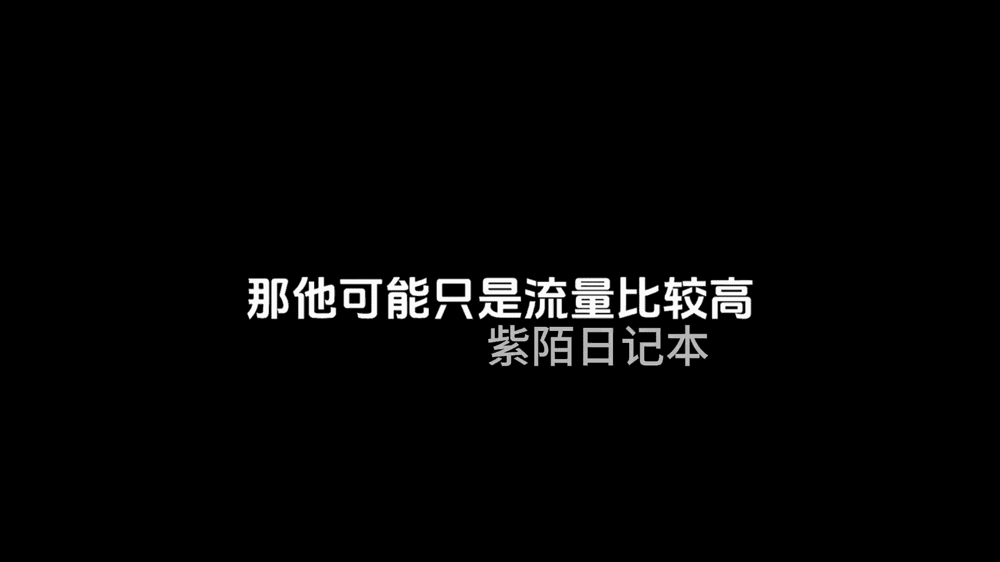

但你没办法变现收钱，比如张三生病了，你每天更新十个图，告诉他，我靠。

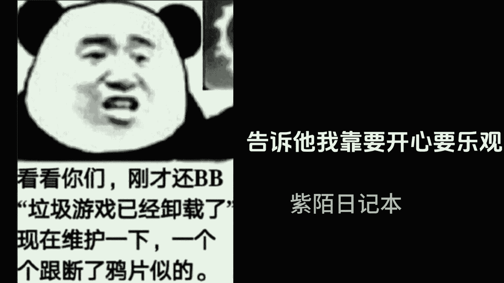

要开心，要乐观，不要难过，然后他哈哈哈哈哈，笑完给你点了个赞。

转头就给另外一个搞医学科普的人付费了，所以好的内容一定是，同时既满足情绪需求和价值需求，而且这里会有一个雷，这里做干货内容的人。

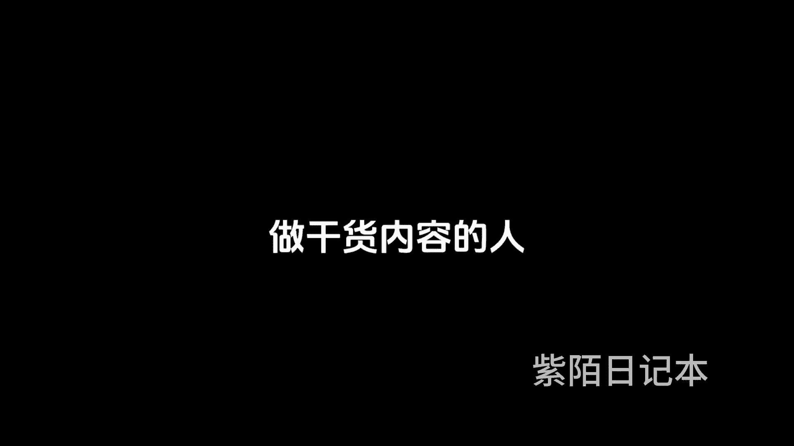

总是以为自己就能解决需求了，但是内容有干货和能解决需求，它不是一个东西，张三生病了，他最想知道是自己怎么治，能不能治好，多久能治好，有没有后遗症，你讲你为啥得这个病，你得这个病的原理是什么。

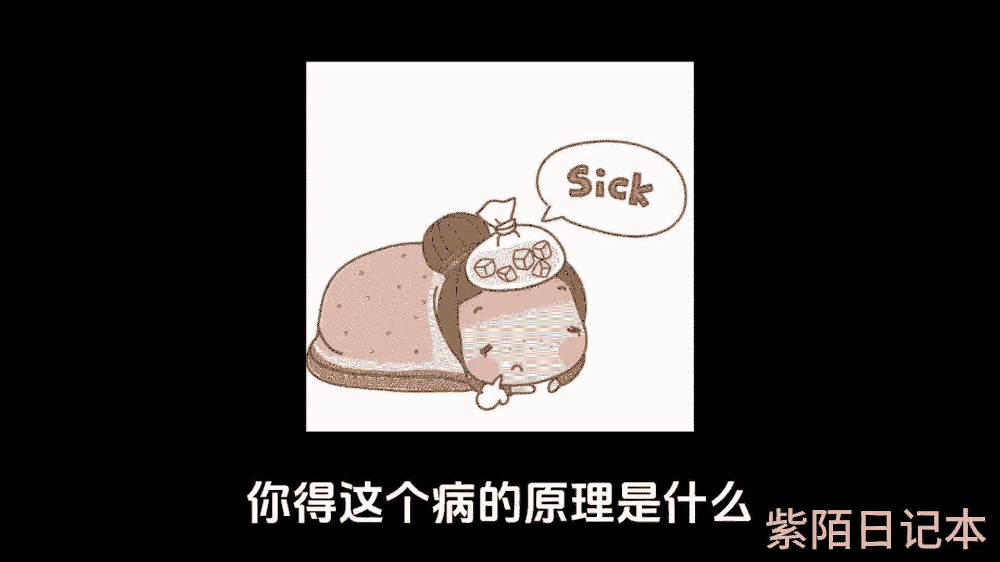

人家不关心你讲的再专业，再有干货都没有用，所以准确的识别需求是很重要的，这是一种网感，你要慢慢培养，如果你翻了一大堆内容号，就是起不来，那八成是因为原因，内容不行，要么没有情绪，要么没有价值。

自己回去分析分析原因，如果还是搞不清楚，还是评论区找我，我给你看看，第三个是封面，既要引发用户兴趣，又要解决用户问题，情内容的情绪价值和痛点价值，全部都要体现在封面上，具体的操作因为因领域而异。

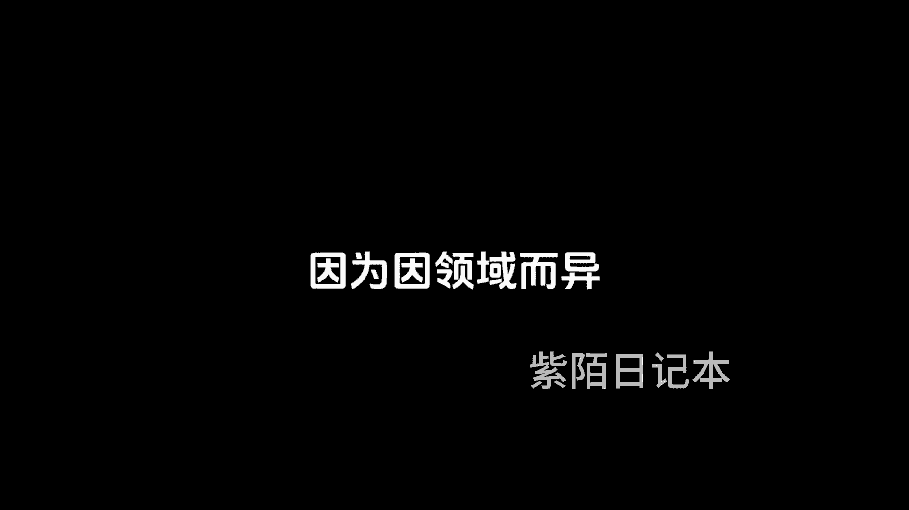

比如说搞穿搭的照片又有个性亮眼，而且要养眼，搞美食的图片拍出来有食欲就可以了。

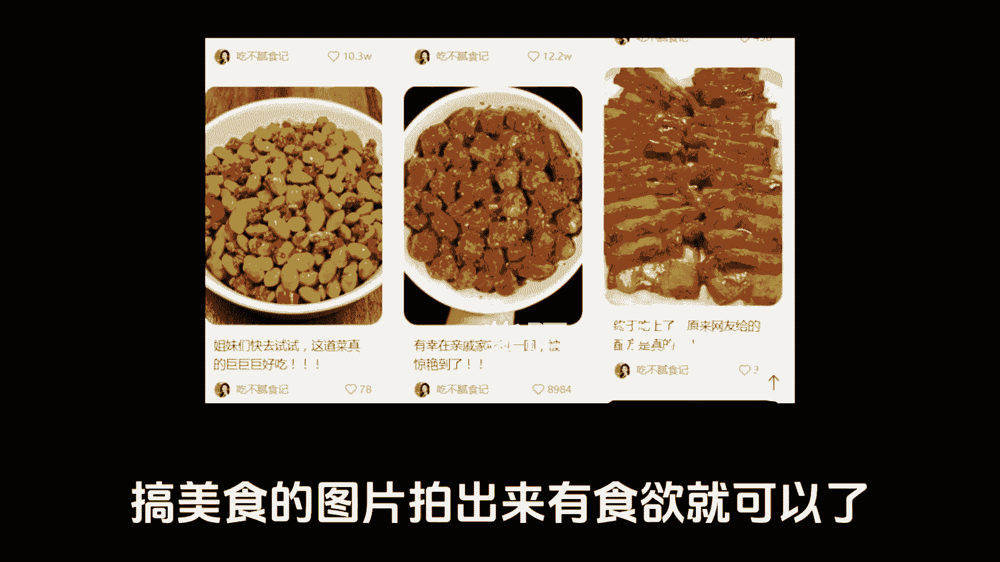

搞知识的要展示出最引人注目的观点，让别人能关注到你，如果你灵感迸发，想到了一个天才文案写的封面上，靠着封面说不定就能爆一个帖子，这个我没有办法通过一个万能公式，去让你百分之百的掌握怎么做封面。

这是一种感觉，只能多去揣摩同领域的大号，然后自己去试，做的多了自然就会了，如果怎么做都搞不定，还是来找我看看就可以，第四账号，你要做出个人风格，这个牵扯到个人IP的问题，后面我们会详细讲。

这里就是说说白了就是让你懒一点，不要瞎折腾。

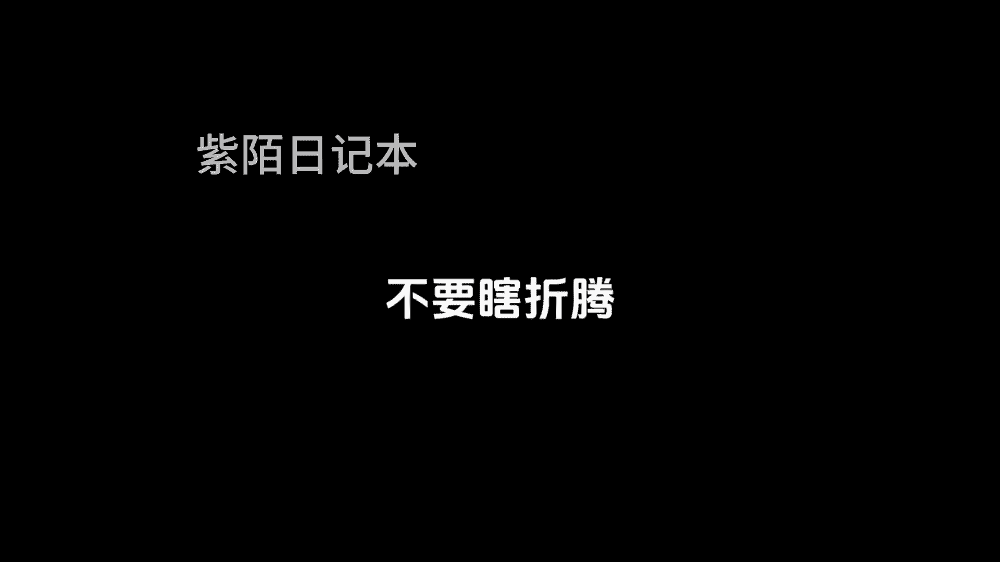

封面，不要乱换，一直用一套模板就可以了，视频的片头音乐不要乱换，一直用一套就行了，说话的风格不要刻意去学别人的，按自己的习惯坚持表达下去就可以了，比如这个人，你看他所有的封面都是一个风格。

时间长了就记住他了。

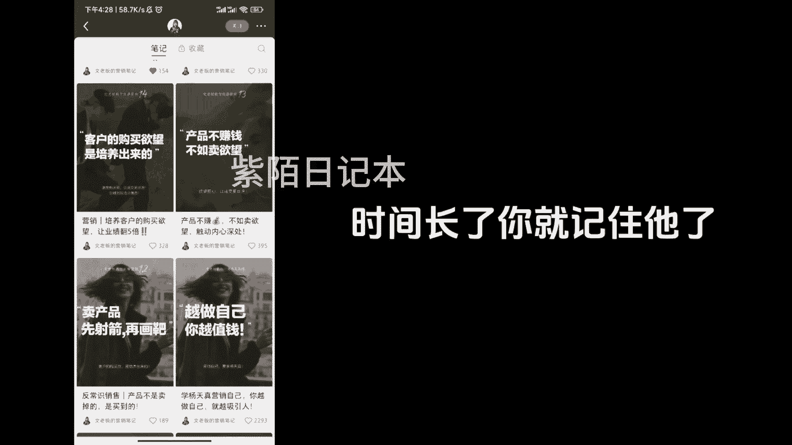

第五是宁可减少数量，也要保证质量，如果能三天更一篇牛逼了，就不要一天更三篇垃圾了，但是你要保证更新频率稳定，你不要两个月更一更，一个月之内一定要更一篇，如果一个月之内没有更新平台，就会觉得你断更了。

流量会少很多的，到这里，如果今天讲的东西全部都搞定，坚持做下去，起号绝对不是问题，变相关有五个后续变现，相关有五个问题，第一如何让同样的内容阅读量跳跃式的增长，第二个如何大规模跳跃式的涨粉。

第三如何安全高效的引流和变现，第四如何让帖子发布一年后也能继续带来收入，第五小红书群体的赚钱逻辑是什么，这五个问题在下一期变现篇中会详细讲。

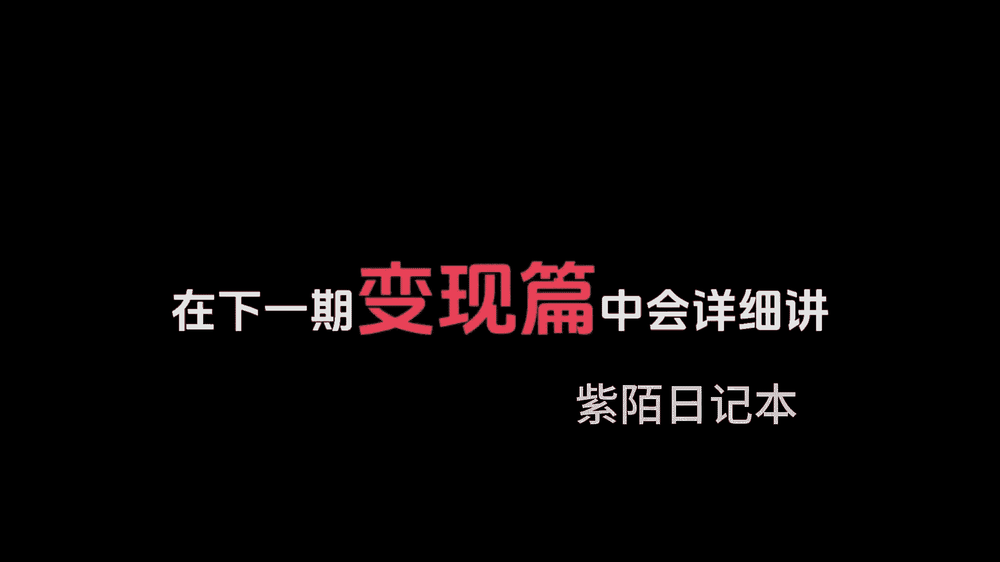

迫不及待的，想看的可以看评论置顶区就OK，做了几周甚至几个月连1000粉都没有破的。

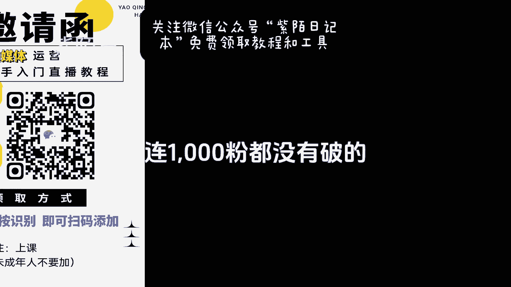

评论区找我，我帮你看看好，你好，我叫阿强，我是咱们王导主电商学院的小红书官方讲师，从今天开始就由我来和大家一起来呃，学习我们小红书小红书整体的如何去做的对吧，我们店铺如何去做。

我们小红书的IP如何去打造，以及我们关于一些呃剪辑方面的问题，都会跟大家讲的很明白，很清楚，好吧呃，那我们今天这节课先跟大家来聊一聊，我们小红书的电商的整体的一些介绍，好吧，额。

那我们会从两个方面会跟大家具体来讲一讲，首先会跟大家来聊一聊，为什么我们要去做小红书电商，今天的主要目的就是跟大家来聊一聊，我们整整堂这个我们的课程里面，会按照一个什么节奏。

什么步骤来跟大家呃讲我们的小红书课程，首先为什么我们要去做小红书呢，首先你要大家要知道趋势很重要，小红书它目前算是整个互联网中，风口已经算比较大的，但是最大的流量大家可能也知道，肯定目前肯定是抖音对吧。

但是小红书它目抖音它已经处在一个风口，但是它在逐渐下降的，而小红书其实你会发现，他每年他每个月的和热度啊，以及流量的，都是一个处在一个持续上涨上涨的一个状态，所以说其实大家和我们一样。

其实也是看到了小红书它的风口，它的流量，所以说我们才会去做小红书对吧，才会去越来越多的人在小红书里面赚到钱，也有越来越多的人开始入局小红书，所以说趋势很重要，这个就是目前它的一个风口的趋势。

所以我们也需要大家去顺势而为，而不是逆水行舟对吧，那目前小红书它是一个什么平台呢，首先第一个它是一个电商平台对吧，我们可以在里面买东西，以及可以在里面卖东西，以及它是一个直播平台对吧。

它是一个买手平台对吧，大家要明白这三个点就很重要，以及目前小红书相对于其他的一些平台来说，比如说一类电商的淘宝，天猫京东这些是稍微比较简单的，而且相对于抖音来说也是比较易上手，成本比较低的。

那他具体从哪两个方面呢，首先它不需要大家去囤货，不像抖音天猫淘宝这些，它需要大家有货源，有工厂对吧，他不需要你去说固定，我必须得去直播对吧，直播卖货这些都不需要我，因为我们大部分做小红书的人都应该知道。

他是可以有一个叫做一件代发的，我们可以让别的平台帮我们发发货，我们自己不需要去发货，以及他对于像抖音来说，抖音如果说你不实拍的话，或者说你是全部混剪的话，他肯定会很容易被呃配被判为这种搬运啊，混检啊。

会判会被判为违规的，而小红书不一样，小红书我们前期做的话，不需要你去实拍对吧，而且不需要我们自己去买样品，我们不需要花费大量的人力精力，我们去做混检就可以了对吧，提供呃，你可以自己去寻找一些素材。

通过这些素材做一个混剪，做一个简单的混剪，就能获得一些稍微大一点的流量啊，形成啊，出单等等等等对吧，形成这个店铺的一些火爆的流量，很简单好吧，那第三个点，它目前来说，竞争压力相对于来说也是比较小一点的。

因为很多传统的电商的卖家呀，还没有开始完全的入局小红书这个平台，还有很多人甚至都不知道小红书平台，而目前呃，2024年也确实是小红书，他的一个新一轮的风口，所以说我们大家一定要抓住时间对吧。

抓紧时间去入驻小红书这个平台，也是目前我们呃，大部分人想在互联网上翻身的一个机会，好吧，呃那这个就是我们跟大家讲一讲，具体我们为什么要去做小红书的好吧，那接下来我会通过3N个方面，跟大家来聊一聊呃。

接下来的课程的内容好吧，首先呃先会简单的跟大家讲一讲，我们的小红书店铺的如何去操作的，我会跟大家简单做一个预告好吧，我们如何去看我们的课程，我们的一个正确的步骤，我们怎么去操作的。

我会从几个步骤来跟大家来讲一讲，首先第一个第一个我们肯定是开店对吧，店铺的一些基础操作，我们对吧，不管说你目前以前有没有开店，或者说你以前店铺操不操作，我们先如果说大家都没有的话。

我建议大家先把我们这个开店的流程，都给大家看一遍，我们开店的整体的流程，以及店铺的一些基础操作对吧，那啊具体怎么去操作呢，我们会第第二节课里面会给大家讲，用什么账号去开店，用新号还是老号对吧。

第三节课第四节课我会跟大家讲讲，我们如何去设计开店，一个人如何去开多家店铺，我们后期想做矩阵，我们如何去操作，以及我们第五节课，第六节课会跟大家具体来讲一讲，我们如何完成店铺的一些基础操作。

我们地址怎么去填写，以及我们怎么去发货呀，以及我们等等等等怎么去上品啊等等，都会跟大家讲，这是我们第一部分，第二部分会跟大家讲讲我们怎么去选类目的，分析一下我们类目对吧，我们内幕其实也是很重要。

我接下来也会跟大家讲啊，其实我们这个方向其实永远比努力更重要，我们要选对方向，这一一大点我会具体跟大家讲讲，如何去选类目的，以及我们选好类目之后，我们如何去养号呀，我们如何去找到我们的对标账号。

以别人学得好的，别人做的好的，他肯定是有一些好的地方我们可以借鉴的啊，这两节课我会具体来跟大家讲一讲，我们养好号之后，我们如何去选品啊，我们类目也想好了，那那我们得去选品，我们通过什么呃。

在什么地方选品呢，在淘宝抖音拼多多小红书里面都是可以选品的，以及我们选品的一些底底层逻辑对吧，以及我们用一些大数据来观察一下，怎么去选品的问题，好吧，呃这是选品的问题，以及我们去选完品之后。

我们怎样去做一些营销的活动，比如说上架优惠券等等等等，我们通过手机端上架产品对吧，电脑端上架产品是吧，以及优惠券怎么去设置客服的聊天等等等等等，这些我都会具体细节方面跟大家讲一讲。

以及我们这些品都上完了，店铺都开完了，那我们开始找素材写笔记了，我们如何去写，写出我们高效的笔记，写出我们爆款的笔记，找到我们爆款的素材对吧，我们在哪些地方找呢，如何在拼多多淘宝里面找。

以及在更多抖音小红书里面找素材，我们的封面笔记标题，我们如何去正确操作，才能做出我们爆款的笔记，爆款的视频对吧，我们手机端如何去发布笔记，电脑端如何去发布等等等等，这个我们会在找素材写笔记。

这里面跟大家讲的很清楚，以及我们会跟大家具体来讲一讲，我们写完笔记，我们笔记后端的怎么去分析它，我们获得如何通过官方来获得更多大量的流量，我们小红书笔记流量整体的分析，以及小红书模板的如何去正确使用。

总共会有大量的模板可以使用，以及小红书如何去日常维护对吧，维护他对吧，让更多的人吸引到我们的账户里面来呃，我们发了一条作品之后，如何去维护它，如何能给他获得更多的流量，如何如何把别人留下来。

如何让别人来出单对吧，小红书如何去使用1688拍单，如何我们使用吞金吞金软件，以及我们如何跟厂家对接等等等等，这里面都会讲的很清楚，以及最后我会给大家讲一讲如何去发货的，小红书的订单。

揭秘我们如何获得更多的私欲额订单对吧，获得订单之后白奖啊，发给人家第第三方平台对吧，我们行程一件代发，以及如何我们使用呃处理店店铺的售后问题，以及小红书如何去报备店铺对吧，这里面都会讲的很详细。

跟大家讲，这是关于小红书店铺的一些呃操作的，那店铺操作完之后啊，我们要打造自己的IP对吧，我IP课程我认为呃还有很多朋友跟我讲说，确实想学IP了，这个课程里面也会跟大家具体来讲讲。

如何去打造自己的IP的对吧，什么是小红书IP，如何确定你的赛道，找到细分领域对吧，找到账号的精细化运营，以及怎么去选题的对吧，我们笔记内容如何制作，账号笔记整体怎么去复盘对吧，如何形成商务变现。

思域产品如何发布，如何导流的对吧，以及我们思域怎么去变现的，这个是将近十节课程里面，我们会跟大家讲一讲小红书IP的，最后我们会来讲到如何我们小红书素材的混剪，剪辑篇对吧，我们如何去把人家视频保留下来。

我们如何去剪辑的，我们去如何去，如果说后期我们自己去拍摄的，我们拍摄的工具，那构图以及口播如何录制，拍摄素材，初剪的如何添加贴纸啊，添加转场特效，字幕音乐音音效背景音乐对吧等等等等。

这里面都会讲的很详细，好吧好的，那我呃这个就是咱们今天的课程，我们下节课会跟大家去具体来聊一聊，今天来跟大家讲一讲，我们哪些账号适合我们开通我们小红书的店铺，我们会从三个方面来跟大家来讲一讲。

我们这堂课首先会跟大家讲讲，不管说你人是在国内的还是在国外的，我们都是有办法来开通我们小红书店铺的，或者说很多人想了解，目前我的账号是一个新号哦，我们是呃或者是一个老号，我们到底我们的账号是否去。

可以去开通小红书店铺的对吧，或者说呃目前我想了解一下，我的账号到底是否被限流的等等这些问题，我今天课程里面都会跟大家讲的很详细，首先呃不管说你是人在国内还是人在国外的，其实都是可以去开通小红书店铺的。

第一种情况，你如果人在国内，在我们中国大陆内对吧，有我们大陆的身份证的对吧，那我们直接可以去用身份证，开通一家个人店铺就可以了，小红书店铺跟其他平台的一些店铺，开通店铺条件还是不一样的。

它整体来说还是比较宽泛的，因为你像其他店铺的话，整个条件还需要你有营业执照，而小红书开通我们个人店的话，并不需要你去有营业执照，开一个个人店就可以了，有一个身份证就可以了，第二个你如果说是在国外的对吧。

但是你也有大陆身份证，那没问题啊，我们也是可以用身份证开一家我们个人店好吧，呃就是你首先第一个条件，你如果说不管人在国内还是在国外，你有身份证就可以开通了，第二个呃，你如果说人在国外。

但是你也没有大陆的身份证对吧，没有大陆身份证，那怎么办呢，我们就需要有一个海外的营业执照开通，可以开通一个专卖店和一个旗舰店，我们也有学员，他是人在国外的，但他有自己的货源，他们自己有外国的一些货源。

那他想营销到中国来，怎么办呢，那就需要有海外的营业执照就可以开通店铺，就可以呃营销到国内了好吧，但是它只能开通专卖店跟旗舰店好吧，呃这个是一个条件，我们不管人在国内还是在国外都可以开店。

第二个就是我们考虑到我们新号还是老号，我们如何去开店的问题，不管说你是新号还是老号，其实我们都是可以去，如果说条件允许的话，都是可以去开店的，好吧，呃都是可以去发布作品的老号。

首先我们分为你之前有没有发过笔记，如果说你之前没有发过笔记，那没有问题啊，第一种条件，如果说你没有发过笔记之后，这个号之之前是我自己，我自己在用的，我经常天天在用吧，天天在刷一些我自己喜欢的内容对吧。

而且这个喜欢内容，可能跟我自己接下来想做的内幕是有点区别的，所以我们最好是要换一个专门的新号，专门的信号，因为可能这个标签就不精准了，跟我们未来想打进这个人群的标签，肯定是有点冲突的，有点冲突的。

因为我们自己用的账号嘛，标签啊，什么都呃都都有了，后续来说不太好养号的好吧，第二个呢，如果说你之前对吧，只是注册过，但是没怎么用的，这种情况呢可以用这种账号，我们因为这种后续是比较好养号的。

比较可以自己自己使用的，如果说你之前发过一些日常内停的笔记，一方面要看这个号自己刷的多不多，如果说你这个号啊刷的比较多，那我们就需要及时给他换掉对吧，因为你刷的多了，你这个发货笔记了，你经常标签。

我还是那句话，你标签乱了，标签乱了话，你想后期再养改过来，那难度还是比你重新再培养一个号的，难度要大的，如果说哎自己刷的不多，而且发的笔记啊，整体流量也不是很好的情况下，那是因为他没有打上足够的标签嘛。

那我们就可以自继续使用，另一方面呢要看笔记报没报粉丝，账号的整体的粉丝数量是怎么样的，如果涨得不多，刷的不多，笔记也没怎么报过，那我们可以删掉笔记，因为我刚刚讲到了对吧，你整体的流量不是很多。

因为你没有打上足够的标签，那我们就可以用，如果说你刷的不多，之前发了其他类型的笔记，且有了一定的粉丝基础，我打上人群标签了，人家都都都能刷到我的账号了，那我们就需要果断果断的换掉新号。

要不然你这个老号后续如果说标签很乱的话，你再想把这个标签给他改正的话，难度肯定是比你培养一个新号难度要大很多的，而且我们接下来也会跟大家讲一讲，我们新号如何去养号的问题啊，好吧呃。

这是第一第一个老号的问题，如果说新号的话，其实我们自己如果说我们没有这些问题，我们自己做一个新号也是没问题的，我们会对吧，那如果说你还是拿不准，我们自己到底是否用自己老号，那我建议大家直接就换新号。

找自己的家人帮忙注册一个信号就可以了啊，找自己的家人，一定要是比较熟的家人，因为这个的话后续还得考虑到一个银行卡，人家打的成交额，打到银行卡里面的问题，好吧，这是第一个信号老号的问题啊。

第三个我会跟大家讲一讲，如何去测试账号的是否被限流，而正常情况下，我们账号如果说没有出现大量违规的情况下，正常情况下是不会有太多限流了，大家不用太过于担心好吧，如何知道自己的账号被限流呢。

我们可以通过这个方法测试账号的限流方法，我们可以发布一个日常分享的一个笔记，发布什么都行对吧，正常一点的笔记，日常的分分享的生活就可以了，看24小时内的流量情况，如果24小时后流量能达到50左右的对吧。

那么正常流量是正常的，账号流量是正常的，如果说连50都没有，可能只有一个两个这种额流量的，那说明你一个账号可能会处在违规阶段的好吧，如果说不正常被限流了，那我们怎么办好吧，上面之前可能有违规的。

或者存在潜在违规的，我刚刚讲到流量很低的，我们建议注销掉该账号，重新注册就可以了啊，重新注册完之后，这一位是一个型号，我们在做继续培养就可以了，好吧呃这个就是大家呃跟大家讲一讲。

我们如果说我们怎么去选择账号，以及我们如何去测试账号的流量的，大家不用去担心对吧，我们开一个新号，开一个老号的问题，我建议大家呢，除非说你之前的账号做的很好啦，或者要不然。

你我建议大家还是去可以注册一个新号，重新养号好吧，那我们今天这个第二节课程就到这边，今天我们来讲一讲，我们第三课程，小红书开店的一些基础的一些流程，我们如何去开通我们的个人店。

个体店以及我们的一些旗舰店啊等等等等啊，我们先从我们的个人店开始来讲呃，首先我们个人店的话是可以通过手机开通，也是可以通过电脑开通的，手机开通的话，我们就下载一个，我们我们可以用小红书本身的账号也可以。

或者说我们下载一个小红书的千帆，我接下来也会跟大家具体来讲一讲小红书，千帆好吧，我们需要的需要的证件，需要你有一个身份证以及有一个银行卡呃，但是这个一定要是同一个人才行对吧。

你身份证跟你银行卡绑定的是同一个人呃，这个是必要的条件，因为他后续，所以说这个如果说大家是用自己家里面人，或者用亲戚绑定的这个身份证的，绑定这个账号的，所以说一定要找比较熟悉一点的对吧。

要不然后续会考虑到一个经济纠纷等等对吧，这是第一个，第二个呢就是我们开店过程中经营的类目啊，其实可以前期随便选一个，先把店铺开通了再说，反正呃后面啊反正可以随时在改类目，因为我们叫如果说你想持续做的话。

你要交交保证金对吧，但是我们在开店的过程中，保证金可以先跳过，先不用交对吧，店铺可以随便取，后面我们后续我们再改都可以好吧，经营的地址呢也是可以随便填写的，这都没问题好吧，那具体的开店步骤。

我来跟大家来讲一讲怎么去操作，首先第一步打开我们小红书的搜索栏，这是我们普通的系统，打开我们小红书搜索栏，你看到了，这是我们小红书搜索栏，我们在上面搜索开店两个字，搜索开店两个字，打开开店了，看到开店。

我们搜索开店这边有个小红书电商，小红书电商官方平台，点击开店，我们就点击这个就可以了好吧，点击开店之后，点击另一即开店，这边跳出来之后，我们这边有个立即开店呃，我们可以先看一下。

比开店必要必看的一些材料费用，而正常情况下开店是不需要你，如果说开个人店的话，不需要收费的，零元就可以开，开通了服务费优惠，流量扶持必备工具，选择立即开店，选择立即开店之后，我们选择店铺的类型对吧。

我们前期我们可以先选择个人，选择个人店吧，个人店的话只需要你有身份证，如果说你想开一个个体店的话，需要有营业执照以及运营人的身份证证件，这个的话是支持一部分的类目的对吧，那但是如果说你想开通个人店。

后期也可以转为个人，个体工商户店都可以的好吧，如果说你是企业的话，也可以开通企业店，但是企业的话可能会以额以及专卖店，可能会呃考虑到一个税务的问题好吧，关于开通电，我们点击店铺选择完之后。

我们点击下一步对吧，它会里面会有很多店铺的介绍，我们就选择个人店，选择嗯，你自己想要的店铺就可以了，选择完店铺之后，我们选择点击下一步，点击下一步邀请码，我们可以跳过对吧，没有可以不填。

这是关于服务商的呃，我们填写其中的一些信息，身份证的正反面照片啊，以及我们这边可以选择属于零星小小额交易，依法无需要办理的，以及如果说我们是农副产品的，需要办理的对吧，开店必备的。

我们这里面也是有一些开店必备的个人身份，个体户的企业的等等等等，电商我们去填写一些自己的一些信息就行了，很简单好吧，不呃有很多信息，如果说你不需要可以跳过的，你可以先跳过对吧，我们选择个人身份，个体店。

电商用品就可以了，选择立即开店，正常情况下我们的店铺就可以开通了，好吧，这是我们开店的步骤，那有几个注意点跟大家讲一讲，首先呃，后续提现的金额会进入开卡身份证人的银行卡，所以说这个就是刚刚跟大家讲过的。

我们需要开卡人的身份证，跟我们的这个银行卡需要是同一个人，好吧，呃以及我们如果说多开店的话，最好找熟悉的人来开对吧，亲戚朋友啊，个人店正常情况下呃，当天时间，如果说你这些信息填写的都没有问题的情况下。

当天他就可以下来了，小红书的名字，也就是店铺的名字，比如说需要注意的是提前查重对吧，我们小红书店铺的名字也也可以提前，可以前前期可以先随便选一个，后面也可以改对吧，但是七天改一次。

比如说你这个小红车名称叫111，那你这个店铺名称就叫111的店，个人店不需要缴纳600块钱的证件费用的好吧，这个是我们跟大家简单来聊一聊，个人店保证金的话，1000块钱大概在1000块钱左右。

也不一定根据不同的类目来分好吧，最低应该是1000块钱，这个有个平台的扣点，平台扣点大概在每个月成交额的5%，因为基本上所有平台他都会有一个平台扣点，低于1万元的，是不收这个平台扣点的。

一个自然月订单金额呃，结算额小于1万1万10，平台免收技术服务费，懂我懂我说的意思吧，假如说你这一个月整体的收入在小于1万元的，成交额在小于1万元的，他是不收你的技术服务费的。

结算额超过1万元部分平台按5%收比，比如说你今天呃这一个月成交额超过了2万，那你超额2万，那里就有其中的1万，你要说给平台一个5%的收服务费是吧，1万元的结算金额已减去退款金额。

基础服务费小于5%的店铺，不想收5万元和以下的棉袄，这个大概大家了解一下就可以了，好吧，这个是关于个体店的个体店的一些部分，大家可以去开店呃，了解一下，如果说你想开个体个体店的话。

就需要我们实名小红书的账号呃，以及加上我们的营业执照对吧，需要是同一个人的，就比如说你小红书是是是谁的营业执照的法人，营业执照上面的人最最好是同一个人，就要同一个人，然后我们可以通过手机开通手机。

打开我们小红书的商家版，目前也叫小红书千帆好吧，呃小红书千帆给大家打一下吧，后续也会跟大家具体来介绍千帆，然后大家可以下载这个手机，开电脑，开通的话就开小红书呃。

千帆千帆的官网就可以打开里面去注册了好吧，我们的专卖店旗舰店，如果说你确实是有专卖店，旗舰店，也是可以按照我们刚刚的步骤去开通的，呃接下来讲一讲我们一些特殊的一些类目，可能是比大家比较想了解的。

比如说酒水啊，零食啊，水果啊这些需要有营业执照加食品经营许可证，加上品牌授权的这些基本上都需要的，但我建议大家就是，如果说你不是特别擅长于这几个行业，尽量就先别入局这些好吧。

美妆行业呢需要有化妆品备案凭证，家电行业的需要有3C认证证书，3C数码的需要有3C认证证书，其他的内幕的都有，具体的介绍，都能在我们小红书的内幕里面可以找到好吧，然后如果说大家有任何关于内幕不懂的吧。

我们接下来也会跟大家讲一讲，怎么去选择类目的问题好吧，那我们今天这堂小红书开店的一些基础流程，主要是跟大家讲一讲如何去开店，步骤操作的好吧，那我们今天这个课程就到这边。

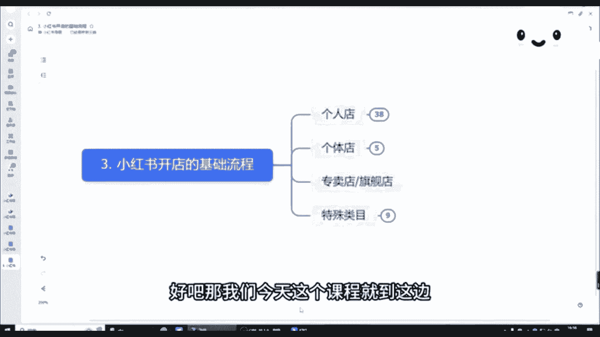

大家好，今天我们来讲一讲我们的第四堂课，个人如何我们开通多家店铺。

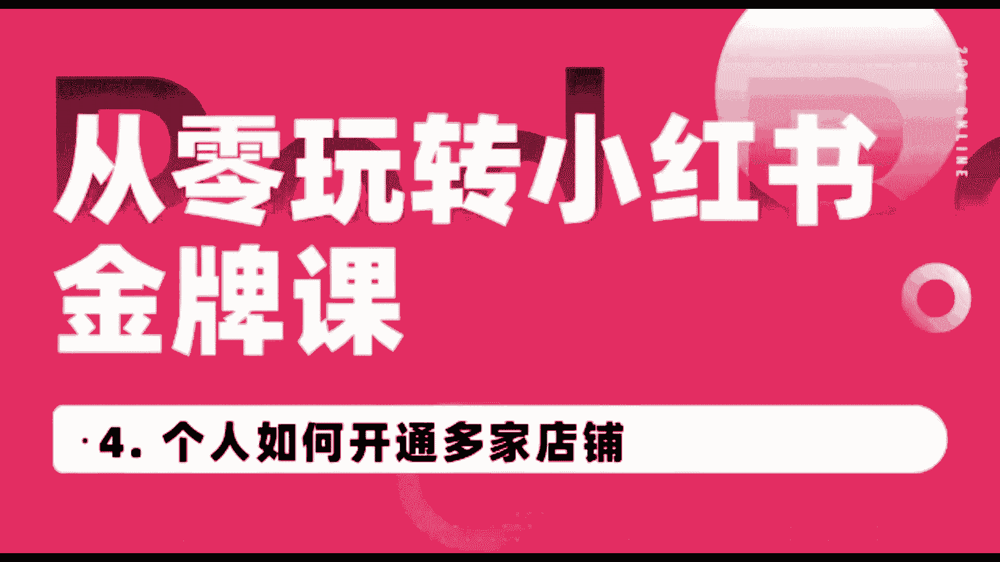

我们后期如果说一家店铺做好了，我们想开多家店铺，我们怎么去选择，我们怎么去做矩阵的问题呃，我们会从几个方面跟大家来讲，首先第一个开多家店铺的前提，如何去开家多多家店铺啊，我们店群一些注意事项。

我们先来看一下开多家店铺的前提啊，所有的我们开通多家店铺的前提，一定是你已经能把你手里面的一家店铺给他，运营好了，我们再去做，你连你自己手里面的第一家店铺还没有做好，你就想去大量的去铺，大量的去做。

那是不现实的，你最终可能导致所有店铺都做不好，哇啊这个是第一个前提，我希望大家听完我的课程之后，能把你的第一家店铺做完之后出单了，能有稳定的持续的出单了，我们再去大量的去铺垫好吧，这是第一个条件。

第二个条件，你能有大量的闲余的时间，空余的时间你去做对吧，我可能花一个店铺可能需要呃一个小时，两个小时，但是你可能花两个店铺可能就需要三个小时，四哦，五个小时六个小时了，就可能不是1+1=2的问题了。

因为两个店铺你可能会发生的事情，可能越来越更多好吧，否则你要先全力做好一家店铺，先把一家店铺做好，先把它整体的熟悉它的流程，整体的方法都给他熟悉了对吧，我们再去做其他的店铺，我们再把其他店铺给他做好。

我们再去铺铺大量的店好吧，这是开多家店铺的前提，我们要有一个稳定的出单，我们先稳定的能赚到钱啊，我们开店流程，我们运营流程，我们笔记啊，我们和混剪所有这些我都能学会啦，或者怎么去铺货，这些我都能明白了。

我再去开多家店铺好吧，那我们如何去开多家店铺呢，首先流程流程方面，首先第一个小红书账号加实名账，账号的注册加实名对吧，我们用营业执照，这是第一个，我们可以用自己的家人重新注册账号，重新加实名，重新呃。

用身份证注册小店店铺都可以对吧，这是第一个方法，第二个方法呢，我们用营业执照可以注册成企业号，企业号也可以多开小店好吧，需要600块钱的保证金对吧，再去再去开个体店对吧，这是流程，第二个呢。

我们每多一个营业执照，就是可以多开两家个体店的，懂我意思吧，就是一个营业执照可以多开两家个体店是吧，营业执照可以在淘宝里面，或者说拼多多找人代办，正常情况下几百块钱就可以了对吧。

几百块钱和比如说你是做一个营业执照，可能只要个一一两百块钱，如果说营业执照加食品经营许可证，可能四五百左右，这个是需要身份证的，以及需要你个人提供信息的对吧，这个只要你找一个可以做电商的呃。

营业执照就可以了，并不需要说你还是需要线下的，只要你同类目的就可以了，好吧，这是我们如何去开通多家的，那我们开通多家之后，我们会有一个店群，那什么是店群呢，店群就是我一个店铺一个月能赚2万和一个月。

一个店铺一个月能赚5000，你想你想你想要哪个，我问一下大家，你想要哪个，你想要一个店铺一个月赚2万，还是想要一个月店铺一个月能赚5000，呃相信大部分肯定都是想做前者，但是难度以及付出的精力都是呃。

可能是N倍，你比如说一个店铺我做2万，但是一个店铺你做4万，可能你花费的时间是远远不止这个五千五千的，四倍的，可能十倍都不止，对不对，那我们可以放低标准呀，我们既然一个店铺能做到5000。

但是我们做到5000，做到1万，做到2万，难度很大，很很很高，那我们可以多做几个5000的店铺，那我们是不是一都都能起来了，懂我说的意思吧，在小红书这个方面跟其他电商其实也是一样，你能做起来其实简单。

但是你想做好做大做强，做到一个比较好的头部来说还是难度比较大的，所以说它跟其他平台不一样的一点，就是它能迅速的去复制复制，我可能我说一个一个店，一个月我能有5000块钱的利润。

但是我想一个月有2万块钱利润很难，但我可以做十个店，做20个店，每个店都有5000，这个难度肯定是比你能把一个店做到10万，20万，这个难度肯定是要低一些的好吧，因为我们整体的流程来说。

大家都熟悉了好吧，这是第一个，我什么是店群，那我们多开店需要有哪些注意的事项呢，首先一机一卡一账号，这个大家能明白什么意思吧，就是一部手机，一张电话卡，一个小红书账号是吧，主账号。

建议我们一一个账号放在一个手机里面，不要去一部手机，去多个账号去切换，有可能啊会你正常情况下一个账号违规的话，可能会连同其他账号也会判定为违规，懂我意思吧，所以说我建议是一机一卡一账号。

目前小红书多台设备，多个账号连载同一个WIFI下是不会受什么影响的，如果你同一个WIFI没有影响，但是你最好不要把多个账号登在一个，一个手机里面去对吧，呃而且呃正常情况下浏览器登录多个店铺。

一个电脑里面多登录一个店铺，多个浏览器也是没有问题的，好吧，赚钱呢其实就是一套行之有效的动作，持续复制就可以了，为什么说很多连锁店，很多连锁店可能一个连锁店可能能赚到一个，一年赚个几10万很简单。

但是你让他赚几千万很难，但是他去做连锁了，这其实就跟我们做小红书店群其实是一样的，道理好吧，大家要首先要明白这个道理，我们再去做后面的操作好吧。

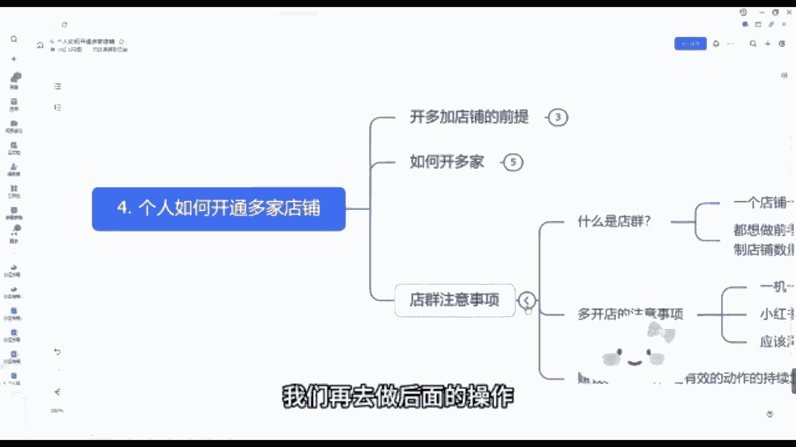

那我们今天这个个人如何开通多家店铺。