# 强推！【最新版抖音起号教程】超强暴力起号0粉到50W我只用了60天，新手小白起号最迅速的办法手把手交给你，全程干货无废话！！！ - P1 - 小手乱搓1 - BV1ERs5efE1t

我全都要做抖音，如何快速起号，并不是打开某某开关就能火，那些都是骗流量的，下面告诉你真正的起号方法，按照步骤操作，你也可以像我这样上热门，首先要搞清楚什么叫做喜好，抖音，有八个流量池。

起号的本质就是流量池突破，至少要达到二级流量池，拥有几千基础播放量才能叫做起号成功，但是99%的人都不会起号，账号不符合系统推荐算法，所以只有几百播放，下面是几号的五个步骤，缺一不可。

这是MCN机构内部资料，建议收藏一找对标内容。

抖音搜索热点榜，点击观测，选择你的行业，找到最近七天涨粉最多的十个账号，然后搜索你行业的热点视频，点击低粉爆款视频榜，找到最近七天热门的低粉号，这才是找对标最正确的方法，也是最恶心的方法。

二确定表现形式，这是需要把对标账号的所有视频看一遍，找一个你能模仿并且超越的表现形式，确定谁来拍，怎么拍，拍给谁看，我这里选择的是mg动画形式，以此代替真人出镜，三超热门选题。

从对标账号中找七个热门话题，在抖音搜索热门话题内容，找到三个相关的视频。

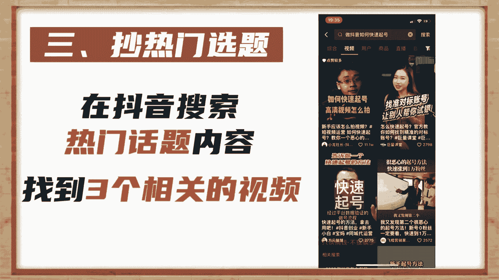

复制链接转化为文字，然后组成为一篇内容，用自己的理解进行表述，最终形成一篇原创热门文案，四测试爆款，通过定好的形式完成视频制作，每天定时发布一条视频，连续发布七天，不出意外，必有一条爆款。

因为一个新号一般会有三次上热门机会，期间可以购买抖加投达人相似加速测试，结果我复制爆款上热门之后，粉丝量会暴涨，然后就是复制爆款视频提高粉丝粘度，这时你就会神奇的发现，你发的视频再也不是三五百播放。

随随便便就是几千几万播放，这是我其中的一个账号，从抖音起号到开通中视频计划，用了三个月左右的时间，现在每天的收入都能稳定在600~1000，只要坚持下去，还是可以赚到一份不错的收益的，如果你也想做。

可以在下方评论区留言一个六，大家可以一起玩，分享一个99%的人都不知道的，抖音暴力起号方法，这个方法就是专业的代运营机构都在用的，标准起号模型，今天啊给大家做一个公开，很多人做抖音啊。

辛辛苦苦用了几个小时，甚至一天的时间做出来的视频，发出去之后呢，发现没多少播放，真的是一顿操作猛如虎，一看播放35，所以做抖音前期一定是先起号破播放，今天要给大家分享的。

这个专业的代运营机构都在用的起号模型，它一共有这么五个步骤，总的周期呢一般是在6~10天左右，首先第一步啊就是账号的规划，前期的账号规划没做好，一切努力都白费，那首先呢我们就要明确自己的账号类型。

就是我们要做哪个垂直的领域，书单号是为了带书的，零食号是为了卖零食的，那故事号解说号呢，他是为了参与中视频计划吃播放量收益的，这些呢在一开始就要定好，再有就是我们账号要做什么样的展现形式啊，是动漫类的。

是二创剪辑类的，还是说真人口播类的，这个呢要在一开始就定好，第二个呢就是我们要在账号一开始做的时候，就要明确自己的变现路径，因为我们来抖音上啊，都是为了搞钱，所以如果你的变现模式不清晰的话。

那你做到最后啊已经几10万上百万的粉丝了，发现变不了现，那你这个号啊就白费了，第二步呢就是账号的资料这块呢看起来很简单，但是啊细节决定成败，昵称呢我们起一个跟领域高度相关的，辨识度比较高的。

比如说小泽摄影大军讲故事，简介呢就说清楚自己的账号是干什么的就行了，比如说喜爱摄影啊，分享一些摄影技巧，头图和头像啊，一定要清晰美观，最好呢跟领域呢也是相关的，把这些基础资料完善好之后啊。

别人才有可能点到你的主页里边进行关注，第三步啊，就是做一个基础的设置，这一步也很关键，我们首先啊把我推荐给可能认识的人，这个选项给它关掉，如果这个选项你不关的话，你的作品有可能会推给一些不垂直的人啊。

影响你账号的大标签，再一个呢就是我们账号的认证一定要慎重啊，因为一个新号呢，你不能确定他到底能不能做起来啊，会不会有违规，因为一个人呢只能认证一个抖音号，如果万一你没做起来，你这个认证就浪费了。

所以我们的认证呢一定是，等这个号已经做起来之后啊，再进行认证，接下来一步就是养号了啊，关于养号啊，众说纷纭，那专业的代运营呢都会做这一步，那经过我们大量账号的测试啊，养号的益处绝对是大于不养号的。

所以这步啊一定要做，总的原则呢就是模拟真人操作，我们在账号注册好的前三天呢去刷推荐页，刷到跟我们同领域垂直类的视频啊，我们给它进行完播，然后呢随机的给它进行点赞和关注，跟自己领域不相关的这些视频呢。

我们直接划走就可以了，经过三四天的这样的操作，我们关注50个对标账号，这个养号的动作啊，就完成了这部作文啊，你发现你发作品的时候呢，他已经有了500个基础播放了，而且呢推荐页基本上都是同领域的作品。

我们在进行作品创作的时候呢，也不会缺乏创作灵感了，那接下来就是最后一步运营了，我们发布的作品呢，一定要是自己领域的垂直作品，也就是说我们发的作品啊，它的类型越相似越好，每天呢就发一条，不要多也不要少。

多了会影响推荐，少了，断更了会影响账号权重，经过这样一波操作啊，我们的作品发出去，基本上就能够推送给精准的用户了，账号的基础播放有了标签也有了，剩下的就是我们不断的去更新优质的作品。

一旦遇到一个好的作品，我们立马就能破播放完成起号，那其实关于起号呢还有更多的详细的内容，具体到每一天到底应该怎么做，老号怎么起号，其实呢我是有一个完整的攻略，你可以，喜好就能拿到了。

好了这期视频呢就给大家分享到这了。

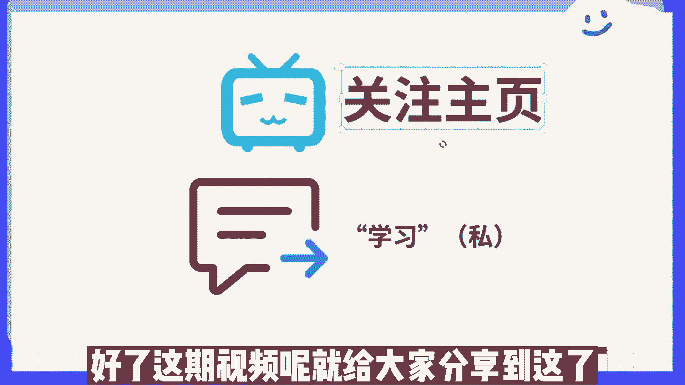

我们下期再见。

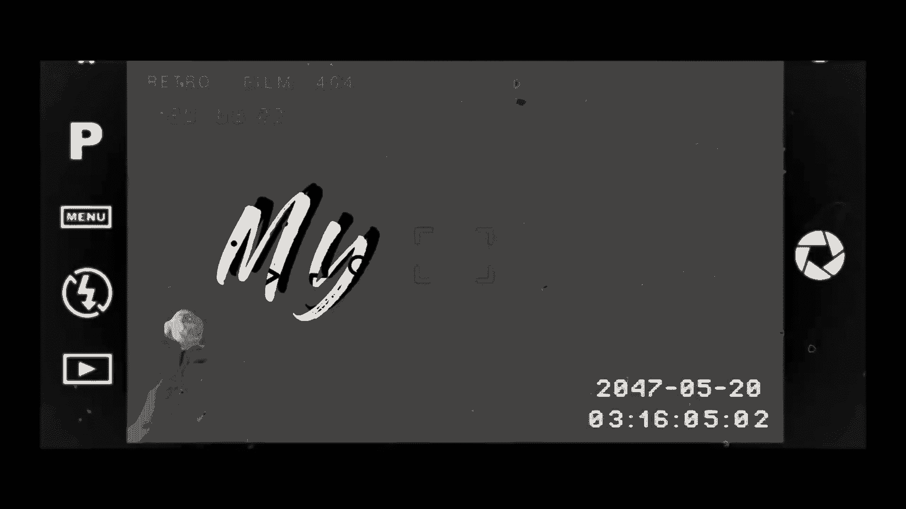

抖音呢给我发工资了，这个月我一共剪辑了七个作品，花了大概两个小时的时间，不需要我们真人出镜拍视频，对于不想出镜拍视频的朋友还是非常友好的，传承复制粘贴一部手机就能搞定了。

大家可以看到我这个月做的一个新账号，可以看到第一条作品就有55万的播放，然后呢我用了两条视频或中视频计划，然后用了两个作品去打标签，第五个视频呢是直接破了800万的播放，上了一个大热门。

可以看到我作品的一个收益啊，三条视频上1000的收益也没有那么难，最重要的是你要掌握一个正确的方法，绝大多数人呢都问我，你是怎么做的呀，那今天我就把我的操作方法给大家分享一下。

如果说你想做抖音或者自媒体，但不知道怎么入门，一定要看我们本期的视频，那话不多说，我给你直接上干货，带你去实操一遍，首先我们打开抖音，我们点击抖音啊，去搜索一个抖音电影，我们进入这个页面之后。

看到这里有个完整的榜单，我们点击完整榜单，这里是有很多电影的，然后有这样的一个素酒啊，可以看到很多人做了相关的一个视频，然后我们点击选择素材，我们知道这个入口之后呢，把它的素材下载下来。

我们点击剪辑软件，我们点开这个开始创作呀，我们把我们刚刚的一个素材下载下来，这是别人的素材，我们要把它变成一个我们自己的素材，我们首先把他的声音给关掉，然后点这个关闭延伸，添加一个音频啊。

这是我们的一个音乐，用音乐选择呀，像这样的一个视频，我们选择一个混剪，我们点这里有一个混剪音乐有很多呀，这是我选择的音乐，大家可以看一下，还可以吧，好我们把它比例调一下，我们要调成一个抖音大小的比例。

对不对，我不知道，你有九比16，点击一下，确定好比例之后呢，我们给它换一个背景，我们点这个背景啊，这里有画布模糊，然后我们给它添加一个标题，这样我们一个视频就做好了，好这是我们做完的一个视频。

我们点这个视频将它导出啊，导出之后我们再点这个入库啊，我们点击这个立即参与，然后我们把我们刚刚剪辑的视频点击一下，我们可以看到这个页面，然后这里有个添加标签，点这个颜色，我们添加完这个标签之后。

我们这里可以看到这是带标签的，然后我们把标题给它取好点八步就可以了，以上就是一个简单的操作步骤了，具体步骤有点长，这里呢不太方便来讲，感兴趣的伙伴呢可以在视频下方给我扣一个六。

我给大家分享一节自媒体的直播入门实操啊，有关视频剪辑的步骤。

文案的内容以及工具的使用，讲解的呢也都是非常的详细的，视频呢有播放量了，我们就可以在橱窗里面挂上商品和链接，只要有人购买了，还能获得佣金的收入，这样子我们就能够同时赚取两一份收益了，是不是挺简单的。

那本期的视频呢我们就分享到这里，下期我们再接着分享，B友你要点赞，你要投币好不好，点赞呢，投币刷下一个视频吧，你的B站以后刷不到我了，没关系，你要给别人投币啊，B友，B友B友，你每次都白嫖，我怎么活啊。

B友嗯，你这个逼占用我，啊哈啊啊啊啊啊，能不能懂宝贝们啊，那么其实我们在想到这种主题IP之后呢，懂是吧，然有同学说了，老师你这个东西吧，好像好多人都这么做的，什么老韩摄影教学，我还看见小韩摄影教学了呢。

那你有什么猪猪小姐姐，我还有什么猪猪小弟弟呢，是不是，那你这个广州美食之火锅片，人家老发什么重庆美食之火锅片的啊，这么多，那现在是不是重复内容特别多呀，是不是，那我在做这个主题还能火吗。

那我看老韩摄影教学，最开始他很火，但是往后面再拉好多做摄影教学，他火不起来呀，是不是啊，这个这个时候问题就来了，但是我们选的这个主题IP它还能火起来吗，可能我们第一想的是去模仿别人啊。

什么火我就也做个什么主题呗，啊对不对，这个是人之常情，但是他还能不能火起来，看能不能火起来，哎能不能火起来，再看我们接下来的什么呀，我们的核心内容啊，大家想等我想好一个主题IP之后。

我里面的核心内容还没有想的更细致啊，比如说我选择了这个老韩摄影教学了，但是里面我到底教什么，我到底拍拍人还是拍景啊，我用手机交还是用相机教我，这些我都没确定啊，那这个时候我们说除了主题IP之外。

更具体的呢就是我们是什么样的唉，我们要在什么场景里，用什么道具和动作啊，去啊，表达什么样的态度，用什么样的机位，我们的视频结构，我们的内容是什么样的，这些都是我们需要接下来定的，大家能懂不。

哎所以说其实一个内容定位没有那么简单，是不是它是一环套一环，一环套一环的，好吧啊，那么我举个例子，嗯我举个例子啊，然后刚才我们想到啊，除了说主题IP之后，我们还要想什么呀，什么我们的身份，我们的长景。

我们整个动作，我们的道具，我们的机位，甚至使我们的态度啊，这个是我们都要想到的一些啊，尽可能多的去给它扩充，对不对，那越丰富越具体，那么我们整个的定位越明确，我们接下来去产出内容的时候越容易能懂吧。

啊那大家其实可以看一下，之前有一个账号叫做暴躁的小峰，那他其实就是啊在在态度中选取了这个暴躁啊，其实他现在已经有很多粉丝了，很多粉丝了，那它的一个脚本模模式呢，跟我们接下来要讲的一些内容上的脚本模式。

其实都是一样的啊，这个之后我们讲到你们就清楚了，好吧好，你看在这里啊，我们选择了主题IP之后，那其实身份场景动作，机位态度我们都得选择一下，都得选择一下啊，那么在这里呢就是嗯给你们看一个案例吧。

给你们看一个案例叫做仙女酵母。

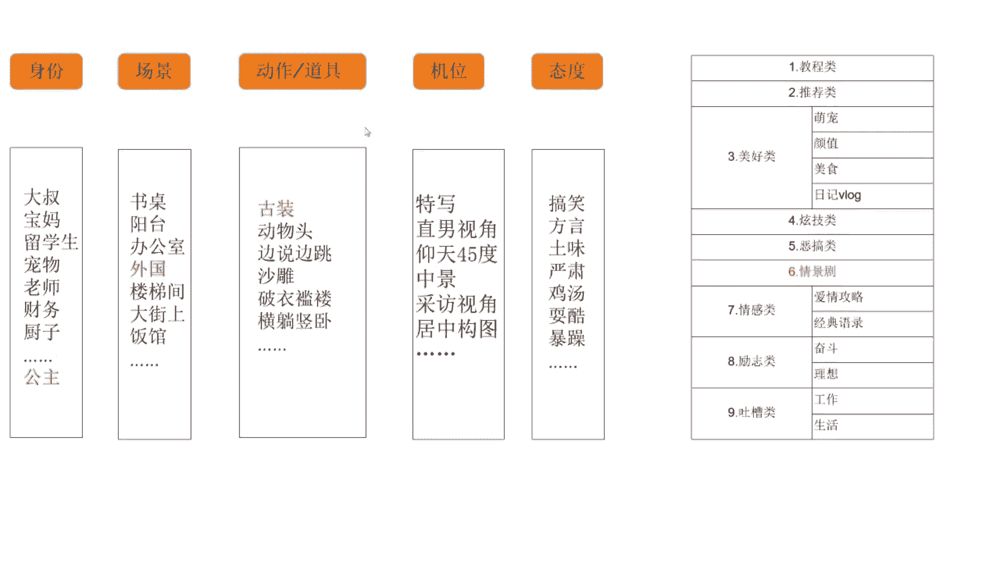

她的一个案例，所以我诶我的包呢肯定带到咖啡馆了，走你好，请问有看到我的包吗，你好是这个吗，哈谢谢诶，不好意思，我好像电话也忘拿了，哎帮你收起来了啊，谢谢，太感谢了，不好意思，稍等一下。

一会我闺蜜应该也会发现她们把我给忘在这了，好了，同学们，那我们来想一下这个视频啊，这个视频呵呵他这个段子好不好啊，这个段子好不好，单纯讲这个段子内容的话啊，他的这个视频的段子内容非常的呃，就是怎么说呢。

有点无聊，并不是说很新颖的那种段子，对不对，但是这个视频他大概有几百万的点赞吧，那这是为什么呢，嗯同学们想一下，这是为什么，这为啥，想一下就他的策划非常的好，他策划非常的好，大家返回来再看一下。

那仙女酵母呢，她现在有1000啊，525万粉丝，那其实你会去看他的段子的时候，有的时候这些段子都很简单。

没有什么技术含量，基本上在网上就是你抄我的，我抄你的，互相抄，那么他获胜的点在哪里，在于他对于身份场景以及他的道具一个打造，大家可以看一下啊，他的身份是一个什么公主，那么他的场景呢选择了外国啊。

外国的古装啊，可能偏向于古欧洲那种吧，偏向于古欧洲那种，能懂不啊，像这种比较独特的一个策划呢，导致了即使说他的段子没什么新颖啊，没什么新颖的，它也能够突出重围啊，能懂这个意思吗。

其实这一部分呢咱们属于人物IP的一个打造，人VIP的一个打造啊，那么除了这个例子之外呢，再给大家举一个例子好了，那你基本上这个图示呢就给大家解释清楚了哈，大家可以再来看一下我们的文字解释。

那么算法的步骤有哪些，我先喝口水，大家可以看一下，我第一个冷启动流量池曝光，下面的都是假设的一些数据啊，假设每天在抖音上有1000万人上传视频，抖音呢会随机给每个短视频分配一个。

平均曝光量的冷启动流量池，也就是我们说的基础流量池，比如说每个短视频通过审核发出去之后，平均会有1000次曝光，那这个数据是假设的啊，那这就是刚才我们的图示的一个文字解释啊。

可能这个时候进度进入到基础流量池，我们有2~500的一个播放量，2~500次的一个曝光，这是他随机分配的，这是一个公平分配的流量，大家都懂吧，好然后我们再接着来看，这里还有一个什么数据挑选。

那抖音呢会从这啊，100万个短视频的1000次曝光，也就是从你的基础流量池中去分析你的点赞，关注评论转发这些互动率怎么样是吧，然后再从中挑出各项指标超过10%的视频，也就是我们刚才说的8%到10%。

或者是3%到5%，这个根据领域不一样，这个数值也不一样哈，然后挑选出来之后，每条再平均分配10万次的曝光，也就是再次进入一个二次流量池，二次流量池的一个推荐，对不对，然后再去看哪些是点赞关注。

我们的评论，转发是超过10%的，那同样再进行一下刚才的那一轮操作，再滚进下一轮更大的流量池进行一个推荐，这个大家能懂吧，这其实就是呃根据这个呃，我们的视频在这些人中的一个表现，看看大家喜不喜欢啊。

大家的点赞关注多不多，如果多的话呢，我再多给你推荐点人对吧，那这个的话呢其实有同学可能会遇见老师，刚开始啊给我推荐了500个流量，然后第二次他又流量又增加了，我又多了1000个啊。

我能感受到我的流量在增加啊，我能感受到刚开始500个播放的时候，我的点赞还不错，但后来我的流量增加了之后呢，我的点赞好像没有那么好了，然后慢慢的我的推荐就停下来了，他没有接着往上滚，这是为什么。

这是为什么，这个呢，是有可能我们基础流量池里的人，很喜欢你的作品，但是当我们流量池往上扩大的时候，往上扩大的时候，哎他的一个人群的选择就更大了啊，他不再是那么那么精准的流量了，当人群扩大了之后。

对于你的这个作品的喜爱程度啊，这个选择性就多了，有人喜欢，有人不喜欢，对不对，那就可能出现什么呀，更大一个流量池里面的人，刚开始多数他是不喜欢你的，那就在这个过程中，然后抖音后台就发现了哦。

我给他扩大流量池之后，他的表现不太好啊，那我就不再给他推荐了呗，那他就终止给你的推荐了，所以就会产生这种啊这种现象，就是刚开始推荐的很不错，那到了某一个节点之后，他突然就停了对吧，我有会我以为会爆的啊。

但是呢停在一个比较尴尬的点，他就不再给我推了，当然这也是跟我们视频的一个内容，质量也是有关系的，好然后我们再看第三个精品的流量池，也就是我们的叠加推荐，那么经过一轮又一轮的验证之后呢，筛选出来点赞率。

我们播放完成率，评论的互动率等等指标都是很不错的，视频才有机会进入到精品流量池，也就是我们说的啊，一次又一次一次又一次的什么叠加推荐，来到了精品流量池，其实就相当于上热门了，就你打开手机上啊。

在首页上看到的那些推荐视频，都是几百万的点赞，对不对，那用户打开之后看到的那些啊，几十上百万的一个点赞量的视频呢，就是这么来的，其实每一个视频它都是这样一轮一轮，一轮一轮进行的啊，不过说啊。

可能我们的视频真的比较火爆的时候哈，这一轮一轮的流量增长它会非常快，它是翻倍的，之前我有一个视频大概3000万的播放量，那么这个3000万增长非常的快啊，大概是从大概只有几个小时的时间。

他就完成了这种呃流量池的叠加推荐，那么这几个小时中呢，我们肉眼能够看到的变化啊，就是假设我现在啊也就是4。23分，我去刷这个视频的时候，他是1000万，可能我过了啊，10分钟他就变2000万了。

甚至10分钟都没有，这个速度是非常快的，而在这个过程中呢，你的点赞评论都是远远断的，都是刷屏式的，那在这个过程里，就有可能你的手机后台暂时就卡了，你甚至可能看不到任何的评论和点赞，因为增长的速度太快了。

但是它里面的一个机器的运转的原理哈，是永远不变的，那它上升的再快，它也是这样的一个原理，也是这样的算法和步骤，好吧好，那还有同学说了啊，就是老师我的账号，我的视频跟你说的还不太一样啊。

我发的视频连200的播放量都没有啊，这个是为什么呀，啊你说每个视频都会给200~500的播放量，我的可能连200都没有，我就几十个，我就几个啊，是不是抖音他不爱我了啊，出现这种情况到底是为什么。

我们来看看啊，其实账号呢它也有一个权重的划分，他也有一个等级的划分，虽然说呢他这个抖音的后台，他们有并没有出明文的这种规定啊，但是我们可以根据经验去总结一下，还有一个什么呃，下面给大家讲的就是呃。

发哪些内容可以去扶持加权，发哪些内容呢会给大家降降权限流，因为昨天讲过这个权重的账号分类啊，大家简单的去看一下，扶持加权的话就是竖版的移动端原声视频，就是九比16的那个格式啊。

是抖音的一个原声视频格式啊，画面平稳，作品清晰，无过多的杂音噪音，这个我就不再给大家详细讲了，好吧呃，如果说对于这一页特别想知道的，我后期的话给你们整理资料的话，把把这里作为资料页给你们整理进去。

你们课下自己看就可以好吧，其实也也是比较简单，那么还有一部分呢，是会被我是会被这个降权限流的内容，那这里面带有吸烟啊，什么暴力啊，还有金钱啊，这样的信息是不可以的，其实它是有涉及到的，有涉及到的。

后面还有留下外部联系方式，不可以出现微信微博，淘宝的信息，不可以长时间出现商品logo，手机号二维码，不可以，二维码呢其实啊不是说特别特别不可以出现啊，最长不要超过三秒钟，当然有些时候你发出去啊。

审核比较严格，可能你一秒钟也给你驳回了，这个也有可能，那再往后看再往后看，只啊就是比较明显的营销广告推销行为，引流卖货啊，这里需要大家注意一个点啊，15个就是无口播拆箱物品或好物推荐嗯，这个的话啊。

咱们这几期的同学有，在做这种好物推荐类的账号，比如说就是啊我玩了一个玩具特别好玩儿，我用了一个什么啊，马桶刷子特别好用，我用了一个纸巾特别好用，那我想通过这个分享视频的行，分享这个好物的形式。

把这个视频发出去，然后我带带货，然后挂一个小黄车什么的，有同学已经这么做了，但是啊有好几个同学来找到我说，老师哎我的这个作品我发出去之后，我的小黄车立马就被下架了，为什么，我说你把你的作品发过来。

我看一下，其中有一个同学的作品是这样的啊，他在这个呃他的视频中间，视频的上方吧，上方位置他写了一个九块九，所以要参考做剧情类的软广告啊，也不一定啊，也不一定就是口播吧，他不一定说你你要演个戏什么的。

你的口播你就可以说啊，这个东西我拿过来用，非常好用，比如这张纸，然后怎么用水，它也不会湿，它呃，不会不会湿呢，用水它也不会扯破什么的，它可以多次利用，反复使用，你可以介绍它没有问题。

但是你要是不介绍它就有问题了啊，刚才我说第一个同学他写了一个九块九，他直接涉及到这个钱了，直接去卖货了，肯定这个小黄车是不给你通过的，那么第二个情况就是有一个同学啊，给了我这个作品。

他里面呢呃是介绍了一个玩具，他要来卖玩具，但是呢他没有任何的口播，一句话都没说，这里面他只用了一个背景音乐啊，我说你最好是加上口播再去试一次，你这个口播可以简单介绍，我儿子拿到了这个玩具，玩了啊。

四个小时一直都没有停下来，这样简单的它也可以通过它也可以通过，我这里大家要注意一下好吧，千万不要不说话，直接展示产品，直接去拆箱，你的物品直接去做推荐，这个是很危险的，好这里有说这一点，大家注意就行。

其他的话啊，同学们应该不会犯这种错误啊，直接口播广告联系方式啊，应该还没有嗯到那种地步啊，就是我我要用这种方式去卖货是吧，那这种方式还是比较适合淘宝，在抖音是行不通的，好了这些呢啊大概只有几页呃。

12344页吧，这个大概这四页呢，我会作为资料页的形式去给大家整理成，我们的素材发上去啊，我就不再过多的讲解了，因为后期我们讲到内容优化那个位置呢，拜拜好了呃，我们接着进入我们今天比较正式的内容里面哈。

再次回归到我们的这个运营计划表里。

6万人拼多多砍价不成功，在近代给李云龙6万大军，别说平安县城，就是太原也给你打下来了，全网呀都在等他的一个回应，那我为什么要提这个事儿呢，似乎啊跟我的账号定位不太匹配，因为啊今天我要分享的是。

如何找到一个必火的话题，一个好的选题就是内容再差，也会有一定的流量。

而如果你的干货都在中间啊，别人开头就划走了，也没有意义，很多人啊都发出选题啊，不知道选择什么方向，但找选题这个事，其实呢我们可以通过已经火过的内容，来找到规律啊，比如说大蓝啊。

你把他10万点赞的视频标题啊都扒下来，就会直观的发现他的选题呢无外乎就这三点，大众话题，反制内容与你有关啊，比如说七句话把房价的问题彻底说明白，房价问题呢永远是自带流量的，那属于啊刚才说的大众话题。

而我要跟你彻底说明白，哎这就是与你有关的犯罪，那这个选题呢同时的踩中了两个要点，那它呀必然是一个优秀的选题，那最终数据呢点赞22万，评论1万，而反制内容呢则是指颠覆了大多数人的认知啊。

比如为什么外国富豪喜欢捐光所有财富啊，正常老百姓会想有那么多财富，不得飞机游艇挥霍起来吗，那为什么要捐了呢，这个呢就是吸引大家想要看下去的诱因，而最终数据是157万。

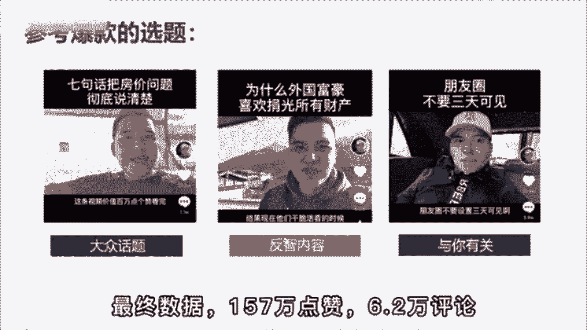

点赞6。2万的评论，那道理是明白了，怎么筛选匹配的话题呢，啊比如说你是做口播知识类账号的，今天呢同时有三个热点，拼多多6万人在线砍价不成功啊，长沙女子洗澡洗罐加没了，第三个。

恒大变卖了5000万资产续命，你会选择哪个选题来做呢，答案是都可以，你今天去说拼多多有多恶心，点赞肯定是过万的，所以说在这里呢啊，这节课后面部分再给大家讲一讲，我们输出作品的一个六个方向，六个方向啊。

我们说讲故事，晒过程，谈特色，教知识，搞活动，尬段子，这个呢基本上是所有行业都通用的，输出作品的六大方向，那其实可以给大家先看几个案例啊，然后再针对不同行业，我们再讲几个不同的选题，还是打开我的手机。

3月份我就开灯了，嗯我们去搜索一下，搜一个做珠宝的，董先生，好我们去搜索一下啊，一个做珠宝的人，那么他在他的这个账号里面啊，他是如何产出内容的，哎我们可以看几个他的视频，然后去总结一下啊。

来首先呢我给你们讲一下，哎首先我看我给你们挑一个什么啊，我们找我们找一个教知识的内容，我们看看董先生的这个作品里面，他有没有教知识，来像这个钻石定制为什么会这么便宜，其实对钻石有了解过的朋友就会知道。

钻石是不分品牌和产地的，定制的钻戒，因为没有品牌溢价的部分，所以比商场里的钻石至少要优惠40%，一点也不夸张，定制的优势在于，每一个钻石都有专业的珠宝鉴定师进行挑选，那么挑选出来的钻石，吴林芳湖南无哈。

甚至于钻石的瑕疵位置都会仔细的挑选，因为钻石的造价成本太高，而且很容易就会被识别出来，所以现在市场上的假货寸步难行，最后我想说的是，电子专柜的好处，无论从任何渠道购买认准证书和cc。

杜绝此品钻石定制为好，那么这个视频我们看完了，其实他这个视频其实就是在交知识，他在说哎为什么定钻石定制这么便宜啊，就越来越多的人悄悄选择了工厂定制，它里面说到了一些啊各种钻石的知识，对不对。

那这个知识不重要哈，但是它的内容方向比较重要，教知识，那可能揭露了一些行业内幕，对不对啊，那是第一个，那么我们再看看他其他的作品都是什么类型的，来再看这个男生，女生都应该知道的七夕礼物含义。

你千万别送错了啊，好这个我们的呃作品就不看完了，我们只看他的标题就知道了，那他这个作品呢是告诉大家，七夕礼物的一个含义，你别送错了，我告诉你七星应该买什么，对不对啊，他这里会给到一个什么购买建议。

对不对，一个需求建议好，这些呢全部都属于交知识这个大的内容领域，对不对，那么我们再接着往下看，来我们再接着往下看，这是一颗8克拉的水滴形粉钻，周边镶嵌的都是顶级的白钻。

那么这一颗粉钻价值大概在四五百万左右，788感觉感觉到我没买，好喜欢吗，赶紧让你老公给你买一个啊，她其实呢也稍微有一点尬段子，这个稍微有点尬段子啊，另外呢他通过展示这个8克拉的粉钻，它在干嘛呀。

他在谈它的产品特色，对不对啊，它有点相结合了段子的这个痕迹呢，不是特别的重啊，但是通过对于这个啊粉钻的一个拍摄，对于粉钻的一个介绍，对不对，他在谈谈他自己的一个产品，直接去展示产品好。

那么我们再接着来看他的作品，还有什么，好其实这个也属于教知识了，也属于教知识了，你会发现他的作品展现形式多种多样，我可以拍我自己，是不是我也可以呢，用这种图片的形式，来再往下看，来看这个。

大家知道钻戒是怎么做出来的吗，今天带大家去我们的工厂去看一下，走，这台机器呢就是3D打印机，那我们设计了这个图纸，经过这个3D打印机将这个模型就可以打出来，那清洗完之后呢，我们再进行最后一步就是电镀。

电镀完之后，这个介质就不容易被氧化掉了，那么整个介质过程就是这样子，学会了吗，好了你注意看他最后一句话了吗，整个戒指的制作过程就是这个样子了，对不对，那么他这个视频内容在干嘛呀，他是不是在晒过程呀。

他在晒他的什么呀，产品的制作过程，对不对，哎那我们刚才说了，他的内容里面晒晒了过程，谈了特色，教了知识，稍微尬了一点段子对不对，那他还有别的吗，我们再来看看，来我们再来看看还有没有别的。

来我们再往下找一找啊，再找一找，看其实你就是可以找到一个比较好的，这样的一个视频，然后呢你自己可以去翻一翻，可以去翻一翻，好还有什么呢，哦随便再点开一个，Hello，大家好，昨天晚上我们开了所有的机房。

都要全人机包，怎么做，律师给你做检测东西，给大家做一个检测，才能给大家发货，大家空去看一下检测有什，这边呢就是我们的一个珠宝检测产品，我们买到的每一件珠宝产品，都要经过都是认识的工作人员。

进行了严格的检测，仪器呢都是调理最先进的仪器，这次大家认识大家都红外交方面技术来检测，这边是大家一定要主动一切的检测，我检测完之后呢，大家可以收到这样一个证书，但这个证书呢是可以在网上查询得到的。

大家可以放心在家等到收到HELO，大家诶，那么大家觉得他这样的一个视频内容，我们看了那么多，他这个视频的内容是在干嘛呀，是在干嘛呀，其实也是在谈特色，对不对，刚才我们讲了，他在谈谈它的产品特色。

现在他在谈他的什么呀啊服务特色，对不对，他有这个证书，然后我们的机器都是特别好的，对不对啊，我们是透明化的，我们给大家看的，这其实也是在谈特色，来我们再看啊，啊其实他之前有谈过一个。

有做过一个产品的故事，给大家找一下啊，钻石定制为什么这么便宜，稍等一下，给大家找一个讲故事的植物，今天有一位重量级的粉丝带来一颗大货走，我们一起去看一下，这个只有10克拉吧，我们镜头拉近一点。

看一下我的天哪，估一下价格200万有吗，不止哦，2万不止，哇哇哇塞，真的好大，有点偏微黄，像一个钻石，没错吧，那你能看得出来他是真的还是假的吗，真假不好说，我去那边看看吧，大车上去看看，家人们。

你能做这个上面显示了一个415吸收风，就代表你这个暂时是没有问题的啊，如果说你这个737，这个地方有一个洗手报告，帮卖完了，有钻石，应该是合成多少钱，买哒哒哒300万啊，1万多花了至少100万，没事。

咱们不差钱，呵呵不差钱不差钱不差钱嗯，好了，是不是它里面还有什么内容啊，啊就是我们说的晒过程啊，谈特色教知识，他还会讲一些客户的故事，对不对，还会有一些粉丝的故事啊。

包括可能说什么呀啊顾客的趣闻等等等等，这些内容都是有的对吧，钻石定制，今天有一位重量来，我们可以看一下啊，啊它里面的作品真的很多，然后类型的也是比较多的啊，如果说你想要去了解的话呢。

你可以多去看一看他的这个呃账号好吧，那我们就先看到这，我们先不看了，那他其中我没有找到那个作品，其中有一个作品呢是给一个粉丝去定制的，这么一个戒指，然后在里面还讲了他的一个客户故事。

就是讲他们俩是怎么从这个啊比较贫穷的时候，然后拼搏到比较有钱的日子，然后受了多少苦啊，依然恩爱如初，像这种客户故事还是比较常见的，好了，那我给它缩小最小化啊，我们先不看了，那我们从这一个账号里。

我们看到了几个内容方向，大体去梳理一下啊，也就是这六个方向出不去这六个方向，所以说呢这是我们给大家总结整理的，如果说当你产出内容没有方向的时候，我们先给你六个大方向，你去讲故事，你去教知识，你去晒过程。

去搞活动，你去谈特色或者是去尬段子，那么每一个大方向下面呢又有几个不同的细分，对不对，那这个表格大家大家如果想了解的话，可以先截一个图，先截一个图，那么啊。

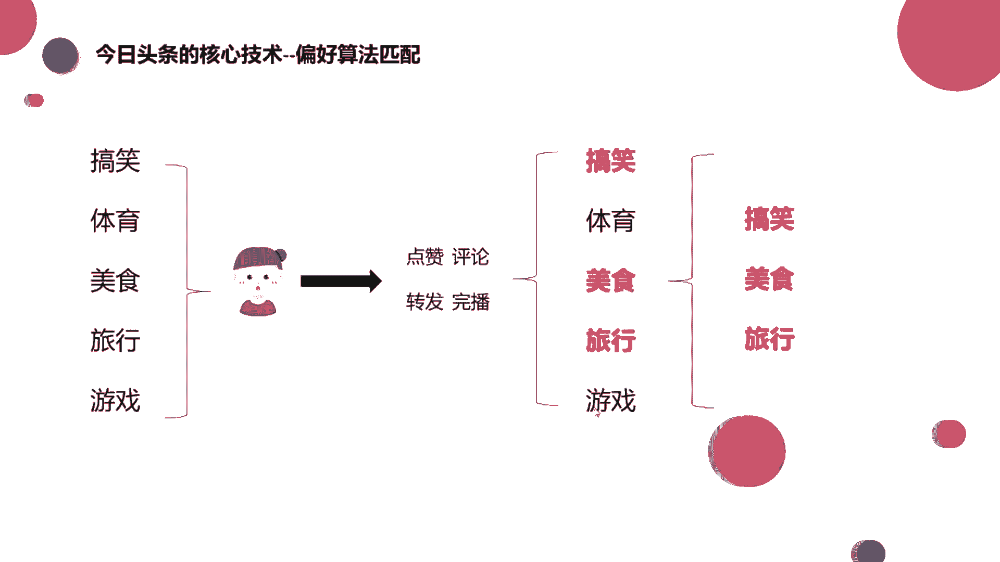

接下来我们来看看一个作品，在抖音上是如何进行分发的。

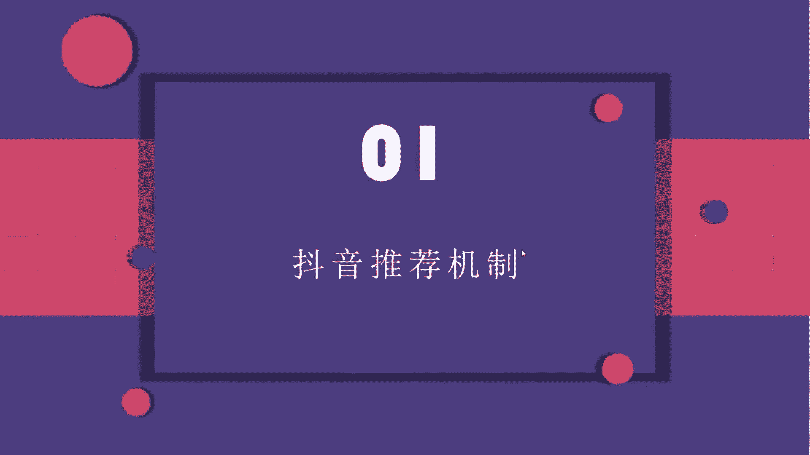

这也就涉及到这个抖音的推荐机制了，我们可以看一下抖音的推荐机制呢，一般我给它分为三个，一个是基础推荐，一个是叠加推荐，一个呢是时间效应，我们一点儿一点儿来看你来，首先我们看到一个作品啊。

他在这个抖音上发出去之后，它是通过一个去中心化的机制，来到第一个流量池，那么这个去中心化的机制是什么意思，就是刚才我说的它是没有任何流量控制的，它的平台是不会给流量倾斜的啊，我们这个叫做去中心化啊。

大家简单理解就好啊，所以说只要你的作品还可以，他审核通过了，你的作品还算比较优质，没有什么大的硬伤，没有违规，那你发出去之后呢，基本上就会来到这个基础流量池，当这个基础流量池里面呢。

会有200~500的一个播放量，画一下啊，基础流量池里就是有200~500的一个量，在这个流量区间内哈，用户会不会对我们的内容产生兴趣，如果说有兴趣的话呢，他就会点赞评论，转发收藏啊等等，对不对。

等这些数据达到一个比较不错的水平之后，那么我们可能有机会进入到下一个流量池，那这个流量池可能啊有500~1000的一个流量，来画一下，500~1000，好这些数据都不是固定的啊。

只是举一个例子来给大家讲，那到了这个流量池之后呢，他会再重复上面的这个步骤，就一个流量池，一个流量池的往前走，那这个呢我们就叫做基础推荐，还有叠加推荐，大家应该能懂吧，其实也是比较简单的。

那么决定是否被推荐进流量池的，这个主要的数据啊，就是这四个，来给大家框一下，像点赞评论转发这个我们就不说了啊，其中有一个呢叫做完播率，大家能看到吧，那么这个完播率是什么意思呢，就是完全播放率。

这个数据呢我们在抖音的后台是看不到的，它是不提供的，给大家简单的举个例子，去理解一下这个数据好吧，那么这个完播率呢，啊就是啊假设你去看这个视频，这个视频呢有50秒，50秒钟，那如果你只看了十秒。

你就划过去了，那这个视频相当于你没有播放它，你只看了1/5，对不对，但如果这个视频它是50秒，你50秒全都看过了，那相当于你的完全播放率就是百分之百，大家能懂吧，能懂吧，一个是25%的完播率。

一个是百分之百的播放率，那哪个更好呢，肯定是百分之百的完播率更好，对不对，所以我们经常给到咱们同学的建议是哈，如果你是刚开始做做这个抖音号，你是新号的话，最好刚开始发的这个视频的时长不要特别长。

可能啊七秒钟往上十几秒钟，20几秒钟就OK了，为什么，因为这样可以提高完播率嘛，如果你下发60秒的时候，你的质量不是特别好，你还没有做到特别顺手的时候，那别人可能就不会把你这个视频看完。

你就会影响到这些数据，影响完数据之后呢，你就进不了下一个流量池，对不对，那这个大家都是能够理解的，那么这些量啊我们把它加在一起统称为互动率，因为转发啊，点赞啊，评论啊啊或者收藏啊。

这些呢都是用户跟我们作品的一个互动，对不对，我们把它统称为叫做互动率，那么这个概率达到多少，才会进行一个流量池的再次推荐呢，啊其实不同领域的互动率呢它是不一样的，我们可以来看一下，我们简单地把领域分为。

分为热门领域和冷门领域，也就是小众领域，其实我们可以看一下哈，像热门领域啊，热门领域有啥有美食，美妆服装，像搞笑啊，旅行种草这些，他对于这个年龄，还有对于职业，对于地域的要求都不是很高。

因为吃的东西人人都吃衣服，每个人都穿搞笑的，谁都爱看，对不对，那像这种呢它就是一个热门领域，也就是一个什么呀啊比较热门的类型，像这种领域呢啊，他的一个互动率达到8%到10%，就是比较好的一个互动率了啊。

大家知道互动率怎么算吗，啊比如说我算那个点赞，点赞量除以播放量，他得到的是一个点赞率，这就是我们的互动率或者评论量啊，除以我们的播放量，得到的也是一个评论率，大家能懂吧，啊小学数学哈啊非常简单。

那这个是热门领域，那小众领域也就是冷门的领域哈，它对于这个地域或者是男性女性啊，包括说这个年龄职业的要求就比较高了啊，呀或者是推送给一些有需求的人，比如说像搞笑的，他没有需求，他也可以看，对不对啊。

但是你说像婚纱摄影，家具装修的，他可能有兴趣了才会去关注到这里是吧，那像小众领域给大家列举到的有三农健身，新媒体营销，像婚纱摄影，家具装修等等，还有很多哈，还有很多，那这个小众领域的互动率呢。

大概达到3%到5%，也就差不多了，大家知道，所以这个数据呢它不是具体的，没有具体要根据你做的这个垂直领域去判断啊，当然垂直领域也分为几级哈，一会给大家再看一下，好吧，这就是我们说的啊，奇数推荐。

还有一个叠加推荐啊，再来看一下这个图，基本上都很容易理解，要用理解，那么除了基础推荐和叠加推荐之外呢，它的推荐机制里还有一个叫做时间效应，来在这里来框一下这一部分，大家知道。

就是刚才我们看到的基础推荐和叠加推荐，那个示意图，那么这一块啊是我们第三个推荐机制里面的，叫做时间效应，那么什么是时间效应啊，我举个例子呃，不知道同学们有没有遇到过啊，咱们发布了一个视频之后。

哎你发布之后的当天或者第二天，他没有被推荐或者是推荐的比较少，他观看的播放量比较少，但是可能过了一个周之后，哎你发现它的播放量就上涨了，甚至它能持续一个月，是不是啊，确实它能持续一个月啊。

甚至到了一个月两个月之后，你发现原先发过的视频，它的播放量上涨了，这是为什么，这其实就是时间效应的原因哈，啊为什么，我们来看一下，你像这里有一个视频库，那么其实啊抖音他会把他自己的作品。

就是把我们的作品放在他自己的视频库里，那抖音这么多用户，只要你把视频发出去，那这个视频就存在于他的视频库里面，你就说所有的视频都在这里边儿，都在这里边儿，那如果说啊就是这个时候啊，我第一天发出去之后。

哎我的这个视频也没有蹭到什么热点，那内容也不算特别优质，可能我们就在视频库里就呆着了，那等到有一天等到有一天啊啊，这个时候可能有一些热点出现了，正好我的视频比较符合。

那他就会从他的视频库中去找一些原有的库存，去再进行一次二次推荐，大家能懂吧，啊我举个例子哈，那比如说就是嗯比如说李小璐，李小璐吧，比如说你特别喜欢李小璐，你发的视频就是李小璐的视频哦。

但是今天你发现他没有火，但是过了一段时间之后啊，你发现诶李小璐可能又因为卖衣服啦，或者跟贾乃亮有什么样的绯闻啦，然后他这个时候热度上去了，你就发现你的那个视频呢，可能跟着这个热度也上去了，对不对。

也进行了一次二次推荐，也又走了一遍这个流程，这个是有可能的，那么像这个时间效应呢源自于抖音啊，什么抖音源自于贴吧上，最开始的一个概念叫做挖坟，叫我拉粉，其实就是通过算法发现热点。

再重新去视频库里寻找一些原有的库存，再次提取到合适的内容，进行一个流量池的推荐啊，这个也是比较容易理解，所以说同学们，如果今天啊你非常用心的去做视频，按老师说的，可能每个步骤的都有了，你可以多关注。

多引导他再次被推荐的几率比较大，那么这里我也要再强调一点哈，这种这种机制啊，时间效应的机制呢只是专属于抖音这个平台的，大家知道除了抖音这个短视频平台之外，还有快手也是属于短视频平台，对不对。

他们俩在这一点上区别还是比较大的，那么快手啊，他的推荐机制叫做择新去旧机制，择新去旧，什么是择心去旧机制哈，其实就是啊我会推荐新的视频，旧的视频发出去一周啊，甚至一个月之后呢，我就不会再推荐了。

不论这个时候发生了什么热点，我都不会再去推荐旧的视频，大家能懂吧，所以这个呢是啊，快手和抖音比较大的一个机制上的差别好吧，抖音的叫时间效应，快手上的叫择新去旧，哎大家可以稍微记一下好吧。

怎么才能够达到这种引流的效果，哎销售的效果，那我们可能以销售的思维我们去做的话，啊啊你会怎么做，比销售的思维去想，取决于客户的需求是吧，哎没错哈，我们马上就要讲到了，那取决于客户的需求。

那我们怎么才能想到客户的需求呢，其实大家想一下，我们以销售的思维去做，我们想到大家喜欢啥用啥，那我们这些技巧，我们这些话术呢，你想单纯用销售的思维去想的话，我们可能会说我是医美，我能让你变美。

你来到我的机构之后，我让你变成有一个蜕变，我们这里的就是这个医生特别的专业，特别的权威，那或者说我这本书特别好，只需要59块钱，今天是七夕节，我还降了十块钱，你买吧，特别优惠。

唉但是这样的内容他在淘宝上是可以的，我们说在抖音上是不可以的，为啥呀，为啥呀，大家喜欢啥用啥，市场调研没错，市场调研也是能够帮助我们去完成商业定位的，那么商业定位完了之后，我们就要再深入的去想了。

我们要做内容对吧，应该先是自己拥有资源，然后想客户的需求，最后想怎么用自身的需求啊没错，所以我们第一步才是做的商业定位，对不对啊，首先啊我们自己拥有的一个子资源，要么就是你自己有产品。

要么就是你自己有电，要么呢就是你的标签里面有你特别擅长的领域，特别特殊的领域，对不对，然后我们现在在想了，我们怎么才能抓住用户的心，让他买你的东西，让他能够引流到你的线下来，亮点不够哈啊。

因为淘宝和抖音它有一个实质性的区别，我们说淘宝是电商平台，而抖音是一个娱乐平台，是不是，但凡你打开淘宝，就是因为你有什么的需求啊，购物的需求，或者是你做好了花钱的准备对吧。

所以在这个时候他怎么给你销营销啊，他他告诉你59块钱，现在七夕节还降十块，还打五折，你一看便宜啊，你就买了，对不对，但是抖音它是一个娱乐软件，你本来是去抖音找乐子的，是不是唉老娘图开心的。

这个时候有人给你推销了，你是不是还挺烦的，就稍微有点烦是吧，你即使再便宜，关我什么事，我来是为了要干嘛的，我是为了娱乐的，那你老是跟我说，这个打折那个打折我不想要，对不对，所以我们要站在用户的角度上哦。

刚才我也讲了，互联网思维有九大思维，我们先不管其他的八个思维是什么，而且现在市面上啊，总是会流传出各种各样可能12大思维啊，各种这思维，那思维就是很多概念派的东西出现了，但是我们可以不用管其他的啊。

我们永远记住，第一个是用户思维，永远都要想用户他喜欢什么嗯，我给大家举个例子好吧，就比如说我们肯定学习了拍摄剪辑，对不对，你们也学习了这种灯光打光的知识了吧，你们学了没有啊，我假设你们学了。

比如说你们学会了之后啊，学的特别好了，我想要把这个知识呢分享到抖音上，目的呢哦就是为了我要教别人这个知识，让别人也付费也付费买我的知识好吧，那么我假设这个可能呃，视频中可能你有五个知识点。

这五个知识点呢就是讲什么啊，小小老师讲的是吧啊，那我不知道你们学了什么灯光啊，我我也并没有像小老师那么专业，我随便讲几个，而测光怎么打，打了有什么效果，底光怎么打，打了有什么效果，蝴蝶光怎么打。

打了有什么效果，还有轮廓光怎么打，打了有什么效果啊，是不是我们可能一个视频里有这四五个知识点，那么如果是你们把这个知识分享到抖音上，你们会怎么讲，或者说你们会按照什么顺序讲，是不是随便想到哪个讲哪个。

按测光我们怎么打，它可以让视频更清晰，那底光我们这样打，它可以让这个画面更恐怖，那蝴蝶光这么打，可以让我们整个人更美丽，我们是不是按照随机的顺序，就把这几种光的知识给讲完了，你可以想一下。

你们是不是会这样讲，然后啊你可能这样讲完之后我发出去，我要起个标题嘛，那你的标题会怎么讲，或者说卷心菜今天教你三种打光方式啊，非常有用，赶紧收藏，你会这样起标题吗，大家可以就是真的去思考一下。

是不是真的思考一下，我们总说啊，不会是吧，那你们会怎么样怎么样去完成这个视频呢，怎么样取这个标题呢，是这个东西都是需要思考的，我们真的在说用户他到底想看什么，用户他到底需要什么，那你就要具体到你的视频。

即使你的视频只有七秒钟，只有八秒钟，你也要考虑到每一秒钟，你的用户看完之后有什么样的反应，是不是，那比如说刚才我讲到测光底光蝴蝶光，对不对，那大家可以想一下，测光人人必会的三个打光神技啊。

好我一会再讲这个标题的事啊，大家可以想一下，比如说测光，我打我可能让视频可以更清晰，底光我打我能够更害怕，唉其实我看了之后，我觉得哦好像是这个样子哦，还有点用啊，还行吧，然后最后我讲的蝴蝶光怎么打啊。

可以让女生更漂亮，对不对，更漂亮这个东西呢是利益，而底光打更恐怖，只是一个效果，大家能懂吧，所以你在展示给用户的时候啊，你要想一下怎么样才能吸引到他们啊，比如说这几种打光方式，我可能会把蝴蝶光怎么打。

有什么效果放在第一个，我们女生更漂亮，可以把她的轮廓给打出来，对不对，因为我第一第一第一个就是前面几秒的时候，我好像给别人获得利益的感觉了，对那么其他的几个你可能只是单纯的教它哦，这个工具是这么用的。

用了之后能有这种效果，对吧，所以说我们可能把更吸引人的哎，或者说能让别人有这种利益获得感的放在前面，是不是，然后再讲到标题这个事情啊，标题这个事情是什么啊，就是人人必会的三个打光神技，有同学说了。

对不对，那或者说啊教你三种打光方式，但是其实啊这种打光神技打光方式，那那别人会想看吗，哎你打光关我啥事，对不对，关我啥事就让我没有利益获得感，那你可以说什么啊，卷心菜教你能把姑娘变漂亮的打光方式。

那这样的话啊，这个就是有一种利益获得感的标题，那当然我只是举了一个简单的例子，好吧啊，当然具体每个光啊到底打出来有什么效果啊，是不是光要叠加着使用啊，我也不太清楚哈，这个你们肯定是更了解的，对不对。

所以说每一秒都要考虑用户，我们看到之后他是一个什么样子的反应，飞鱼哈喽，如果你是因为这个视频的标题点进来的，那不要划走，因为这不是一个标题党的视频，那我就是要分享一个最近特别火的创作方向。

那就是动漫短视频，这是一个近期抖音的扶持方向，你肯定刷过这样的视频，我这个月零花钱花冒了，那个你给我支点吧，从下个月零花钱，其实啊这是抖音的一个轻漫计划，3。0，你可以在抖音的热点榜上可以看到。

轻漫计划总是在话题总榜的前十，可见抖音对他的扶持力度是多么的大，这种视频呢，其实是以轻松搞笑的动漫形式来展现生活，工作中的一些趣事，非常受年轻人的喜欢，所以说他的点赞和涨粉是非常的厉害的。

那么接下来我将给大家讲解一下，这类视频的制作方法以及变现方式，其实这种视频制作非常简单，因为它的场景比较单一，主要是以对话的形式，你简单的把几个场景给做好，那么加上对话就可以了，下面我给大家演示一下。

大家可以点赞收藏好，那视频的最后评论区扣，感谢分享，我也会分享一份自媒体的变现教程给你们，夫妻对话视频其实非常简单，不用露脸，不用拍摄，一部手机就能搞定。

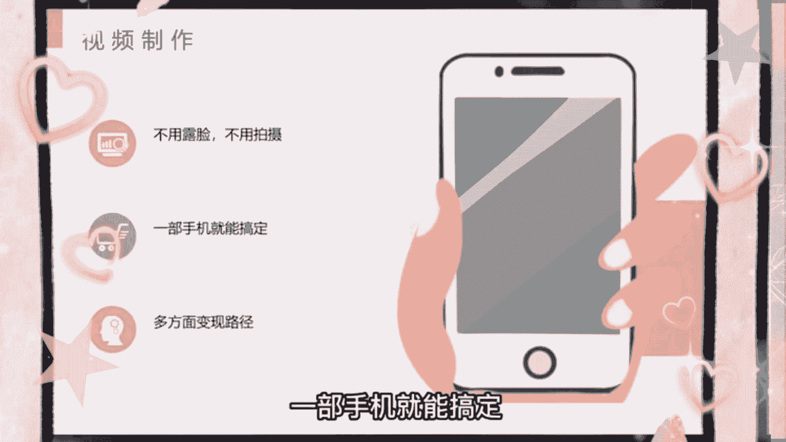

我们只需要打开这款软件，点击动画视频，先选择尺寸。

记得如果是参加中视频的，要选择16比九，再选择卧室场景，点击创建，再选择角色。

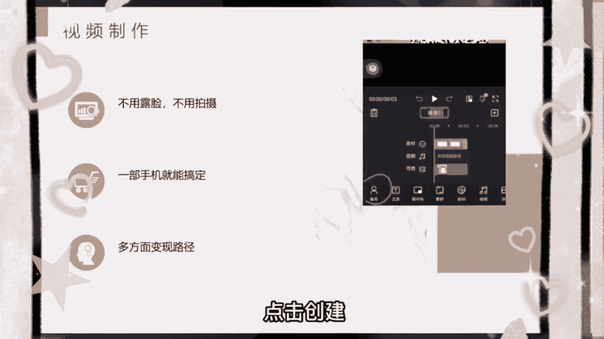

这里有很多角色类型，我们做夫妻视频就选择夫妻动作，表情都很真实到位。

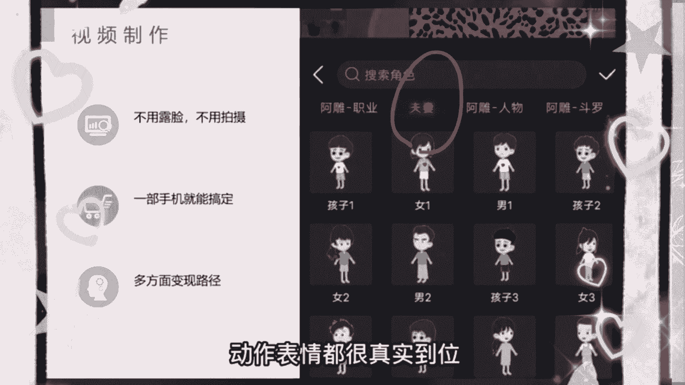

选择好之后添加文字，最后添加合适的音乐，我们一起来看一下效果吧，进来说，不谈钱的感情是真感情，谈钱的不要也罢，哼那你就去买个充气的吧，那现实生活中啥不需要钱，简单吧，目前这种动画流量真的大。

上手之后一天就能产出十几条作品，而且这种视频可以说是全平台通吃，直接发布到各个平台吃收益，那制作没问题了，文案从哪里来呢，如果自己不会写文案的话，最好的方式就是借鉴同行。

直接把他们的爆款文案稍微修改一下，或者直接去某宝搜索搞笑对话，几块钱就能买到几千上万份，这种夫妻对话视频，虽然是一个很好产出感情的呈现方式，但是大家不要因此被局限了，完全可以贯穿到商业故事，育儿知识。

人文历史等等，目前我还很少看到，有人用这种动画形式来阐述这些知识的，说不定会有奇效，那最后就是大家最关心的变现问题，首当其冲的肯定就是中视频计划，播放越多，收益越高，这种夫妻对话视频大家都很喜欢。

很容易出爆款，第二就是橱窗带货，这种视频吸引的女性粉丝偏多，可以带一些家具类的生活用品。

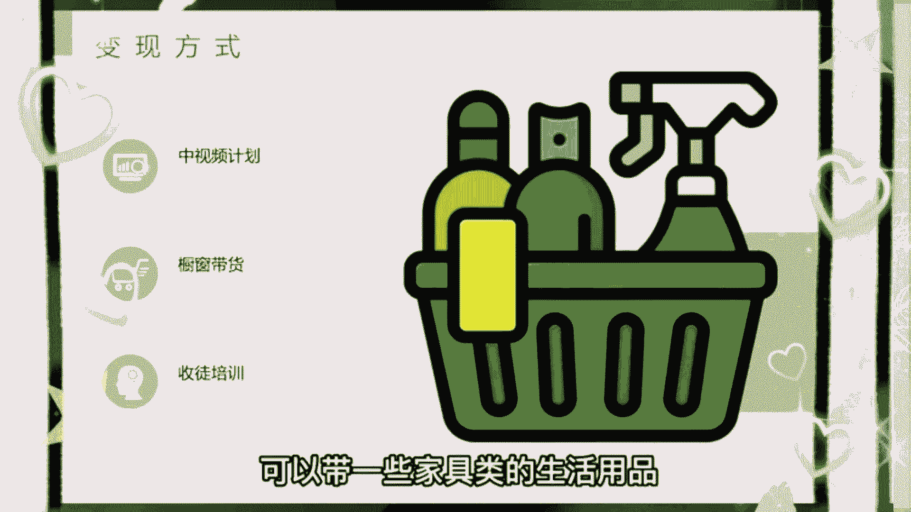

也是很不错的选择，第三就是收徒培训，我打听了一下外面培训的价格，从大几百到一两千的都有，只要你的账号做起来了，有很多人会主动找你学习，其实这种账号变现还是挺灵活的，完全可以根据你账号定位。

来衍生更多的变现方式，比如你是讲育儿知识的，你可以带一些儿童用品玩具，或者在私域搞儿童培训服务等等，最后这款动画制作工具在这里直接说不太方便，有打广告的嫌疑，我发现一个很恶心的方法。

让中视频快速的突破10万的播放量，注意说的是10万的播放量不是1万，很多知识博主其实不是特别愿意分享这个方法，真的是秒杀了很多几千上万的课程，我找了12个粉丝做测试，领粉丝的账号，一周不到的时间。

播放量都达到了10万，20万甚至30万，快速的通过了中视频1万7播放量的门槛，一条视频呢也拿到了几百几千的视频稿费，咱们直接上干货，相当于直接给答案，记得点赞收藏，首先呢打开抖音搜索创作者服务中心。

打开全部分类点，创作灵感，选择创作热点，找到自己的领域，你想做的内容方向的也都在里边，时间选择近七天往下拉，看热门视频，选择低粉爆款，找到你同行最新发布的十个爆款作品，借鉴文案替换素材，然后去做视频。

少则三五条，多则十条必出一到两条的爆款视频，低粉爆款视频就是没有粉丝的账号，一条视频突然就火了。

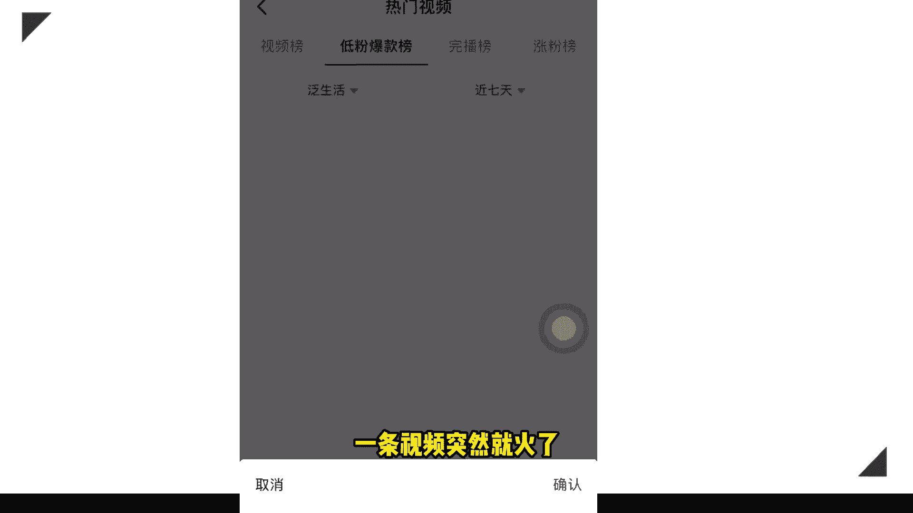

说明这个视频大家是真的喜欢，按照我说的方法改编模仿去操作就行了，记住视频间隔一天发一条，那如果你对中视频有什么不懂的地方，我也准备了直播教程领取了，大家不要觉得麻烦，因为很多东西视频里面实在是讲不了。

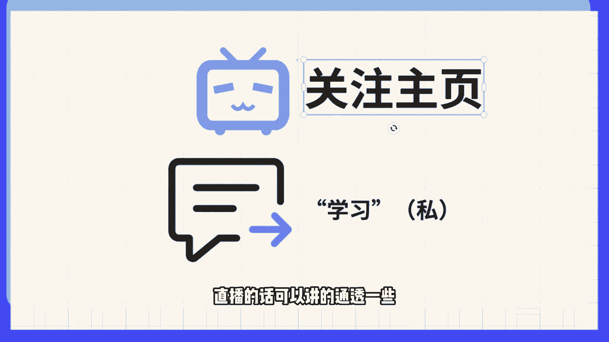