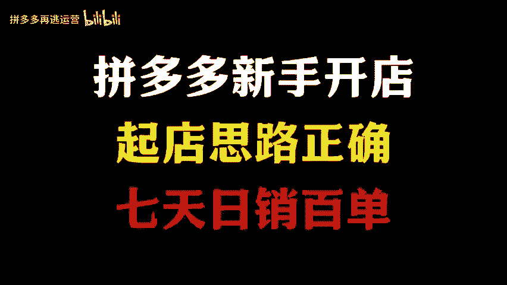
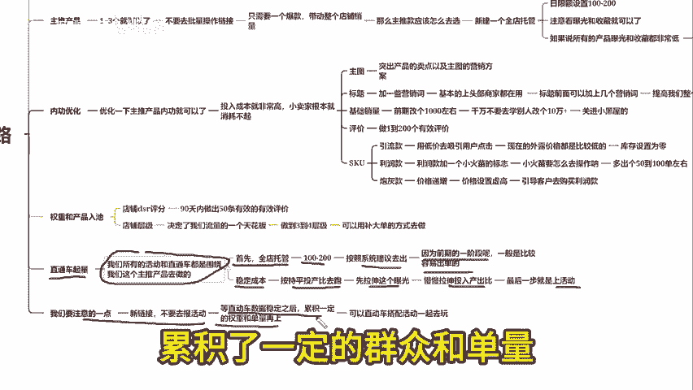

# 很多拼多多新手开店没有订单没有流量，不知道怎么去操作没有思路。今天告诉你一个思路，让你七天日销百单 - P1 - 拼多多再逃运营 - BV1ZZyKYYE93

现在各拼多店铺其实起舰说难不难，很多的新手商家上架之后把链接丢到直通车里面去推广，根本没有一个完整的运营思路。今天给大家分享一个完整的起舰方法和思路，方便大家知道怎么去操作。如果看完这个视频。

还有什么不懂的，我也准备了各个类目的实操文档评论区自取。首先第一步就是我们要上架的产品，一般10到20个就可以了。最好是用同一个类目的产品上架。因为拼多多现在是讲究一个人群标均，人群标均越精准。

后面的转化率才会越来越高。那么我们上架完成之后就可以进行一个产品的破零，可以去找亲朋好友下个几单就可以了。因为我们店铺会有一个隐藏的数据，那就是我们的群店的一个动销率，比如说你上架了10个产品链接。

只有一个产品链接进行了破零，那你的群店动销率只有10%。在拼多多只要是你的动销率越高，系统给到了扶持流量也会越来越多。也就是说，我们常说的一个自然流量。

第二步可以在上架了几个产品里面呢选出店铺的主推产品，一般1到3个就可以了，不要去批量操作链接，这样可以节省我们店铺的一个试错成本，少花很多冤枉钱，只要有一个爆款，它就能带动整个店铺的销量。

那么主推款应该怎么去选很简单的。😊。

你可以去新建一个全店托管日信盒设置100到200，然后跑2000左右就可以了。在这两天之后选出产品中曝光以及收藏量最多的一个链接。主推广不能单纯只靠单量的，一定要注意看曝光和收藏就可以了。

如果说所有的产品曝光和收藏都非常低。那就是重复我们的第一波操作，我们再去上架10到20个产品链接，然后再去重新选一个主推产品，选出之后就可以开始第三步了。第三步内功优化。

那么这个地方只需要去优化一下主推产品内功就可以了。因为你每一个链接都去做内功的话，投入成本就非常高小卖家根本消耗不起。那内功的话，主要分为5个部分主题标题SK布局，还有基础销量和评价。

首先我们主图一定要去突出产品的卖点以及主图的营销方案。如果不会做，可以去参考同行的去修改同行就是我们最好的一个老师，那么包括标题也是可以加一些营销池的，基本上的头部商家都在用标题前面可以加上几个营销词。

可以提高我们整个产品的顶级率，那么初始销量的话，我们可以去适当的修改一下。比如说前期改个1000左右，我们千万不要去学别人改个10万家或者说100万家。这种的话，系统很快就能够察觉到，并且把你的商景。

😊，小黑屋的至于评价，我们改完销量之后，做到1到200个有效评价就好了。那么SKU的话，主要是去做一个引流款炮灰款，还有一个利润款引流款的话就是用低价去吸引用户点击。

大家都知道拼多多现在的外漏价格都是非常低的，我们可以直接把引流款的库存设置为0，让客户不能够去下单，后再给利润款加上一个小火苗的标志小火苗要怎么去操作呢？

你只需要把利润款的SKU和其他的SKU多出个50到100单左右就可以了，可以找云做一下，只要是能增加单量的都是可以的怎么办都行。

那炮灰款的话就是起到一个价格递增的作用价格可以设置虚构让客户觉得利润款的SKU会比较划算一点，引导客户去购买利润款的就行了。

然后到了第四步怎么提升产品的群众和产品的路这个地方主要就是两个第一个就是店铺的DR评分这个需要我们店铺90天内做出50条有效的评价。第二个就是一个店铺层级店铺层它决定了我们流量的一个天花。

前期我们新店铺做到3到4成级就可以了可以用补大单的方式去做当你的一个层级和DSR都做出来后就可以进行到第五步了。第五步利用我们的一个直通车去洗量。😊，从这里开始。

我们所有的活动和直通车都是围绕我们这个主推产品去做的。首先先去打开全面托管，设置100到200的出价。按照系统建议去做。因为前期的一阶段呢一般是比较容易出单的。很多人遇到第二阶段呢，基本上就跑不动了。

这个时候呢我们就可以转稳定成本去里面跑数据，稳定成本就是按我们的持品投产比去跑，先拉伸这个曝光。当稳定成本能够跑到持频了，就可以慢慢去拉伸这个投入产出比。最后一步就是上活动。

我们这里要注意的一点是我们的新链接，不要直接去报活动，一定要等到我们的直通车数据稳定之后，累积了一定的群众和单量，我们再去上，也是可以直通车搭配活动一起去玩。这样起降会更快。😊。

