# 微信公众号运营视频全套 手撕运营 拳拳到肉 - P10：1.04-自定义菜单~2 - 达妹_达内教育 - BV1UvvvebEdT

最多几个5个。那我现在从下往上去更改资金财单的名字。就比如说这是什么？推送。图文哎，你看如果这个要推送图文的话，我应该怎么办？是不是你看我从素材库里去选择一篇文章。

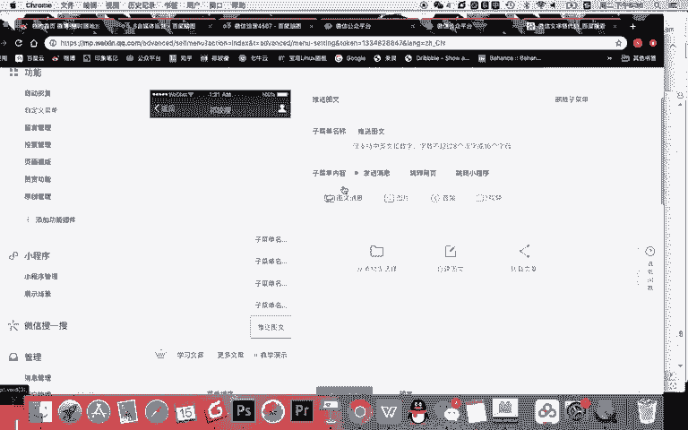

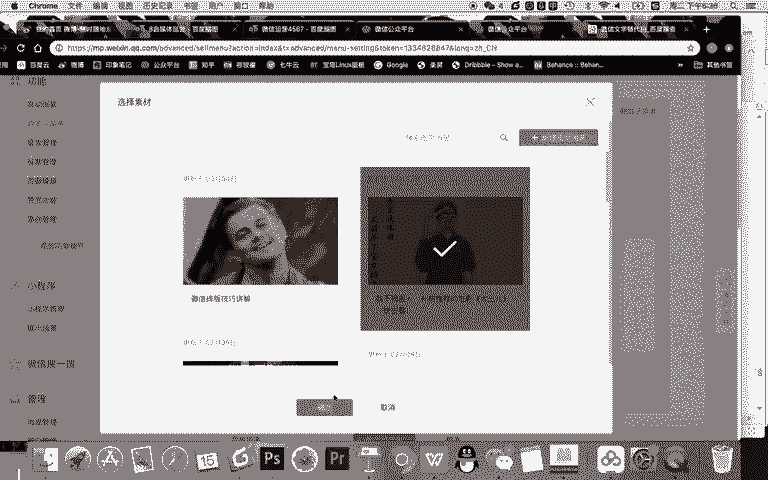

然后呢，这里就是一个推送图文了。在这里呢，我当然还可以推送什么去看到图片啊，声音视频都可以啊。素材库那一样我就不去做了。那跳转网页这里我让他跳转什么是么，我就让它跳转。或者叫直接访问。文章。

我如果让他访问文章的话，就是我从公众号以群发这里选择一篇文章，能直接访问一篇文章。当然这个我就改他看成什么。

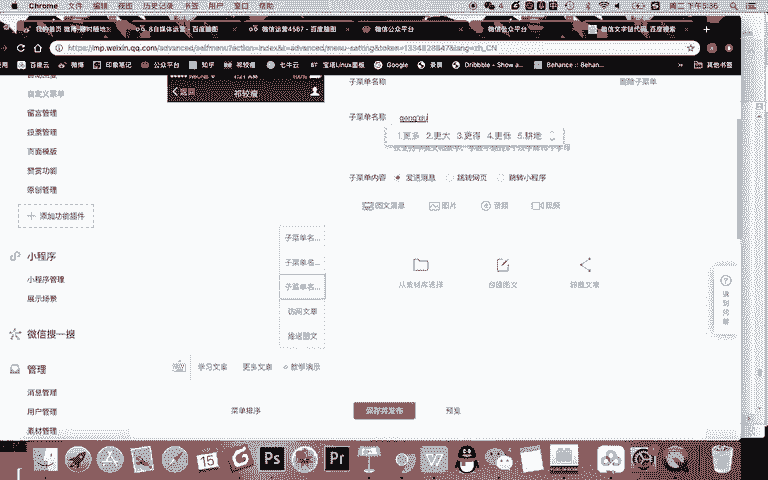

更多文章如果是更多文章，我应该跳哪？对，刚刚有听懂的话，你这道就会跳转到历史消息。对吧他就能直接一去就能去到历史消息，看到我所有的文章去上下翻页就能看到。

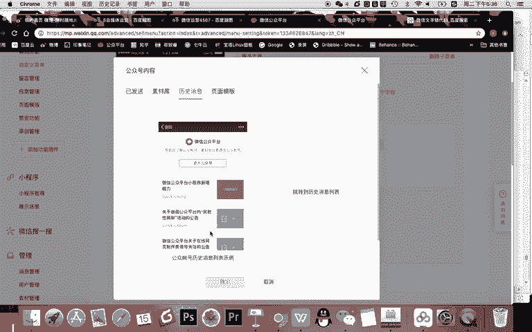

对吧然后有共同文章，还有什么还可以看到？She。页面模板。

页面模板呢同样也在这个里面，你看我有多个页面模板，然后我就直接点确认就访问了。那现在最后一个还有是跳转什么？比如说我可以推送图片，对吧？跳转网页这里还有什么吗？其实还有一个素材库，所谓的素材库就是。

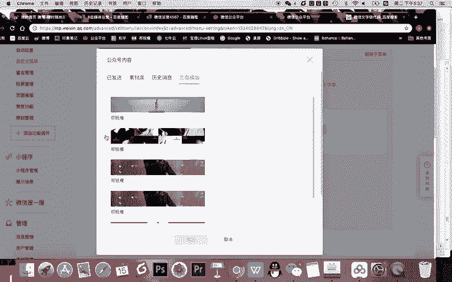

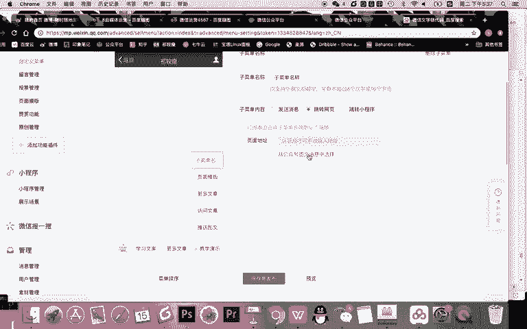

你编辑了但没有发布过的文章。比如说这篇文章是一个草稿，我点确认OK那这个时候他去的就什么？

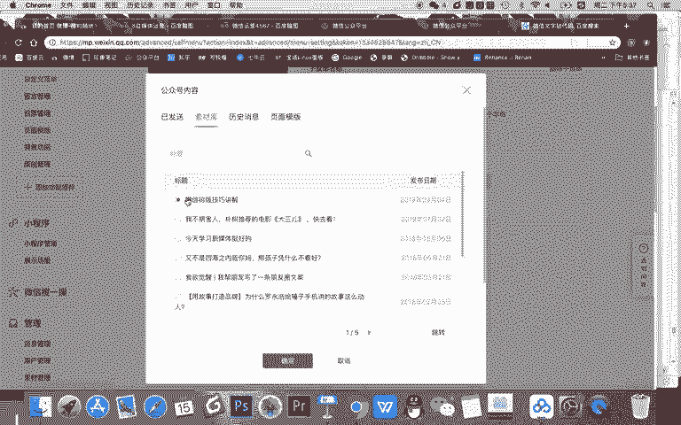

Yeah。什么呀。文章这是什么文章？没发布的文章，但注意大家看现在字数不能超过8个汉字了。我告诉你一级菜单只能4个字，这里能8个，但千万不要写这么多是吧？你可以写什么？草稿文章，这是我给你演示嘛。

O约等于大家看啊，现在在一个二级菜单里，我现在有5个菜单，每个菜单访问的都不一样。这里一点击收到了一篇图文，这里一点击访问的是这篇文章，打开后的页面，直接看到文章就不用收到图文了。

这里点击看到的是历史消息，这里点击是页面模板。在这里呢你看到的是没有发布过的一篇什么呀？素材库的一篇草稿的文章。OK这就是自定菜单设置。那设置之后呢，你一定要怎样点击保存并发布。然后你看啊。

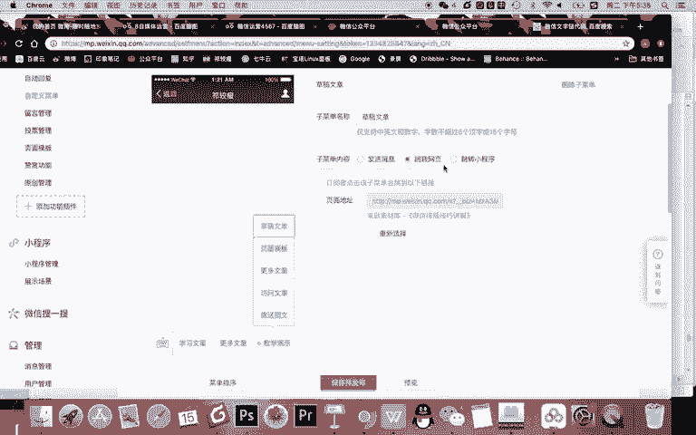

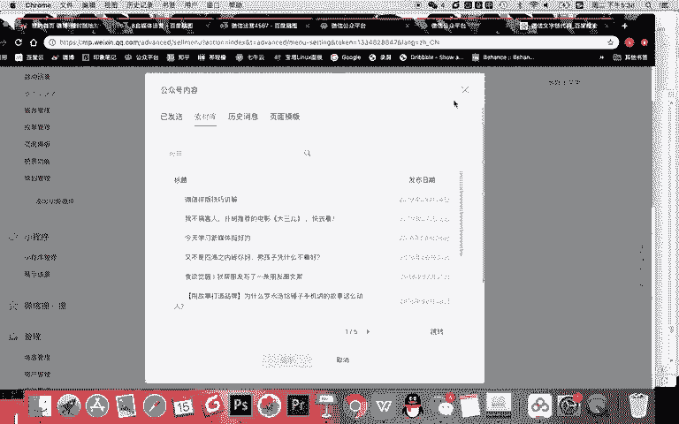

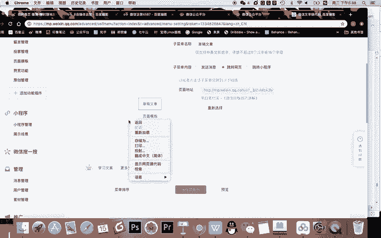

它会在24小时内对所有用户生效，然后去能看到效果。那我告诉你，其实我们作为新媒体运营人员，我们设置好之后一定要看效果，有什么什么有什么办法快速的看吗？很简单，发布之后，你自己手机取消关注你自己。然后呢。

你再去重新关注一遍，再去进入这个里面，看到的就是这样一些内容了。OK以上呢就是自定义菜单的操作设置的方法。你说现在我不想要整个的所有内容，我要删除它，很简单。删除，然后在这里就学习文案，更多文章。

这两个我点击保存发布。那么。

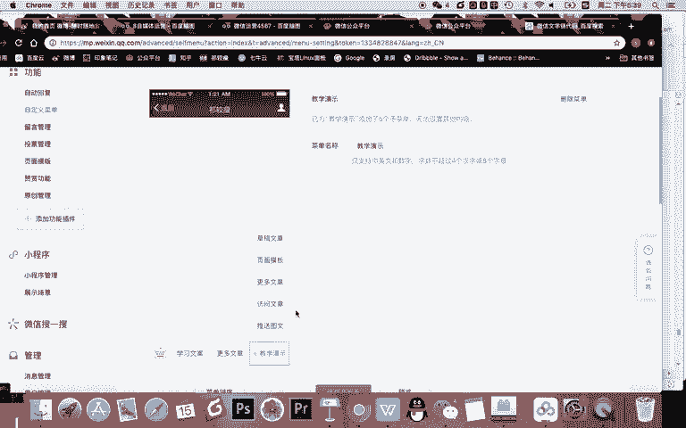

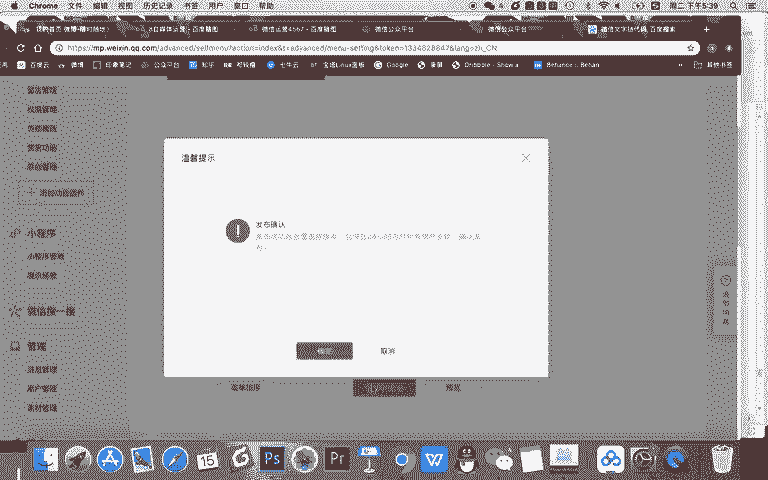

当。我的粉丝去到我的公众号，看到这下面只有两个菜单，一个是去用完一个更多网章，他就可以去一点收到了一张图片，可以来询文。还有呢一点可以看到历史消息的文章。OK自定义菜单的设置啊，操作是比较简单的。

现在有一个比较难的知识点。

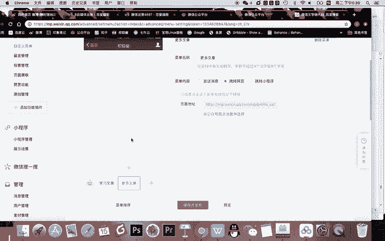

嗯。第二点。自定义菜单的规划。什么是自行菜能规划，也就是什么？也就是。自定义菜单。放什么？内容。而且这个放什么内容是什么决定啊？企业。最些菜单放什么内容？为什么这样讲呢？因为你首先看啊。

如果是我的公众号就很简单了。我是一个自媒体。

秦教授嘛，我写就文章。我就让他看文章就行了是吧？我有课程，我就是我就卖课程，我让他去买课就可以了。但是如果是一家企业，他的资金菜单不能这么随意，他应该怎么放呢？你应该这样思考第一。

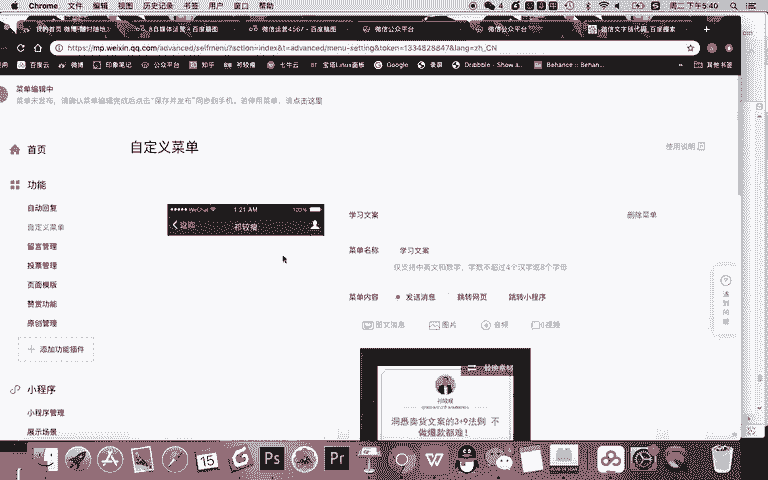

企业。微网站。展示的内容。什么意思？自定义。菜单约等于。什么公司的微信平台的。看。那么你要思考的就是网站或者叫公司网站应该放。什么内容？自定义。菜单。就应该。常规来说，比如会有第一种企业。比如说。

什么呀。传统行业。什么呀线下。产品。销售型的。小公司，比如。举个例子，卖。什么呀。卖比如说器械的。卖什么器械呢？比如医疗器械。O。或者说卖各种就是施工类的一些器械的。这样一个公司，他也做了新媒体。

他也希望通过微信去为他的企业提供一些服务。那么你认为他的增定菜能应该怎么设置？

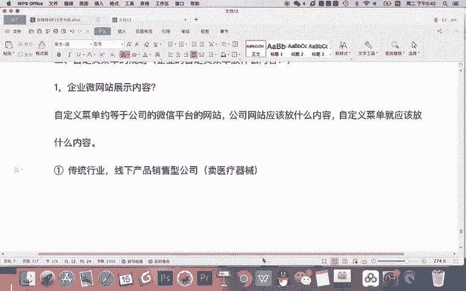

在这里呢我给大家去展示一个图啊，大家可以看一下这样去规划。Yeah。比如。在这里呢我们规划3个。一起菜单。然后呢，再分别二级菜单。比如我们做小一点。对吧规划4个吧。ok。那么。这总共。哎。

我们看一下对齐一下啊，假如对齐了。这么多的内容。假如我们都需要去规划好，那么一级菜单应该放什么？二级菜单放什么？

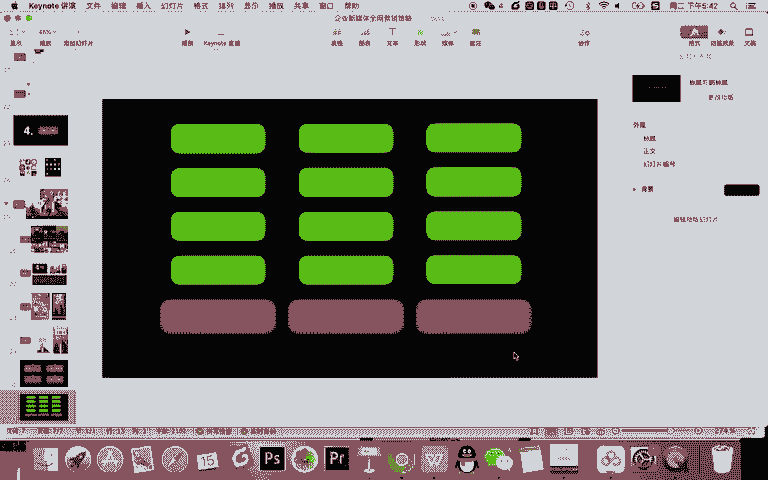

首先从逻辑上来说，如果是一家企业的话，我们应该考虑的是。

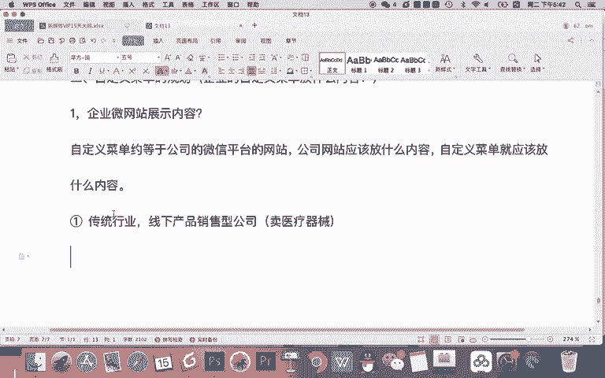

第一步，一级菜单放什么？如公司的网站，你认为第一步应该放什么内容啊？我认为比如说首先得有么。Yeah。公司的。介绍。对不对？然后呢，作为一家医疗器械传统企业还得有。产品介绍。还有没有？比如说第三个。

你认为可以有什么？第一类是公司相关的一些介绍。第二是产品相关。第三类了。还有什么还有没有？比如说你开始什么。你可以看到在线。商城是不是可以，这是销售类了。如果没有销售类，还有什么？

联系我们直接联系我们没有什么呀。没有什么乱七八糟的二级菜单，这一点联系我们能给我们打电话去了一篇文章，看到有电话，还有邮箱，甚至还有地址，是不是都可以，对吧？这是一般类型的一个企业。那公司介绍。

如果作为传统企业类型，可以去介绍什么内容？首先。公司简介的有吧。比如说你可以规划1个H5简介去介绍你们的公司。然后呢，公司介绍有相关还有什么介绍？常规来说，一个企业会不会有，比如说成功。案例是吧。

或者说什么。企业荣誉荣誉啊。有你们公司了解你们是谁了，你们做的怎么样？还有呢？当然还可以像写什么呀，行业案例或者说。成功案例展示一下你们做过什么事儿啊，做的怎么样，还有没有公司介绍？还有没有？

还可以发什么？比如说你还可以写什么？很简单，媒体报道都可以，对吧？就是通过公司介绍，从简介来说，荣誉也好，还有你们的产品展示啊，包括陈万丽的展示嘛，媒体报道就是突出让用户知道你是谁，你们做的怎么样。

然后产品介绍这里就可以介绍多个产品。那怎么介绍多个产品呢？比如说。你可以最新。那我告诉大家一个逻辑啊，首先一级菜单从左到右这个最重要。其次这个呢再其次。然后二级菜单是从上到下的重要程度。

重要的内容先放上面，基本的内容先放上面，然后从上到下。那作为产品介绍。

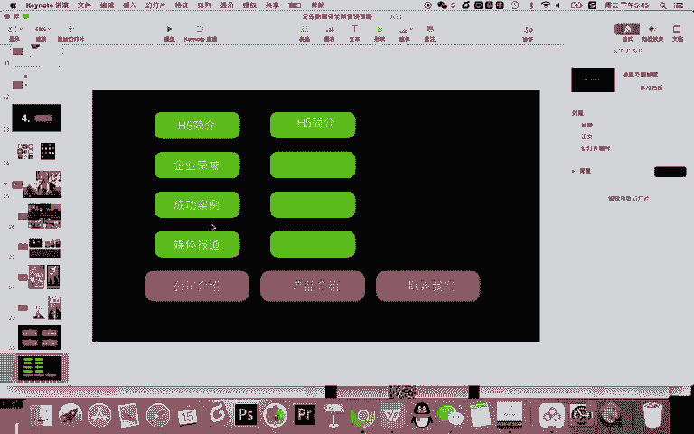