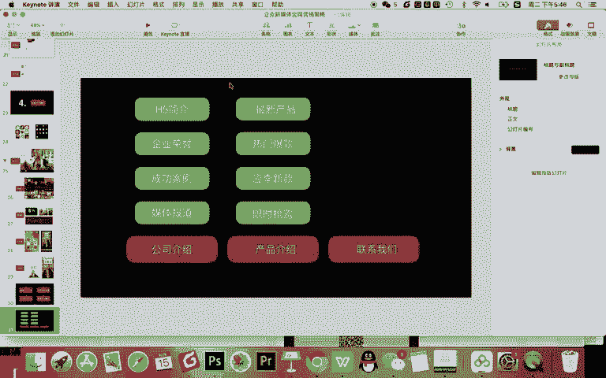
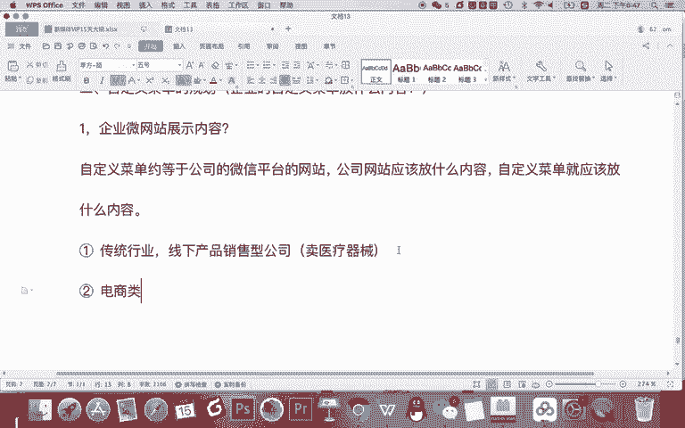
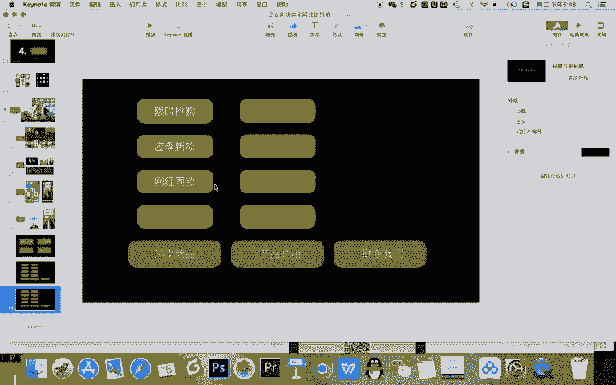
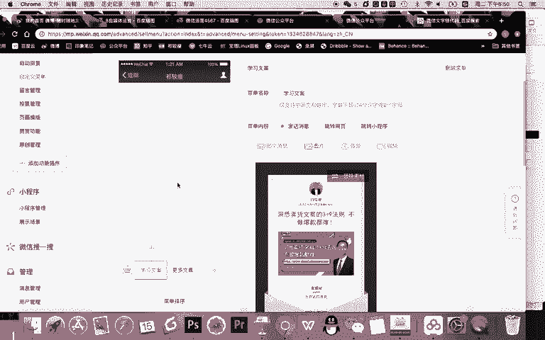
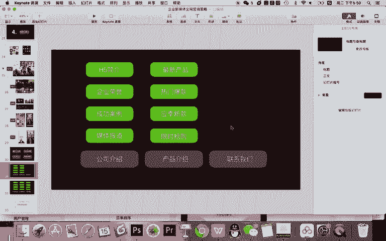
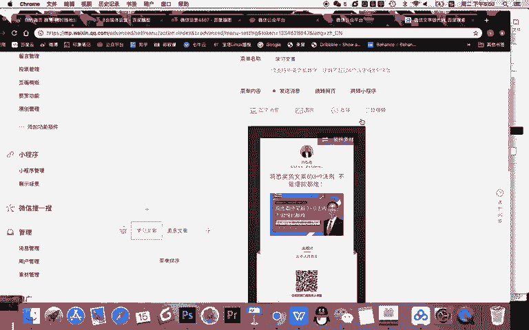
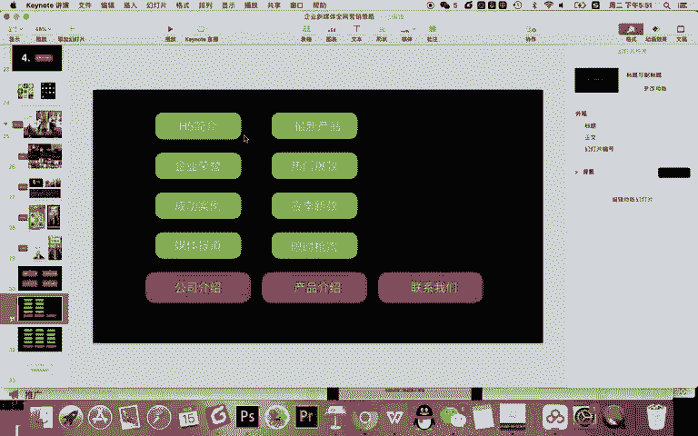
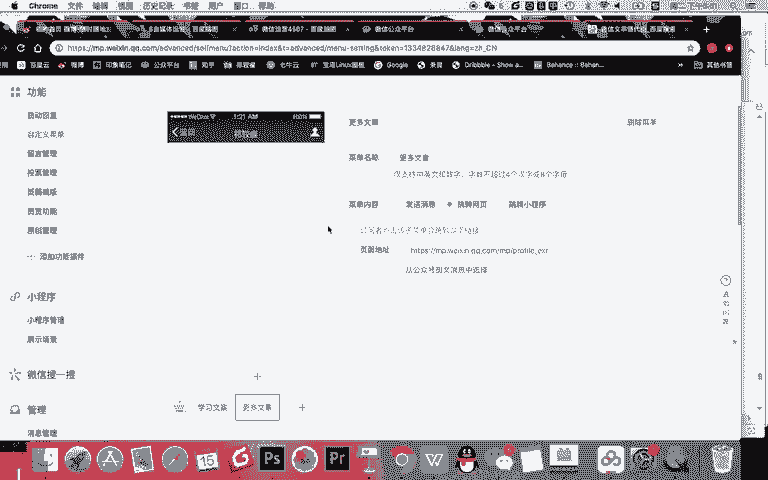

# 微信公众号运营视频全套 手撕运营 拳拳到肉 - P11：1.04-自定义菜单~3 - 达妹_达内教育 - BV1UvvvebEdT

最上面应该放什么介绍？不用你写。最新。Okay。产品。对吧最新产品件，还有呢。比如说还有什么。热门。爆款产品。还有什么？还有什么？应记。新款等等等等啊，医疗类或者服装类都可以，对吧？还有什么？

甚至做一些活动嘛。比如说什么呀。比如说现实。抢购等等产品，这是产品的介绍。如果是一个医疗类的企业，就不能这样介绍。比如说你说什么针对功能。

比如说针对企业场景、个人用户场景或者说科室的场景，比如说心脑血管啊等等等等类似的这样去做OK这是一个传统类型啊，有公司叫产品介绍的这样一个网站约等于起到一个展示加提供联系入口的一个企业。

那么如果第二类啊。第二类。这类大家接触很多，电商类企业。

那么应该怎么展示？那我我们所展示的内容就要。不一样啊。那我们就把这些都删掉。大家思考一个问题啊，你认为电商类的企卖东西的还要不要有公司介绍？对，不要啊，为什么呢？因为你想你天天去京东啊，还有考拉海购啊。

还有网易严选等各个网站去买东西的时候，他会有什么介绍自己公司吗？没有，一般都是什么。直接写一个热卖。商品对不对？热卖商品呢，这里卖什么？热卖商品这里有什么？比如就像刚刚所说的是吧？现实。

抢购各种类型都可以，比如限时抢购。然后呢，比如说应季新款，这还是刚刚的啊。还有呢。还有呢比如说什么啊。网什么呀？网红同款。等等啊，这个下面我都不写了，那产品介绍怎么划分？

其实你这边是活动类型的一个热卖商品，这里呢。

比如你可以来一个在线。商城对吧？热卖商品在线商城都一回事。那在线商城写什么呢？按照产品类型划分，比如说。家电。产品。这里呢。服装产品。还有呢这里呢除了家电服装呢，这里是什么？生活用品。还有呢。

比如说什么呀。户外产品等等等等。你去这样去规划啊。那这个部分放什么？一般电商类企业在这里，比如说你可以是活动类的，在这里是按产品类型换，这里画什么？对，这里是什么？你一般是什么用户中心。

电商企业一定要用户中心，而且用户中心不能直接让他访问到个人的中心。其实你可以做一下。什么。活动，比如说什么。在线抽奖。还有呢领优惠券。然后呢。购物车功能是不是可以有？还有呢。个人中心这里如果是个人中心。

还有什么？😡，你就写什么直接写用户福利啊，这里就有用户的中心，还有什么呀？优惠券，甚至购物车进入个人中心有购物车，这里是什么？在线。客服对吧？有活动有客服有在线进入个人主页啊，然后呢，这里有产品的介绍。

这里有各种活动类型的划分，那这是一个电商类的。那么有了电商类的，还有传统企业品牌介绍类的。那我们刚刚其实我给大家展示的这是一个自媒体类的自媒体类的主要就是看文章。

甚至呢做一些相关的付费的一个产品的一个搭建。那这是一个公众号的一个规划。我希望大家明确的是进行自定菜单的设置，重要的不是这些操作。这个操作很简单，一会儿你就能掌握了。

最核心的给你的公司进行很好的菜单的一个规划才是重要的。在规划时首先应该进行一级菜单，大的类型的划分。比如公司产品，还有联系方式或用户中心的一个划分。然后在公司介绍里从上到下要有基本介绍。

案例介绍等等的一个介绍，是用户能全面了解你的公司。再然后呢就是产品介绍可以从最新啊应记啊，还有干类型啊等等进行划分，让用户能够了解你的各种类型的产品。最后能够联系你购买你啊。

然后呢实现一个销售的转化，让整个微信公众号承担起一个微型网站的责任。当然，这个微信网站它的展示就是通过自定义菜单。OK以上呢就是我们自定义菜单内容的相关的讲解。希望大家记得两个方面啊，除了会操作之外。

希望你还会进行企业的规划。而且这种规划是根据你企业的功能需求和产品类型去实现的。OK接下来的时间希望大家完成好你的自定义下单的设置。我们下节课将学习微信啊内容运营的相关知识。

