# 微信公众号运营视频全套 手撕运营 拳拳到肉 - P12：1.05-公众号设置案例分析~1 - 达妹_达内教育 - BV1UvvvebEdT

同学们好，欢迎大家学习我们微信运营的基础课程的第五部分内容，公众号设置案例的分析。在前面的课程里呢，我们给大家讲了这个公众号啊，它的各个方面如何设置，比如它的昵称，简介，包括它的自定义菜单啊。

还有自动回复等等。那本节课呢，我们通过一些企业实战的案例来看一下啊，他们具体在企业工作中设置的一个真实的情况。我们要分析的案例呢是VIPK的。是我随意去找的一个案例，大家当然也可以去分析别的一些几案例。

APPK的呢是一个啊，过我们知道啊北美纯真的在线学习英语的一个在线教育啊或者少儿教育的一个平台。那我们来看看他的公众号设置的一些内容。那我们首先要看的什么。我们第一部分。一部分呢我们首先要看的是。

比如我们给大家看看它的什么昵称。头像。简去。啊，所以呢我给大家展示一下啊。OK我们看一下，这是我对他VIPK的一个公众号的一个截图。当你在呃微信里面去搜VIPK的，会搜到一个账号叫VIPK的大米科技。

那估计大米科技呢是他们公司的名字，然后VIPK的呢是他的品牌名。所以你看他会把他的公司名和品牌名啊合在一起去注册这个账号。我个人认为啊，其实它直接叫VIPK的是最好的。对吧或者叫VIBK的英语，对吧？

少儿英语啊，但是呢它为啥叫大米科技呢？可能是在注册的时候啊，或者说你需要认证的时候，你这个他可能因为自己的比如说啊这个。自己的这个logo啊，或者说自己的公司的名字或者自己的这个商标啊，当时可能没下来。

或者等其他的一些原因。它不能直接直接注册VIPK的，或者不能直接注册VIPK的什么少儿英语这样一个内容。然后他就只能去叫做大米科技，因为可能他们的公司叫大米科技啊。

O我们看啊首先名字我个人认为呢不是最完美的，但没有关系啊，好像在我们微信的后来的规定啊，不能让纯英文认证的啊啊，特别是纯大写，这样是不合格的。所以呢它有中文结合。那名字呢不是特别完美，但没有关系啊。

只要你搜在微信里搜VIPK的是能找到它的。那我们看他的头像头像还是不错的，对不对？你看VIP啊，它是加了一个小的这样一个标注key的，然后包括用的是他们基本是他们logo的一个颜色logo的一个造型。

所以是头像是比较合格的。然后他的简介。那你看VIPK的在线青少儿英语，北美好外教，让孩子爱学敢说。哎，这是一个不错的一个可能就是他们公司的slogan，对吧？直接放到简介里。

让所有搜VIPK的人直接就能找到这个账号，然后看到啊这个账号是做什么的。所以呢你直接不会关注错误啊，这接能进点击进行关注。大家可以看到这里有我的一些好友的沟通关注啊。所以呢他的受众范围还是挺广的。

OK那我们看完他的头像昵称和简介之后呢，我们要看第二个部分，这个部分就是什么？

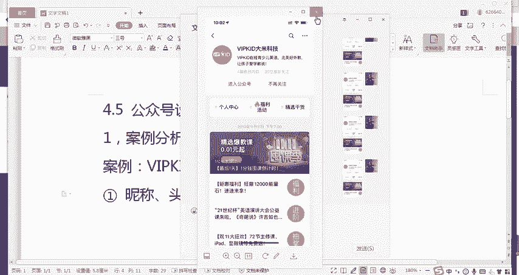

自动回复。我们看它自动回复设置的是什么？同样的我要给大家去截一个屏，截一下呢它的自动回复的内容。ok好再来看一下。这是你关注他账号之后，进入他的啊，比如说进入他的公众号对话的页面，直接收到的自动回复。

自动回复呢分为两个部分的内容。第一是文字部分的内容，下面呢是什么？下面呢是我们的。啊，比如说是他的一个在线的活动，所以呢它是直接设置了两个内容给到你。第一，能让你你看啊，亲爱的家长终于来了，欢迎语。

这是我今我之前给大家就讲，先欢迎一下，然后呢，告诉他你是谁，这里就不用告诉了，一看就是VIBki做英语的，对不对？所以就直接引导访问访问什么呢？你看引导绑定。或者你要是新用户的话，你可以去注册你的账号。

比如你用你的手机号，一旦绑定VIPki的账号之后啊，你就能够全网。比如说用它的APP也好，或者微信里啊，或者其他地方也好，你都能够直接用这个手机进入去学习你的账号。又能跟你的个人账账户打通。然后呢。

你看这里呢还有一些活动是吧？大红狗课程已到账，点击领取。啊，这是一些做什么做做用户的，或者说做用户新增的这样一个活动。比如说如果你是一个新用户，你看到有免费领课程呢，你可能会去领取了。那你领取的话。

你需要输入手机号，对吧？同样的你还会成为他的用户，甚至呢你没有成为他用户之后之前呢有可能他的线下销售人员啊，可能会给你打电话。然后呢，送你一个特惠福利自然拼读全季全三G。这个视频，然后许看词去会读。

然后最后100分一分抢点击参与。大家看啊，它的自动回复上面呢，我们明显能看到它分成了三个部分。第一个部分是让新用户或者已经注册的或者没有注册的，去绑定你的手机号。

第二呢是现在他们可能正在做活动一个大红狗的课程。还有呢一个特惠的福利点击参与。那使用的方法呢，你看啊送的都是课程福利，还有绑定账号，使用的方式呢都是文字练啊。

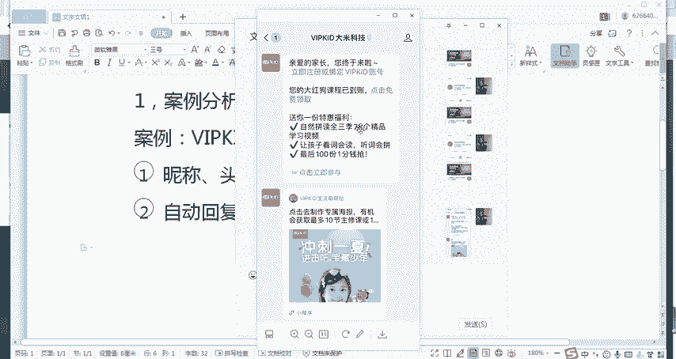

在前面的里面，我们可以用两个方式啊，我们再来回顾一下，去实现文字链。比如第一个方式比较简单是新媒体管家。你使用了新媒体管家之后呢，直接按你的自动，比如说被关注回复那里啊，就是你的公众号码。

被关注回复里直接能够设置文字链，然后输入文字和你的链接，它自动就生成了这样一个文字链。当然还有一个方法是什么？还有什么微信文字链，你可以理解是什么A标记代码。

这个代码呢就是我们之前给大家搜的，你看你直接去每次啊，如果你不知道这样代码是什么，你就直接什么搜微信文字链。

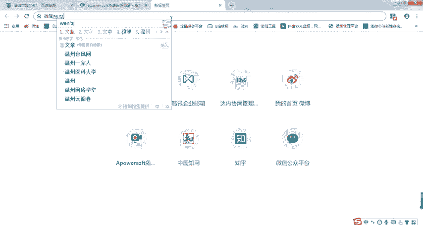

可以了。然后你就能找到。这张代码。

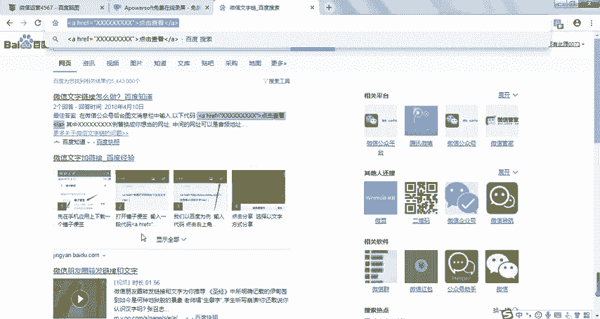

啊，这端代码。放到你的，你看像VIBK它就放哪了，就放到你的被观注回复里。然后呢，你只需要你想设你想显示的是点击免费领取这几个字，那么你就显示。

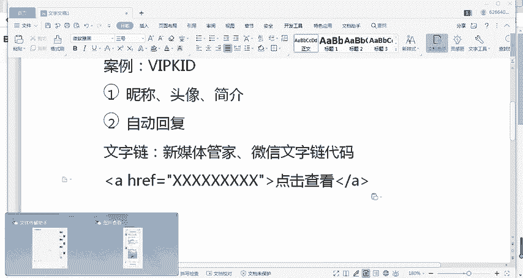

点击。免费领取。O这里放什么？放。链接。你的链接往这里一放，然后呢把文字写成这个，把这段代码复制到你的。被关注回复里，那么它显示出来就是点击免费领取这几个字了。当然你要让它跟它这上面显的一模一样。

我怎么设置啊，就直接写上很简单。

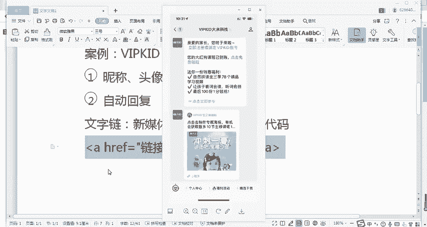

您的。啊红狗课程。已经保障是这样吗？我看一下，你看那种课程已已到账。OK你这句话往这儿一放啊，当然这儿放上链接，它真实的显示出来效果就是这句话，后面点击免费领取。因为是在我们链接的文字链。

所以它会直接显示成这个效果，这是设置的方法。

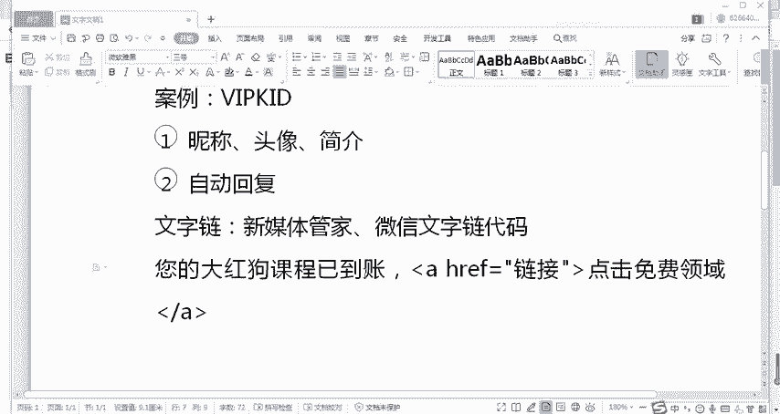

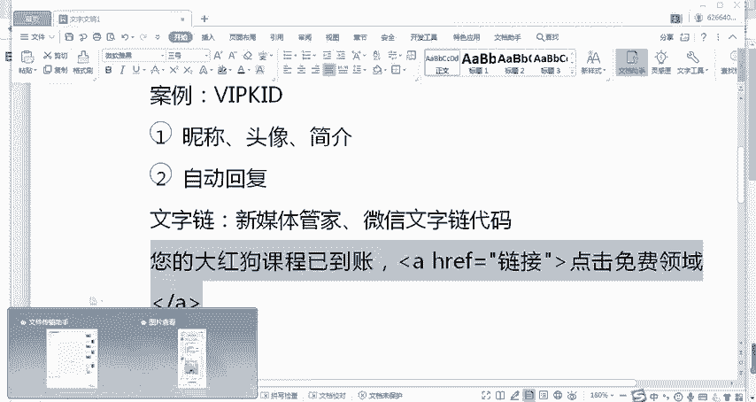

他可以看到啊VIPK的它的这个。呃，销售属性啊，最起码在被关注回复里，就是你一进入我的公，你关注我的公众号啊，我明显是要干嘛？推客卖客让你成为我的用户的。他并没有说啊我是一个让你看文章的账号。

一看就是什么。让你去成为我用户的一个账号，我要去卖课，对吧？我想让你免费输入你的手机号是吧？免费课程，你输入手机号，我成为你的是吧？我就是会有销售吧，或者说我直接啊给你发送信息让你去使用。

那下面呢你看这是VIPP的，可能目前的你看这个不是特别合格啊，现在呢其实不是夏天的，那冲刺一下，然后呢制作专属海报的这样一个活动，可能是夏天的一个活动，但是呢没有去进行修改。

所以记得第二点一个注意事项啊。

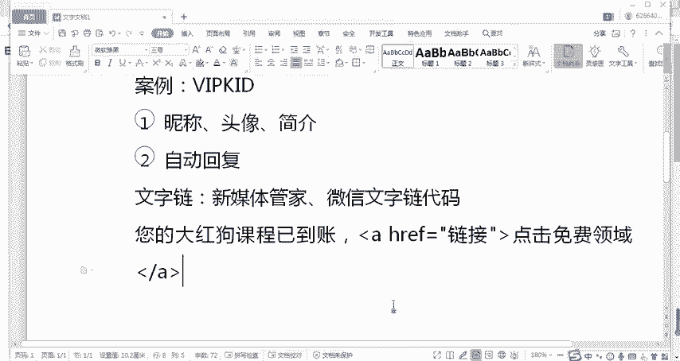

运营者应该经常被。被关注回复或各种自动回复进行检查。的优化。

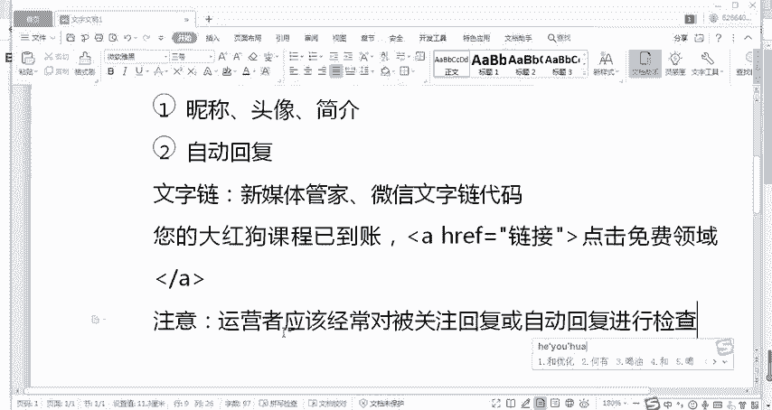

啊，我在别运营的过程中啊，也会发现有很多的一些，比如说我们自己或者说有很多的企业。当你去分析它的账号的时候，你会发现哎设置的还都不错，一看就是有专业的运营人员在做的。

但是呢你会看到它里面的这些内容呢都是过时的。比如有可能啊我们一会儿要分析自定菜单，它也是过时了。那现在你看到它自动回复进入这个海报去过时了，冲刺一下啊，比如现在已经冬天了，你在。

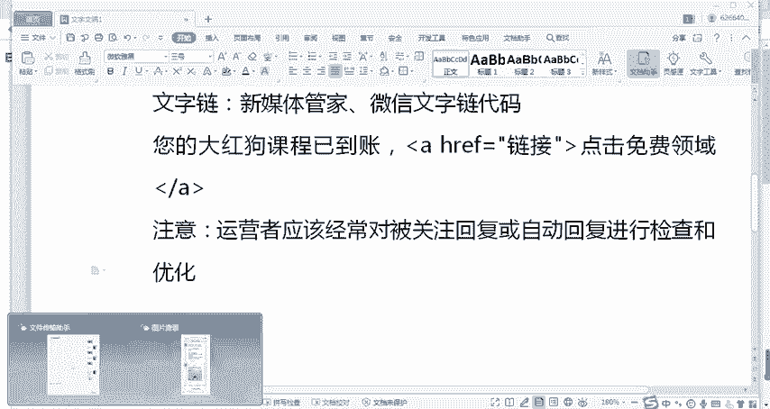

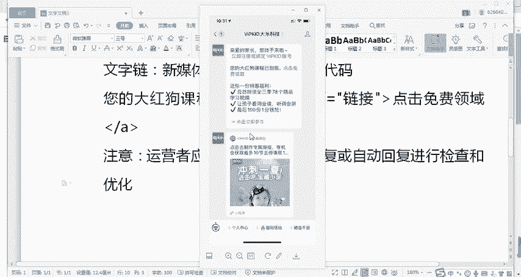