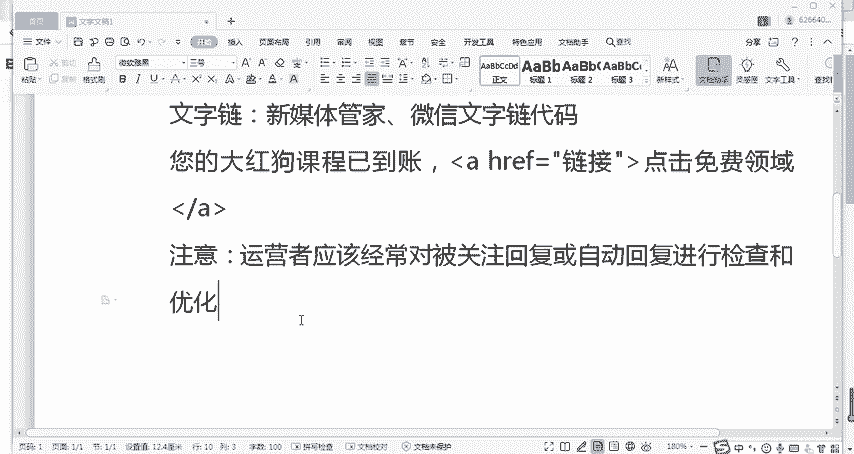
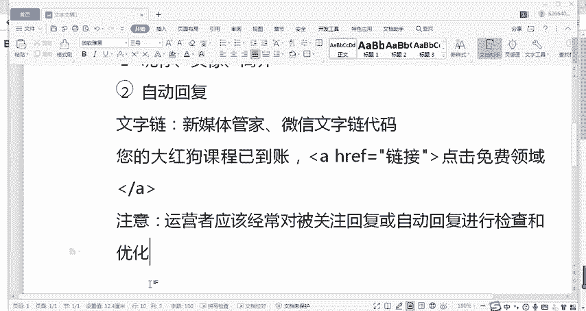
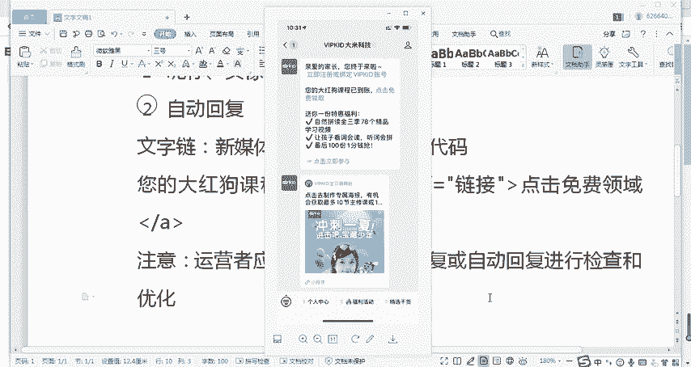
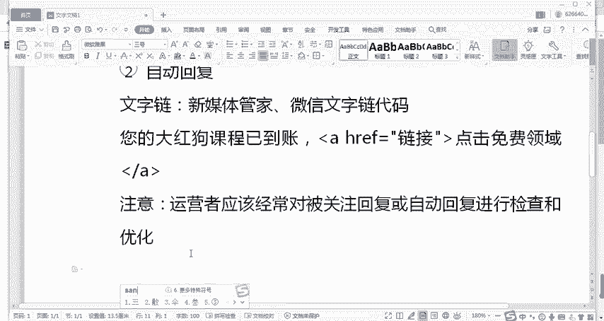
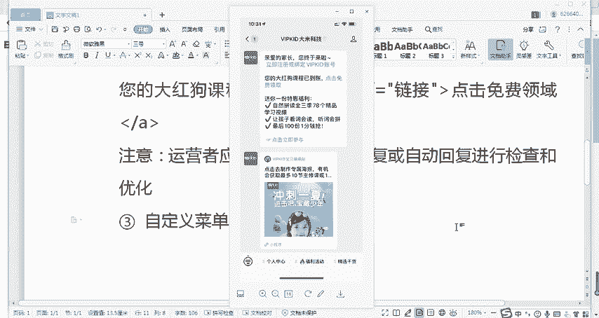
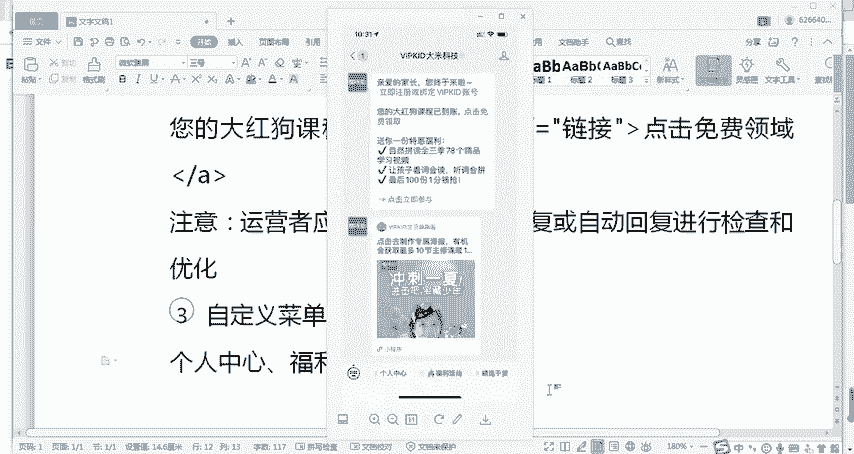
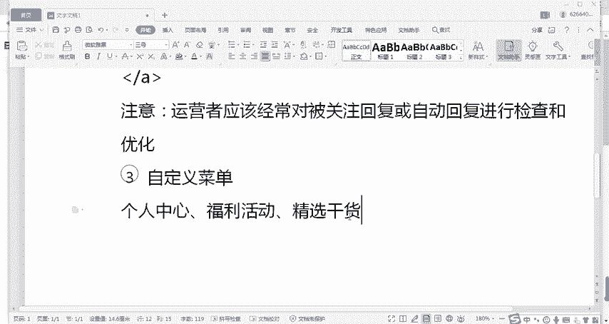
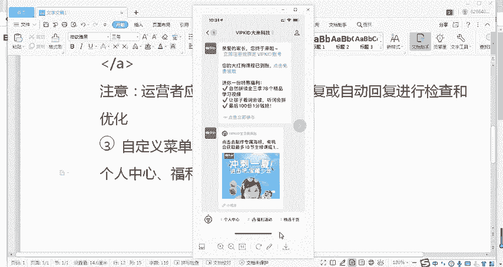
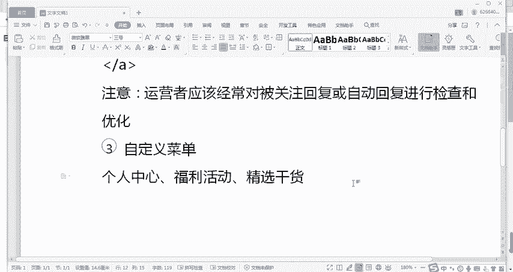
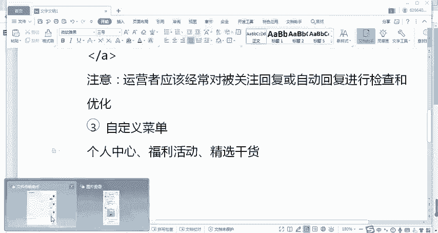

# 微信公众号运营视频全套 手撕运营 拳拳到肉 - P13：1.05-公众号设置案例分析~2 - 达妹_达内教育 - BV1UvvvebEdT

从此一下，你这活动已经过时了就不能放在这里了。所以这都是一些细节。那作为运营者，我们要经常去看什么呀？记得一自己去看你的被关注回复设置。2、还有关键词回复设置。3、还有自定菜单等等啊。

都要去进行这样一个设置。

那接下来呢除了自动回复之外，我们还要看什么进入一个新的账号，要看第三点。

自定义。菜单的设置。我看一下。

MBK呢它的自金菜单，那大家稍等，我给大家截图啊。首先他他的自金菜单我们有三个内容啊，个人中心福利活动。

好，我们给它写出来。福利活动还有。

干货看货什么？

喜想干货。O。😊，先看三个自定义菜单的一级菜单，你能看到他个人中心就是什么用户中心。说明VIPK的它的自定菜单，首先啊它放在第一个第一个自定菜单，对吧？一级菜单，它的核心的目的，你一看就知道要干嘛。

它要把自己的公众号打造成，其实是1个APP或者说小型的VP个人微站。V pate的所有的用户们直接进入公众号，就可以进入到个人中心。当然也可以去听课呀等等等等。所以你看也许。

你的用户并没有下载你的APP或者并没有去访问你的网站啊。因为现在下APP啊访问网站这些事儿其实还是比较麻烦的对吧？但是呢只要我关注了你的公众号，那我同样永远能找到你。当我想学习课程的时候。

当我想看一下我的个人信息的时候，我就能直接去到增定菜单里啊，能看到。所以个人中心呢就是放在第一位就体现了VIPK的一个运营的思路，就是我把公众号当成一个微型的APP当成我跟用户去使用我产品的一个入口。

第二呢，福利活动一看就放什么呢？啊，这是引导用户去进行转化的。我希望你看到我的这些活动啊，比如前面的什么下天上传照片啊等等各种活动目的最核心的目的其实啊说白了就是要获取用户的微信啊，不是手机号。

不能说微信号啊，微信我关注你，你也获取不到。因为公众号并不会给你这样一个微信号的用户个人信息。但是呢我通过各种福利的活动。通过比如说有些这样的活动那样的活动，针对不同的人不同的需求。

我给你设置不同的活动。然后呢，我目的就是让你成为我的用户。所以呢自定义菜单我们也能突出啊明显的看出来。这个VPK的它的一个。强转化或者销售属性，我就不是让公众号去看文章的了。我也不是为了做宣传了。

我就是为了做销售，你就是我的。用户或者你就是我的潜在用户，我一定要把你转化过来，我要让你成为我的消费者OK。第三部分惊选干货啊，这个承担呢就是我们通常的订阅号承担的那个责任了，就是什么看文章。

看干货啊，这里呢应该是他们比如VIBK的所原创的啊，或者说所整理的一些。

文章啊，他们推送过那些文章啊，那前面的就是活动，这是个人中心。来，我们再进入它的二级三单，详细的看一下，我给大家进行一个解读。O我们先来看一下。VIBki的这个个人中心都放了什么？

呃，说到个人中心呢，大家可以去想一下啊，我们平时都会在哪些账号上看到一些个人中心。

比如哎我一第一印象我想的就淘宝对吧？或者说我们任何去登录注册啊，比如说一些视频网站等等，有个人中心个人中心展示的内容的不同，其实呢也代表着企业的一个运营策略的不同。比如说个人中心。

我放的是我的是你的购物车，还是我的消费课程还是优惠券还是一些活动，对不对？我们来看一下VIBK的它的一个运营策略。哎，大家看。VBK在二在个人中心的二级菜单里，首先放的是我的预约。

也就是说他给自己孩子预约的课程显示在这里，然后我的课表奖励明细订单客服。那从这里能看出来什么呢？其实能看出来，VBK是把自定义菜单就承担的啊，非常明显的就是我APP的功能，就是我在这学习课程。

我直接进入我的个人中心，我就能看到我预约的课程啊，我去购买那些课程的课表。甚至呢奖励明细放在这里是干嘛？哎，明显就是什么？他是去号召用户去学习去分享。比如可能每个孩子的这妈妈们去分享了自己的这个课程。

给其他的孩子的妈妈。如果别的孩子的妈妈去学习了或买了这个课，可能你就能获得收入，然后你挣的钱呢，你还可以比如说能提现啊，这不一定啊，我只是举例能提现，或者呢能拿着这个钱去给你孩子在购买新的课程。

所以你看在个人中心里，他是有这种分销啊，应该是分销裂变的这种盈利，他的这个活动规则所展示了。那用户明显在个人中心既能看到自己的课，还能看到自己买了哪些，然后还能去跟客服直接联系啊。

所以你看在这儿我就直接学习服务就够搞定了。那我们来看一下他的福利活动。okK啊，我给大家传到电脑上。在福利活动呢同样还有这个内容，个性化海报，这跟前面这个啊被观众回复之后，搜到这个海报是类似的啊。

你看一用户能做海报，其实做海报不重要啊，做海报只是一种诱饵做海报的核心的目的是干嘛？是让用户填你的手机号，然后可能你能获取这种海报，对吧？嗯，然后获取了这个海报之后呢，用户其实你感觉你得到了什么？

其实不对啊，这不是给用户的，主要是企业得到的用户联系方式啊，用企业可以让你成为他的用户。第二呢，你看有拼团的活动，还有推荐有奖啊，这就是我说的分销，对吧？你买了我的课，你是我的用户。

你也可以去推荐我的课程，给其他的宝妈，然后你能得到一些好处，同样还有月月分享。所以呢你看啊VIPK的特别，我感觉特别善于利用这些宝妈们的一些心理。宝妈肯定是爱孩子的。首先呢你看有个性化海报。

其次宝妈有些时候我个人感觉啊可以是带引号的贪小便宜。就我能省则省。所以呢如果有拼团或者有推荐别的宝妈来学习课程，不是别的宝妈，别的宝妈来买课程。那我肯定愿意去做。但如果你是针对男性的用户。

你这样去推就不行。因为很多人男的啊，他并不愿意去做这样。推荐啊和分享。所以你看它充分调动了宝妈的这个积极性，同时利用了宝妈人群的特点，多做分享，让这些用户成为你的传播者啊，这是它非常好的一点。

所以你看有月月分享的，有推荐的，还有一些拼团的，既有买课的，也有让你分享，还有常规的长期运营的一些活动啊，还有大型的单次的这种单海报活动。所以你看不管是从活动的周期性上来说。

还是这个活动的目标性上来说都是比较完美的，也不是说叫完美就比较丰富的。既有我今天想买课有拼团。那我想推我买我推给别人。那我你看有推荐我这个月想有什么有这个。那现在呢这个月我已经分享过了。

我还有个性化的活动啊，这是非常不错的。那我们来看最后精选的干货。O在精选干货里呢，这里有5个二级菜单。第一个是互动课堂。然后呢，第二是外教带你看事件VBK的FM这应该是音频啊，家长viked数字图书馆。

OK在点开这个精选干货之前呢，我以为VIBK的这在这里放的是啊它常规的一些群发过的一些文章啊，但其实你看这里并不是这是VIBK的自己开发的一些是活动性的干货。比如在。学习的过程中有互动的课堂。

还有呢能跟外教进行沟通互动，对吧？还有一些音频课，还有家长的一些课堂知识，这个是应该是真实的公众号的一些文章干货。然后还有数字图书馆。所以你看在干货里面，其实这些啊，你也可以把它当成福利活动，对不对？

就是你除了能领取真实的福利之外，还有一些学习的内容的福利。所以呢VIBK的这个公众号的增定菜单，真的是承担了它的。APP或者承担了网站的所有的功能。

比如你你想啊你去开发了1个APP1个APP你能放什么内容呢？如果是VIPK的VIP，我认为无非也就放这三类了第。

