# 微信公众号运营视频全套 手撕运营 拳拳到肉 - P14：1.05-公众号设置案例分析~3 - 达妹_达内教育 - BV1UvvvebEdT

在APP上面，我有各种各样的课程可以展示，你看这里有各种各样的课程，对吧？第二，除了课程，那我肯定有个人中心能看到个人中心啊，看也有。第三，我会有一些APP会推送一些活动啊，福利，其实也可以放在这里。

所以呢完全把VIPK的这个啊比如说啊它的这个。公众号直接按照这个自定菜单的规划照搬到他的APP上面。我认为内容也是合格的。所以呢这是VIPK的一个呃自定菜单的一个规划，我认为是非常合格的。

而且有明显的销售属性。

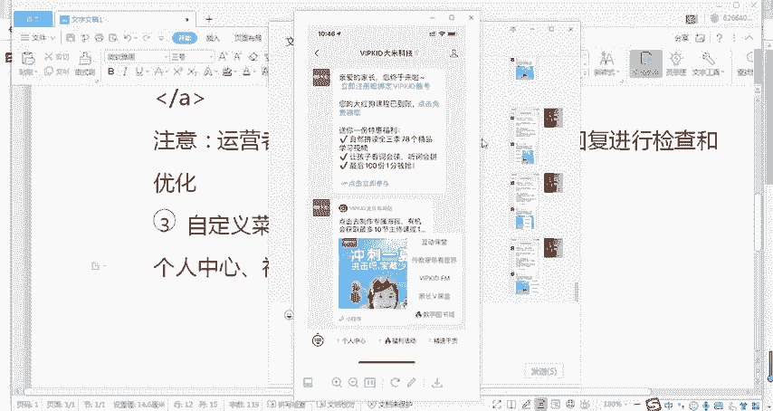

看完这个还要看什么呢？四点还要看什么？ho。话。什么叫互动兑话呢？互动兑话还有什么？😡，关键词，也就是我现在呢要去给VBK的发一些关键词。首先我并不知道它设置的有哪些关键词，所以他没有用关键词回复。

对吧？但是呢我可以给他回话，甚至我去发一些关键词，我看看他有没有什么的反馈啊。

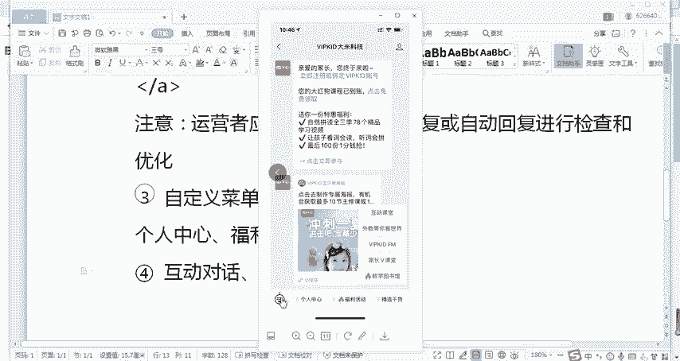

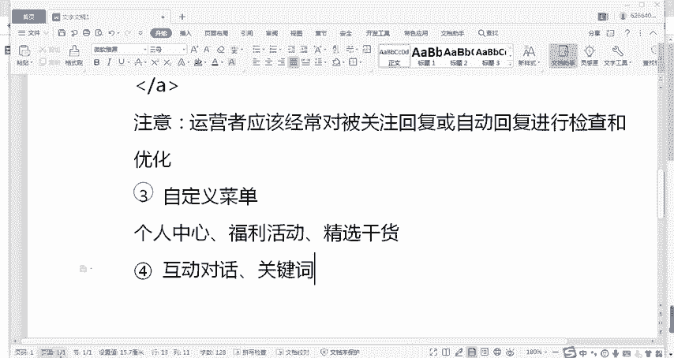

然后我把这个反馈截图给大家。比如呢我先给VbyK的一个回一个什么。学习。哎，你看。我回复了一个学习，他给我真的回复一个内容。然后我再回一个在吗？

我看看他有什么okK其实啊现在我基本知道了它的这样一个内容是什么了。啊，你因为我回了两个词，他回的都是相同的内容。

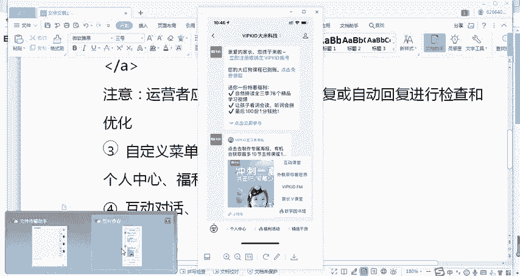

我K大家看。当我给VBK的回复一个学习的时候，获取你看什么什么分级阅读账号密码，请回复分级阅读，然后获取什么什么直播地址，请回复新生指导课。感谢您对什么如果有。问题联系请拨打是吧？这个电话OK啊。

这个电话呢我首先我在打的时候，我会有一个疑惑。明显我看是一个座机，但是我在北京打跟我在上海打，它需要输入呃需要去输入一些区号吗？还是怎样啊，难道他去在全国各个地区都是同一个号码。

然后有不同的区号就可以了吗？所以我这个电话我认为要么他们设置的很好，要么我可能会有一些疑惑。那其次呢你看我输入学习和在码，它都是完成了这个回复，这叫什么？这个互动对话里其实设置什么？

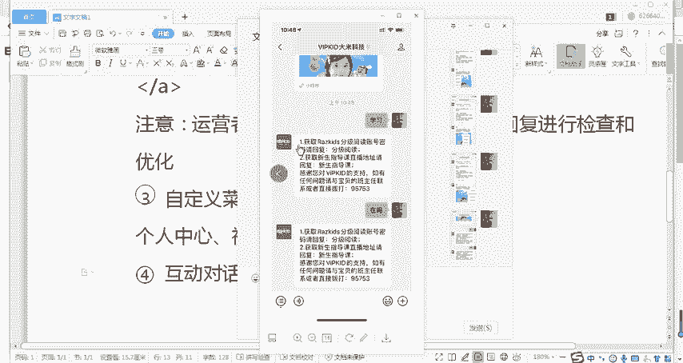

什么新。消息。

回复是吧？所以呢不管我回了学习在吗？或者说你好等等，他都给我回这个。那在新人回复里呢，他告诉我了，我给你打电话啊，我建议其实最好还可以去问客服的，但其实也没必要，为什么？因为我们看到啊。在个人中心里面。

他其实有我的客服。所以呢如果我有任何的问题是需要的，我给他回了一个某关键词之后，他给我回的自动回复，没并没有解决我的问题。我可以去到我的客服里去解决。我说这样也是OK的。所以呢现在他给我留个电话。

我说没有问题。那其实除此之外，我并没有获得别的信息。我只知道现在有一个分级阅读，还有听直播课，那我又会回复分级阅读和新生指导课这两个关键词。那现在我就回一个分级阅读看一下。OK分级阅读，我一回复呢。

你看啊它又是一个。新的内容。

这个内容实现的方式呢就跟我们之前刚刚讲的那个文字店是一样的。你看VIPK的现的家长还没有登录，绑定之后才能登录。所以你看我一旦绑定了我的账号，我再去输入分级阅读，他可能直接获取的是我个人的一个信息。

那我个人认为啊他现在这个号啊，我没有去看其他的内容，我怀疑他就是什么？他是服务号啊，因为他能获取我的更多的个人信息的话，我认为他用服务号去会那实现会更好。因为从整体上来说，我们不管看自定金菜单也好。

还是他的被关注回复也好啊，他基本的都是他做服务做销售，在做课程的学习，所以他的账号有可能选的不是订阅号，而是服务号。然后呢，我一旦绑定了账号之后，我能获取我的个人的一个中心。

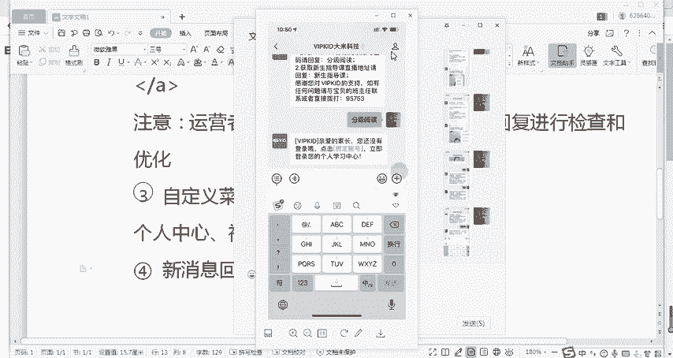

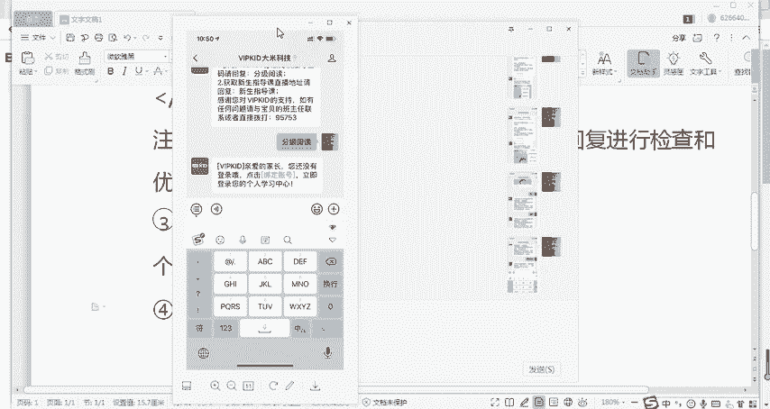

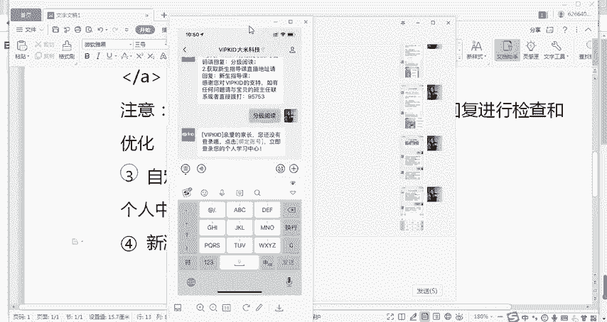

OK所以呢我认为啊整体分析下来，不管资金菜单也好，还是被关注回复，或者说先消息回复关键词也好啊。我认为VBK的这个账号整体设置还是不错的，整体是非常不错的。唯有一个缺点就是它的活动啊。

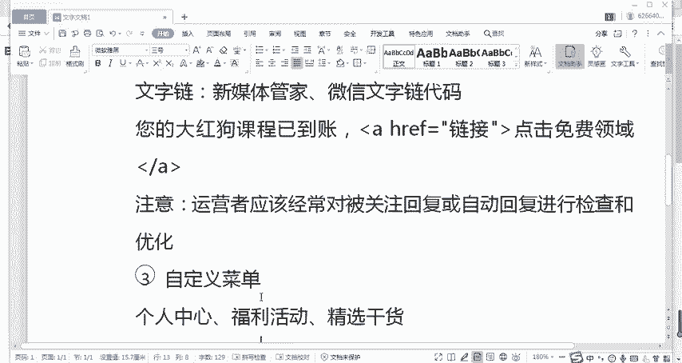

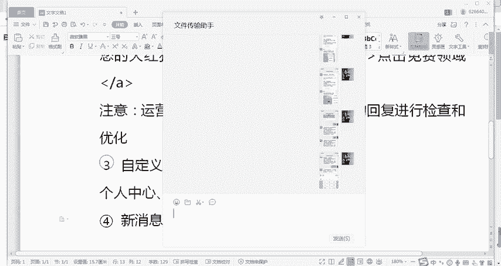

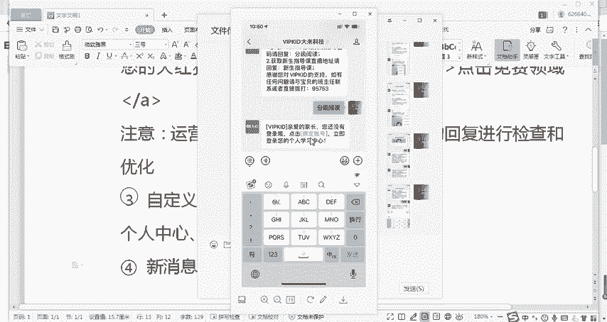

活动不合格，现在已经冬天了，还有冲刺一下是吧？晋级吧，宝藏少年这个活动是不合适的。所以呢这个活动最起码有半年的一个延迟了，我认为不是特别的合适。那但其他的呢，我们从基本的设置上来说。

VBK的还是比较合合格的那接下来我们看什么呢？除了这些账号，你看到它基本的设置之后，要看什么？

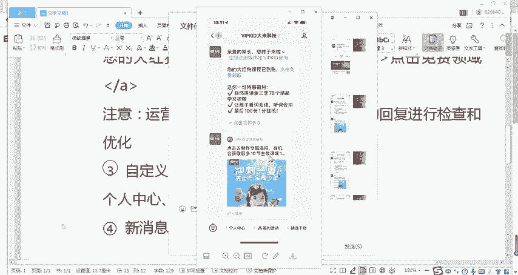

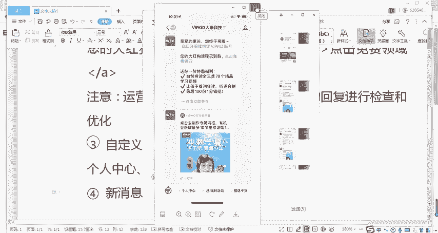

文章。没有。

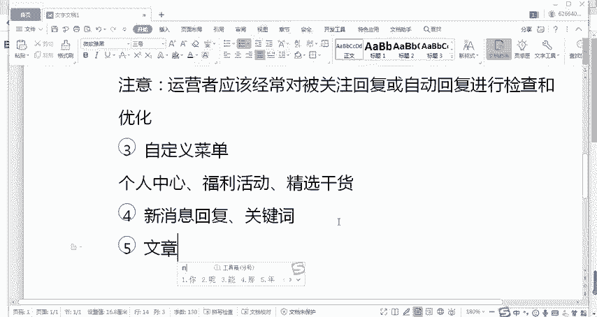

什么意思？就是说。学习或者说查看这个公众号。暗号的发文。习惯。及行率，我们看看它的一个基本的运营规划是怎样的。

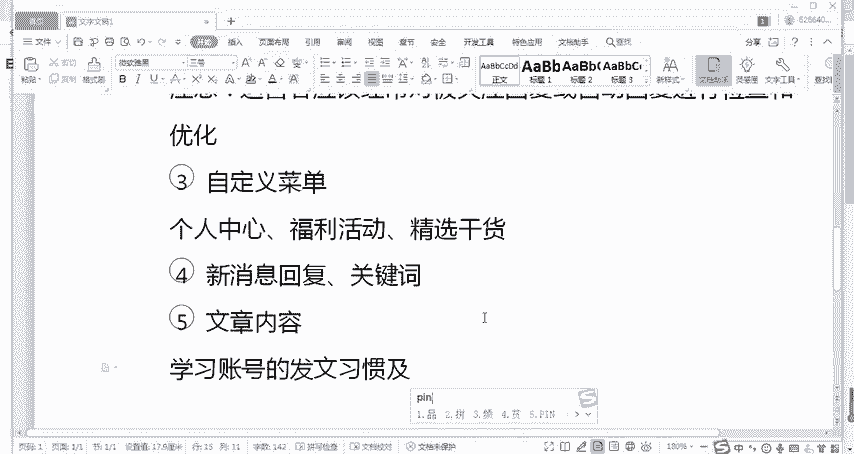

我多给大家截个截几个图，然后大家可以看一下它的一个内容的一个运营情况。我们多看几次呢，就基本知道它发文的一个频率了。还有就是它文章发的数量什么都可以会知道了。然后我们多往前找几期的内容啊，我们看一下。

OK我给大家进行了三个截图，我们一起来看一下。首先我们看啊，最新它是在19年的11月11号，也就双十一那天他要做活动了，对不对？然后呢，它更新的下双十一下午77点啊，下午7点啊，然后更新这几个内容。

精品课啊，一分钱啊，这约等于就是免费送嘛，就但是我要做一付费用户，对吧？我要让你去付一下。

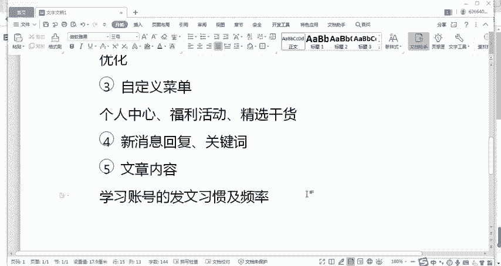

然后呢，是什么112000能量时21世界杯英语公益课程来了，双十一大狂欢课程。你看。我们不管别的内容，就从双十一当天我们看到的所有的内容都是什么课程，送课程啊，当然他跟双十一有关啊。

但一般企业来企业来说啊，他做公众号不只要去送课程，可能他还会做什么，还会去啊分享一些知识。但我们看他有没有啊。

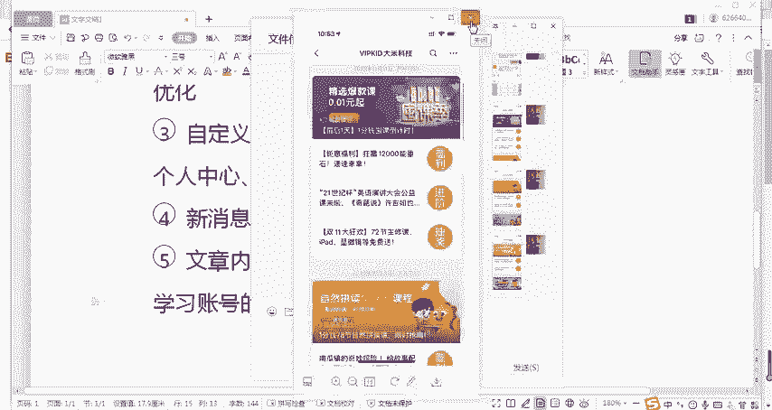

我们看到10月份19年10月31号发的。课程。赢哈利给故事配音，你看这个是什么？赢哈利波特原版书，这是活动。如果提升孩子英语和实际应用能力，这个方法一定要知道，这是一篇干货，对不对？

再看这个7天就因特训课课程，最后一天团购课程。所以你看我们再看啊。

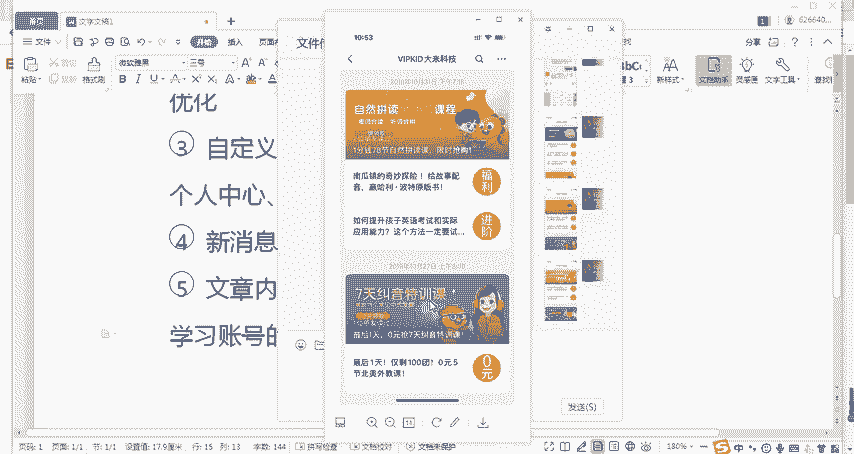

0元主修一年课程，开学压轴福利福利0元抢20节什么，然后0元补课程，三节什么课程。OK我们全部啊大概分析了三个截图，这三个截图呢体现了VBK，它的整个的一个运营方向，作为一个企业公众号。

它的重要的运营方向是麦克，对吧？我并不是说分享一些干货呀、知识啊、经验等等，天天追求10万家的阅读量。我不我做那些没用，我是有销售的任务的，我是有这些KPI的考核的。所以我就卖克，所以呢哪怕有些时候啊。

你看他会去分享一些经验和知识。但前面的都是要么是课程，要么是活动。

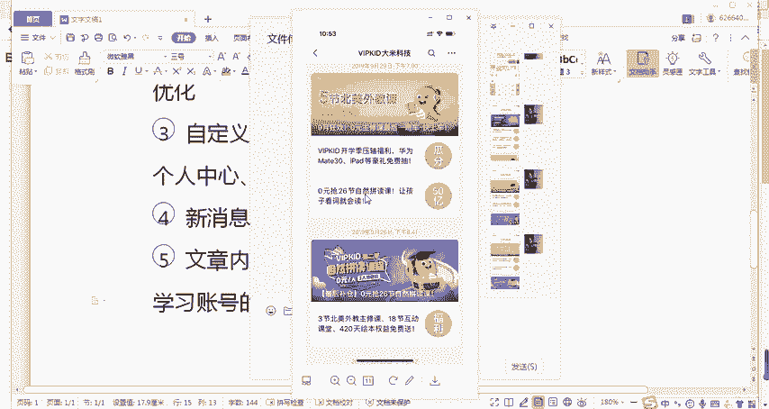

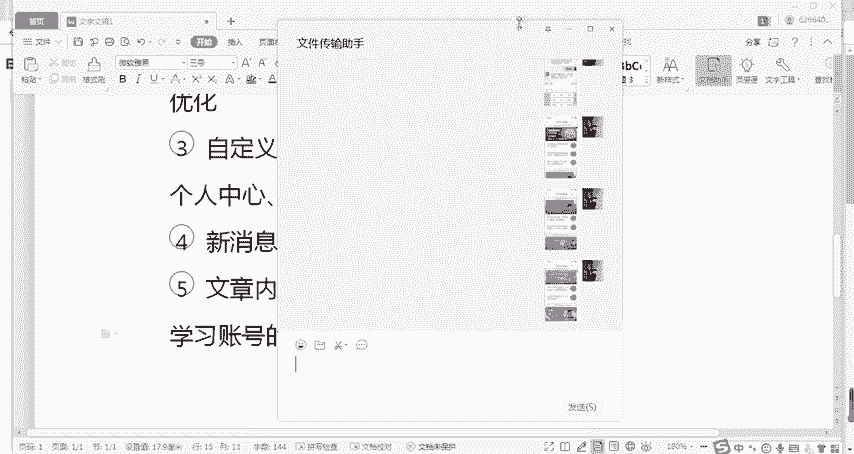

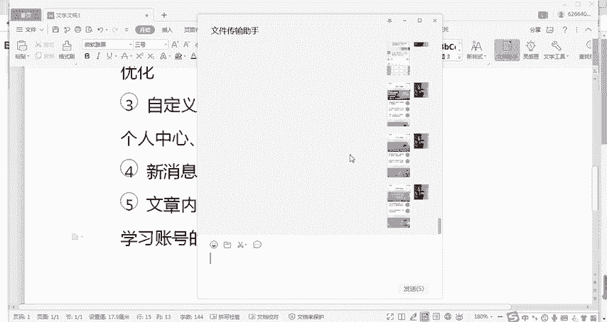

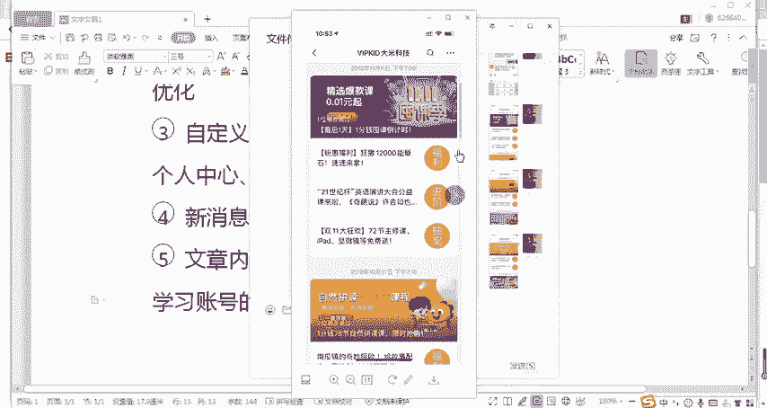

做活动的目的还是要卖课，对不对？所以呢我认为VBK的在运营公众号的时候有一个清晰的定位，就是我追求产品的销量是吧？我是卖客的。第二，我追求用户的活跃度。因为我认为这些配音啊等等，这些促用户促活的。

对不对？所以你看他的运营的策略就很简单了。还有呢你会看到他运营的一个日常的计划，我基本每次去分享三四篇的一个内容。第一篇内容肯定是要做什么折扣课，我就送课程让你去买。

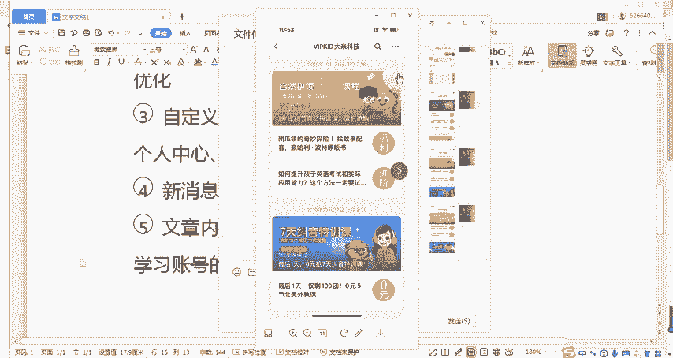

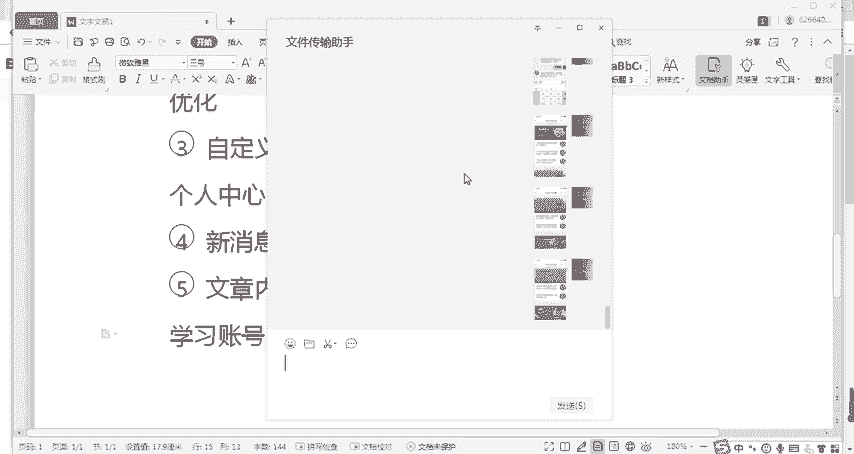

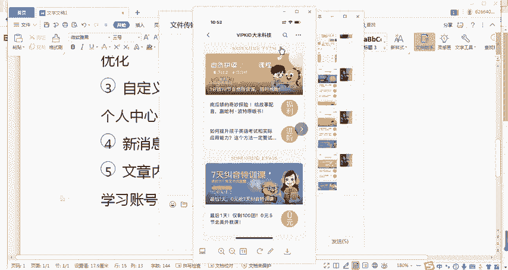

然后呢，会有送一些福利呀，做一些活动等等，对吧？看这是双十一推了4篇。

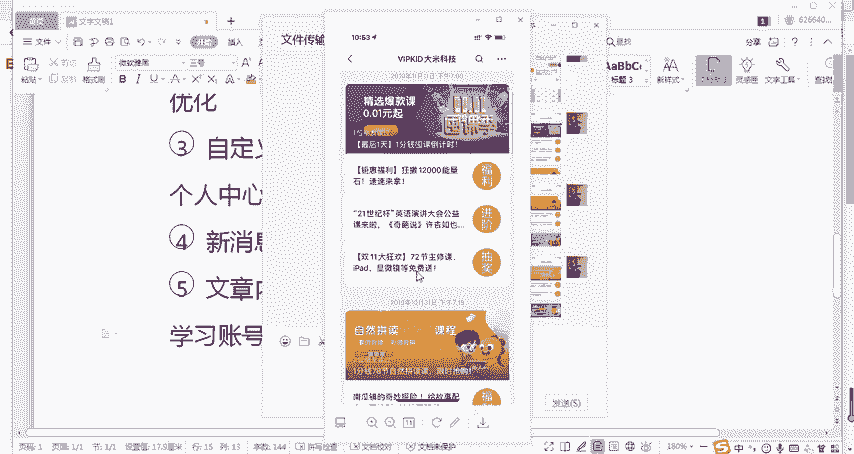

其他的呢我大致浏览都是三篇啊。

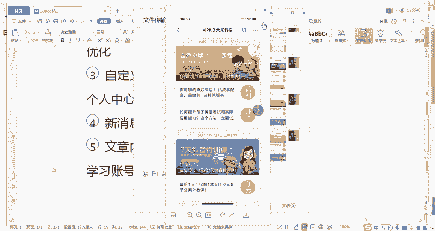

包括你看这些都是三篇，所以呢一般VIPK的更新三篇，它更新的频率呢也不是特别的多。一般你看3天啊，这两10月27、10月313天1更。那现在呢2629，你看三天一更。

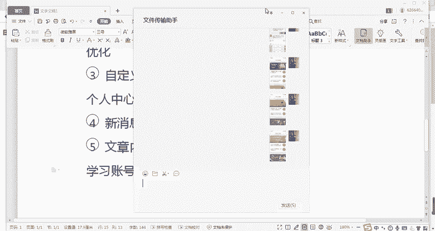

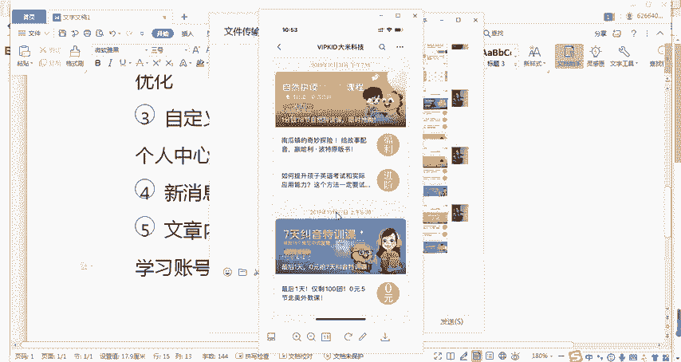

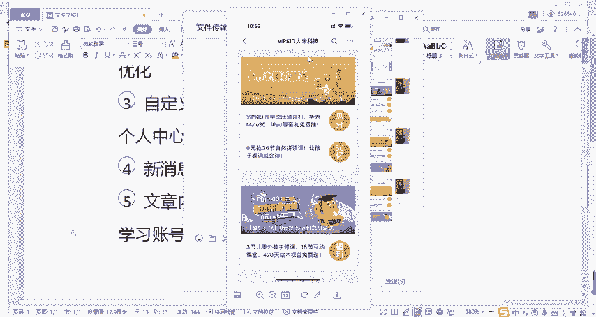

这个呢啊这是我们刚看3010月31号这10月11号，所以呢这个可能就是他没有去更的原因，就是马上要双十一了，流量都已经被抢占了。他们在双十一来了一个大的活动，对不对？然后去做的这样的一个福利。

所以基本VIPK的一个运营的策略，我们可以基本预估它是三天一更，而且更新的内容呢就是为了卖克。然后呢。

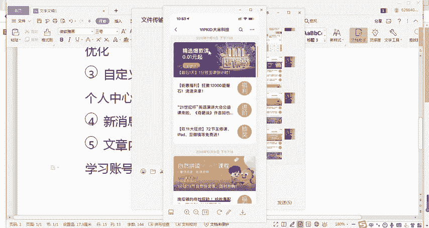

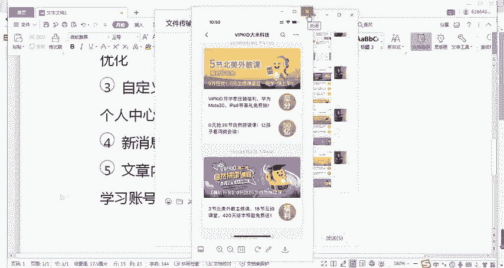

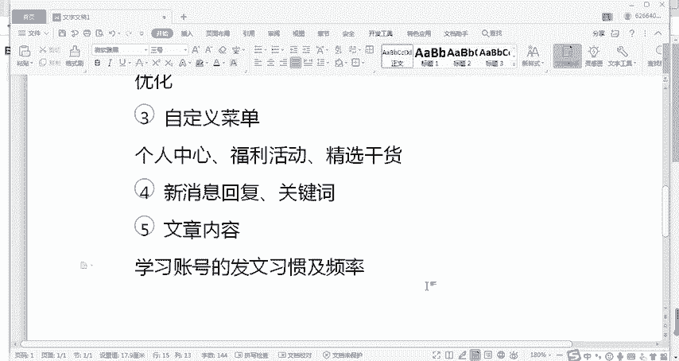