# 微信公众号运营视频全套 手撕运营 拳拳到肉 - P16：1.06-公众号内容规划~2 - 达妹_达内教育 - BV1UvvvebEdT

宣传性账号呢就是。企业。运营。公众号。是为了干嘛？是为了提高自身的。影响力向。受众。宣传自己。但。不会什么直接。卖商品。这个时候呢，你看我运营这个公众号主要就是为了什么增粉，但我又不卖东西，那我怎么办？

我发什么呢？一般宣传自己一般发这几类的信息啊，比如第一类。

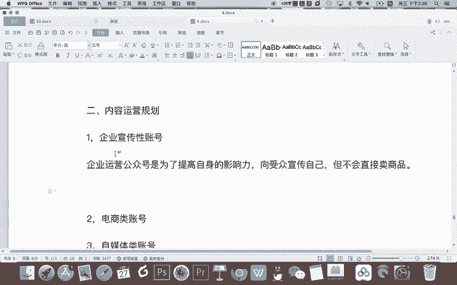

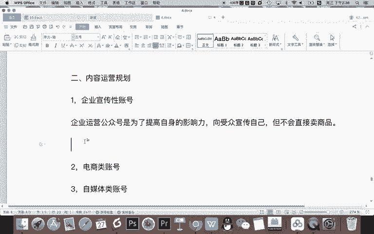

啊，其实我建议这里面又分成两大类啊，第一类是。自身需要的信息。第二类呢是。用户需要的信息，什么叫自身需要的信息？就是你宣传你自己，你自己需要发布的信息。比如说。

产品信息。

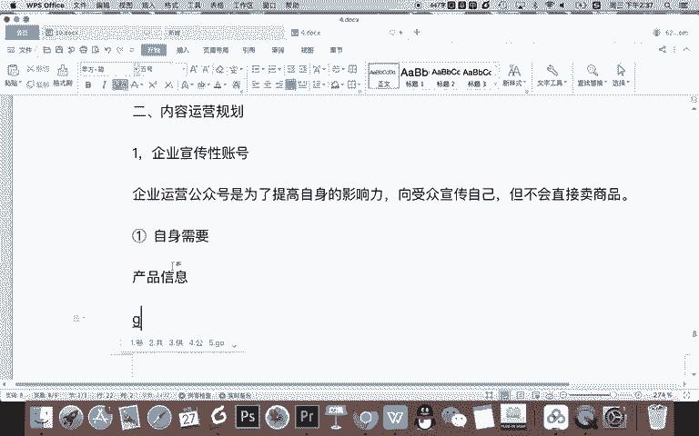

公司信息还有啥企业。

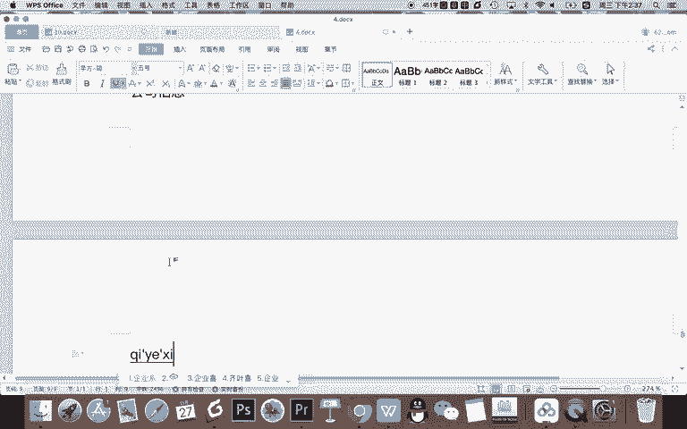

新闻。然后呢，产品信息公司活动啊。

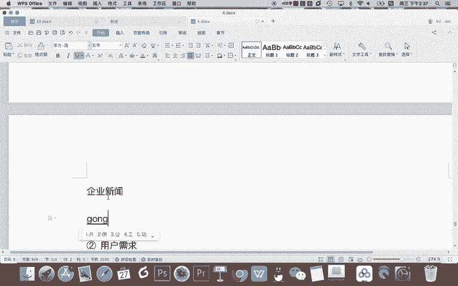

等等对不对？甚至还有什么，偶尔你们去做一些什么呀？

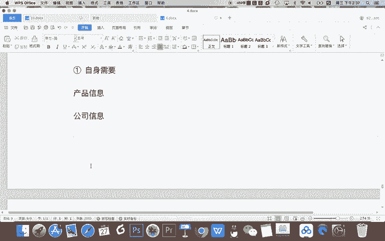

福利活动哎，公司活动和福利活动什么区别？福利活动是让用户参加的。

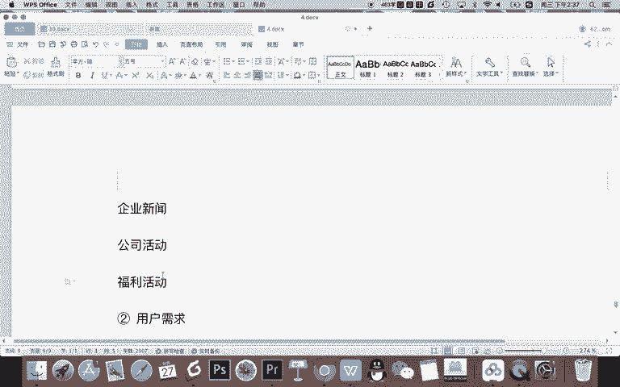

给用户一些好处的公司活动呢就是你们公司做的一些大的一些事情。所以呢一般公司自身需要的信息，主要就是去发布公司的一些产品呀，你们公司有发布的新闻新产品啊，公司有什么啊新的动向了。

甚至公司参加了什么什么大会获奖了等等这些新闻啊，这是公司自身需要去发布的一些内容，这些内容呢对用户来说，用户没有那么关心，对吧？你属于自己比较关心自己比较需要的内容。那对针对这样的企业。

用户需要哪些信息了。比如用户什么？

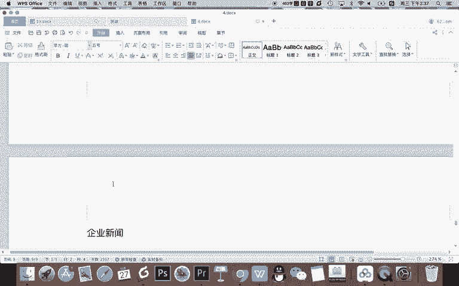

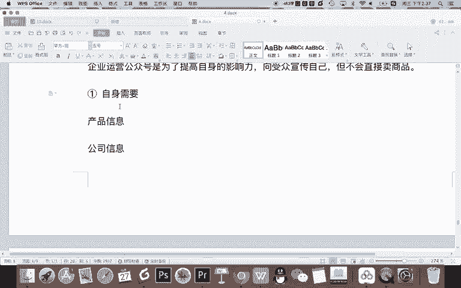

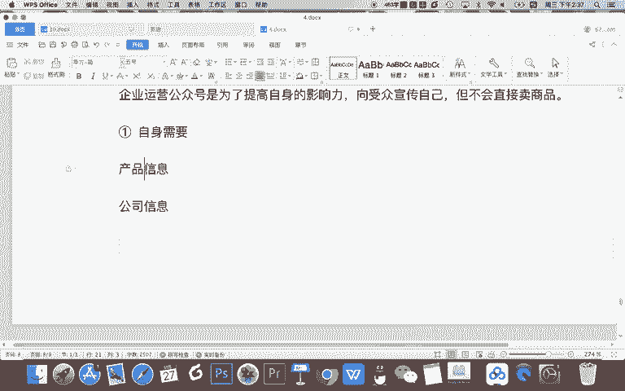

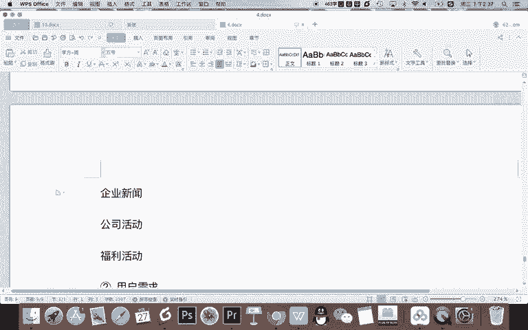

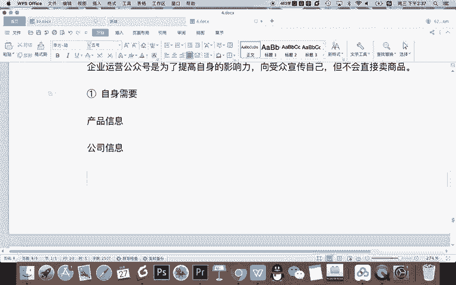

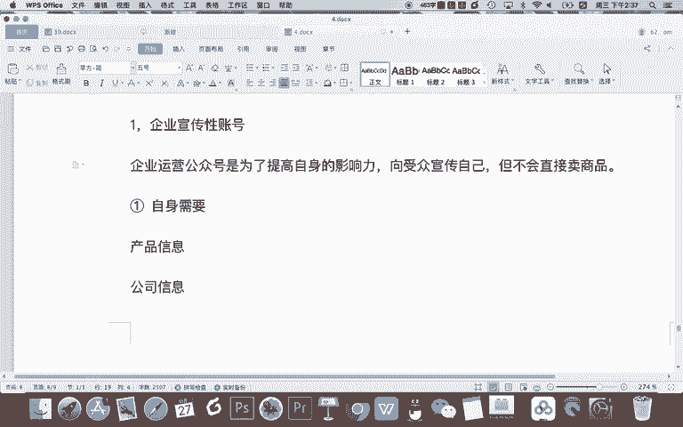

需要。行业。资讯对吧？我关注你这样一个，比如说做房地产的一个账号，我并不是为了从你这儿买你们的房子。也许呢我是希望看到你对我们整个城市的啊房地产行业的一些动态的观察。我是一家科技类型的企业。

也同样我关注你呢，不是为了买你们的科技的服务和产品，而是从你这儿了解整个科技行业的一个动态，那就是行业资讯。还有呢。干货知识。用户呢最喜欢在关注一些企业也好，关注一些账号也好，对用户来说。

最有价值的一般就是干货和知识。啊，用户想从你这儿获取行业的一些知识啊，他能学到东西，这样是比较好的。比如一家啊，比如举个例子啊，一家做这种小程序开发的。这家企业，那他的公众号呢。

你总不能每次都去卖小程序，让别人去开发，对不对？其实不是你要发布一些小程开发的一些知识啊，或者运营的技巧啊，甚至一些啊案例等等。这样呢对用户来说是比较有价值的这就是干货知识。那除了这些呢，还有什么？

除了干货之外，还有什么？还有福利活动。其实你看啊公司做福利活动是我的推广自己，但对用户来说，用户也喜欢福利活动，因为有福利嘛，有好处，这是用户比较喜欢的。除此之外呢，还有什么？还有。互动什么呀。

问答类似的。比如用户关注你呢，也许还能在这儿去对你进行提问，你能对他进行解答一些问题。甚至有一些行业性的问题，你也能帮他给他一些建议。那这样是比较好的这对用户来说。

这几个信息是比较有价值的用户呢比较喜欢这样的信息。那这样用户喜欢这样的信息，你如果发布的多会有什么好处。当然是比你发自身需要的信息要有更多的一个什么阅读量的OK那通常来说，企业宣传性账号啊。

他发布这些内容呢，我建议啊。

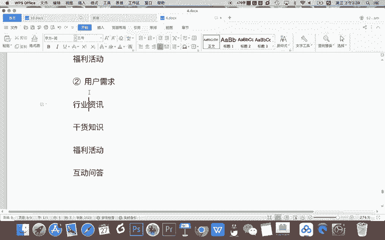

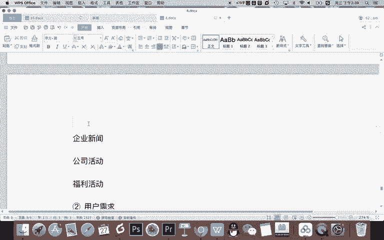

建议自身。需要的。信息与用户需要的信息的比例是。3比7什么意思？就是多发布。用户喜欢的信息这样。阅读量会高。其实从运营的角度来说也是怎么样？多发布对用户有价值的信息，才能关注才能什么有粉丝关注。

如果发布自身。什么呀。广告啊，其实以上公司信用文案等等都属于广告啊。如果发布自身广告过多会。掉粉，然后呢。降低。账号的。

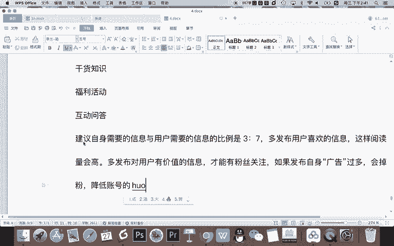

活跃度啊，这是我们。给宣传性企业的一些建议。同时啊。

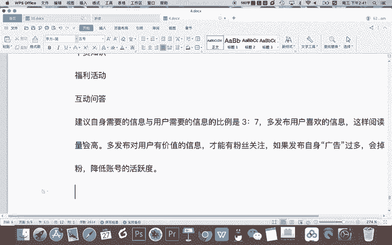

一般。建议。头条。发布。对用户有。价值的。信息。4条。第二条也就是啊4条。或者叫其他吧，也不止4条，第三条也行，其他。什么其他什么条发布。公司信息。只有当。什么呀？公司的信息特别重要是。可以以。头条。

发布，但注意。数量。也就是当你们公司去发布的一一次推送，如果有多篇文章，既有公司的一些信息，要有一些别用户有价值干货信息的时候，建议啊公司的信息放在第二条、第三条等其他的一些这个数量上。

然后把头条放成用户喜欢的干货，那什么时候能发这个头条呢，公司的信息，当然是特别重要。比如公司要上市了。公司要做什么特别大型的活动的时候，可以放头条。

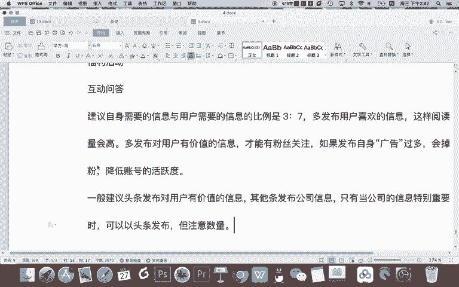

那么放头条也可以，但注意就是数了，你不能你们公司每次推送都有重要的事情，有活动，那就有有点本末倒置了。你每次发布的都是广告，你用户慢慢就取消关注你了，对不对？所以呢以上是宣传性企业。

对你的账号内容也有规划，主要是发布自身的宣传性的信息，还有对用户有价值的信息。那当然要多发对送有价值的信息，这样用户才愿意去关注。OK那除此之外呢，还有电商类账号。什么是电商类账号呢？

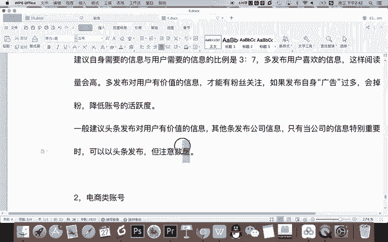

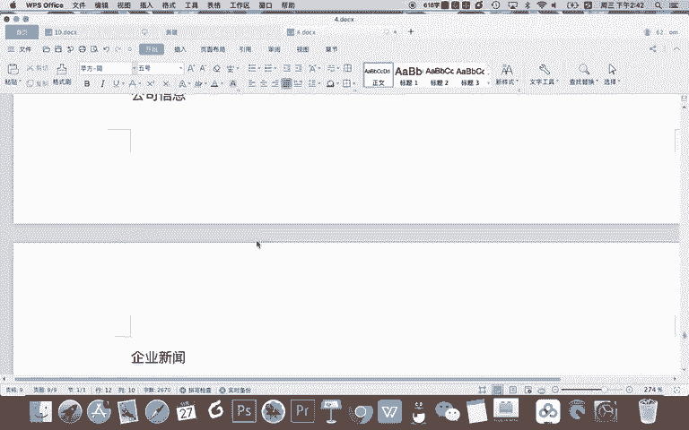

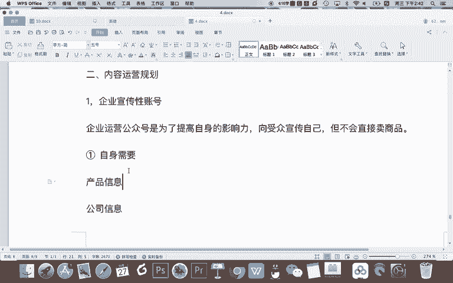

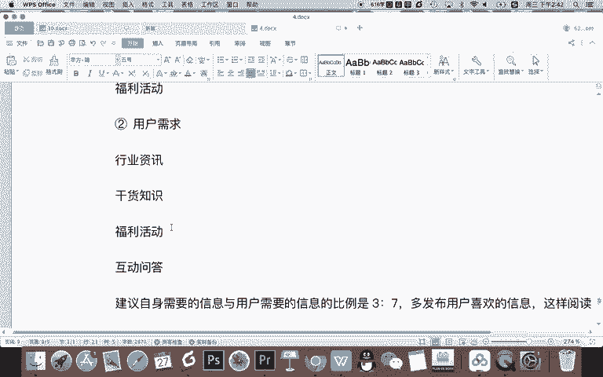

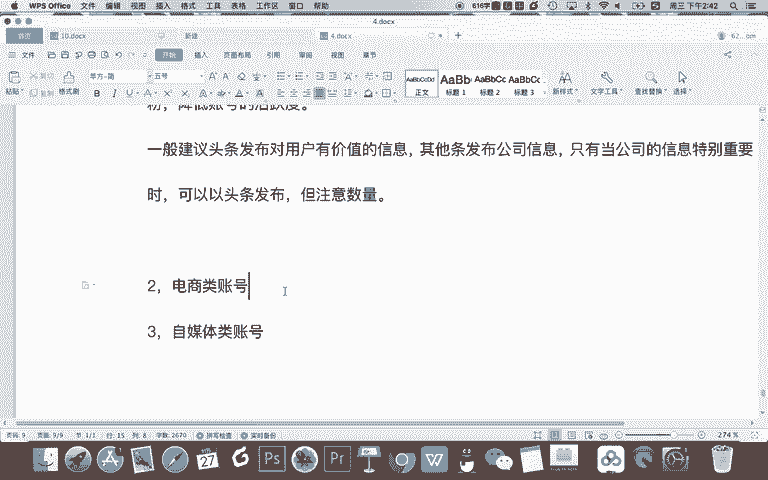

尖多。拼多多。等啊。嘢。销售产品。为目标。进行。

运营的。公众号。那这样的账号呢干嘛呀？运营公众号。目的就是就是卖东西啊。销售。产品，所以。必须发布什么呀？商品。

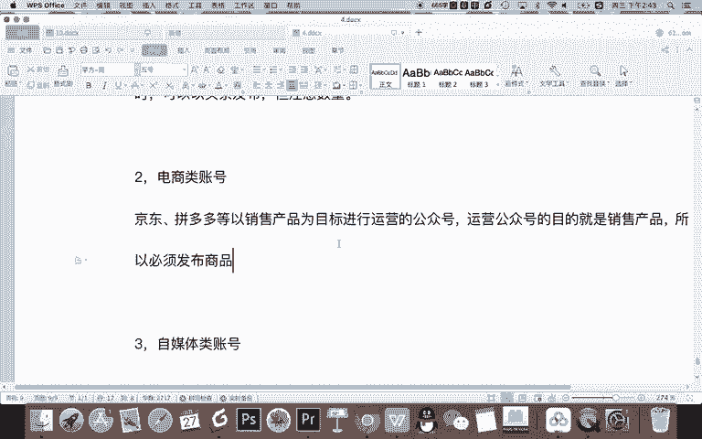

OK这个没什么可说的，你像京东、拼多多等各类电商类的企业，甚至一些其他的，哪怕是知识付费类的。主要是我只要是你是卖东西的，你都进公众号，就是为了卖东西，那你就要卖东西，那怎么办呢？建议啊虽然。都是。

发布。商品但。公众号的推送。应该发布精选。商品化。活动上。什么意思？

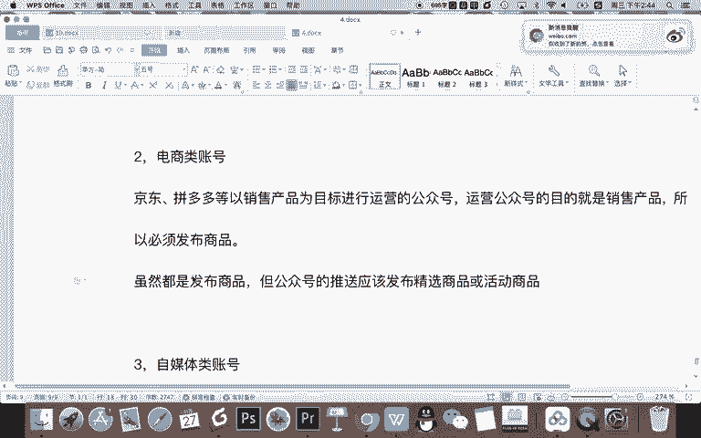

比如啊举个例子。啊，如果你们公司这次卖的是家电，对吧？这618京东618要卖家电，那你第一B第一个头条应该发什么？比如说精选。

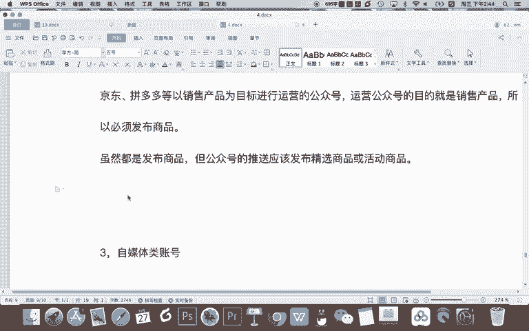

公众号适合发的内容啊。那个比如说什么精选的。最低折扣，还有呢应季。最新的。最新款。还有呢最低这后应急执询法，还有呢整理呢。专题比如说现在是七夕了，适合你整了一些什么适合情人节或者七夕送礼物的一些专题。

还有什么？

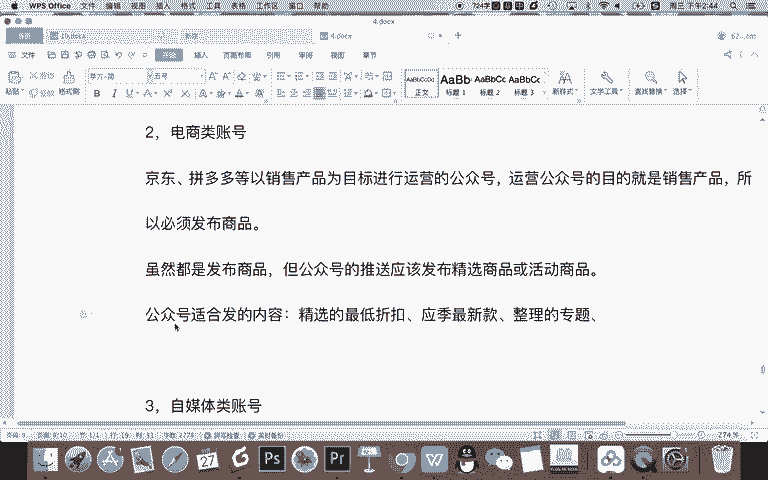

除了折扣新款整天专题，还有什么好评等什么？内容好评的也是好评的什么梳理的内容，还有什么送。Ch。抽假。

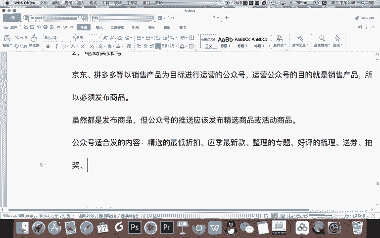

活动等等。啊，这是我们电商类账号。也就是说，虽然你的平台在公众号运营的时候，是跟你的网站一样，都是卖东西的，但你发在公众号以上的内容一定是你整个网站精选出来一些干货的内容。什么叫精选出来干货内容呢？

就是。你要去把你们。这个这个这周或者这个月去热门主推的一些商品，以更低的折扣，或者以梳里的全新款式或者什么什么专题啊，去给它整成一篇公众号的文章发送给用户。

这样呢约等于你去做了一个筛选或者初步筛选的工作，把电。

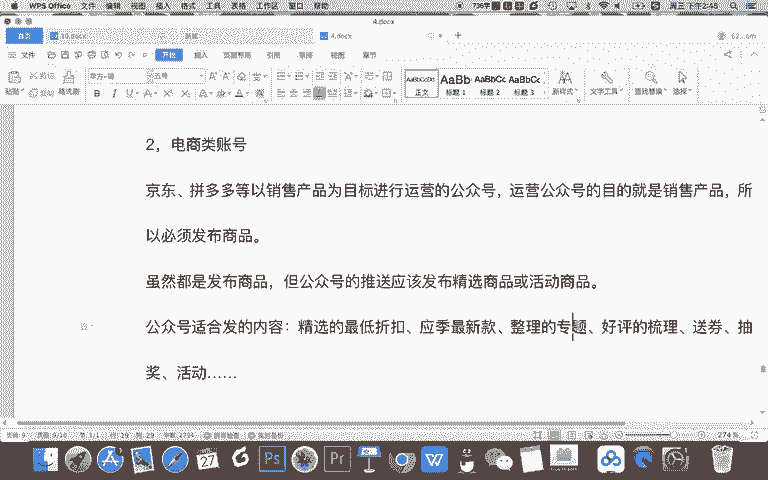