# 微信公众号运营视频全套 手撕运营 拳拳到肉 - P17：1.06-公众号内容规划~3 - 达妹_达内教育 - BV1UvvvebEdT

铺里的，比如100件商品，你去精选了10件给到用户。那用户的选择就会更小，而且呢目的性会更强。而且呢你的福利啊优惠会更大，这样能更好的去做这样一个转化。所以电商类账号呢通常发布的就是这样的一些内容。

那还有一个注意事项就是什么？

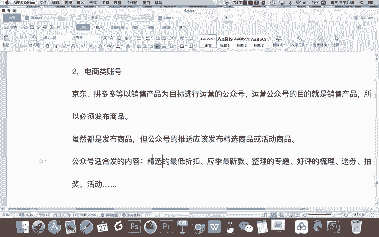

电商类。啊，通常把公众号。他每次推送都当什么？都做成活。通过折扣限时抢。送券儿。

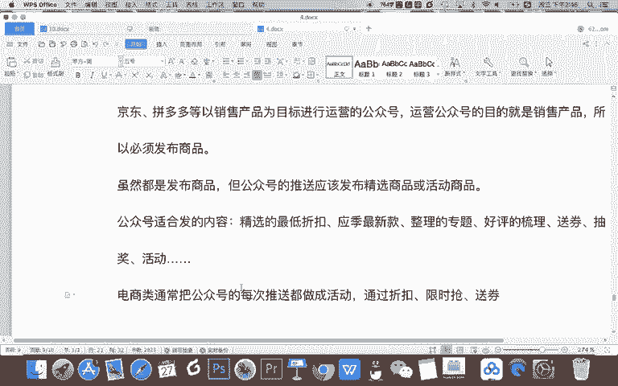

等方式。让公众号。成为精准。客户转化的渠道啊，这是一个非常正确的运营策略。就是你运营公众号，你不能说把公众号当成一个单纯的销售的平台，不是这样的，你这是一个促销平台。

你应该把你的店商城里或者你的店铺里的一些内容，以更福利更有折扣的方式推送给你的用户推送给你的粉丝。你不能说我在你公众号这次你推送给我一次，我买跟我去你的店铺，我现在去买一模一样。那如果是这样的话。

你的公众号是毫无竞争力的。因为我不需要关注你公众号，你还每次推送打扰我，对不对？那我就直接需要的时候去你的APP里就可以了。所以呢要把公众号打造成一个啊活动渠平台。

或者说做做成一个专门的转化客户的一个渠道。那当然要给一些福利，那这个运营的思路呢，就像现在李佳琦跟很多品牌的合作一样。李佳琦不只是一个单纯的销售平台。你不能说我在其他线下卖的一些商品。

我同样的啊同样的价格同样的产品，我直接找李佳琦来买不李佳。

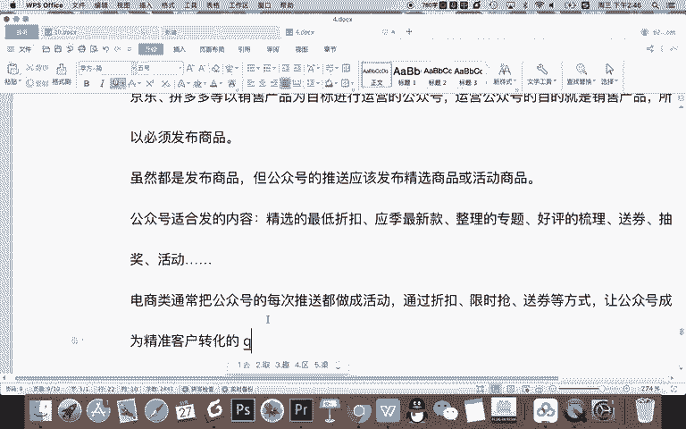

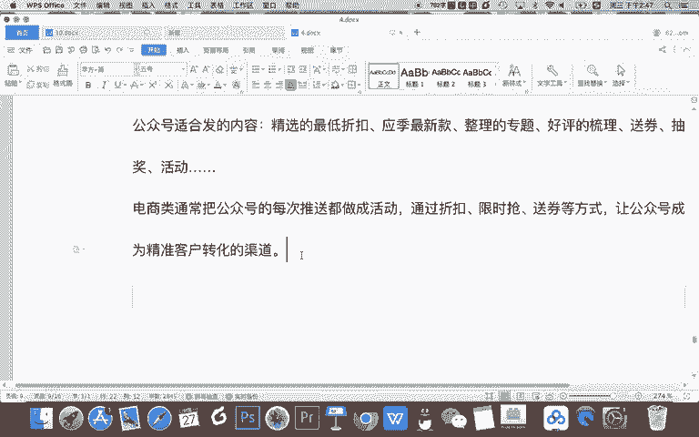

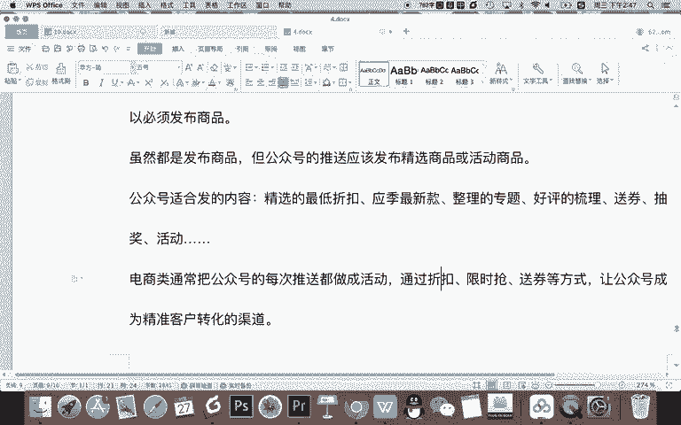

佳琦只要跟你合作，那一定是你这次去让利了，去做了一些活动，对不对？你去以更低的折扣。原来你平时做活动可能没有人知道。但现在你跟李佳琦合作，你打折那能推广给更多的人，那你能通过打折实现更多一个销量，对吧？

所以呢一定在李佳琦这买的是最划算的，而且是最靠谱的商品，对吧？李佳琦能得到一些佣金，但对企业来说呢，你以打折去做了一个促销啊，这是正确的运营思路，而不是说李佳琦跟你的线下平台，跟你的线上平台一样啊。

你只是让他给你推，没有任何的折扣，那是不对的。公众号，你要承担的责任，我建议跟李佳琦是类似的。

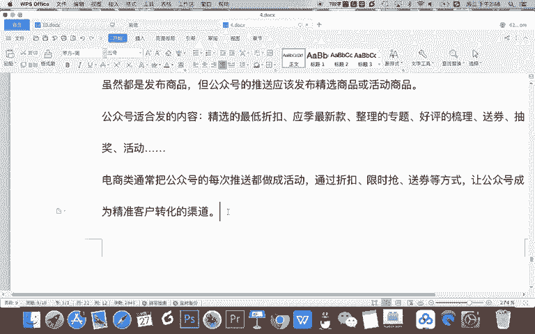

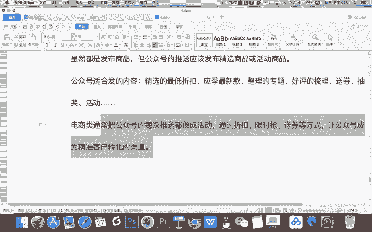

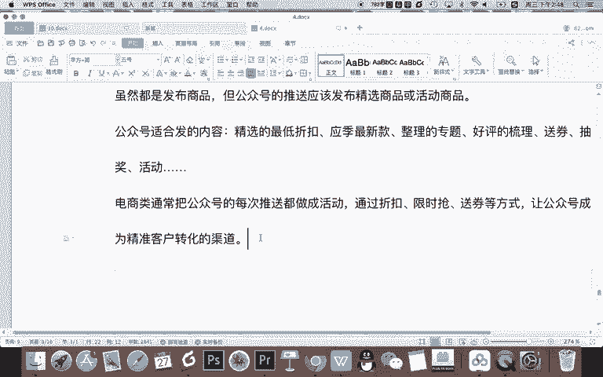

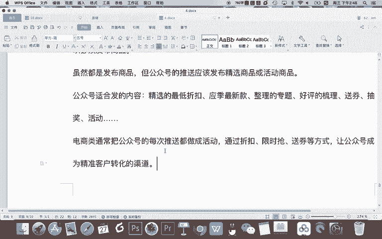

OK这里是我们所说的电商类的一些公众号，在内容上运营的策略。那接下来还有一类内容，这个是可能跟我们的很多同学有点相关性比较密切的一个账号类型。那就是自媒体类的账号。什么是自媒体类的账号呢？

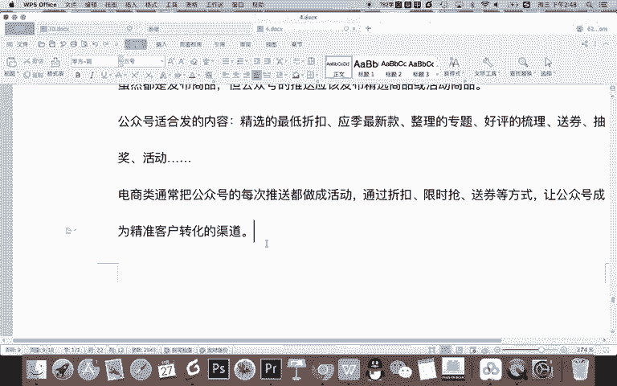

就是。运营。公众号的目的。是给。用户。提供。图文视频等内容。作为什么呀？内容消费。约等于我什么用户是一个什么用户是你可以理解就是。订阅着。约等于我就是你的这个自媒体。

就是你的这个报纸或杂志或电视的一个用户。你呢是给我产生的是我消费的一些内容。那自媒体账号的内容定位发什么？记得。自媒体账号。内容定位完全。以用户为中心。然后呢，以。追求高阅读量。为目标什么意思？

记得用户喜欢看什么。叫创作。什么样的内容？然后呢。内容。创作的标准。有约一个标准或者叫追求是啊。让文章的。越多量。尽可能的。

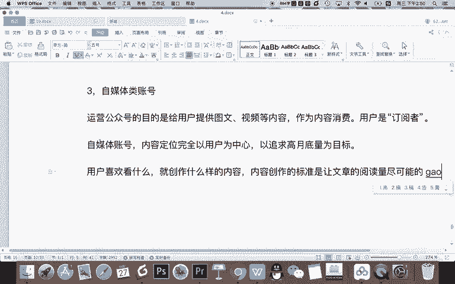

好。OK这是我们运营自媒体账号啊。因为做自媒体，其实说说白了归根结底就是为了挣钱，那怎么才能挣钱呢？那粉丝多，阅读量高，那怎样才能粉丝高，粉丝多，阅读量高呢？那你就是多写用户喜欢看的嘛。

用户喜欢看的文章越多，那用户越转发传播你就越能增粉，然后阅读量就越高了。所以呢做自媒体账号的运营，用户是什么？用户喜欢什么就要写什么？所以你要做自媒体账号啊。自媒体。账号的内容定位其实是用户定位。确定。

你的用户类型，然后。围绕用户的。需求去创作才是正确的。

内容规划方法。比简单一个例子啊，假如你的受助你分析是宝妈人群养宝宝的。对吧那你就要分析分享一些育儿啊、婚姻啊、爱情啊、家庭啊这种特别爱情要少一点，对吧？就多分析育儿教育。还有呢夫妻关系啊。

这种甚至还有养老啊等等这样的一些话题。那这是你的账号受众喜欢的内容。当然如果你的用户是一些男性的宅男，那你就多分析一些好玩的好吃的好看的，对不对？这样宅男就是什么打游戏。好吃的就可能去撸串啊之类。

或者好看呢就推荐一些简单喜欢的一些电影。这是你的账号的一个定位。那么所以呢要自媒体的内容定位呢，主要其实也是要做的是用户定位。ok以上呢，你看我给大家分享了三种类型的账行类型。

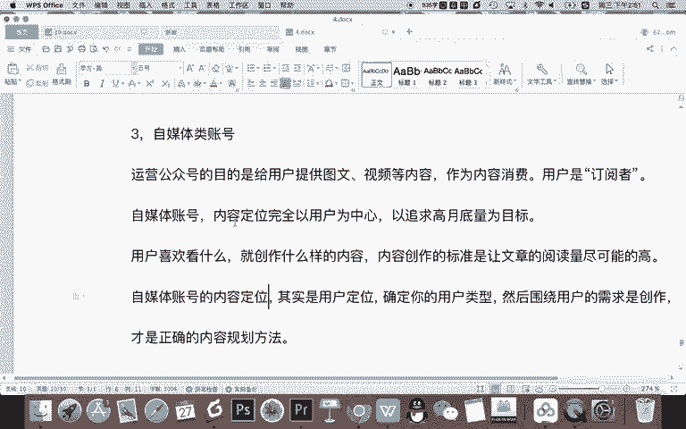

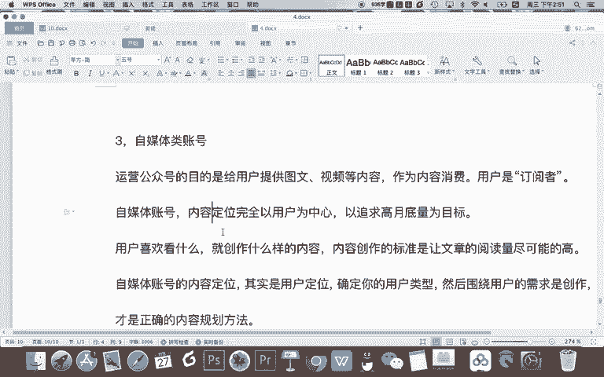

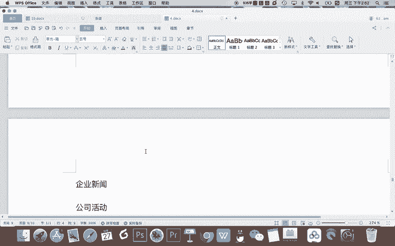

也就是在做内容规划的时候，一般企业根据自己的性质或者说自己的目标不同啊，你的内容的规划不一样。首先第一类呢是宣传性的企业，比如一个科技类的公司，开发小程序的。那么它主要就是为了宣传自己啊。

宣传自己的产品，宣传自己的公司。然后呢再分享一些行业的资讯呀、干货等等这样的维护到用户。

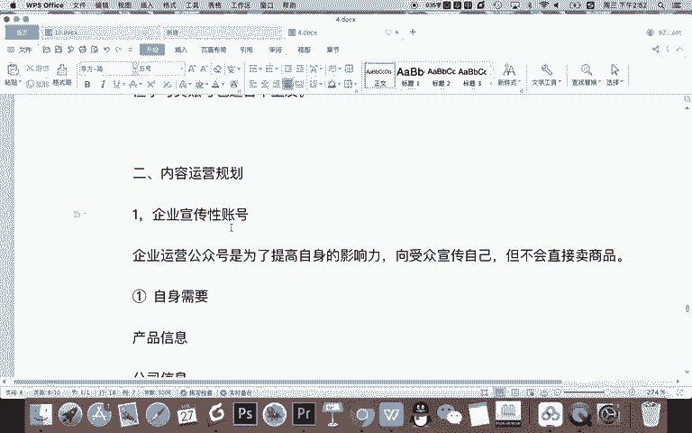

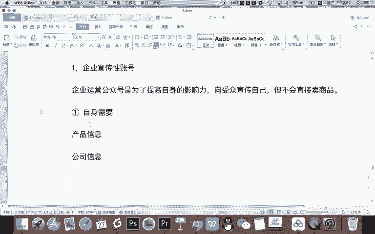

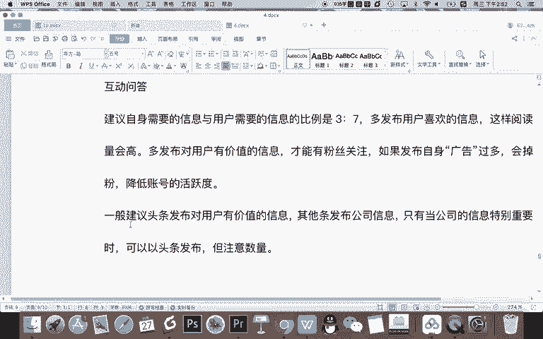

第二类呢就是比较直接的做电商类的企业。我运营公众号就是为了卖东西，那我就要去把商品发布出来。但我们像我们讲的一样啊，发布商品呢不只要把下面算发出来，而要把公众号当成一个活动平台或者一个特殊的转营销渠道。

通过折扣啊，限时抢啊专题推送啊，送券等方式，让公众号的粉丝转化效率更高。第三类呢就是我们常见的关注的一些自媒体账号。那这一类账号的内容规划就比较灵活啊，因为只有一个核心的目标，核心的追求。

那就是围绕用户用户喜欢什么，你就去创作什么为用户服务。

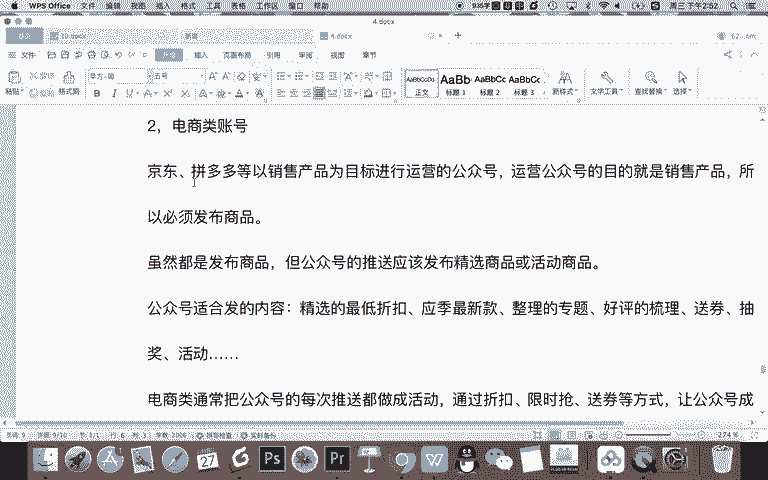

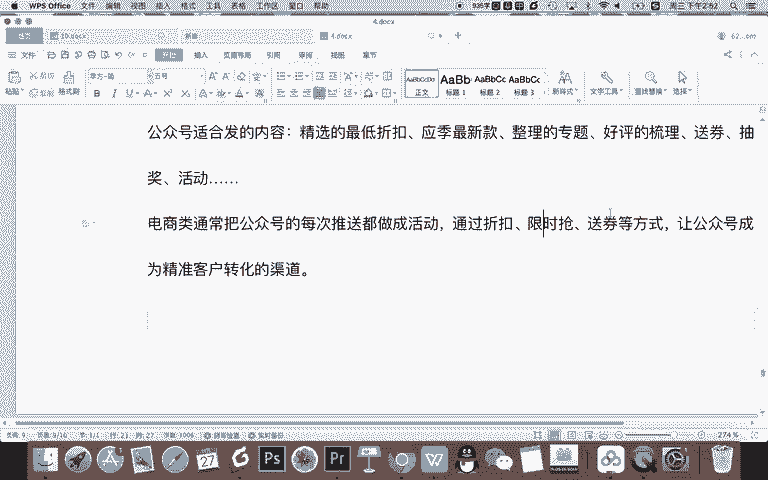

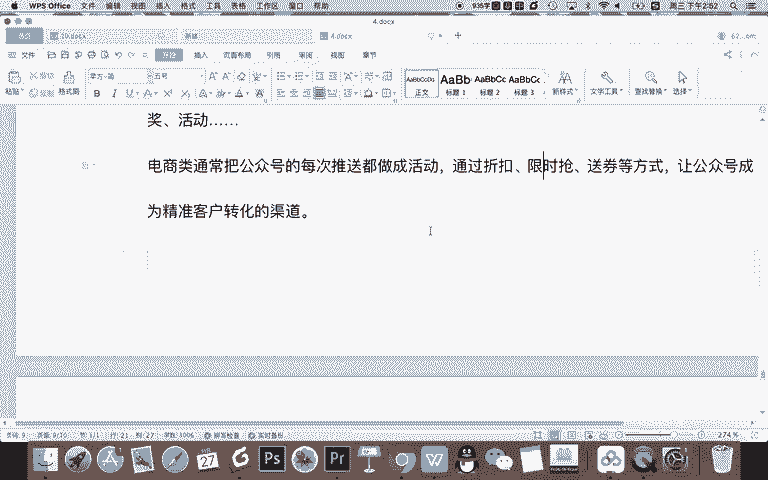

约等于用户就是你的订阅者，就是你餐厅的消费者，他喜欢吃中餐，你就做中餐，他喜欢吃西餐，你就做西餐。OK做好以上内容的规划之后呢，就可以按照我们基本的一个运营啊规划去发布内容了。

比如根据自己的经历去确定你的文章的数量，根据你的经历啊，还有你的需求去确定你的发文的一个频率。那还有呢一般看着你的根据你的内容放在晚上啊，或者说早上发。

一般通常啊鸡汤类的情感的励志类的都放在晚上或者由娱乐消遣来，放到晚上学习类的一些内容，可以放在早早上。因为早上大家更有积极的上进心。

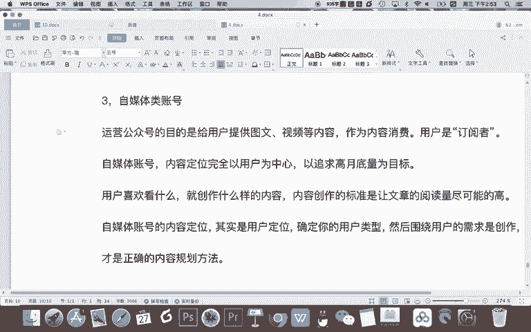

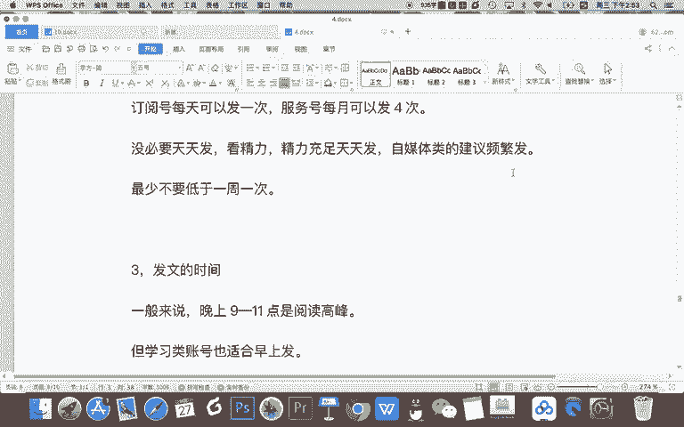

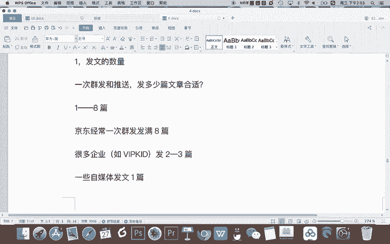

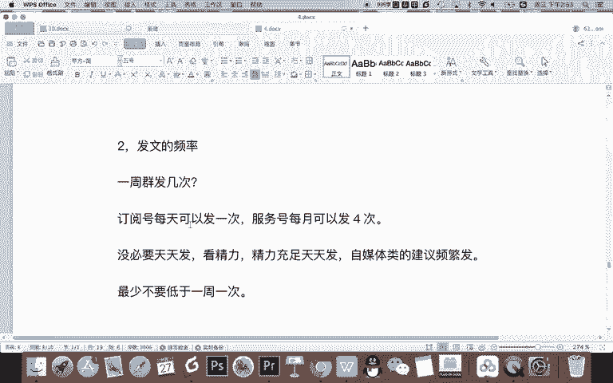

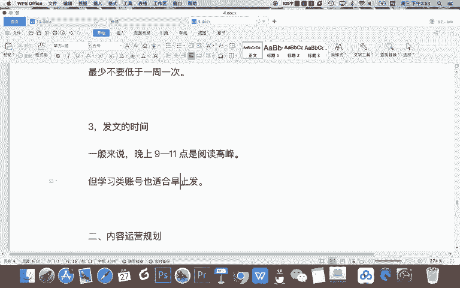

OK这就是我们本次啊对我们公众号内容规划进行的一个讲解啊，讲解这部分的内容是方便大家好好的分析你的公众号，能确定你的运营方向，然后呢确定你的运营计划，然后就可以很好的去按照你的规划和计划去做执行了。

把你的公众号运营起来。OK关于我们公众号运营或者说公众号内容规划的知识就讲到这里，我们下节课继续。

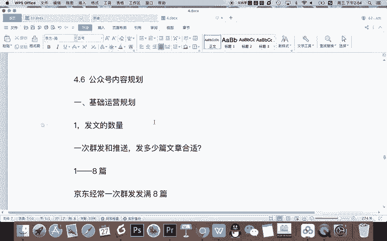