# 微信公众号运营视频全套 手撕运营 拳拳到肉 - P19：2.01-微信内容排版~2 - 达妹_达内教育 - BV1UvvvebEdT

他稍微显得什么？淡淡的灰没有纯灰。为什么呢？因为纯黑啊它是没有情绪的，但我的颜色淡一点，在视觉上冲击力会小一点，会更显得美观一点啊。因为我们知道啊中性灰啊，这个词它代表颜色是美观的。还有我们知道什么？

一般日系的风格，淡淡的红淡淡的灰，淡淡的绿是美观的。所以文字颜色呢，我也可以选择稍微的一些什么呀？接近纯黑的黑灰色。比如你看在这一段的时候，它就是这种颜色是不是稍微的美观一点。

那文字颜色呢也都在这里去选择就可以啊，这是背景色，这是文字颜色去选择那文字你看啊字色字号字间距，还有什么？还有5。

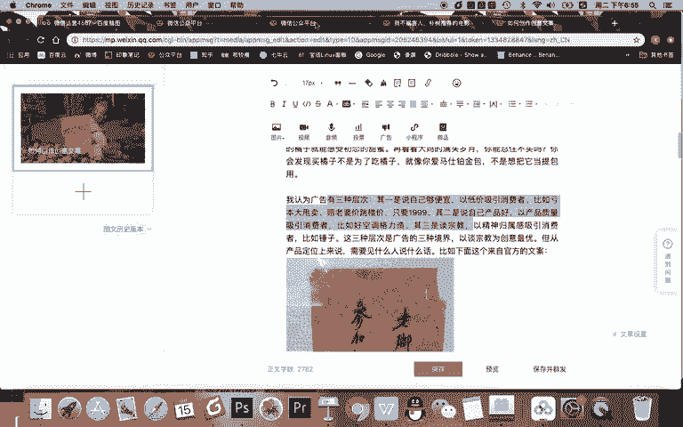

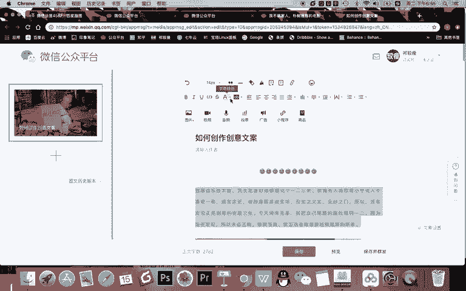

字体注意啊。公众号排版不支持。什么呀？选择字体也建议。是么使用默认。字体。

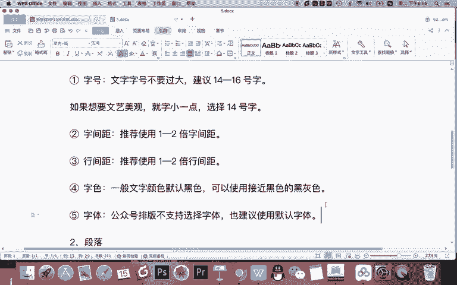

什么意思啊？你看。当你去选定段一段文字，你想去修改它的任何字体的时候，在微信这里面并没有。但是你说我没有字体，我就真的没无法修改字体了吗？不是的，你使用一些第三方的排版工具，它里面会带字体的功能。

你可以把这个文字的字体给它改掉。但我要告诉你的是，我们的用户。

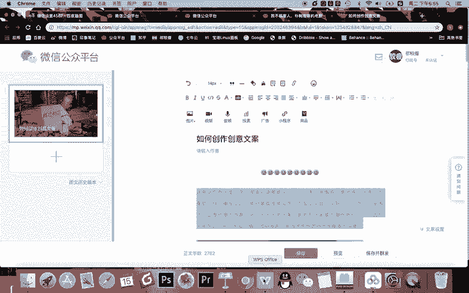

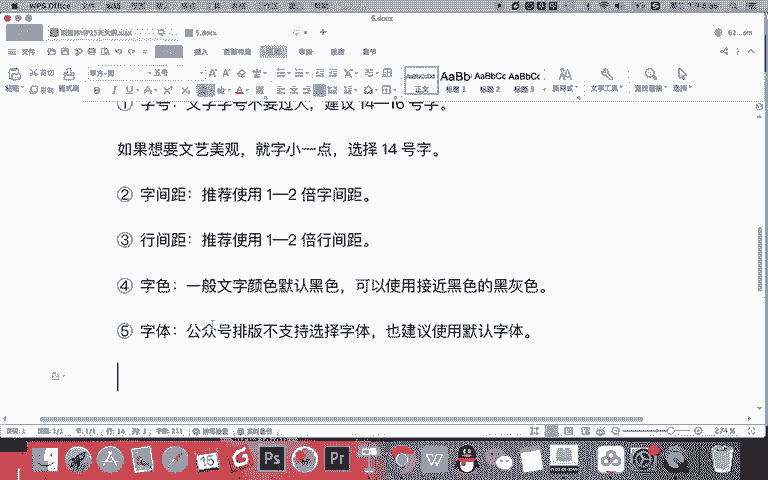

他习惯看这种字体的文字，因为微信里默认的就是这种字体，所以一般你不要轻易换啊，换的话会容易让用户怎样。

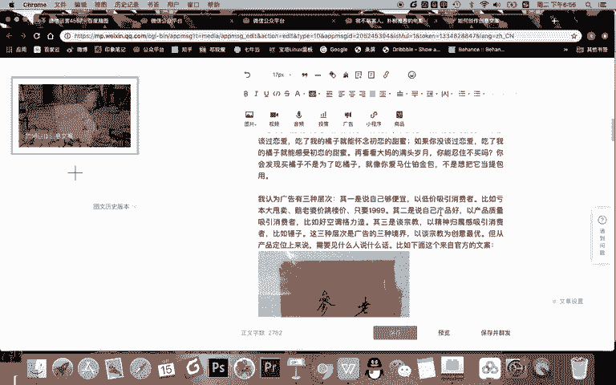

有一个。冲突感他他可能会转化他的注意力，所以我们就不要去改字体就可以了。所以关于文字，我希望大家记得最关键的就是字号和字监局。然后呢，你把一文字颜色这样去写好就可以了。那除了文字之外呢。

第二部分是段落的排版，段落排版也有技巧。比如看这里。

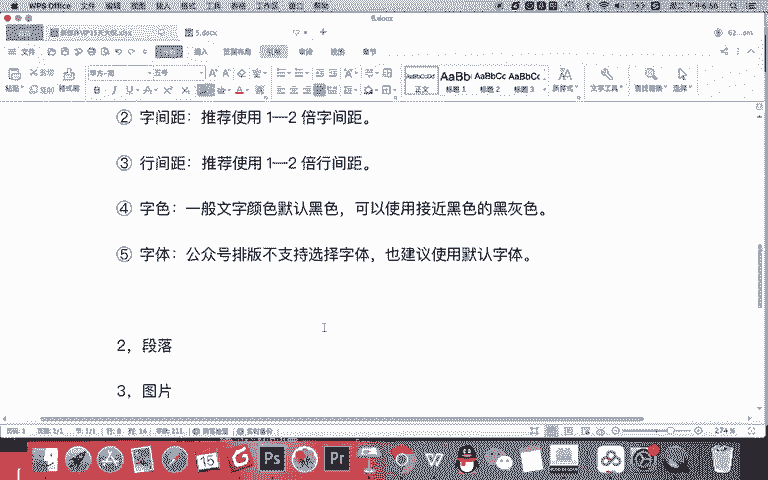

大家看这一些段落有什么问题。但是你看这个段落有什么问题？比如你看1234。

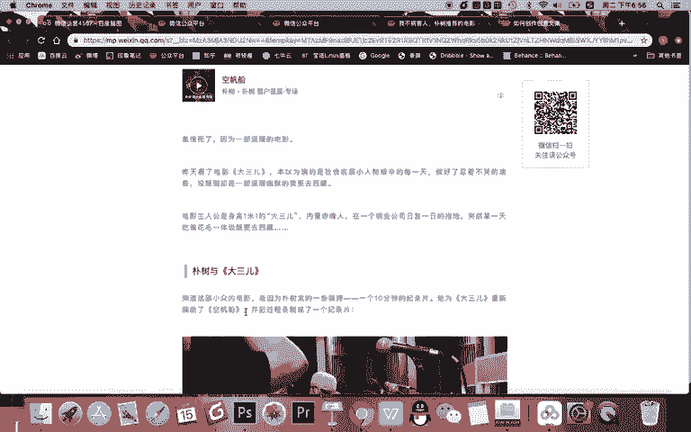

这里呢一段两段三段。对吧这里我感觉它不够美观，特别是还有这一段，大家想想这一段你在手机上是不是显的特别多。所以关于文字会有这样的一些注意事项啊。第一段第一个问题。

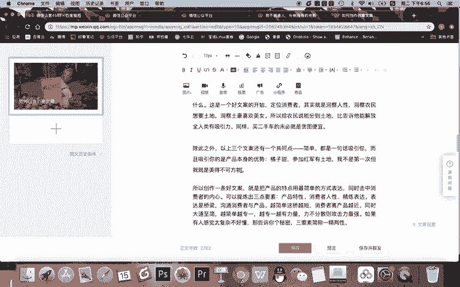

段落不要过长。一般建议。在手机上。显示。七行以内。

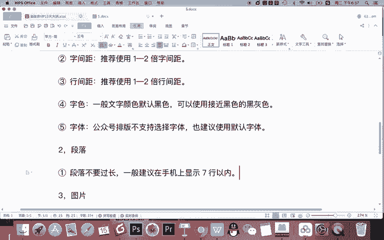

那什么叫手机上显示器号？你现在来看啊，这是在我们的电脑端显示的是四行多啊，那我告诉你，你基本除以2，它一般显示的手机上都得有七八行，那这一段都已经够多了。那如果这一段够多，那这一段是不是太长。

约等于手机上你一整屏都是一段内容，那会密密麻麻不美观。所以我建议段落文字要写小段。比如你看这里都是小段，对吧？三行。

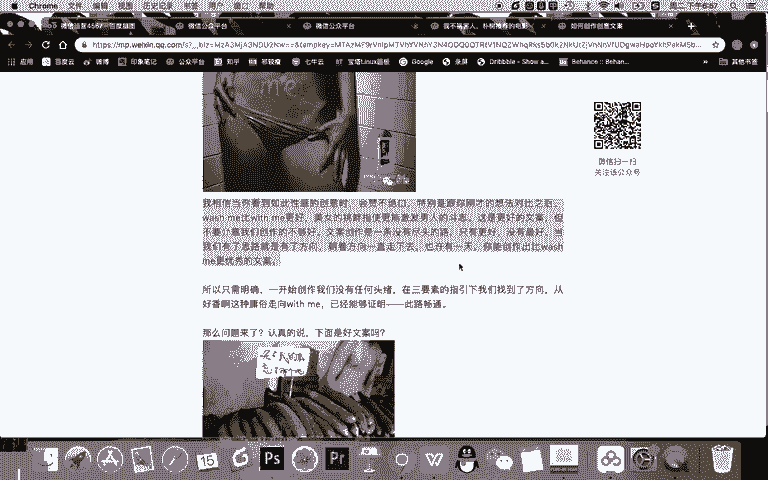

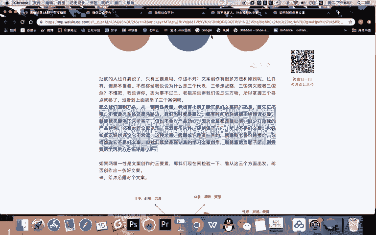

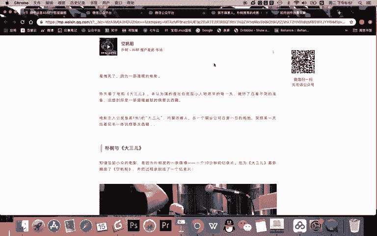

三行三四行的样子，那在手机上呢就是五六行的样子。其实已经不短了啊，你可以用小段。

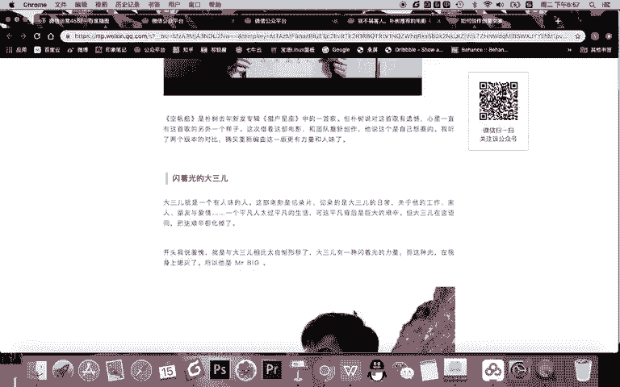

关于段落的第二个技巧。知道。互联网排版。断手。およ。空两个。

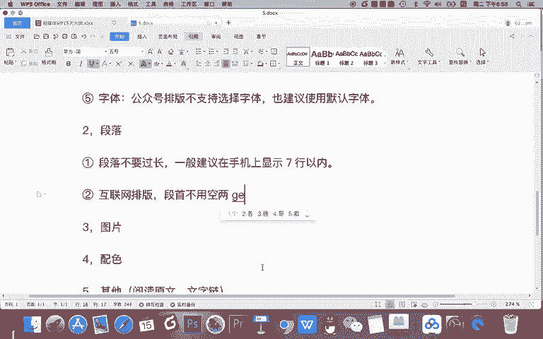

什么意思？你看我这篇文章呢，它的排版开篇。顶格的对吧？它顶格的这篇呢都是全顶格，我们并没有在这空两格，然后后面这些这是一段。比如说我并没有让这样是一段。因为这样的排版啊，首先在视觉上不美观？

如果你看我这样去选中它像一个方块啊，会更美观啊，如果是这样的，你看它前面有一个活，后面有一个口，然后就显得不不完整，不美观？你说老师我们从小学作文都要求去前面要空两个，那为什么现在不用空两个呢？

那因为我们有互联网盘有别的方法。

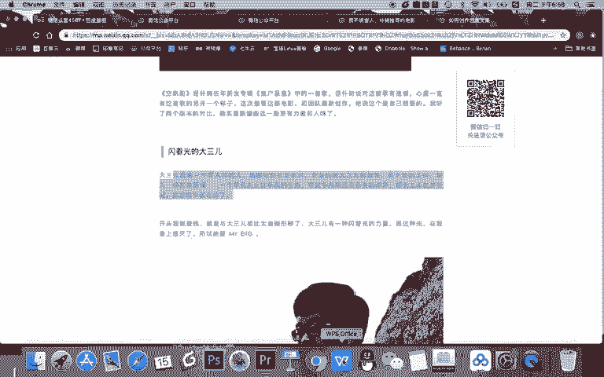

什么呀？断鱼段。空行区分段落。She。

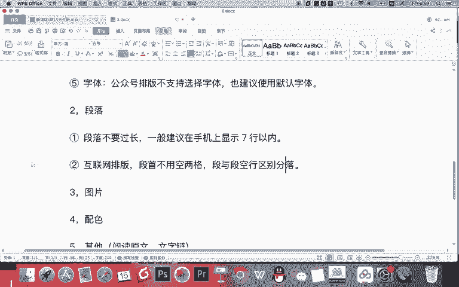

什么意思？大家看啊。当我们在小学写作文的时候，我们是在纸上写。我们为了让段一段区分啊，因为中间你不可能空一行，你那浪费纸，对不对？你需要每次断手空两个空两格，然后这样区分段落。但我们互联网排版很简单。

回车空行，只占用一个字符或者两个字符，就把段落区分的很开，你看都空行。那这就视觉上又分散又美观，而且呢就方块还是什么完整就更好看。所以呢段落排版不用断手空两个，我而且我希望你就别说用不用。

你就别空两格啊，这是一个要求。

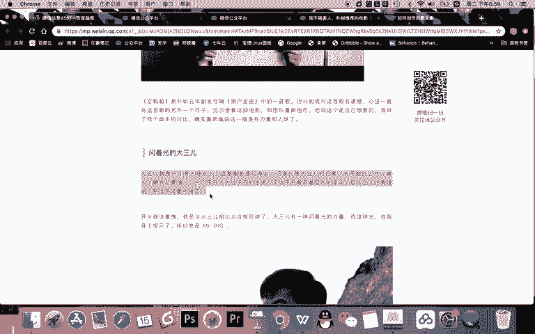

好，关于道路排版的第三点，记得。断与断之间。段落。与图片之间。图片与。图片。之间。所有什么呀？不同结构的素材之间都空一好。

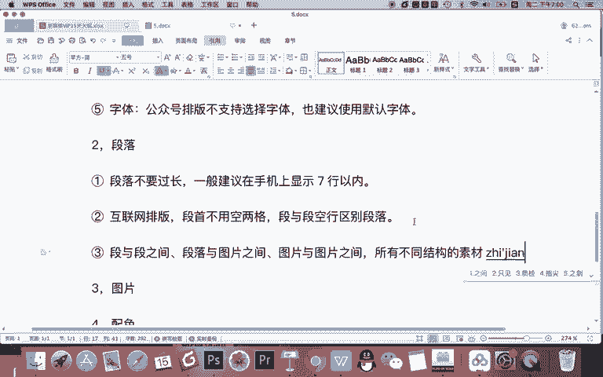

哎，这是一个非常重要的技巧。比如你看。

我的这篇文章，首先第一个图片跟音乐空行空行。第一句话跟下面空行两段之间空行段落和小标题空行，所有的都空行。

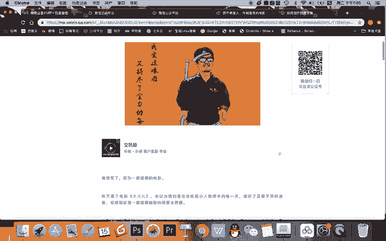

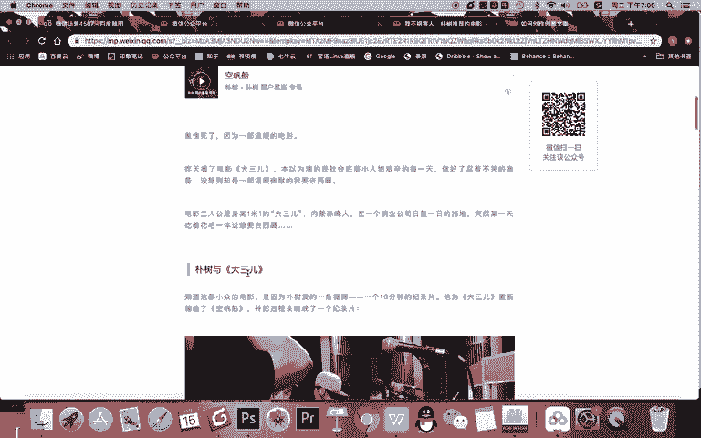

对不对？

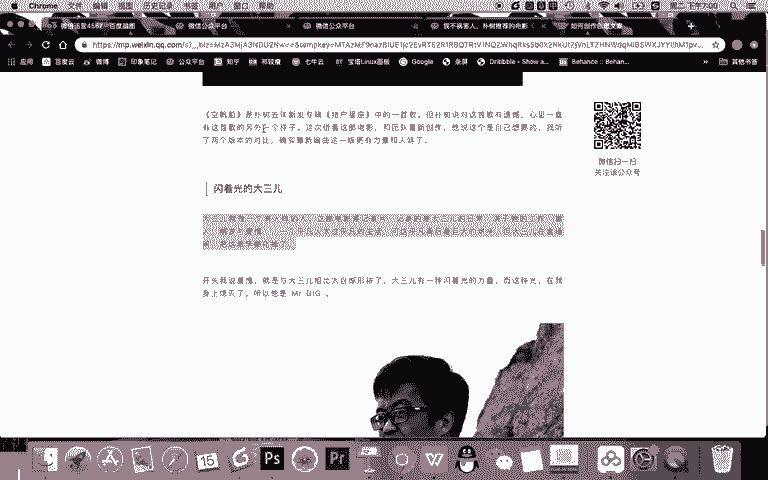

你看现在也是。但如果你不空行的话，你看什么效果啊？你看图片跟文字紧密的挨在一起，它就不美观。这段落又长又紧密的挤在一起，视觉上会有压迫感。所以呢我们进行段落的排版就要去空行，用空行让段落怎样。

它结构清楚啊，分散排不被排版的又更更加分散一点，这样视觉上没有压迫感，会更美观。第四个技巧啊非常关键。断落鱼。段落之间尽量。插入图片。形成图文结合的效果。最好是。美屏。都有图片，什么意思啊？

你看这里就是一个错误的示范。

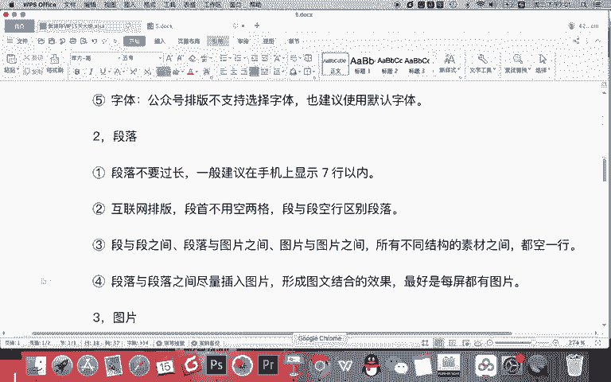

Yeah。比如说在这里有三段。连在一起，那么在手机上显示会什么效果？就是一整屏的内容都是文字。不行的话，你看一下。

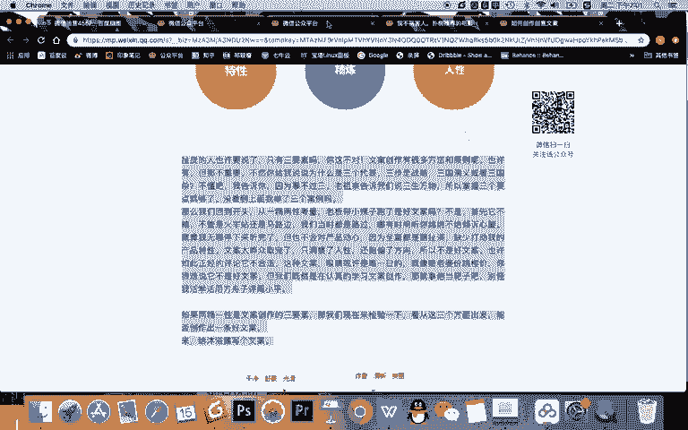

啊，现在没有办法进行手机预览，我就不给大家截图了啊，就是你想象一下，也会知道你想这么多的文字在手机上变成更细，对吧？只能显示这一部分，这竖着显示满屏都是文字，那特别的不美观。我希望大家排版出来。

效果就是两段之间插入图片，或者尽量多配图，形成图文的效果，什么是图文的效果，就是不管你看啊我这篇文章，不管我怎么翻页，每屏都有图片，有没有图片，有有没有图片，有没有没有图片，有有没有图片。

有看有图片有图片，你说这里没有图片，但是你看小标题，还有这个结构，它已经结尾了。你看这里又有图片，对吧？就是一篇文章啊，你记得我们现在是读图时代。

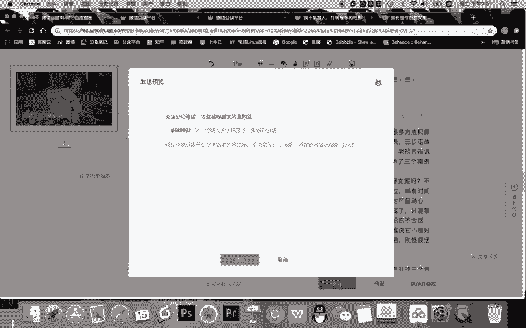

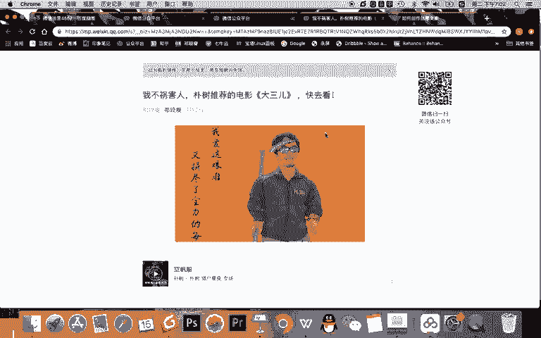

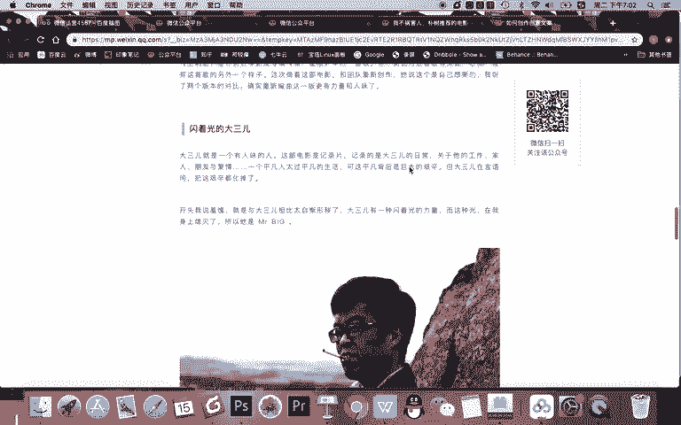

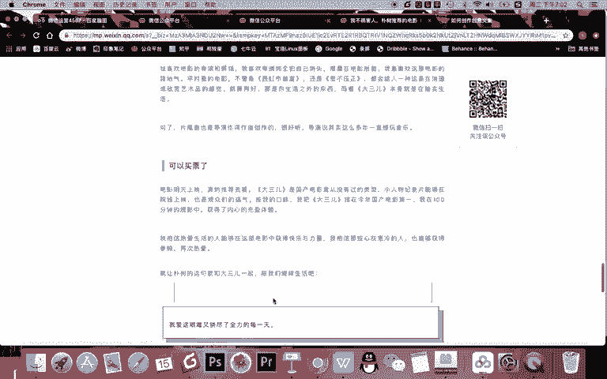

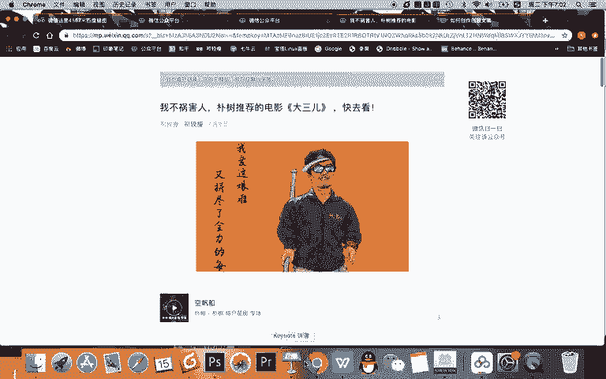

哪怕你写的是文章。也不要全是文字，尽量多配图，尽量用小段尽量段一段之间去插入图片，形成这种美好的效果。O以上是我们关于段落部分的一个。

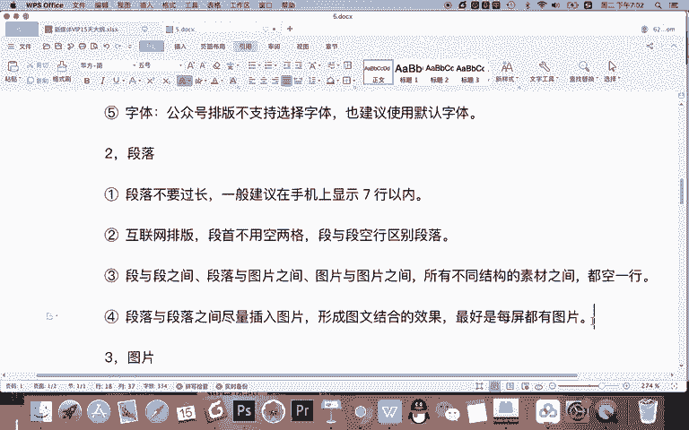

啊，排版你的要求就希望你写小段，然后段落空行，段落，不用空两个多配图，然后这样就OK了。

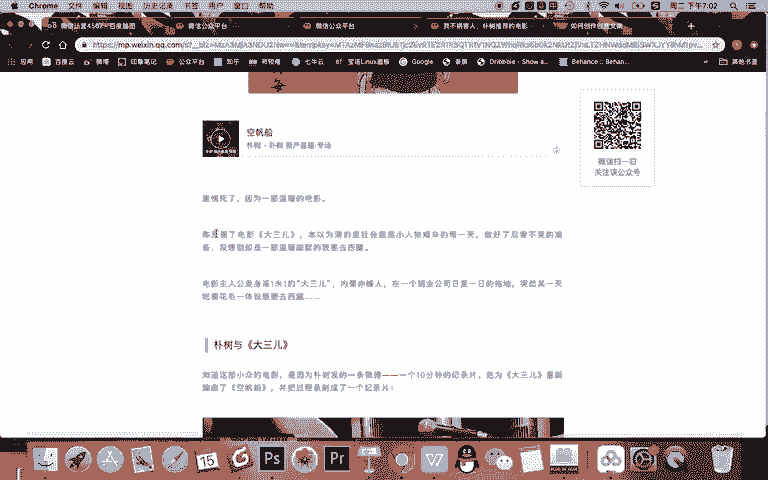

好，关于图片的要求啊。第一个是基本要求。什么基本要求呢？就。图片质量。Yeah。过关。不能咬。水印。不能不清晰。不能还有什么什么呀，侵权等啊基本的一些要求。就是你去做一个配图。

你首先要找高度的什么清晰的照片，没有别的机构的水印的照片，还不侵权的一些照片啊，这是第一个基本的要求，这个就不用说了啊。那第二个要求啊，建简易简易一点啊，二维码上二维码图片上。不能有。水印。

这个是一般新手会犯的一个错误，什么错误来看这里。

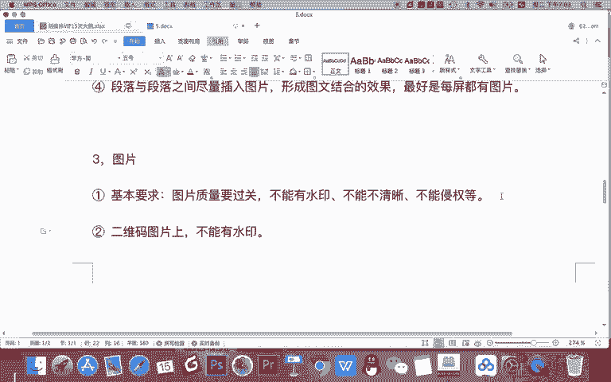

很多同学哎刚开始学排版去配图了，那每个图片上都有个水印没有关系，但最后啊他做的这个图片，二维码也是一个图嘛，这里也有水印，那就不对了。二维码上带个水印多难看，对不对？那怎么取消呢？我们有昨天的课程。

其实有讲啊，它怎么取消很简单，在账号详情，也就是公众号设置，这里有一个功能设置，功能设置里有不添加水印，然后你就可以设置它，不去添加水印，这样的你的二维码上面和所有的图片上面都没有水印。

一般啊你说我自己做的图片，我想保护不的我的版权去添加水印，可以加上，但记得二维码下面你要多。

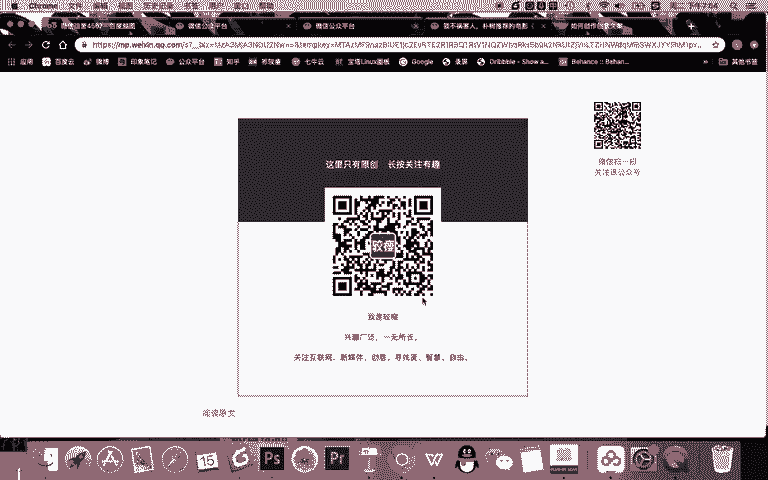

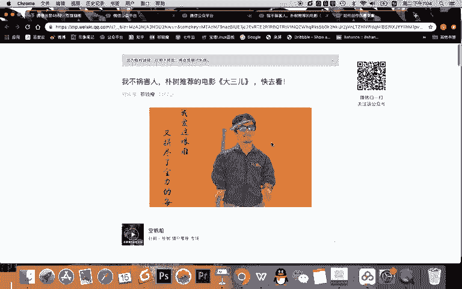

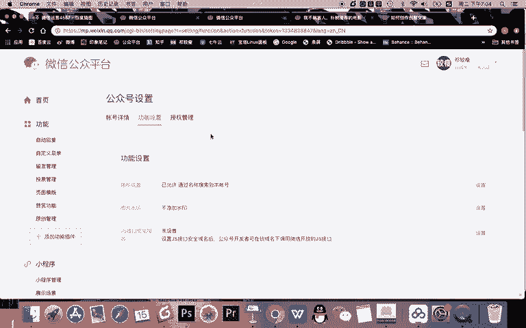