# 微信公众号运营视频全套 手撕运营 拳拳到肉 - P20：2.01-微信内容排版~3 - 达妹_达内教育 - BV1UvvvebEdT

留一些空白，让去加水印啊，不要去印到这个二维码上面。

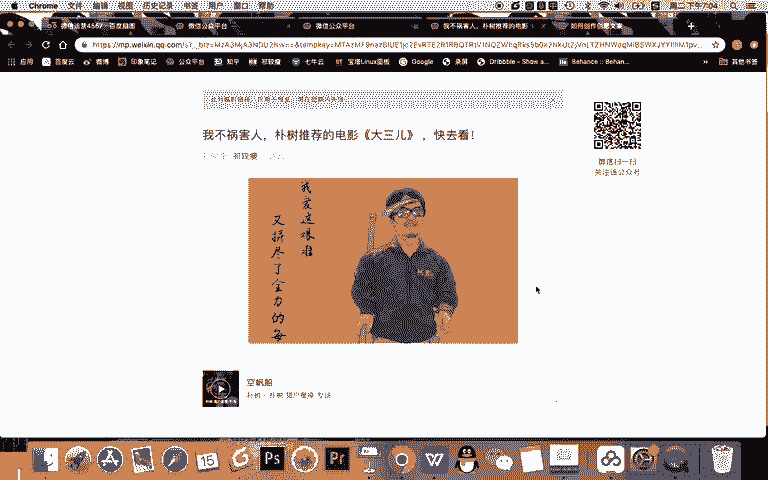

就是在这里黑色二维码上面验证水印是特别难看的。

O关于图片啊，这是第二个要求。第三个要求。Okay。注意图片。风格要统一，这是针对。同一篇文章，你的图片风格一定要统一。

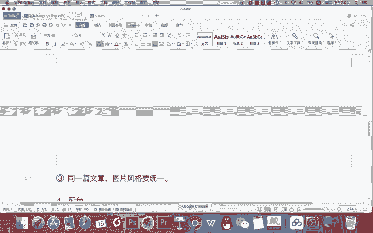

比如大家看这篇文章的图片的风格基本都是计时的专业拍摄的一种风格，对吧？那我要告诉你的是，你看这篇文章，它的图片风格一会儿是这样的，一会儿是这样的，一会儿这样了，一会又是这样的。你看这个图片质量不过关。

对不对？都不清晰，记住各种风格的图片混在一起，导致整篇文章，它的视觉，你看还有这样的，还有这样的啊，导致整篇文章的视觉就有点怎么风格杂乱就不美观了。所以呢配图有一个基本的要求。

就一篇文章的风格一定要统一。

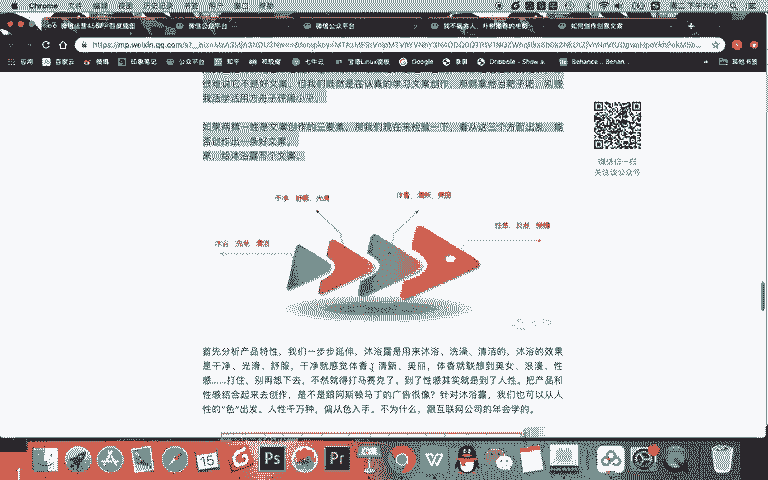

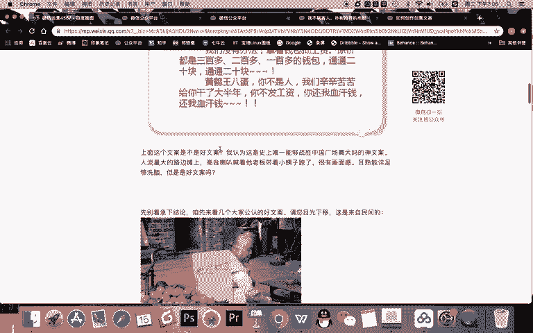

第四个关于图片的要求就是尽量选择。横长画什么呀？左右顶格的。

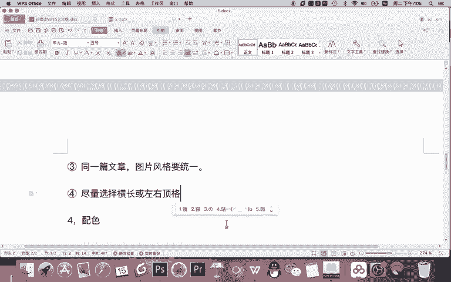

图片什么是选择横长图片，看这里。

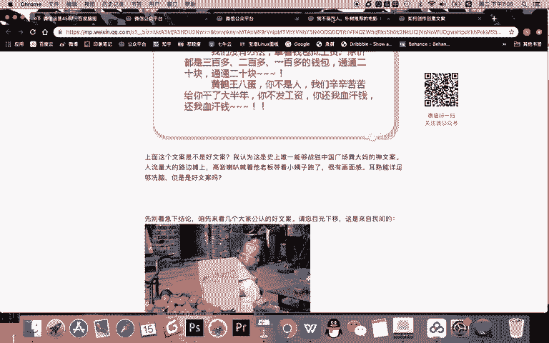

嗯。这篇文章这个图片就是竖着长的图片。那你想同样，竖着长的图片在手机上显示会是什么效果？

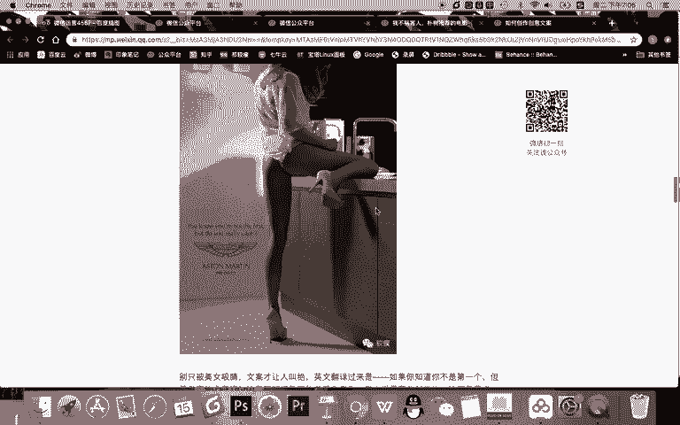

对它会有一个问题，就是这个图片会放大顶到左右两侧手机两边。那这个图片占了一整屏，是不是哎你看文章就会影响，这是竖长图片。那现在有又有这样的图片，你看这个也说了。

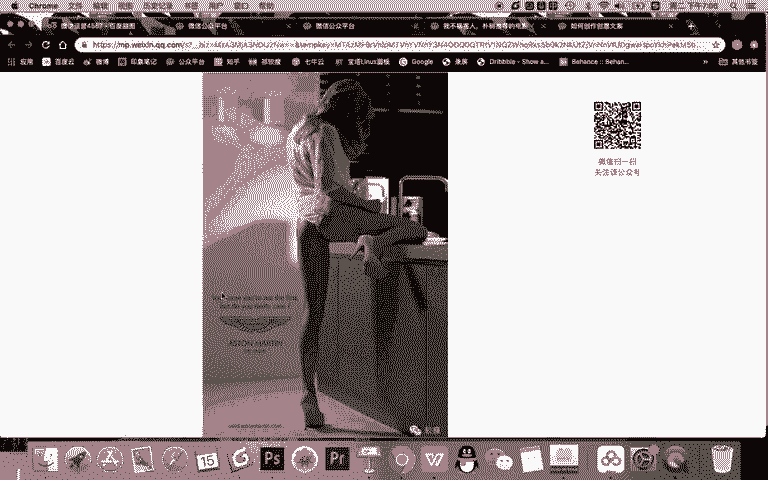

还有这个小的那约等于它这个小图在手机上就会导致这个图片旁边有空白，这边有空白，这边有空白，但是文字没有空白，那就是一个豁牙一样的东西就不美观。那尽量选择横长或左右顶格的什么效果呢？就这样的。

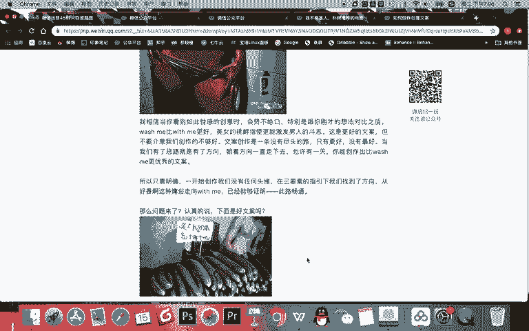

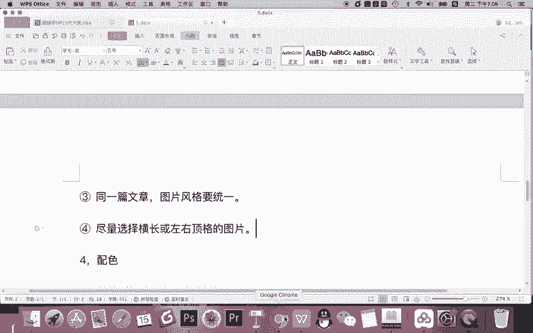

看横着长文章的长度，不管是左右怎样，这个图片怎么长，最后都会被左右压缩的这个顶着手机的左边，这个顶着手机的右边，你看这个视频也是这图片。

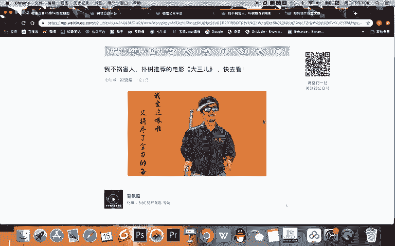

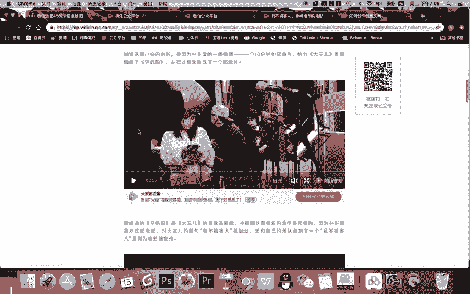

你看虽然这个图片尺寸不一样，但是你看左右它会在手机上都被压缩的一样长度。所以在手机上显示这三个图大小一样，这就是横长图片的好处，左右会被顶格顶着手机的两侧被压缩。那么形成的视觉效果呢就会比较统一啊。

就是图片就比较美观了。

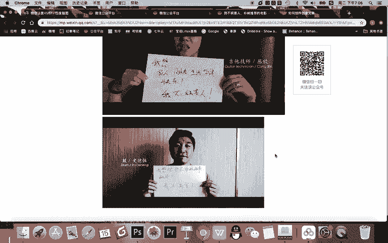

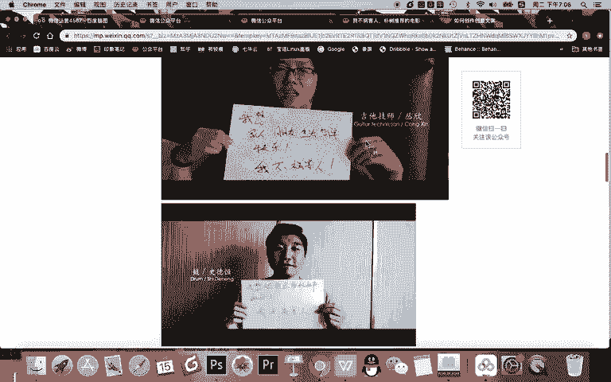

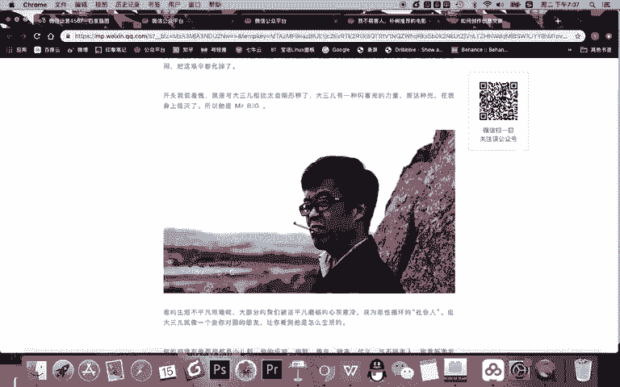

啊除了以上的技巧之外呢，给大家讲一个小小的技巧啊。Yeah。可以。多选择。动驼挡。说材。让文章更。

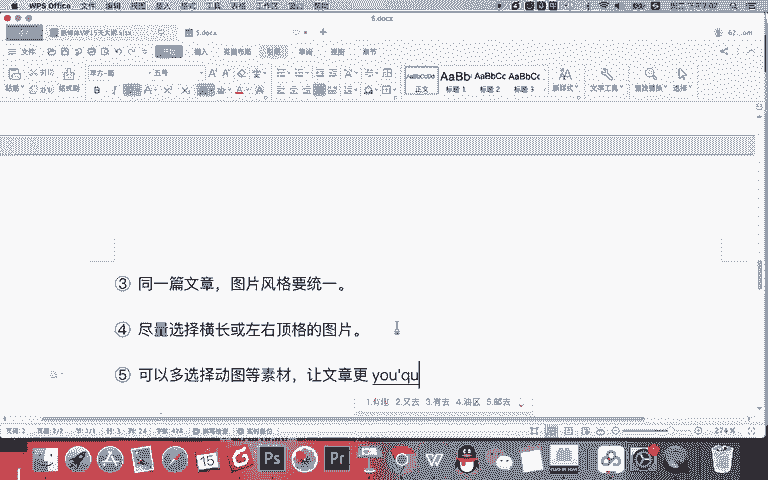

有趣啊，就是可读性更强，这个就不用多说，就是静态的图片肯定没有动态的，有吸引力。但也不要说我动态，我视频更动，但记得看视频是比较重的一个行为啊，它一一段一段那么长也不是特别好。

所以呢在图片这里就尽量的满足以上要求就可以。好，O是配色啊，另外第四点就是配色了，在配色上呢比较简单啊，注意第一个技巧。

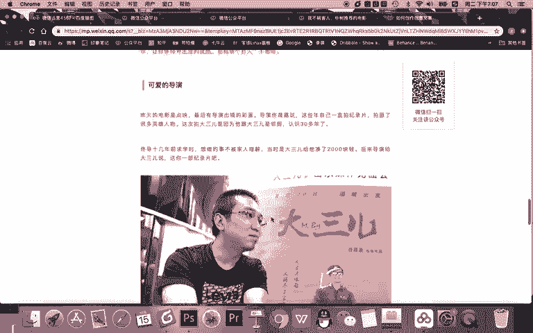

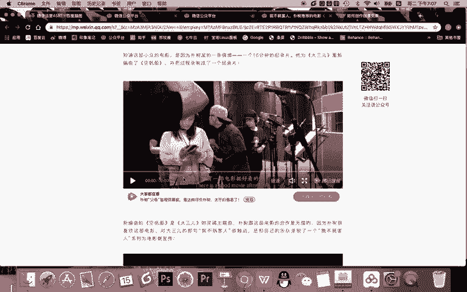

全文尽量不超过三种。配色。那这个没什么可说的啊，因为多了会乱。第二个记得。Okay。正文统一一种颜色。小标题。统一。

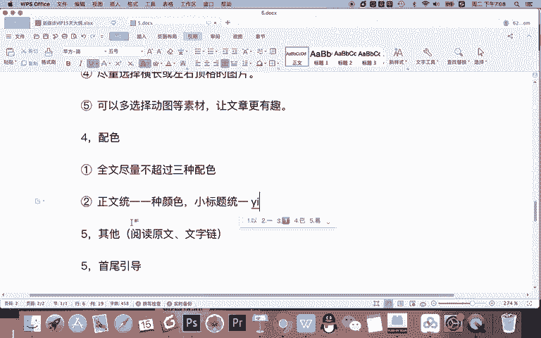

颜色。什么是小标题统一一种颜色？首先正文不统一一种颜色，不用说，你千万不要一段红一段绿一段黑啊。那小标题呢就是这里的小标题。

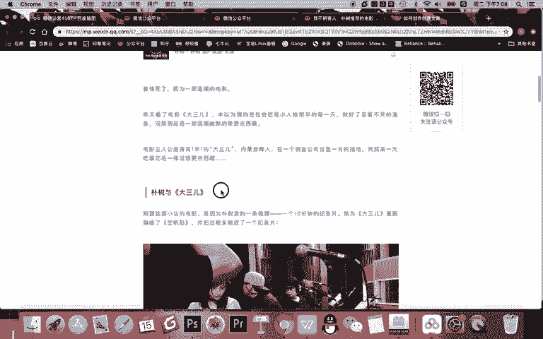

你看我的小标题都是用这样的紫色，它就会风格统一了。在配色上你就不要去乱用配色啊。

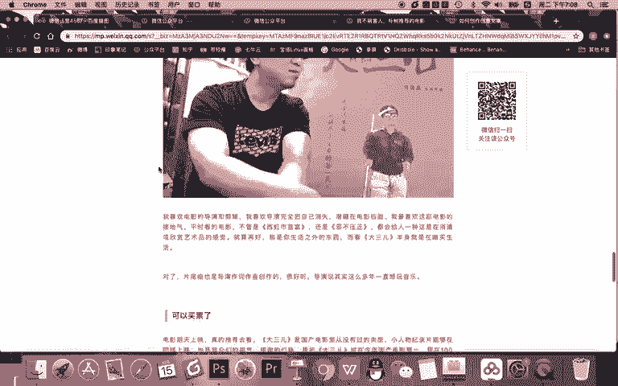

还有第三点。记得。配色或者说颜色。风格的选择与文章。风格或公司logo颜色相。打皮。

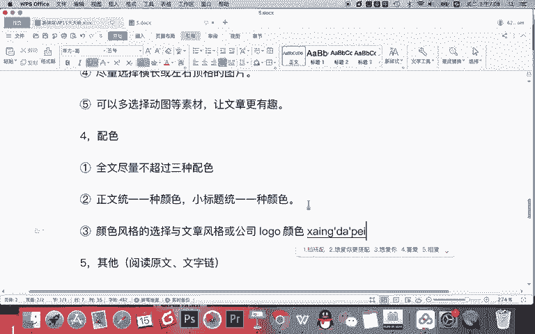

这是一个基本的技巧。就是当你去做文章的一个排版的时候，你选的这些素材模板，它的一个颜色的风格要跟你的公众号的整个的风格定位相符。比如我这篇文章讲的偏文艺一点，那我的配色就不能大红大紫大绿。

我用这种淡淡的紫色会好一点。比如你们公司的logo是蓝色。那么你们经常在配色的选择上可以包括小标题，还有一些素材的选择，就可以选用蓝色啊，这样呢能形成你的品牌的调性啊，品牌的风格，这样会比较好一点。

配色没有特别需要去讲的东西，你记得就是配色。

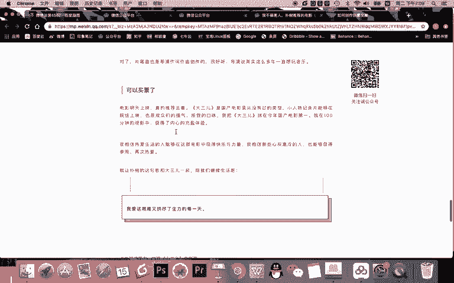

数量要少，正文其实就两种最好啊，正文一种小标题一种。然后呢，正文里面的一些重要的字句可以一种，甚至是只加粗就可以啊。然后这是整个的配色。在其他里面我需要给大家讲一点。第一。尽量。使用小标题。分解稿。

什么意思？就是当你写了一篇文章特别长，有十几段的时候，你千万不要一直写一直写啊，就最好用这种1234的小标题，把文章的结构分成12345，这样用户看起来会更加的一个美观吧。哎呀就是一是美观。

二是让用户读起来视觉不疲劳。

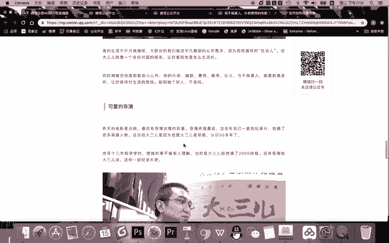

第二点。除了小小标题要分结构之外啊，第二点就是。不要。使用。过多的。模板。什么去使用模板啊，这个我们下一个会讲我们很多排版，比如说。

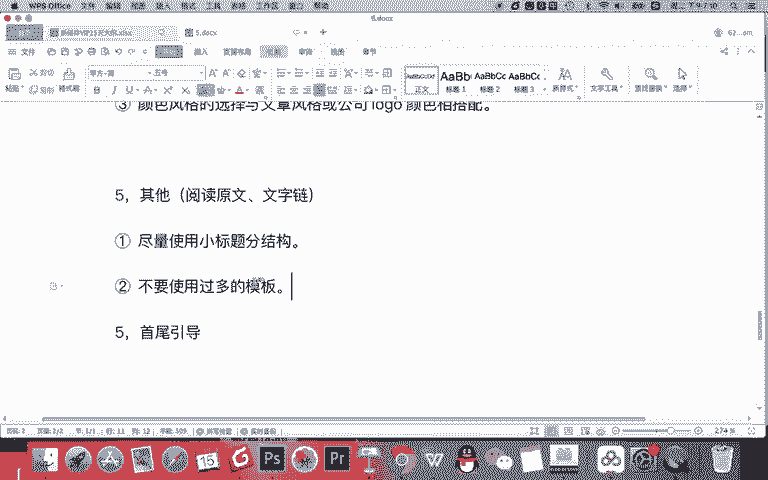

像这里这个素材，它就是一种模板素材。那你如果一篇文章中用了特别多的一些素材的话，那么它的效果或者说它的用户看起来就会有点眼花缭乱的感觉就不是特别好。那还有呢。

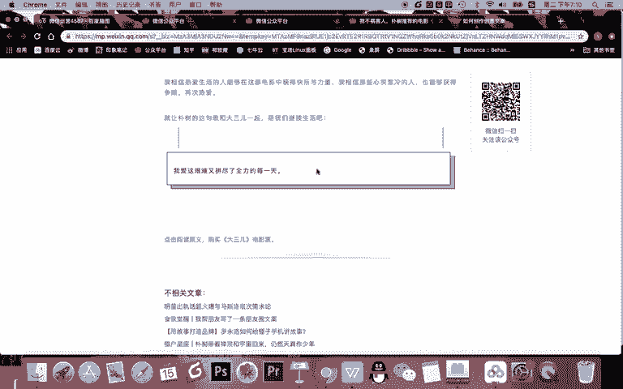

第三点。记个首尾。结构要呼应。

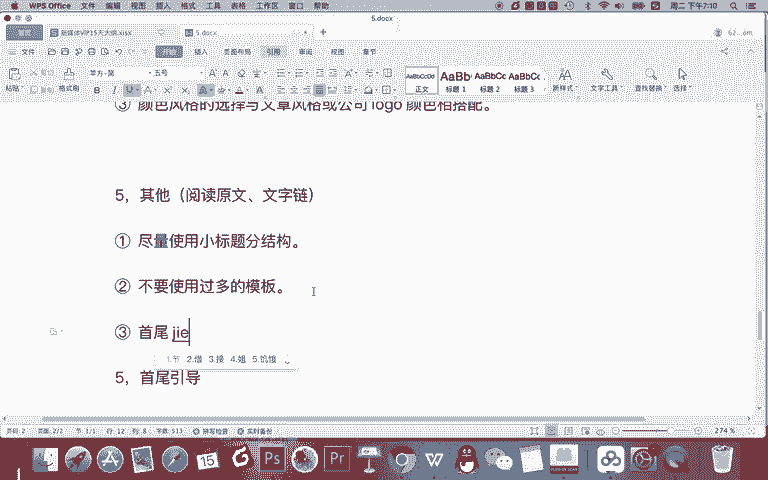

就是讲什么呢？比如说当你写了一篇文章，在开篇有一个引子的时候，比如我这里没有啊，如果开篇有一个引子的时候，你结尾也可以去用一个引子稍尾呼应一下啊，这样呢整个文章的排版会美观一点。

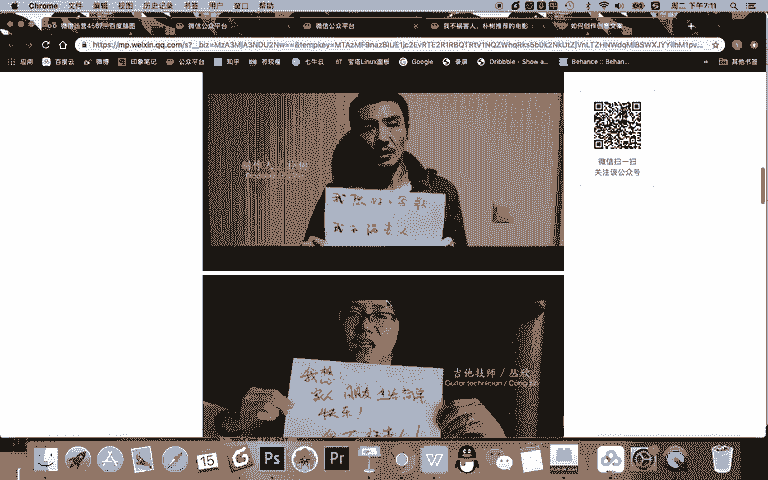

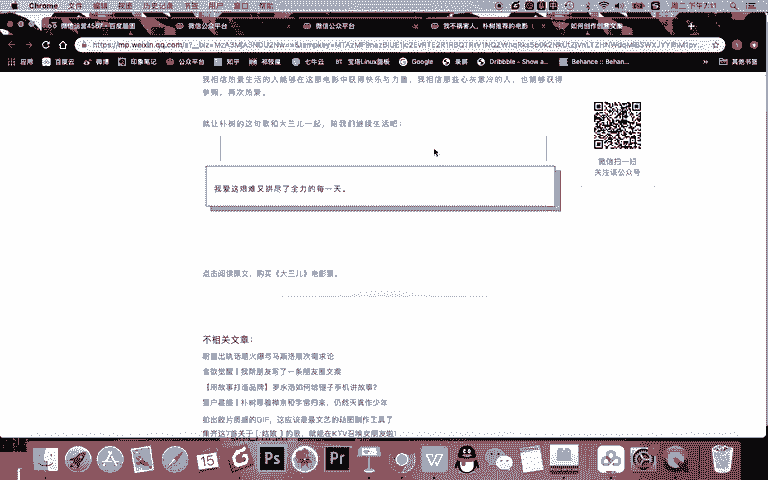

还有第四点。第四点，我先把这个首尾引导，我们下节课在模板给大家讲，我这里也写了这里。尾部。二维码。引导怎样要选用有文字介绍的方便。蒸粉。什么意思呢？你看。

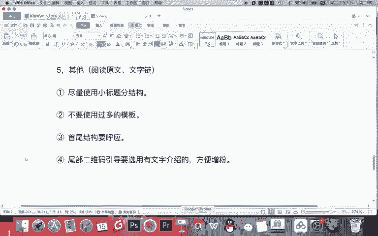

我的这个二维码是放在这里，但是呢你看这里有一句话是让大家关注。其次呢我还有去介绍自己的一个内文字内容。但是呢在我们使用一些排版工具，它里面会有一些二维码模板的时候，有些时候就是只有一个二维码加上四个字。

长按关注。完蛋。你想人家看了一篇文章，你就让人家关注你，你又没有介绍你是谁会有关注吗？不会，所以呢我建议大家选择的二维码，就是那个什么呀？有文字的一些二维码素材类型。这样呢能方便增加你的一些关注啊。

让用户有一个更好的阅读体验。

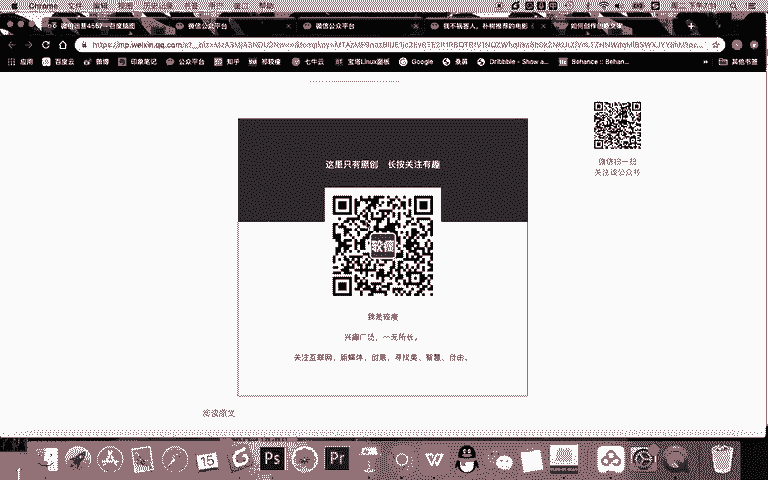

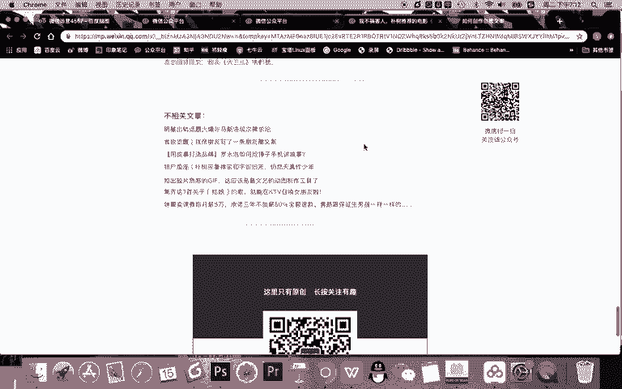

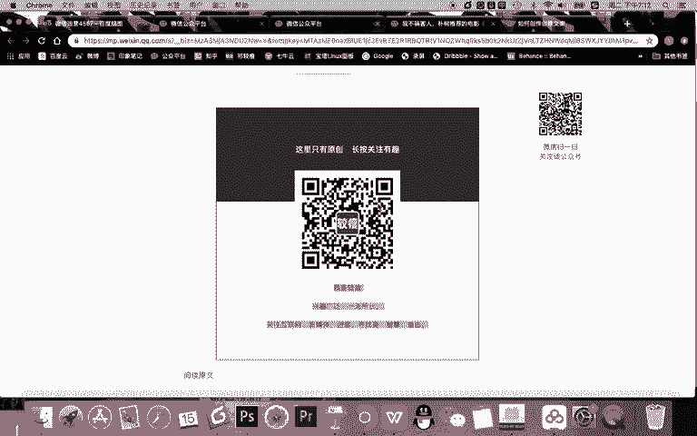

OK这是我们第一节课关于排版的内容，我们就先讲到这里。下节课我们将给大家讲讲这些文字链，还有二维码设置，甚至还有其他的一些排版的注意事项啊。O排版的内容需要两节课来完成。我们今天就到这里。

感谢大家的学习。

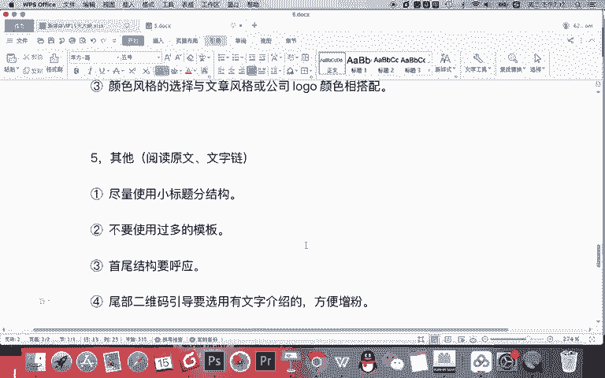

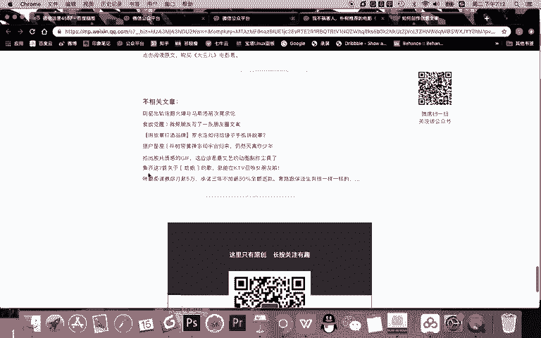

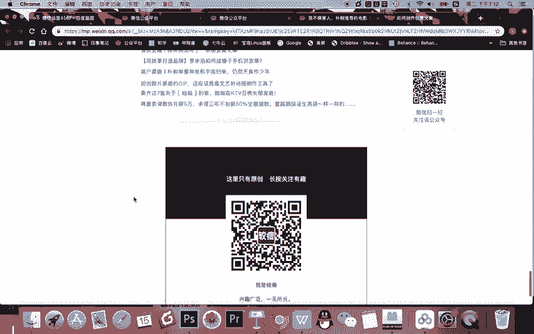

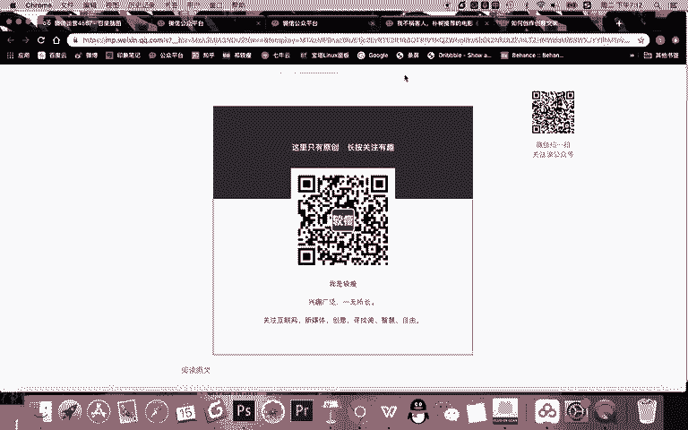