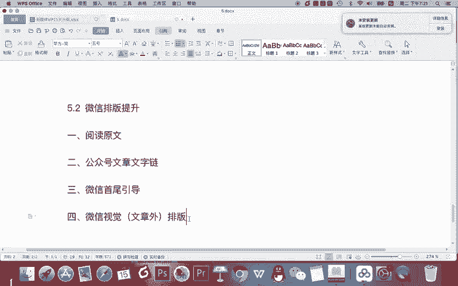
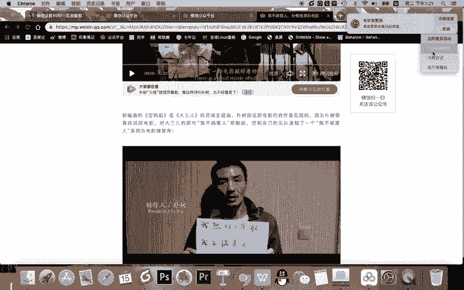
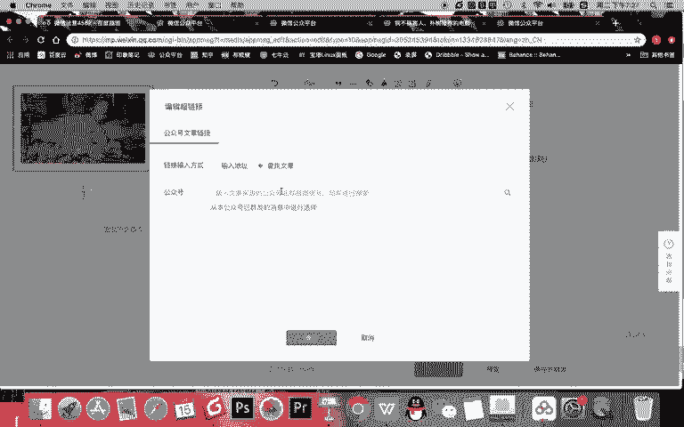
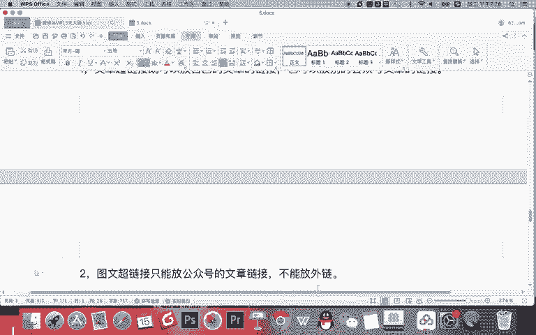
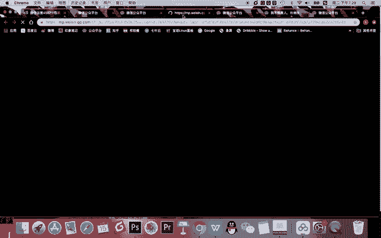
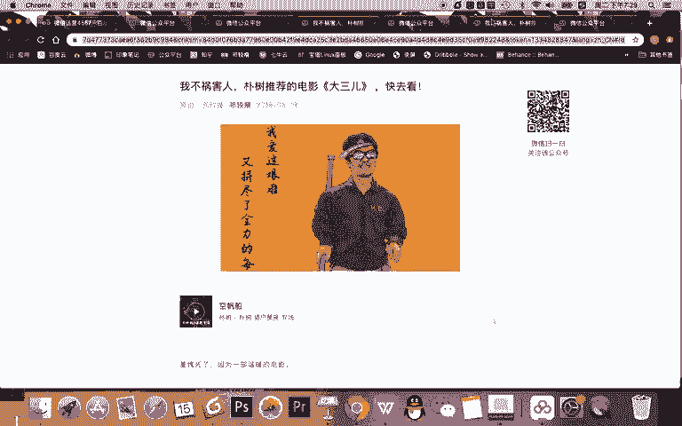
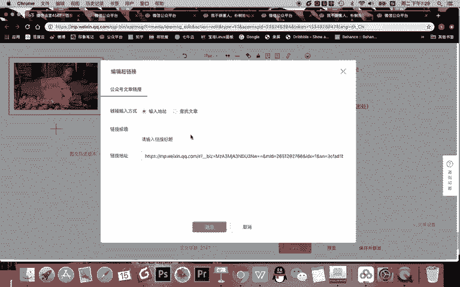

# 微信公众号运营视频全套 手撕运营 拳拳到肉 - P21：2.02-微信排版提升~1 - 达妹_达内教育 - BV1UvvvebEdT

同学们好，今天我们来学习微信运营提升第二节课的内容，也就是我们微信排版的提升版本内容啊。在上节课呢，我们给大家讲解了微信的文章基础排版，就是一篇文章，你的文字图片呀，还有段落文字等等内容怎么排版。

那现在我们给大家讲啊，其他的一些内容，总共包含以下几个知识。第一。会给大家讲讲啊阅读。原文设置。Okay。第二个呢会给大家讲什么？微信文字链啊，或者说叫文章的。

公众号文章文字链为什么说呃不不不不说成是微信文字链呢？因为我们在微信的基础操作里面，我们给大家讲过什么呀？在自动回复这里设置文字链啊，但是今天所讲的这个文字链是指微信公众号文章的一个文字链。

第三个内容是指。微信首尾。影导。就是一篇文章啊，你的文章的开头可以弄一个，欢迎关注，结尾可以弄一二维码。但是这个东西怎么放啊，这几个这几个基础的知识点我给大家讲。第四呢会给大家讲讲微信。什么呀？视觉。

排版或者叫什么，你可以说这个视觉指的是。文章外。排版。

也也就是说，一篇文章除了要去把里面的内容去排版好啊之外，我们其实还应该对其他的一些内容排版好。比如什么是视觉，视觉，就是说你还没点开这篇文章之前你看到的那些东西，比如有。

朋友圈能看到什么？标题头图对不对？还能看到什么？比如说还有在最后一篇文章转发到微信群里，还能看到什么？摘药啊，这是这三点。OK我们以上这些内容会给大家讲解好。那最后一一点呢，其实会给大家讲讲什么。

第五点啊，就是会给大家讲一下微信排版工具。最后第六点就是。微险。排版流程啊排版工具呢比较简单，主要是操作类的啊，排版流程呢是希望大家建立一个科学的排版的一个流程。等以后你运营你的或者撰写你的文章的时候。

按照这个流程来，你减少文章排版的失误。OK首先我们来看阅读原文。那什么是阅读原文呢？比如看这里这是一篇文章，这篇文章呢，在最下面有一个阅读原文，一点，大家看。一点就去到了外面了另一个链接，对吧？

去到美团了。那么为什么我点这篇文章的阅读员会去到美团呢？因为其实首先啊。公众号文章都带一个功能，叫阅读原文的功能。比如在这里在文章设置里，最下面你一点击阅读原文就可以输入链接啊。首先是这样，你理解。啲。

😊，阅读原文不是真正的。幸わ。而是可以放。任何链接。这个没有问题啊，你需要记得就行了。这很简单。你不要说老师我这篇文章没有原文，我刚写的，我是不是不用放no，你记错了。

阅读原文呢不是为了放这篇文章的原文，而是放你想推广的任何链接。比如你们公司产品的地址，APP下载的地址是甚至公司的商城都可以放放的方法很简单，只要你打勾了，阅读原文，这里输入链接啊。

就比如说你看我把这边链接。放在这里。啊，临时预览链接，比如说我就放一个。Yeah。百度的对吧？你看它就有一个百度的链接，用户到时一点击阅读原文就能去到百度。那么放阅读原文放链接很简单啊。

但是呢阅读原文你一般需要有一个什么？第二点。甚至。阅读。原文引导什么是引导？记得在文章的底部。写一句话，让用户点阅读。讲文病。告诉用户能。得到什么？OK看这里啊，我这篇文章有一个阅读原文。

但是你不要放个阅读原文，因为用户看完这篇文章并不知道阅读原文去到哪，所以我会在阅文章的最下面告诉他点击阅读原文能购买这个电影票，对不对？所以你看这就阅读原文的引导。那引导一般放在哪啊？3。阅读原文引导。

一般放在。文章的最后或。什么呀。二维码的最后是什么？是二维码的？最后，一般一篇文章你写完之后，最下面会放二维码，放到二维码的下面吧，我再给大家标注一下。也就是。文章的最后一行。

OK首先我这篇文章看完之后啊，我这里放一个阅读原文，他看完之道啊，点阅读原文能买电影票，它就会往下翻点阅读原文。还有不放这儿还能放那，可以可以把这个链接放在这个位置。当它翻翻翻翻到最下面看到二维码。

下面，你还有一一行字，点击阅读原文可以干嘛干嘛？那什么时候放这里，什么时候放这里呢？我一般会按照这样一个标准。如果我的这个阅读原文的地址跟这篇文章有关，我就让他在文章的下面。但如果我阅读原文的地址啊。

访文的地址跟这篇文章毫无关系，那我就把这句引导的话，放在整个文章最最下面，也就是二维码的下面。比如说我这这个内容是购买大三的电影票啊。我这篇文章是关于大三的，所以我就跟它有关，我就放在这儿。

但如果我每次文章都写下载APP的一个通知，跟文章没有关系，那么我就把那个引导放在最下面啊，这是阅读原文，添加的方法很简单，就是在微信编辑后台在这里点击插入啊一个链接，点击阅读原文勾选。

插入一个链接就能够有阅读原文了。在这里比如说我取消，它就没有O这是阅读原文。那公众号文章文字链是什么东西啊。就是这样一个东西。比如。你看到很多公众号，看到下面它都会有一些文字链引导。

让你能够去到其他的文章。比如。我一点击，我去到另一篇文章。对吧然后呢，你看啊我再去找别的内容。任何一个内容呢，我都可以去访问一篇文章。是吧比如你想拍出照片是吧？就是另一个。对吧这是法官一。

那首先这个是什么？这就是微信文章内部的文字的设置方法在哪呢？在在这里。在文章中啊，在微信里排版，你这里有一个超链接。抄链接放在哪，比如你看我放在这文下面，比如我先把这些抄链接删掉，我把鼠标放在这里。

我点击超链接，我就可以输入一篇文章的地址啊，并且输入地址，并且写上标题就可以查找。当然我还可以直接查找。那么查找的有哪些呢？比如你看在这儿，我可以从本公众号与群发的消息中选择，还可以找到一个公众号。

输入公众号去查找，说明什么？

说明第一点。什么文章。文字练。或者文章的抄链接吧，就改成。超链接既可以。放自己的文章的链接也可以放别的。工作号。文章的链接。比如看这里我从公众号本公众号群发，我找了一篇文章。好，我放这里，这是不是有了。

但你看我再添加。我找视觉制这个账号。你看是不是找到找薛学志这个账号之后，我随便点击一下。你看也能放到这里，约等于你看我可以既放自己的文章，也可以放别的文章。但记得啊。记得一点。图文。

超链接只能放什么公众号的文章链接。不能放。外链什么是外链？比如你把你们公司地址能放在这里吗？不能，因为你看在这里搜索的查找的只能查找文章，只能是公众号的文章链接。

在这里还有一种方法是输入文章的地址，也可以去找到这篇文章。那么我们之前有讲啊，文章发布之后，它的地址在哪？在首页里你点开它，比如说。

这个地址。啊。我不坏人的这个地址啊，就是这个链接。我 control a， or control C。

然后呢，我给它放到这里，这篇文章的地址又找到了。那在这里还可以输入标题，什么意思？看啊，刚刚我去。

设置的这个文字链是一点。