# 微信公众号运营视频全套 手撕运营 拳拳到肉 - P22：2.02-微信排版提升~2 - 达妹_达内教育 - BV1UvvvebEdT

这篇文章直接在这了，它是默认的这篇文章的标题显示在这里的，对不对？但现在呢你看啊，我不不仅可以默认标题，我还可以去修改标题。

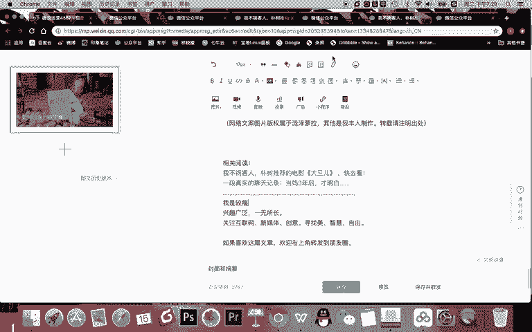

链接放在这里，比如说文字。有这篇文章叫什么呀？电影OK你看我就添加了一个文字链，叫电影。所以你看这有什么技巧？第三点。

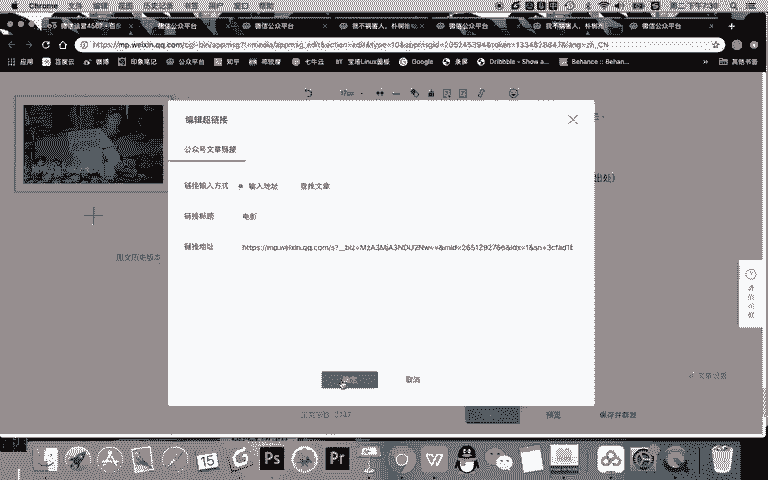

输入文章的链接。1可以。修改。链接显示的文字。没有输入文章的链接。导入。文字练。可以修改链接内容。

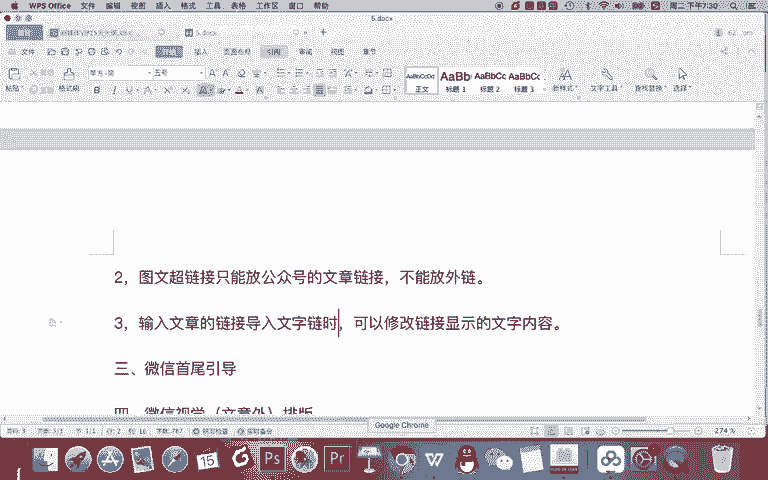

也就是你看啊我把这个删掉，再来一下。

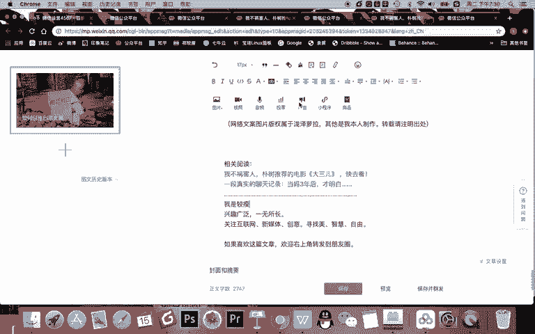

也就是当我点击查找文章的时候，它会默认显示这篇文章的标题。但如果我找到了那篇文章的链接，我输入它的链接。这里就可以显示是吧？

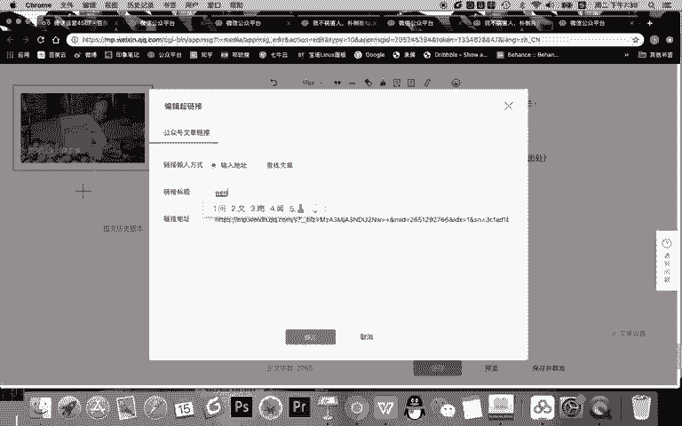

你想显示的文字内容约等于同一篇文章，你既可以让它显示按标题显示，也可以按照你设置的文字的内容显示。所以呢文字可长可短啊，也可以显示标题，这是这一点技巧。那还要注意的是第四个技巧。

超链接。或者说。其他文章的。号链接可以在。手机上。复制链接什么呀，导入。

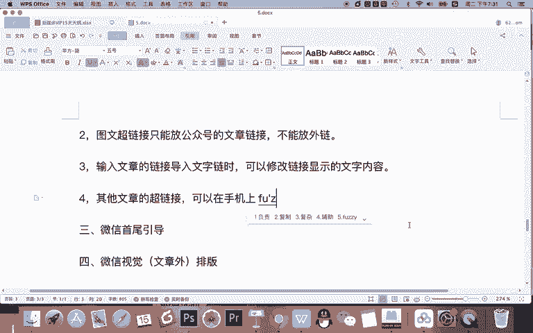

比如说你说老师。我现在呢也想让比如我刚刚找的这个视觉制的这篇文章的链接，标题文字给它改一下怎么办呢？你就可以在手机上找到这篇文章，并打开它复制右上角是吧？点击分享，复制它链接放在这里。

然后就能去修改它的标题显示的一个内容了啊，这是注这样一个技巧。那需要注意的是啊，这个文字链或者叫图文的超链接能放在哪儿。

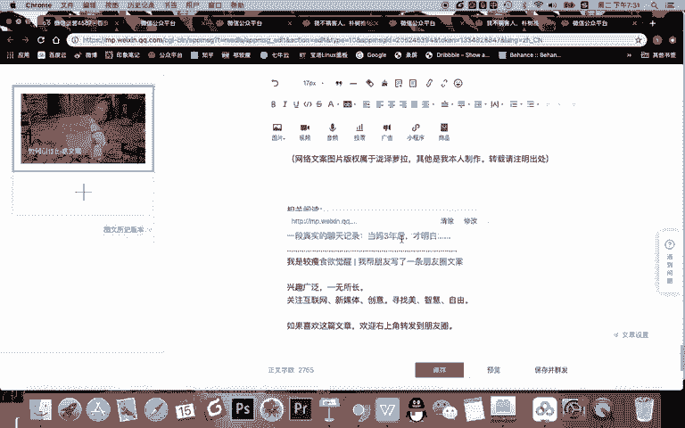

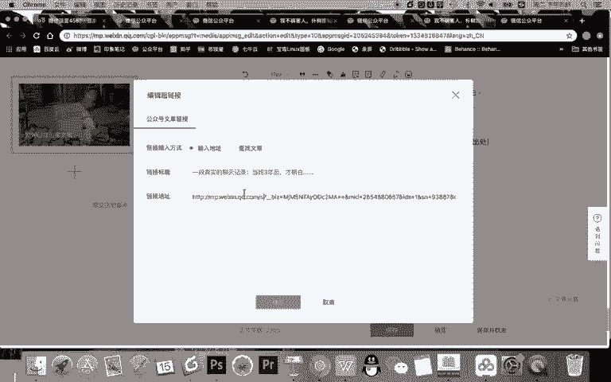

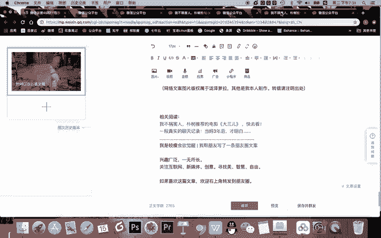

其实一般啊它放在的位置是有固定的位置的，我给大家写一下。

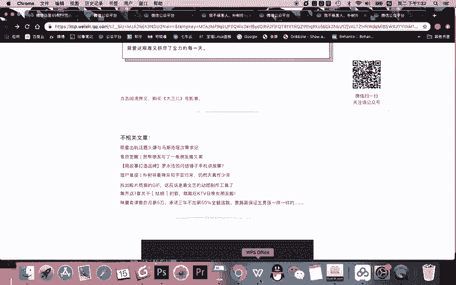

5。图文抄链接通常。放在。文章的下面。二维码的。

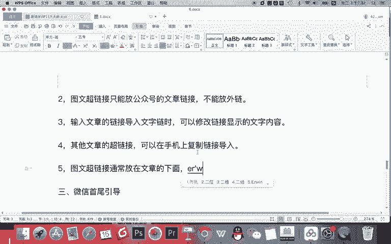

上面。也就是在这个位置，一般不要把这个相关的文章放在二维码的下面。你记得二维码就是这篇文章的最最下面，一般这相关的文章肯定是在文章之后再拓展阅读嘛。所以呢不相关的文章。

这个东西或者相关的文章的部分就放在文章的下面二维码的上面。

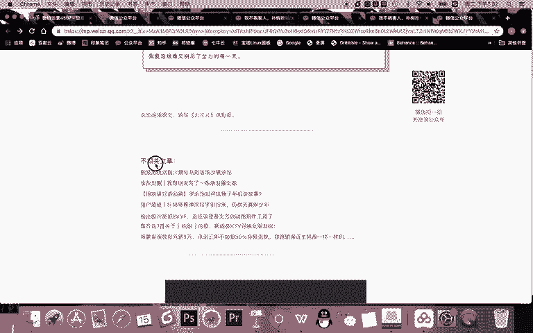

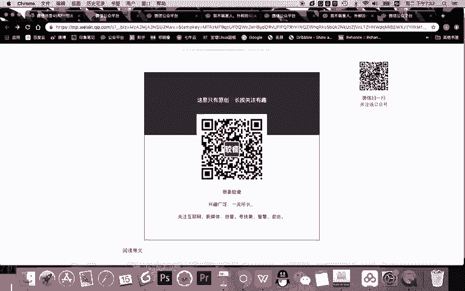

那现在有一个顺序啊，你看阅读原文，还有呢相关文章，还有二维码，他们的顺序基本就固定了。比如如果阅读原文跟文章有关的时候，你的阅读原文的引导就放在文章的下面。再然后就是跟文章没有相关性的拓展阅读。

再往下是二维码。另一种情况，当阅读原文访问的一个链接跟文章没有关系的时候，那么就是先先有文章，然后呢有拓展阅读，然后有二维码。然后最下面有一句话是引导点击阅读原文。

这是我们所讲的啊微信阅读原文和图文抄链接，他们的一个布局方法。

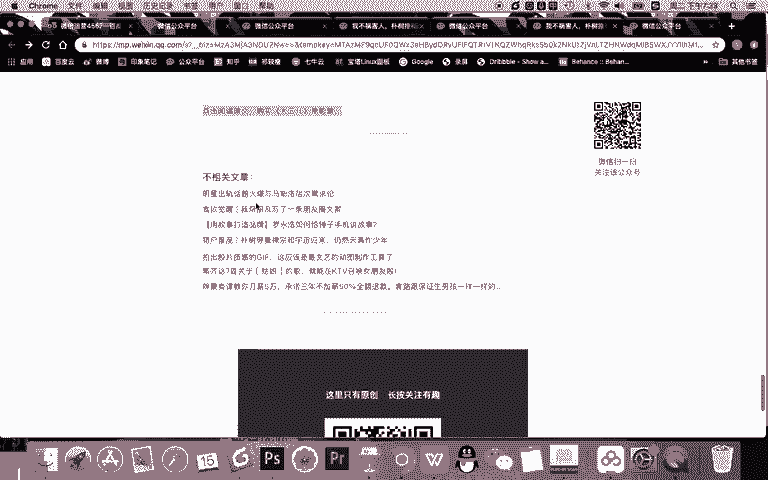

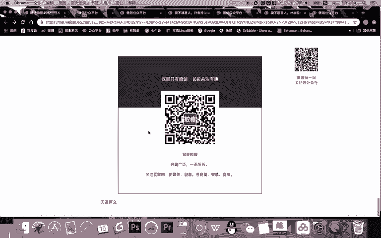

那第三点，微信首尾引导啊什么？首先什么是首尾引导呢？我们先给大家讲一下排版工具啊，为什么呢？因为。

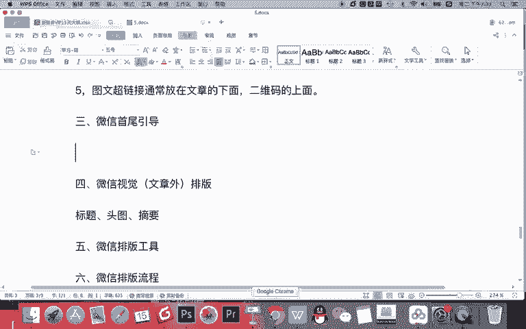

这些东西不是我自己打出来的，而是用排版工具设置的。排版工具呢，我推荐几个。

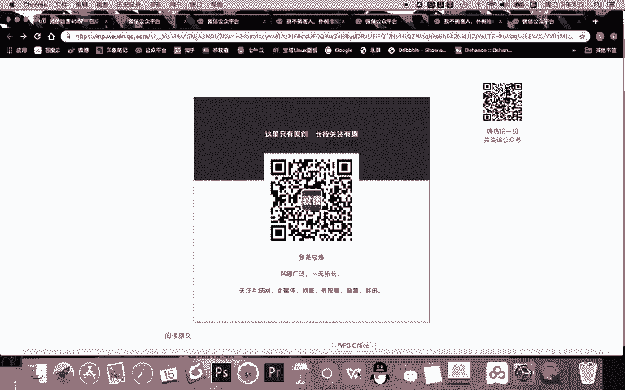

推荐三个啊，大家可以去使用。我通常用的最多的就是135编辑器。当然还有ipad吧。还有。秀米。排版的排版工具其实有挺多啊，比如说你你搜一下。

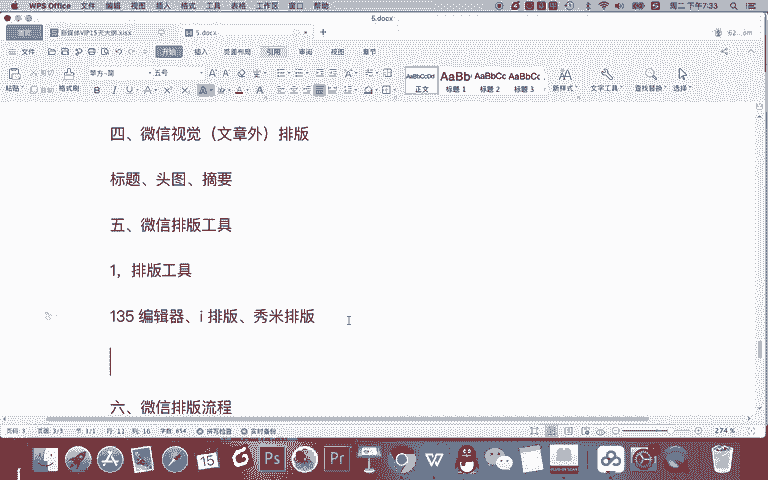

搜一下微信排版。

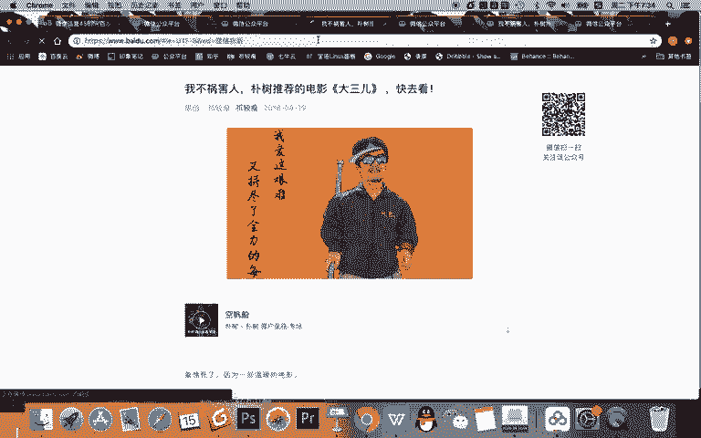

OK那你看一半365，这是打广告的对吧？这是图文排版96微信编辑器，微信排版特别的多。但我告诉你，我用的多，或者说市场占率比较高的就135编辑器啊，用这个工具去进行排版。那比如我先登录一下。

给你演示一下啊。OK你看它已经自动登录了。

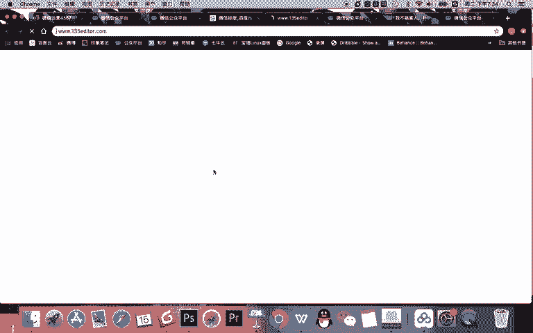

好，使用135编辑器呢，我们就可以对一篇文章进行排版。怎么排呢？你看首先一般情况下。在这里你输入你写的文章，然后一段一段调整，等会儿给大家演示一下。那现在呢我要讲一个点，就是我们有了排版工具之后。

我们要去做首尾引导。什么是首尾引导呢？看这里在样式这里有引导，引导关注就代表。文章的开端，也就是头部引导，这叫手二维码引导。这就叫以为的引导。比如说你看啊我们。先空行中间呢。就是你的文章。

这就叫首尾引导。那首尾引导有什么注意事项呢？就这样的啊，一一般。不建议放。开篇。引导关注。为什么？因为没有诚意，你让用户刚打开一篇文章，你就让他关注你喜欢就点关注嘛。我还没看呢，我咋知道喜欢不喜欢。

对吧？所以不太好啊，不要没事，就就点个关注。比如是点击上方蓝字关注我们，没用啊，你就写个字，但这只是一种干扰，他也不会关注第二个技巧啊。就不要去。选择一些，你看这里还好，不要选择一些有些模板啊。

比如说你看一下。下面这这还行。比如说像这个啊，有些内容它。啊，比如说我把这个先删掉。有些内容它占的空间会比较多啊，比如占了两三行，你把它。比如说啊你看。你把这个内容放在第一个部分啊，他占了两三行。

在这里就不太好。我建议。第二个技巧就是。开篇引导观众选择。什么呀。占用。空间。小的。50。啊，就是你选一个这现在这里这个工具的里面的这些模板还行啊，你像这个有一点多，三行啊，你就不要去选这样的一些模板。

还有另一个技巧，就刚刚有讲的啊。底部二维码。引导。选择。带文字的。模板。什么是底部二维码印呢？这个就是对吧？你说呀不好看怎么办？我删掉啊，删掉之后呢，你看有二维码页呢，你选择一下。这里都是印二维码一的。

我建议大家就选择这种啊，你能介绍一下你的句一句话，然后呢去介绍一下。其实这个没有必要啊，你已经已经有二维码，你还有必要介绍你ID嘛，没有必要，对不对？你直接告诉他你是谁，然后关注你就行。

我不建议大家选择这种二维码引导。比如说你看啊你就这个往上一放，更多精彩内容插二维码，你都没说你是做什么呢，你就让他更多精彩，这样不好啊，所以呢这是一个首尾引导，我建议大家放一个内容啊，这是三个注意事项。

很简单。只需要使用排版工具，比如说你去。比如说啊你看在下面空一行。选择这样一个工具去把所有的文字去进行修改，甚至。看可以改它的颜色去修改，然后双击这个二维码去上传你的二维码进行替换。

就可以把这个部分的内容放到你的公众号文章里去使用了。这是社会引导。OK微信外部排版啊，也就是微信视觉的排版，就是微信除了去拍整个文章的内容之外啊，比如看这里。

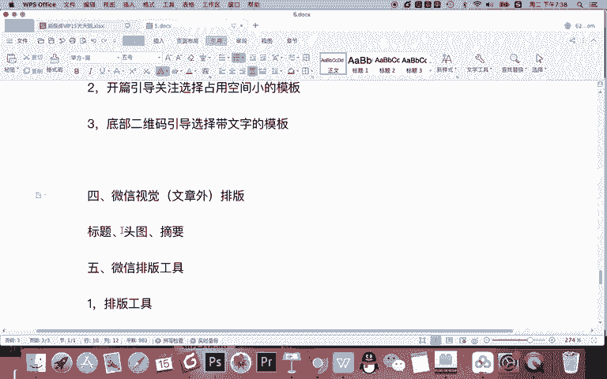

除了这篇文章的内容之外，你对微信文章的标题，还有它的封面图，什么是封面图来看这里。当你在排版一篇文章排版之后，一定会有封面和摘要，也要完成设置。

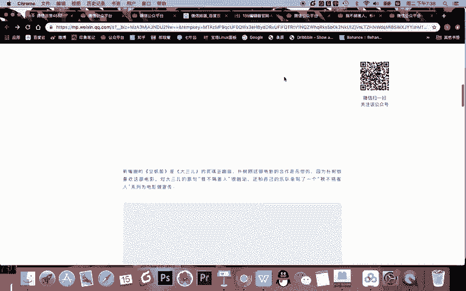

首先这个封面呢会在你转发的时候显示一个方块，显示中间的内容。所以。

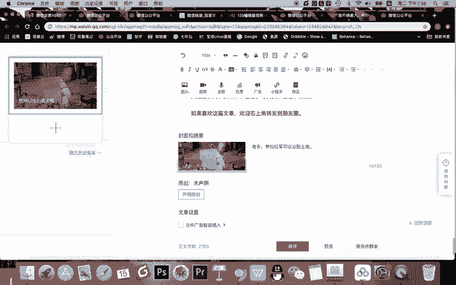

。Demble form。我们要完成设置。怎么设置呢标题注意第一。我建议标题字数不易。Okay。过长。什么要以。朋友圈。能显示。为底线。

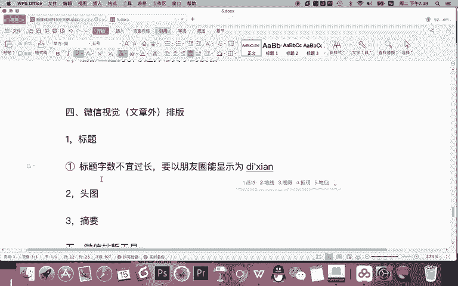

哎，OK同学们，现在有一个问题，一篇文章的标题是不是能写很多字？对吧你看啊你看能写多少字。我给我我把这个删掉啊，你看能写64个字，对不对？那有必要写那么长？没有，你因为写的太长，朋友圈看不到。

那朋友圈能显示多少呢？

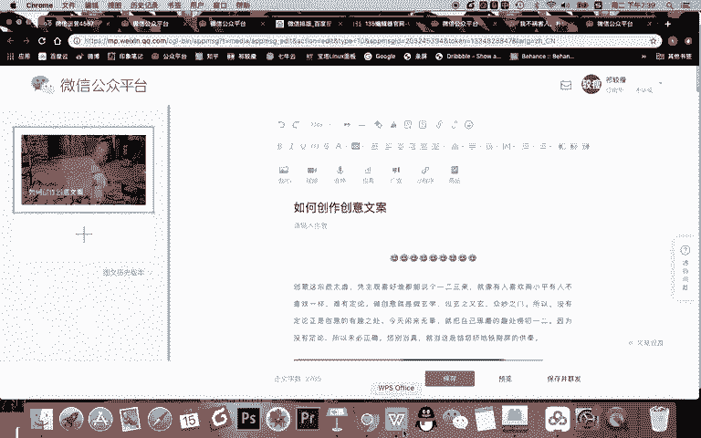

如果你留意的话，你会知道一篇文章在朋友圈会显示两行左右。每一行呢带标点大概是17个字，所以两行左右30多个字。但是以底线啊就是不要超过30个字，对吧？但我告诉你的是。标题内容要有吸引力，还要。

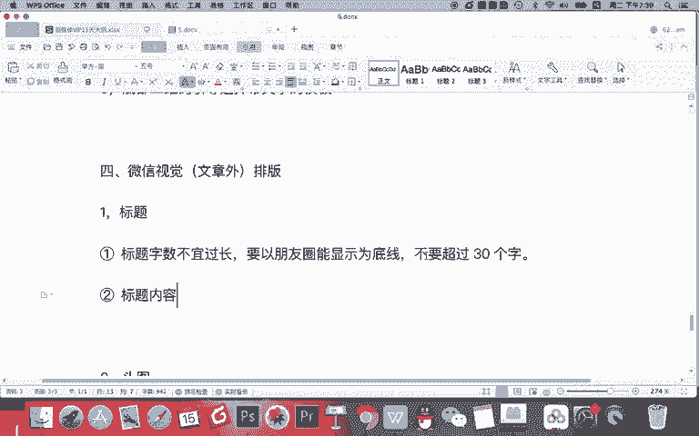

尽量。