# 微信公众号运营视频全套 手撕运营 拳拳到肉 - P23：2.02-微信排版提升~3 - 达妹_达内教育 - BV1UvvvebEdT

あとは？能一行表达的。拖鞋。两行虽然说写两行30个字还行，但是如果一行就能写清楚，就不要去写太长。所以标题要短，要有吸引力啊，这没有什么问题，这很简单的事啊，你就不要写太长了，30个字就作为底线了。

但是呢15个字左右，20个字左右是比较合适的。所以我给你写一下吧。3。推荐。15到20个字。左右啊不是唯一的正确，我只是这样推荐。

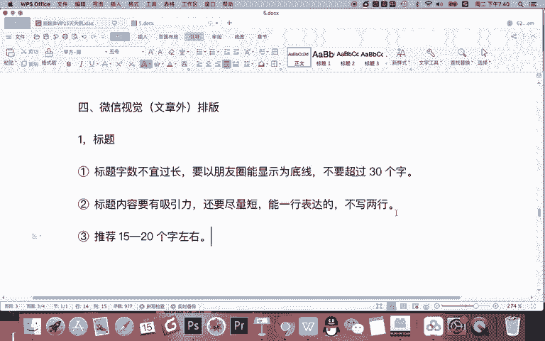

啊，第二部分头图，因为你的文章不管是转发到朋友圈也好，还是转发到微信群也好，它都会显示一个头图。那个图片是什么形状？是这种长形之后的方形，对不对？所以这个图片在这显示长形，中间是方形。

所以你要做坨图怎么办？第一。

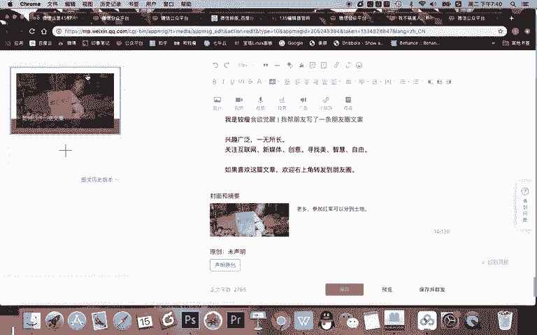

头陀。核心素材要。居中。尽量发到朋友圈。也能。看清对不对？尽量是转发到房圈的时候。也能看清。对吧这是啊为了方便用户的去理解。比如你看我的公众号的文章啊，其实我是遵循这个注意事项的。

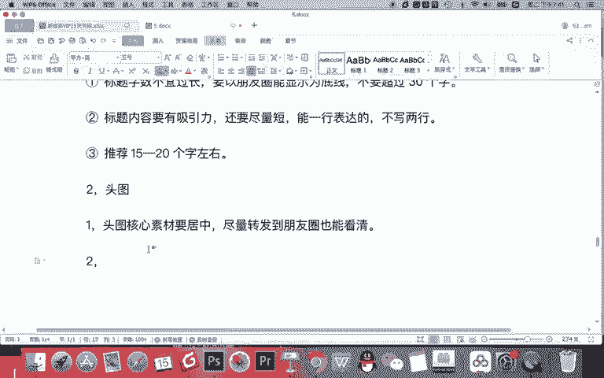

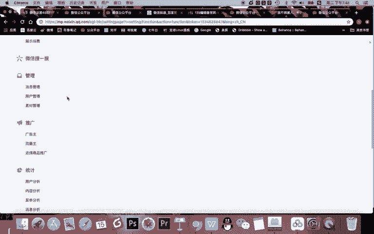

。我基本每一个配图它的主要的核心内容都是居中的。所以你看这朴述，还有这个这个就是你发了朋友圈之后，大家都能看清它的一个内容。你不能人物居左啊，就去到朋友圈，只有半边脸看不清，不可以。第二。😡，口妥。

素材尽量大。转发朋友圈后还能显示清楚。

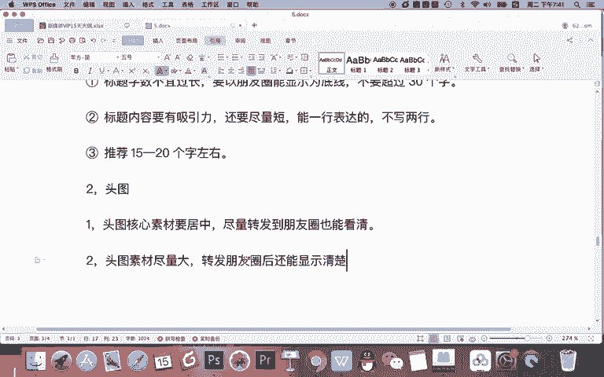

这个也很简单啊，因为我们。在微信排版的时候，比如你在这里去排版的时候，你看这个图片它是很大的对吧？我们能看清，但发到朋友圈它会被缩成一个小的方形的图片，所以呢就看不清了。

那这个时候你就要保证你提前搜素材的时候，就不要去选那些信息密密麻麻的图片，就找一个大图，让他发的朋友圈也能看清啊，这是我们头图的一个素材。

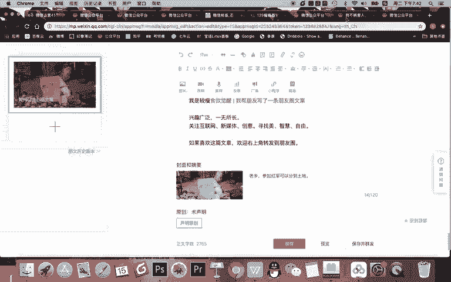

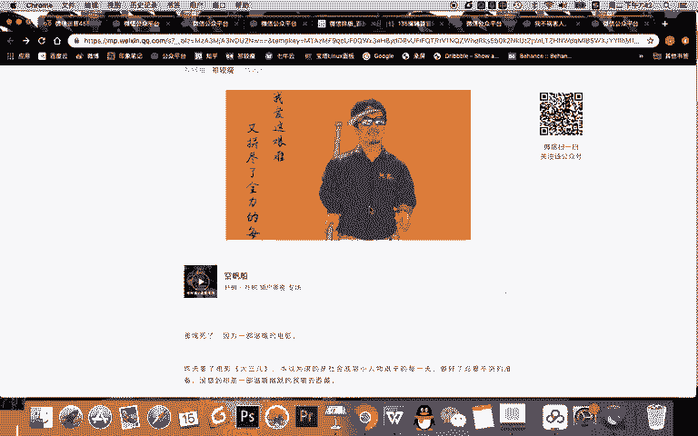

好，还有第三点啊，这是我们啊这里去用小标题吧。还有第三点是摘要的一个撰写。当我们去排版的时候，首先在这里啊，你看是能看到有标题，有封面有摘要的，但一般发到朋友圈之后看不到摘要。

但在一个地方能看到转发微信群的时候。

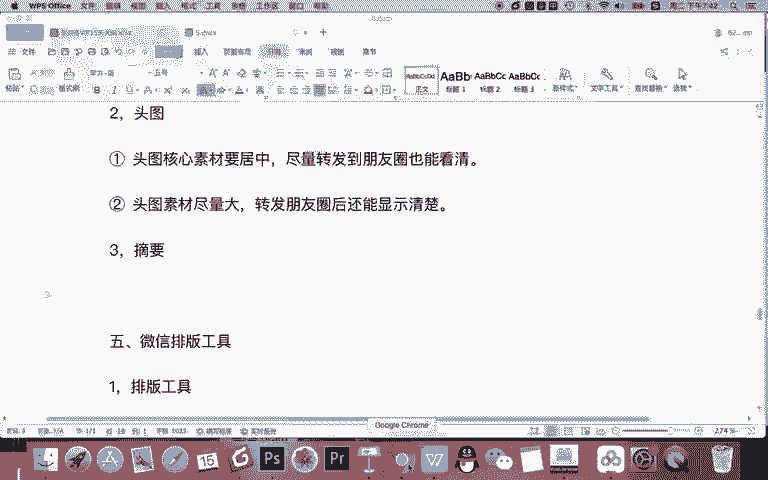

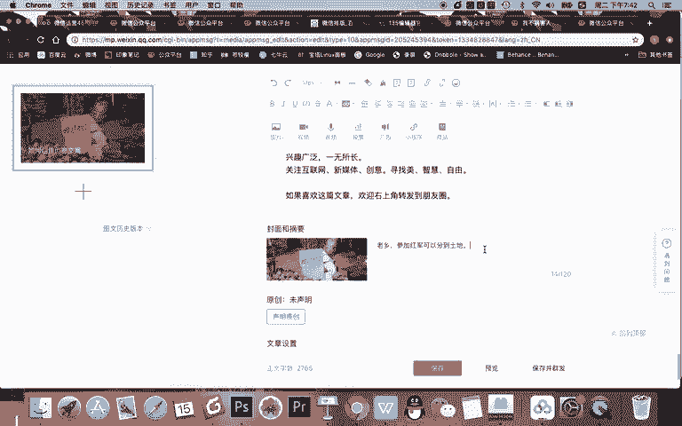

第一。😊，文章被转发。微信。全食啊。是吗。可显示。没有。那微信被转到朋友圈啊，或者微信转微信群是会显示摘要。那摘要有什么作用？摘要标题和图片结合起来是能提升吸引力的。所以你的摘要怎样？第一要注意的是。

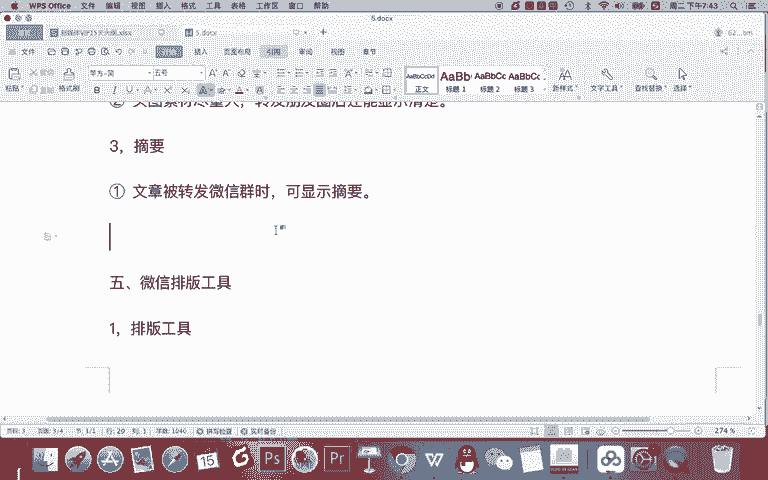

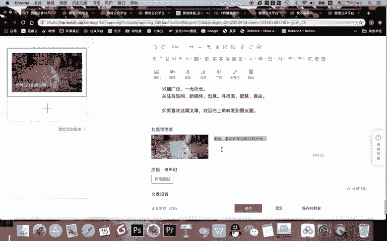

文章摘要。有。

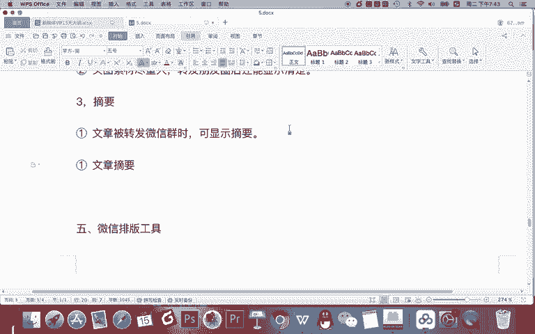

专门赚钱。你不写摘要会不会能用，当然可以用。你看不写的话，他会默认抓取文章。正文前54个字，对不对？默认抓取了，就是直接去抓第一段。所以写的话，如果发发到朋友微信群会显示的更好。第二。

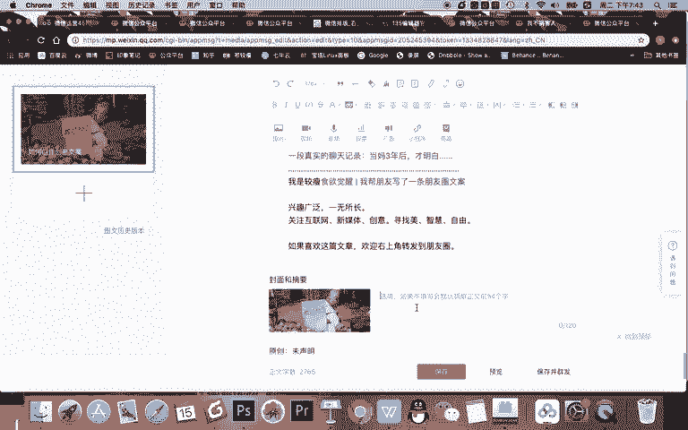

Yes。Okay。第二个技巧。就是除了要专门写之外。3。摘要注意字数。控制建议。45个字。以内啊或者。最佳。

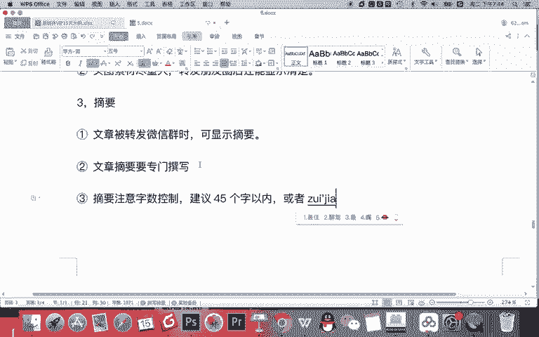

20个字。左右什么意思？摘要发到微信群会显示三行，一行是15个左右啊，你可以算一下，大概是这样。所以你要45个以内呢，会能全部显示出来，能表达清楚。第二呢，你不用写那么多，你显示两行是不是也可以。

你就写一句最吸金的话，这是第第四个技巧。

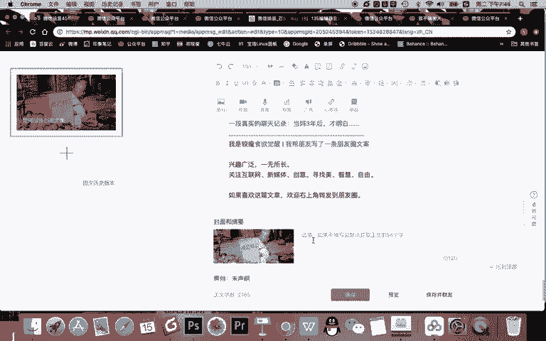

摘要是。洗一句。精炼的话。配合标题提升。点击率的。所以你把文章的一个核心的观点，或者说有一些吸引力的表达点去提炼成一句话写到摘要里就可以了。O这是文章外部啊视觉排版，也就是当你的文章被转发到微信群。

转发到朋友圈的时候，你需要注意的排版的事项啊，都是三个基本的内容，标题头图和摘要的一个排版。那接下来呢我们知道的排版工具。那么我给大家演示一下排版的一个操作。

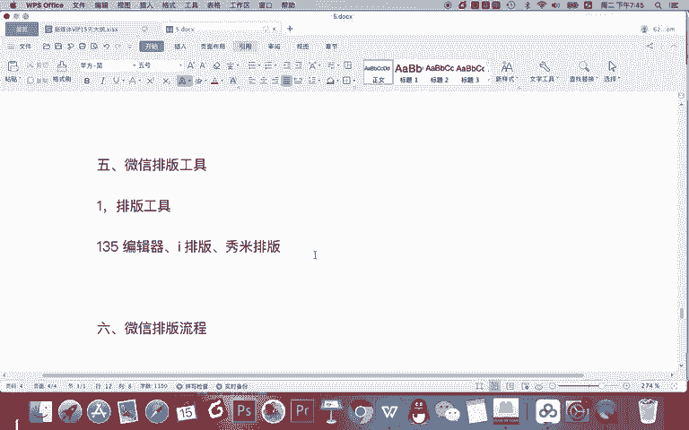

OK比如使用135编辑器呢，基本就是你在样式这里有各种样式，比如标题、样式、正文引导等等样式。那一般写文章的时候呢，是这样的，首先把文字。啊，比如说。比如说啊你看我把那边我的文字复制到这里了。

先把文字弄进来之后，先清除格式。然后呢，比如说你想开篇加一个引导，那就引导什么呀关注。对吧放在这里，然后空行，然后文字排完了，插入图片，插入图片的时候，你看就就多图上传或单图上传。

双击去传一个图片进来就可以。然后我建议呢大家去选用一些小标题排版，比如你看1234这种选用小标题怎么选呢？看这有编号标题。比如呢我在这里去弄一个标题。下面呢在第二个部分再弄一个标题。

这个部分呢再弄一个标题，然后中间该插入图片插入图片，然后呢，全文可以去刚开始的时候就选择好它的字号啊，紫色配色。然后呢，文章底部。想去加什么引导二维码的时候，你就选择一下。对吧比如说这个好看吗？

你说哎不好看不好看就删掉它，对不对？选中啊，你记得选中一下，它有红边的时候，你出现，你就可以整个删掉，它是一个整体。不好看，你就选择其他的找一好看的对吧？比如我认为这个好看，哎，把它放在这里。

你说我我认为它颜色不好看，我可以去。换它的颜色对吧？现在你说哎这个颜色也不好看，我去换换啊，换颜色去双击去上传我的二维码，然后就替换。那这篇文章就编辑好了。编辑好之后把它复制到。

当然啊你可以选择全文换色啊，把它编辑好之后复制到你的。公众号里面。比如把这里全部删除复制进来，那么你ctrl Acrl C一复制，你在这里编辑的什么效果？在这里就有，然后你只需要去设置一个封面。

设置阅读原文，甚至再设置一些超链接，点保存再预览。那这篇文章就基本排版好了。那讲到这里呢，其实就讲到了什么微信排版的流程。那么我给大家梳理一下这个流程。第一。

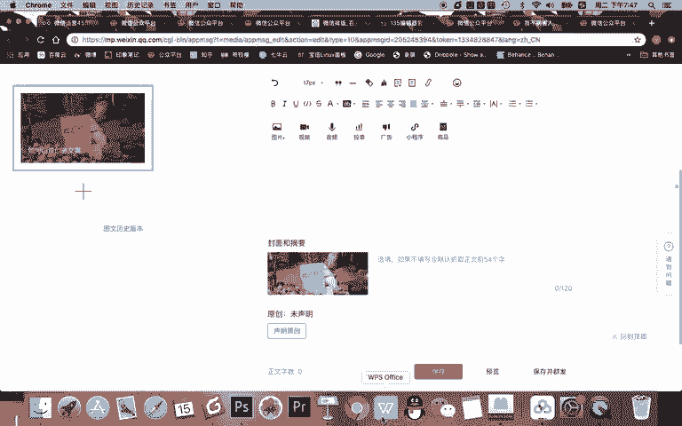

第一步排版之后先是什么？撰写文章，准备素材。第二。什么呀？在编辑器中或者说什么。在排版工具中。进行。排版。啲衫。复制岛。公众号后台。

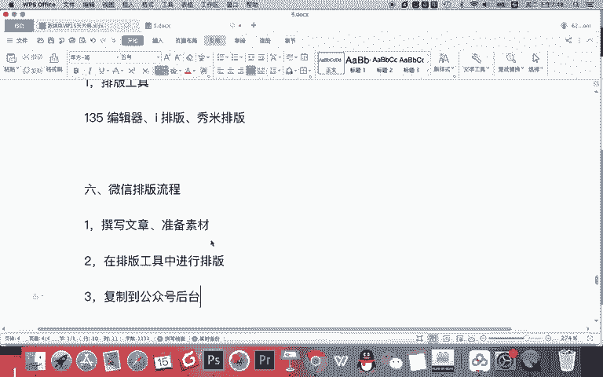

进行什么呀完善。完善什么？完善你的阅读原文原文，完善你的封面，完善你的标注原创啊，插广告，然后呢去设置一下，甚至插入一些文字链，完善之后要干嘛？第四。

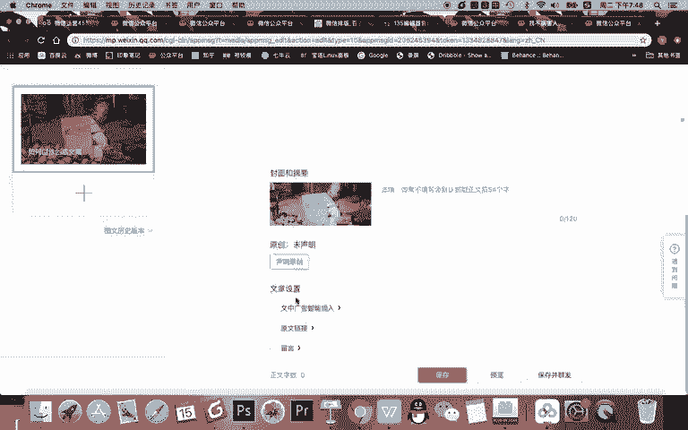

保存或者说先不用保存也行，发送到。手机预览怎么发送？看这里点预览的时候啊，你看这里没有文字啊，我粘切一下。

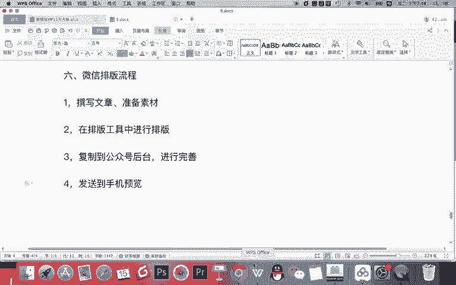

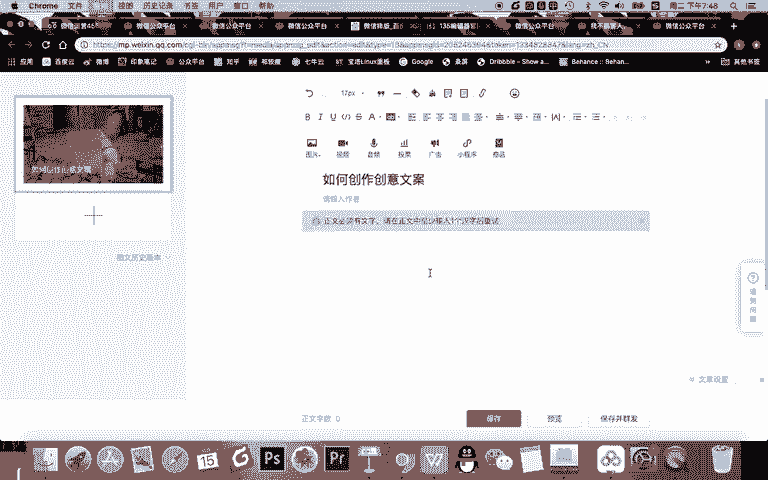

记得一定要发送到你的手机去预览它。比如说输入你的微信号，然后点确认你的手机会收到一条提醒，然后在手机上预览它是真实的用户看到的一个效果。然后呢，你就可以对问题进行干嘛。第五。

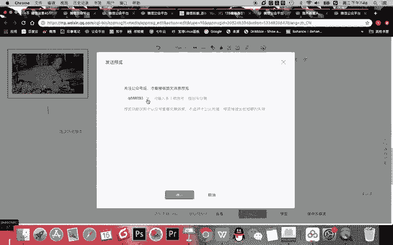

什么对预览问题进行优化。第六，再次。发送手机预览。第七。再次优化第八没有问题了，在干嘛？保存。

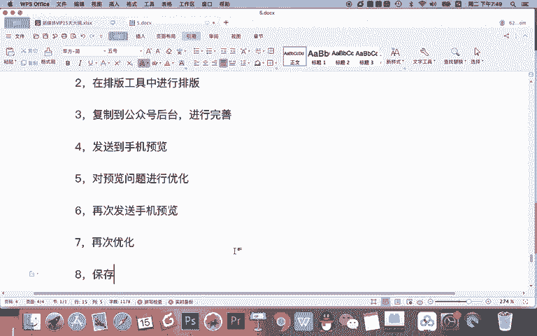

货。先发。OK所以呢最后你可以保存或者点击保存并群把这篇文章一发布给用户就可以了。那为什么现在你看啊我发送预览又预览，那我告诉你，正常来说写一篇文章，我自己啊，平时基本会至少预览修改3次。

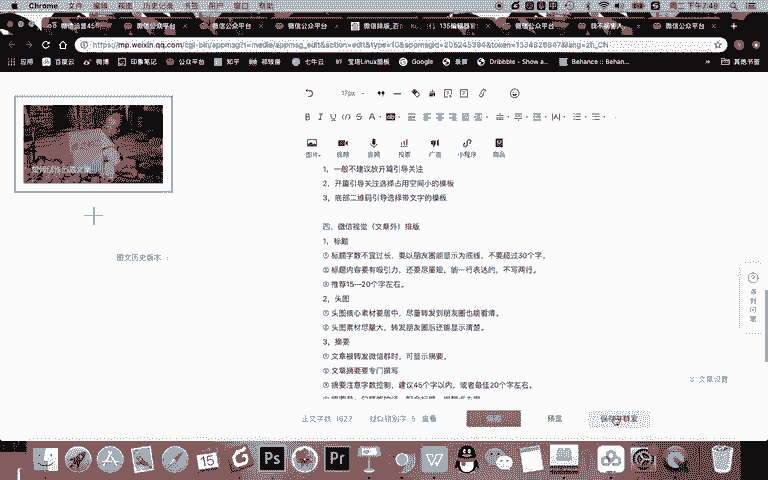

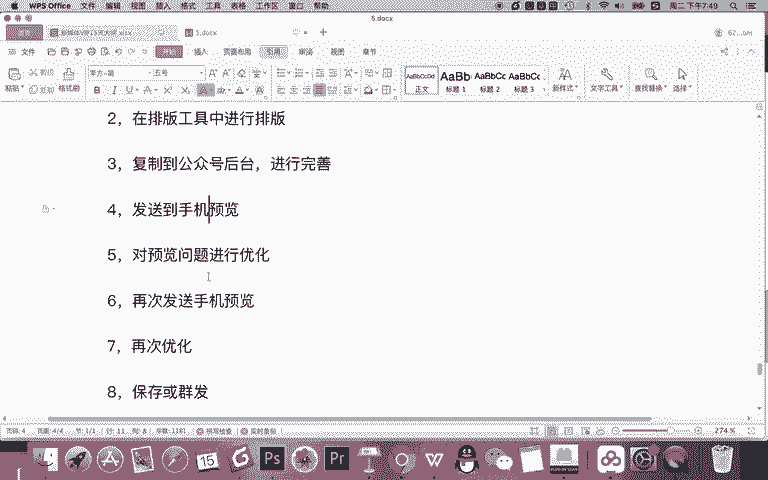

这是一个基本的底线。所以呢记得排版不只是排好了啊，一定要去预览优化等等。然后反复如此，确定没有任何的问题再去群发。那最后呢再讲一下，其实一次我们的文章啊，你看很简单去设置封面之后呢。

一次可以群发这一条就保存了。但同时在左侧，你看这里有加号，你可以最多加加加加加一次能发8篇文章甚至8种是吧？有图片有视频，有音频，一次去推送。所以呢订阅号每天虽然可以群发一次，但一次最多发8篇。

当然一般做自媒体的一天也可以只发一篇啊。所以呢你看在你的后台，是不是你看我这都是一篇的，对吧？但是其实之前呢我也会有多篇文章去发布，你都可以进行编辑，记得保存好，放后台在合适的时间点击群发。

那这篇文章就群发OK了。那以上呢就是我们微信排版的升级提升的相关课程啊。首先给大家讲了阅读原文抄链接还有微信稍微引导的一个方法。然后呢给大家讲了你的排。

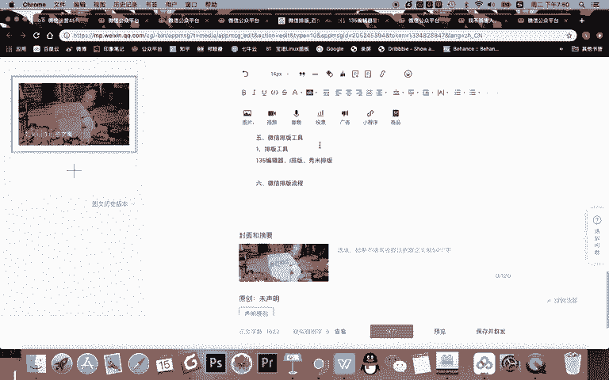

的时候对标题头图和摘要的处理。再然后呢给大家推荐了几个排版工具，然后给大家进行了一个简单的操作啊，我认为比较简单，其实记得就样式这里全部是各种模板，你就在这改改改改，改好了，一复制到微信就可以去使用了。

然后呢，我们给大家讲了微信排版的流程，记得文章先写好，先在排版工具排版，再在公众号完善，再预览，再优化，再预览再优化，没有问题再保存或群发。OK以上就是我们微信排版的相关内容。

我们用两节课的时间给大家讲了讲文章内部基础内容的排版，还有文章外部以及一些高级设置的排版技巧。相信学习到这里，大家已经学会了文章的排版。那接下来呢大家可以试着根据你的公众号定位去写一些文章并去排版发布。

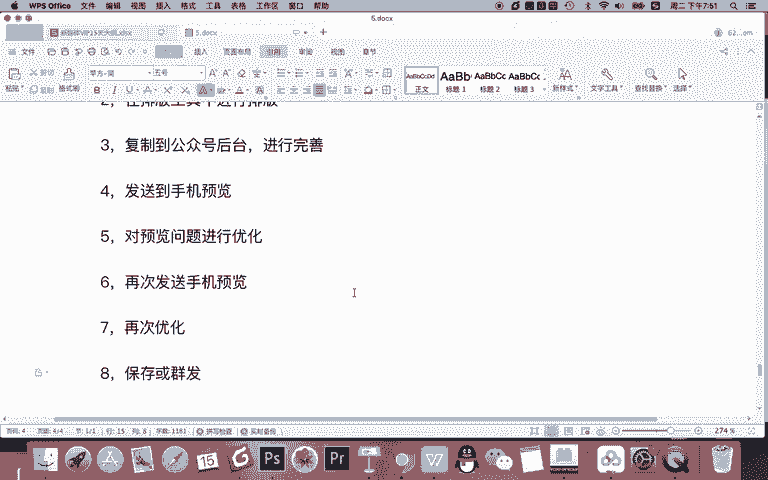

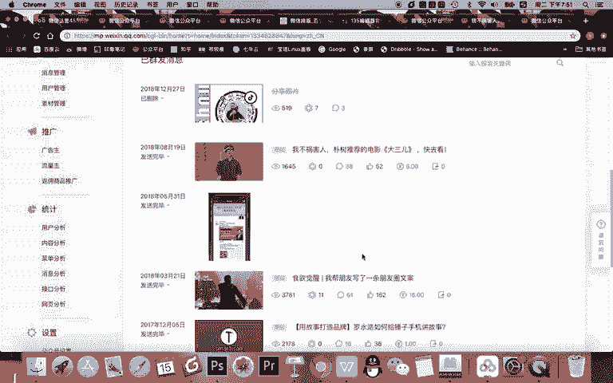

O本节课的内容就到这里，我们下节课将学习微信工微信运营的一些工具和神器，提高大家新媒体运营的一个效率。O我们下节课再见。

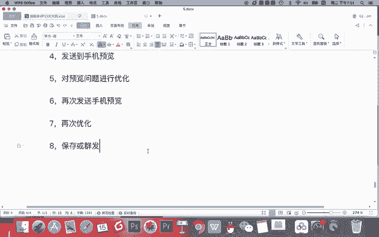