# 微信公众号运营视频全套 手撕运营 拳拳到肉 - P24：2.03-微信高效运营工具~2 - 达妹_达内教育 - BV1UvvvebEdT

🎼也可以按照分类浏览当天的热文，还可以通过右侧的微信指数和百度指数看到当天的热点信息。🎼在营销日历里，你可以按周查询当天的话题内容，提前做好选题排期。🎼我们还可以帮你生成一键关注页的二维码。

🎼复制文章链接粘贴生成就可以了。🎼在超级桌面里，你可以实时监控你的公众号，各种信息一目了然，也可以直接点击进入这个公众号的后台。我们还提供了夜间模式和护眼模式，供你选择，让你的工作更加轻松。

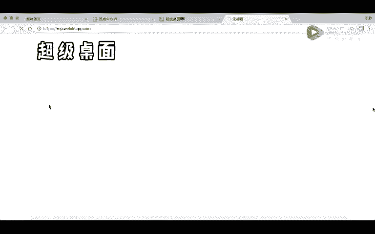

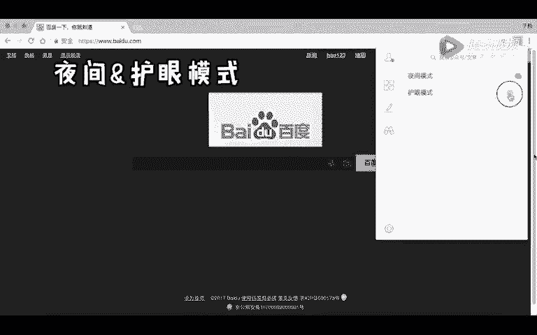

🎼当然，我们还在开发更多有趣又有用的小功能，用心让新媒体运营更简单。

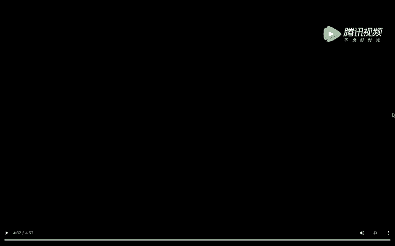

好，同学们啊，我们刚刚看了一下新媒体管家的这样一个介绍视频啊。我相信如果你之前听过我们前面的课程已经在运营你的公众号了，那你知道新媒体管家确实是一个功能非常强大的插件，对吧？

那下来下面呢我再给大家介绍一下我的常用的一些关于新媒体管家的一些功能啊。首先啊大家看在首页这里基本会有你能直接去到你实时的数据灵感中心，甚至想开通留言的等等啊，一些功能。那么其实很简单的一个功能。

在首页里有一个我常用的，就是你看它这里有什么呀批量删除历史文章的一个功能，约等于比如说你之前的很早以前发布的内容不想用啊，可以用它去批量删除。当然还有啊，我个人比较常用的就是灵感中心啊。

大家看一下进入灵感中心呢，你其实能看到目前的一些热点啊。OK平时新媒体管家，我们用的最多的啊或者接触比较深的一个地方，首先就是我们写文章的时候。

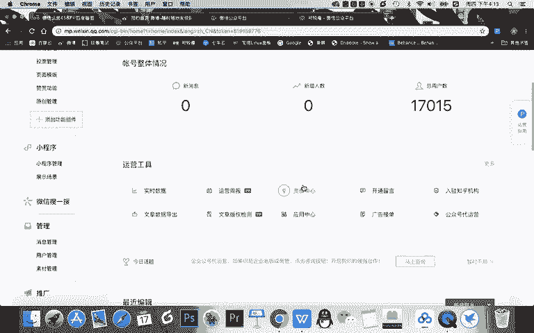

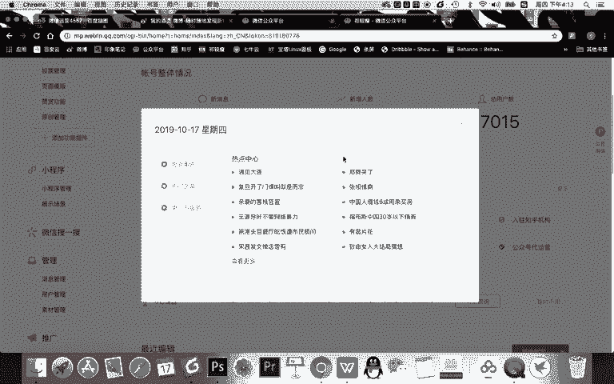

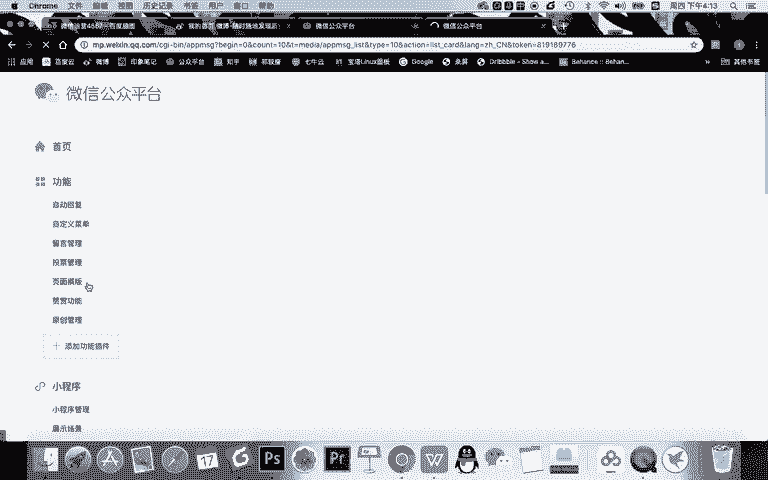

比如大家来看，当我们去编辑一篇文章，那么你的新媒体管家一旦安装成功之后，这个界面也变得不一样了。

首先在你的文章的正文里面啊，你看在文章的正文里面，现在有了什么？现在有了更多的一些功能，比如能够添加，你看啊添加表情。对吧让你的文章表情更加的丰富。再然后呢我个人用的最多的其实是右侧的这些功能啊。

采集文章我不常用，为什么呢？因为复制别人的文章，怎么说啊，这个没有特别大的意义啊，因为因为算抄袭，但如果是他的排版和格式的话可以用啊。那我用的比较多的。第一个是生成长图。什么是生成长图呢。

就是把你的公众号的文章啊，生成成一一个长图片，然后你发布的时候，不管是在文章中或者给用户发图片啊，会有一个好处，就是用户作为所有的读者啊，他看的时候排版不会有错误，对不对？因为你要文章排版的话。

可能会有错误。还有另一个非常重要的作用，就是啊想抄袭你文章的人，他就不能这样采集文章复制粘贴去抄袭了，对吧？啊，还有一个非常强大的功能啊，我给大家写一下。哦，我个人认为的一些核心功能来介绍。第一。

搜图片。啊，什么功能非常强大。比如说当你写了一个文章啊，你需要给他配图的时候怎么办？你一般情况是不是简单来说，百度搜索对吧？百度搜索哎你想找一个互联网的一个图片。那你百度搜索到的图片存在两个问题。第一。

百度搜的很多图片，它的质量不高，对吧？你看看就就就有些图片你打开。清晰度有限啊，像这种也不够清晰啊，这是第一个质量。第一个质量不高这个问题。第二个非常严重的问题就是你百度搜到图片有可能侵权。

你不能随便去用别人图片，对不对？那怎么办呢？利用新闻管家看这里点击插入文章。我告诉大家，这里你看能搜表情啊，这个表情是由百度图片提供的，还能搜je，哎，这是就是我们之前给大家讲过的。

搜jeF这个网站提供的。比如说你想搜一个。

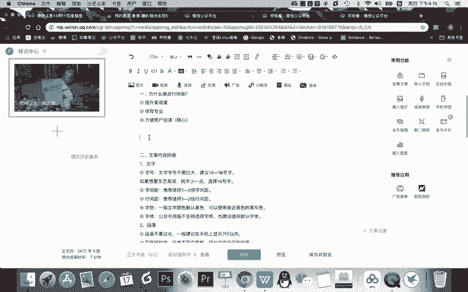

开心。😊。

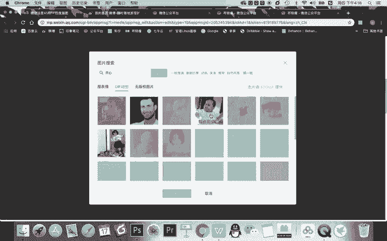

出现的就是各种各样开心的图片啊，动图吧。然后你可以把这个动图怎样居中甚至你还可以怎样给它，你下面有国庆嗨起来，是不是不想要国庆嗨起来，你还可以干嘛去对它进行调整啊，继续裁剪都可以。然后呢。

你看调整它的尺寸，圆角阴影，甚至就直接对它进行一个编辑，直接去到什么呀，搜技术这个上面对它进行编辑。因为如果你在这编辑会有什么好处，不是，是还有会有什么问题。

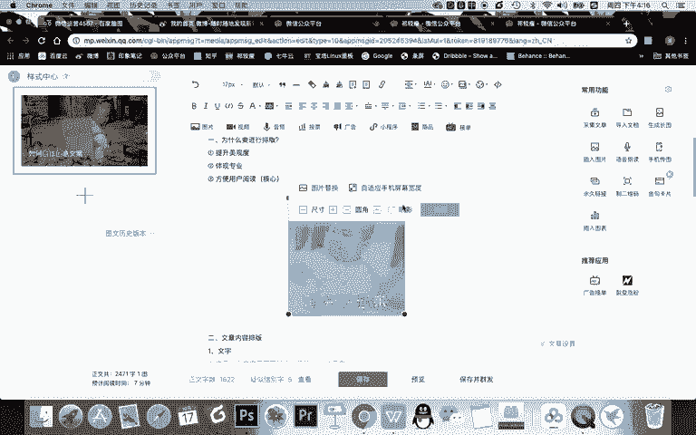

你看啊这里如果啊你这样拖动还可以。如果有些时候动图，你直接去给它裁剪的话，会有一个问题，就是它会直接让动图成为不动啊。但是用这里啊，你去用搜据去编辑的话，它就还是动图，对吧？

这是第一个非常方便的一个功能，就是插插入图片，这里首先可以找到各种各样的动图。第二非常核心的。就是我们在配图的时候。

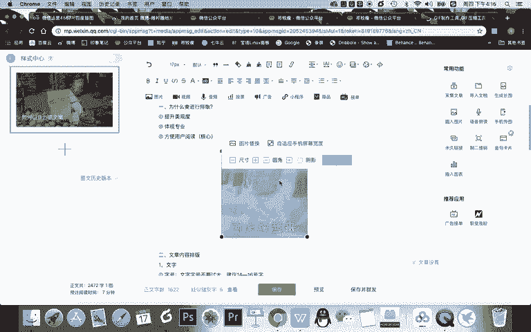

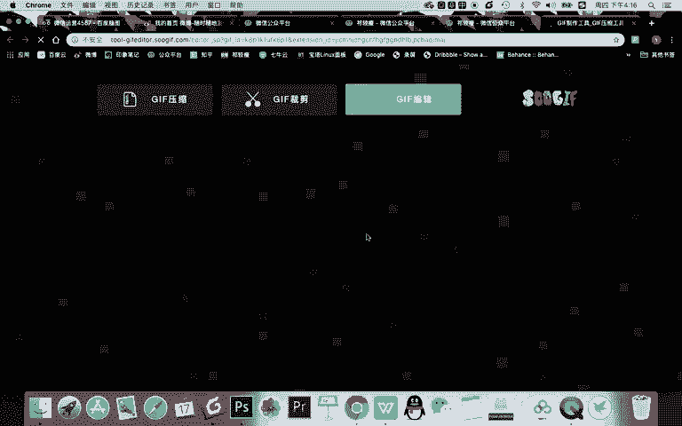

如果你是企业的公众号啊，千万不要网上随便找一张图片去用。因为如果用的话，被侵权别人会有给你寄律师函，那你就可以你需要给别人赔偿，对吧？比如你现在想搜。互联网。点击搜索你找到的这些图片啊。

都是由这个网站提供，它是免费版权的图片网站。那你用这样的图片，首先它是高清的，其次呢不会侵权，这是给大家提供一个挖掘或者说给你的文章排版啊，做图的时候，一个功能非常有帮助。

第二呢就是你可以啊我们之前发的文章，比如在公众号里，这些所有的文章，你点击之后出现的这个文章都是临时的链接啊，给别人之后第二天可能就失效了，看不成。但是呢如果你用新媒体管家的话。

你可以对这篇文章生成一个永久链接，然后呢，生成永久链接，你可以把这个链接发给任何人，他去能看到这个文章就不受时间限制了。还有一个非常关键的一个功能啊，就是我们之前给大家讲。

你可以把一些链接做成二维码插入文章，方便让别人比如说访问你商品链接的时候，能直接访问，对不对？那这那你看这里直接怎样新媒体管家直接把草料二维码整合到你的排版里面。然后呢点击你就可以输入一个链接。

然后生成二维码，然后同时对它进行美化，然后直接导入，你就不用在百度里搜索啊草料二维码，然后再制作啊，再去去使用它了。当然啊在这里呢它还有一些啊新媒体管家的额外的功能，就是广告接单和裂变增粉。

比如说广告接单是你如果你的公众号粉丝比较多，你可以去接一些软文去发发软文去推广啊，这是接单。裂变增粉呢就是你可以啊付费去实现粉丝的一个增长。那我个人常用的另一个非常核心的功能。关于新媒体管家呢就是。

高效。头图制作什么是头图呢？就是我们每次写完我们新媒体的公众号的文章，你都需要去做个去配个图，对不对？你每次基本需要去百度搜或自己做，然后上传到你的素材库，然后再导入进来。但我告诉你。

有了我们这个新媒管家之后，直接点击下面这个题图制作，直接去到创客贴或搞定设计。你就能够直接高效快速的做一个图片，一秒钟就或者说不说一秒钟嘛，几秒钟就能做一个图片。比如说你看我这里啊什么呀？

我可以爽选中这个文字。对吧这个文字比如说什么，我现在是麦克的是吧？课程福利。然后呢，我直接把文字一改是吧？齐教授的。新媒体。什么体系。课程，然后这样一改，只需要改文字，等一秒钟它一有完成啊，你看。一点。

你的这个封面就做好了。这是非常高效快速的，而且非常跟之前不一样的地方。你网上搜的图片有可能侵权啊。但现在呢你用它去制作的图片是原创的啊，是不会侵权的。所以呢非常的高效。这是在排版的时候。

我常用的一个功能。那除此之外呢，关于新媒体管家，我还有一些常用的功能也给大家介绍一下。一般我会在新媒体管家的应用这里。

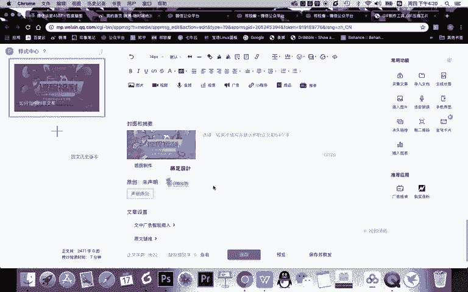

啊，你看它有很多各种各样的应用。第一就是运营辅助的工具，还有一些设计相关制作相关的，还有一些实用的工具，还有一些变现渠道一些工具啊。首先在运营辅助这里，我会经常去查看热点中心。

因为我们要写新媒体的文章，有一个非常重要的技能，就是跟热点，对吧？或者说你看看当天有什么内容比较火。