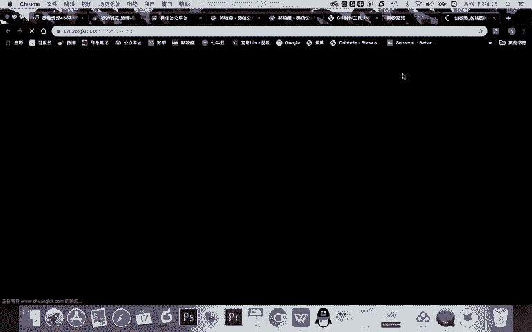
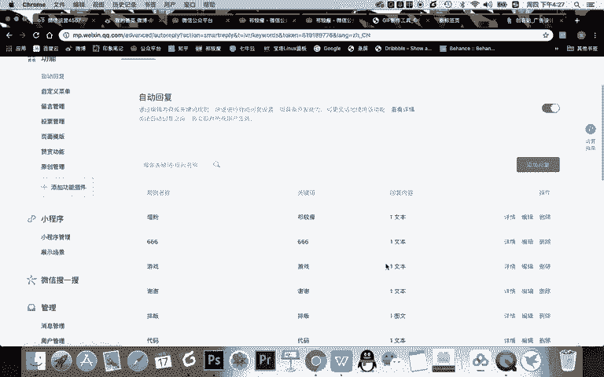
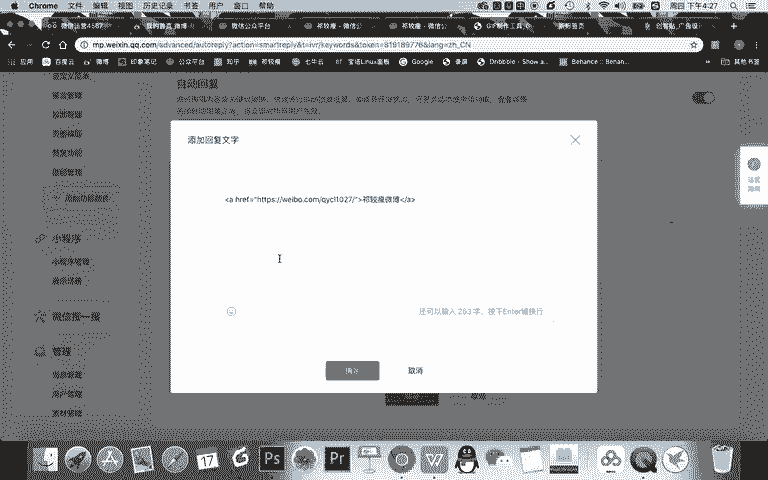
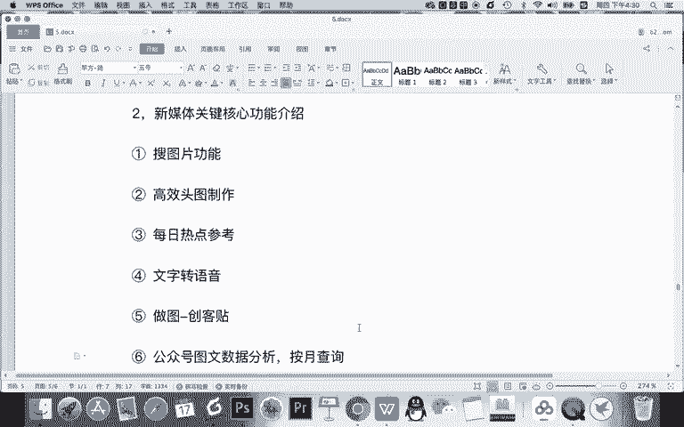

# 微信公众号运营视频全套 手撕运营 拳拳到肉 - P25：2.03-微信高效运营工具~3 - 达妹_达内教育 - BV1UvvvebEdT

你要去写什么样的内容。那么在热点中心这里呢，你一点击啊，你看非常的方便。在应用里一点击直接进到入热点中心。这里面整合了我们目前的所有的新媒体或资讯平台的一些热点。比如微信的所有的热点。

你说哎我是做汽车领域的。看看汽车领域今天有这些热点，包括一些热搜的一些词，对吧？这些是比较热的内容。然后知乎还有精选的。一些内容也能够查看。还有豆瓣的，还有微博热搜的微博呢是吧？热搜榜整体哪一些内容。

这是微博是我们知道是微博，是中国热点新闻啊，或者说一些资讯的一些风向标。如果你看到一些热的内容，你感觉这个内容跟你的账号的定位也比较相符，你就可以去查看这样的内容。然后呢，全网搜索。

比如说啊你说什么于谦摇滚，你就搜这个词，全网搜索各种各样的内容，然后呢去获取资料去撰写文章，对吧？包括百度的一些热点。头条的平台的一些热点，还有呢消息啊热点。当然还有一些违规的一些文章仅供你参考啊。

就是让自己一看了以后你就注意啊，不要去写这样的违规文章，比如太低俗啊，或者涉嫌过度营销的一些内容。所以呢热点中心能够非常方便的查看每天的热点，为我们新媒体的创作提供一些热点创作的思路。第二个。

我常试用的啊，我给大家写一下。Okay。这个叫做每日热点参考啊，就个热点中心。第二个我比较常用的一个功能就是营销日历啊。什么是营销日历呢？你可以这样去理解，就是未雨绸缪。

看看今后啊明天或下一周会有什么一些节日，我们提前准备去写文章。比如说。比如说啊哪天是比如说这天世界骨质疏松日啊，还有一些学习的生日。就如果你做娱乐类，你看这么多生日肯定有必要，对吧？

还有比如说下一周有什么呀？双降啊联合国日发展新闻日啊等等等等啊。你看这生日比较多。但还有一些比较重要的节日，比如万圣节啊，中国男性健康日啊，是谁谁的哪个明星的一些生日啊，还有呢就是革命纪念日啊。

中国记者日啊、青年日啊、消防安全等等。他是关于我们的各种的节日，还有一些名人的纪念日生日等等。你可以提前未雨绸缪的去做选题，然后呢去准备这个热点。然后在热点当天到来的时候去发布这个这篇文章。

这样你可能更容易获得大家的关注。比如每年的4月1号大家都去纪念张国荣，对不对？那些纪念的文章不是当天写的，一定是提前准备好的。所以呢我们做新媒体的也应该去提前去撰写啊，或者获取这样的一些热点去。呃。

把这个内容啊准备好。当天热点来的时候，您一发布啊，更能抢占这个热点的流量。另一个功能呢。我认为比较重要的，刚刚那个就不写了，因为它跟热点差不多。另一个重要呢就是语音或者说文字转。语音。

其实如果你经常运营新媒体会有一个困惑，特别是在运营公众号的时候，在公众号里面，它禁止你诱导关注诱导分享。所以所以你在做一些新媒体活动的时候，会有一些问题，你不能把让用户分享朋友圈。

或点赞这样的内容去写在文章里，对不对？那你怎么办呢？其实你就可以把一些不能出现在文章中的东西，把那些文字转成语音。哎，在你的文章中插入一段语音，比如活动规则插入一段语音，让用户去听取，然后参与。

这样呢能规避这个风险。还有呢就是另一个非常重要的一个功能。第五。作图是吧？这个用功能还用什么？

这是我们啊不是新媒体管家，就是我们说的什么创客贴。我们之前给大家有讲做图片有非常方便用创客贴。所以呢除了在微信的排版里面，你可以直接去做封面图之外，还可以直接进入创客贴去做各种类型的新媒体的图片。

然后把这个图片放到你的素材库里直接去使用，而且也是非常方便。你看直接进入创可贴直接去制作。

OK除此之外呢。你看动图功能，还有图标功能，还有一些什么呀有版权的或者免费版权的一些图片，甚至你们想制作自己logo，甚至想在线抠图，你看都非常的方便。当然了还有一些工具，比如说你想做问卷。

有问卷网、腾讯问卷，还有一些站长的工具二维码制作，还有做数据表单的啊，还有个我个人比较爱用的一些思维导图工具啊，一个在线的思维导图工具，有百度脑图，它能够云端储存啊，分享链接所有人都能查看。

比如你看我规划的一些内容啊，我就去用这个就是百度导图。我认为没有广告，而且非常的简约啊，我个人挺爱用的，也推荐给大家，大家可以去试用一下，非常非常好用。然后呢甚至还有PDF压缩的文件。

最后呢如果你是做新媒体的，想接单，这里有入口。然后呢，想开发建设自己的微信商城啊，这里有有在商城的一个入入口，还有小亚通和其他一些商务合作的一些入口。当然这几个入口呢，其实就是新媒体管家的一些商务合作。

OK那基本的你可以看到啊。做新媒体啊，你用新媒体管家呢，基本你看做选题搜集文章，甚至呢做图片等等这些功能基本都实现了。那我们平时还有一个好用的功能，这个比较基础，我给大家也分享一下。

在我们讲到自定义菜单这一节内容的时候，大家注意啊，我啊不是自行菜单，在自动回复这一节内容的时候，我是不是给大家分享了一个文字链，是置文字链的方法。比如说在关键词回复。

在这里呢，你可以去设置一些文字链。

对吧你看我们在编辑，你看这就是一个文字链。当时我给大家讲的就是用什么呀？A标记的这个代码去实现。那我告诉你，你安装了姓媒的管家之后，你看在被关注回复里。你直接下面就有一个添加文字链了，直接输入你的文字。

输入那个链接，它就默认是一个文字链，非常的方便，对吧？啊，所以呢你现在如果有新密管理，就不用记在这个文字链。当然在关键词里面设置还是需要这个文字链。OK还有一个比较好用的一个功能就是。第六个。公众号。

图文数据分析按。医院查询。如果你经常写公众号的文章，还需要进行数据分析的话，那你一定知道啊，其实我们去分析我们这些。文章的时候啊，就比如说你公众号的一些文章的时候，其实怎么说非常的不方便呢？

因为有些时候你只能一篇一篇的去找那个内容。但现在呢你用我们的新媒体管家就有了一个按月查询的功能，你就能快速的去看到任何一篇文章的什么呀。他的一个阅读量，然后它的一个数据。比如说你看大篇文章，在你去之前。

你只能一篇一篇的去找。但现在你看选择月视图，你能一个月一个月的去看啊，多篇文章直接看到他的详情就方便很多了。OK这是我们关于新媒体管家的一个介绍。所以呢希望你记得新媒体管家是新媒体运营的一个高效的工具。

它是一个浏览器的插件。你也可以理解说新媒体管家啊，就像农夫山泉一样，我们不生产水，我们是大自然的搬运工。那新媒体管家呢基本也不生产任何的一些功能啊，当然有一些基本的功能。

但它主要是什么搬运或集合了各种各样的功能。一些功能呢甚至植入到了你的啊微信的编辑里面。另一些功能呢就在这个插件里面，你点击进入就可以进行做图搜素材啊，做各种内容的一个实现。

所以呢使用新媒体管家能大大的提高你的工作效率。希望大家学会它的一个常用的操作啊，最最核心的不是说这个工具安好了，而是最核心的你能够没事，经常从各种这样的入口进去。

你看还有数据分析的时要去进去去获取数据去制作内容，这样呢才能高。

