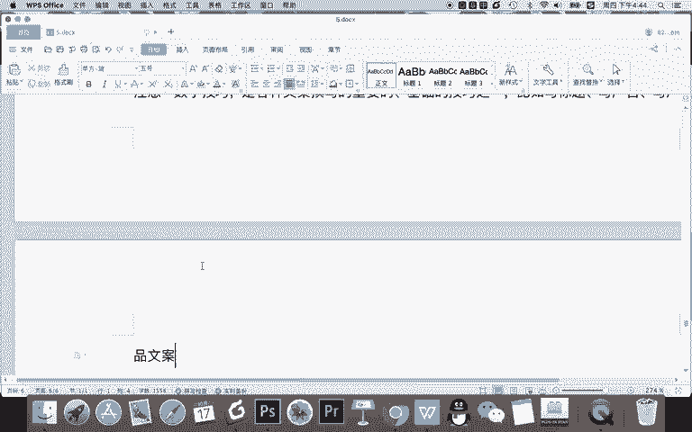
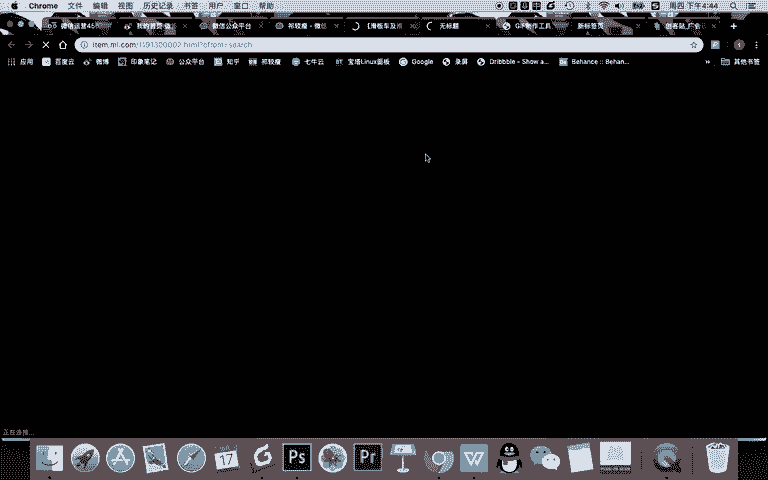
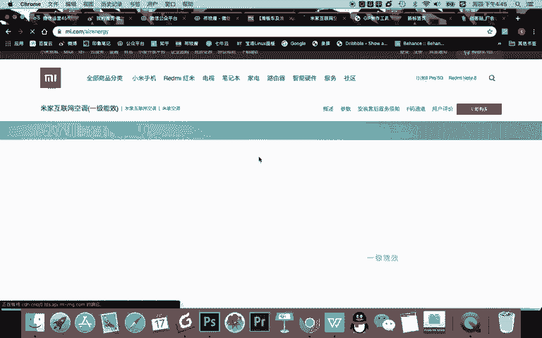

# 微信公众号运营视频全套 手撕运营 拳拳到肉 - P26：2.04-吸引力标题撰写技巧~1 - 达妹_达内教育 - BV1UvvvebEdT

同学们好，今天我们来学习微信运营第五天第四节课的内容，吸引力标题的撰写技巧。什么是吸引力标题呢？你可以理解成什么微信。吧图文标题。为什么要去？把这个内容给他写好了，你要记着一句话啊，张小龙，谁是张小龙？

微信支付。张小龙说过一句话，说微信。图文。80%的。越多量。来自于朋友圈。什么意思呢？约等于你写了一篇文章啊，比如说你有粉丝，不管你有没有粉丝啊，你的公众号里写了一篇文章，你进行群发推送之后。

这篇文章最终的阅读量的高低不是取决于你有多少粉丝，而是80%都被朋友圈啊这个转发量或者说朋友圈查看的次数决定。约等于比如说你有1万个粉丝。你写的一篇文章也许只有200阅读量。

因为如果没有任任何人转发的话啊，他他就只有这些粉丝会看到，对不对？粉丝还有可能没点开，所以呢阅读量就会很低的。但是我们知道。我们在朋友圈经常会看到一些爆款的文章。

这些文章呢它的转发量肯定是特别高的那我们就要去学会一个技能，就是也会写出一些。最起码啊在文章标题上边有吸引力的一个啊文章。那如果我们把标题写好了，那么很多用户在被转这篇文章被转化之后，他在朋友圈看到。

那他的点击率会更高。那你的文章的阅读量就会更高。那相同的。如果文章确实很好了，大家又更多的转发，那更多的转发就带来了更多的阅读。所以呢你要基本理解这句话啊。一篇文章的标题。对。阅读量。的影响。至少。战。

😊，整篇。文章的。50%啊，这是我个人的一个。预估或者说我个人认一种认识啊，一种认为。因为一篇文章你写的再好。如果你的标题不好，你想这篇文章它阅读量主要来自于朋友圈，那就阅等于用户只能看到标题。

你标题不好，你阅读量就没了。所以呢再好的文章也需要有一个吸引力的标题。所以我们就要会去写出有吸引力的标题，这样为你的文章怎么呀增加传播的可能性。那么在呃新媒体这个传播领域啊。

我相信任何人都知道标题的重要性。比如现在是什么时代。信息流时代什么呀？标题和封面图是。决定内容。啊，看了什么呀？核心吸引点。什么意思？比如说我们不管在微博也好，在朋友圈也好，或者在今日头条也好。

当你去浏览信息的时候，你基本不会看到这篇文章或这个视频的内容，你基本都被它视频的封面。比如说这篇文章的标题，甚至它的。封面图或者头图去吸引。所以呢把你的内容写好至关重要。那作为新媒体人呢。

他基本掌握了这样一个知识点之后呢，都会形成了一个趋事啊。我们知道有一个词叫什么？标记的。标题党呢是说啊很多新媒体人为了去追求这个流量，那么就把标题写的非常有吸引力。但是有些时候会怎样？会怎样走是吗？

企图或者说什么内容不够，匹配标题。故意。夸张的什么呀？形式或者夸张的是吧，标题。这样做。也就是说什么是标题党呢？就说标题党其实是一个负面词汇啊，说你这些内容呢其实写的没有那么回事，没有那么有吸引力。

但是你的标题故意给他夸大，或者说给它本本来没有相关性，你去用这个标题，那么你就叫做标题党标题党本身是一个什么呀贬义词。但是呢我们有些时候怎样？其实标题党它用了一些技巧。所以我们第二个怎样？像。

首先我们要向什么呀？标题党。学习标题写作技巧，注意啊，你一定要注意一点就是。纸。学习标题党的。创作技巧。啊。不做标题的。为什么呢？因为其实标题党呢他们都是有一些套路和技巧的。

我们只需要学会这些套路和技巧就行。但是你要怎样在创作的时候遵循一些基本的原则，就不夸张，不故同玄虚等等。然后呢不能做标题党。因为标题党是不好的。所以呢记得要向他学习，学习它的技法。

就好像你大家都会掌握的这个技呢都是每个人都有拥有了一把剑啊，但是你拿这个剑去表演节目是吧？还是说拿这个剑去杀人来来看你了，所以呢我希望大家都拿这个剑去很好的用它去是吧？惩恶扬善去比如说去表演节目啊。

你去把它为我所用啊，做正确的事，但是呢不要做坏事，所以呢向标题党学习，我们不做标题党。那上标题党学习呢，我这里给大家找了一个图。这里呢是曾经很火的一个截图，这个截图呢是统计了很多的标题。

这是之前啊正经体啊，尤其正经体也就是标题党的一个内容。那么。你看看这些标题都有什么共同的特点。然后我们总结出这些共同的特点，我们试着用它去创作标题。比如大家看。这些标题，全世界80万人疯船。

不可思议的事试看我我都惊呆了。你不可不知的制幅秘诀真的把大家都吓傻了。立刻分享京报，全世界崩溃了。还有啊你大家看很多标题，它的形式在在表面上是不是有相似的地方。

比如说38个、21个、15个、12个、超过6万人、45个、10个哎，第4个、第6个、第8个啊，同学们如果我们要向标题党学习它的创作技巧的话，你认为在我们刚刚看的这些标题里面，它有什么共同的技巧？

首先我认为第一个技巧。使用数字大家看。为什么这么巧合啊？有38个、21个、15个、12个、45个、10个、17等等等等，真的就是这么多吗？no，不是的，写一个数字只是一种技巧。什么是数字技巧呢？

在标题中。带上。数字能让。表达更什么精确。有吸引力。对不对？所以呢我们很多人在写标题的时候会使用数字这个键。那我要告诉大家的是要注意。数字技巧是各种文案。赚写了。什么呀重要的。基础的。技巧之一，比如。

写标题可以用数字计量，比如写广告，也可以用数字。这广告为什么能用呢？比如我们知道像啊充电5分钟通话2小时是不是也有数字？还有呢。这的产品。我什么是产品的话呢？比如说你写一段话就介绍你的产品。

比如我给大家看一下啊，这里做一个延伸。比如我们去看一下小米手机的网站，我们找随便找一个产品，看看它是不是使用了数字的这个技巧。

比如我们去到小米手机里面找一个非致名的一个产品啊，比如一些。看看有没有一些别的。我们找一个。常规的吧，就比如说穿戴设备。比如说我们看一下找这个滑板车好不好？找个滑板车。

你看看他是否是在写文章的时候用的数字的这个技巧。就这个儿童这个滑板车吧。

好，看一下有没有数字的迹巧啊。Yeah。Yeah。看最大承重，这些是不是都有啊，大承重踏踏板长长宽高啊，什么什么防滑什么什么颗粒啊，甚至同学们有没有发现啊，它连这个滑板身上到底有多少个颗粒。

这个东西都写出来，这就是用数字的技巧。怎样告诉你，哎，我们确实防滑，我们这防滑不是胡说的是吧？我们有很多防滑颗粒点，但是他把很多给它具体化了。看这里啊还有数字32毫米，前轮厚度，后轮。

他告诉我多少毫米有有有价值吗？其实对我来说并没有特别多的一些感受，对不对？包括这些年龄对吧？三档可调。刹车。然后呢，颜色等等。你看啊任何一个产品对小米来说，我个人认为它是比较喜欢用。

甚至比如说我们找个空调吧，它比较喜欢用数字的技巧。

我们看一下看功率面积功率面积。