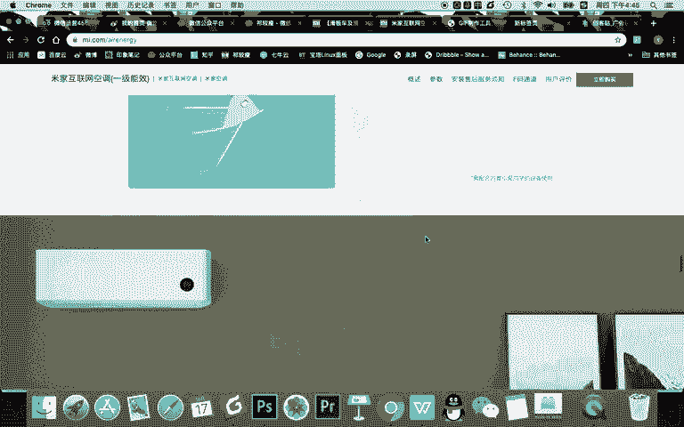
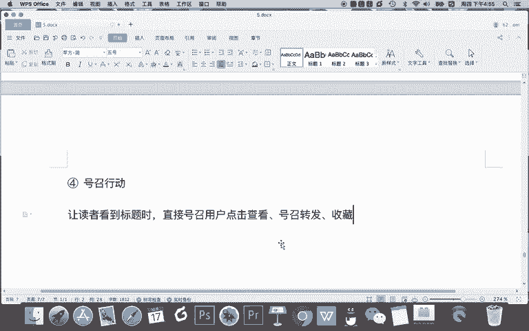

# 微信公众号运营视频全套 手撕运营 拳拳到肉 - P27：2.04-吸引力标题撰写技巧~2 - 达妹_达内教育 - BV1UvvvebEdT

静音。

啊，静音的话，我认为是不是会有分贝啊？是吧高达什么什么节能20%。4。75啊，什么一级能像啊这些东西对吧？啊，你看。

都是有数字的。所以呢我告诉你，你一定要记得啊，数字技巧是写各类文案的一个重要技巧之一。那么今天我们要将用它去写标题。那本节课的课程呢，我将啊从这个角度给大家撰写。我除了告诉你这个技巧之外，我还给你什么？

写一个案例，就用这种技巧去写标题，叫案例演示嘛。什么内容呢？比如说我们要写什么，如何。撰写或者说什么呀，新媒体人撰写吸引力。标题的技巧。比如说我呢今天要写一篇文章。

我的这篇文章分享的就是给心媒的人讲一讲吸引力标题的一些撰写技巧。OK我要利用啊我讲的所有的技巧去撰写不同的标题，但表达的是同一件事。那用数字的技巧怎么去讲解呢？很简单，比如说我分享了几个技巧，对不对？

那写一下。案例。下面行撰写写您标题的几个技巧。是吧。新媒点是转新你标题的，比如说。十个技巧，还有呢你还可以再增加数字。什么是新新媒题呢？直接写。10万加。标皮。什么呀。

撰写的10个技巧是不是这就也是数字了，还可以再写更多的数字啊，这就是用数字这种技巧去写标题。OK我们再回到我们的内容。第一个技巧呢是使用数字。那我们看一下。这些标题党还有没有别的一些共同的技巧？

除了这么多的数字之外，我看到他们都会用一些叹号，惊呆了。尤其第七个全场崩溃了，我的下巴掉了，全世界崩溃了，吓傻了，惊呆了，这叫什么？我认为吸引力标题或者说标题党一般常用的另一个技巧就什么？情绪化。

表达什么是情况要表达。什么呀？让标题饱含。情绪。通过情绪感染。为什么会有这样一个好处啊？你记得有情绪的。标题。笔。平淡的没有情绪的标题。更容易。这个很简单，当我们在看一些艺术表现形式的时候。

比如说我们说看话剧，就比看电影啊，或者说比看电视剧更容易投入情感啊，比如说你看电视剧可能没哭，但是你看话剧更容易哭。为什么？因为我个人认为啊，话剧它通过生化以及演员更夸张的肢体动作和情绪表达。

肢体也是有情绪的对吧？它的声音面部表情，还有他的肢体动作，能让用户更深的被感染。所以你这个情绪化呢，简单来说是能吸引眼球的。比如这个叹号啊，这种震惊的动作，它是简单来说吸引眼球的。第二，吸引眼球之后。

用户更容易被感染到。所以呢用情绪化的这种表达是标题当成的第二个技巧也是我们新媒体创作啊，在写标题的时候，一些技巧。比如我再给大家演示案例。如果用情绪化的表达去写。这个标题。那我怎么去写？

首先啊刚刚数字的删掉。怎么去写带情绪？新媒体专业编析列标题的技巧是不看完我都惊呆了。哎，我也参考这个方法怎样。这些。撰写1。万加标题的技巧，我怎么才知道。后悔。这样就行。对吧甚至你可以这样后悔。

这就是有情绪啊，我怎么才知道这些吸引力标题的技巧呢，它就比什么吸引力，就比这句话有吸引力。比如新媒解人专业标题的技巧。这句话好像很平淡，没有任何的记情绪，对不对？

但是呢像这个的话更容易打动那些关注标题写作技巧的一些人。所以呢这是情绪化表达的一个专业方法。那我们一起来看啊，除了情绪化表达之外啊，这些共性的标题党还有什么技巧？比如我我个人感觉他还有一个技巧。

你看不可告人的秘密。第四个太夸张了。第六个不是真的吧，第八个太疯狂了，你一定没看过。他总说第几个第几个很厉害，但他从来不告诉我这是什么。对不对？那这叫什么技巧呢？

我认为这就是有点设置一些悬疑勾引我的这样一个技巧。就是哎好像说的好特别是什么用情绪表达的特别有吸引力。但是他从来不告诉我那是什么，所以呢我也就怎么无从知道这是什么。那我想知道怎么，我得点进去看。

所以我个人认为啊，还有一个技巧，这个技巧叫第三种啊吸引力标题或者。啊，心引列标题的创作技巧吧，就是什么设置。悬疑什么是设置选疑？把标题描写的有什么呀悬疑，让用户好奇你讲的是什么。但在标题中。诱惑告诉你。

然后呢，让用户。想。点进去。看答案。我相信这个接下来我一说你又懂啊。啊，比如说我之前啊还看过其他的一些标题，也是这种悬疑啊，就比如说啊。比如卖西瓜的，比如说一个标题叫做什么讲这文案的。

说卖西瓜的老头儿直接说自己的西瓜难吃，反而销量很高。这就是一种悬疑啊，哎，怎么可能嘛，对不对？所以呢我们要学习这种技巧去用悬疑啊，尽量让你的标题有悬疑。那现在难点了，让大家看。

新媒体人撰写心列标题的技巧。这是一个很平淡的话。那么我怎么把这句话给他写的更有有悬疑感呢？来大家一起试一下。Okay。下面的专业标题的技巧，你看我们参考的啊，第几个第几个，那很简单。

我们也可以用这个技巧是吧？10万家。撰写标题的10万加标题的。撰写技巧是吧？看到是吗？你就比如说第第五个。数字啊，第五个真的是福。对不对？这样一个就就有一定悬疑了。第五个到底是什么？为什么让你服呢？

看到第五个我真是服了，那，是不是这样会更好？十万加标题的专业技巧。第五个真的是服。那这个时候不够有心理怎么办？我可以写谁呀？在写什么？比如说写一个知名的人某某某啊常用的1万家标题专记啊。

比如你写一个字名的单号啊，看到第五个真的是服，这就是有一个悬疑。就是呢你本身在标题上埋了一个点，但是呢不告诉他是什么，想让他进来看第几个，第几个是这就是悬疑。当然悬疑可以用别的一些技巧。

比如说我看到过的一个标题啊，也是非常有悬疑的，也是用户非常好奇，想点的。比如说这个标题是自从我结婚后啊，被别的男人宠上天。这个标题有没有悬疑，有，但其实呢他还用了一种什么超出常识的一个技巧啊。

OK这是我们后面会讲的一个内容，关于新媒体专业标题的这个技巧啊，我们现在设置悬疑参考标题的，基本可以这样写，是不是也没有特别大的难度，对吧？O除了以上三个呢。

我们再来看看在这些标题党中间还有没有别的一些技巧。Yeah。史上最强是吧？有差有真相，强烈推荐请看完是女人一定要看。然后呢，一定要看到最后什吗？不分享还是人吗？哎，大家是看这我讲的这几个。

他们有什么共同特点，强烈推荐，请看完。是吧我从裕这简直太神了，还有呢不分享还是人吗？一定要看第五个是不是？还有呢现在看了还有没有看完后，我惊呆了啊。如果说请看完一定要看这些技巧，这是什么技巧。

请看我一定要看是吧？号召。行动。我们其实在朋友圈也见过大量的这种号召行动的叫，什么是号召行动？让。读者看到标题时。直接号召用户点击查看。号召转发。

收藏啊，这个特别的多，比如说不转不是。