# 微信公众号运营视频全套 手撕运营 拳拳到肉 - P28：2.04-吸引力标题撰写技巧~3 - 达妹_达内教育 - BV1UvvvebEdT

中国人我们就这样一个套路，对不对？还有呢你看。爱国的都。转起来，这不就是号召吗？还有没有是吧，这些赶紧收藏吧。对不对？等等，全部是号召你还不。赶紧看。

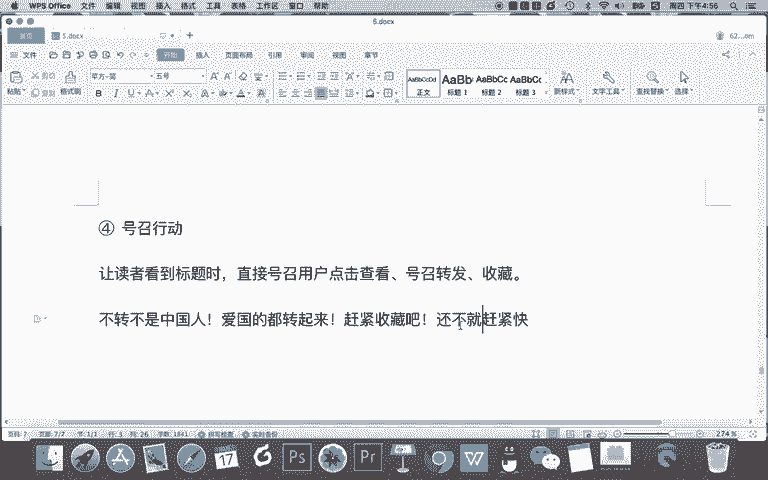

这些呢全部是有号召性的标题。所以呢这个这个技巧呢也是都比较常见的。我们在朋友圈，特别是对一些比较基础的啊，容易比如文化程度不是特别高，或者真是中老年人的，容易被煽动的那些人。你用这个技巧呢会更有效啊。

那我们来试一下啊，用这样一个号召的标题去写给新媒体这个专业技巧写一个标题，大家来思考一下。

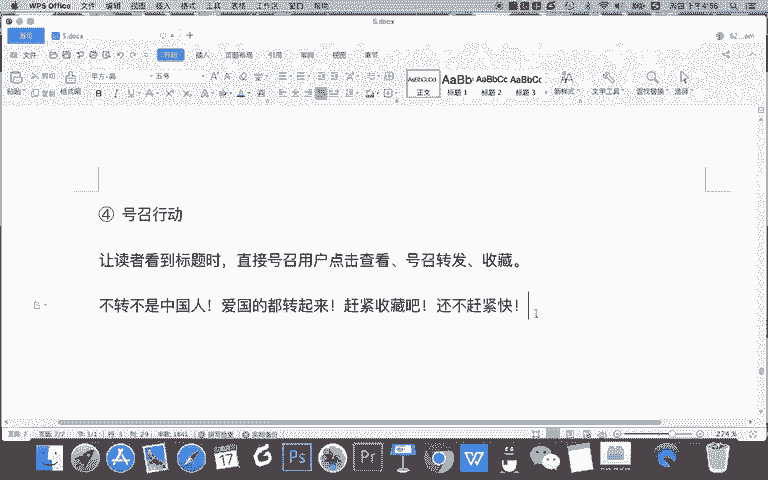

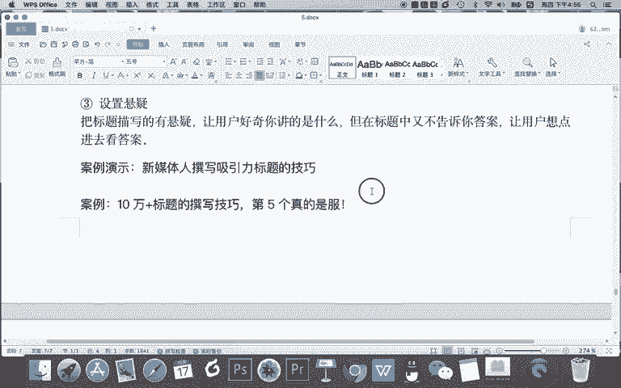

怎么号召这个心理技巧？这样。怎么样？比如说你就写。大咖总结的。什么呀？吸引力。标题。撰写技巧是吧？比如说什么。赶紧学起来。对不对？是这个标题写的不够好是吧？大咖总结谁，你把这个大咖写的具体一点。

告诉我他的名字，这样会更有吸引理，对不对？还有呢大咖总结的10个心引理标题，专业技巧，赶紧学起来是吧？你还不赶紧看等等等等，用这样的一些方法就是号召。

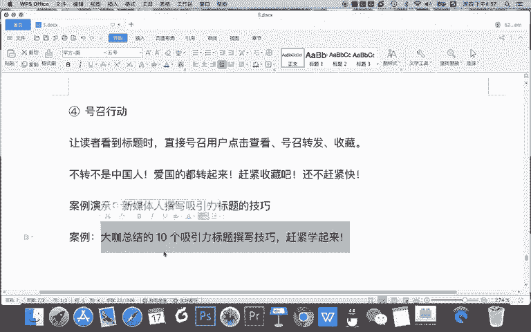

然后呢，这个技巧也比较简单。那其实说到以上四个技巧啊，你都能直观的从我们的这样一些啊。比如正经体或者说是标题党中间去看到。但其实呢所有的标题党都用了一个技巧。这个技巧呢也是我们写所有的标题要用到的技巧。

在这里我给大家去总结出来，第五就是什么。

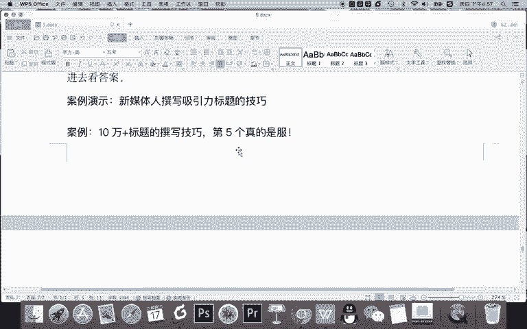

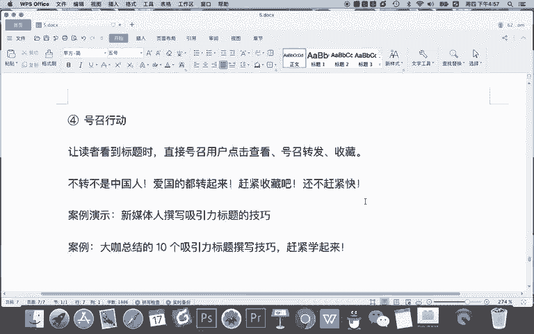

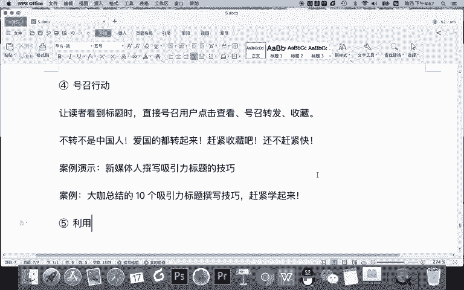

利用。人性。什么是利用人像？利用。人性公。最隐秘的什么呀？欲望去。吸引。读者。点击查看。

转发等等。那什么叫利用人性中？一些解密的用望。比如说。是从我。结婚后。对。别的。男人。冲上。O朋友们如果你看到这个标题，你会以为是什么？其实你是不是带着一个八卦的心理去看，哎。

这什么乱七八糟的一些情感啊？他结婚了，被别的男人闯起哎呦，你想八卦一下，想看对不对？但是告诉你，看了之后你后悔了。原来他说被别的男人是谁啊，就他儿子而已，所以你看这就是一个标题党啊，对不对？

这是一个套路。当然这是谁写的，这是迷蒙之前写的一个标题，我们知道迷蒙啊，他不仅什么标题写的好，他文章还好呢，粉丝很多，对不对？但是有些时候故意哗众取宠啊，之前因为瞎编一些不存在的事儿啊。

引起大家人人心的一个什么惶恐，就是传播一些什么焦虑和恐惧，然后号被封了，对吧？所以呢虽然他号被封了，这事儿啊，我们得吸取教训，但是确实人家懂了太多的记好套路。比如这个标题你就得服，所以这个利用人心。

还有呢。

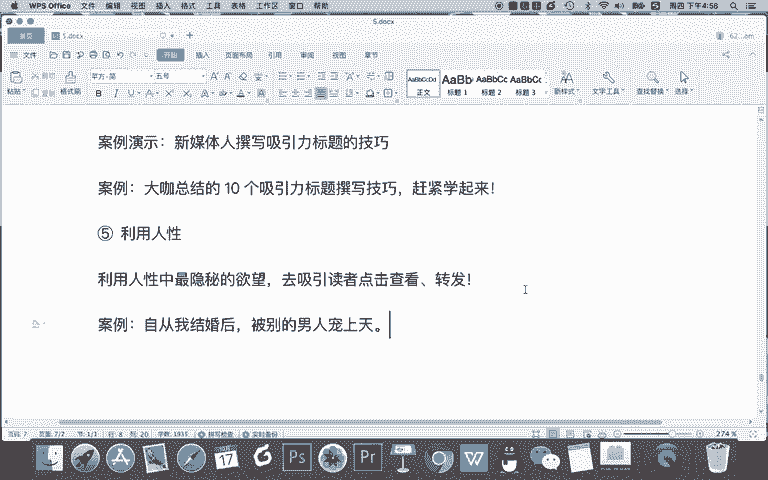

就是你网上见过特别多的这样的一些内容啊，关灯后的。女生宿舍。对不对？还有我告诉你，我小时候啊我会发现这个火车站以前火车管理不善啊，以前还是绿皮火车式的，这个火车站经常卖的一个报纸上面最大的印的什么？

你知道上面印着啥吗？我都崩溃了啊，印着。刘德华。是吧是。赵本山的。私生子。你说这种事儿谁信？对不对？但这就是利用人性啊，为啥这么说呢啊？因为首先这个事儿正常人动脑子就知道不可能是真的。

但你想十几年前在火车站，谁买这些报纸？是不是一些农民工，文化程度不高，可能初中毕业甚至小学毕业啊，他也知他为啥会买这个报纸，为啥？因为他认识的那些明星，也许就只有刘德华和赵本山。

但是呢你说你要针对这些人卖5毛1块的这样一份报纸，你怎么卖给他，你要告他国家大师的关心吗？不关心他关心的绝对是他知道的一些很基本的事情。所以呢这些甚至我感觉都是盗版的一些印刷品啊。

他就在火车站兜是这样的一些标题的内容，这就是利用人性，连人性的八卦，对不对？人性的好色，这样这个是什么人性的猎奇去这样去写啊，这个标题会更有系列。但我告诉你啊，大家去写利用人性的时候要注意尺度啊。

你不要夸张太狠，甚至说太三俗太低俗太色情，那么你的文章就容容易被禁掉。O这个技巧呢我给大家就讲到这里，我们再来看有难度的一个撰写啊，大看看用利用人性我们怎么去写。

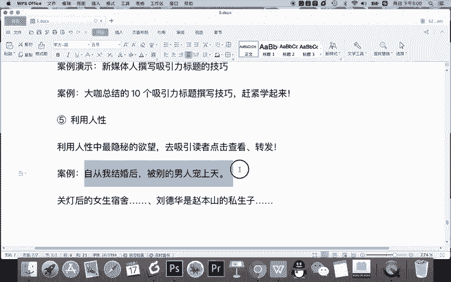

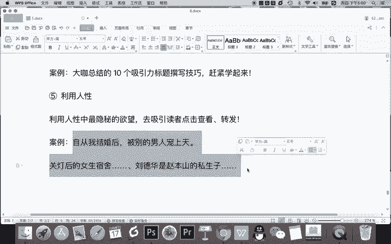

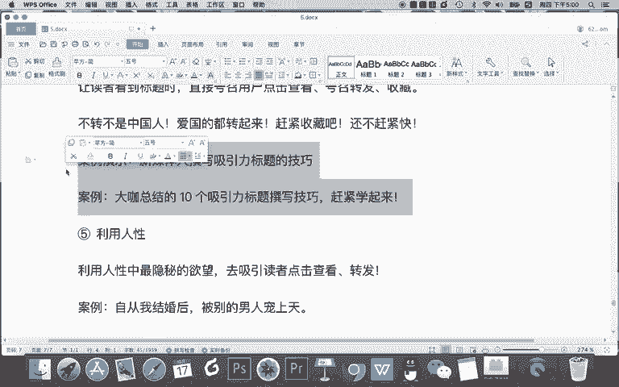

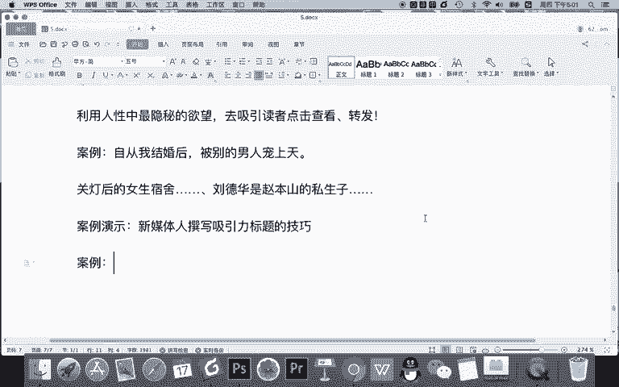

怎么就想。这么简，很简单啊，人都有啥欲望。贪婪好色，那我们就让他利用贪婪吧，怎样怎么。什么呀？贪婪有什么贪婪呢？就比如说什么。据说。10位。自媒体人。什么。用了。这些。标题。写作套路。阅读量。都超过了。

100万O你就可以这样去写，或者怎样。据说10位什么呀？月入。百万的自媒体人都用。这些。标题。写作。好据说什么呀，月入百万的自媒体人都用这些表题写作。O这用什么技人性啊，好什么贪财。

甚至你可以利用人的一些懒惰啊等等等等，都可以去用啊。比如说懒惰怎么用，就告诉你就按照这个套路去写，然后绝对能够什么阅读量翻倍啊等等啊，这就是利用人性。

所以呢我们从这样一个怎么说算是标题党里面其实也有值得思考和借鉴的一些东西。但是呢告诉大家，我刚刚的演示呢，其实随意的举个例子，你真正在工作中去写标题的时候，要什么用技巧，但不要无根据的去写。

比如说如果你写了月入百万的自媒体人用这些标题写作套路，那你就找的一些案例。比如说某个自媒体大咖曾经分享的一些标题写作套路。那这个自媒体呢，它月入百万，正好是事实，比如一些头部的账号月入百万也不多，对吧？

如果是这样的事实的话，你可以这样写。但如果这个事儿没有你瞎编啊，就不合适了。O我们关于吸引力标题的第一节课就给大家讲以上5个技巧。

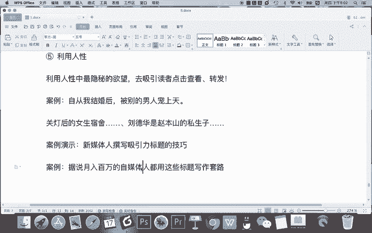

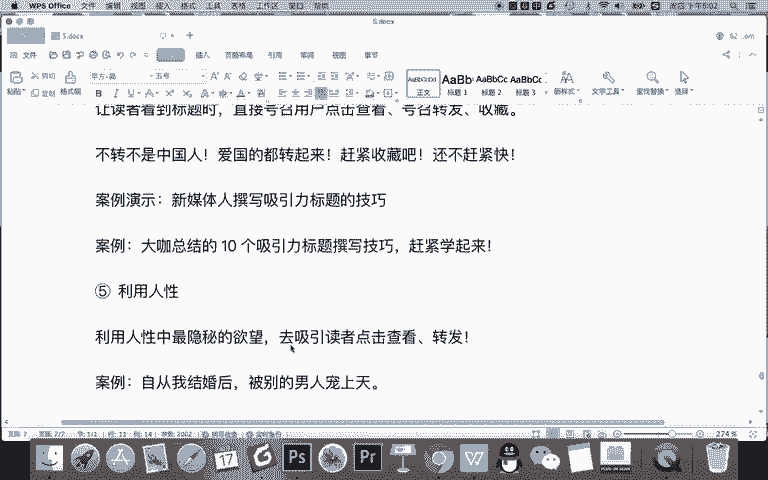

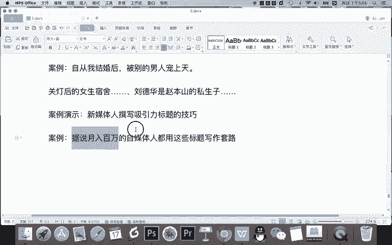

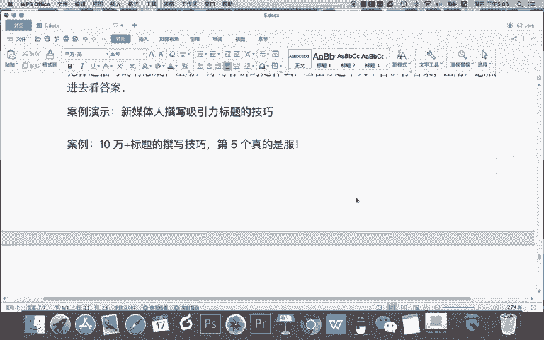

在下一节课我们将给大家讲更多的吸引力标题的创作技象。

