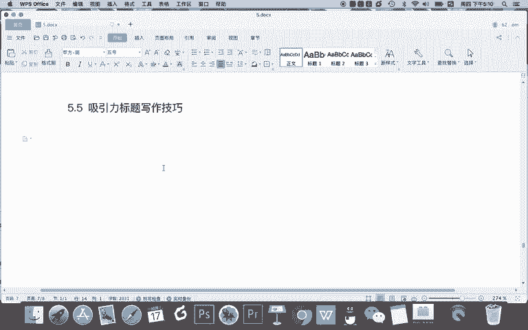
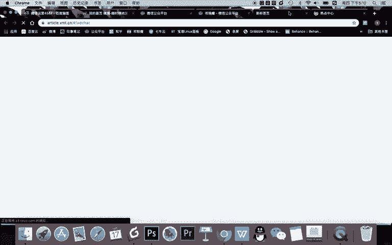
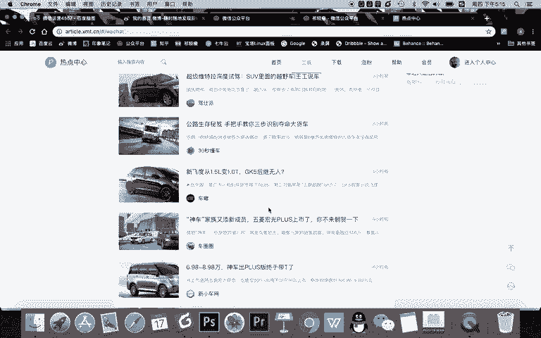
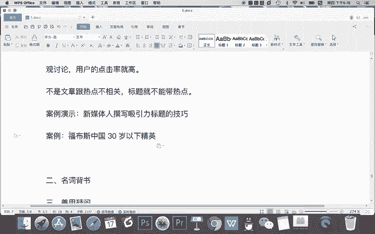

# 微信公众号运营视频全套 手撕运营 拳拳到肉 - P29：2.05-吸引力标题写作技巧~1 - 达妹_达内教育 - BV1UvvvebEdT

同学们好，在上节课呢，我们给大家讲了吸引力标题的写作技巧。上节课的五大技巧呢，其实都是从标题党给大家总结的啊。标题党呢我们再强调一遍，大家不能做标题党，但是可以学习标题党一些技巧啊，但是那些技巧。

你说老师我既然学它，我是不是就容易写上标题党，那我告诉你，你要本着什么本质去出发去撰写什么意思呢？就是如果你写像这个标题，如果你写的是关于儿字的内容，就不要去标题上看不出来这个内容是什么对吧？

这就是不好。那如果是这样啊，你看这个标题它本身要表达的就是关于吸引力标题的撰写技巧的。那你标题中能看出来这个标题就是讲吸引力标题撰写技巧的。那这就不算是什么故意去进行标题党，因为内容一看啊，知道是什么。

只是用了一些修辞的一些技巧。所以呢像这种啊才是故意的标题党。因为图文不符，故意夸张的。像这像这个被别人那人闯上天呢你。就会看的是八卦，其实关于儿子，这也是故意引导你的一些标题党。

所以我们在用标题党的技巧去创作的时候，我希望大家能够跟遵循一点嘛。就本着一点就是在你的标题中要让读者看出来是什么内容，写吸引力标题专业技巧。那这个标题的表达，就是这个方面，这样呢能获取你的目标用户。

让真正啊喜欢或需要这个内容的人去查看。那本节课呢我们继续给大家分享吸引力标题的创作技巧啊，其实呢总共要给大家分享10个。那接下来这5个技巧我们从哪去总结呢？有一个小技巧啊，大家在写标题的时候。

你说我今天虽然教给了大家很多技巧，但我告诉大家，你并不能够把这些技巧应用的很好，为什么？因为你写的少见得少。那所以现在我们要建的多，从大量的这些热点中啊，或者说大量的一些吸引力标题案例中去总结一些技巧。

然后我们再反复查看，反复使用，反复实战，然后我们才能写着标题，比如我认为能够上到微信的热门的这些标题写实都不错。特别是啊大家看针对女性的一些标题。比如我们看看辣妈帮。

这里面的内容看看他们都用了什么技巧啊，比如大家看啊，生完二胎我们就离婚。太惊了，这用什么技巧？其实我们看啊刚刚我们那个讲的。标题双的介绍里面有哪个聊天截图太惊人，首先有人性，对不对？我们想八卦一下。

看看别人说的是什么，还有呢有悬疑，他就不告诉你是什么，但想让你看出生只有480个，顺利出院，这是什么事儿？对吧？这其实是一种属于社会资讯啊，有数字，但不一定是数字。不生二胎的女人都不想好好过日子。哎。

你看这是什么？其实这有情绪啊，因为给女人看说女人必须生二胎，是不是特别让女人容易反感，对吧？谁说女人就一定要生孩子，对不对？你肯定这样就不是特别好。你看这个属于什么？吃饭慢的小朋友要去厕所吃，远方回应。

确实其实你看这就是一个新的技巧啊，这叫什么热点啊？为什么会写这个？因为最近我们看是不是关于小朋友幼儿园又出了一些事情啊，所以这是关于热点的一个相关的话题，5岁儿子考72分，妈妈吞要自杀，你什么情绪。

孩子什么病。你看。啊，这个其实有这个的就不叫数字，这是一种什么反差考72法推样这自杀。所以我们刚刚一会儿给大家讲了一个技巧，叫反差对比啊。那小公主变小保姆是不是有对比，对吧？还有呢这个用什么？

宝宝总哭闹，肠绞痛，5秒快速安慰，你试了吗？这是什么？这其实是一种什么疑问啊，我们等会儿会给大家讲，你看我们说到两个技巧了，一个是疑问，一个是对比，包括这个对比反差啊。这是什么？哎。

这个这种技巧特别的常见。我们在朋友圈呢经常会看到一些关于各种明星的啊安吉森蒂啊、kimi啊、娱乐圈的宝宝都在做这件事儿。哎，这个标题我认为用了两个技巧，第一都在做这件事儿。

我们刚刚讲的那个技巧有什么事儿，这是什么？就他说的是这件事，咱不告诉你什么，这就是悬疑，对不对？但同时呢标题中又会有安基森蒂啊，这这些东西，这叫什么？这叫名词啊，就是利用一些名人效应去展示这个内容。哎。

神奇的罗森塔尔效应是什么？用对了，已经在起跑线啊，有悬疑，但同时有一个名词，什么罗森塔尔。对吧OK你看啊这些标题都有类似的迹象。哪些事让家人受不了，过来人说说哎，哪些事儿，这是什么？

这是首先获取的目标用户非常精准，都是孕期的那些事儿，那些人过来说，对不对？还有哪些事儿呢？这是一种疑问。对吧。飞机上孩子哭闹啊，我们比。我们会比那个说有本事陪生孩子的妈妈做的好吗？这什么事热点，对不对？

产后大姨妈来临，主要看以下几点，哎，以下几点没说哪几点，对不对？这叫什么悬疑。怀孕了能不能吃药，你看这也是疑问啊。OK我们看到这个里面的有些标题，我们总结了共同的一些迹巧。我们再来看一下汽车类啊。

刚刚是女人，现在是男人。我先表个态，5年后30款电动车，这叫什么数字，对不对？而且什么有对比，5年对比30款。这个滴滴司机技术很好，让我很舒服，五星好评。哎，我认为大家看啊这个标题有什么技巧？

让我很舒服。其实这个标题有点什么利用人性啊，我们刚刚讲利用人性，就是啥干啥事让你很舒服，对不对？Yeah。观点啊，这个是热点啊，产销三连价。我们知道最近的新闻就是新能源汽车，它的销量还产量都在降低。

对不？这是一些热点新闻嘛好的热点新闻资讯。连逾402年称霸美国，他是怎么办的？这是什么？首先有数字，他是谁啊？他想看对不对？所以这是悬疑。还有视频老婆要选GLRC怎么办？是吧？别慌。

看完这个再说做车评的啊，这个呢有什么？这其实外车评它是带上自己的标题，就是一是突出自己的品牌。其实呢自己的品牌也是一个热点的名词，能让自己的粉丝更爱看。来这个看一下10月新增2。6万哎，这个是一个热点。

同时有数字，对不对？到底值不值得买疑问不香吗？疑问。所以呢大家看到啊我们用的标题有一些共同的技巧。这首先呢这些技巧我给大家去总结了一下，这是。

5个我们在一些热门文章中经常看到这个标题。当然这标题呢一点都不。少见啊，但是呢我们有必要再给大家进行一个梳理，并且告诉大家去创作的一个技巧。首先跟热点啊，这个不用说，你记得。热点就是流量是吧？做自媒体。

不紧。文章要写。热点。标题中。同样要。展示热点。有热点。用户的点击率。就高。那为什么同学们有热点用户点击率就高啊？因为记得有热点。用户就爱。围观讨论啊，所以点击率高。所以我们在写标题的时候。

可以用一些创作热点创作的一个技巧。就但是你要记着一点啊，不是文章。跟热点。不相关。标题。就不拿。带热的。什么意思？就是如果你写这篇文章，这篇文章本身跟这个热点没有任何的关系。

但其实有些时候你的标题也可以利用这个热点去创作。比如说啊我们还用这个技巧。首先啊你看这个技巧啊，这个标题就特别普通了，对不对？这就是一个新媒体人专业心理标题的一个技巧的事。它跟任何热点目前都没有关系。

但现在呢我就要用一种方法把它跟热点结合起来，让用户更爱看，那么怎么办呢？怎么创作。很简单，我要去看看目前都有什么热点。比如我看一下微博的吧，看微博热搜有什么热点。看看有没有大家都知道的一些热点。啊。

这些明星的这些不是特别好，对不对？哎，你看最近有一个热点叫福布斯中国三思岁下精英。对不对？哎，你看这个这个标题，我感觉我们可以跟啊，就比如说说的张风情张这个我们没法跟。因为我对他不了解。

但是呢我认为这个标题福布斯3岁岁以下经英，我认为每年都会公布这个事儿啊，我们这是一个也就知道现在是一个一个热点。那我们去怎么结合呢？比如案例，我们把这个事儿先给他复制过来。用这个技巧啊。

这个热点我们怎么去给他写？我们其实就是为了写一个细引的标题。但是我们现在要大费周。

