# 微信公众号运营视频全套 手撕运营 拳拳到肉 - P2：1.01-公众号注册及设置~1 - 达妹_达内教育 - BV1UvvvebEdT

同学们好，今天我们一起来学习微信运营相关的内容。在第一节课呢，我们首先来了解一下微信公众号啊，了解学习微信公众号注册及基础设置的相关知识。首先。呃，大家对微信公众号了解的多吗？我们通常会说到微信公众号。

会说到一个词公众平台，对不对？那么我问一下大家，公众平台和公众号有什么区别？Okay。这个大家知道吗？其实他们是有区别的区别的啊。我们说到公众。平台其实只四个东西。比如大家来看一下啊，我打开一个内容。

这是公众平台，对不对？那我去了公众平台之后，他让我登录啊，我先退出，我点注册。

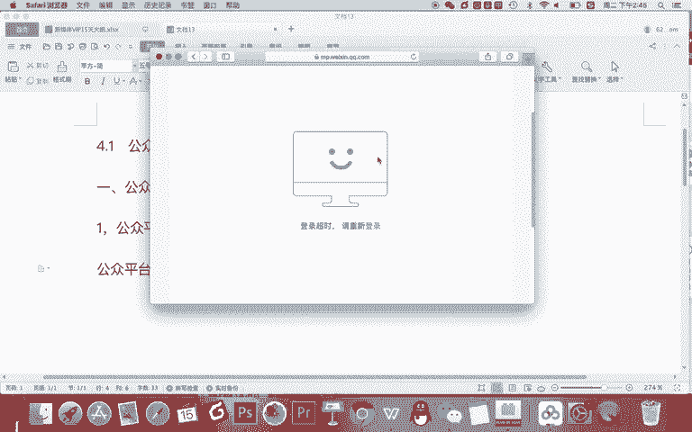

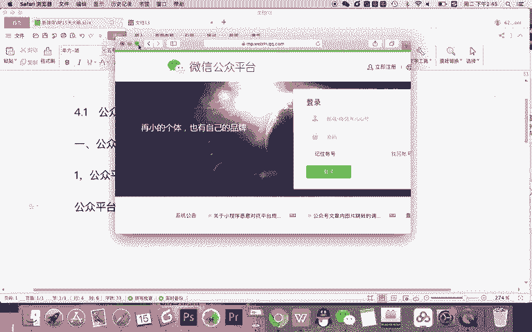

是。点一下立即注册的家看一下。你看这里是微信公众平台，它包含4种账号类型，订阅号、服务号、小程序和企业微信。

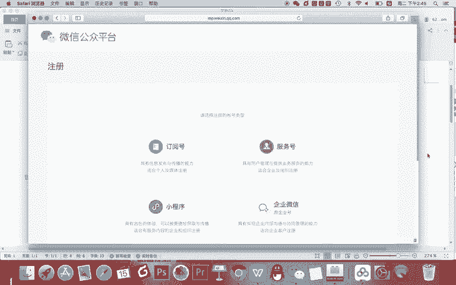

所以我们说到微信的公众平台，指的是这样一个平台啊，它包含4个内容。但我们所说的公众号是什么？指的是。订阅号和。服务好。公众平台呢其实是不仅有号的。

还有小程序和企业微信都是对你看啊前三个来说是对企业服务的。第四个呢是企业员工管理的对吧？它都是公众平台。那是我们同时啊通常所讲的公众号呢，主要是指订阅号号服务行。那第二个问题。

当我们去说企业运营公众号的时候啊，我们应该选择订阅号还是服务号？所以呢我们要理理解它的什么区别。我们应该选定阅号去做还是服务号去做呢？如果如果是你开一家公司。你说哎我也不太清楚啊，为什么？

因为我不清楚定位号和服务和一个区别啊。首先那我给大家分享一下它的一个区别啊。第一个最关键的一个区别。订阅号。每天。能发布一次信息。就比如我关注了你的这个账号之后啊。

你每天如果发消息都我可以都都你都能发成功，我也都能收得到，对吧？但。服务好。每个月能发。4条。相息。所以呢如果是订阅号，每天都可以给用户发信息。但如果是服务号呢，你一个月平均一周只能给用户发一次消息啊。

这是第一个也是最核心的区别。那第二个区别是什么？订阅号。信息收录到。微信订阅号。菜单里。服务号信息直接展示在。微信对话中。什么意思呢？就如果你啊去关注的有一些微信的订阅号的话。

你会知道平时订阅号给你发消息，你会收到提醒吗？不会。它会有一个小红点啊，小红点会显示在哪里呢？会显示到你的微信对话里有一个菜单，其中有一个对话叫订阅号。这个订阅号里面一打开有很多你关注的订阅号，对吧？

它有小红点有信息，所以呢它是被收到订阅号的菜单里的。但服务号呢，如果他给你群发了一个消息。你的手机微信会直接收到一个提醒，对吧？会手机震动，甚至呢它会直接展示到微信的最上面，它因为它是微信对话。

就像你的好朋友去给你发了一句话一样啊，它会是有提醒的，所以这是第二个区别，就是服务号。他的体醒更强。但订阅号呢啊基本没什么提醒，就一小红点啊，也不会去打扰着你。OK这是显示方式的区别。第3个啊。

我认为非常重要的一个区别就是。定源号。没有。微信支付。功能。服务号可以申请。开通。微信支付。也就是你想去公司卖东西的话，你用订阅号，你是没办法开通微信支付功能。那你说哎我用订阅号就没有办法卖东西了吗？

不是的，用订阅号，你可以走第三方，用一些第三方平台，同样也可以卖东西。但服务号呢你只能怎样啊，你服务号你当然啊也可以走第三方，但同时你还可以申请微信支付，把你卖东西的这个收入啊直接打到你的公司的账户里。

那说到公司，那还有一个非常重要的区别。第四点。订阅号。可以。个人注册。服务号。只能企业组织。结个。注册。大家注意这个表述啊，订阅号可以个以个人注册。那你说我可以不可以公司注册？当然可以啊。

你要记得这一个点，就是我们个人如果你没有企业营业执照等信息的话，你只能注册我们公众号的订阅号，不能注册服务号。因为服务号只能企业组织或者一些机构注册。那还有一个区别啊，在这里我就不单拎出来写了。

记得一点，个人注册的。

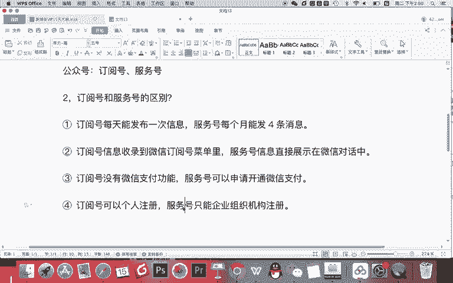

订阅号无法进行认证。什么意思？虽然啊刚刚有讲个人也可以注册一个订阅号，但是你记得。所有的订阅号符务号基本都有认证的功能。但你个人注册的，因为他没有一些企业的一些资质是无法认证的。

没认证有什么不一样的地方，有一个基本的不一样的地方。

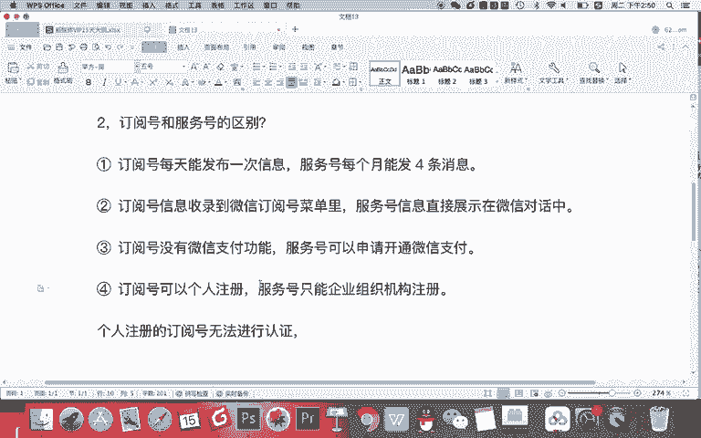

5。认证的。订阅号。自定义。菜单不能放外链啊。这是一个比较大的一个区别。就如果你是个人注册的订阅号，没有认证的话，那你的订阅号的自定义菜单里是不能放外链的啊，这是一个区别。给大家说一下。

那订阅号和服务号还有没有别的区功能区别？

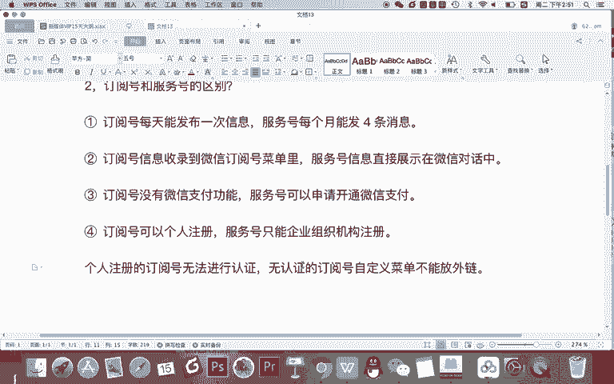

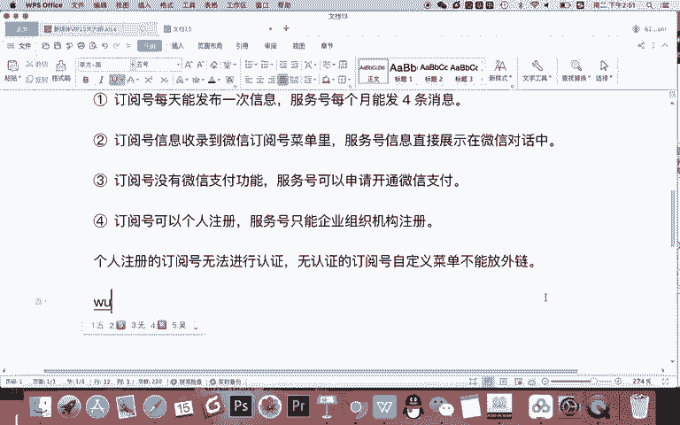

还有没有？其实我们知道以上最核心的基本能够确定一个区别啊。那在核心上来说啊，记得订阅号。

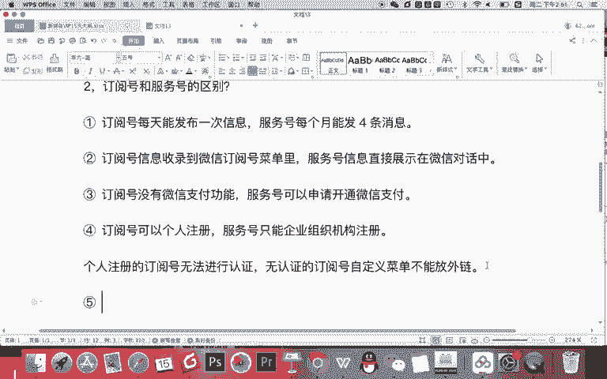

与。服务号相比少。很多什么呀权限和。功能。比如没有获取用户位置信息等。

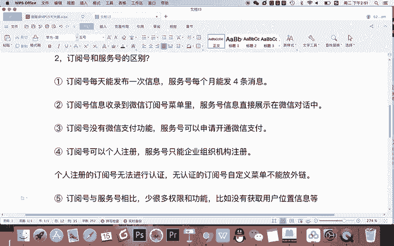

权限。因为服务号啊，他做服务才能获取用户的信息等等这些功能啊。但订阅号有一个好处，就是你记得啊，每天能发一次消息啊，特别适合跟用户进行沟通。所以我们最终来说。

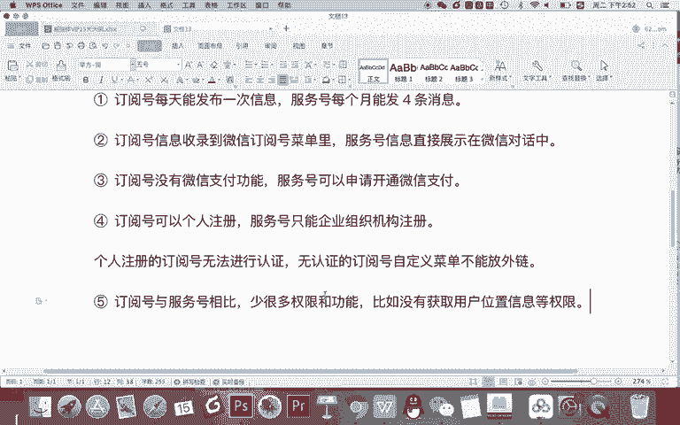

。订阅号。是适合。用户。订阅的。服务号适合企业做服务。所以你说哎老师到底哪个号好呢？是不是服务号唉，它有这些权限和功能更好no其实你看你干嘛？如果你注册公众号是为了写文章去跟用户沟通的话。

是增长粉丝的话，你就注册订阅号合适。因为他基本写文章每天都能发，对不对？跟用户基本的沟通也不影响。但是你说我要做的企业服务。我要去有微信支付，我要去获取用户的位置信息等等的话，哎。

而且我呢不需要频繁的去跟我的用户去发消息，那你可以做服务号，所以在基本的功能上啊，订阅号服务或的功能都一样的，只是在核心上，你看你是想增粉做让用户订阅你啊，这是一个目的，还是说你要做服务，这是你的目的。

OK确定了订阅号和服务号之后啊，第三个。

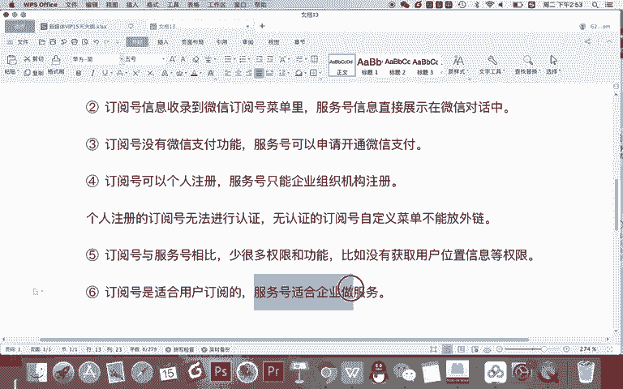

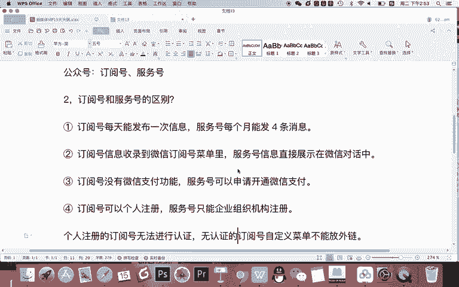

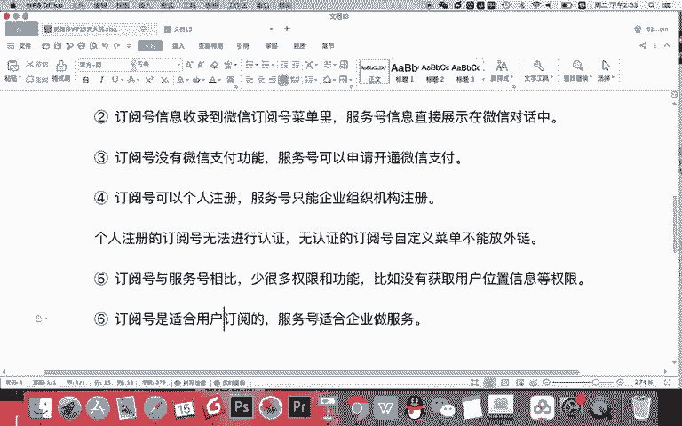

你要做的事情就是什么呀？今天我们要求大家进行。订阅号的注册。

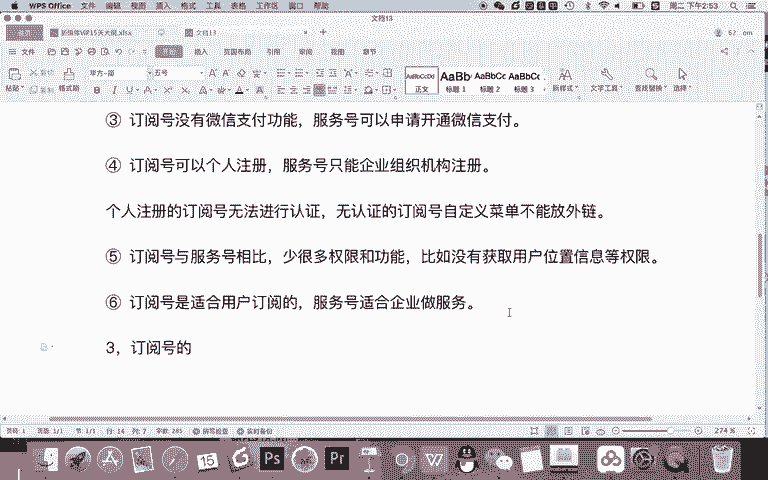

ok。首先怎么注册呢？比如你打开浏览器啊。百度搜索一个地址，你就搜直接百度搜索微信公众平台就可以了。

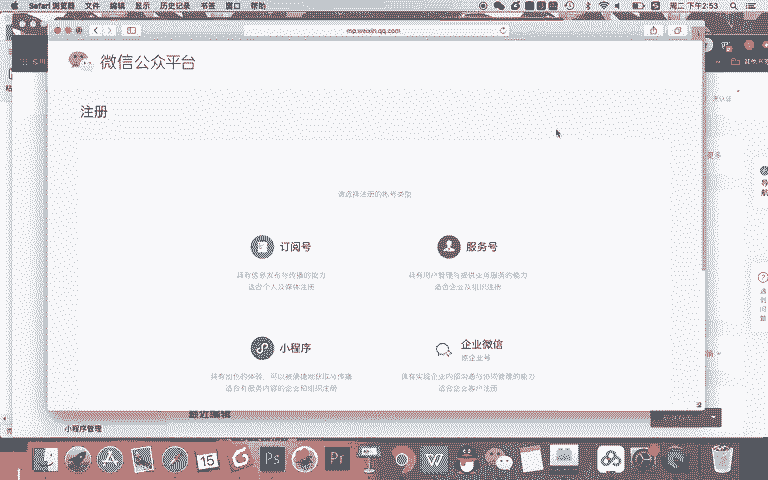

然后呢，比如我把这个地址发到咱们的笔记里啊，你可以去。

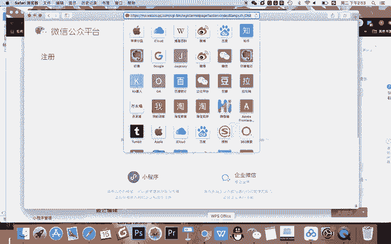

注册一下。

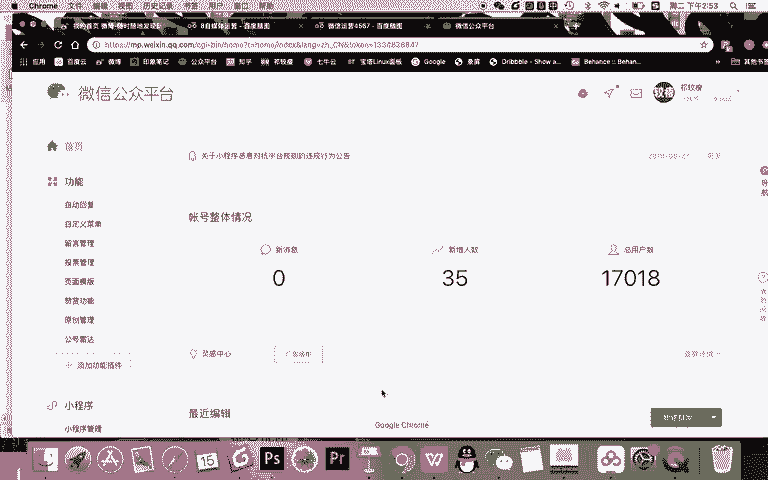

那么在注册的时候，我需要给你讲一下啊，很简单。注册订阅号呢，你首先要有一个邮箱，然后记得永远记得你的邮箱，永远记得你设置好的密码之后，你去登录你的订阅号，你就可以。

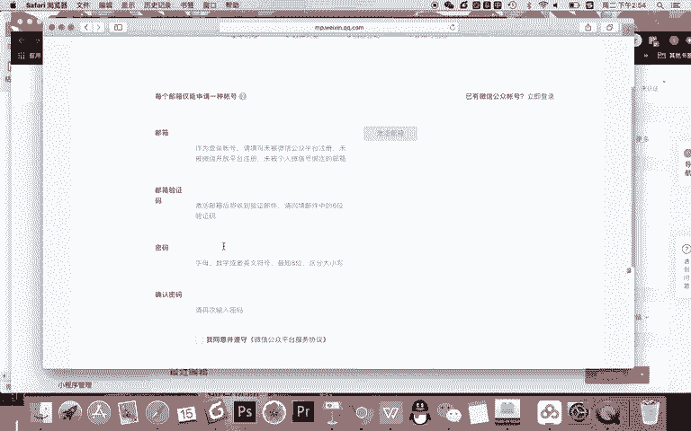