# 微信公众号运营视频全套 手撕运营 拳拳到肉 - P30：2.05-吸引力标题写作技巧~2 - 达妹_达内教育 - BV1UvvvebEdT

主要结合这个认点怎么干？很简单啊，你看简单来说怎么。什么他。什么。或者说这这样就写啊。一个自媒体人，你想有没有专门做新媒体或做自媒体的这个大咖或精英？他正好获得了福布斯30岁以下的经英，我认为是可以的。

比如我知道就有一个啊精英，今天他发了这个微博啊，他说自己被上榜了嘛，约等于他是谁啊？他是一个。啊，好像叫什么魏布斯，是一个做数码领域的一个。大V，那么他是做数码领域的，他是做自媒体的。

你想他会不会去写标题，当然需要对不对？因为他要做创作嘛，他要去写，所以你你可以怎么去写。比如说以30岁以下这个精英分享的什么呀？自媒体标题。技巧什么或者说什么。对。连。福布斯中国30岁以下精英都在用的。

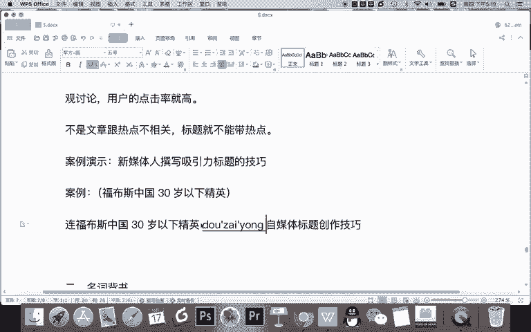

自媒体标题上的角，或者这样去写啊，什么？什么。听说。什么呀。他用这些。自媒体。创作技巧。都什么呀？成为。福布斯中国30岁。静音了都上吧。静英。哎，什么这是一种训练的表达手法，就是有点开玩笑的那种感觉。

但是这样写行不行？我认为是可以的。为什么啊？因为首先他是做自媒体的，你说他有没有一些创作技巧，当然有，比如说你为了这样写这个标题，记得啊不能没有关系，一定要有关系。

那你为了让这个人也就是他已经上榜的这个人跟这些技巧有关，你可以怎么办？你记得他既然是做自媒体，他一定会写标题，他一定用了一些技巧，那么你就可以分析。

比如这篇这篇文章的开头去分析几个他写的文章的标题的技巧。然后说什么啊，你看人家这个做自媒体的是不是都已经上榜了这么优秀是吧？然后人家还在用这些技巧，那我们也要向他学习。那今天呢给大家分享更多的一些技巧。

所以你看你可以从一个上榜的人为案例，作为切入点，分析他的标题，然后引出你要写的标题创作技巧，这就是热点结合的方法，记得啊。

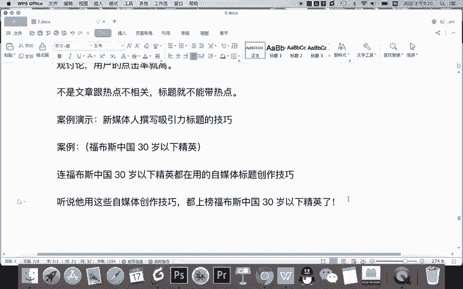

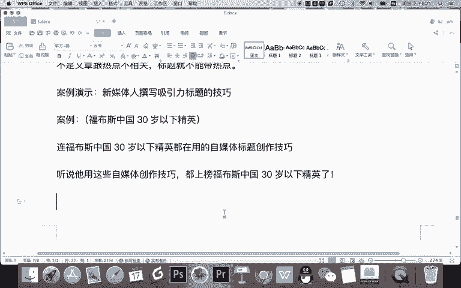

结合热点。一定要什么呀？有逻辑性和。相关性。找出热点和你的表达。点的。共通。退错。就像我刚刚费大费周纸的啊，去给大家分享，哎说找了福务斯中国三岁亚精英上榜，跟这个自媒体创作本来是两竿子是吧？

大竿子打不着的两件事儿，但是呢你看我给他联系起来，怎么联系的，我就是找到了一个人，比如卫布斯这个人，他是做自媒体的，他上榜了，那他做自媒体，他就会去分享一些内容，对不对？我分我分析他的标题。

从这个热点引入到我的内容。所以呢既跟卫布斯有关，也就是跟这个热点有关，又同时表达了我这个内容，这就是相关性。所以希望大家在热点创作的时候，记得啊，一定要找到相关性。如果没有相关性。

你硬生生的去写这个标题，那就不符合逻辑。那用户看了就懵逼了，这就不对啊。OK这是跟热点的一个技巧，这个不用多说，你记得啊，尽量的去怎样找每天或当天跟你有相关性的，你的受众也能懂的。

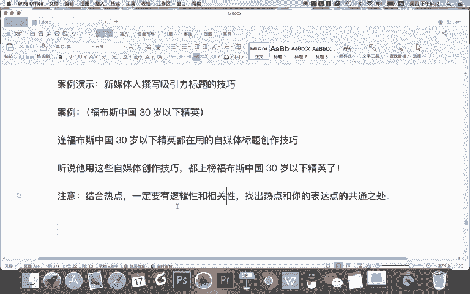

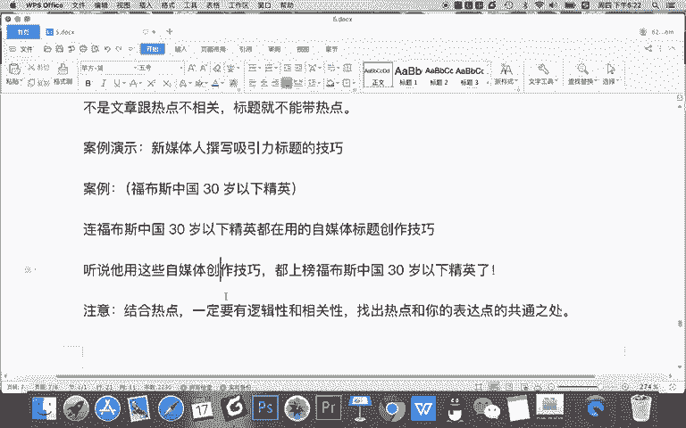

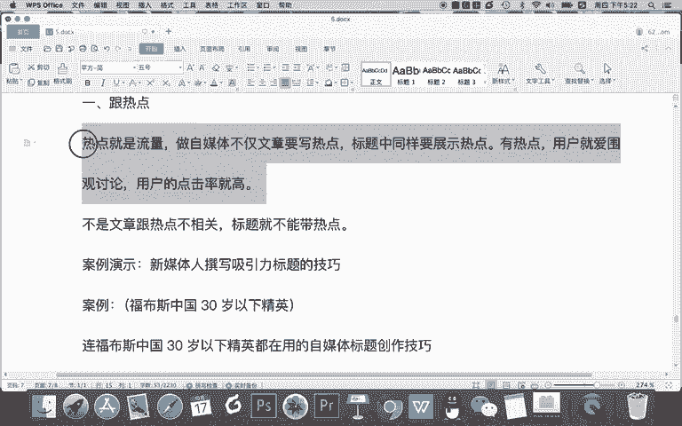

一些热点。比如说有些时候热点啊并不一定找这种微博热搜，这种全民都关注的热点。你做新媒体的，你找新媒体领域的一些热点，也可以去跟OK这是跟热点啊，记得跟热点很重要，而且要跟正确。

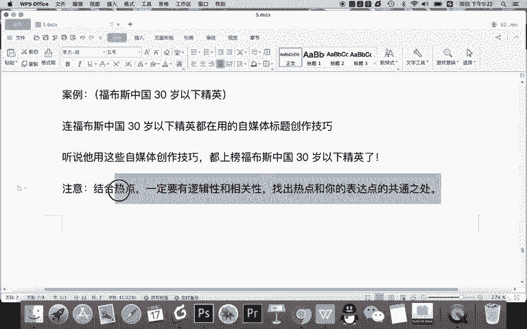

第二个技巧呢是名词背书。什么是名词背书呢？比如举例给大家讲一下啊，名词。名词啊。这里说的名词不是那个副词名词的名词，指有知名度的。什么在大众。心中有认知的一些。比如。马云。马化腾，比如。区。快练。

比如云计算，甚至比如新媒体领域，最近提什么呀？比如KOL还是什么呀？还有一个词QL现在不提了，就提了么？QC是不是比如说什么营销。矩阵啊OK记得这是。你的这个受众领域，他知道这个词就可以。

不用所有人知道啊。还有呢，比如人人都知道的名词，还有什么？长城还有呢。明星。名人。什么。知名的。地点。知名的。什么物体。知名的。知识名词等等，这都叫。什么呀？也就是说我们要去写标题的时候。

你要怎样目的啊。利用名词。拉近。Okay。拉近什么呀？标题和。

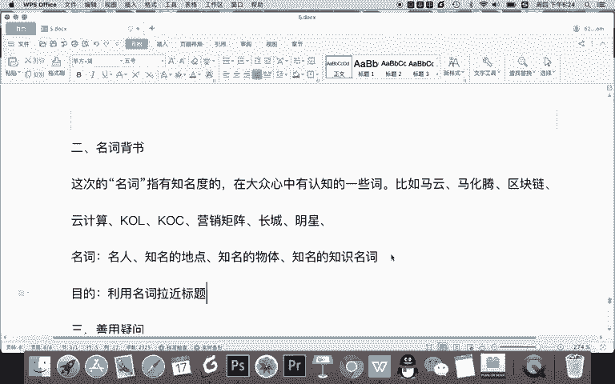

读者的关系为什么要拉紧？记得。人类。或者说什么。用户。天生。对自己熟知的。是吧内容。更感兴趣。所以，利用名词能吸引用户的。注意力。提高文章标题或者提高文章的。点击率很简单。

比如说我们经常在朋友圈里看到啊，马云说过的几个道理，几个道理，马云分享的一些观点当中，马云之前发微博说过说哎，我个人都很郁闷，说我都不知道我原来讲过这么多有道理的话，是吧？这说明什么事？

说明马云很多道理没有说过，但这个自媒体人为了表达这个观点，他前面加个马云说的，对不对？他前面加一个马化腾说的，加任何一个名人说的，我们在朋友圈经常看到一些名人说的一些话，是这个名人是吧？

鲁迅都没说过的话，也加一个这这个内容，鲁迅都死不死不瞑目了，对不对？这个意思就是说我们为啥要加啊，其实这个作者目的就是垃圾跟读者的关系。你想假如因针对一个农村的老大爷，你写了标题是关于区块链的。

他都没听过这个词，你认为他在朋友圈看到这个内容的时候，他会去留意吗，不会，但是如果写的是他知道的，他绝对会留意，就像我们上面这个标题，刘德华是赵本山的私生。

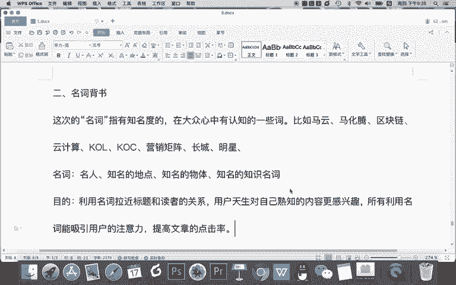

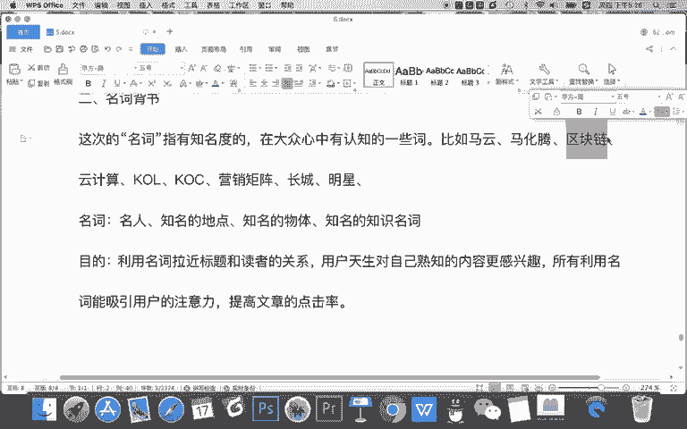

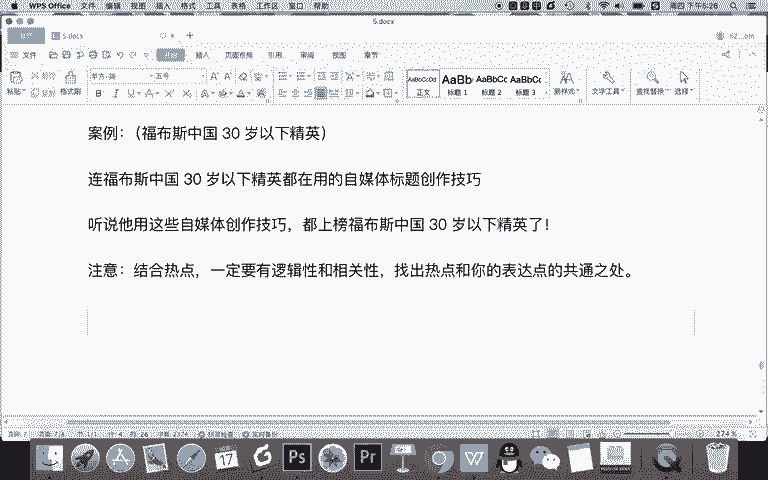

我都懵了，我当时看到这个，但我就想他为啥会写出这么不靠谱的内容，为什么？因为他买报纸的人是没有文化程度的人，他只认的明星中的，只认得刘德华和赵本山，他就这样去写，然后呢。

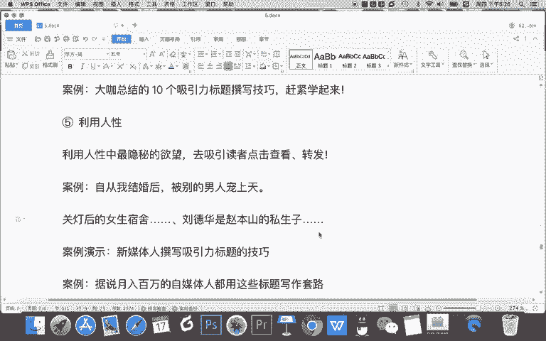

让什么让这个受众，也就是这个比如说这个农民工可能对这个内容感兴趣，然后他会买。所以呢这就是名词背书的小名词就是说找上这个名词，你会让知道他的人更感兴趣。所以呢我们要去用名人也行，或者证名的地点。

比如长城，每年11。

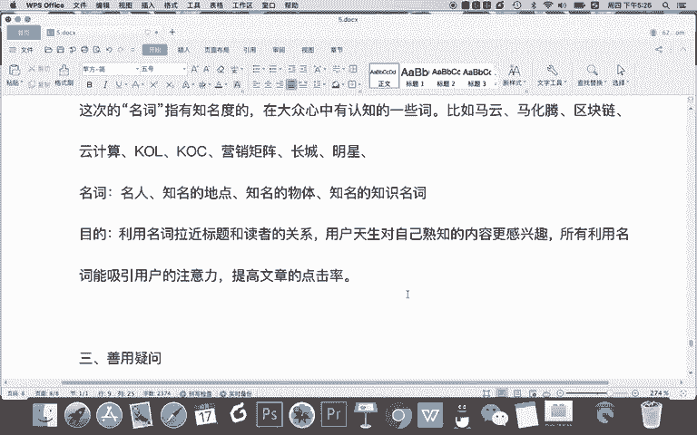

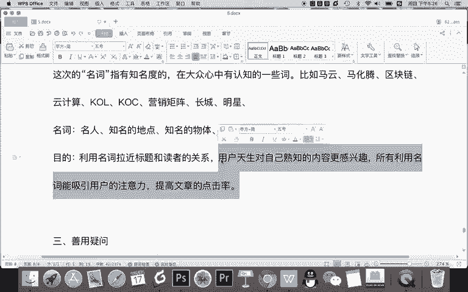

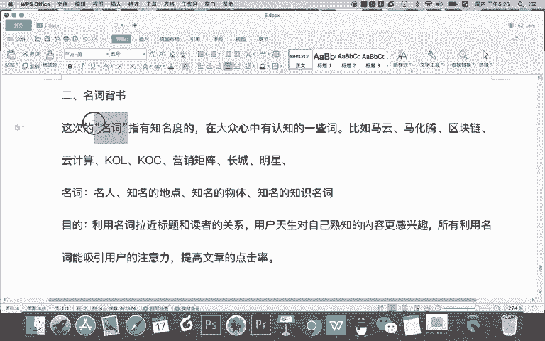

说人多，我们都说长城都说这个西湖，为啥？因为说其他地儿很多人不知道，对不对？知名的物体。对吧比如说我们知道的。啊，一些名词吧，一些物体啊，甚至比如说一些巨型或者说一些彗星啊等等是吧？知识名词。

一些知识知识的话，比如说我们新媒字领域叫QL记得写名词的时候，不要去说这个名词有多知名，而是说只要在你的领域知名就可以。那我们再用这个技巧。

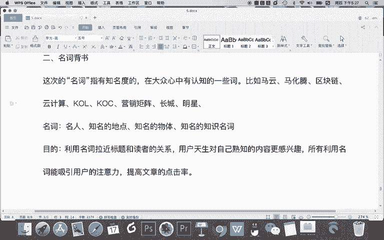

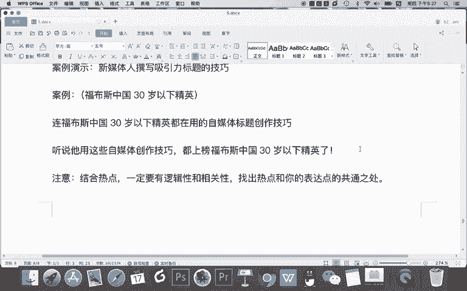

去。线下标题。

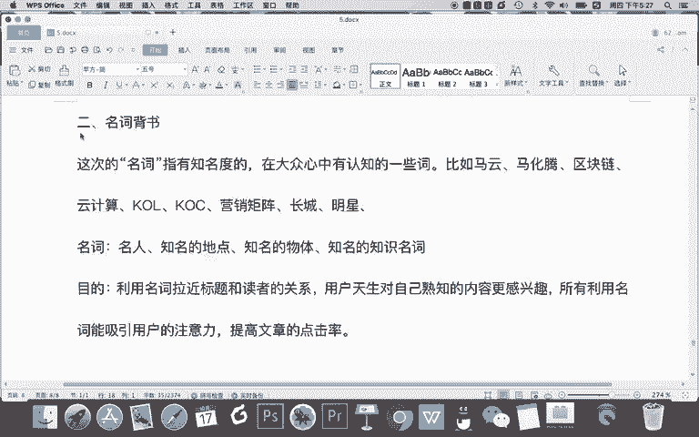

Yeah。OK还是新媒写是撰写吸引力标题的技巧。我们如果把这个标题加入一个名词，可以加什么？

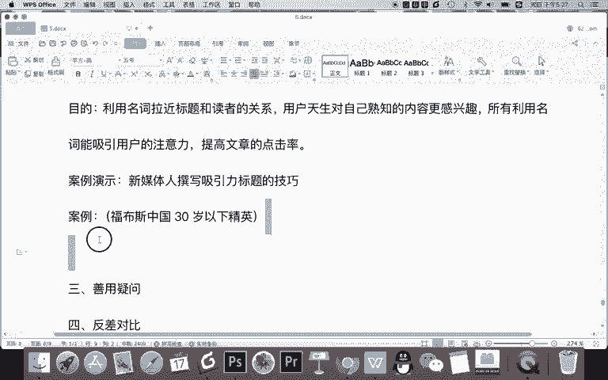

比如我之前讲课啊，经常会说咪蒙，为什么？因为咪蒙在新媒体领域非常有知名度我。如果说是咪蒙分享的，那么什么大家很喜欢，对不对？因为咪蒙嘛，他说的绝对是幸福的其次大家看到咪蒙就比较关注，对吧？在致名。

但现在咪蒙被封了，我们都不提他，我们换一个，比如说你看我这样就写视觉制。

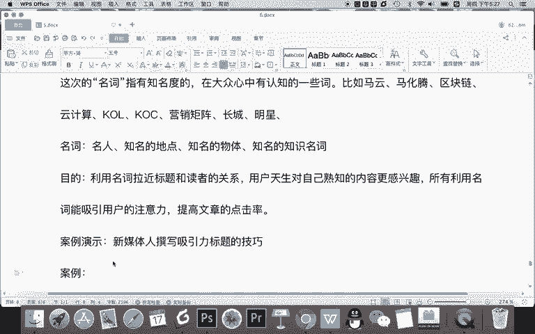

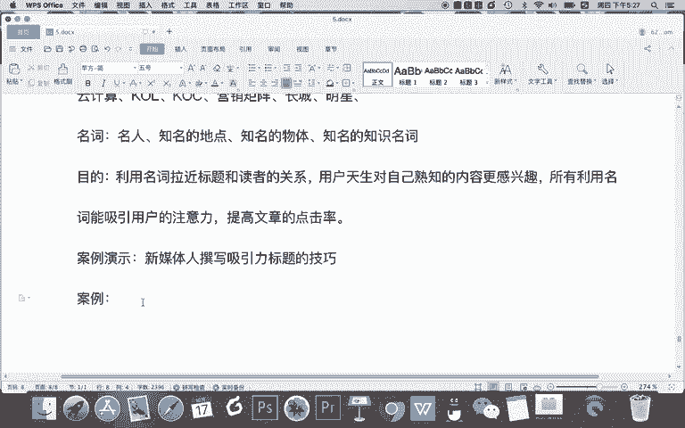

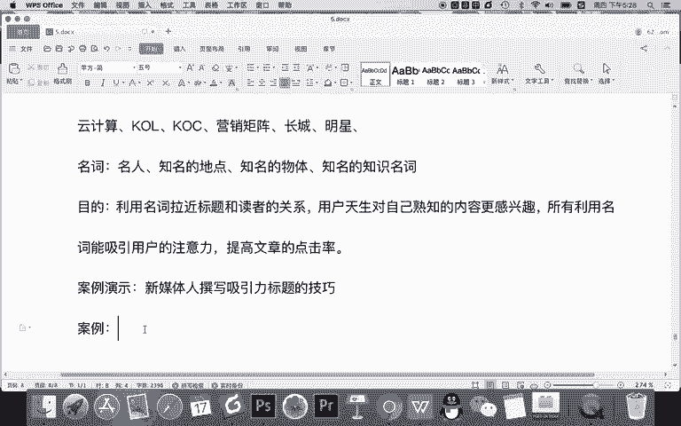

比如说新事项。什么呀。都在用的。标题创作。

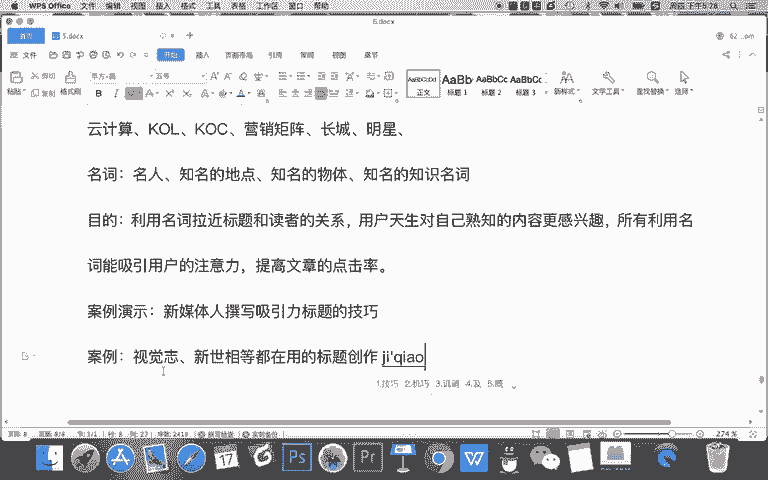

记者都在用的什么？比如8个随便编的数字啊，新十项不是啥，就视觉制都是知名的自媒体，对不对？甚至他看。

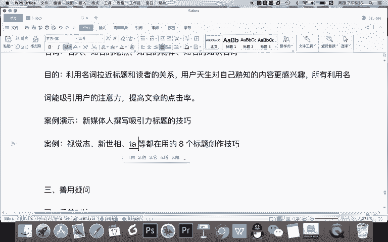

对吧这些知名的自媒体呢按说，新媒体人。