# 微信公众号运营视频全套 手撕运营 拳拳到肉 - P31：2.05-吸引力标题写作技巧~3 - 达妹_达内教育 - BV1UvvvebEdT

人都应该知道，因为这都是品牌，甚至是比如说换了。十0点读书。

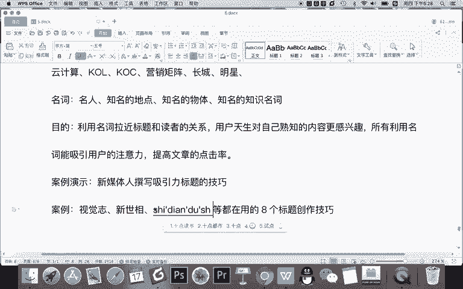

对不对？他们都在用的标题创作技巧，你这样写会更有吸引力，比这句话有吸引力。为啥？因为你的读者对他们更认可，你带上他们，他们既认可又被关注了，或者说他们被吸引到了。因为他了解这些，他认为你写的这些。

如果是真的更靠谱。所以呢这就是一个有名词背数的一个效果啊，但这些名词呢放到全网来说就不够致命。但记得我写的是新媒体人看到写这三个词足够了。O这关于名词背诵呢就给大家讲到这里。还有第三点啊，相于疑问。

我需要给大家详细的讲一点。首先呢。

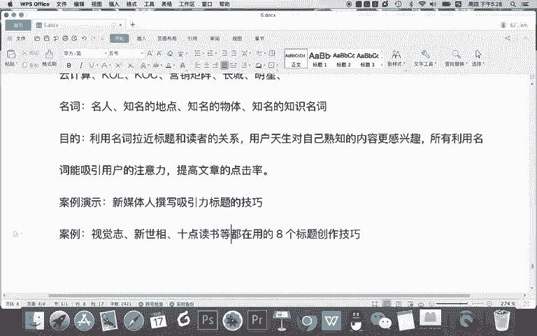

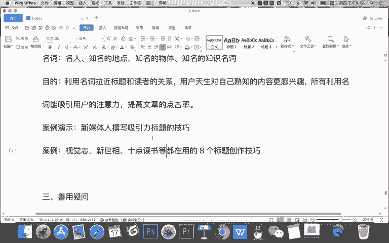

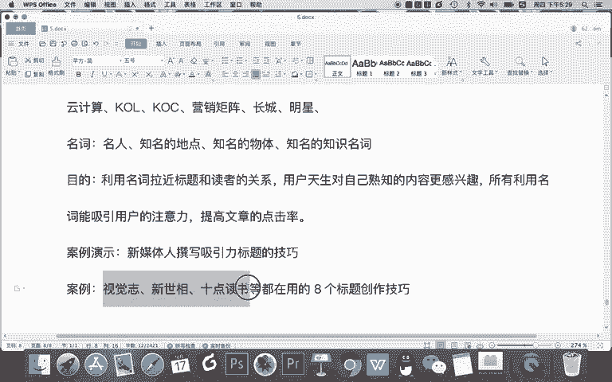

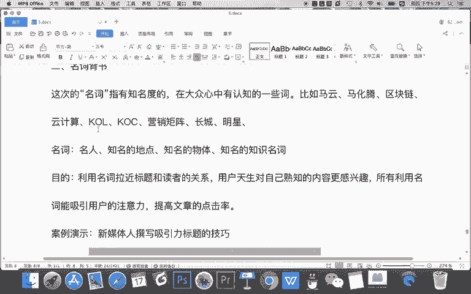

要解决一个问题，疑问跟。悬疑的区别是什么？对不对？为什么要解决这个呢？因为我们前面在讲标题党的时候，我们讲了一个技巧就是什么？就是设置悬疑疑问跟它区别是什么？记得。悬疑是。是吧故意不说。疑问是。启发你。

思考什么意思？学疑就是说你看了这个你你好奇你是想看，但是呢你你想去获取一个信息啊，解决这个八卦的这个好奇心理。但疑问是启发你思考。那什么意思呢？比如说啊我们同样一个标题，我们先给大家写一下啊。

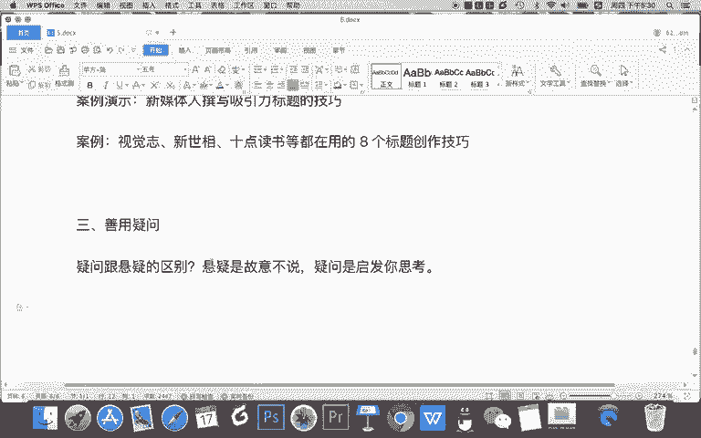

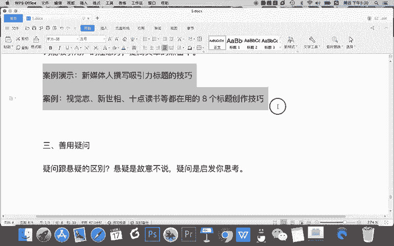

用这个我给你一写一个悬疑，还写一个疑问。比如说我们案例这里先讲一个。悬疑的在前面呢我们写悬疑，我们找一下这个标题啊。

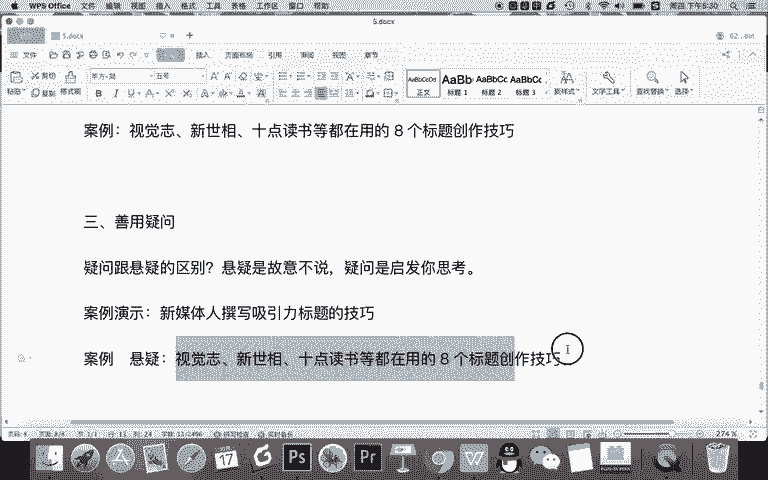

嗯。

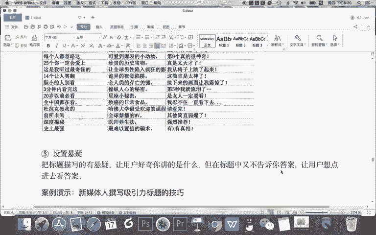

你看第五个真的是服。对不对？你看这就是一个悬疑的，就刚才我想知道第五个是什么，就是悬疑的。那现在我要去写一个什么？疑问的。疑问是问句，启发你思考的那怎么启发启发你。比如说。这样很简单，你的文章。阅读量。

不到是吧，阅读量很低，你看。是吧。也许你。是吧，也许你。你比如说你的文章用的很定，是你不知道这什么。不知道。10万加，比如说我们还10万家吧。其实10万加这个词就是一个名词啊。

新媒体领域都知道这是一个热词，是你不知道10万加标题创作技巧。比如说是你不知道。这些。你的文章阅度很低，这就是启发你思考。为啥？因为他跟用户会有一种代入感是吧？你不知道你连这都不知道吗？

是不是这是让用户一思考，哎，他就想去了解，因为这满足了用户的一个需求。所以呢疑问是启发用户思考。但悬疑呢就是让用户好奇想看。

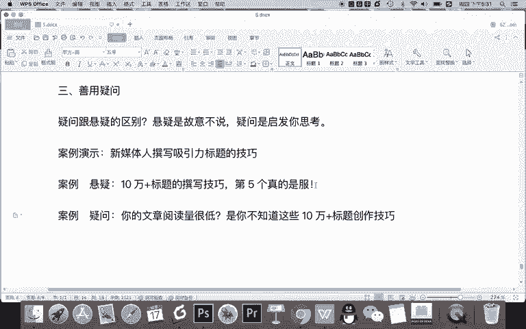

啊，能理解这个意思吗？啊，希望大家能够理解它的一个悬疑区别。如果你不知道的话，你记得啊，悬疑可以不是问句，但疑问一定是一个问句，它启发你思考。你可以大致从这个角度去理解。

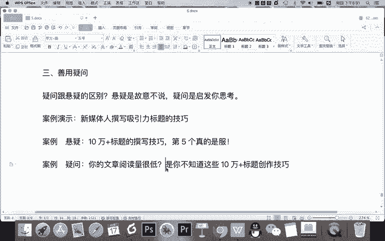

OK啊，这是我们给大家讲的疑问。疑问这个句很简单啊，比如说吸引列标题创作技巧。然后呢，你知道几个啊，这里面其实就是用了什么，也是一种疑问OK。

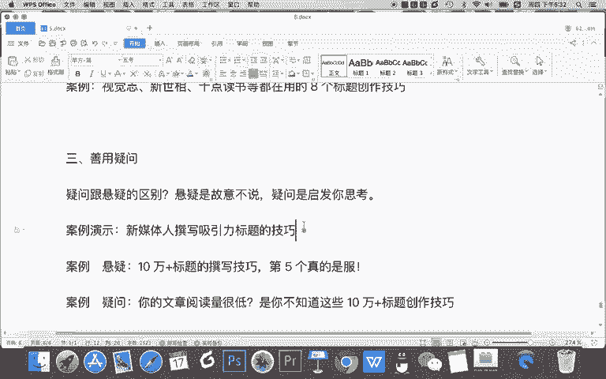

关于疑问呢，我们不讲太多了。我们再讲第四个技巧就是反差对比。什么是反差对比？就是在一个标题中。今过？前后。内容的对比形成。他性的。什么呀？吸引命。或好奇一点。아。啊，比如举举一个简单例子。

就是通过前后的对比，让你有反差了。比如说我们之前有一个标题特别的火，月薪。30的文案和月薪。3万的文案的区别，大家看啊，月薪3000月薪3万其实就是一种对比。你通过对比就想了解它的。区别点是什么？

所以呢你喜欢啊或者说你好奇，那对比反正还有。比如说你看。还是那句话，自从我结婚后。是吗对。别的男人。OK因为你知道结婚和别的男人。是啊，基本不是不能同时存在了，对吧？

但是所以你看结婚后跟这个通过对比反差给你起让你怎么样很好奇，你想看这就是反差对比。那么还有没有别的一些反差对比的一些例子啊？比如说你看啊还有一个。每天。坚持。什么这。一个动作。每天坚持5分钟，月售。

20斤，那我告诉你这种标题多不多，不管你是在微信朋友圈还是在微博平台啊，我个人认为是见的特别多的。就告诉你很简单，每天坚持5分钟，月瘦20斤，5分钟和20斤啊。对吧躺在床上。这个动作你看。躺在。

床上每天坚持5分钟，月收2时间。这一个月少儿之今跟躺在床上也是一种对比反差，你就会非常好奇什么。所以呢反差对比能够把它的效果给更加夸张，甚至呢提升或者增加一个吸引点，然后你就会更加被打动。

或者说更喜欢了。这是一个常见的创作技巧啊。我相信朋友圈你也见过特别多。那我们现在来试一下用。

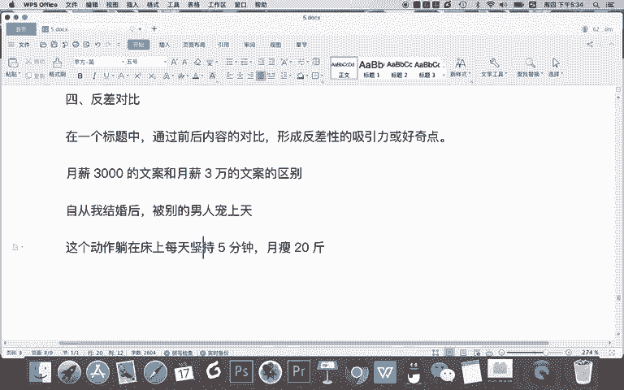

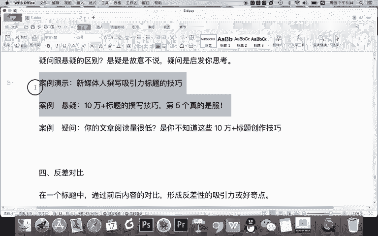

反差对比的。这样一个内容。去撰写一个关于新媒体心引理标题写作技巧的一个啊案例吧。新媒体撰写技巧的标题，那我怎么去营造一个反差？

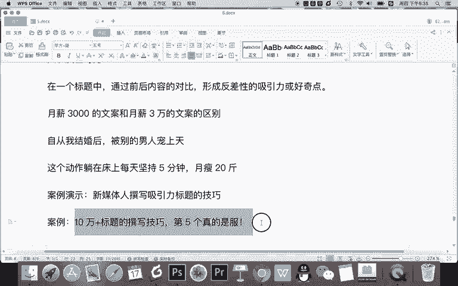

很简单啊，比如我给你举一个啊。比如我看过的一个新闻，我认为这个标题就很好。我随便改一下啊，农村小伙什么做。自媒体。只用这。比如说8个，或者说只用这5个。套路。月弱。什么。

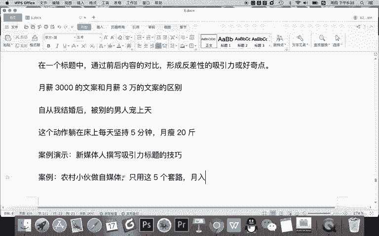

8万。好，你看同学们农村小伙跟自媒体和月入8万是不是一种反差对比？因为你想农村小伙做自媒体，做自媒体，好像得写文章，感觉文化程度还得要求挺高的，对不对？但是呢他既然他也能做，而且还月入8万。

农村小伙做自媒体月入8万这种对比反差，我认为特别强烈，所以呢会有吸引力。那你说有没有这样，你说老师你是不是瞎编了这个标题，我瞎编，我没法写，但我告诉你事实是有这样的一些人的。比如你看到像样一件事儿。

我看你知不知道？

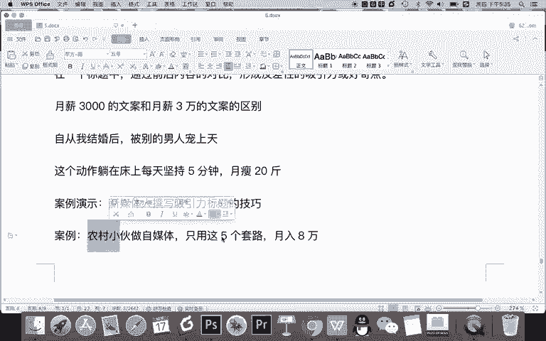

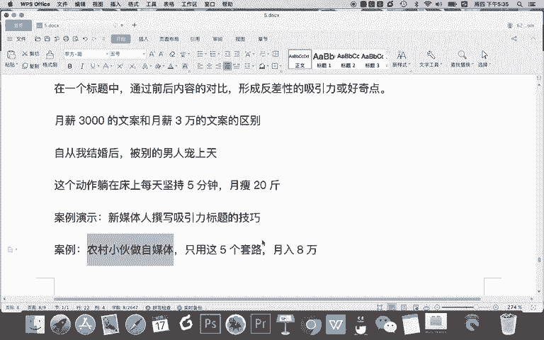

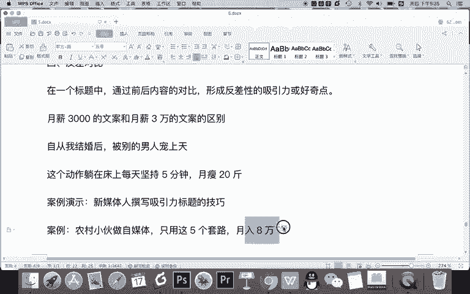

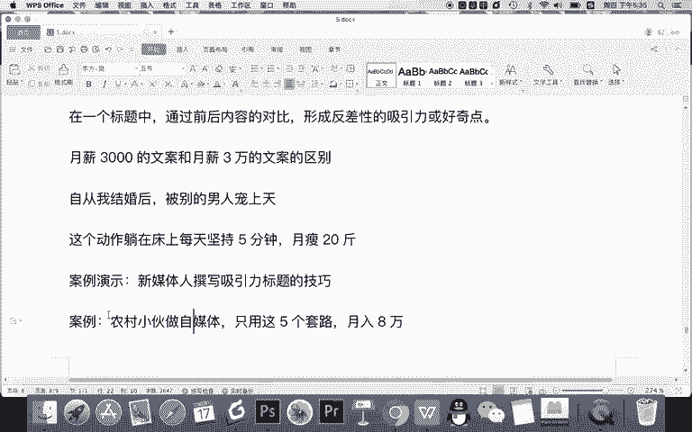

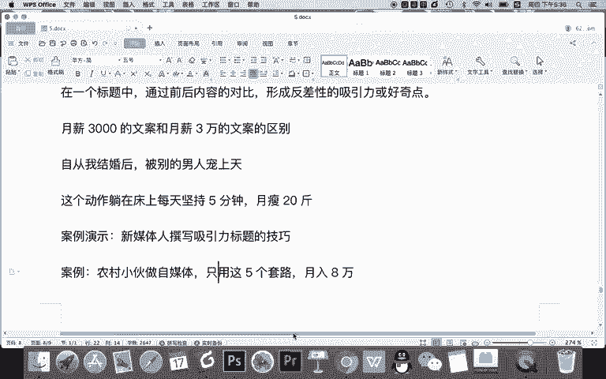

村妇做。这媒体。月入过万。

OK啊，这是一些真正的一些新闻啊，这是事儿是报道过，是真事儿。所以你可以改成农村小伙做自媒体，用幼儿班。而且啊很多做自媒体的真的没有特别多文化水平啊。大家知道很多一些平台薅羊毛的那些自媒体。

真的就是用一些套路啊，标题写作的套路啊，然后去打去吸引用户嘛。所以呢这些收入跟他的文化程度本身是不成相关性的啊，有相关性，它不成相关性。所以你可以从这个角度去写出它的反差对比。OK啊。

最后呢超出常识这个事儿呢，其实很简单，你记得啊。超长人是什么？从新闻的角度。还说。人咬狗。才是。但是如果你写的是。狗咬人。不叫钱。人养狗才是行为的，所以什么呀写事情，或者说写什么。最好写哪些？少见的。

超出。同实的。事情。这样呢。用户才更爱看，因为越超出常识怎样，越少见越少见，才有被看的价值。所以任何的内容如果你超出常识的话，它就更容易被。被怎么说被用户所关注吧，那超常试的标题也特别多啊。

比如说其实你看这些标题啊都是有相同的。这个标题有没有超常识？

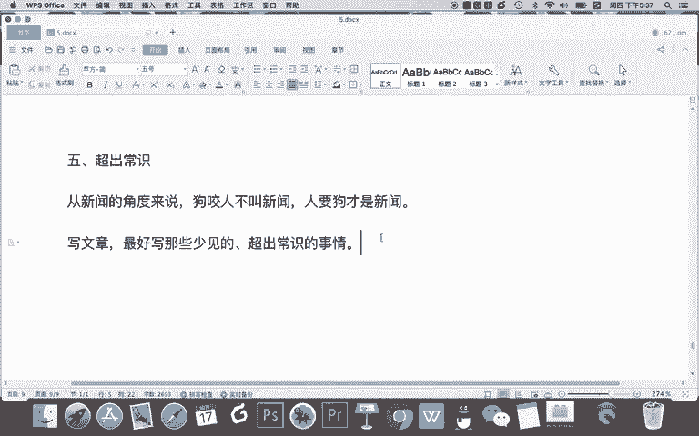

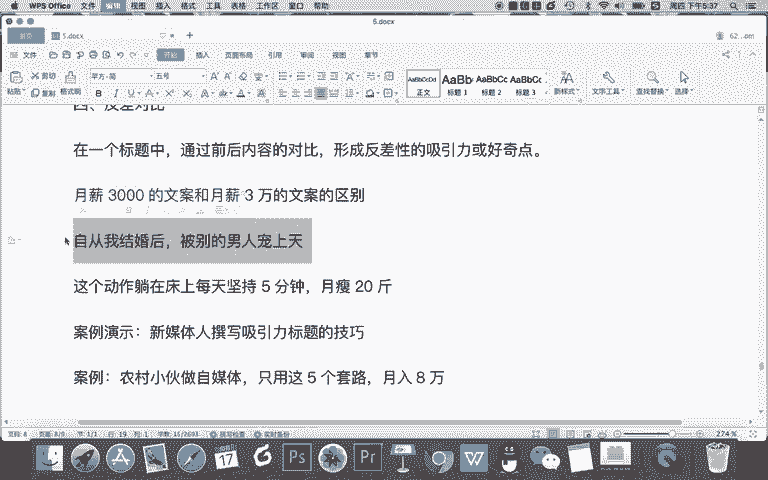

当然有，对不对？结婚后被别人拿人床上天，这肯定超出常识了。不可能吧，你怎么可能结婚后被别人拿人床上天？对不对？还有呢。还有一些真实的一些新闻事件，我就不说了，也是超出常识。

那我们现在就直接来去试着用一个超出常识的方式去写标题，去写这个心理标题。是吧就是如何把一个心率标题的这样一个。常规的一个标题给它改成超出常识的吸引力的标题。其实我我认为奥特曼。

就这个标题本身它就超出常识啊。因为我们正常人来认知的就是农村小伙，他不会做自媒体对吧？他做自媒体肯定也做不好，但是人家不仅做的好，还月入8万，这就是超时常识。所以呢写超常识呢就一般的技巧很简单。

就是你要找到一个。

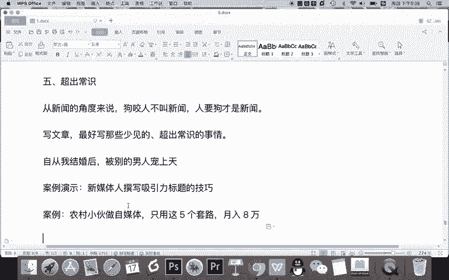

视角这个视角就是你从你的内容上挖掘一个故事或一个案例，然后把这个案例从一个有吸引力的角度，然后呢去给它表达出来。比如村妇做自媒体月入过万，这个事儿本身就超出常识，所以会火。所以呢你用这种技巧去撰写标题。

它也会火。O以上呢其实我们给大家总共总结了啊10个吸引类标题创作技巧，有些呢比较简单，比如用数字啊，用对比，甚至用疑问啊或问句的方式比较简单。但是像超出常识，这种技巧就比较难一点啊。

但是呢它是一种思路啊，所以最后我希望大家记得。10个。标题创作技巧是。10种。思路啊。不是。都要是吧掌握。而是根据。你的。内容什么去选择合适的什么技巧。确。创作，然后呢创作出适合你的。内容和受众的标题。

即可什么意思？比如简举一个简单例子，如果你写的文章内容针对的就是农村的老大爷老大妈，那你就多用一些号召性的情绪化的标题是吧？震经体的那种那比较好。但如果你是针对新媒体人。

比如说我我写的文章是分享新媒体的知识的，你就多用一些对比数字反差这样的技巧，就不要天天的搞得玄乎其玄的去忽悠这些人，因为新媒体人，他的文化知识水平比较高，他来这就学习的，所以你就不能太情绪化。

但如果你写的是一些资讯类的或者明星的呀，那你就多用一些什么热点，还有名人名词的这些技巧，对不对？针对女性的呢，就就多用情绪化的，针对男性的呢，就可以用一些洞察人性啊。

比如说洞察一些他色色的等等人性的技巧。所以呢你要根据你的内容和你的受众去选择不同的技巧。只是你需要记得我讲的是个技巧，只是是种思路，是为大家的创作提供想法的。

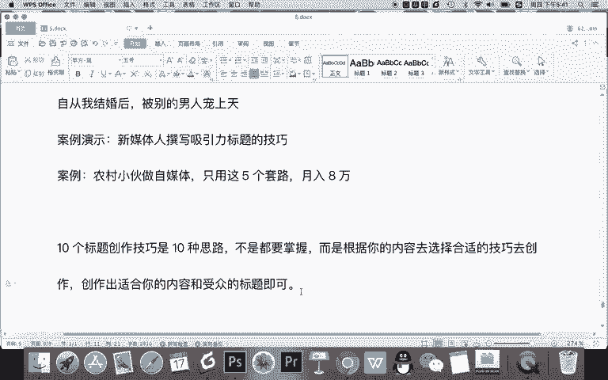

那同时呢我在讲十个技巧的时候，我也为大家演示了一个很普通的主题或者一个很普通的标题，给它改成10个标题的10个吸引力标题的一个案例的演示。希望大家能够从中获得启发，能为你的标题去提供一些想法。

那最后建议大家每次写完一篇文章，至少为你的文章去创作3到5个标题，然后不断的优化，最终选择一个标题进行发布。我相信如果坚持一个月啊，你就能够成为标题创作的高手。同时你的文章的阅读量也会提升。

OK关于吸引力标题的内容就到这里，下节课我们将学习新的知识。

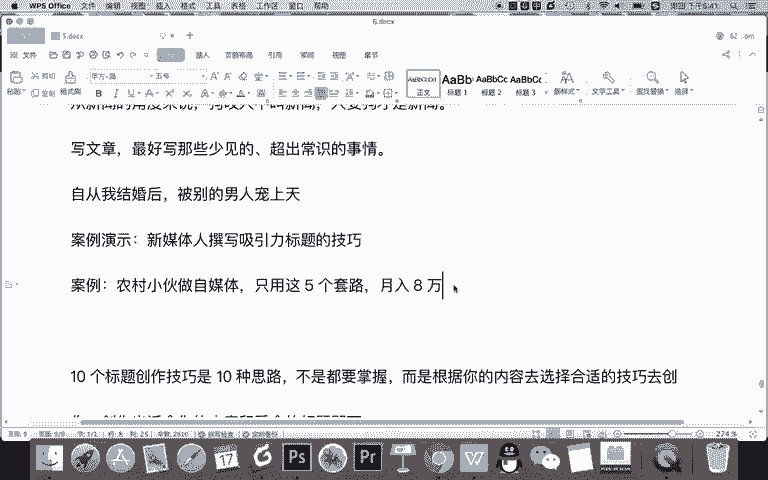

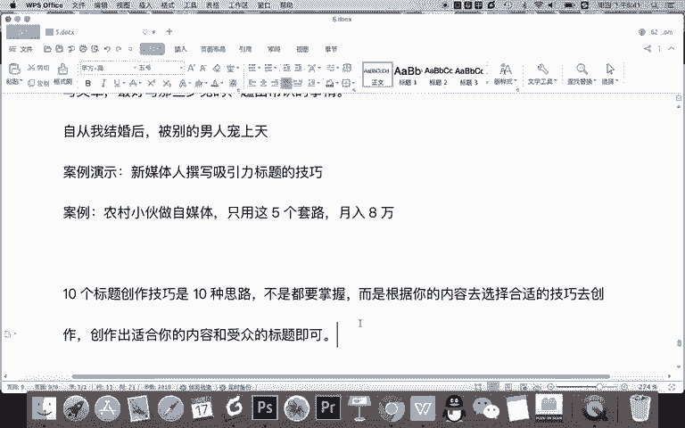

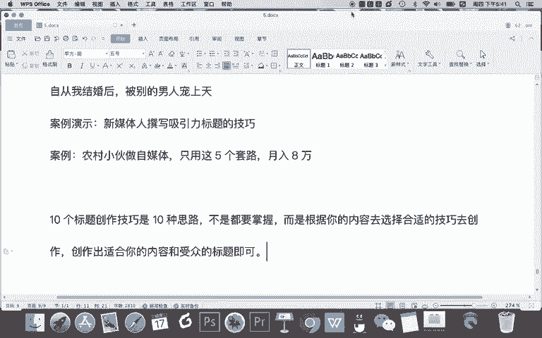