# 微信公众号运营视频全套 手撕运营 拳拳到肉 - P32：2.06-微信内容打造~1 - 达妹_达内教育 - BV1UvvvebEdT

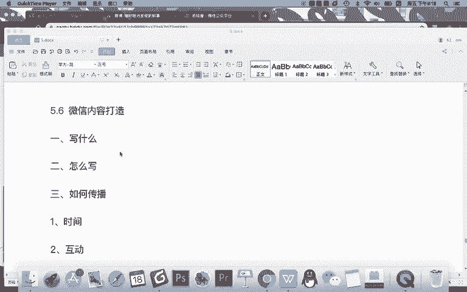

同学们好，今天我们来学习微信课程第六节课的内容。微信内容的打造啊，什么是微信内容的打造呢？就是微信的文章怎么写啊。在前面的课程呢，你看我们刚开始学习的写文章时候，要如何进行排版。那写完学完排版之后呢。

你光会排版不行啊，我们又教给大家如何去写吸引力的标题，对吧？大家在写文章的时候啊，可以去创作一些有吸引力的标题，提高你文章的阅读量。然后呢，我们给大家分享的有吸引力管家这个工具，能通过热点追踪。

还有营销日历啊等等，让大家获取一些最新的最热的一些内容方向。那么在选题上，我相信大家会有一定的启发，但是对专业的企业运营来说，我们在写文章的时候，或者说在长期去写文章。你一定会遇到一些困惑。

就是哎写着写不知道写什么，也不知道怎么写啊，会陷入一个瓶颈期。就是说哎我不知道记不知道应该今天要写什么，因为每天都要写嘛，甚至三天一写，两天一写啊，写着写着你的思维就变得枯竭了。第二个呢。

写的内容就是感觉平淡无聊。然后呢，你的文章阅读量也不高，用户互动量也不高，所以呢整体的微信运营就陷入了一个什么呀，平静期就没有任何的一个进展。

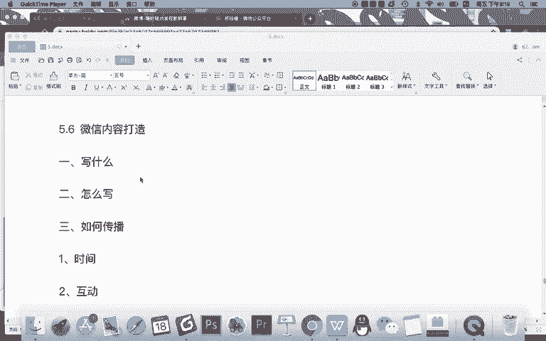

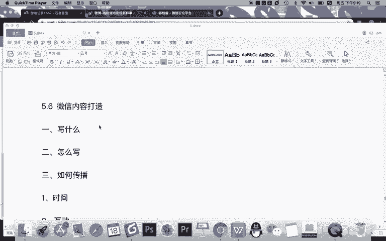

那今天呢我们就针对大家这样的一个困惑和问题给大家去解决三个核心内容。第一就是当你在运营你的微信的时候，应该写什么？第二，应该怎样去把这个内容写的更好？第三，写好之后如何进行传播。

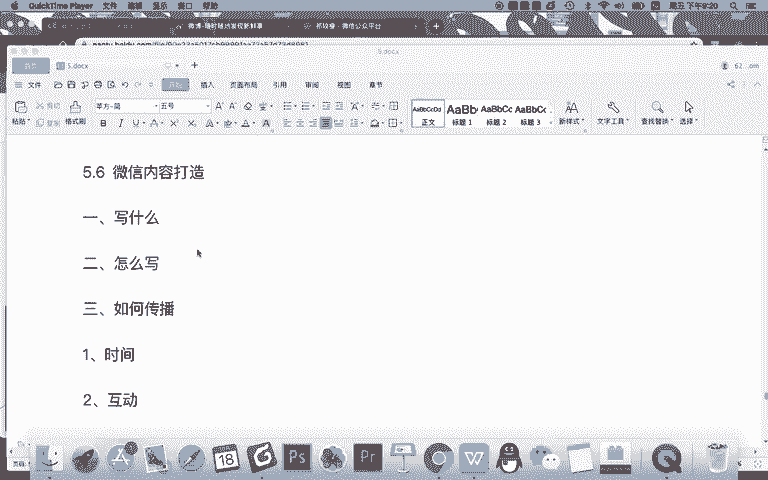

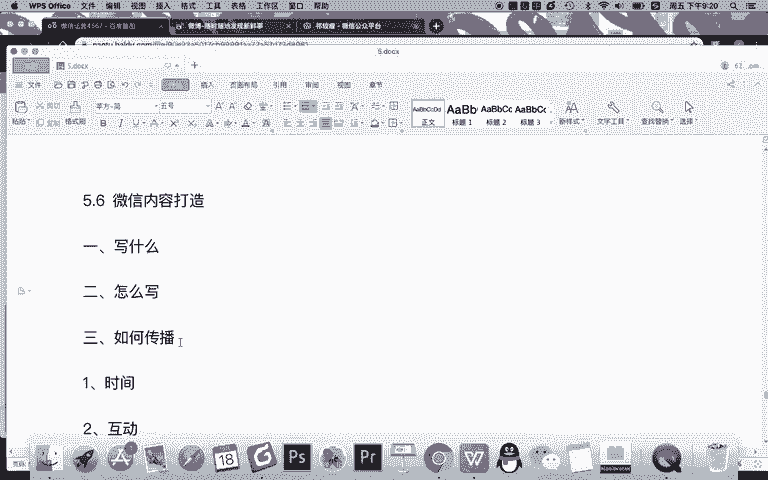

那首先明确一点，我们今天所指的微信内容的打造啊，其实指的是你在公司运营的是企业的微信公众号的时候就去这样去写的。还有一种情况不是这样写。还有一种情况就是你运营的公众号是自媒体。

那么自媒体文章或者说自媒体的一些内容创作呢有它自己的技巧和方法，我们会在后面的课程，也就是在自媒体课程里面给大家讲解。所以呢啊我们这里不再多说啊，但今天假如你是。

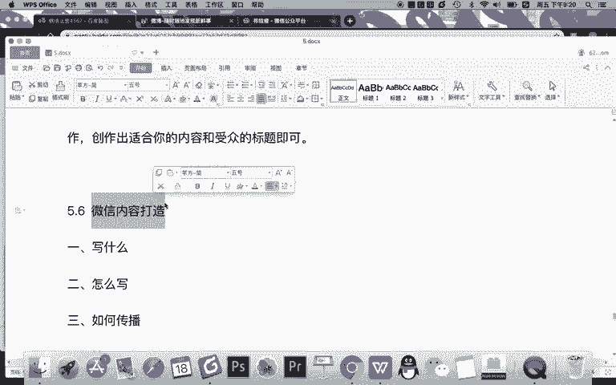

想运营你们公司的公众号啊，既要去给你们品牌进行传播，要写内容。那么我们要解决以下三个核心问题。首先，解决运营企业微信公众号应该写什么的问题，写什么就是什么？指的是什么？指。给企业运营公众号。应该。

如何做选题？就是写什么内容比较合适，如何去做一个选题。因为有了好的选题，你才知道啊，具体该怎么写。在选题上呢，我给大家会有两个思路啊，或者先说这样一个思路。

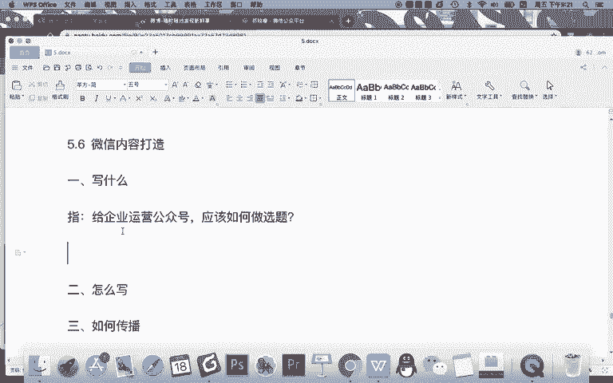

首先记得你的想写的内容可以分为两个大的方向。第一个方向指。公司需要和第二个方向，用户喜欢。

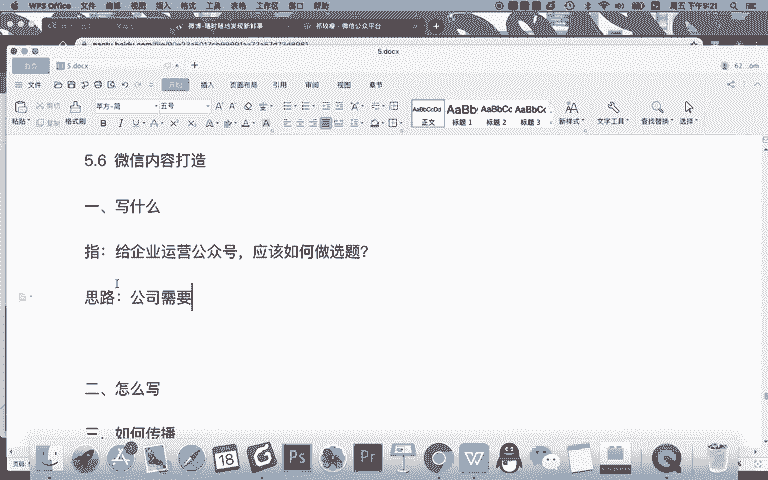

首先什么是公司需要呢？纸。企业。运营公众号的根本。目的是推广企业。想发的啊。推广的内容。就是。公司需要。很明显啊，公司需要你可以简单粗暴的说，就是广告啊，就是营销推广的信息。

企业运营公众号最最根本的目的就是为了什么？你可以说把东西卖出去，你说哪怕你不卖东西，也要去进行一些品牌的推广，对不对？我不可能说哎，我就是开开心心，我想运营点粉丝，我没有别的目的，我只要有粉丝就行了。

那不可能的，你要粉丝，最终肯定要转换成你的销量的，对不对？所以呢公司需要指企业要推广的一个内容。那什么是用户喜欢呢。就是。用户喜欢指用户关注你。公众号的原因，也就是你。能给用户。

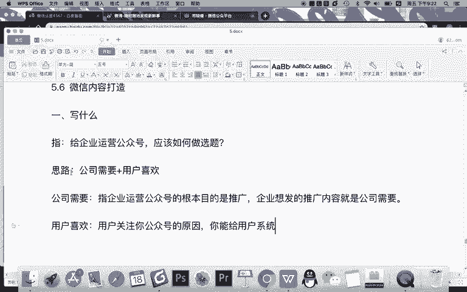

提供的价值。那比如说第一类公司需要通常会有什么事儿。

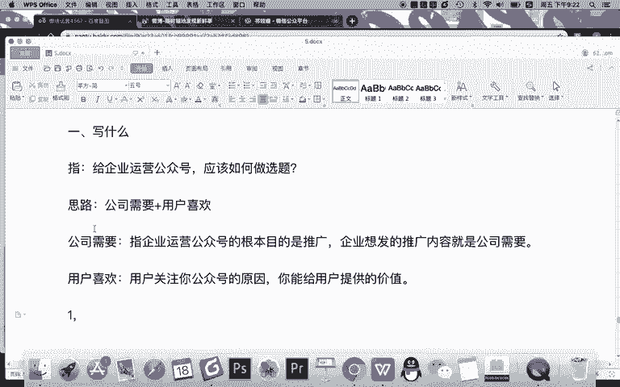

什么事儿？比如第一。企业新闻很明显，你们公司要有一些重大的一些新闻啊等等等等的，或者是新产品发布，是不是或者周年庆或者你们公司获者什么奖啊等等等等。这些企业的新闻，你们肯定要去发布，对吧？

因为微信其实对企业来说是一个什么？微信。等于。企业的什么呀？新闻发言人或者新闻发言平台啊这样一个角色。所以呢公司有什么重大的新闻事件肯定要发。那除此之外，第二类要发的是么？产品信息是吧？

公司要推广自己的产品和服务啊，这里的服务其实也是指产品。所以呢公司肯定要除了要报道一些自己重要的一些事情之后，然后呢，他还想发一些过自己产品的信息，向用户去推广自己的产品。

目的呢肯定是实现产品销量的一个什么增长。当然这是最终的目的。有些时候呢你发产品不只是为了增长或者不简单的是为了增长，其实也是为了给用户普及一些知识啊，这是企业企业需要的第二类类型。

那除了企业新闻和产品信息之外。企业还想发什么内容，企业还需要发什么内容？我认为比如说钱还需要发一些什么呀？活动通知。什么活动啊？比如说公司进行的营销活动，这个营销活动啊，其实也是用户需要的。

公司做活动的目的呢，最终比如说是为了卖东西，但是呢对用户来说他喜欢这活动，是因为有奖品，对不对？所以呢啊公司也会去发一些活动类的通知。

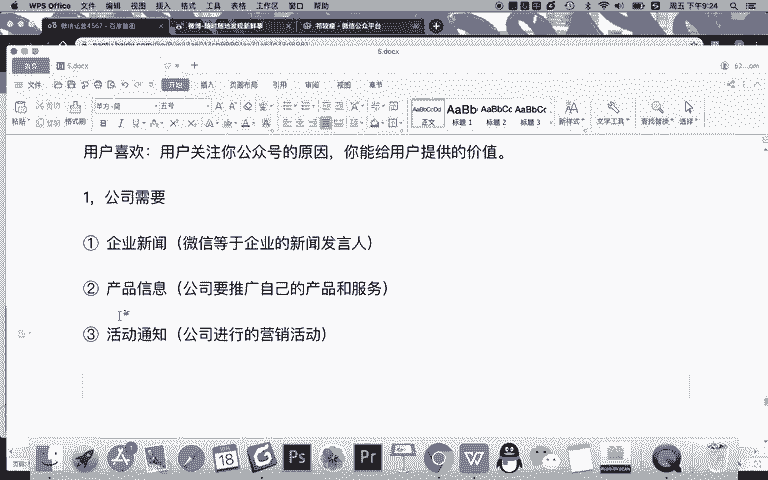

公司除了发自己的企业新闻、产品信息、活动通知之外，还会有什么？

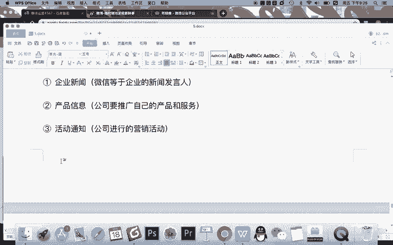

还会有第四类啊，比如说什么呀。

案例和。资讯啊，这个是什么案例？首先。

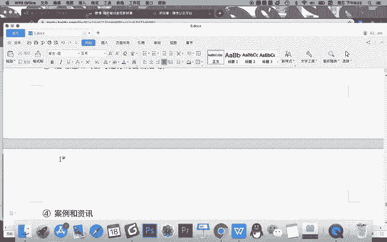

案例指是吗？企业成功案例。

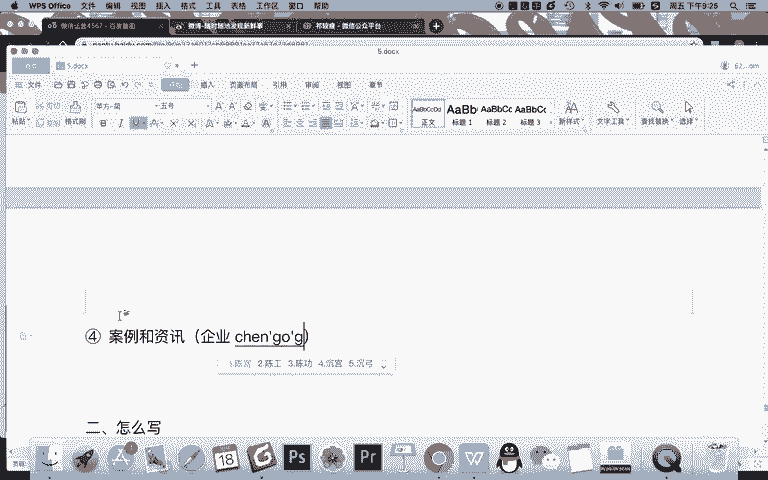

公司总会去打造一些自身的成功案例啊，这样呢提升自己产品的一个什么呀可信度，或者说一个影响力，然后呢给用户树立一些正面的形象。当然除此之外呢，还会一些什么呀资讯。这个资讯呢有些包含案例咨询，有些什么？

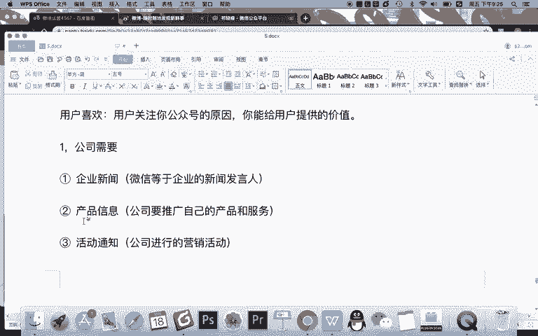

企业行业。

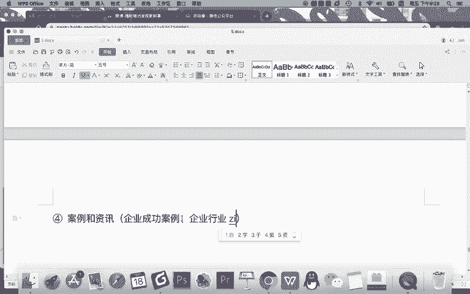

企业新闻是指企业有价值的一些信息。但有些时候会发一些行业的资讯，向用户普及行业的信息，让用户知道啊，这个行业是很有需求的，很火爆的这也是很有必要的啊。所以呢在企业这个角度来说。

企业会发布企业新闻产品信息活动通知等等内容。那么用户需要什么信息呢？

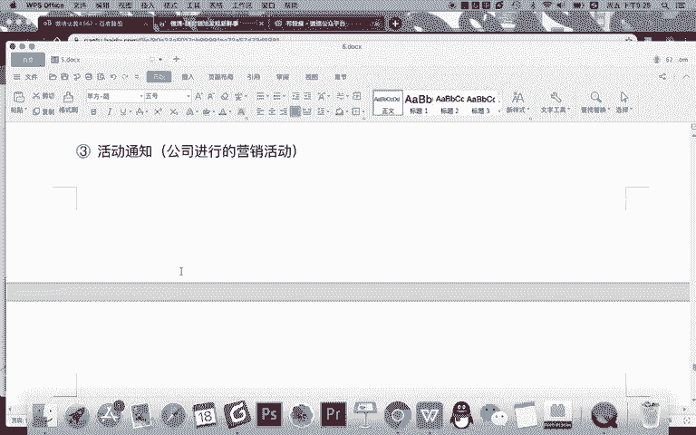

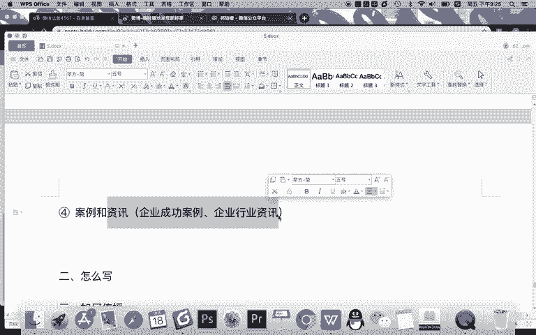

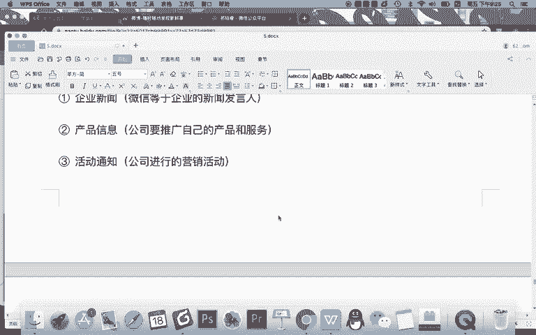

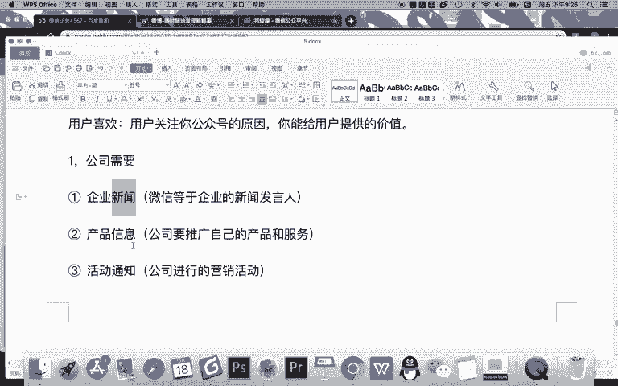

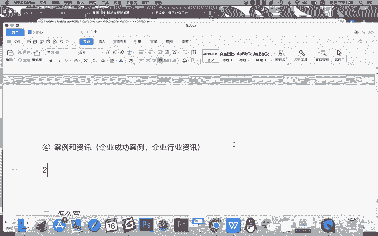

其实用户需要的第一类啊，我认为非常简单，任何时候用户都需要什么。干货分享。

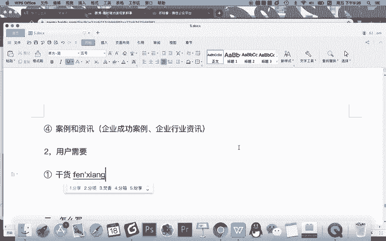

也就是当用户关注你的一个账号，它长期的你能吸引到他的一个根本的原因就是你在这儿分享的是吗？干货。这种干货指的是什么资讯。或者叫行业资讯，还有呢。专业知识。还有呢。除了转业之外，还有什么干货分享？

比如说什么。案例。分析等等，这其实也属于专业的一些知识啊，甚至一些什么互动问答等等。用户需要第一类，你给他提供有价值的干货。比如说他想关注互联网行业的一些最新的资讯，那么你分享这个资讯对他来说就干货。

还有呢他想了解新媒体运营的一些技巧，那么你分享这个技巧，那么他也属于干货啊，这是干货分享这一领域。那用户还需要什么？还有呢。还有互动。娱乐啊，你说用户真的会需要这个互动娱乐吗？是的。

用户关注你有些时候他是需要比如他主动关注你，其实他是想跟你交朋友的，他是需要你去提供一些有趣的好玩的内容。什么是互动娱乐呢？就是企业主动跟用户玩起来。进行互动。比如这互动的方式有很多啊。

比如简单来说可以文字互动是吧？你你他就给你留言，你跟他回复。第二呢，游戏互动。第三呢，留言互动等等等等。其实用户呢他作为某个领域的一个成员之一，他是需要存在感的。对吧所以呢有些时候你去给他让他留个言。

你给他回复回复啊，甚至让他留言展示出来了，他会有这种需求。OK啊，除了干货分享之外，除了这个互动娱乐之外，还有什么？其实用户也还是关注你还有什么。

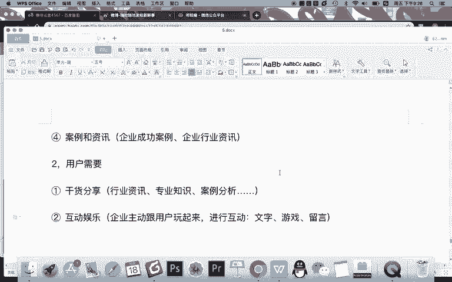

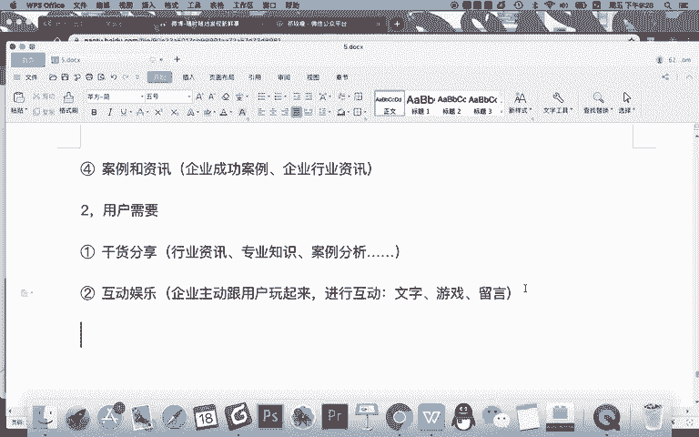

还有福利。