# 微信公众号运营视频全套 手撕运营 拳拳到肉 - P33：2.06-微信内容打造~2 - 达妹_达内教育 - BV1UvvvebEdT

价值。什么是福利价值？😡，就比如说给用户各种福利。这个福利可以包含什么？免费的。知识。产品。还有呢。还有红包。还有呢。优惠券等等等等。企业呢有些时候比如说特别是做电商类的，他之所以会持续的关注你。

就是因为你能给他持续的提供一些优惠券福利甚至折扣。比如说我关注了一些餐厅，那这些餐厅的账号呢，我并没有取消。虽然平时我也不看这个信息，但是他对我有用，有什么用呢？就是我经常去吃饭。然后呢。

我只要有他这个微信公众号关注了，成为会员，每次就能打9折啊。所以呢这就是给我的好处。那我认为对我有价值，所以我就会去关注他。

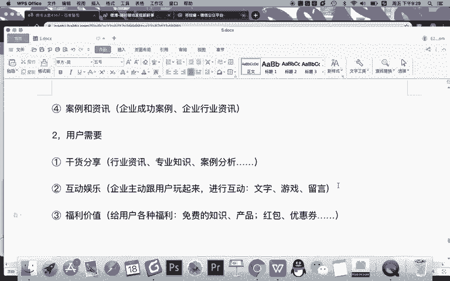

还有优会还需要什么？其实啊第四类用我需要叫什么？功能需要什么是功能需要？就是你特别要注意很多公众号之所以粉丝多，是因为提供了什么呀？很多。功能。炸了。用户使用。比如你想想。招生。

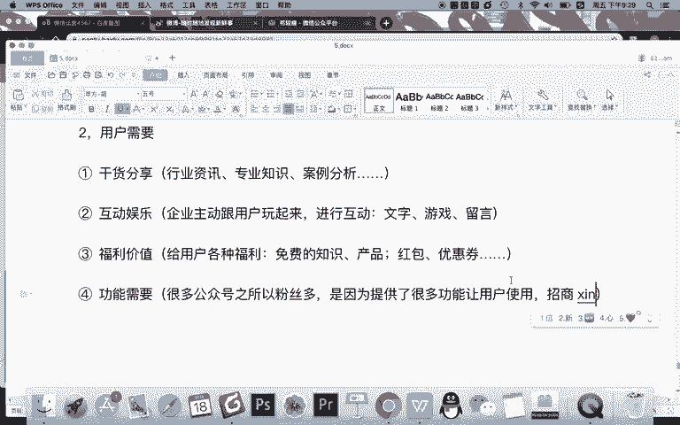

信用卡。比如。联通。移动，甚至比如去水堰。工具。OK同学们，这就是功能的需要啊。因为你有信用卡，你需要去查这个你的每月的信用额度，你需要去还款。所以你需会关注招商银行信用卡，所以它的粉丝量会很高。

移动联通也一样。因为你要充话费，你要查询你的流量等等等等。所以呢你会关注了移动和联通，所以他们都是千万了大号，对吧？还有一些工具，比如我能用它去去水印，是不是或者说呢我能用它去打印照片等等。

因为它支持了我常用的这些功能，所以我关注了它，那么这也就给你提供的一个需要，你要给用户提供价值。

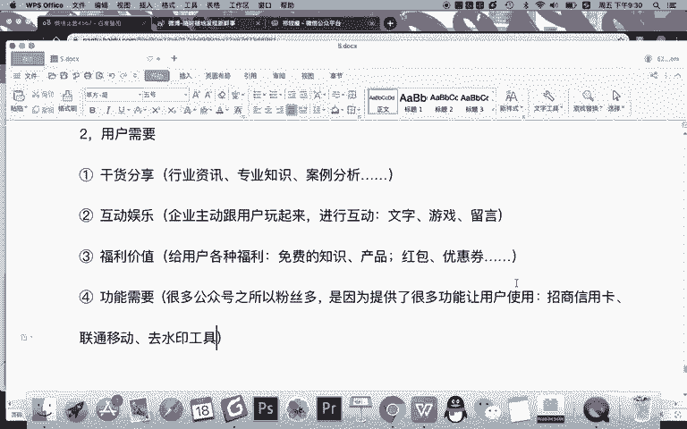

OK现在我们要解决一个问题啊，写什么？我们知道我们其实对企业来说，我们要写两大类的一个内容，一个是公司需要，一个是用户需要。但是你需要注意的是，这两类的内容怎样不是孤立的，你需要融合。

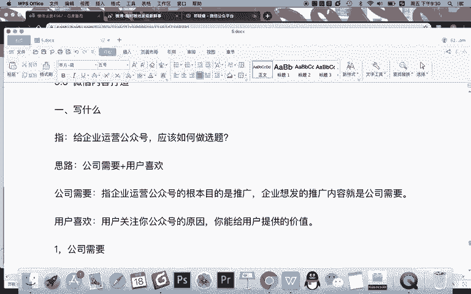

什么呀，公司需要的。内容成为。

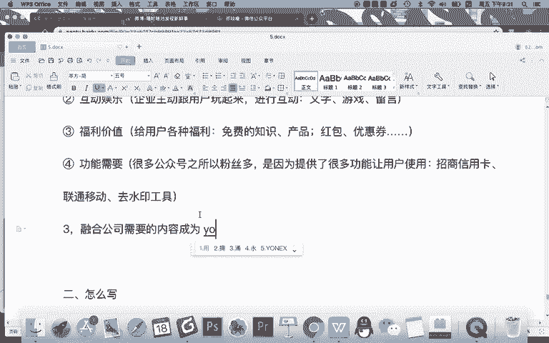

用户选什么意思？记着这句话，让公司想。营销的每一次表达。都站在。用户。立场上。为用户提供价值。

比如举一个例子。

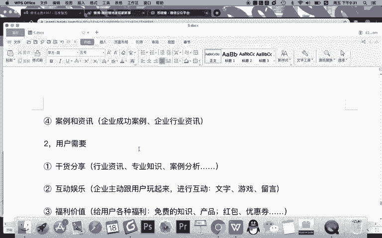

如果你们公司想发布的是你们公司的企业新闻，你不要总是直接说什么哎，你们这个。

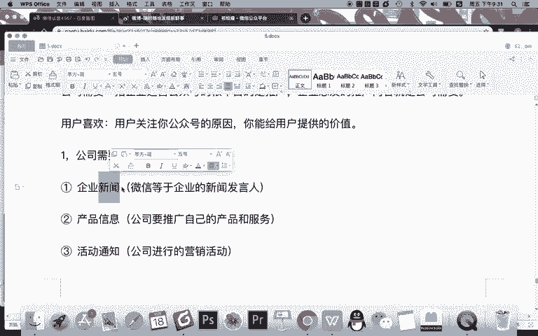

企业多多多优秀什么什么，你说这些东西都没有用的那你应该怎么办？你应该站在用户的角度去说完这个新闻之后，说去站在用户的角度说，你们的这个新闻，你们的这个事件的发生对用户有什么价值，对不对？这样的话。

你的这个事情就跟用户之间建立了联系。那用户就知道我看你这个新闻的必要性，甚至知道你这样一个企业的发展对我有什么好处。或者再简单暴力一点说。当你公司发布了一个。硬广一个营销信息的时候。

你们一个公司活动的时候，你说用户都不爱看，对不对？不爱看你们企业这种广告，那怎么办？很简单啊，你你去庆祝这个活动，你去送出一些奖品行不行，对不对？你让用户跟你一块普天同庆开心一下，是不是？

你们公司既然发生了这样的事情，是不是你想去宣传，但是呢又是直接的硬广会伤害用户的情感。那怎么办？那你就直接在这个活动的最后去发一些奖品，让用户留言能够获得奖品。那这也是一种方法。

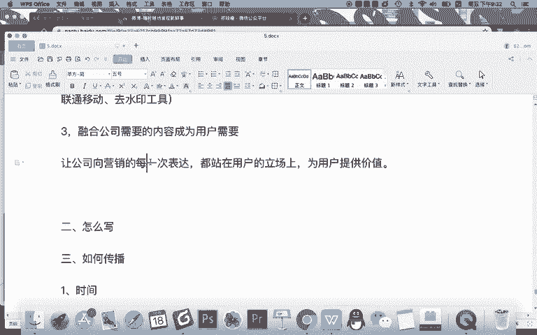

对不对？所以呢记得每一次的企业表达都应该站在用户的立场上，为用户提供价值。最终一句话就是什么？

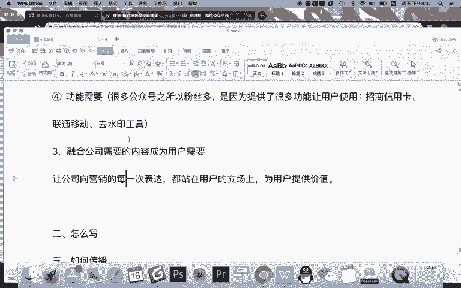

让所有的企业需要。

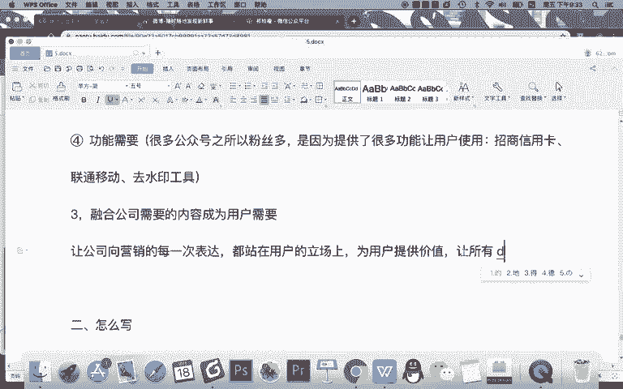

变长。用户。

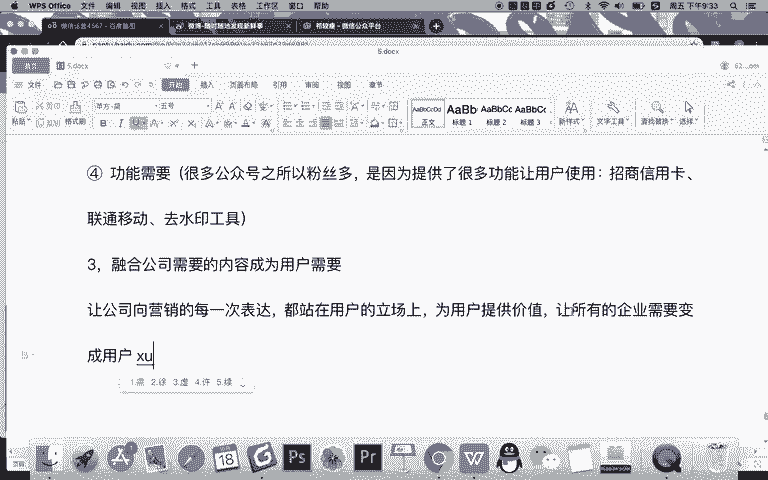

需求。你这样的去做，然后内容就会成功了。OK这是我们公司需要和用户需要的这样一个写什么给大家提供的一个方向。那么同学们现在我需要去解决另一个问题，就是说。

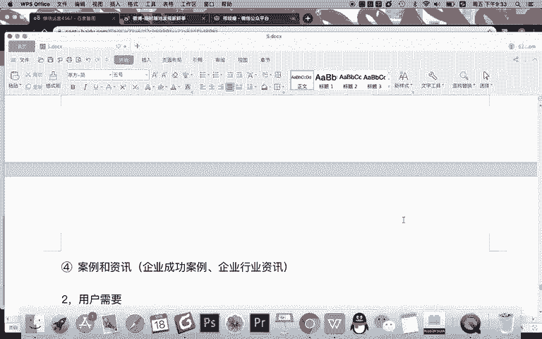

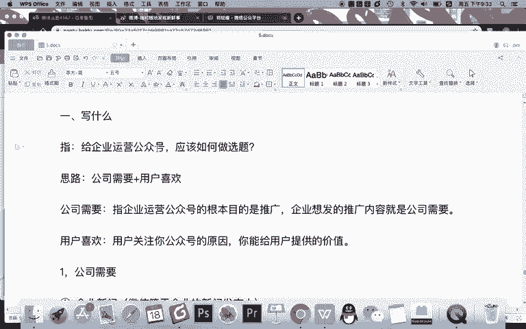

用户。需要的内容。如何？拓展思路。有的人说，哎，老师，我现在知道了，你说这个意思了，我知道说我们公司想表达自己的时候，也应该站在用户的角度考虑为用户去提供有价值的信息。

但是现在我知道要为用户提供有价值的信息，但是我还不知道可以发什么内容。那怎么办呢？那现在我告诉你，你可以拓展一下你的思路，看看哪些内容真正是用户有价值的，可以经常的去发布的。比如我举一个案例。

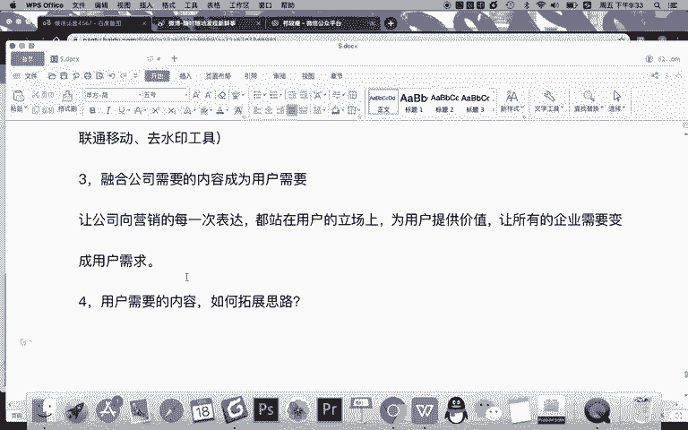

知道们？比如我一家一个案例就是IT培训机构。是吧互联网IT培训机构。一家互联网IG培训机构。对吧他培训各种互联网的课程。比如新媒体的，比如啊比如说电子商务呢，比如UI设计的，甚至java前端等等。

所有互联网相关的这个培训，它都去运营。那么作为这样一家机构，他应该发什么样的内容？然后呢，我们就拓展思路。现在来看一下，如果是这样一家机构，我们可以去写什么？也就你的公众号，比如每天都要更新的话。

你感觉你可以写哪些内容比较好？

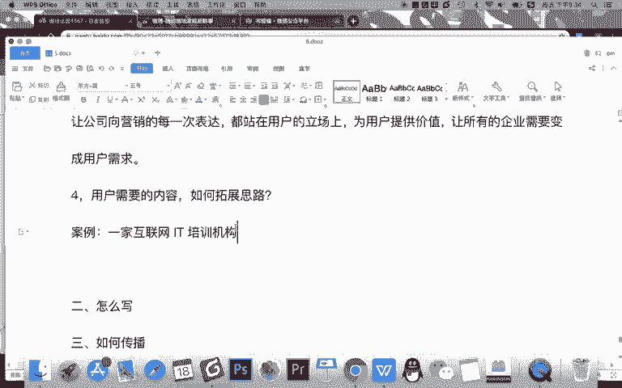

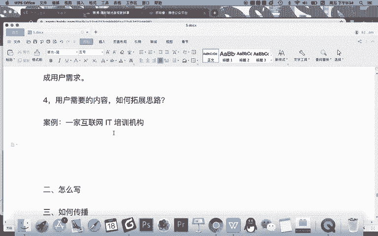

首先很简单，第一类干货分享。那你作为IT培训机构，你进行的是知识的分享，所以要写什么？各类小。什么呀？互联网知识，但是你需要注意啊注意一点。如果。你的用户什么呀？专业或者说你的用户关注点。不同，则不要。

分享。过于小众的知识。要分享。大家都需要的。

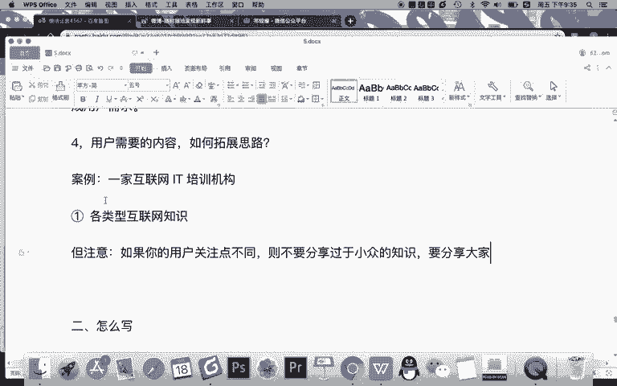

大众化。这是。比如举一简单例子。你加IT互联网培训之后，你们既培训有Java，又有新媒体，有网络营销的等所有的内容。但如果你天天就今天分享Java，明天分享新媒体，后天分享网络营销，大后天分享UI行吗？

不行，为什么？因为都太细分了。因为你的用户中也许有10个产品线只有10分之1关心java，那你如果今天分享的java，那另外10分之9，他不喜欢，那怎么办？那你就分享更广泛的一些知识，比如什么知识。

比如。

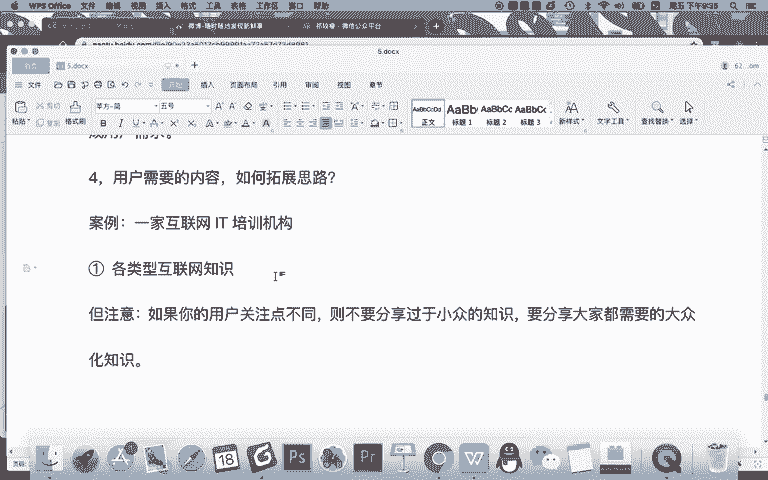

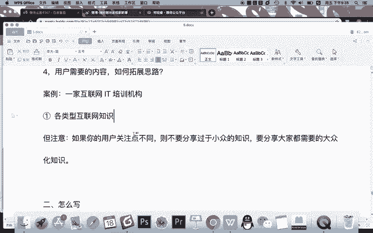

面试求职类的。比如职场技能类的，是不是？还有呢。比如说什么呀。办公工具。是吧使用等等等等，就分享人人都需要的这些技能，这些知识，对吧？站在一个职场人的角度为他提供价值，那么就对了。

但如果你说哎我能不能分享一些新媒体的知识可以，但记得你分享的这个知识应该是每个人都能去使用的。对吧比如举举一个简单例子，新媒体方向有短视频制作的这个技能。那你就可以分享一些手机端做短视频的一些。

小工具啊，一些剪辑技巧的分享。因为这个东西不只是新媒体上用任何人他都可以学一学啊。学完之后，他以后发朋友圈玩抖音啊，或者刷微博，是不是他也能拍出做出更好的内容，对他也有价值，对吧？

但是呢如果java这个内容，你去分享新了，那就不可以。因为对另外的10分之9的用户来说，他不需要这个内容。

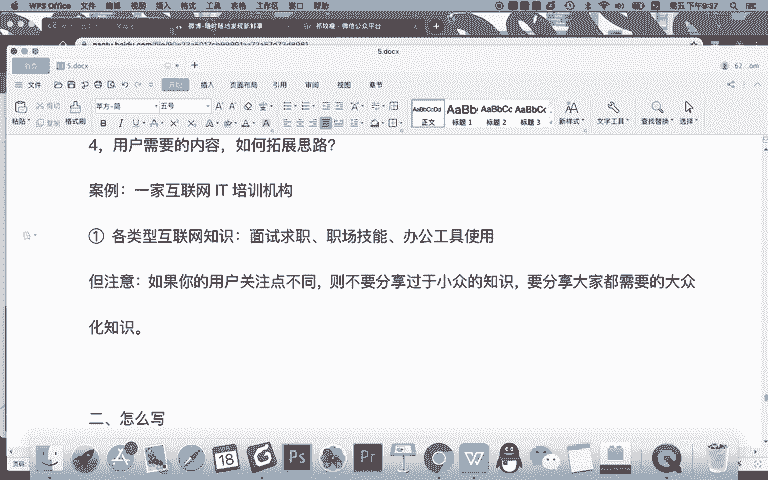

OK第一，用户需要的是。

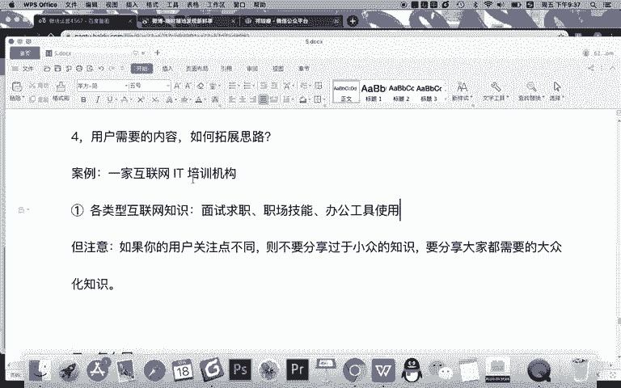

互联网知识你可以分享，那还可以发什么？第二季的。从企业角度来说。行业资讯。什么是行业咨询？就比如说。互联网。热点。新闻还有呢。企业。什么知名企业。变动等等知名企业的动态嘛。发这些内容，记得所有的你的。

互联网。货都关注。就就现在你如果发行业资讯，你起到的是一个什么作用啊？你起到其实是一个。呃，新闻媒体的一个作用。但是你这个新闻媒体呢只聚焦互联网，因为你的用户是互联网用户，对吧？

所以你可以发这样的一些行业资讯，这样的资讯呢对你也非常的有价值，对不对？甚至你看啊，如果你是一家。

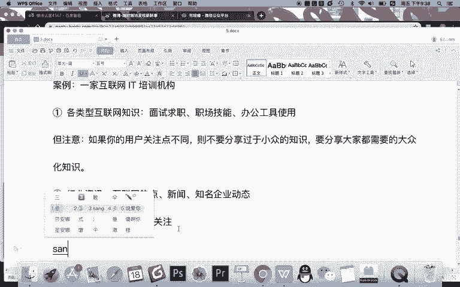

IT培训机构。IT类的企业去进行培训的目的干嘛？最核心的目的对于混多这个我们的学生来说，其实他是需要去学习这个啊，我个人认为啊学习这个提高技能啊，提高收入的。所以你看。

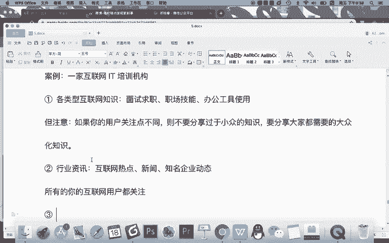

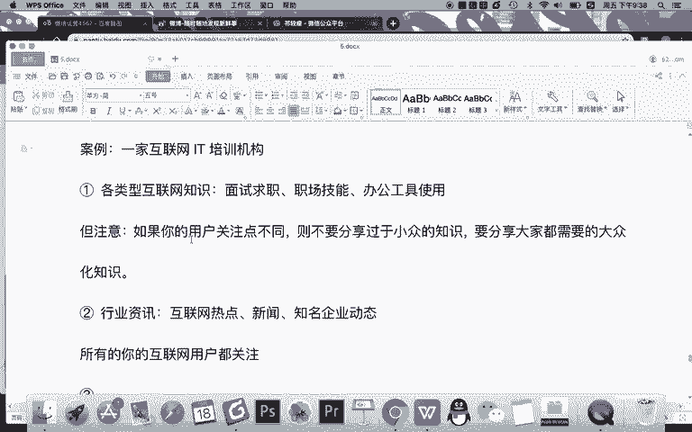

你可以提什写什么内容。写什么？