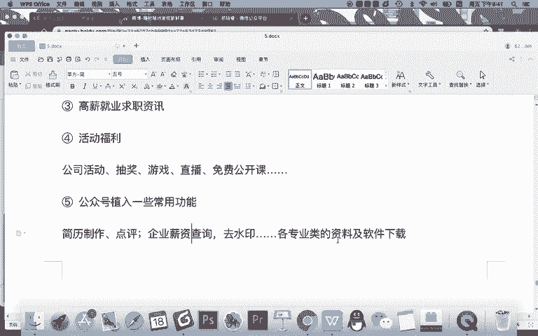
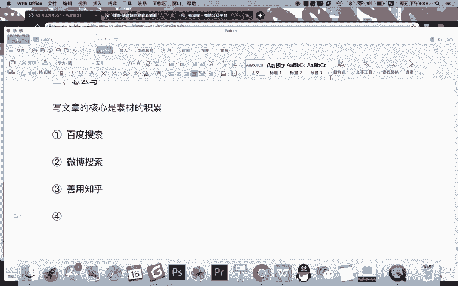
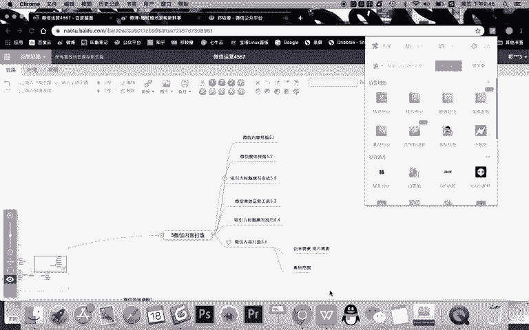
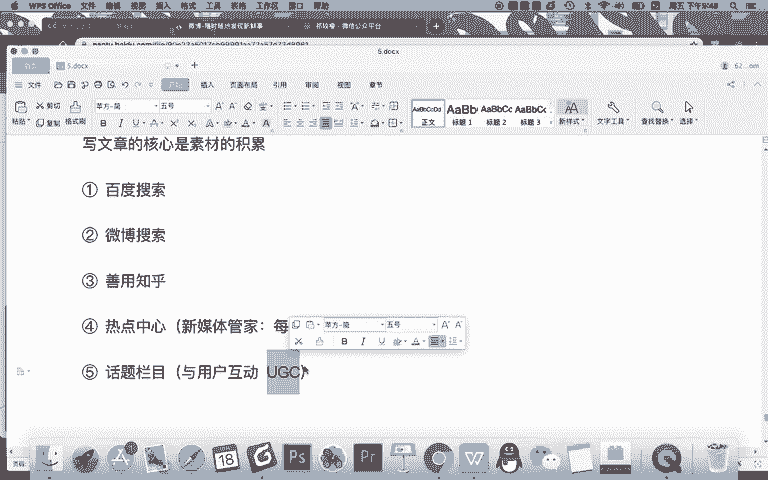

# 微信公众号运营视频全套 手撕运营 拳拳到肉 - P34：2.06-微信内容打造~3 - 达妹_达内教育 - BV1UvvvebEdT

更薪就业。什么呀？求职字帖。对不对？既是互联网行业的。但现在呢关于求职的关于高薪就业的这样一些信息，你发出来一些技能类的行业动态的，甚至今年的大学生啊、公务员考试啊，甚至互联网就业情况啊。

薪资收入啊等等。这相关的对我们的用户来说也都是有价值的。OK除此之外，还有第四类。比如什么呀。活动福利是吧。公司活动。然后呢，比如说什么抽奖。公司做的各种活动抽奖。游戏。直播。

甚至呢比如说什么免费公开课等等等等，这都是一些福利活动。你通过做这种福利活动，让用户获取好处，对吧？他可以免费学，或者可以娱乐，或者可以获奖等等。对他来说有价值，你可以进行。那除此之后还可以发什吗？

还可以。我认为还有第五类啊，你看我们前面其实有说的，就是你看有福利有功能，对吧？有说到功能的话，你其实你还可以想怎样。比如公众号。植入一些什么呀？常用。光能。比如说。简历制作甚至是点评。

你就让你的公众号已形成一个长期性的栏目，为这些求职者提供简历的一些制作和点评。是吧提供这种服务之后，你想有很多是你们的学员，不是你们学员，他都来。假如你帮他去解决这个问题的话，他跟你互动。

你慢慢对他营销，他们都是这种精准的用户啊。因为职场新人才去制作简历，对不对？所以呢不管他是不是你的学员，你给他点评。这个都能慢慢把这个学员当成你的潜在学员去给他运营。甚至还有哪些呢？除了简历制作点评。

还有呢。还有什么企业。薪资。查询，比如有些。同学去一些公司入职的话，他不知道这个行业的薪资，甚至这个企业的平均的薪资。那你可以提供这样一些咨询的一些服务。对不对？还有些甚至说去水印。等等等等，对吧？

还有呢各种。各专业类。资料及。软件下载你提供这样的一些服务，那么用户就会更加习惯，这就是价值。

对吧那除此之外还能做什么？你看我们还再来看我们写的有功能了，有价值，有娱乐，有互动，对吧？互动的话，甚至你还可以再写什么，再做什么内容。第六个内容。

什么？互动栏目。这个什么是互动栏目呢？定期话题讨论。然后呢，学员。问题。答疑就解答学员的一些问题。还有呢。比如说。是吧。情感简单来说啊，情感驿站之类的。也比如说我们针对的年轻人还有什么情感的需求啊。

人生的追求啊是吧？还有职业规划。等等。我们就提供这样的一些互动栏目去解决学员的问题。甚至有些时候是一些心理的一些安慰和沟通，那么去跟用户互动起来，这都是大的栏目方向。那我要告诉你的是。

其实你看啊我写的这几个大的方向，每一个方向，你其实都可以拓展很多的知识。比如面试求职类的很多知识可以去结合起来，对不对？比如秋季面试求职的一个技巧啊，春季是还有职场技能的一穿搭，是不是职场服装是吧？

马上换季了，要告诉他这个季节怎么穿办公工具的使用等等，每一个大的方向又可以拓展出很多很多的细小的知识。那我现在只写了6个，那你想每天假如你就跟一篇的话，是不是内容就不一样了。是你每天更三篇。

你选其中的不同的方向也变得不一样了。这就是说如何去拓展你的思路，记得先去宏观的让你的这个思路变得更广泛，然后再变成。具体一个大栏目下面的小栏目，然后你拓展到10个20个小栏目之后。

那么我相信你每天更新的内容都会变得不同，并且永远有思路有想法。OK，现在你知道了去怎么去。啊，拓展思路之后，接下来就是哎你知道了写什么了，那现上就怎么写，那怎么写的时候，其实第一步啊，你记得。记得啊。

这句话写文章的核心是。素材的。积累。就是有很多人说啊我不会写文章，其实是因为你没有积累。这个积累呢其实分两方面。第一就是你脑子中有积累，对吧？你你脑子中本来就有这些知识，那么你就不用去搜集就可以写是吧？

比如说一些诗人，一些写小说的人，他看了很多是吧？读书多才能写出好的文章，第二个情况就是你平时也看书不多，特别是你的这个专业的方面的知识又欠缺，那怎么积累？记得搜集。

那现在我给大家分享几个搜集资料的一个知识。比如你确定了。任何一个方向选题的话，想写任何一个技能的话，第一步要学会利用。百度搜索。记得像比如说啊你要写任何方面的一个面试求职的一个技巧。你确定一个标题之后。

你百度一搜，绝对能找到相同的一些内容。那么你就可以把这些内容进行整合吸收，然后去进行加工，原创出你的一个表达的想法。所以呢你要学会用百度搜索。第二个呢，我建议啊微博。搜索为什么说建议微博搜索呢？

因为微博是一个开放性的平台，在微博上有各种知识的分享，还有各种用户的一个内容的表达。利用微博的搜索呢，你能搜到更加社交化、真实化的一些内容啊，它跟百度搜到的资讯不同啊，百度偏新闻啊。

微博内容偏用户和社交你可以用这个搜索。第三个获取素材的方法。什么呀？善用知乎。我个人认为呢知乎是一个非常高效的平台，它在里面这个平台上基本提供了所有的各个领域的一些基础性的知识的解答方案。

比如说你就搜新媒体的各种知识，它都有。比如微信如何排版，如何写文章啊，如何去讲笑话，甚至是吧？如何去做选题，如何写心引力标题等等，很多方向的知识都会有。当然啊除了新媒体方向，其他方向。

限制一些技术方向的知识也会有。那么我希望你在搜集或者说遇到一些难题，有一些问题的时候，你都可以试着去知乎上搜一搜。然后呢，批去多个平台整合查看，获取你有需要用到的一些知识啊。

比如说把十0篇文章你进行消化吸收，整合成一篇文章。那么这篇文章你重新撰写出来，它就属于原创，能理解吗？不要复制粘贴。第四个方法。就是什么呀，利用。什么呀？

我还是建议大家用这个新媒体管家里面有一个热点中心啊，热点中心这里。

可以。提供什么呀？每日。热点灵感啊，这里再给大家标注吧，记得是。新媒体管家里面。热点呢其实是我们做微信运营也好，做新媒体运营也好，不可去呃忽略的一条方向啊，这是我们新媒体人的一个宿命。就是只要要写文章。

你就要跟热点。所以呢你可以结合自己的公众号的定位，然后呢去没事的，就各个平台查看一些跟你有相关性的一些热点。然后围绕这些热点去讨论话题去创作内容啊，这是热点中心给大家提供一个想法。Okay。第5个。

想法就是什么呀？化题什么呀？确定或者说什么话题栏目，你多做一些话题的一些栏目。这个话题栏目主要是针对什么？与用户。行道な。写文章的，有些时候你不需要去自己去写。大家知道现在很多做自媒体的。

有些时候他写的那些话题的方向，甚至去使用一些案例，甚至是一些素材都是从用户中获取的，你也可以去建立一些栏目，去搜集大家的问题，甚至搜集大家的想法，把大家的想法整理成一篇文章。

然后呢梳理成一些答案给大家展示。这样呢就是完全的什么呀？记着一个词啊，在我们之前讲的UGC用户创造的内容。那么你记得如果你有很好的一些话题栏目的话，你的UGC的内容也是无穷尽的。

因为用户的想法是永远不相同的。而且用户是永远没有穷尽的。

所以呢用这样的一些方法，你就能够积累出文章的素材。