# 微信公众号运营视频全套 手撕运营 拳拳到肉 - P35：2.06-微信内容打造~4 - 达妹_达内教育 - BV1UvvvebEdT

然后呢啊写出更好的一个内容。在这里呢，我就给大家提供了5个想法啊，记得善用百度，善用微博，善用知乎。然后呢善于关注热点，善于从用户中挖掘素材积累素材。这是我们写文章给大家提供的一些获取素材的些方法。

那如果你会了素材之后呢，你把这些文章按照我们前面讲的排版技巧去发布。那接下来你就需要去传播了。

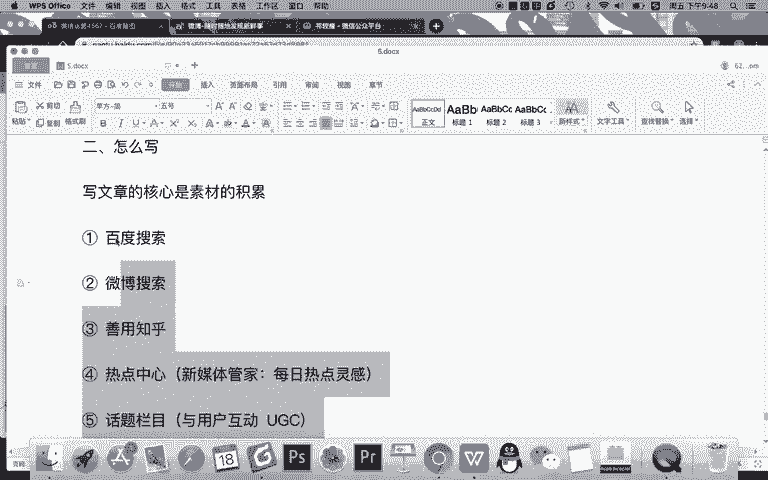

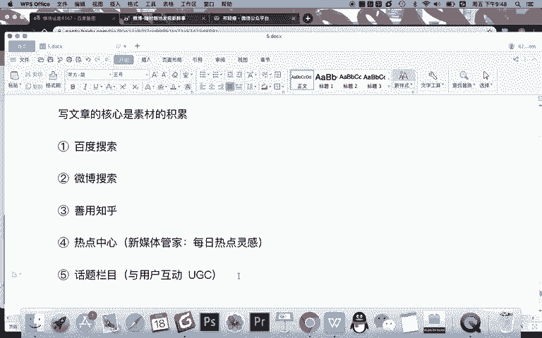

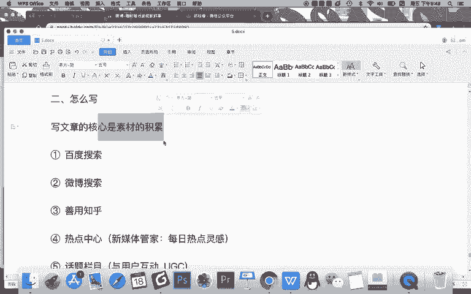

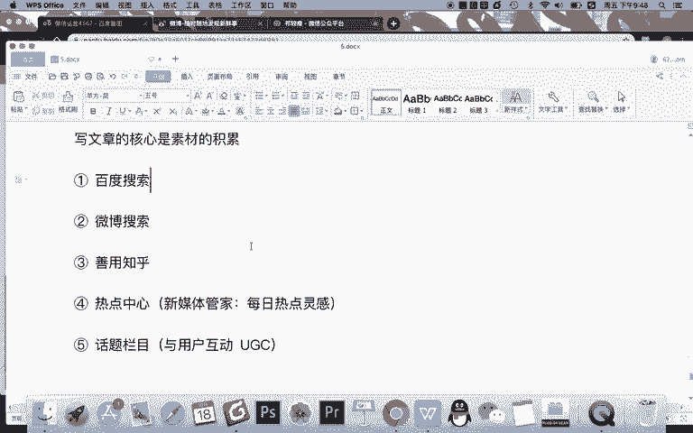

在传播上啊，我给大家写了4个点，你注意传播的。首先第一个点就是你如果更新文章，什么时间更新。记得啊记得一个词。十点读书。呃，10点读书呢是一个知名的自媒体的品牌，对不对？现在它做的非常大。

不只是一个自媒体了啊，它有线下的一些商店，甚至形成了自己很强大的品牌。包括他也做知识内容的一个付费啊平台O10点读书给大家提供了一个很好的发公众号文章的时间，那就是每天晚上10点。我要说的是啊。

从10点读书这个词，你可以去学习。其实一般我们做公众号每天来说，阅读量最高的时间就是晚上9点到11点或12点之间这个阶段。所以呢如果条件允许你最好这个时间段去发文章。OK啊，那除此之外呢。

我还希望给大家讲，除了一天啊，你这个时间段发周一到周末来说啊，一般周一到周五的这个大家看文章的这个时间更加的固定。因为周末大家去看电影啊或者娱乐啊，时间会不固定。所以呢我建议你如果你做企业的公众号。

文章最好一般放在周一到周五之间更新，对吧？那这个是频率呢，比如说我建议啊一般来说你不用每周去，或者说不用每天去更新，不用每周频繁的去更新。一般建议每周2到。三次就可以，也就两天一更或三天一更啊。

然后呢保持你一个频率基本可以，重要的不是更新次数，而是什么？频率。固定。

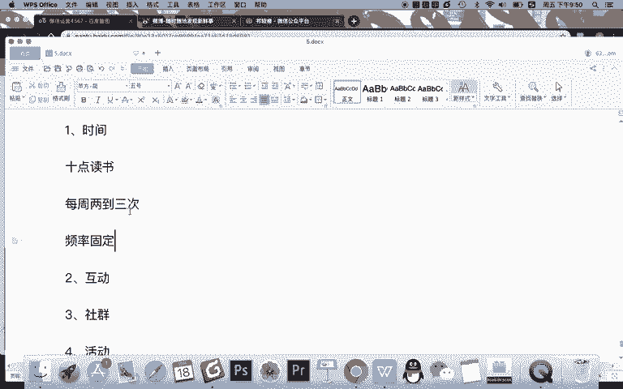

也就是你去跟用户要形成固定的一个频率，去让他知道。哎，你比你你比如每天晚上是每天每周二的晚上和每周五或者每周四的晚上你去更新文章。那么你就形成这样固定的一个频率。

让用户知道到这个时间去看到你这个文章OK所以呢做企业公众号的运营，不是说一定要天天去写文章，你甚至可以一周就发一次，但一次是精品啊，这样最后一下我也给大家写一下原计的。

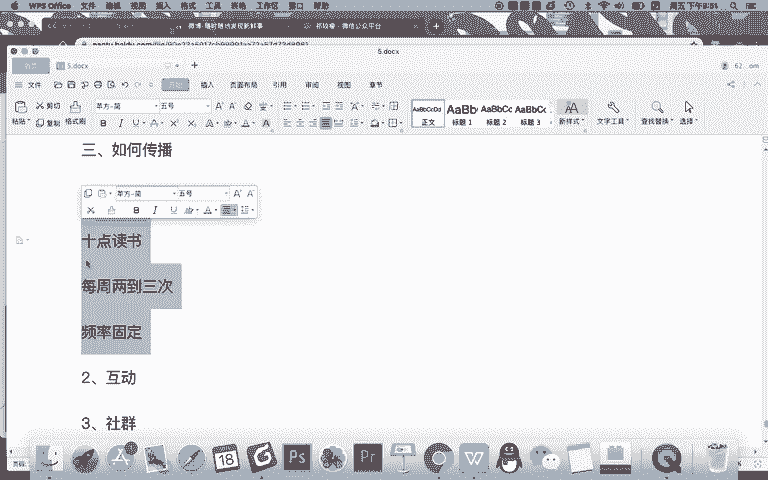

我再多。在于今记得哪怕。一周只更一次甚两周更一次，你也不要为了啊跟用户沟通，天天更。你更的内容没有吸引力的话，没有任何的价值，反而会取关啊。记得要把内容写好，然后呢在固定的时间保持固定的频率去更新。

OK这是我们在传播上的第一个技巧就是啊注意这个传播的时间。第二要什么呀？记得要充分利用互动的技巧。与用户互动。比如我给大家提供三个互动的技巧。第一个就是。

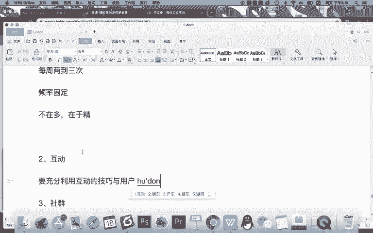

留言。记得没事，就让你的用户，或者说在文章中引导用户给你留言。这个引导的方式既可以你通过文字引导，还可以通过奖品激励引导，对吧？第二个呢就是什么？引导用户进行公众号。对话让用户去跟你互动。

比如这个公众号对话有一个基本的方法。用关键词，你就设置一些关键词给用户分享一些分资料啊、福利啊等等，让用户去给你回复这个关键词，甚至去给你问问题等等。进行互动的目的呢，其实就是为了增加用户跟你的粘性。

然后呢，粘性一高，阅读量高，传播量或者说传播的力度会更广泛，这是非常合理的。第三个互动的技巧就是。这边菜单。你可以设置一些福利领取的方式，甚至抽奖啊，比如说你看。游戏。抽奖福利。

领取的方式直接设置到资金菜单里，让用户不管是在关注的时候，还是看你文章的时候，他都知道能在你的公众号获取这个内容，增加他跟你互动的一个频率。

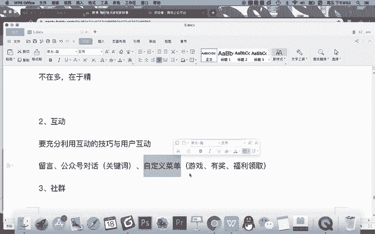

当然啊后来我们还可以在后期的一个运营中去多做一些活动啊，去增加互动。记得互动，有粘性，有粘性粉丝去看你的文章的概率，以及去分享你文章的概率会更高。第三个，实现你文章传播的一个技巧就是做社群。

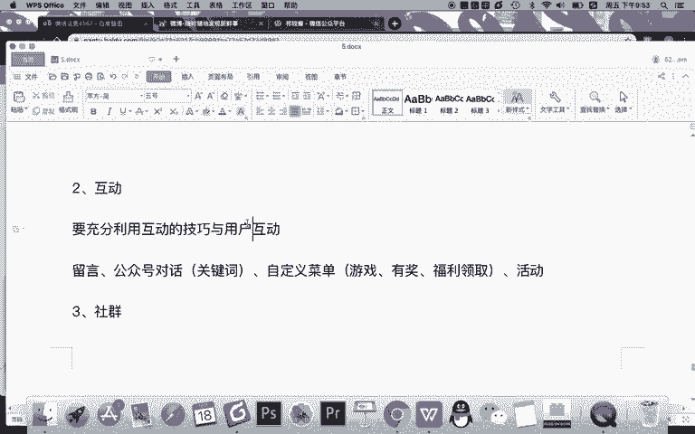

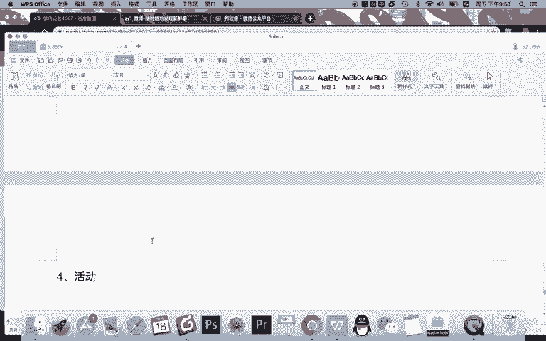

什么。

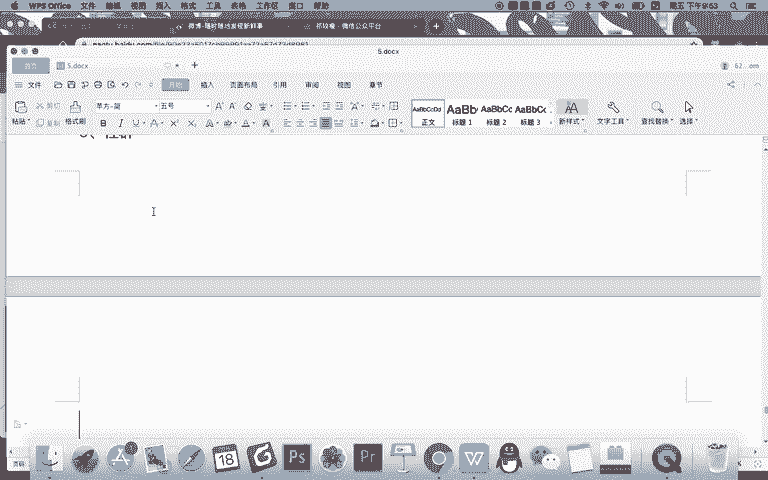

记得各个公司。多应积累。记的。粉丝社群。记得社群用户是文章。传播的什么呀？

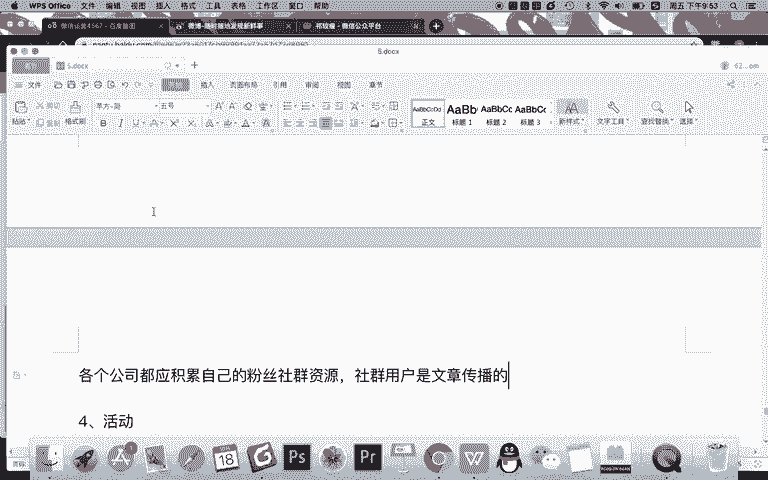

一级。核新用户。也就是我们其实有些时候做社群呢，并不一定说要让社群的用户去买你的东西，不是这个目的。我们是要培养一批铁杆粉丝，让这些粉丝成为我们文章的一个初级的一级的核心的读者，然后呢，他们不仅是读者。

同时还是传播者，甚至是你的什么呀文章的试读人员，他会给你的文章撰写，提供想法，提供建议，甚至去帮你去传播呀等等啊。所以呢要做社群，后期呢如果这些社群做的很好呢。这些粉丝，当然也是你的潜在的消费者。

对不对？这是提高我们文章传播率，传播力的一个方法啊，其实就是为了让我们的文章写了之后不是没有动静，就天天更新而已啊，你要去利用社群把你的文章传播出去。

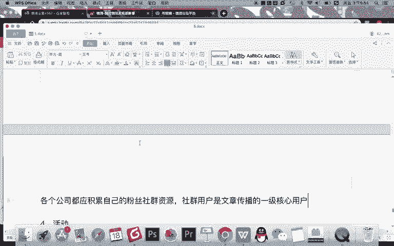

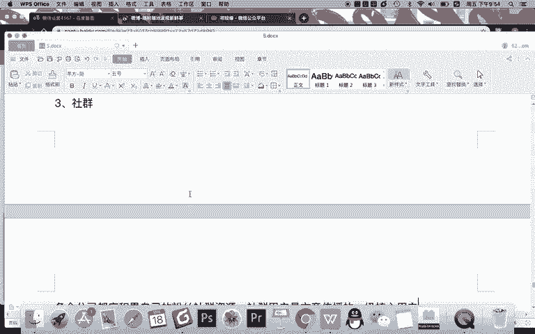

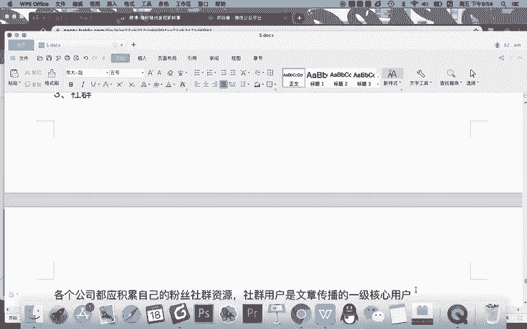

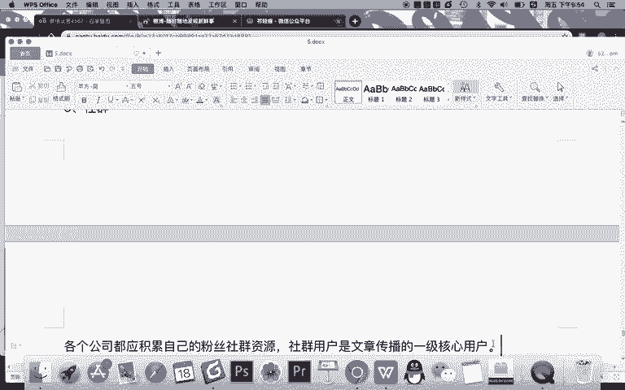

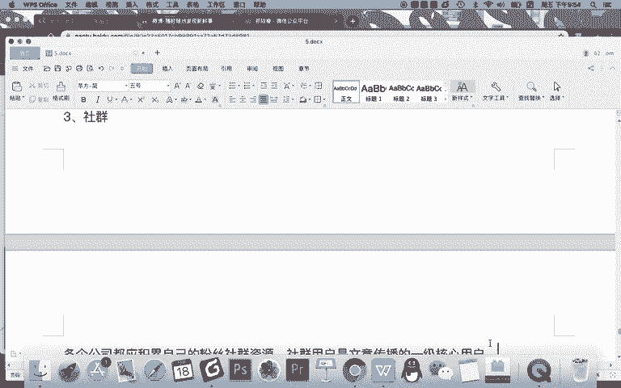

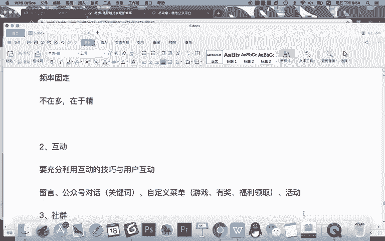

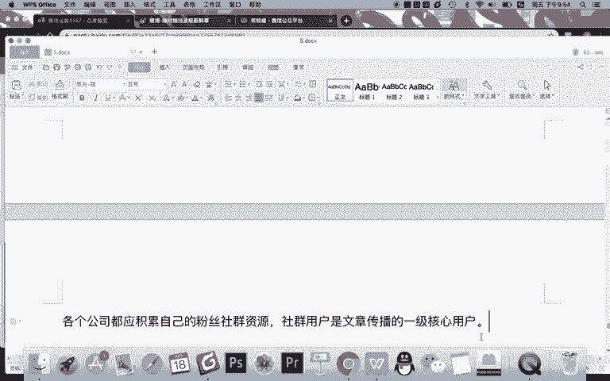

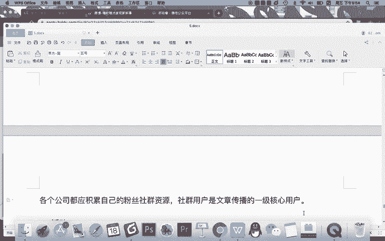

第四个啊就是做各种各样的活动。比如说。投票。还有呢。H5。Yes。还有呢。抽奖等等。活动记得用活动的形式。直线。公众号。吃的怎。阅读量。该怎么样？呃，活动呢不要频繁的搞，当然小活动可以持续的搞。

但是大型的活动也建议半个月啊，至少半个月或者一个月搞一次，然后呢让用户有新鲜感，同时让用户真正得到好处。然后呢用这种活动的方式实现你公众号的指数级的增长啊，这个增长呢就是公众号阅读量和粉丝量的一个增长。

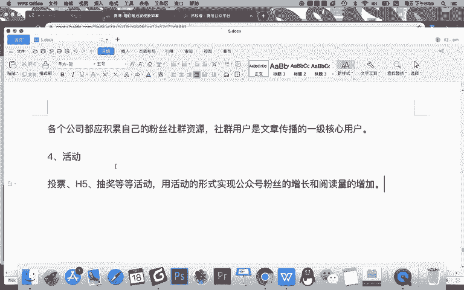

目的呢还是把你的公众号去传播出去。记得做公众号，不能天天就很呆板的去写文章啊，一定要想方去互动，去运营，沉淀用户啊，去做活动，去传播。这样呢你的公众号的文章切起来才有价值。如果你是天天的很很呆板的去写。

那你阅读量越来越低。那么你这号就很难做起来。

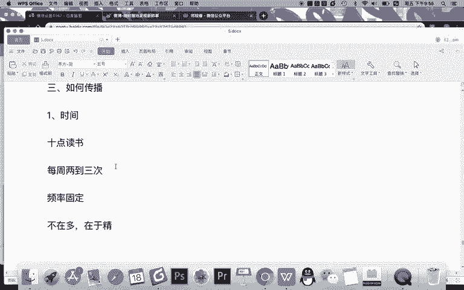

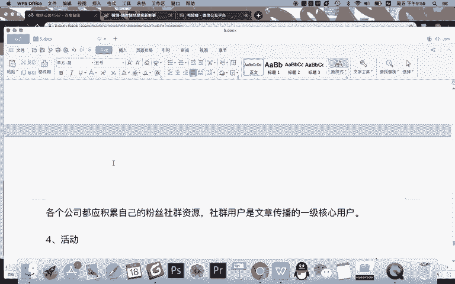

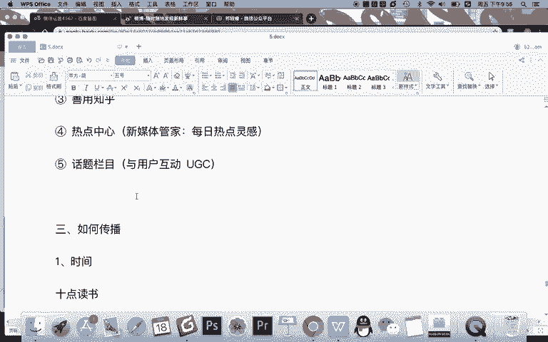

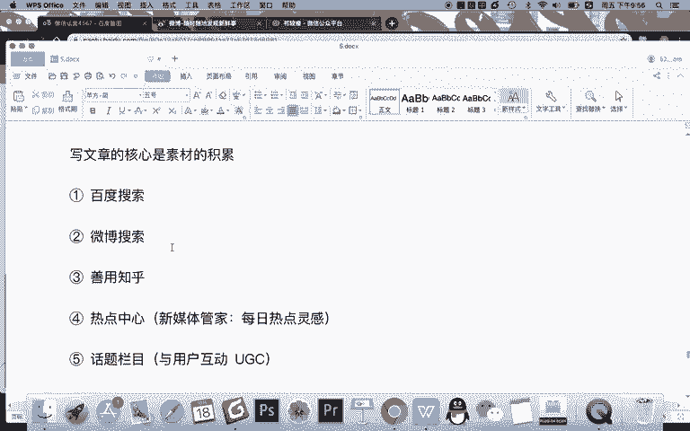

OK啊，那我们今天这节课的内容呢主要给大家分享的是如何去打造你的微信内容啊。其中我们给大家分享的第一个步骤是去确定写什么，你就去拓展你的写作的思路。第二呢，知道了写什么之后，我给大家第二个方法。

分享了一些大家能够搜集资料，获取资料的一些方法。记得。

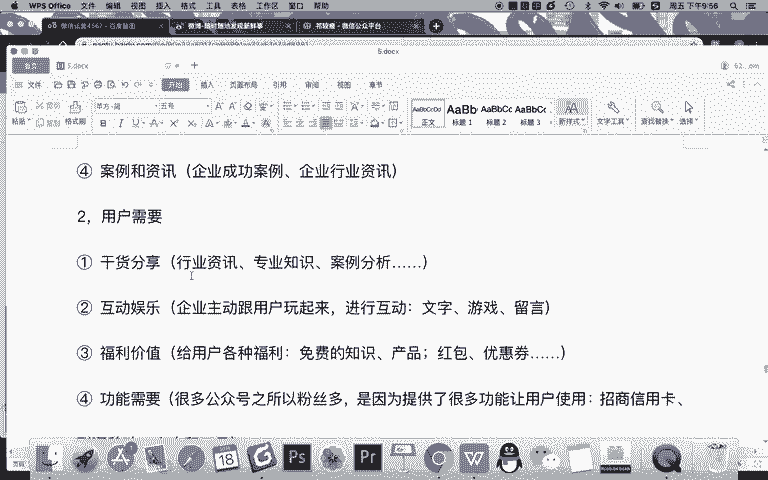

写什么不是最重要的。如何去写也不是最重要的。最重要的是要收集资料，只有你掌握了足够多的租赁，这些资料才能把你的文章写出来，然后才能让你的粉丝喜欢。

那最后呢我给大家去分享了一些让你的文章能传播出去的一些方法。比如去搭建社群，比如去多互动等等这些方法，这是让你的公众号火起来，让你的文章火起来的一些核心的方法。O我们本节课关于微信内容的打造。

就到这里啊，本节课的知识呢偏理论一点。因为呢它是一些方法论的知识，希望大家能够认真领会，然后按照这样的一些建议和方法去打造你的微信内容。好的，下节课我们将学习新的知识。

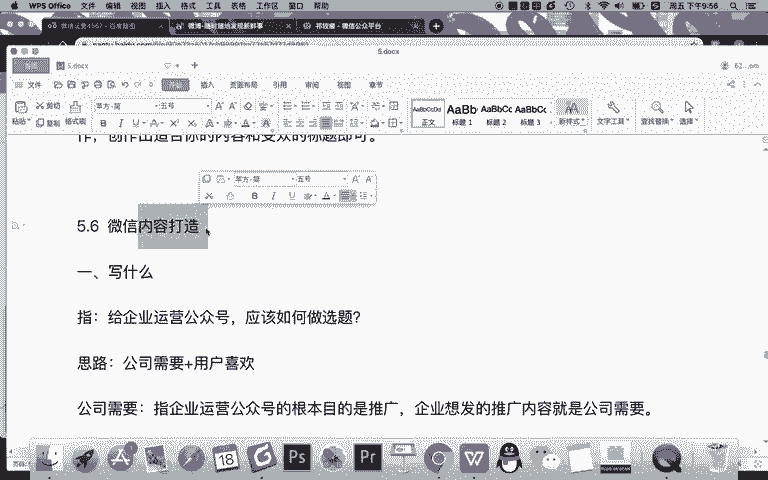

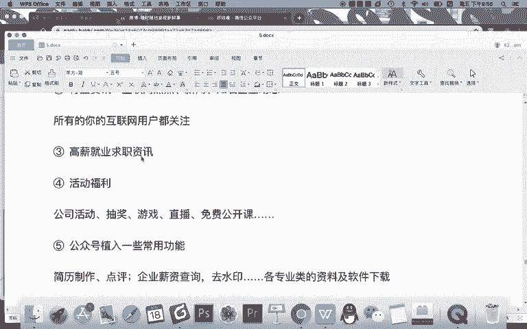

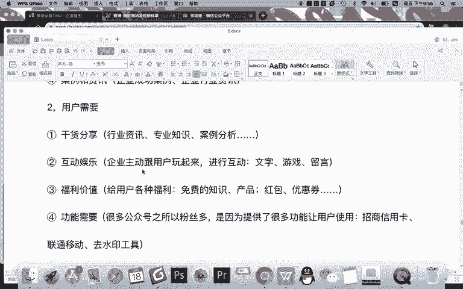

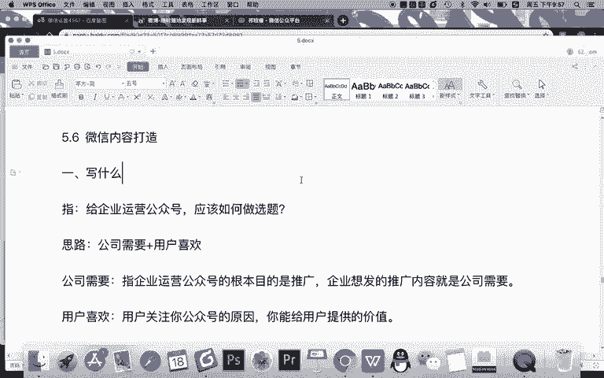