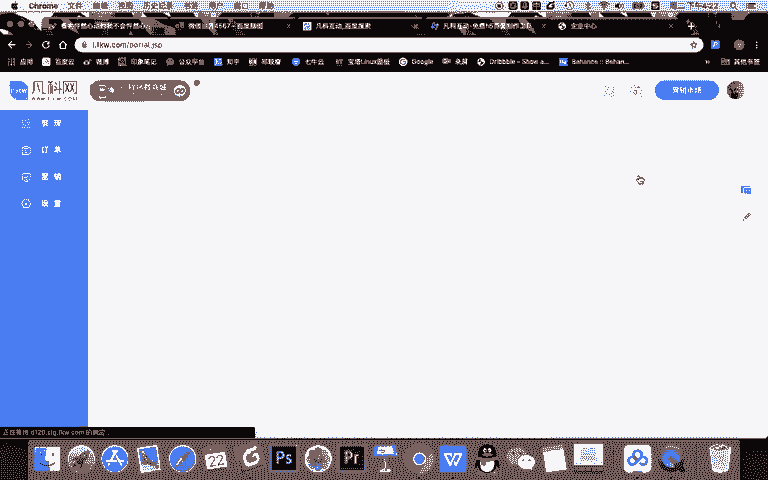
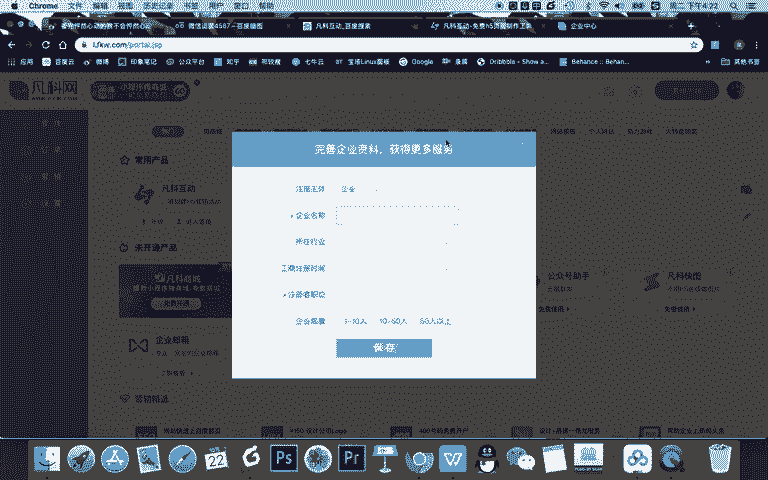
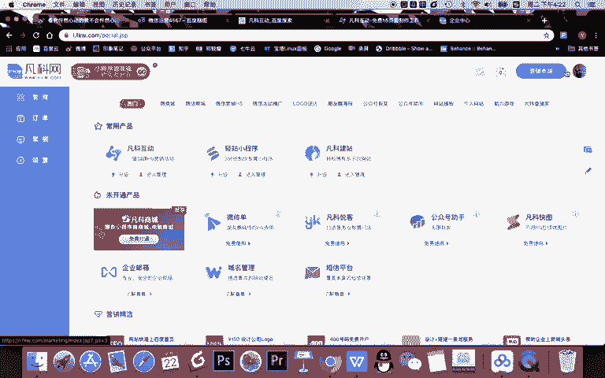
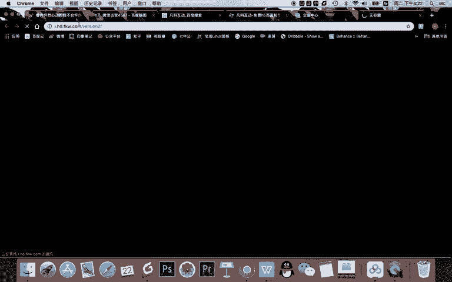
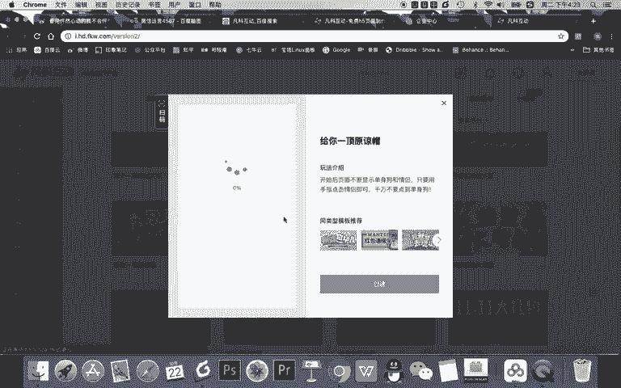

# 微信公众号运营视频全套 手撕运营 拳拳到肉 - P36：3.01-微信游戏增粉~1 - 达妹_达内教育 - BV1UvvvebEdT

同学们好，欢迎大家学习新媒体运营第六天的课程。今天我们学习第六天第一节的课程内容，微信游戏增粉。啊，所以呢我们整个第六天的课程都跟微信的。增长有关啊，首先我们解决第一个问题，如何。才能。中短。

或者说什么。中。的流程是怎么样的？啊，我个人认为呢，不管我们用各种各样的方法去增粉，其实最根本的一个流程是这样的。一。用户看到吸引力的。信息。对吧不管是在朋友圈。微信群或其他的地方。然后呢。

他看了之后他干嘛？他也需要进行第二步，一定是。扫码关注。工个黑。然后呢。第三。获取。想要的。信息。对不对？所以呢我们增粉的流程很简单，就是不管用任何的方式就是先吸引用户，让他看到，看到了他想要怎么办？

扫码关注公众号，然后在公众号内获得想要的信息。然后既然他在公众号内获得就实现了增粉。那第二个问题。微信游戏增粉的流程。我们把刚刚的这个问题呢或者这个步骤给它进行的细化。如果我们现在是做了一个微信游戏。

那我们知道啊做成这种小游戏，它的吸引点通常有2个。第一个呢就是游戏本身有趣好玩，有挑战性。然后呢，用户愿意玩。第二个呢就是游戏增粉，我们可以增加一些奖品红包，对吧？

然后用户玩完游戏能够得到现金或者能得到各种优惠的奖励。那么他能增粉。那你不管是游戏本身有趣还是有吸引力啊，它第一步还是看到这个吸引点，那在哪看呢？我们按照常规来说，第一。用户。在朋友圈看到。游戏。

吸引力看到游戏对吧？但现在呢这个看到游戏的吸引力需要有一个物质的条件。比如说。他是看到一个在朋友圈，我们感觉能看到三种内容。第一就是。啊，链接对吧？我们朋友圈平时看到一些文章的链接。

当然这个游戏呢是个链接的方式也可以。但我个人认为更好的还有一个内容就是图片，比如说图片海报。用户呢在朋友圈看到这样一个游戏的海报，然后呢看看到哎挑战什么什么的游戏，同时能得到现金红包。

那看到这个游戏海报的话，我认为比链接更有吸引力，当然还可以是视频啊，但是我认为没有图片直观。所以呢游戏增粉流程的第一步，你需要有一个。朋友圈海报，然后呢是介绍你这个游戏，然后让用户有吸引力。第二呢。

用户看到这个海报之干嘛？扫码关注。公众号。那扫码关注公众号，他要打游戏，怎么打游戏啊？我认为有两种方法啊，比如说。回复。关键词打游戏。或者呢。或者还有一个方法就是什么关注号。被关注回复你。游游戏。链接。

OK所以呢你看用户关注了我的公众号，他要么是看到公众号关注之后直接有一个自动回复嘛，就被被关众回复，我给他一个游戏连接。还有呢回复关键词可以打游戏，对吧？我们用一个简单的方法去回复关键词打游戏。

那比如说回复关键词的话，我们可以告诉他咋样。扫码回复游戏两个字，打游戏。哎，他回了游戏两个字，我就给他打游戏。那第三呢，他打游戏能干嘛？当然首先啊打完游戏。第三。打游戏。什么。赢奖励。

所以呢第三个步骤就是他打游戏游戏要好玩，然后呢还得设置好奖励。所以第三步是什么？完成。游戏设置。然后呢。把游戏设置的有趣且。有奖励。okK微信游戏增粉的流程我们梳理好了。那这三步呢作为一个运营人员来说。

然后呢你看。我们知道我们要做什么。游戏增粉的运营设置。我们从最初到最后，它需要有三步。第一。完成游戏开发设置。对吧第二。完成。什么呀关键词设置，因为他要去。能够回复关键词打游戏吗？

或者完成什么被光注回复的设置。第三，关键词回的是什么？回的是一个游戏链接，这个游戏链接就我们设置的这个游戏。但其实还有一个关键，它怎样会回关键的？第三。完成什么呀？游戏海报。设计。你设计这个海报。

它才能朋友圈看到，对不对？所以你看我们刚刚的这个流程对我们来说，首先我们要设置游戏，其次要设置关键词，再其次他朋友圈看到海报，我们要去设计一个海报。然后当然第四步啊。是什么？在。各个。渠道。传播游戏。

海报okK这是渠道啊，有了渠道的传播，然后用户扫码这个海报回复了关键词就开始玩游戏，整个流程就打通了。那所以呢我们现在要完成游戏增粉啊，第一步就是要设置游戏。那么我们怎么设置游戏呢？给大家推荐一个工序。

第一。😊，免费的什么呀？H5。游戏工具这个工具呢叫。凡科互动啊，我把地址发给大家，大家只需要百度啊，你看像我这样百度凡科互动就可以。

凡科网呢是一个啊凡科网旗下产面是一个专门做新媒体或网络营销的一个平台啊。你看它旗下有很多的产品，比如可以去建站啊，还有做商城凡科互动，就是我们说的做游戏，还有做传单，还有小程序等等。

那我们今天呢只使用凡科互动。凡科互动呢就是做下面，你看各种游戏的一个模板。当然刚开始你需要去注册啊，那我呢因为有这个账号，所以我直接去扫码登录。唔。okK我扫码登录之后，我就去到了啊。

当我就去到了凡科网的一个后台。当然啊这一步你看完善企业信息啊，公司的一个信息，这其实不用填写啊，你看这是我的头像，我直接进来了。然后呢我就可以直接选择凡科互动这个平台啊。我把这个地址发到我们的笔记里。

让大家能够很方便进入凡客互动。OK进入凡科互动呢，你可以直接看到啊它的界面里。

有这么多的游戏，而且啊凡科互动有一个好处，就是它是专门做游戏的平台。你可以根据节日去选择各种各样的游戏。而且这个节日呢是根据近期或下个月将将有什么节日就会有做什么活动。我们比如说马上要有万圣节。

还有立冬，还有双十一光棍节，有感恩节双十二啊，然后有这样的一个日子。所以呢你现在看的就是这样节日。比如如果是明年春天看你可能看的就是清明节等。比如说女生节等等节日。它凡科网呢会根据各种节日去设置。

跟节日主节有相关性的一个游戏。比如我们看看万圣节。啊，你看拯救南瓜，看好不好玩啊，我们打开这个游戏，简单看一下。看一下它是什么，好不好玩，哎，点击开始挑战怎么办呢？其实就是摁着拽下来，对吧？摁着拽下来。

很简单，对吧？你收收集的越多，可能获得的奖励越多。OK这个游戏还行。那我们如果在看双十一的游戏呢。嗯。双十一秀恩爱给你一顶原谅帽。哎，这个看一下。

开始逆袭，对吧？怎么玩呢啊，给你原谅帽是这样的。啊，这个有点难度哈，你看就需要在手机上一直这样点，它有点跟。玩那个坦克大战一样有，我感觉这个游戏还可以。啊。

但是呢比如说你你需要选择的一个游戏模板是跟你本次的活动主题有关。比如你们双十一做的是打折类的活动，你又可以做什么这种抽奖类的。如果你们万圣节做的一些恶搞啊，派礼物的，你看可以选择这种。所以呢你可以根据。

