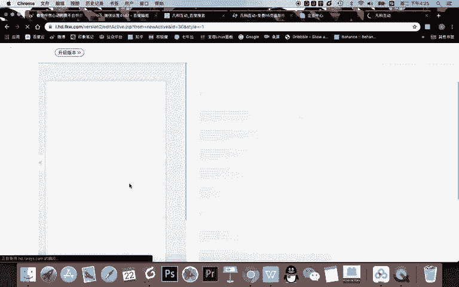
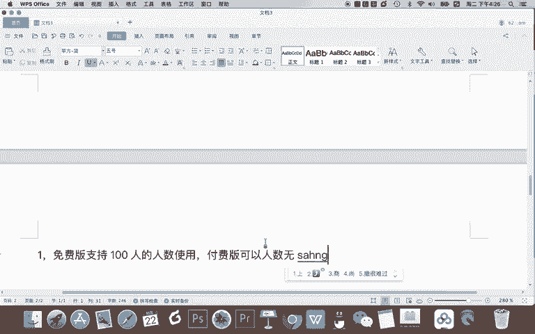
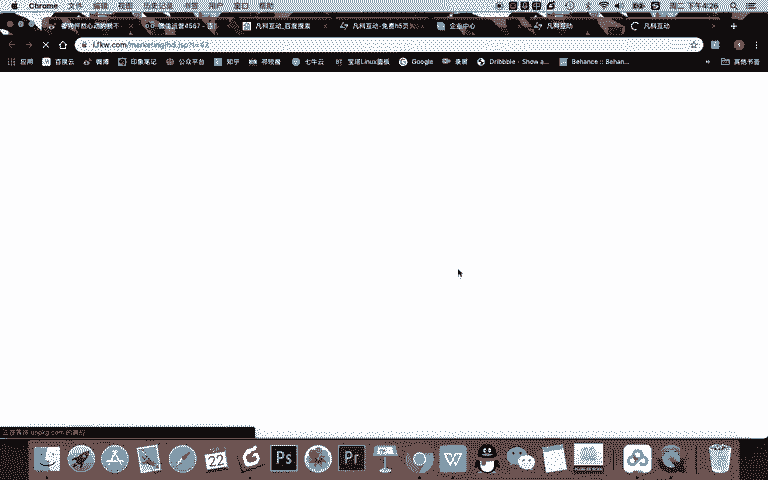
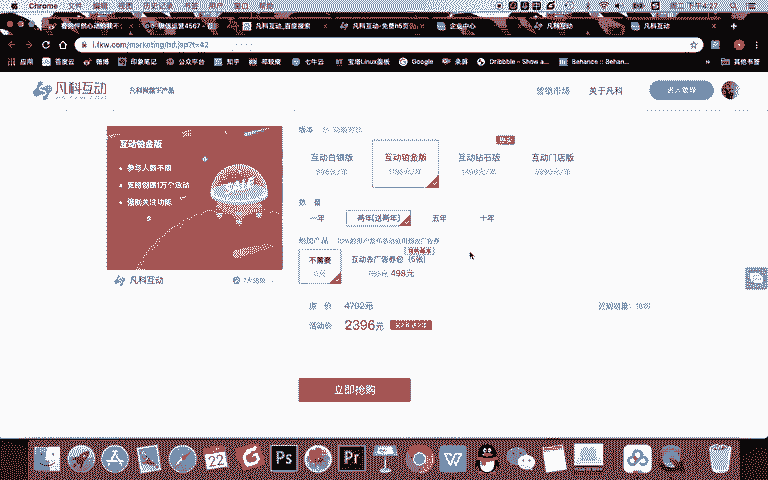
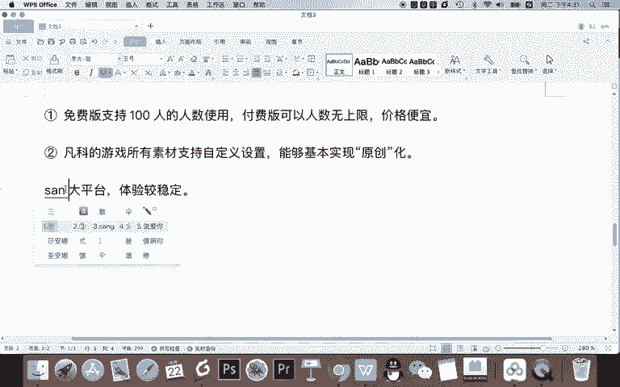
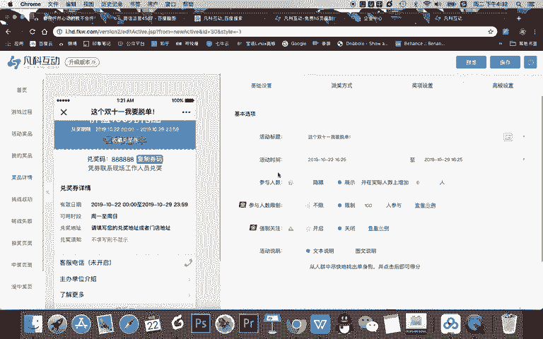
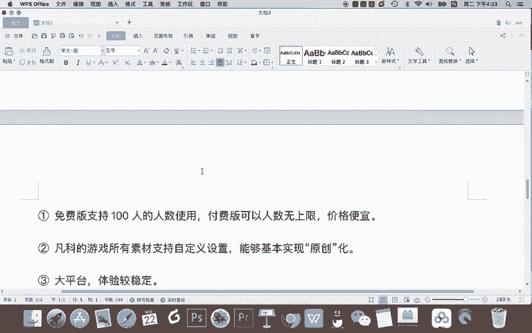

# 微信公众号运营视频全套 手撕运营 拳拳到肉 - P37：3.01-微信游戏增粉~2 - 达妹_达内教育 - BV1UvvvebEdT

你们双十一或者你们节日的一个情况去选择不同的游戏。okK我们假如啊。双十一要做一个跟谈恋爱跟单身狗有关的一个游戏。比如说是这样一个游戏。我们一起看一下。寻找单身狗对吧？哎，找到单身狗。哎呀。这个。

在这儿。在这儿。在这儿哎，越来越小应该是越来越小，隐藏的越来越封闭。那假如你们做的是这样选择这个游戏模板的，你直接点创建就可以去使用。okK点击创建。点击创建呢就要去制作这个游戏了。

那进入这个游戏的设置里面呢，我需要强调一点啊，就是。凡客。互动的。优势它有一个非常大的优势，就是第一。免费版。支持100人的。什么呀。人数。使用。然后呢。还有一个优势就是什么付费版。是么可以。什么。

人数。无上限。而且我个人感觉什么呀？价格便宜。

比如大家来看一下啊，你看你现在限制呢100人，你要想写，比如说1000人怎么办？那你就是什么呀？不限参与人数需要升级。升级的话，你看一下它的价格。

不是。啊，这个H5的游戏平台呢，我认为挺便宜的啊，你看。互动钻石版15001年，而且是什么两年送两年约等于什么？四年是3000元，一年不到1000元。

如果你们公司经常会每月或每个季度啊都需要去做这种游戏的话，我认为你可以开通这种版本，然后呢会比较划算啊。还有你看去广告圈等等。这个呢互动铂金版。这个就便宜啊，2000多也是4年，对吧？

你要说一年呢就便宜，但是一般他鼓励你怎样买两年送两年，所以你这个比较划算。然后呢，一年几百块钱可以用一年，我个人认为还是比较划算的。但如果你说哎，老师我们公司不想给预算，没有钱怎么办？

那你刚开始就可以先去设置这个免费的游戏啊，就是100人先测一测，如果你们活动啊，很容易超过这100人怎么办？我告诉你一个笨的方法，你可以同时设置多个游戏，然后后台一达到。

比如说你们公司活动的上限只有几百人参加的话，那你可以设置个几个一样的活动，然后放在后台一看到人数快满的时候，你就在公众号后台替换新的游戏链接，这样呢用户进来每次都能参加，也不会超出上限。当然。

如果你的做的活动都能超过1000人或更多人参加的话，那你可以给老板申请嘛，申请这个费用，对吧？买一年或者买两年，然后一直去做这个活动，一年增个几千几万粉，其实也很划得来。

对吧这是他的第一个，就是我认为它还免费版。首先我们能学习使用啊，其次呢你个人的小号还能去简单用一用。如果想要更多的话，你就要么多多个游戏去设置，要么你就申请付付费版啊，付费版也比较便宜。

第二呢就是非常方便一点，就是。凡科的游戏。所有。素材支持。自定义设置能够。什么呀？完全的能够基本实现。原创化。什么意思啊？首先大家来看一下。在你设这个游戏里面，你看这里面本来这图片。

这些东西是不是都是固定的？包括你看游戏过程，这所有的素材。那我告诉你，不管是这个单身狗还是所有的内容。你看单身狗还是这下面所有的素材都是可以去完全原创去制作的那你这样有什么好处呢？

你们公司可以把自己的一些产品的图片。比如说做成各种各样的产品，让什么呀？一堆产品中找一个你们最新款的产品。这样的话，你们公司的这个游戏就不只是模板游戏的，而是原创性的。

而且所有的产品到用户再去打这个游戏的时候，其实都是对你们的产品的一个曝光。这是我认为一个非常重要的一个好处啊。包括你看这所有的内容都是可以编辑修改的。包括你中的奖品，挑战成功的页面，甚至挑战失败是吧？

抽奖的些页面，这个图片都是可以改的。等一下。对吧这就改的跟更有公司的元素的话，而且你一旦用的铂金版，其实这个游戏跟你公司自己开发的是很像的。但是其实如果你们公司去开发了这样一个游戏，它就会很复杂。

比如你需要有程序员去负责开发。当然你原你是一个运营人员，新媒体运营人员，你可能去设计这个游戏啊，做出整个的一个基本的功能规划。然后呢，开发人员去开发。然后还需要有前端去调效果是吧？

甚至还有你必须有设计师去做所有的内容。但现在呢如果用凡科啊，你可以进行修改的，更加自主化，只需要顶多设计师去设计一些图片，你进行替换就可以。所以呢我认为这是他的第二个非常好的一个啊地方。第三个就是什么？

大平台。体验。较稳定。呃，打游戏，像这样的一些H5活动，或者说我们这样的一些有可能瞬间有很多用户参加的一个活动啊。当我们再去进行设置的时候，会遇到一个情况，就是一天啊。

也许在短时间几个小时之内涌入了大量的用户。如果你们的服务器如果自己开发的话，可能服务器撑不住，对吧？那怎么办？那你用凡客的话，你他的平台比较大。然后呢，它的整个的系统的稳定性也比较好。

他可能比你自己开发还要好一点，对吧？所以呢你选择凡客互动要比选其他的平台会好一点。当然啊，老师虽然介绍了凡客互动的优势，并不是说要给凡客打广告，只是说我们在运营的过程中。

我认为他还是一个挺好用的免费的游戏工具，所以推荐给大家。那么完成了一个平台的一个了解之后，我们进入第三步。游戏。设置。啊，我把这个就改成。小标题。

首然游戏设计呢比较简单，我们所有游戏的是基本在这里。一、完成基础的设置。还有抽奖方式的事儿，奖项的事儿，还有高级事儿，我给大家完全演示一下。首先修改你的活动的标题，参与活动赢大奖啊，这个标题比较普通。

怎样？你直接改是吗？先生。双十一。怎样？不只是。不想做单身了吗？或者说什么。你单身狗吗？我们这是单身狗挑战怎呀？这个双十一什么，我要脱单啊，这样也可以去用可以去设置。然后活动的时间呢。

你就看什么时候上线啊，我给大家演示的话，比如就现在上线，然后呢，截止到呃几号，或者你直接就双十一，比如说啊哪一年哪一天开始都可以啊，然后呢显示人数对什么意思啊？

就是这个游戏的首页会在这个地方显示有多少人参加。那你说我们要不要显示参与的人数是隐藏不参加，还是说显示呢，其实不参加的话，对用户来说，他就不知道有多少人参加，那展示的话，它就能看出来多少人参加。

有很多同学说不显示为什么呢？因为可能只有几十几百个人参加不够热闹，那我告诉你，你看这里正好有一个功能叫在实际参加人数上增加多少人，你可以哪怕有一个人。

参加你就显示已经有1万多人参加了啊，这就是在实际参与人数上加了一个底数，所以呢能造成比较火热的一个效果啊，这就是一种营销的一个展示。你你可以这样设置。还有呢限制参与人数，这里我们只能选择不限啊，不是啊。

我们只能选择限制，因为不限的话，你怎样，你要升级付费版本。O我们教学演示呢，就给大家展示100人的一个设置啊，还有强制关注要不要开启，想开启的话，就能给你的公众号增粉。那我告诉你的是。

这里我们不需要去购买它的升级的版本。那我们通过这样一个方式。

通过关键词的设置也能够实现强制关注。因为所有想玩游戏的人都必须在公众号里玩，那么他就会关注我们。所以我们直接用关闭就可以。还有活动的一个说明就是从人群中告诉大家怎么玩吧啊，这个其实不用去改啊。

直接写啊在默认就可以。当然你也可以写的更清楚。O在高级设置这里呢基本都是可以默认的。因为很多都是收费的一些功能。比如说有想展示广告啊，甚至是轮播抽奖的一个信息等等，这些呢是额外的一些高级功能。

我们不用去展示活动规则呢，我们是要显示的。还有呢排行榜我们也可以显示，当然也可以隐藏啊，因为它有利于用户看到自己的名字，所以我们直接显示OK在基本基础设置完成之后，我们要看。

