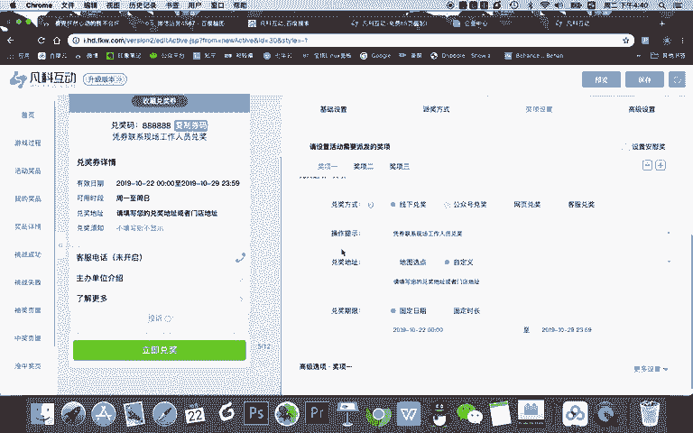
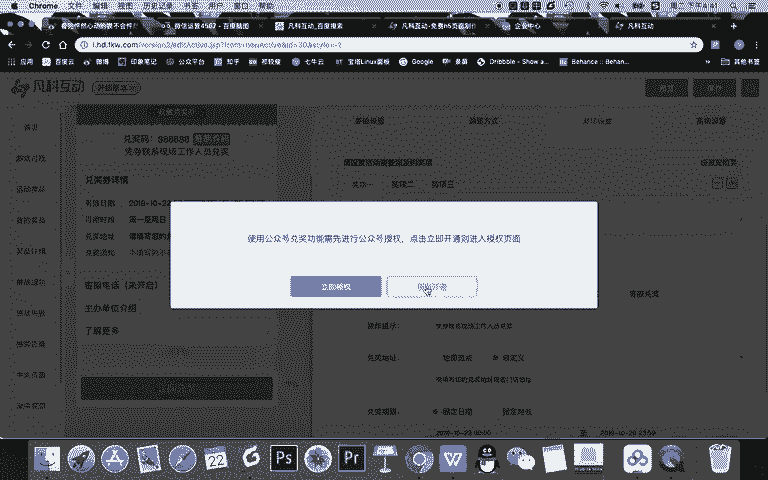
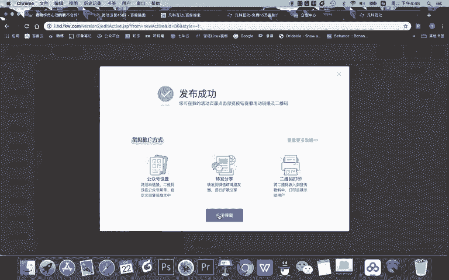

# 微信公众号运营视频全套 手撕运营 拳拳到肉 - P38：3.01-微信游戏增粉~3 - 达妹_达内教育 - BV1UvvvebEdT

二点派奖方式。那么派奖方式呢，比如说假如我们这一次的游戏，我想给大家送红包，玩游戏呢有能够领红包。那你就可以设置一个抽奖门槛。抽奖门槛呢也就是说哎他达到多少分能够参与抽奖。那大家感觉啊这个是门槛。

你认为要高一点还是低一点？就是说大家都能抽奖，还是说只有游戏打的非常好的人才能抽奖。其实啊我认为这个地方呢，它跟你设置的奖品有关。如果你们是做电商相关的企业要送优惠券的话，你的门槛就低一点。

大部分都能抽奖，对吧？还有呢我个人整体认为，不管做什么，其实都可以门槛低一点，为什么？因为虽然都能抽奖，但我把抽奖的概率设置到。低一点这样就可以了。所以呢游戏比如达到100分就能挑战成功抽奖。

还有呢总抽奖次数限制还是不限制，不限的话就可以一直抽，限制呢就是不能一直抽。其实我认为可以不限，为什么？因为我可以通过这种方法限制。比如每天每个人只有三次的抽奖机会，这就是限制了。所以总抽奖次数我不限。

约为等于他每天都想来抽奖，我也是允许的。好啊，这里有一个非常关键的中奖概率，每人每天啊不是每天每人最多可以中奖多少次呢？其实就一次，我认为就可以了。还有这个是非常关键的。怎么抽奖？

是按人流量发放还是按时间均匀发放？什么叫按人流量，就是人多。比如今天突然来1000个，我们从1000个中间抽。那还有时间呢，就是说我不管你今天多少人，明天多少人，我每天的讲是一样的，数量是一样。

怎样发放？当然，其实按人流量会更合适一点。人多的话，奖品多一点，对吧？人少，奖品少一点，这样让嗯中奖概率在整个人流量上面是公平的就可以。那总中奖率呢，我个人认为啊它默认的10%是偏高的。因为你想。

如果100个人中有10个人都获奖，那假如这个游戏有几千人玩，你是不是要送出几十上百件奖品？所以有点多，我个人认为1%的概率就可以。100个人中有一个人玩。如果1000人的话，有10个人获奖还是可以的。

然后呢，奖品分期投放是按时间投放还是按什么投放啊，我我感觉你关闭就可以。因为我们直接一选择按人流量，所以呢人多人少按1%就基本可以。当然，如果你不能保证这个总中奖概率1%，他到底能吸引多少人来。

怕奖品一下子弄完了给你怎么办？你可以按48小时啊，去慢慢的去控制这个奖品发布的一个时机，还有高级选项，这个好友助力就不用说了，好友助力是什么呢？就是让好友去分享能获得奖励啊等等等等啊。

我建议不要去选这个功能，为什么一它是付费的。2、微信是禁止你诱导分享，诱导转发。如果你这个游戏流量一旦大啊，它有这样的一个功能，有可能被举报投诉啊，所以我们不要用这样一个方式。

还有呢联系方式啊要不要去展示啊？当然我们希望是开启了是吧？联系信息，但是付费的功能我们就选择不开启，我们可以把自己的信息写在后面啊，详情里面。还有能不能让用户快捷重复抽奖。阅读于他玩完这个游戏。

它会达到了抽奖的。这个门槛之后，他是能频繁的抽奖啊，我个人认为要关闭，为什么关闭之后约等于如果这个人每天想抽三次啊，他需要打三次游戏才能抽。但如果你开启的话，他打完这一次他能连着抽3次。

我认为这没什么意思啊，所以我们要将增加一点啊，这个用户的门槛，所以我们选择关闭。哎，最后一个比较简单的就奖品派发之后，你是告诉他没有中奖，还是说已经派发完了，当然要告诉他没有中奖，不要告诉他派完了。

拍完了他不玩了，对不对？那我们就告诉他没中奖，这样他也不知道有没有奖品啊，所以有些时候甚至我们的奖品概率设置很低，大部分人都中不了奖，但奖品还是真实存在的，然后呢也有吸引力。

我们可以用这种方式吸引更多的用户来参加，因为中没中奖，是我们控制的，对吧？哪怕没有奖，我们去设置这个游戏，他也能够设验一个传播。因为这是一个游戏的流程。当然啊我们为了对用户负责，我们当然不能没有奖品啊。

让用户抽，我们要设置一定的奖品，然后呢，就是告诉他没有中奖。好，派奖方式完成设置之后，我们要进行关键的一个奖项设置。在奖项设置里，你看首先默认有三个奖项，一等奖二等奖三等奖，还能设置安慰奖。

还可以增加更多的奖项啊。我今天课程的演示，我就给大家演示一。12三等奖的一个设置方法。首先一等奖。奖品类型这里非常关键，注意啊。游戏设试。注意第一个点。第。可以啊，你在这里你看有一个点。

就是我们在送给用户奖品的时候，是选择给他实物礼品。还是优惠券甚至是微信红包。那我告诉你了，我是微信红包，但在这里不要选红包，因为它是金什么呀，金版会员才能用。那我告诉你一个注意事项是，一可以什么呀选择。

礼品。类型，但也设置成。微信红包让用户。在线领奖。什么意思？也就是我们虽然想给用户的是现金红包，但我们不选这个类型，还选默认礼品，只是在奖项的名称，这里直接写。100元。微信红包就可以了。

因为如果你要选这个红包，首先你得是金版的会员机子，他还得需要授权，比较麻烦。你直接写礼品，但对用户来说，他看不出来这个礼品是不是礼品，你直接写了100元微信红包，他看到的就是什么？

在这里头它然会显示100元微信红包，然后奖项的数量，你这一等奖嘛？一个。

然后呢，兑奖方式也是，如果你写了公众号兑奖，你看这里需要给公众号授权，我告诉你。

稍后开通。还有第二。不用开通。公众号。授权也能。不是在。公众号里。给用户发奖。啊，如果你开通了公众号授权的话，它是在公众号里完成整个流程的设置完全自动化的。但我告诉大家，你没必要这样做啊。

因为首先你需要去开通更高级的功能，需要付费啊。其次呢我们直接选择线下兑讲，只是在操作提示里告诉你什么。给。公众号。齐教授发私信即可。领奖OK你看给工商提校发私信机可领奖。

他打游戏也是在我提教授候这个公众号里。如果他看到这个，他给我发私信就可以了。所以呢我虽然选择的线下兑奖，但用户看不出来是线下的。而且呢我对应地址，我这里不要选地图，我直接写什么。齐教授。微信号。

我直接把我公众号的微信号给他写在这里。就可以。然后用户一看怎么领奖，既看到我的公众号，又能看到我公众号的微信号啊，名字。所以他直接去给我领奖就可以。操作提示呢发什么呀？获奖截图。对吧首先他有兑奖码。

他就直接可以把什么呀给教销售公众号发什么呀？或兑讲码。截图吧。即即可领奖。然后呢，他又看到我微微信号，所以他肯定会知道给我的公众号发截图的。那么我公众号收到这个截图，我有工作人员去给他回复私信。

让他加我，比如说公司的个人微信号，我直接给他转红包，这个流程也是非常方便的，对吧？我们没必要通过公众号让他去兑奖，当然也可以去通过网页啊，放一个地址去兑奖，去获取用户的信息也是可以的。甚至有客服，对吧？

客服加微信啊，什么也方便，当然我们直接让他什么，选择线下兑奖去公众号这里就可以。O我们把这个再写一遍什么给公众号。齐教授。什么呀？发。兑奖码截图。即可。OK领奖的时间呢。

根据你这个参与游戏的时间去完成事儿就可以。高级选项选项里面呢就是奖项一的一些什么内容，这些都可以添加也可以不添加了。比如说你可以去弄一些电话号，对吧？让方便用户，比如说啊。方便用户能够给你打电话去咨询。

这也是非常好的对吧？甚至是什么呀？你们的兑奖须知什么什么在写给公众号回复这个发送你的手机直截图就可以等等，可以设置，可以不设置啊，目的呢？就是为了方便用户领奖。其实我们在这里你看一等奖这样设置的话。

我感觉还是能看懂了，对吧？用户一看啊，获得100元红包。那么怎么领呢？给我一发这个兑奖码给我。哎，他就会知道把这个东西截一下，给到我就可以。但其实他截了图我就一定知道他中奖嘛，不一定啊。

你不能相信他的截图，我们在呃凡客互动后台是能核对哪个人获奖。OK所以呢你看我们选择的礼品选择线下兑奖模式也可以完全走线下啊，这是一种折中的方法。我告诉大家。

当然你也可以按照平台的什么呀规范操作去给他发红包，然后去获取高级的功能。当然那你就需要去购买付费版本了。OK奖项二呢，我们按奖项一去设置就可以。比如说奖项一是100微信包，在这儿我改一下。假项二呢。

直接50元微信红包，然后奖项呢是两个领奖方式再次的去。完成设置。嗯。嗯。OK时间不变啊，奖项三呢也一样，比如说你还可以再去把刚刚的这个领奖方式都兑换出来啊，都复制一下就可以了。是。然后呢，讲项三。

你可以5个，对吧？红包就直接10元。啊，这根据你们公司的预算了，你当然可以设置的更有吸引力。我这里就演示一下。OK奖项设置完成之后，那么在高级设置这里，你可以显示你们的主办单位，对吧？

还可以加上你们公司logo，你可以上传公司logo，还可以上传你们公众号的二维码，这样方便用户关注你，但其实我们没有必要啊，当然你可以设置一下，显得更加的专业。

没必要的原因是他打游戏本身就在我们的公众号的内部，对吧？所以呢完成整个设置之后啊，其他设你可以设置一下。哎，比如说这个我讲一下啊，这个游戏我们允不允许用户去分享的朋友圈。大家思考一下。其实我告诉你啊。

很多人说啊我我们当然需要分享啊，这样能帮我们传播。那我告诉你我们是要关闭的。为什么？因为我们这个游戏目的是让用户增粉去到公众号玩才行。所以如果他只是把这个游戏直接分享的朋友圈了。

那我们就没办法实现增粉了。很多人都能来打游戏啊参与抽奖，对不对？所以我们不允许的分享，无法分享。但是呢他可以去公众号里玩。所以他可以去分享我们的海报给我们实现增粉，所以我们关闭啊，这是分享设置。

当然其他的一些设置呢，比如说有我们有去掉广告啊，或者展示广告啊，或者增加一些标题的一些图片啊等等等等，你都可以去进行设置啊，有些基本的内容啊，就是这些要不要禁止不良玩家，当然要禁止O完成基础拍奖方式啊。

奖项和高级四项设置之后，我们就可以去点击保存这个游戏。那点击保存之后呢，需要去告诉大家说我们可以预览这个游戏。现在预览要干嘛。你。

你自己用手机扫码。玩一遍这个游戏，然后看看有没有问题。如果没有问题，那么这个游戏我们等会儿就需要发布了啊。但是如果有问题，你可以干嘛继续编辑啊，那我告诉你这个时候你不要去这个一扫码之后啊。

千万不要一扫码之后就去分享这个游戏。因为你记得你现在还没有发布。如果你扫码之后分享这个游戏，这个游戏的链接会显示什么？未发布这个活动还没有上线。所以呢扫码体验之后，这个游戏整个流程没有问题。

我们点击马上发布。你看盘奖方式怎么okK。发布之后，这个游戏我们就可以进行。什么呀？其他步骤的一个设置。O以上呢就是我们整个游戏的设置。那么下节课我们将继续讲解整个游戏增粉的其他流程的设置。

本节课就到这里，我们下节课再见。

